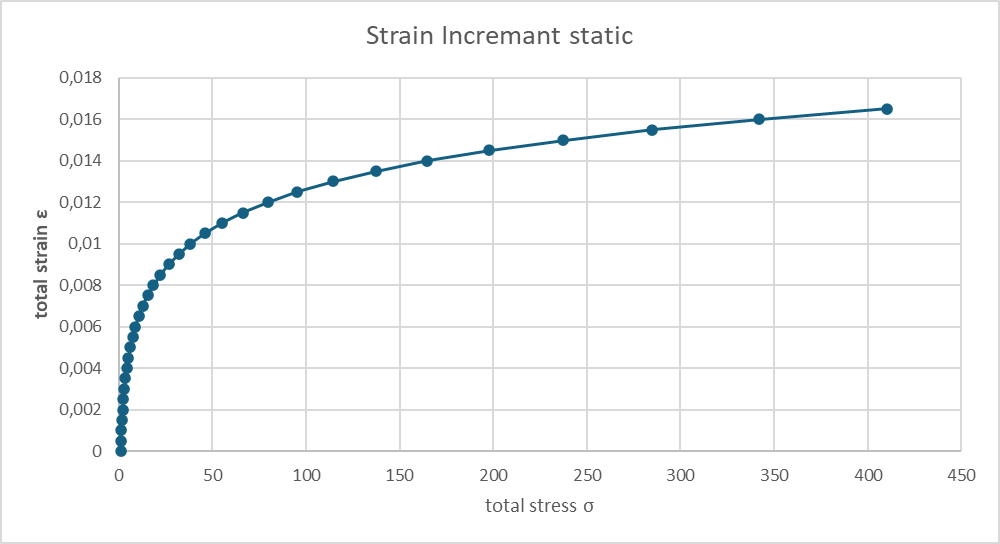

# Vorhersage des Ödometerversuches implementiert mit PINA
Ziel war die Implementierung eines neuronalen Netzwerks zur Modellierung des Ödometerversuchs. Dabei wurden gegebene Input-Parameter verarbeitet, um Output-Parameter vorherzusagen. Die physikalischen Rahmenbedingungen wurden zunächst auf Null gesetzt, sodass das Modell ausschließlich auf der KI-basierten Struktur arbeitet, ohne physikalische Optimierungen durch Physical Informed Neural Networks (PINNs).
<br>
Diese grundlegende Umsetzung bildet die Basis für weiterführende Optimierungen, wie die Integration physikalischer Gesetzmäßigkeiten, die jedoch nicht Teil des initialen Arbeitsauftrags waren.

### Was ist PINA?
PINA ist eine Open-Source-Python-Bibliothek, die eine intuitive Schnittstelle zur Lösung von Differentialgleichungen bietet, indem sie Physik-informierte Neuronale Netze (PINNs), Neuronale Operatoren (NOs) oder eine Kombination aus beiden verwendet. Basierend auf PyTorch und PyTorch Lightning ermöglicht PINA die formale Darstellung spezifischer (differentieller) Probleme und deren Lösung mittels neuronaler Netze.<br><br>
<strong>Hauptmerkmale von PINA:</strong>

- <span style="color:gray;"><i>Problemformulierung: Ermöglicht die Übersetzung mathematischer Gleichungen in Python-Code, um das Differentialproblem zu definieren.</i></span>
    - <small><i>→ In diesem Arbeitsauftrag nicht notwendig, da das neuronale Netzwerk ohne physikalische Gesetzmäßigkeiten trainiert wurde.</i></small>
- Modelltraining: Bietet Werkzeuge zum Training neuronaler Netze zur Lösung des definierten Problems.
- Lösungsauswertung: Erlaubt die Visualisierung und Analyse der approximierten Lösungen.

<small><i>Hinweis: Die physikalische Modellierung und die Einbindung von Differentialgleichungen zur Optimierung des Netzwerks (z. B. mittels PINNs) war nicht Teil dieses Arbeitsauftrags, könnte aber in einem späteren Schritt ergänzt werden.</i></small>
## Grundlagen
In diesem Notebook wird der Ödometerversuch <strong>ohne</strong> Randbedingungen betrachtet. Es werden vorberechnetet Daten aus der Exceltabelle `files/oedometer/oedo_trainingsdata.xlsx` verwendet.<br>
#### Das Problem ist wie folgt definiert:
$$
\begin{array}{rcl}
    \sigma_{t+1} & = & \sigma_{t}+\Delta\sigma \\ \\
    \Delta\sigma & = & E_s\cdot \Delta\epsilon \\ 
    E_s & = & \frac{1+e_0}{C_c} \cdot \sigma_t
\end{array}
\hspace{2cm}
\begin{array}{l}
    \textbf{Annahmen:} \\ \\
    \text{Startwert d. Iteration: } \sigma_0 = 1,00 \\ 
    e_0 = 1,00 \\ 
    C_c = 0,005 \\
    \Delta\epsilon = 0,0005
\end{array}
$$
Bedingung: $0 = \sigma_t+\Delta\sigma-\sigma_{t+1}$
<div = style="text-align: center;">
    
</div>

<br> 

Um das PINA-Model zu testen werden wir folgende vorberechnete Werte verwenden: `Input` { $\sigma_t$ ; $\Delta\epsilon$ }, `Output` { $\sigma_{t+1}$ }.
<br>
### Variablendeklaration
- $\sigma_t$ = `sigma_0`
- $\Delta\epsilon$ = `delta_epsilon`
- $\sigma_{t+1}$ = `sigma_1`
## Einstellungen und Utilities


```python
from IPython.display import display, Markdown

# Debugger: Aktiviert
debug_mode = True
# Normalisierung der Daten: Deaktiviert
normalize_data = False
```

## Laden der Daten aus `oedo_trainingsdata.xlsx`


```python
import pandas as pd
import numpy as np
from sympy.integrals.heurisch import components

file_path = "files/oedometer/oedo_trainingsdata.xlsx"
sheet_name = "Res"

df = pd.read_excel(file_path, sheet_name=sheet_name)

# Dynamische Ermittlung der letzten Zeile mit Daten
row_start_range = 0  # Startet bei Zeile 6 (0-basiert)
row_end_range = df.dropna(how="all").last_valid_index() + 1  # Letzte Zeile mit Daten

# Spaltenauswahl Spalte B, D und E
selected_columns = [1, 3, 5]  # Spalten-Indices

# Daten extrahieren
data_subset = df.iloc[row_start_range:row_end_range, selected_columns]

# Daten als dict speichern
data_dict = {col: np.array(data_subset[col]) for col in data_subset.columns}

if debug_mode:
    print('‼️Geladene Exceldaten')
    print(data_dict)
```

    ‼️Geladene Exceldaten
    {'sigma_0': array([ 1.        ,  1.2       ,  1.44      ,  1.728     ,  2.0736    ,
            2.48832   ,  2.985984  ,  3.5831808 ,  4.29981696,  5.15978035,
            6.19173642,  7.43008371,  8.91610045, 10.69932054, 12.83918465,
           15.40702157, 18.48842589, 22.18611107, 26.62333328, 31.94799994]), 'delta_epsilon': array([0.0005, 0.0005, 0.0005, 0.0005, 0.0005, 0.0005, 0.0005, 0.0005,
           0.0005, 0.0005, 0.0005, 0.0005, 0.0005, 0.0005, 0.0005, 0.0005,
           0.0005, 0.0005, 0.0005, 0.0005]), 'sigma_1': array([0.2       , 0.24      , 0.288     , 0.3456    , 0.41472   ,
           0.497664  , 0.5971968 , 0.71663616, 0.85996339, 1.03195607,
           1.23834728, 1.48601674, 1.78322009, 2.13986411, 2.56783693,
           3.08140431, 3.69768518, 4.43722221, 5.32466666, 6.38959999])}
    

<link rel="stylesheet" href="https://cdnjs.cloudflare.com/ajax/libs/font-awesome/4.7.0/css/font-awesome.min.css">

## Daten normalisieren
Die Normalisierung von Daten für neuronale Netze bedeutet, dass Eingabedaten auf eine vergleichbare Skala gebracht werden, um das Training stabiler und effizienter zu machen. Hier verwendete Methode:
- Min-Max-Skalierung: Werte auf einen Bereich (0 bis 1) bringen.  <i class="fa fa-info"> [Wiki](https://en.wikipedia.org/wiki/Feature_scaling#Methods)</i>


```python
if normalize_data:
    data_dict.update({'sigma_0_raw': data_dict.pop('sigma_0')})
    data_dict.update({'sigma_1_raw': data_dict.pop('sigma_1')})
    
    sigma_0_min, sigma_0_max = data_dict['sigma_0_raw'].min(), data_dict['sigma_0_raw'].max()
    sigma_1_min, sigma_1_max = data_dict['sigma_1_raw'].min(), data_dict['sigma_1_raw'].max()
    
    # Min-Max-Normalisierung
    data_dict['sigma_0'] = (data_dict['sigma_0_raw'] - sigma_0_min) / (sigma_0_max - sigma_0_min)
    data_dict['sigma_1'] = (data_dict['sigma_1_raw'] - sigma_1_min) / (sigma_1_max - sigma_1_min)
    print('‼️Tabellenwerte des Oedometerversuches normalisiert.')
else:
    print('‼️ Es wurde keine Normalisierung der Werte vorgenommen.')
```

    ‼️ Es wurde keine Normalisierung der Werte vorgenommen.
    

## **Datenvorbereitung für PINA mit LabelTensor**
In diesem Code werden die Eingabedaten aus `data_dict` als **LabelTensor** gespeichert, um sie strukturiert und mit benannten Dimensionen für das neuronale Netz in PINA bereitzustellen.  

- `sigma_0_train`, `delta_epsilon_train` und `sigma_1_train` werden als **einzelne beschriftete Tensoren** erstellt.  
- `input_points_combined` kombiniert `sigma_0` und `delta_epsilon` in einem **2D-Tensor** für das Training.  
- `LabelTensor` erleichtert die Nutzung der Daten in PINA, indem es Variablen klar zuordnet und mit physischen Größen verknüpft.

**Mehr zu `LabelTensor`:**  
[PINA Documentation – LabelTensor](https://mathlab.github.io/PINA/_rst/label_tensor.html)


```python
import torch
from pina.utils import LabelTensor
from torch import tensor

# Beispiel-Daten
sigma_0_train = LabelTensor(tensor(data_dict['sigma_0'], dtype=torch.float).unsqueeze(-1), ['sigma_0'])
delta_epsilon_train = LabelTensor(tensor(data_dict['delta_epsilon'], dtype=torch.float).unsqueeze(-1), ['delta_epsilon'])
sigma_1_train = LabelTensor(tensor(data_dict['sigma_1'], dtype=torch.float).unsqueeze(-1), ['sigma_1'])

# Kombinieren der Trainingsdaten (Verwendung von 'np.column_stack' für bessere Performance)
input_points_combined = LabelTensor(torch.tensor(np.column_stack([data_dict['sigma_0'], data_dict['delta_epsilon']]), dtype=torch.float), ['sigma_0', 'delta_epsilon'])

if debug_mode:
    print('‼️Data Loaded')
    print(f' sigma_0: {sigma_0_train.size()}')
    print(f' delta_epsilon: {delta_epsilon_train.shape}')
    print(f' sigma_0 und delta_epsilon combined: {input_points_combined.size()}')
    print(f' sigma_1: {sigma_1_train.shape}')
```

    ‼️Data Loaded
     sigma_0: torch.Size([20, 1])
     delta_epsilon: torch.Size([20, 1])
     sigma_0 und delta_epsilon combined: torch.Size([20, 2])
     sigma_1: torch.Size([20, 1])
    

### **Definition eines einfachen PINN-Problems in PINA**  
Dieser Code definiert ein **Physics-Informed Neural Network (PINN)**-Problem mithilfe der PINA-Bibliothek.  
 
- **Klassenstruktur (`SimpleODE`)**: Erbt von `AbstractProblem` und spezifiziert die Eingabe- und Ausgabevariablen basierend auf `LabelTensor`.
    - [PINA-Dokumentation - AbstractProblem](https://mathlab.github.io/PINA/_rst/problem/abstractproblem.html) 
- **Definitionsbereich (`domain`)**: Der Wertebereich der Eingabevariablen (`sigma_0`, `delta_epsilon`) wird als `CartesianDomain` festgelegt.
    - **Hinweis:** `domain` muss immer definiert sein, selbst wenn sie nicht direkt zur Datengenerierung verwendet wird.  
    - [PINA-Dokumentation - CartesianDomain](https://mathlab.github.io/PINA/_rst/geometry/cartesian.html) 
- **Randbedingungen (`conditions`)**: Die echten Messwerte (`in sigma_0, delta_epsilon` `out sigma_1_train`) werden als Randbedingung (`Condition`) für das Modell definiert.
    - [PINA-Dokumentation - Condition](https://mathlab.github.io/PINA/_rst/condition.html) 
- **"Wahre Lösung" (`truth_solution`)**: Falls erforderlich, kann eine analytische Lösung (hier `torch.exp(...)`) zur Validierung genutzt werden.
    - **Hinweis:** Funktioniert in unserem Fall nicht, da die Implementierung nicht für reine Input und Outpunkt Punkte implementiert ist.
    - [PINA-Tutorial - Physics Informed Neural Networks on PINA](https://mathlab.github.io/PINA/_rst/tutorials/tutorial1/tutorial.html) 
- **Probleminstanz (`problem = SimpleODE()`)**: Erstellt das Problem, das für das Training eines PINN verwendet wird.  


```python
from pina.problem import AbstractProblem
from pina.geometry import CartesianDomain
from pina.equation import Equation
from pina import Condition
class SimpleODE(AbstractProblem):

    # Definition der Eingabe- und Ausgabevariablen basierend auf LabelTensor
    input_variables = input_points_combined.labels
    output_variables = sigma_1_train.labels

    # Wertebereich
    domain = CartesianDomain({'sigma_0': [0, 1], 'delta_epsilon': [0, 1]})  # Wertebereich immer definieren!

    # defining the ode equation
    def check_equation(input_, output_):

        # computing the derivative
        sigma_t = input_.extract(['sigma_0'])
        delta_epsilon = input_.extract(['delta_epsilon'])
        sigma_t_p1 = output_.extract(['sigma_1'])

        print(f'sigma_t : {str(sigma_t)}')
        print(f'delta_epsilon : {str(delta_epsilon)}')
        print(f'sigma_t_p1 : {str(sigma_t_p1)}')
        
        return sigma_t + ( 1 + 1 ) / 0.005 * sigma_t - sigma_t_p1
    
    # Definition der Randbedingungen und (hier: nur) vorberechnetet Punkte
    conditions = {
        'data': Condition(input_points=input_points_combined, output_points=sigma_1_train),
        'zero_stress': Condition(input_points=input_points_combined, equation=Equation(check_equation)),
    }

    output_pts=sigma_1_train

    # Methode zur Definition der "wahren Lösung" des Problems
    def truth_solution(self, pts):
        return torch.exp(pts.extract(['sigma_0']))

# Problem-Instanz erzeugen
problem = SimpleODE()

# Datengenerierung, falls Randbedingungen definiert
# problem.discretise_domain(n=993, mode='random', variables='all', locations='all') # Notwendig, wenn "input_pts" und "output_pts" nicht vorgegeben sind

if debug_mode:
    # Debugging-Ausgaben
    print("‼️Geladene Input Variablen: ", problem.input_variables)
    print("‼️Geladene Output Variablen: ", problem.output_variables)
    print('‼️Input points:', problem.input_pts)
```

    ‼️Geladene Input Variablen:  ['sigma_0', 'delta_epsilon']
    ‼️Geladene Output Variablen:  ['sigma_1']
    ‼️Input points: {'data': LabelTensor([[[1.0000e+00, 5.0000e-04]],
                 [[1.2000e+00, 5.0000e-04]],
                 [[1.4400e+00, 5.0000e-04]],
                 [[1.7280e+00, 5.0000e-04]],
                 [[2.0736e+00, 5.0000e-04]],
                 [[2.4883e+00, 5.0000e-04]],
                 [[2.9860e+00, 5.0000e-04]],
                 [[3.5832e+00, 5.0000e-04]],
                 [[4.2998e+00, 5.0000e-04]],
                 [[5.1598e+00, 5.0000e-04]],
                 [[6.1917e+00, 5.0000e-04]],
                 [[7.4301e+00, 5.0000e-04]],
                 [[8.9161e+00, 5.0000e-04]],
                 [[1.0699e+01, 5.0000e-04]],
                 [[1.2839e+01, 5.0000e-04]],
                 [[1.5407e+01, 5.0000e-04]],
                 [[1.8488e+01, 5.0000e-04]],
                 [[2.2186e+01, 5.0000e-04]],
                 [[2.6623e+01, 5.0000e-04]],
                 [[3.1948e+01, 5.0000e-04]]]), 'zero_stress': LabelTensor([[[1.0000e+00, 5.0000e-04]],
                 [[1.2000e+00, 5.0000e-04]],
                 [[1.4400e+00, 5.0000e-04]],
                 [[1.7280e+00, 5.0000e-04]],
                 [[2.0736e+00, 5.0000e-04]],
                 [[2.4883e+00, 5.0000e-04]],
                 [[2.9860e+00, 5.0000e-04]],
                 [[3.5832e+00, 5.0000e-04]],
                 [[4.2998e+00, 5.0000e-04]],
                 [[5.1598e+00, 5.0000e-04]],
                 [[6.1917e+00, 5.0000e-04]],
                 [[7.4301e+00, 5.0000e-04]],
                 [[8.9161e+00, 5.0000e-04]],
                 [[1.0699e+01, 5.0000e-04]],
                 [[1.2839e+01, 5.0000e-04]],
                 [[1.5407e+01, 5.0000e-04]],
                 [[1.8488e+01, 5.0000e-04]],
                 [[2.2186e+01, 5.0000e-04]],
                 [[2.6623e+01, 5.0000e-04]],
                 [[3.1948e+01, 5.0000e-04]]])}
    

## Visualisierung Sampling
Darstellung Input: `sigma_0` und `delta_epsilon`


```python
from pina import Plotter

pl = Plotter()
pl.plot_samples(problem=problem, filename='./graph/visual_sampling.png', variables=['delta_epsilon','sigma_0'])
display(Markdown(''))
```


## **Training eines Physics-Informed Neural Networks (PINN) mit PINA**

Dieser Code definiert und trainiert ein **Physics-Informed Neural Network (PINN)** zur Lösung des Problems in PINA.

- **Modell (`FeedForward`)**: Ein neuronales Netz mit drei versteckten Schichten (`[50, 50, 50]`), das mit der ReLU-Aktivierungsfunktion arbeitet.
- **PINN-Objekt (`PINN`)**: Erstellt das PINN-Modell, das die physikalischen Randbedingungen des Problems berücksichtigt.
- **TensorBoard-Logger (`TensorBoardLogger`)**: Speichert Trainingsmetriken zur Visualisierung.
- **Trainer (`Trainer`)**: Führt das Training für 1500 Epochen mit Batch-Größe 10 durch.
- **Training starten (`trainer.train()`)**: Startet den Optimierungsprozess und protokolliert die Metriken.

Am Ende wird die **finale Loss-Funktion** ausgegeben, um die Trainingsqualität zu bewerten.

**Mehr zu `Trainer`:**  
[PINA-Dokumentation – Trainer](https://mathlab.github.io/PINA/_rst/trainer.html)


```python
from pina import Trainer
from pina.solvers import PINN
from pina.model import FeedForward
from pina.callbacks import MetricTracker
import torch
from pytorch_lightning.loggers import TensorBoardLogger  # Import TensorBoard Logger

if debug_mode:
    print('Debugging Info:')
    # Überprüfen der Größe der Eingabepunkte und Ausgabepunkte
    print("‼️Länge der Eingabepunkte (input_pts):", len(problem.input_pts['data']))
    print("‼️Länge der Ausgabepunkte (output_pts):", len(problem.output_pts))

# Model erstellen
model = FeedForward(
    layers=[50, 50, 50],
    func=torch.nn.ReLU,
    output_dimensions=len(problem.output_variables),
    input_dimensions=len(problem.input_variables)
)

# PINN-Objekt erstellen
pinn = PINN(problem, model)

# TensorBoard-Logger
logger = TensorBoardLogger("tensorboard_logs", name="pina_experiment")

# Trainer erstellen mit TensorBoard-Logger
trainer = Trainer(
    solver=pinn,
    max_epochs=50,
    callbacks=[MetricTracker()],
    batch_size=10,
    accelerator='cpu',
    logger=logger,
    enable_model_summary=False,
)


# Training starten
trainer.train()

print('\nFinale Loss Werte')
# Inspect final loss
trainer.logged_metrics
```

    Debugging Info:
    ‼️Länge der Eingabepunkte (input_pts): 20
    ‼️Länge der Ausgabepunkte (output_pts): 20
    

    GPU available: False, used: False
    TPU available: False, using: 0 TPU cores
    HPU available: False, using: 0 HPUs
    C:\Users\hab185\Documents\00_Tim\01_Implementierung\pina_oedometer\venv\Lib\site-packages\pytorch_lightning\loops\fit_loop.py:310: The number of training batches (4) is smaller than the logging interval Trainer(log_every_n_steps=50). Set a lower value for log_every_n_steps if you want to see logs for the training epoch.
    


    Training: |                                                                                      | 0/? [00:00<…


    sigma_t : labels(['sigma_0'])
    LabelTensor([[[1.0000]],
                 [[1.2000]],
                 [[1.4400]],
                 [[1.7280]],
                 [[2.0736]],
                 [[2.4883]],
                 [[2.9860]],
                 [[3.5832]],
                 [[4.2998]],
                 [[5.1598]]], grad_fn=<AliasBackward0>)
    delta_epsilon : labels(['delta_epsilon'])
    LabelTensor([[[0.0005]],
                 [[0.0005]],
                 [[0.0005]],
                 [[0.0005]],
                 [[0.0005]],
                 [[0.0005]],
                 [[0.0005]],
                 [[0.0005]],
                 [[0.0005]],
                 [[0.0005]]], grad_fn=<AliasBackward0>)
    sigma_t_p1 : labels(['sigma_1'])
    LabelTensor([[[0.0812]],
                 [[0.0748]],
                 [[0.0695]],
                 [[0.0623]],
                 [[0.0595]],
                 [[0.0577]],
                 [[0.0558]],
                 [[0.0543]],
                 [[0.0534]],
                 [[0.0559]]], grad_fn=<AliasBackward0>)
    sigma_t : labels(['sigma_0'])
    LabelTensor([[[ 6.1917]],
                 [[ 7.4301]],
                 [[ 8.9161]],
                 [[10.6993]],
                 [[12.8392]],
                 [[15.4070]],
                 [[18.4884]],
                 [[22.1861]],
                 [[26.6233]],
                 [[31.9480]]], grad_fn=<AliasBackward0>)
    delta_epsilon : labels(['delta_epsilon'])
    LabelTensor([[[0.0005]],
                 [[0.0005]],
                 [[0.0005]],
                 [[0.0005]],
                 [[0.0005]],
                 [[0.0005]],
                 [[0.0005]],
                 [[0.0005]],
                 [[0.0005]],
                 [[0.0005]]], grad_fn=<AliasBackward0>)
    sigma_t_p1 : labels(['sigma_1'])
    LabelTensor([[[0.1679]],
                 [[0.1936]],
                 [[0.2248]],
                 [[0.2623]],
                 [[0.3073]],
                 [[0.3614]],
                 [[0.4264]],
                 [[0.5038]],
                 [[0.5951]],
                 [[0.7026]]], grad_fn=<AliasBackward0>)
    sigma_t : labels(['sigma_0'])
    LabelTensor([[[1.0000]],
                 [[1.2000]],
                 [[1.4400]],
                 [[1.7280]],
                 [[2.0736]],
                 [[2.4883]],
                 [[2.9860]],
                 [[3.5832]],
                 [[4.2998]],
                 [[5.1598]]], grad_fn=<AliasBackward0>)
    delta_epsilon : labels(['delta_epsilon'])
    LabelTensor([[[0.0005]],
                 [[0.0005]],
                 [[0.0005]],
                 [[0.0005]],
                 [[0.0005]],
                 [[0.0005]],
                 [[0.0005]],
                 [[0.0005]],
                 [[0.0005]],
                 [[0.0005]]], grad_fn=<AliasBackward0>)
    sigma_t_p1 : labels(['sigma_1'])
    LabelTensor([[[0.1576]],
                 [[0.1607]],
                 [[0.1682]],
                 [[0.1788]],
                 [[0.1906]],
                 [[0.2076]],
                 [[0.2301]],
                 [[0.2561]],
                 [[0.2876]],
                 [[0.3244]]], grad_fn=<AliasBackward0>)
    sigma_t : labels(['sigma_0'])
    LabelTensor([[[ 6.1917]],
                 [[ 7.4301]],
                 [[ 8.9161]],
                 [[10.6993]],
                 [[12.8392]],
                 [[15.4070]],
                 [[18.4884]],
                 [[22.1861]],
                 [[26.6233]],
                 [[31.9480]]], grad_fn=<AliasBackward0>)
    delta_epsilon : labels(['delta_epsilon'])
    LabelTensor([[[0.0005]],
                 [[0.0005]],
                 [[0.0005]],
                 [[0.0005]],
                 [[0.0005]],
                 [[0.0005]],
                 [[0.0005]],
                 [[0.0005]],
                 [[0.0005]],
                 [[0.0005]]], grad_fn=<AliasBackward0>)
    sigma_t_p1 : labels(['sigma_1'])
    LabelTensor([[[0.4245]],
                 [[0.4956]],
                 [[0.5822]],
                 [[0.6865]],
                 [[0.8117]],
                 [[0.9607]],
                 [[1.1374]],
                 [[1.3483]],
                 [[1.6014]],
                 [[1.9051]]], grad_fn=<AliasBackward0>)
    sigma_t : labels(['sigma_0'])
    LabelTensor([[[1.0000]],
                 [[1.2000]],
                 [[1.4400]],
                 [[1.7280]],
                 [[2.0736]],
                 [[2.4883]],
                 [[2.9860]],
                 [[3.5832]],
                 [[4.2998]],
                 [[5.1598]]], grad_fn=<AliasBackward0>)
    delta_epsilon : labels(['delta_epsilon'])
    LabelTensor([[[0.0005]],
                 [[0.0005]],
                 [[0.0005]],
                 [[0.0005]],
                 [[0.0005]],
                 [[0.0005]],
                 [[0.0005]],
                 [[0.0005]],
                 [[0.0005]],
                 [[0.0005]]], grad_fn=<AliasBackward0>)
    sigma_t_p1 : labels(['sigma_1'])
    LabelTensor([[[0.2170]],
                 [[0.2259]],
                 [[0.2435]],
                 [[0.2638]],
                 [[0.2873]],
                 [[0.3176]],
                 [[0.3554]],
                 [[0.4028]],
                 [[0.4600]],
                 [[0.5342]]], grad_fn=<AliasBackward0>)
    sigma_t : labels(['sigma_0'])
    LabelTensor([[[ 6.1917]],
                 [[ 7.4301]],
                 [[ 8.9161]],
                 [[10.6993]],
                 [[12.8392]],
                 [[15.4070]],
                 [[18.4884]],
                 [[22.1861]],
                 [[26.6233]],
                 [[31.9480]]], grad_fn=<AliasBackward0>)
    delta_epsilon : labels(['delta_epsilon'])
    LabelTensor([[[0.0005]],
                 [[0.0005]],
                 [[0.0005]],
                 [[0.0005]],
                 [[0.0005]],
                 [[0.0005]],
                 [[0.0005]],
                 [[0.0005]],
                 [[0.0005]],
                 [[0.0005]]], grad_fn=<AliasBackward0>)
    sigma_t_p1 : labels(['sigma_1'])
    LabelTensor([[[0.6780]],
                 [[0.7937]],
                 [[0.9314]],
                 [[1.0966]],
                 [[1.2942]],
                 [[1.5304]],
                 [[1.8114]],
                 [[2.1482]],
                 [[2.5525]],
                 [[3.0376]]], grad_fn=<AliasBackward0>)
    sigma_t : labels(['sigma_0'])
    LabelTensor([[[1.0000]],
                 [[1.2000]],
                 [[1.4400]],
                 [[1.7280]],
                 [[2.0736]],
                 [[2.4883]],
                 [[2.9860]],
                 [[3.5832]],
                 [[4.2998]],
                 [[5.1598]]], grad_fn=<AliasBackward0>)
    delta_epsilon : labels(['delta_epsilon'])
    LabelTensor([[[0.0005]],
                 [[0.0005]],
                 [[0.0005]],
                 [[0.0005]],
                 [[0.0005]],
                 [[0.0005]],
                 [[0.0005]],
                 [[0.0005]],
                 [[0.0005]],
                 [[0.0005]]], grad_fn=<AliasBackward0>)
    sigma_t_p1 : labels(['sigma_1'])
    LabelTensor([[[0.2748]],
                 [[0.2959]],
                 [[0.3215]],
                 [[0.3519]],
                 [[0.3908]],
                 [[0.4364]],
                 [[0.4902]],
                 [[0.5575]],
                 [[0.6445]],
                 [[0.7487]]], grad_fn=<AliasBackward0>)
    sigma_t : labels(['sigma_0'])
    LabelTensor([[[ 6.1917]],
                 [[ 7.4301]],
                 [[ 8.9161]],
                 [[10.6993]],
                 [[12.8392]],
                 [[15.4070]],
                 [[18.4884]],
                 [[22.1861]],
                 [[26.6233]],
                 [[31.9480]]], grad_fn=<AliasBackward0>)
    delta_epsilon : labels(['delta_epsilon'])
    LabelTensor([[[0.0005]],
                 [[0.0005]],
                 [[0.0005]],
                 [[0.0005]],
                 [[0.0005]],
                 [[0.0005]],
                 [[0.0005]],
                 [[0.0005]],
                 [[0.0005]],
                 [[0.0005]]], grad_fn=<AliasBackward0>)
    sigma_t_p1 : labels(['sigma_1'])
    LabelTensor([[[0.9281]],
                 [[1.0858]],
                 [[1.2743]],
                 [[1.5002]],
                 [[1.7691]],
                 [[2.0903]],
                 [[2.4783]],
                 [[2.9439]],
                 [[3.5027]],
                 [[4.1732]]], grad_fn=<AliasBackward0>)
    sigma_t : labels(['sigma_0'])
    LabelTensor([[[1.0000]],
                 [[1.2000]],
                 [[1.4400]],
                 [[1.7280]],
                 [[2.0736]],
                 [[2.4883]],
                 [[2.9860]],
                 [[3.5832]],
                 [[4.2998]],
                 [[5.1598]]], grad_fn=<AliasBackward0>)
    delta_epsilon : labels(['delta_epsilon'])
    LabelTensor([[[0.0005]],
                 [[0.0005]],
                 [[0.0005]],
                 [[0.0005]],
                 [[0.0005]],
                 [[0.0005]],
                 [[0.0005]],
                 [[0.0005]],
                 [[0.0005]],
                 [[0.0005]]], grad_fn=<AliasBackward0>)
    sigma_t_p1 : labels(['sigma_1'])
    LabelTensor([[[0.3450]],
                 [[0.3729]],
                 [[0.4060]],
                 [[0.4474]],
                 [[0.4985]],
                 [[0.5604]],
                 [[0.6344]],
                 [[0.7245]],
                 [[0.8328]],
                 [[0.9667]]], grad_fn=<AliasBackward0>)
    sigma_t : labels(['sigma_0'])
    LabelTensor([[[ 6.1917]],
                 [[ 7.4301]],
                 [[ 8.9161]],
                 [[10.6993]],
                 [[12.8392]],
                 [[15.4070]],
                 [[18.4884]],
                 [[22.1861]],
                 [[26.6233]],
                 [[31.9480]]], grad_fn=<AliasBackward0>)
    delta_epsilon : labels(['delta_epsilon'])
    LabelTensor([[[0.0005]],
                 [[0.0005]],
                 [[0.0005]],
                 [[0.0005]],
                 [[0.0005]],
                 [[0.0005]],
                 [[0.0005]],
                 [[0.0005]],
                 [[0.0005]],
                 [[0.0005]]], grad_fn=<AliasBackward0>)
    sigma_t_p1 : labels(['sigma_1'])
    LabelTensor([[[1.1883]],
                 [[1.3923]],
                 [[1.6372]],
                 [[1.9298]],
                 [[2.2806]],
                 [[2.6981]],
                 [[3.1988]],
                 [[3.7996]],
                 [[4.5207]],
                 [[5.3859]]], grad_fn=<AliasBackward0>)
    sigma_t : labels(['sigma_0'])
    LabelTensor([[[1.0000]],
                 [[1.2000]],
                 [[1.4400]],
                 [[1.7280]],
                 [[2.0736]],
                 [[2.4883]],
                 [[2.9860]],
                 [[3.5832]],
                 [[4.2998]],
                 [[5.1598]]], grad_fn=<AliasBackward0>)
    delta_epsilon : labels(['delta_epsilon'])
    LabelTensor([[[0.0005]],
                 [[0.0005]],
                 [[0.0005]],
                 [[0.0005]],
                 [[0.0005]],
                 [[0.0005]],
                 [[0.0005]],
                 [[0.0005]],
                 [[0.0005]],
                 [[0.0005]]], grad_fn=<AliasBackward0>)
    sigma_t_p1 : labels(['sigma_1'])
    LabelTensor([[[0.4232]],
                 [[0.4578]],
                 [[0.5009]],
                 [[0.5544]],
                 [[0.6185]],
                 [[0.6965]],
                 [[0.7881]],
                 [[0.9016]],
                 [[1.0402]],
                 [[1.2074]]], grad_fn=<AliasBackward0>)
    sigma_t : labels(['sigma_0'])
    LabelTensor([[[ 6.1917]],
                 [[ 7.4301]],
                 [[ 8.9161]],
                 [[10.6993]],
                 [[12.8392]],
                 [[15.4070]],
                 [[18.4884]],
                 [[22.1861]],
                 [[26.6233]],
                 [[31.9480]]], grad_fn=<AliasBackward0>)
    delta_epsilon : labels(['delta_epsilon'])
    LabelTensor([[[0.0005]],
                 [[0.0005]],
                 [[0.0005]],
                 [[0.0005]],
                 [[0.0005]],
                 [[0.0005]],
                 [[0.0005]],
                 [[0.0005]],
                 [[0.0005]],
                 [[0.0005]]], grad_fn=<AliasBackward0>)
    sigma_t_p1 : labels(['sigma_1'])
    LabelTensor([[[1.4737]],
                 [[1.7294]],
                 [[2.0372]],
                 [[2.4054]],
                 [[2.8445]],
                 [[3.3707]],
                 [[4.0022]],
                 [[4.7600]],
                 [[5.6694]],
                 [[6.7606]]], grad_fn=<AliasBackward0>)
    sigma_t : labels(['sigma_0'])
    LabelTensor([[[1.0000]],
                 [[1.2000]],
                 [[1.4400]],
                 [[1.7280]],
                 [[2.0736]],
                 [[2.4883]],
                 [[2.9860]],
                 [[3.5832]],
                 [[4.2998]],
                 [[5.1598]]], grad_fn=<AliasBackward0>)
    delta_epsilon : labels(['delta_epsilon'])
    LabelTensor([[[0.0005]],
                 [[0.0005]],
                 [[0.0005]],
                 [[0.0005]],
                 [[0.0005]],
                 [[0.0005]],
                 [[0.0005]],
                 [[0.0005]],
                 [[0.0005]],
                 [[0.0005]]], grad_fn=<AliasBackward0>)
    sigma_t_p1 : labels(['sigma_1'])
    LabelTensor([[[0.5089]],
                 [[0.5521]],
                 [[0.6067]],
                 [[0.6731]],
                 [[0.7529]],
                 [[0.8494]],
                 [[0.9634]],
                 [[1.1063]],
                 [[1.2792]],
                 [[1.4851]]], grad_fn=<AliasBackward0>)
    sigma_t : labels(['sigma_0'])
    LabelTensor([[[ 6.1917]],
                 [[ 7.4301]],
                 [[ 8.9161]],
                 [[10.6993]],
                 [[12.8392]],
                 [[15.4070]],
                 [[18.4884]],
                 [[22.1861]],
                 [[26.6233]],
                 [[31.9480]]], grad_fn=<AliasBackward0>)
    delta_epsilon : labels(['delta_epsilon'])
    LabelTensor([[[0.0005]],
                 [[0.0005]],
                 [[0.0005]],
                 [[0.0005]],
                 [[0.0005]],
                 [[0.0005]],
                 [[0.0005]],
                 [[0.0005]],
                 [[0.0005]],
                 [[0.0005]]], grad_fn=<AliasBackward0>)
    sigma_t_p1 : labels(['sigma_1'])
    LabelTensor([[[1.8149]],
                 [[2.1290]],
                 [[2.5055]],
                 [[2.9546]],
                 [[3.4935]],
                 [[4.1401]],
                 [[4.9162]],
                 [[5.8485]],
                 [[6.9710]],
                 [[8.3181]]], grad_fn=<AliasBackward0>)
    sigma_t : labels(['sigma_0'])
    LabelTensor([[[1.0000]],
                 [[1.2000]],
                 [[1.4400]],
                 [[1.7280]],
                 [[2.0736]],
                 [[2.4883]],
                 [[2.9860]],
                 [[3.5832]],
                 [[4.2998]],
                 [[5.1598]]], grad_fn=<AliasBackward0>)
    delta_epsilon : labels(['delta_epsilon'])
    LabelTensor([[[0.0005]],
                 [[0.0005]],
                 [[0.0005]],
                 [[0.0005]],
                 [[0.0005]],
                 [[0.0005]],
                 [[0.0005]],
                 [[0.0005]],
                 [[0.0005]],
                 [[0.0005]]], grad_fn=<AliasBackward0>)
    sigma_t_p1 : labels(['sigma_1'])
    LabelTensor([[[0.6083]],
                 [[0.6629]],
                 [[0.7295]],
                 [[0.8108]],
                 [[0.9077]],
                 [[1.0252]],
                 [[1.1687]],
                 [[1.3453]],
                 [[1.5579]],
                 [[1.8112]]], grad_fn=<AliasBackward0>)
    sigma_t : labels(['sigma_0'])
    LabelTensor([[[ 6.1917]],
                 [[ 7.4301]],
                 [[ 8.9161]],
                 [[10.6993]],
                 [[12.8392]],
                 [[15.4070]],
                 [[18.4884]],
                 [[22.1861]],
                 [[26.6233]],
                 [[31.9480]]], grad_fn=<AliasBackward0>)
    delta_epsilon : labels(['delta_epsilon'])
    LabelTensor([[[0.0005]],
                 [[0.0005]],
                 [[0.0005]],
                 [[0.0005]],
                 [[0.0005]],
                 [[0.0005]],
                 [[0.0005]],
                 [[0.0005]],
                 [[0.0005]],
                 [[0.0005]]], grad_fn=<AliasBackward0>)
    sigma_t_p1 : labels(['sigma_1'])
    LabelTensor([[[ 2.2087]],
                 [[ 2.5936]],
                 [[ 3.0538]],
                 [[ 3.6060]],
                 [[ 4.2686]],
                 [[ 5.0638]],
                 [[ 6.0180]],
                 [[ 7.1631]],
                 [[ 8.5372]],
                 [[10.1861]]], grad_fn=<AliasBackward0>)
    sigma_t : labels(['sigma_0'])
    LabelTensor([[[1.0000]],
                 [[1.2000]],
                 [[1.4400]],
                 [[1.7280]],
                 [[2.0736]],
                 [[2.4883]],
                 [[2.9860]],
                 [[3.5832]],
                 [[4.2998]],
                 [[5.1598]]], grad_fn=<AliasBackward0>)
    delta_epsilon : labels(['delta_epsilon'])
    LabelTensor([[[0.0005]],
                 [[0.0005]],
                 [[0.0005]],
                 [[0.0005]],
                 [[0.0005]],
                 [[0.0005]],
                 [[0.0005]],
                 [[0.0005]],
                 [[0.0005]],
                 [[0.0005]]], grad_fn=<AliasBackward0>)
    sigma_t_p1 : labels(['sigma_1'])
    LabelTensor([[[0.7249]],
                 [[0.7912]],
                 [[0.8713]],
                 [[0.9691]],
                 [[1.0864]],
                 [[1.2311]],
                 [[1.4081]],
                 [[1.6223]],
                 [[1.8793]],
                 [[2.1888]]], grad_fn=<AliasBackward0>)
    sigma_t : labels(['sigma_0'])
    LabelTensor([[[ 6.1917]],
                 [[ 7.4301]],
                 [[ 8.9161]],
                 [[10.6993]],
                 [[12.8392]],
                 [[15.4070]],
                 [[18.4884]],
                 [[22.1861]],
                 [[26.6233]],
                 [[31.9480]]], grad_fn=<AliasBackward0>)
    delta_epsilon : labels(['delta_epsilon'])
    LabelTensor([[[0.0005]],
                 [[0.0005]],
                 [[0.0005]],
                 [[0.0005]],
                 [[0.0005]],
                 [[0.0005]],
                 [[0.0005]],
                 [[0.0005]],
                 [[0.0005]],
                 [[0.0005]]], grad_fn=<AliasBackward0>)
    sigma_t_p1 : labels(['sigma_1'])
    LabelTensor([[[ 2.6667]],
                 [[ 3.1343]],
                 [[ 3.6954]],
                 [[ 4.3687]],
                 [[ 5.1767]],
                 [[ 6.1462]],
                 [[ 7.3097]],
                 [[ 8.7059]],
                 [[10.3813]],
                 [[12.3918]]], grad_fn=<AliasBackward0>)
    sigma_t : labels(['sigma_0'])
    LabelTensor([[[1.0000]],
                 [[1.2000]],
                 [[1.4400]],
                 [[1.7280]],
                 [[2.0736]],
                 [[2.4883]],
                 [[2.9860]],
                 [[3.5832]],
                 [[4.2998]],
                 [[5.1598]]], grad_fn=<AliasBackward0>)
    delta_epsilon : labels(['delta_epsilon'])
    LabelTensor([[[0.0005]],
                 [[0.0005]],
                 [[0.0005]],
                 [[0.0005]],
                 [[0.0005]],
                 [[0.0005]],
                 [[0.0005]],
                 [[0.0005]],
                 [[0.0005]],
                 [[0.0005]]], grad_fn=<AliasBackward0>)
    sigma_t_p1 : labels(['sigma_1'])
    LabelTensor([[[0.8592]],
                 [[0.9385]],
                 [[1.0353]],
                 [[1.1531]],
                 [[1.2948]],
                 [[1.4727]],
                 [[1.6854]],
                 [[1.9428]],
                 [[2.2539]],
                 [[2.6285]]], grad_fn=<AliasBackward0>)
    sigma_t : labels(['sigma_0'])
    LabelTensor([[[ 6.1917]],
                 [[ 7.4301]],
                 [[ 8.9161]],
                 [[10.6993]],
                 [[12.8392]],
                 [[15.4070]],
                 [[18.4884]],
                 [[22.1861]],
                 [[26.6233]],
                 [[31.9480]]], grad_fn=<AliasBackward0>)
    delta_epsilon : labels(['delta_epsilon'])
    LabelTensor([[[0.0005]],
                 [[0.0005]],
                 [[0.0005]],
                 [[0.0005]],
                 [[0.0005]],
                 [[0.0005]],
                 [[0.0005]],
                 [[0.0005]],
                 [[0.0005]],
                 [[0.0005]]], grad_fn=<AliasBackward0>)
    sigma_t_p1 : labels(['sigma_1'])
    LabelTensor([[[ 3.1998]],
                 [[ 3.7653]],
                 [[ 4.4438]],
                 [[ 5.2580]],
                 [[ 6.2350]],
                 [[ 7.4075]],
                 [[ 8.8144]],
                 [[10.5027]],
                 [[12.5287]],
                 [[14.9599]]], grad_fn=<AliasBackward0>)
    sigma_t : labels(['sigma_0'])
    LabelTensor([[[1.0000]],
                 [[1.2000]],
                 [[1.4400]],
                 [[1.7280]],
                 [[2.0736]],
                 [[2.4883]],
                 [[2.9860]],
                 [[3.5832]],
                 [[4.2998]],
                 [[5.1598]]], grad_fn=<AliasBackward0>)
    delta_epsilon : labels(['delta_epsilon'])
    LabelTensor([[[0.0005]],
                 [[0.0005]],
                 [[0.0005]],
                 [[0.0005]],
                 [[0.0005]],
                 [[0.0005]],
                 [[0.0005]],
                 [[0.0005]],
                 [[0.0005]],
                 [[0.0005]]], grad_fn=<AliasBackward0>)
    sigma_t_p1 : labels(['sigma_1'])
    LabelTensor([[[1.0146]],
                 [[1.1099]],
                 [[1.2255]],
                 [[1.3664]],
                 [[1.5374]],
                 [[1.7506]],
                 [[2.0061]],
                 [[2.3155]],
                 [[2.6893]],
                 [[3.1379]]], grad_fn=<AliasBackward0>)
    sigma_t : labels(['sigma_0'])
    LabelTensor([[[ 6.1917]],
                 [[ 7.4301]],
                 [[ 8.9161]],
                 [[10.6993]],
                 [[12.8392]],
                 [[15.4070]],
                 [[18.4884]],
                 [[22.1861]],
                 [[26.6233]],
                 [[31.9480]]], grad_fn=<AliasBackward0>)
    delta_epsilon : labels(['delta_epsilon'])
    LabelTensor([[[0.0005]],
                 [[0.0005]],
                 [[0.0005]],
                 [[0.0005]],
                 [[0.0005]],
                 [[0.0005]],
                 [[0.0005]],
                 [[0.0005]],
                 [[0.0005]],
                 [[0.0005]]], grad_fn=<AliasBackward0>)
    sigma_t_p1 : labels(['sigma_1'])
    LabelTensor([[[ 3.8194]],
                 [[ 4.4986]],
                 [[ 5.3135]],
                 [[ 6.2915]],
                 [[ 7.4651]],
                 [[ 8.8734]],
                 [[10.5633]],
                 [[12.5912]],
                 [[15.0247]],
                 [[17.9449]]], grad_fn=<AliasBackward0>)
    sigma_t : labels(['sigma_0'])
    LabelTensor([[[1.0000]],
                 [[1.2000]],
                 [[1.4400]],
                 [[1.7280]],
                 [[2.0736]],
                 [[2.4883]],
                 [[2.9860]],
                 [[3.5832]],
                 [[4.2998]],
                 [[5.1598]]], grad_fn=<AliasBackward0>)
    delta_epsilon : labels(['delta_epsilon'])
    LabelTensor([[[0.0005]],
                 [[0.0005]],
                 [[0.0005]],
                 [[0.0005]],
                 [[0.0005]],
                 [[0.0005]],
                 [[0.0005]],
                 [[0.0005]],
                 [[0.0005]],
                 [[0.0005]]], grad_fn=<AliasBackward0>)
    sigma_t_p1 : labels(['sigma_1'])
    LabelTensor([[[1.1953]],
                 [[1.3085]],
                 [[1.4456]],
                 [[1.6121]],
                 [[1.8185]],
                 [[2.0726]],
                 [[2.3784]],
                 [[2.7478]],
                 [[3.1932]],
                 [[3.7290]]], grad_fn=<AliasBackward0>)
    sigma_t : labels(['sigma_0'])
    LabelTensor([[[ 6.1917]],
                 [[ 7.4301]],
                 [[ 8.9161]],
                 [[10.6993]],
                 [[12.8392]],
                 [[15.4070]],
                 [[18.4884]],
                 [[22.1861]],
                 [[26.6233]],
                 [[31.9480]]], grad_fn=<AliasBackward0>)
    delta_epsilon : labels(['delta_epsilon'])
    LabelTensor([[[0.0005]],
                 [[0.0005]],
                 [[0.0005]],
                 [[0.0005]],
                 [[0.0005]],
                 [[0.0005]],
                 [[0.0005]],
                 [[0.0005]],
                 [[0.0005]],
                 [[0.0005]]], grad_fn=<AliasBackward0>)
    sigma_t_p1 : labels(['sigma_1'])
    LabelTensor([[[ 4.5387]],
                 [[ 5.3490]],
                 [[ 6.3222]],
                 [[ 7.4901]],
                 [[ 8.8916]],
                 [[10.5734]],
                 [[12.5915]],
                 [[15.0132]],
                 [[17.9194]],
                 [[21.4067]]], grad_fn=<AliasBackward0>)
    sigma_t : labels(['sigma_0'])
    LabelTensor([[[1.0000]],
                 [[1.2000]],
                 [[1.4400]],
                 [[1.7280]],
                 [[2.0736]],
                 [[2.4883]],
                 [[2.9860]],
                 [[3.5832]],
                 [[4.2998]],
                 [[5.1598]]], grad_fn=<AliasBackward0>)
    delta_epsilon : labels(['delta_epsilon'])
    LabelTensor([[[0.0005]],
                 [[0.0005]],
                 [[0.0005]],
                 [[0.0005]],
                 [[0.0005]],
                 [[0.0005]],
                 [[0.0005]],
                 [[0.0005]],
                 [[0.0005]],
                 [[0.0005]]], grad_fn=<AliasBackward0>)
    sigma_t_p1 : labels(['sigma_1'])
    LabelTensor([[[1.4045]],
                 [[1.5377]],
                 [[1.6982]],
                 [[1.8978]],
                 [[2.1440]],
                 [[2.4458]],
                 [[2.8099]],
                 [[3.2469]],
                 [[3.7772]],
                 [[4.4139]]], grad_fn=<AliasBackward0>)
    sigma_t : labels(['sigma_0'])
    LabelTensor([[[ 6.1917]],
                 [[ 7.4301]],
                 [[ 8.9161]],
                 [[10.6993]],
                 [[12.8392]],
                 [[15.4070]],
                 [[18.4884]],
                 [[22.1861]],
                 [[26.6233]],
                 [[31.9480]]], grad_fn=<AliasBackward0>)
    delta_epsilon : labels(['delta_epsilon'])
    LabelTensor([[[0.0005]],
                 [[0.0005]],
                 [[0.0005]],
                 [[0.0005]],
                 [[0.0005]],
                 [[0.0005]],
                 [[0.0005]],
                 [[0.0005]],
                 [[0.0005]],
                 [[0.0005]]], grad_fn=<AliasBackward0>)
    sigma_t_p1 : labels(['sigma_1'])
    LabelTensor([[[ 5.3721]],
                 [[ 6.3332]],
                 [[ 7.4896]],
                 [[ 8.8773]],
                 [[10.5425]],
                 [[12.5408]],
                 [[14.9387]],
                 [[17.8162]],
                 [[21.2693]],
                 [[25.4129]]], grad_fn=<AliasBackward0>)
    sigma_t : labels(['sigma_0'])
    LabelTensor([[[1.0000]],
                 [[1.2000]],
                 [[1.4400]],
                 [[1.7280]],
                 [[2.0736]],
                 [[2.4883]],
                 [[2.9860]],
                 [[3.5832]],
                 [[4.2998]],
                 [[5.1598]]], grad_fn=<AliasBackward0>)
    delta_epsilon : labels(['delta_epsilon'])
    LabelTensor([[[0.0005]],
                 [[0.0005]],
                 [[0.0005]],
                 [[0.0005]],
                 [[0.0005]],
                 [[0.0005]],
                 [[0.0005]],
                 [[0.0005]],
                 [[0.0005]],
                 [[0.0005]]], grad_fn=<AliasBackward0>)
    sigma_t_p1 : labels(['sigma_1'])
    LabelTensor([[[1.6446]],
                 [[1.8010]],
                 [[1.9900]],
                 [[2.2292]],
                 [[2.5208]],
                 [[2.8777]],
                 [[3.3082]],
                 [[3.8241]],
                 [[4.4525]],
                 [[5.2066]]], grad_fn=<AliasBackward0>)
    sigma_t : labels(['sigma_0'])
    LabelTensor([[[ 6.1917]],
                 [[ 7.4301]],
                 [[ 8.9161]],
                 [[10.6993]],
                 [[12.8392]],
                 [[15.4070]],
                 [[18.4884]],
                 [[22.1861]],
                 [[26.6233]],
                 [[31.9480]]], grad_fn=<AliasBackward0>)
    delta_epsilon : labels(['delta_epsilon'])
    LabelTensor([[[0.0005]],
                 [[0.0005]],
                 [[0.0005]],
                 [[0.0005]],
                 [[0.0005]],
                 [[0.0005]],
                 [[0.0005]],
                 [[0.0005]],
                 [[0.0005]],
                 [[0.0005]]], grad_fn=<AliasBackward0>)
    sigma_t_p1 : labels(['sigma_1'])
    LabelTensor([[[ 6.3346]],
                 [[ 7.4694]],
                 [[ 8.8372]],
                 [[10.4785]],
                 [[12.4481]],
                 [[14.8117]],
                 [[17.6479]],
                 [[21.0514]],
                 [[25.1357]],
                 [[30.0367]]], grad_fn=<AliasBackward0>)
    sigma_t : labels(['sigma_0'])
    LabelTensor([[[1.0000]],
                 [[1.2000]],
                 [[1.4400]],
                 [[1.7280]],
                 [[2.0736]],
                 [[2.4883]],
                 [[2.9860]],
                 [[3.5832]],
                 [[4.2998]],
                 [[5.1598]]], grad_fn=<AliasBackward0>)
    delta_epsilon : labels(['delta_epsilon'])
    LabelTensor([[[0.0005]],
                 [[0.0005]],
                 [[0.0005]],
                 [[0.0005]],
                 [[0.0005]],
                 [[0.0005]],
                 [[0.0005]],
                 [[0.0005]],
                 [[0.0005]],
                 [[0.0005]]], grad_fn=<AliasBackward0>)
    sigma_t_p1 : labels(['sigma_1'])
    LabelTensor([[[1.9208]],
                 [[2.1039]],
                 [[2.3304]],
                 [[2.6117]],
                 [[2.9558]],
                 [[3.3758]],
                 [[3.8821]],
                 [[4.4897]],
                 [[5.2311]],
                 [[6.1208]]], grad_fn=<AliasBackward0>)
    sigma_t : labels(['sigma_0'])
    LabelTensor([[[ 6.1917]],
                 [[ 7.4301]],
                 [[ 8.9161]],
                 [[10.6993]],
                 [[12.8392]],
                 [[15.4070]],
                 [[18.4884]],
                 [[22.1861]],
                 [[26.6233]],
                 [[31.9480]]], grad_fn=<AliasBackward0>)
    delta_epsilon : labels(['delta_epsilon'])
    LabelTensor([[[0.0005]],
                 [[0.0005]],
                 [[0.0005]],
                 [[0.0005]],
                 [[0.0005]],
                 [[0.0005]],
                 [[0.0005]],
                 [[0.0005]],
                 [[0.0005]],
                 [[0.0005]]], grad_fn=<AliasBackward0>)
    sigma_t_p1 : labels(['sigma_1'])
    LabelTensor([[[ 7.4425]],
                 [[ 8.7766]],
                 [[10.3876]],
                 [[12.3207]],
                 [[14.6405]],
                 [[17.4242]],
                 [[20.7646]],
                 [[24.7732]],
                 [[29.5834]],
                 [[35.3557]]], grad_fn=<AliasBackward0>)
    sigma_t : labels(['sigma_0'])
    LabelTensor([[[1.0000]],
                 [[1.2000]],
                 [[1.4400]],
                 [[1.7280]],
                 [[2.0736]],
                 [[2.4883]],
                 [[2.9860]],
                 [[3.5832]],
                 [[4.2998]],
                 [[5.1598]]], grad_fn=<AliasBackward0>)
    delta_epsilon : labels(['delta_epsilon'])
    LabelTensor([[[0.0005]],
                 [[0.0005]],
                 [[0.0005]],
                 [[0.0005]],
                 [[0.0005]],
                 [[0.0005]],
                 [[0.0005]],
                 [[0.0005]],
                 [[0.0005]],
                 [[0.0005]]], grad_fn=<AliasBackward0>)
    sigma_t_p1 : labels(['sigma_1'])
    LabelTensor([[[2.2383]],
                 [[2.4552]],
                 [[2.7222]],
                 [[3.0518]],
                 [[3.4564]],
                 [[3.9472]],
                 [[4.5419]],
                 [[5.2555]],
                 [[6.1256]],
                 [[7.1709]]], grad_fn=<AliasBackward0>)
    sigma_t : labels(['sigma_0'])
    LabelTensor([[[ 6.1917]],
                 [[ 7.4301]],
                 [[ 8.9161]],
                 [[10.6993]],
                 [[12.8392]],
                 [[15.4070]],
                 [[18.4884]],
                 [[22.1861]],
                 [[26.6233]],
                 [[31.9480]]], grad_fn=<AliasBackward0>)
    delta_epsilon : labels(['delta_epsilon'])
    LabelTensor([[[0.0005]],
                 [[0.0005]],
                 [[0.0005]],
                 [[0.0005]],
                 [[0.0005]],
                 [[0.0005]],
                 [[0.0005]],
                 [[0.0005]],
                 [[0.0005]],
                 [[0.0005]]], grad_fn=<AliasBackward0>)
    sigma_t_p1 : labels(['sigma_1'])
    LabelTensor([[[ 8.7154]],
                 [[10.2779]],
                 [[12.1649]],
                 [[14.4324]],
                 [[17.1534]],
                 [[20.4186]],
                 [[24.3368]],
                 [[29.0387]],
                 [[34.6810]],
                 [[41.4517]]], grad_fn=<AliasBackward0>)
    sigma_t : labels(['sigma_0'])
    LabelTensor([[[1.0000]],
                 [[1.2000]],
                 [[1.4400]],
                 [[1.7280]],
                 [[2.0736]],
                 [[2.4883]],
                 [[2.9860]],
                 [[3.5832]],
                 [[4.2998]],
                 [[5.1598]]], grad_fn=<AliasBackward0>)
    delta_epsilon : labels(['delta_epsilon'])
    LabelTensor([[[0.0005]],
                 [[0.0005]],
                 [[0.0005]],
                 [[0.0005]],
                 [[0.0005]],
                 [[0.0005]],
                 [[0.0005]],
                 [[0.0005]],
                 [[0.0005]],
                 [[0.0005]]], grad_fn=<AliasBackward0>)
    sigma_t_p1 : labels(['sigma_1'])
    LabelTensor([[[2.6026]],
                 [[2.8613]],
                 [[3.1719]],
                 [[3.5567]],
                 [[4.0307]],
                 [[4.6019]],
                 [[5.2982]],
                 [[6.1337]],
                 [[7.1497]],
                 [[8.3731]]], grad_fn=<AliasBackward0>)
    sigma_t : labels(['sigma_0'])
    LabelTensor([[[ 6.1917]],
                 [[ 7.4301]],
                 [[ 8.9161]],
                 [[10.6993]],
                 [[12.8392]],
                 [[15.4070]],
                 [[18.4884]],
                 [[22.1861]],
                 [[26.6233]],
                 [[31.9480]]], grad_fn=<AliasBackward0>)
    delta_epsilon : labels(['delta_epsilon'])
    LabelTensor([[[0.0005]],
                 [[0.0005]],
                 [[0.0005]],
                 [[0.0005]],
                 [[0.0005]],
                 [[0.0005]],
                 [[0.0005]],
                 [[0.0005]],
                 [[0.0005]],
                 [[0.0005]]], grad_fn=<AliasBackward0>)
    sigma_t_p1 : labels(['sigma_1'])
    LabelTensor([[[10.1724]],
                 [[11.9944]],
                 [[14.1943]],
                 [[16.8435]],
                 [[20.0225]],
                 [[23.8373]],
                 [[28.4151]],
                 [[33.9084]],
                 [[40.5003]],
                 [[48.4107]]], grad_fn=<AliasBackward0>)
    sigma_t : labels(['sigma_0'])
    LabelTensor([[[1.0000]],
                 [[1.2000]],
                 [[1.4400]],
                 [[1.7280]],
                 [[2.0736]],
                 [[2.4883]],
                 [[2.9860]],
                 [[3.5832]],
                 [[4.2998]],
                 [[5.1598]]], grad_fn=<AliasBackward0>)
    delta_epsilon : labels(['delta_epsilon'])
    LabelTensor([[[0.0005]],
                 [[0.0005]],
                 [[0.0005]],
                 [[0.0005]],
                 [[0.0005]],
                 [[0.0005]],
                 [[0.0005]],
                 [[0.0005]],
                 [[0.0005]],
                 [[0.0005]]], grad_fn=<AliasBackward0>)
    sigma_t_p1 : labels(['sigma_1'])
    LabelTensor([[[3.0256]],
                 [[3.3260]],
                 [[3.6867]],
                 [[4.1347]],
                 [[4.6860]],
                 [[5.3495]],
                 [[6.1615]],
                 [[7.1359]],
                 [[8.3179]],
                 [[9.7440]]], grad_fn=<AliasBackward0>)
    sigma_t : labels(['sigma_0'])
    LabelTensor([[[ 6.1917]],
                 [[ 7.4301]],
                 [[ 8.9161]],
                 [[10.6993]],
                 [[12.8392]],
                 [[15.4070]],
                 [[18.4884]],
                 [[22.1861]],
                 [[26.6233]],
                 [[31.9480]]], grad_fn=<AliasBackward0>)
    delta_epsilon : labels(['delta_epsilon'])
    LabelTensor([[[0.0005]],
                 [[0.0005]],
                 [[0.0005]],
                 [[0.0005]],
                 [[0.0005]],
                 [[0.0005]],
                 [[0.0005]],
                 [[0.0005]],
                 [[0.0005]],
                 [[0.0005]]], grad_fn=<AliasBackward0>)
    sigma_t_p1 : labels(['sigma_1'])
    LabelTensor([[[11.8324]],
                 [[13.9539]],
                 [[16.5034]],
                 [[19.5857]],
                 [[23.2854]],
                 [[27.7250]],
                 [[33.0526]],
                 [[39.4457]],
                 [[47.1175]],
                 [[56.3235]]], grad_fn=<AliasBackward0>)
    sigma_t : labels(['sigma_0'])
    LabelTensor([[[1.0000]],
                 [[1.2000]],
                 [[1.4400]],
                 [[1.7280]],
                 [[2.0736]],
                 [[2.4883]],
                 [[2.9860]],
                 [[3.5832]],
                 [[4.2998]],
                 [[5.1598]]], grad_fn=<AliasBackward0>)
    delta_epsilon : labels(['delta_epsilon'])
    LabelTensor([[[0.0005]],
                 [[0.0005]],
                 [[0.0005]],
                 [[0.0005]],
                 [[0.0005]],
                 [[0.0005]],
                 [[0.0005]],
                 [[0.0005]],
                 [[0.0005]],
                 [[0.0005]]], grad_fn=<AliasBackward0>)
    sigma_t_p1 : labels(['sigma_1'])
    LabelTensor([[[ 3.5080]],
                 [[ 3.8558]],
                 [[ 4.2737]],
                 [[ 4.7940]],
                 [[ 5.4324]],
                 [[ 6.2001]],
                 [[ 7.1436]],
                 [[ 8.2757]],
                 [[ 9.6455]],
                 [[11.3018]]], grad_fn=<AliasBackward0>)
    sigma_t : labels(['sigma_0'])
    LabelTensor([[[ 6.1917]],
                 [[ 7.4301]],
                 [[ 8.9161]],
                 [[10.6993]],
                 [[12.8392]],
                 [[15.4070]],
                 [[18.4884]],
                 [[22.1861]],
                 [[26.6233]],
                 [[31.9480]]], grad_fn=<AliasBackward0>)
    delta_epsilon : labels(['delta_epsilon'])
    LabelTensor([[[0.0005]],
                 [[0.0005]],
                 [[0.0005]],
                 [[0.0005]],
                 [[0.0005]],
                 [[0.0005]],
                 [[0.0005]],
                 [[0.0005]],
                 [[0.0005]],
                 [[0.0005]]], grad_fn=<AliasBackward0>)
    sigma_t_p1 : labels(['sigma_1'])
    LabelTensor([[[13.7166]],
                 [[16.1785]],
                 [[19.1329]],
                 [[22.6922]],
                 [[26.9816]],
                 [[32.1289]],
                 [[38.3056]],
                 [[45.7177]],
                 [[54.6122]],
                 [[65.2856]]], grad_fn=<AliasBackward0>)
    sigma_t : labels(['sigma_0'])
    LabelTensor([[[1.0000]],
                 [[1.2000]],
                 [[1.4400]],
                 [[1.7280]],
                 [[2.0736]],
                 [[2.4883]],
                 [[2.9860]],
                 [[3.5832]],
                 [[4.2998]],
                 [[5.1598]]], grad_fn=<AliasBackward0>)
    delta_epsilon : labels(['delta_epsilon'])
    LabelTensor([[[0.0005]],
                 [[0.0005]],
                 [[0.0005]],
                 [[0.0005]],
                 [[0.0005]],
                 [[0.0005]],
                 [[0.0005]],
                 [[0.0005]],
                 [[0.0005]],
                 [[0.0005]]], grad_fn=<AliasBackward0>)
    sigma_t_p1 : labels(['sigma_1'])
    LabelTensor([[[ 4.0551]],
                 [[ 4.4573]],
                 [[ 4.9402]],
                 [[ 5.5421]],
                 [[ 6.2796]],
                 [[ 7.1649]],
                 [[ 8.2566]],
                 [[ 9.5671]],
                 [[11.1485]],
                 [[13.0650]]], grad_fn=<AliasBackward0>)
    sigma_t : labels(['sigma_0'])
    LabelTensor([[[ 6.1917]],
                 [[ 7.4301]],
                 [[ 8.9161]],
                 [[10.6993]],
                 [[12.8392]],
                 [[15.4070]],
                 [[18.4884]],
                 [[22.1861]],
                 [[26.6233]],
                 [[31.9480]]], grad_fn=<AliasBackward0>)
    delta_epsilon : labels(['delta_epsilon'])
    LabelTensor([[[0.0005]],
                 [[0.0005]],
                 [[0.0005]],
                 [[0.0005]],
                 [[0.0005]],
                 [[0.0005]],
                 [[0.0005]],
                 [[0.0005]],
                 [[0.0005]],
                 [[0.0005]]], grad_fn=<AliasBackward0>)
    sigma_t_p1 : labels(['sigma_1'])
    LabelTensor([[[15.8471]],
                 [[18.6935]],
                 [[22.1093]],
                 [[26.2081]],
                 [[31.1527]],
                 [[37.0983]],
                 [[44.2329]],
                 [[52.7946]],
                 [[63.0685]],
                 [[75.3965]]], grad_fn=<AliasBackward0>)
    sigma_t : labels(['sigma_0'])
    LabelTensor([[[1.0000]],
                 [[1.2000]],
                 [[1.4400]],
                 [[1.7280]],
                 [[2.0736]],
                 [[2.4883]],
                 [[2.9860]],
                 [[3.5832]],
                 [[4.2998]],
                 [[5.1598]]], grad_fn=<AliasBackward0>)
    delta_epsilon : labels(['delta_epsilon'])
    LabelTensor([[[0.0005]],
                 [[0.0005]],
                 [[0.0005]],
                 [[0.0005]],
                 [[0.0005]],
                 [[0.0005]],
                 [[0.0005]],
                 [[0.0005]],
                 [[0.0005]],
                 [[0.0005]]], grad_fn=<AliasBackward0>)
    sigma_t_p1 : labels(['sigma_1'])
    LabelTensor([[[ 4.6723]],
                 [[ 5.1350]],
                 [[ 5.6901]],
                 [[ 6.3832]],
                 [[ 7.2333]],
                 [[ 8.2535]],
                 [[ 9.5086]],
                 [[11.0194]],
                 [[12.8378]],
                 [[15.0458]]], grad_fn=<AliasBackward0>)
    sigma_t : labels(['sigma_0'])
    LabelTensor([[[ 6.1917]],
                 [[ 7.4301]],
                 [[ 8.9161]],
                 [[10.6993]],
                 [[12.8392]],
                 [[15.4070]],
                 [[18.4884]],
                 [[22.1861]],
                 [[26.6233]],
                 [[31.9480]]], grad_fn=<AliasBackward0>)
    delta_epsilon : labels(['delta_epsilon'])
    LabelTensor([[[0.0005]],
                 [[0.0005]],
                 [[0.0005]],
                 [[0.0005]],
                 [[0.0005]],
                 [[0.0005]],
                 [[0.0005]],
                 [[0.0005]],
                 [[0.0005]],
                 [[0.0005]]], grad_fn=<AliasBackward0>)
    sigma_t_p1 : labels(['sigma_1'])
    LabelTensor([[[18.2342]],
                 [[21.5105]],
                 [[25.4420]],
                 [[30.1598]],
                 [[35.8292]],
                 [[42.6516]],
                 [[50.8556]],
                 [[60.7004]],
                 [[72.5141]],
                 [[86.6905]]], grad_fn=<AliasBackward0>)
    sigma_t : labels(['sigma_0'])
    LabelTensor([[[1.0000]],
                 [[1.2000]],
                 [[1.4400]],
                 [[1.7280]],
                 [[2.0736]],
                 [[2.4883]],
                 [[2.9860]],
                 [[3.5832]],
                 [[4.2998]],
                 [[5.1598]]], grad_fn=<AliasBackward0>)
    delta_epsilon : labels(['delta_epsilon'])
    LabelTensor([[[0.0005]],
                 [[0.0005]],
                 [[0.0005]],
                 [[0.0005]],
                 [[0.0005]],
                 [[0.0005]],
                 [[0.0005]],
                 [[0.0005]],
                 [[0.0005]],
                 [[0.0005]]], grad_fn=<AliasBackward0>)
    sigma_t_p1 : labels(['sigma_1'])
    LabelTensor([[[ 5.3696]],
                 [[ 5.8998]],
                 [[ 6.5360]],
                 [[ 7.3311]],
                 [[ 8.3065]],
                 [[ 9.4770]],
                 [[10.9134]],
                 [[12.6483]],
                 [[14.7310]],
                 [[17.2654]]], grad_fn=<AliasBackward0>)
    sigma_t : labels(['sigma_0'])
    LabelTensor([[[ 6.1917]],
                 [[ 7.4301]],
                 [[ 8.9161]],
                 [[10.6993]],
                 [[12.8392]],
                 [[15.4070]],
                 [[18.4884]],
                 [[22.1861]],
                 [[26.6233]],
                 [[31.9480]]], grad_fn=<AliasBackward0>)
    delta_epsilon : labels(['delta_epsilon'])
    LabelTensor([[[0.0005]],
                 [[0.0005]],
                 [[0.0005]],
                 [[0.0005]],
                 [[0.0005]],
                 [[0.0005]],
                 [[0.0005]],
                 [[0.0005]],
                 [[0.0005]],
                 [[0.0005]]], grad_fn=<AliasBackward0>)
    sigma_t_p1 : labels(['sigma_1'])
    LabelTensor([[[20.9107]],
                 [[24.6686]],
                 [[29.1782]],
                 [[34.5896]],
                 [[41.0834]],
                 [[48.8960]],
                 [[58.2818]],
                 [[69.5545]],
                 [[83.0933]],
                 [[99.3399]]], grad_fn=<AliasBackward0>)
    sigma_t : labels(['sigma_0'])
    LabelTensor([[[1.0000]],
                 [[1.2000]],
                 [[1.4400]],
                 [[1.7280]],
                 [[2.0736]],
                 [[2.4883]],
                 [[2.9860]],
                 [[3.5832]],
                 [[4.2998]],
                 [[5.1598]]], grad_fn=<AliasBackward0>)
    delta_epsilon : labels(['delta_epsilon'])
    LabelTensor([[[0.0005]],
                 [[0.0005]],
                 [[0.0005]],
                 [[0.0005]],
                 [[0.0005]],
                 [[0.0005]],
                 [[0.0005]],
                 [[0.0005]],
                 [[0.0005]],
                 [[0.0005]]], grad_fn=<AliasBackward0>)
    sigma_t_p1 : labels(['sigma_1'])
    LabelTensor([[[ 6.1539]],
                 [[ 6.7597]],
                 [[ 7.4857]],
                 [[ 8.3960]],
                 [[ 9.5116]],
                 [[10.8502]],
                 [[12.4882]],
                 [[14.4737]],
                 [[16.8563]],
                 [[19.7504]]], grad_fn=<AliasBackward0>)
    sigma_t : labels(['sigma_0'])
    LabelTensor([[[ 6.1917]],
                 [[ 7.4301]],
                 [[ 8.9161]],
                 [[10.6993]],
                 [[12.8392]],
                 [[15.4070]],
                 [[18.4884]],
                 [[22.1861]],
                 [[26.6233]],
                 [[31.9480]]], grad_fn=<AliasBackward0>)
    delta_epsilon : labels(['delta_epsilon'])
    LabelTensor([[[0.0005]],
                 [[0.0005]],
                 [[0.0005]],
                 [[0.0005]],
                 [[0.0005]],
                 [[0.0005]],
                 [[0.0005]],
                 [[0.0005]],
                 [[0.0005]],
                 [[0.0005]]], grad_fn=<AliasBackward0>)
    sigma_t_p1 : labels(['sigma_1'])
    LabelTensor([[[ 23.9038]],
                 [[ 28.1997]],
                 [[ 33.3548]],
                 [[ 39.5410]],
                 [[ 46.9644]],
                 [[ 55.8724]],
                 [[ 66.5964]],
                 [[ 79.4670]],
                 [[ 94.9117]],
                 [[113.4587]]], grad_fn=<AliasBackward0>)
    sigma_t : labels(['sigma_0'])
    LabelTensor([[[1.0000]],
                 [[1.2000]],
                 [[1.4400]],
                 [[1.7280]],
                 [[2.0736]],
                 [[2.4883]],
                 [[2.9860]],
                 [[3.5832]],
                 [[4.2998]],
                 [[5.1598]]], grad_fn=<AliasBackward0>)
    delta_epsilon : labels(['delta_epsilon'])
    LabelTensor([[[0.0005]],
                 [[0.0005]],
                 [[0.0005]],
                 [[0.0005]],
                 [[0.0005]],
                 [[0.0005]],
                 [[0.0005]],
                 [[0.0005]],
                 [[0.0005]],
                 [[0.0005]]], grad_fn=<AliasBackward0>)
    sigma_t_p1 : labels(['sigma_1'])
    LabelTensor([[[ 7.0326]],
                 [[ 7.7228]],
                 [[ 8.5492]],
                 [[ 9.5880]],
                 [[10.8599]],
                 [[12.3860]],
                 [[14.2474]],
                 [[16.5123]],
                 [[19.2301]],
                 [[22.5226]]], grad_fn=<AliasBackward0>)
    sigma_t : labels(['sigma_0'])
    LabelTensor([[[ 6.1917]],
                 [[ 7.4301]],
                 [[ 8.9161]],
                 [[10.6993]],
                 [[12.8392]],
                 [[15.4070]],
                 [[18.4884]],
                 [[22.1861]],
                 [[26.6233]],
                 [[31.9480]]], grad_fn=<AliasBackward0>)
    delta_epsilon : labels(['delta_epsilon'])
    LabelTensor([[[0.0005]],
                 [[0.0005]],
                 [[0.0005]],
                 [[0.0005]],
                 [[0.0005]],
                 [[0.0005]],
                 [[0.0005]],
                 [[0.0005]],
                 [[0.0005]],
                 [[0.0005]]], grad_fn=<AliasBackward0>)
    sigma_t_p1 : labels(['sigma_1'])
    LabelTensor([[[ 27.2398]],
                 [[ 32.1347]],
                 [[ 38.0085]],
                 [[ 45.0572]],
                 [[ 53.5155]],
                 [[ 63.6655]],
                 [[ 75.8520]],
                 [[ 90.5116]],
                 [[108.1032]],
                 [[129.2130]]], grad_fn=<AliasBackward0>)
    sigma_t : labels(['sigma_0'])
    LabelTensor([[[1.0000]],
                 [[1.2000]],
                 [[1.4400]],
                 [[1.7280]],
                 [[2.0736]],
                 [[2.4883]],
                 [[2.9860]],
                 [[3.5832]],
                 [[4.2998]],
                 [[5.1598]]], grad_fn=<AliasBackward0>)
    delta_epsilon : labels(['delta_epsilon'])
    LabelTensor([[[0.0005]],
                 [[0.0005]],
                 [[0.0005]],
                 [[0.0005]],
                 [[0.0005]],
                 [[0.0005]],
                 [[0.0005]],
                 [[0.0005]],
                 [[0.0005]],
                 [[0.0005]]], grad_fn=<AliasBackward0>)
    sigma_t_p1 : labels(['sigma_1'])
    LabelTensor([[[ 8.0135]],
                 [[ 8.7972]],
                 [[ 9.7367]],
                 [[10.9176]],
                 [[12.3633]],
                 [[14.0980]],
                 [[16.2060]],
                 [[18.7814]],
                 [[21.8719]],
                 [[25.6056]]], grad_fn=<AliasBackward0>)
    sigma_t : labels(['sigma_0'])
    LabelTensor([[[ 6.1917]],
                 [[ 7.4301]],
                 [[ 8.9161]],
                 [[10.6993]],
                 [[12.8392]],
                 [[15.4070]],
                 [[18.4884]],
                 [[22.1861]],
                 [[26.6233]],
                 [[31.9480]]], grad_fn=<AliasBackward0>)
    delta_epsilon : labels(['delta_epsilon'])
    LabelTensor([[[0.0005]],
                 [[0.0005]],
                 [[0.0005]],
                 [[0.0005]],
                 [[0.0005]],
                 [[0.0005]],
                 [[0.0005]],
                 [[0.0005]],
                 [[0.0005]],
                 [[0.0005]]], grad_fn=<AliasBackward0>)
    sigma_t_p1 : labels(['sigma_1'])
    LabelTensor([[[ 30.9467]],
                 [[ 36.5065]],
                 [[ 43.1782]],
                 [[ 51.1844]],
                 [[ 60.7917]],
                 [[ 72.3205]],
                 [[ 86.1551]],
                 [[102.7686]],
                 [[122.7421]],
                 [[146.7105]]], grad_fn=<AliasBackward0>)
    sigma_t : labels(['sigma_0'])
    LabelTensor([[[1.0000]],
                 [[1.2000]],
                 [[1.4400]],
                 [[1.7280]],
                 [[2.0736]],
                 [[2.4883]],
                 [[2.9860]],
                 [[3.5832]],
                 [[4.2998]],
                 [[5.1598]]], grad_fn=<AliasBackward0>)
    delta_epsilon : labels(['delta_epsilon'])
    LabelTensor([[[0.0005]],
                 [[0.0005]],
                 [[0.0005]],
                 [[0.0005]],
                 [[0.0005]],
                 [[0.0005]],
                 [[0.0005]],
                 [[0.0005]],
                 [[0.0005]],
                 [[0.0005]]], grad_fn=<AliasBackward0>)
    sigma_t_p1 : labels(['sigma_1'])
    LabelTensor([[[ 9.1044]],
                 [[ 9.9916]],
                 [[11.0610]],
                 [[12.3954]],
                 [[14.0340]],
                 [[15.9999]],
                 [[18.3795]],
                 [[21.2990]],
                 [[24.8023]],
                 [[29.0232]]], grad_fn=<AliasBackward0>)
    sigma_t : labels(['sigma_0'])
    LabelTensor([[[ 6.1917]],
                 [[ 7.4301]],
                 [[ 8.9161]],
                 [[10.6993]],
                 [[12.8392]],
                 [[15.4070]],
                 [[18.4884]],
                 [[22.1861]],
                 [[26.6233]],
                 [[31.9480]]], grad_fn=<AliasBackward0>)
    delta_epsilon : labels(['delta_epsilon'])
    LabelTensor([[[0.0005]],
                 [[0.0005]],
                 [[0.0005]],
                 [[0.0005]],
                 [[0.0005]],
                 [[0.0005]],
                 [[0.0005]],
                 [[0.0005]],
                 [[0.0005]],
                 [[0.0005]]], grad_fn=<AliasBackward0>)
    sigma_t_p1 : labels(['sigma_1'])
    LabelTensor([[[ 35.0524]],
                 [[ 41.3480]],
                 [[ 48.9027]],
                 [[ 57.9684]],
                 [[ 68.8472]],
                 [[ 81.9017]],
                 [[ 97.5672]],
                 [[116.3658]],
                 [[138.9351]],
                 [[166.0648]]], grad_fn=<AliasBackward0>)
    sigma_t : labels(['sigma_0'])
    LabelTensor([[[1.0000]],
                 [[1.2000]],
                 [[1.4400]],
                 [[1.7280]],
                 [[2.0736]],
                 [[2.4883]],
                 [[2.9860]],
                 [[3.5832]],
                 [[4.2998]],
                 [[5.1598]]], grad_fn=<AliasBackward0>)
    delta_epsilon : labels(['delta_epsilon'])
    LabelTensor([[[0.0005]],
                 [[0.0005]],
                 [[0.0005]],
                 [[0.0005]],
                 [[0.0005]],
                 [[0.0005]],
                 [[0.0005]],
                 [[0.0005]],
                 [[0.0005]],
                 [[0.0005]]], grad_fn=<AliasBackward0>)
    sigma_t_p1 : labels(['sigma_1'])
    LabelTensor([[[10.3136]],
                 [[11.3152]],
                 [[12.5292]],
                 [[14.0326]],
                 [[15.8841]],
                 [[18.1057]],
                 [[20.7834]],
                 [[24.0828]],
                 [[28.0421]],
                 [[32.7993]]], grad_fn=<AliasBackward0>)
    sigma_t : labels(['sigma_0'])
    LabelTensor([[[ 6.1917]],
                 [[ 7.4301]],
                 [[ 8.9161]],
                 [[10.6993]],
                 [[12.8392]],
                 [[15.4070]],
                 [[18.4884]],
                 [[22.1861]],
                 [[26.6233]],
                 [[31.9480]]], grad_fn=<AliasBackward0>)
    delta_epsilon : labels(['delta_epsilon'])
    LabelTensor([[[0.0005]],
                 [[0.0005]],
                 [[0.0005]],
                 [[0.0005]],
                 [[0.0005]],
                 [[0.0005]],
                 [[0.0005]],
                 [[0.0005]],
                 [[0.0005]],
                 [[0.0005]]], grad_fn=<AliasBackward0>)
    sigma_t_p1 : labels(['sigma_1'])
    LabelTensor([[[ 39.5848]],
                 [[ 46.6921]],
                 [[ 55.2207]],
                 [[ 65.4551]],
                 [[ 77.7364]],
                 [[ 92.4739]],
                 [[110.1590]],
                 [[131.3810]],
                 [[156.8474]],
                 [[187.4072]]], grad_fn=<AliasBackward0>)
    sigma_t : labels(['sigma_0'])
    LabelTensor([[[1.0000]],
                 [[1.2000]],
                 [[1.4400]],
                 [[1.7280]],
                 [[2.0736]],
                 [[2.4883]],
                 [[2.9860]],
                 [[3.5832]],
                 [[4.2998]],
                 [[5.1598]]], grad_fn=<AliasBackward0>)
    delta_epsilon : labels(['delta_epsilon'])
    LabelTensor([[[0.0005]],
                 [[0.0005]],
                 [[0.0005]],
                 [[0.0005]],
                 [[0.0005]],
                 [[0.0005]],
                 [[0.0005]],
                 [[0.0005]],
                 [[0.0005]],
                 [[0.0005]]], grad_fn=<AliasBackward0>)
    sigma_t_p1 : labels(['sigma_1'])
    LabelTensor([[[11.6490]],
                 [[12.7768]],
                 [[14.1510]],
                 [[15.8399]],
                 [[17.9260]],
                 [[20.4293]],
                 [[23.4350]],
                 [[27.1508]],
                 [[31.6119]],
                 [[36.9653]]], grad_fn=<AliasBackward0>)
    sigma_t : labels(['sigma_0'])
    LabelTensor([[[ 6.1917]],
                 [[ 7.4301]],
                 [[ 8.9161]],
                 [[10.6993]],
                 [[12.8392]],
                 [[15.4070]],
                 [[18.4884]],
                 [[22.1861]],
                 [[26.6233]],
                 [[31.9480]]], grad_fn=<AliasBackward0>)
    delta_epsilon : labels(['delta_epsilon'])
    LabelTensor([[[0.0005]],
                 [[0.0005]],
                 [[0.0005]],
                 [[0.0005]],
                 [[0.0005]],
                 [[0.0005]],
                 [[0.0005]],
                 [[0.0005]],
                 [[0.0005]],
                 [[0.0005]]], grad_fn=<AliasBackward0>)
    sigma_t_p1 : labels(['sigma_1'])
    LabelTensor([[[ 44.5718]],
                 [[ 52.5713]],
                 [[ 62.1708]],
                 [[ 73.6901]],
                 [[ 87.5134]],
                 [[104.1012]],
                 [[124.0067]],
                 [[147.8932]],
                 [[176.5571]],
                 [[210.9536]]], grad_fn=<AliasBackward0>)
    sigma_t : labels(['sigma_0'])
    LabelTensor([[[1.0000]],
                 [[1.2000]],
                 [[1.4400]],
                 [[1.7280]],
                 [[2.0736]],
                 [[2.4883]],
                 [[2.9860]],
                 [[3.5832]],
                 [[4.2998]],
                 [[5.1598]]], grad_fn=<AliasBackward0>)
    delta_epsilon : labels(['delta_epsilon'])
    LabelTensor([[[0.0005]],
                 [[0.0005]],
                 [[0.0005]],
                 [[0.0005]],
                 [[0.0005]],
                 [[0.0005]],
                 [[0.0005]],
                 [[0.0005]],
                 [[0.0005]],
                 [[0.0005]]], grad_fn=<AliasBackward0>)
    sigma_t_p1 : labels(['sigma_1'])
    LabelTensor([[[13.1188]],
                 [[14.3861]],
                 [[15.9372]],
                 [[17.8290]],
                 [[20.1731]],
                 [[22.9859]],
                 [[26.3613]],
                 [[30.5220]],
                 [[35.5341]],
                 [[41.5487]]], grad_fn=<AliasBackward0>)
    sigma_t : labels(['sigma_0'])
    LabelTensor([[[ 6.1917]],
                 [[ 7.4301]],
                 [[ 8.9161]],
                 [[10.6993]],
                 [[12.8392]],
                 [[15.4070]],
                 [[18.4884]],
                 [[22.1861]],
                 [[26.6233]],
                 [[31.9480]]], grad_fn=<AliasBackward0>)
    delta_epsilon : labels(['delta_epsilon'])
    LabelTensor([[[0.0005]],
                 [[0.0005]],
                 [[0.0005]],
                 [[0.0005]],
                 [[0.0005]],
                 [[0.0005]],
                 [[0.0005]],
                 [[0.0005]],
                 [[0.0005]],
                 [[0.0005]]], grad_fn=<AliasBackward0>)
    sigma_t_p1 : labels(['sigma_1'])
    LabelTensor([[[ 50.0427]],
                 [[ 59.0206]],
                 [[ 69.7940]],
                 [[ 82.7222]],
                 [[ 98.2359]],
                 [[116.8524]],
                 [[139.1922]],
                 [[165.9999]],
                 [[198.1692]],
                 [[236.7724]]], grad_fn=<AliasBackward0>)
    sigma_t : labels(['sigma_0'])
    LabelTensor([[[1.0000]],
                 [[1.2000]],
                 [[1.4400]],
                 [[1.7280]],
                 [[2.0736]],
                 [[2.4883]],
                 [[2.9860]],
                 [[3.5832]],
                 [[4.2998]],
                 [[5.1598]]], grad_fn=<AliasBackward0>)
    delta_epsilon : labels(['delta_epsilon'])
    LabelTensor([[[0.0005]],
                 [[0.0005]],
                 [[0.0005]],
                 [[0.0005]],
                 [[0.0005]],
                 [[0.0005]],
                 [[0.0005]],
                 [[0.0005]],
                 [[0.0005]],
                 [[0.0005]]], grad_fn=<AliasBackward0>)
    sigma_t_p1 : labels(['sigma_1'])
    LabelTensor([[[14.7321]],
                 [[16.1522]],
                 [[17.8983]],
                 [[20.0116]],
                 [[22.6382]],
                 [[25.7902]],
                 [[29.5726]],
                 [[34.2147]],
                 [[39.8299]],
                 [[46.5680]]], grad_fn=<AliasBackward0>)
    sigma_t : labels(['sigma_0'])
    LabelTensor([[[ 6.1917]],
                 [[ 7.4301]],
                 [[ 8.9161]],
                 [[10.6993]],
                 [[12.8392]],
                 [[15.4070]],
                 [[18.4884]],
                 [[22.1861]],
                 [[26.6233]],
                 [[31.9480]]], grad_fn=<AliasBackward0>)
    delta_epsilon : labels(['delta_epsilon'])
    LabelTensor([[[0.0005]],
                 [[0.0005]],
                 [[0.0005]],
                 [[0.0005]],
                 [[0.0005]],
                 [[0.0005]],
                 [[0.0005]],
                 [[0.0005]],
                 [[0.0005]],
                 [[0.0005]]], grad_fn=<AliasBackward0>)
    sigma_t_p1 : labels(['sigma_1'])
    LabelTensor([[[ 56.0263]],
                 [[ 66.0735]],
                 [[ 78.1301]],
                 [[ 92.5980]],
                 [[109.9595]],
                 [[130.7934]],
                 [[155.7939]],
                 [[185.7946]],
                 [[221.7955]],
                 [[264.9965]]], grad_fn=<AliasBackward0>)
    sigma_t : labels(['sigma_0'])
    LabelTensor([[[1.0000]],
                 [[1.2000]],
                 [[1.4400]],
                 [[1.7280]],
                 [[2.0736]],
                 [[2.4883]],
                 [[2.9860]],
                 [[3.5832]],
                 [[4.2998]],
                 [[5.1598]]], grad_fn=<AliasBackward0>)
    delta_epsilon : labels(['delta_epsilon'])
    LabelTensor([[[0.0005]],
                 [[0.0005]],
                 [[0.0005]],
                 [[0.0005]],
                 [[0.0005]],
                 [[0.0005]],
                 [[0.0005]],
                 [[0.0005]],
                 [[0.0005]],
                 [[0.0005]]], grad_fn=<AliasBackward0>)
    sigma_t_p1 : labels(['sigma_1'])
    LabelTensor([[[16.4973]],
                 [[18.0843]],
                 [[20.0443]],
                 [[22.4026]],
                 [[25.3341]],
                 [[28.8564]],
                 [[33.0831]],
                 [[38.2472]],
                 [[44.5202]],
                 [[52.0479]]], grad_fn=<AliasBackward0>)
    sigma_t : labels(['sigma_0'])
    LabelTensor([[[ 6.1917]],
                 [[ 7.4301]],
                 [[ 8.9161]],
                 [[10.6993]],
                 [[12.8392]],
                 [[15.4070]],
                 [[18.4884]],
                 [[22.1861]],
                 [[26.6233]],
                 [[31.9480]]], grad_fn=<AliasBackward0>)
    delta_epsilon : labels(['delta_epsilon'])
    LabelTensor([[[0.0005]],
                 [[0.0005]],
                 [[0.0005]],
                 [[0.0005]],
                 [[0.0005]],
                 [[0.0005]],
                 [[0.0005]],
                 [[0.0005]],
                 [[0.0005]],
                 [[0.0005]]], grad_fn=<AliasBackward0>)
    sigma_t_p1 : labels(['sigma_1'])
    LabelTensor([[[ 62.5511]],
                 [[ 73.7636]],
                 [[ 87.2187]],
                 [[103.3647]],
                 [[122.7399]],
                 [[145.9901]],
                 [[173.8904]],
                 [[207.3708]],
                 [[247.5472]],
                 [[295.7589]]], grad_fn=<AliasBackward0>)
    sigma_t : labels(['sigma_0'])
    LabelTensor([[[1.0000]],
                 [[1.2000]],
                 [[1.4400]],
                 [[1.7280]],
                 [[2.0736]],
                 [[2.4883]],
                 [[2.9860]],
                 [[3.5832]],
                 [[4.2998]],
                 [[5.1598]]], grad_fn=<AliasBackward0>)
    delta_epsilon : labels(['delta_epsilon'])
    LabelTensor([[[0.0005]],
                 [[0.0005]],
                 [[0.0005]],
                 [[0.0005]],
                 [[0.0005]],
                 [[0.0005]],
                 [[0.0005]],
                 [[0.0005]],
                 [[0.0005]],
                 [[0.0005]]], grad_fn=<AliasBackward0>)
    sigma_t_p1 : labels(['sigma_1'])
    LabelTensor([[[18.4232]],
                 [[20.1955]],
                 [[22.3865]],
                 [[25.0156]],
                 [[28.2735]],
                 [[32.1991]],
                 [[36.9099]],
                 [[42.6384]],
                 [[49.6272]],
                 [[58.0137]]], grad_fn=<AliasBackward0>)
    sigma_t : labels(['sigma_0'])
    LabelTensor([[[ 6.1917]],
                 [[ 7.4301]],
                 [[ 8.9161]],
                 [[10.6993]],
                 [[12.8392]],
                 [[15.4070]],
                 [[18.4884]],
                 [[22.1861]],
                 [[26.6233]],
                 [[31.9480]]], grad_fn=<AliasBackward0>)
    delta_epsilon : labels(['delta_epsilon'])
    LabelTensor([[[0.0005]],
                 [[0.0005]],
                 [[0.0005]],
                 [[0.0005]],
                 [[0.0005]],
                 [[0.0005]],
                 [[0.0005]],
                 [[0.0005]],
                 [[0.0005]],
                 [[0.0005]]], grad_fn=<AliasBackward0>)
    sigma_t_p1 : labels(['sigma_1'])
    LabelTensor([[[ 69.6586]],
                 [[ 82.1247]],
                 [[ 97.0993]],
                 [[115.0689]],
                 [[136.6323]],
                 [[162.5084]],
                 [[193.5598]],
                 [[230.8215]],
                 [[275.5354]],
                 [[329.1922]]], grad_fn=<AliasBackward0>)
    sigma_t : labels(['sigma_0'])
    LabelTensor([[[1.0000]],
                 [[1.2000]],
                 [[1.4400]],
                 [[1.7280]],
                 [[2.0736]],
                 [[2.4883]],
                 [[2.9860]],
                 [[3.5832]],
                 [[4.2998]],
                 [[5.1598]]], grad_fn=<AliasBackward0>)
    delta_epsilon : labels(['delta_epsilon'])
    LabelTensor([[[0.0005]],
                 [[0.0005]],
                 [[0.0005]],
                 [[0.0005]],
                 [[0.0005]],
                 [[0.0005]],
                 [[0.0005]],
                 [[0.0005]],
                 [[0.0005]],
                 [[0.0005]]], grad_fn=<AliasBackward0>)
    sigma_t_p1 : labels(['sigma_1'])
    LabelTensor([[[20.5192]],
                 [[22.4998]],
                 [[24.9362]],
                 [[27.8598]],
                 [[31.4708]],
                 [[35.8345]],
                 [[41.0710]],
                 [[47.4087]],
                 [[55.1743]],
                 [[64.4930]]], grad_fn=<AliasBackward0>)
    sigma_t : labels(['sigma_0'])
    LabelTensor([[[ 6.1917]],
                 [[ 7.4301]],
                 [[ 8.9161]],
                 [[10.6993]],
                 [[12.8392]],
                 [[15.4070]],
                 [[18.4884]],
                 [[22.1861]],
                 [[26.6233]],
                 [[31.9480]]], grad_fn=<AliasBackward0>)
    delta_epsilon : labels(['delta_epsilon'])
    LabelTensor([[[0.0005]],
                 [[0.0005]],
                 [[0.0005]],
                 [[0.0005]],
                 [[0.0005]],
                 [[0.0005]],
                 [[0.0005]],
                 [[0.0005]],
                 [[0.0005]],
                 [[0.0005]]], grad_fn=<AliasBackward0>)
    sigma_t_p1 : labels(['sigma_1'])
    LabelTensor([[[ 77.3886]],
                 [[ 91.1899]],
                 [[107.8113]],
                 [[127.7569]],
                 [[151.6917]],
                 [[180.4134]],
                 [[214.8795]],
                 [[256.2388]],
                 [[305.8700]],
                 [[365.4273]]], grad_fn=<AliasBackward0>)
    sigma_t : labels(['sigma_0'])
    LabelTensor([[[1.0000]],
                 [[1.2000]],
                 [[1.4400]],
                 [[1.7280]],
                 [[2.0736]],
                 [[2.4883]],
                 [[2.9860]],
                 [[3.5832]],
                 [[4.2998]],
                 [[5.1598]]], grad_fn=<AliasBackward0>)
    delta_epsilon : labels(['delta_epsilon'])
    LabelTensor([[[0.0005]],
                 [[0.0005]],
                 [[0.0005]],
                 [[0.0005]],
                 [[0.0005]],
                 [[0.0005]],
                 [[0.0005]],
                 [[0.0005]],
                 [[0.0005]],
                 [[0.0005]]], grad_fn=<AliasBackward0>)
    sigma_t_p1 : labels(['sigma_1'])
    LabelTensor([[[22.7937]],
                 [[25.0014]],
                 [[27.7038]],
                 [[30.9467]],
                 [[34.9387]],
                 [[39.7771]],
                 [[45.5832]],
                 [[52.5763]],
                 [[61.1827]],
                 [[71.5105]]], grad_fn=<AliasBackward0>)
    sigma_t : labels(['sigma_0'])
    LabelTensor([[[ 6.1917]],
                 [[ 7.4301]],
                 [[ 8.9161]],
                 [[10.6993]],
                 [[12.8392]],
                 [[15.4070]],
                 [[18.4884]],
                 [[22.1861]],
                 [[26.6233]],
                 [[31.9480]]], grad_fn=<AliasBackward0>)
    delta_epsilon : labels(['delta_epsilon'])
    LabelTensor([[[0.0005]],
                 [[0.0005]],
                 [[0.0005]],
                 [[0.0005]],
                 [[0.0005]],
                 [[0.0005]],
                 [[0.0005]],
                 [[0.0005]],
                 [[0.0005]],
                 [[0.0005]]], grad_fn=<AliasBackward0>)
    sigma_t_p1 : labels(['sigma_1'])
    LabelTensor([[[ 85.7545]],
                 [[100.9918]],
                 [[119.3929]],
                 [[141.4742]],
                 [[167.9717]],
                 [[199.7688]],
                 [[237.9252]],
                 [[283.7130]],
                 [[338.6583]],
                 [[404.5927]]], grad_fn=<AliasBackward0>)
    sigma_t : labels(['sigma_0'])
    LabelTensor([[[1.0000]],
                 [[1.2000]],
                 [[1.4400]],
                 [[1.7280]],
                 [[2.0736]],
                 [[2.4883]],
                 [[2.9860]],
                 [[3.5832]],
                 [[4.2998]],
                 [[5.1598]]], grad_fn=<AliasBackward0>)
    delta_epsilon : labels(['delta_epsilon'])
    LabelTensor([[[0.0005]],
                 [[0.0005]],
                 [[0.0005]],
                 [[0.0005]],
                 [[0.0005]],
                 [[0.0005]],
                 [[0.0005]],
                 [[0.0005]],
                 [[0.0005]],
                 [[0.0005]]], grad_fn=<AliasBackward0>)
    sigma_t_p1 : labels(['sigma_1'])
    LabelTensor([[[25.2550]],
                 [[27.7094]],
                 [[30.6994]],
                 [[34.2874]],
                 [[38.6897]],
                 [[44.0408]],
                 [[50.4622]],
                 [[58.1762]],
                 [[67.6728]],
                 [[79.0895]]], grad_fn=<AliasBackward0>)
    sigma_t : labels(['sigma_0'])
    LabelTensor([[[ 6.1917]],
                 [[ 7.4301]],
                 [[ 8.9161]],
                 [[10.6993]],
                 [[12.8392]],
                 [[15.4070]],
                 [[18.4884]],
                 [[22.1861]],
                 [[26.6233]],
                 [[31.9480]]], grad_fn=<AliasBackward0>)
    delta_epsilon : labels(['delta_epsilon'])
    LabelTensor([[[0.0005]],
                 [[0.0005]],
                 [[0.0005]],
                 [[0.0005]],
                 [[0.0005]],
                 [[0.0005]],
                 [[0.0005]],
                 [[0.0005]],
                 [[0.0005]],
                 [[0.0005]]], grad_fn=<AliasBackward0>)
    sigma_t_p1 : labels(['sigma_1'])
    LabelTensor([[[ 94.7835]],
                 [[111.5742]],
                 [[131.8815]],
                 [[156.2647]],
                 [[185.5246]],
                 [[220.6364]],
                 [[262.7706]],
                 [[313.3316]],
                 [[374.0049]],
                 [[446.8127]]], grad_fn=<AliasBackward0>)
    sigma_t : labels(['sigma_0'])
    LabelTensor([[[1.0000]],
                 [[1.2000]],
                 [[1.4400]],
                 [[1.7280]],
                 [[2.0736]],
                 [[2.4883]],
                 [[2.9860]],
                 [[3.5832]],
                 [[4.2998]],
                 [[5.1598]]], grad_fn=<AliasBackward0>)
    delta_epsilon : labels(['delta_epsilon'])
    LabelTensor([[[0.0005]],
                 [[0.0005]],
                 [[0.0005]],
                 [[0.0005]],
                 [[0.0005]],
                 [[0.0005]],
                 [[0.0005]],
                 [[0.0005]],
                 [[0.0005]],
                 [[0.0005]]], grad_fn=<AliasBackward0>)
    sigma_t_p1 : labels(['sigma_1'])
    LabelTensor([[[27.9126]],
                 [[30.6345]],
                 [[33.9347]],
                 [[37.8950]],
                 [[42.7381]],
                 [[48.6421]],
                 [[55.7268]],
                 [[64.2284]],
                 [[74.6670]],
                 [[87.2564]]], grad_fn=<AliasBackward0>)
    sigma_t : labels(['sigma_0'])
    LabelTensor([[[ 6.1917]],
                 [[ 7.4301]],
                 [[ 8.9161]],
                 [[10.6993]],
                 [[12.8392]],
                 [[15.4070]],
                 [[18.4884]],
                 [[22.1861]],
                 [[26.6233]],
                 [[31.9480]]], grad_fn=<AliasBackward0>)
    delta_epsilon : labels(['delta_epsilon'])
    LabelTensor([[[0.0005]],
                 [[0.0005]],
                 [[0.0005]],
                 [[0.0005]],
                 [[0.0005]],
                 [[0.0005]],
                 [[0.0005]],
                 [[0.0005]],
                 [[0.0005]],
                 [[0.0005]]], grad_fn=<AliasBackward0>)
    sigma_t_p1 : labels(['sigma_1'])
    LabelTensor([[[104.5068]],
                 [[123.0123]],
                 [[145.3130]],
                 [[172.1709]],
                 [[204.4004]],
                 [[243.0758]],
                 [[289.4863]],
                 [[345.1789]],
                 [[412.0099]],
                 [[492.2072]]], grad_fn=<AliasBackward0>)
    sigma_t : labels(['sigma_0'])
    LabelTensor([[[1.0000]],
                 [[1.2000]],
                 [[1.4400]],
                 [[1.7280]],
                 [[2.0736]],
                 [[2.4883]],
                 [[2.9860]],
                 [[3.5832]],
                 [[4.2998]],
                 [[5.1598]]], grad_fn=<AliasBackward0>)
    delta_epsilon : labels(['delta_epsilon'])
    LabelTensor([[[0.0005]],
                 [[0.0005]],
                 [[0.0005]],
                 [[0.0005]],
                 [[0.0005]],
                 [[0.0005]],
                 [[0.0005]],
                 [[0.0005]],
                 [[0.0005]],
                 [[0.0005]]], grad_fn=<AliasBackward0>)
    sigma_t_p1 : labels(['sigma_1'])
    LabelTensor([[[30.7750]],
                 [[33.7860]],
                 [[37.4200]],
                 [[41.7809]],
                 [[47.0966]],
                 [[53.5948]],
                 [[61.3928]],
                 [[70.7503]],
                 [[82.1842]],
                 [[96.0328]]], grad_fn=<AliasBackward0>)
    sigma_t : labels(['sigma_0'])
    LabelTensor([[[ 6.1917]],
                 [[ 7.4301]],
                 [[ 8.9161]],
                 [[10.6993]],
                 [[12.8392]],
                 [[15.4070]],
                 [[18.4884]],
                 [[22.1861]],
                 [[26.6233]],
                 [[31.9480]]], grad_fn=<AliasBackward0>)
    delta_epsilon : labels(['delta_epsilon'])
    LabelTensor([[[0.0005]],
                 [[0.0005]],
                 [[0.0005]],
                 [[0.0005]],
                 [[0.0005]],
                 [[0.0005]],
                 [[0.0005]],
                 [[0.0005]],
                 [[0.0005]],
                 [[0.0005]]], grad_fn=<AliasBackward0>)
    sigma_t_p1 : labels(['sigma_1'])
    LabelTensor([[[114.9483]],
                 [[135.2939]],
                 [[159.7213]],
                 [[189.2329]],
                 [[224.6468]],
                 [[267.1434]],
                 [[318.1394]],
                 [[379.3346]],
                 [[452.7688]],
                 [[540.8899]]], grad_fn=<AliasBackward0>)
    sigma_t : labels(['sigma_0'])
    LabelTensor([[[1.0000]],
                 [[1.2000]],
                 [[1.4400]],
                 [[1.7280]],
                 [[2.0736]],
                 [[2.4883]],
                 [[2.9860]],
                 [[3.5832]],
                 [[4.2998]],
                 [[5.1598]]], grad_fn=<AliasBackward0>)
    delta_epsilon : labels(['delta_epsilon'])
    LabelTensor([[[0.0005]],
                 [[0.0005]],
                 [[0.0005]],
                 [[0.0005]],
                 [[0.0005]],
                 [[0.0005]],
                 [[0.0005]],
                 [[0.0005]],
                 [[0.0005]],
                 [[0.0005]]], grad_fn=<AliasBackward0>)
    sigma_t_p1 : labels(['sigma_1'])
    LabelTensor([[[ 33.8493]],
                 [[ 37.1719]],
                 [[ 41.1640]],
                 [[ 45.9546]],
                 [[ 51.7754]],
                 [[ 58.9108]],
                 [[ 67.4734]],
                 [[ 77.7484]],
                 [[ 90.2417]],
                 [[105.4390]]], grad_fn=<AliasBackward0>)
    sigma_t : labels(['sigma_0'])
    LabelTensor([[[ 6.1917]],
                 [[ 7.4301]],
                 [[ 8.9161]],
                 [[10.6993]],
                 [[12.8392]],
                 [[15.4070]],
                 [[18.4884]],
                 [[22.1861]],
                 [[26.6233]],
                 [[31.9480]]], grad_fn=<AliasBackward0>)
    delta_epsilon : labels(['delta_epsilon'])
    LabelTensor([[[0.0005]],
                 [[0.0005]],
                 [[0.0005]],
                 [[0.0005]],
                 [[0.0005]],
                 [[0.0005]],
                 [[0.0005]],
                 [[0.0005]],
                 [[0.0005]],
                 [[0.0005]]], grad_fn=<AliasBackward0>)
    sigma_t_p1 : labels(['sigma_1'])
    LabelTensor([[[126.1308]],
                 [[148.4459]],
                 [[175.2241]],
                 [[207.4884]],
                 [[246.3083]],
                 [[292.8922]],
                 [[348.7928]],
                 [[415.8735]],
                 [[496.3705]],
                 [[592.9668]]], grad_fn=<AliasBackward0>)
    sigma_t : labels(['sigma_0'])
    LabelTensor([[[1.0000]],
                 [[1.2000]],
                 [[1.4400]],
                 [[1.7280]],
                 [[2.0736]],
                 [[2.4883]],
                 [[2.9860]],
                 [[3.5832]],
                 [[4.2998]],
                 [[5.1598]]], grad_fn=<AliasBackward0>)
    delta_epsilon : labels(['delta_epsilon'])
    LabelTensor([[[0.0005]],
                 [[0.0005]],
                 [[0.0005]],
                 [[0.0005]],
                 [[0.0005]],
                 [[0.0005]],
                 [[0.0005]],
                 [[0.0005]],
                 [[0.0005]],
                 [[0.0005]]], grad_fn=<AliasBackward0>)
    sigma_t_p1 : labels(['sigma_1'])
    LabelTensor([[[ 37.1547]],
                 [[ 40.8009]],
                 [[ 45.1763]],
                 [[ 50.4268]],
                 [[ 56.7862]],
                 [[ 64.6030]],
                 [[ 73.9833]],
                 [[ 85.2396]],
                 [[ 98.8584]],
                 [[115.4965]]], grad_fn=<AliasBackward0>)
    sigma_t : labels(['sigma_0'])
    LabelTensor([[[ 6.1917]],
                 [[ 7.4301]],
                 [[ 8.9161]],
                 [[10.6993]],
                 [[12.8392]],
                 [[15.4070]],
                 [[18.4884]],
                 [[22.1861]],
                 [[26.6233]],
                 [[31.9480]]], grad_fn=<AliasBackward0>)
    delta_epsilon : labels(['delta_epsilon'])
    LabelTensor([[[0.0005]],
                 [[0.0005]],
                 [[0.0005]],
                 [[0.0005]],
                 [[0.0005]],
                 [[0.0005]],
                 [[0.0005]],
                 [[0.0005]],
                 [[0.0005]],
                 [[0.0005]]], grad_fn=<AliasBackward0>)
    sigma_t_p1 : labels(['sigma_1'])
    LabelTensor([[[138.0802]],
                 [[162.4984]],
                 [[191.8002]],
                 [[226.9720]],
                 [[269.4259]],
                 [[320.3705]],
                 [[381.5042]],
                 [[454.8644]],
                 [[542.8968]],
                 [[648.5356]]], grad_fn=<AliasBackward0>)
    sigma_t : labels(['sigma_0'])
    LabelTensor([[[1.0000]],
                 [[1.2000]],
                 [[1.4400]],
                 [[1.7280]],
                 [[2.0736]],
                 [[2.4883]],
                 [[2.9860]],
                 [[3.5832]],
                 [[4.2998]],
                 [[5.1598]]], grad_fn=<AliasBackward0>)
    delta_epsilon : labels(['delta_epsilon'])
    LabelTensor([[[0.0005]],
                 [[0.0005]],
                 [[0.0005]],
                 [[0.0005]],
                 [[0.0005]],
                 [[0.0005]],
                 [[0.0005]],
                 [[0.0005]],
                 [[0.0005]],
                 [[0.0005]]], grad_fn=<AliasBackward0>)
    sigma_t_p1 : labels(['sigma_1'])
    LabelTensor([[[ 40.6932]],
                 [[ 44.6803]],
                 [[ 49.4647]],
                 [[ 55.2061]],
                 [[ 62.1383]],
                 [[ 70.6819]],
                 [[ 80.9343]],
                 [[ 93.2372]],
                 [[108.0627]],
                 [[126.2227]]], grad_fn=<AliasBackward0>)
    sigma_t : labels(['sigma_0'])
    LabelTensor([[[ 6.1917]],
                 [[ 7.4301]],
                 [[ 8.9161]],
                 [[10.6993]],
                 [[12.8392]],
                 [[15.4070]],
                 [[18.4884]],
                 [[22.1861]],
                 [[26.6233]],
                 [[31.9480]]], grad_fn=<AliasBackward0>)
    delta_epsilon : labels(['delta_epsilon'])
    LabelTensor([[[0.0005]],
                 [[0.0005]],
                 [[0.0005]],
                 [[0.0005]],
                 [[0.0005]],
                 [[0.0005]],
                 [[0.0005]],
                 [[0.0005]],
                 [[0.0005]],
                 [[0.0005]]], grad_fn=<AliasBackward0>)
    sigma_t_p1 : labels(['sigma_1'])
    LabelTensor([[[150.8145]],
                 [[177.4724]],
                 [[209.4618]],
                 [[247.8491]],
                 [[294.0363]],
                 [[349.6221]],
                 [[416.3250]],
                 [[496.3686]],
                 [[592.4208]],
                 [[707.6836]]], grad_fn=<AliasBackward0>)
    sigma_t : labels(['sigma_0'])
    LabelTensor([[[1.0000]],
                 [[1.2000]],
                 [[1.4400]],
                 [[1.7280]],
                 [[2.0736]],
                 [[2.4883]],
                 [[2.9860]],
                 [[3.5832]],
                 [[4.2998]],
                 [[5.1598]]], grad_fn=<AliasBackward0>)
    delta_epsilon : labels(['delta_epsilon'])
    LabelTensor([[[0.0005]],
                 [[0.0005]],
                 [[0.0005]],
                 [[0.0005]],
                 [[0.0005]],
                 [[0.0005]],
                 [[0.0005]],
                 [[0.0005]],
                 [[0.0005]],
                 [[0.0005]]], grad_fn=<AliasBackward0>)
    sigma_t_p1 : labels(['sigma_1'])
    LabelTensor([[[ 44.4681]],
                 [[ 48.8182]],
                 [[ 54.0383]],
                 [[ 60.3025]],
                 [[ 67.8426]],
                 [[ 77.1597]],
                 [[ 88.3402]],
                 [[101.7569]],
                 [[117.8852]],
                 [[137.6341]]], grad_fn=<AliasBackward0>)
    sigma_t : labels(['sigma_0'])
    LabelTensor([[[ 6.1917]],
                 [[ 7.4301]],
                 [[ 8.9161]],
                 [[10.6993]],
                 [[12.8392]],
                 [[15.4070]],
                 [[18.4884]],
                 [[22.1861]],
                 [[26.6233]],
                 [[31.9480]]], grad_fn=<AliasBackward0>)
    delta_epsilon : labels(['delta_epsilon'])
    LabelTensor([[[0.0005]],
                 [[0.0005]],
                 [[0.0005]],
                 [[0.0005]],
                 [[0.0005]],
                 [[0.0005]],
                 [[0.0005]],
                 [[0.0005]],
                 [[0.0005]],
                 [[0.0005]]], grad_fn=<AliasBackward0>)
    sigma_t_p1 : labels(['sigma_1'])
    LabelTensor([[[164.3532]],
                 [[193.3904]],
                 [[228.2350]],
                 [[270.0485]],
                 [[320.2247]],
                 [[380.6845]],
                 [[453.3004]],
                 [[540.4393]],
                 [[645.0061]],
                 [[770.4862]]], grad_fn=<AliasBackward0>)
    sigma_t : labels(['sigma_0'])
    LabelTensor([[[1.0000]],
                 [[1.2000]],
                 [[1.4400]],
                 [[1.7280]],
                 [[2.0736]],
                 [[2.4883]],
                 [[2.9860]],
                 [[3.5832]],
                 [[4.2998]],
                 [[5.1598]]], grad_fn=<AliasBackward0>)
    delta_epsilon : labels(['delta_epsilon'])
    LabelTensor([[[0.0005]],
                 [[0.0005]],
                 [[0.0005]],
                 [[0.0005]],
                 [[0.0005]],
                 [[0.0005]],
                 [[0.0005]],
                 [[0.0005]],
                 [[0.0005]],
                 [[0.0005]]], grad_fn=<AliasBackward0>)
    sigma_t_p1 : labels(['sigma_1'])
    LabelTensor([[[ 48.4848]],
                 [[ 53.2204]],
                 [[ 58.9032]],
                 [[ 65.7225]],
                 [[ 73.9063]],
                 [[ 84.0442]],
                 [[ 96.2098]],
                 [[110.8085]],
                 [[128.3269]],
                 [[149.7444]]], grad_fn=<AliasBackward0>)
    sigma_t : labels(['sigma_0'])
    LabelTensor([[[ 6.1917]],
                 [[ 7.4301]],
                 [[ 8.9161]],
                 [[10.6993]],
                 [[12.8392]],
                 [[15.4070]],
                 [[18.4884]],
                 [[22.1861]],
                 [[26.6233]],
                 [[31.9480]]], grad_fn=<AliasBackward0>)
    delta_epsilon : labels(['delta_epsilon'])
    LabelTensor([[[0.0005]],
                 [[0.0005]],
                 [[0.0005]],
                 [[0.0005]],
                 [[0.0005]],
                 [[0.0005]],
                 [[0.0005]],
                 [[0.0005]],
                 [[0.0005]],
                 [[0.0005]]], grad_fn=<AliasBackward0>)
    sigma_t_p1 : labels(['sigma_1'])
    LabelTensor([[[178.7104]],
                 [[210.2687]],
                 [[248.1387]],
                 [[293.5826]],
                 [[348.1154]],
                 [[413.5889]],
                 [[492.4670]],
                 [[587.1207]],
                 [[700.7050]],
                 [[837.0062]]], grad_fn=<AliasBackward0>)
    sigma_t : labels(['sigma_0'])
    LabelTensor([[[1.0000]],
                 [[1.2000]],
                 [[1.4400]],
                 [[1.7280]],
                 [[2.0736]],
                 [[2.4883]],
                 [[2.9860]],
                 [[3.5832]],
                 [[4.2998]],
                 [[5.1598]]], grad_fn=<AliasBackward0>)
    delta_epsilon : labels(['delta_epsilon'])
    LabelTensor([[[0.0005]],
                 [[0.0005]],
                 [[0.0005]],
                 [[0.0005]],
                 [[0.0005]],
                 [[0.0005]],
                 [[0.0005]],
                 [[0.0005]],
                 [[0.0005]],
                 [[0.0005]]], grad_fn=<AliasBackward0>)
    sigma_t_p1 : labels(['sigma_1'])
    LabelTensor([[[ 52.7477]],
                 [[ 57.8919]],
                 [[ 64.0649]],
                 [[ 71.4725]],
                 [[ 80.3616]],
                 [[ 91.3436]],
                 [[104.5521]],
                 [[120.4024]],
                 [[139.4227]],
                 [[162.5632]]], grad_fn=<AliasBackward0>)
    sigma_t : labels(['sigma_0'])
    LabelTensor([[[ 6.1917]],
                 [[ 7.4301]],
                 [[ 8.9161]],
                 [[10.6993]],
                 [[12.8392]],
                 [[15.4070]],
                 [[18.4884]],
                 [[22.1861]],
                 [[26.6233]],
                 [[31.9480]]], grad_fn=<AliasBackward0>)
    delta_epsilon : labels(['delta_epsilon'])
    LabelTensor([[[0.0005]],
                 [[0.0005]],
                 [[0.0005]],
                 [[0.0005]],
                 [[0.0005]],
                 [[0.0005]],
                 [[0.0005]],
                 [[0.0005]],
                 [[0.0005]],
                 [[0.0005]]], grad_fn=<AliasBackward0>)
    sigma_t_p1 : labels(['sigma_1'])
    LabelTensor([[[193.8970]],
                 [[228.1201]],
                 [[269.1879]],
                 [[318.4692]],
                 [[377.6068]],
                 [[448.5718]],
                 [[533.8535]],
                 [[636.4462]],
                 [[759.5577]],
                 [[907.2913]]], grad_fn=<AliasBackward0>)
    sigma_t : labels(['sigma_0'])
    LabelTensor([[[1.0000]],
                 [[1.2000]],
                 [[1.4400]],
                 [[1.7280]],
                 [[2.0736]],
                 [[2.4883]],
                 [[2.9860]],
                 [[3.5832]],
                 [[4.2998]],
                 [[5.1598]]], grad_fn=<AliasBackward0>)
    delta_epsilon : labels(['delta_epsilon'])
    LabelTensor([[[0.0005]],
                 [[0.0005]],
                 [[0.0005]],
                 [[0.0005]],
                 [[0.0005]],
                 [[0.0005]],
                 [[0.0005]],
                 [[0.0005]],
                 [[0.0005]],
                 [[0.0005]]], grad_fn=<AliasBackward0>)
    sigma_t_p1 : labels(['sigma_1'])
    LabelTensor([[[ 57.2620]],
                 [[ 62.8380]],
                 [[ 69.5293]],
                 [[ 77.5588]],
                 [[ 87.1942]],
                 [[ 99.0621]],
                 [[113.3722]],
                 [[130.5442]],
                 [[151.1506]],
                 [[176.0993]]], grad_fn=<AliasBackward0>)
    sigma_t : labels(['sigma_0'])
    LabelTensor([[[ 6.1917]],
                 [[ 7.4301]],
                 [[ 8.9161]],
                 [[10.6993]],
                 [[12.8392]],
                 [[15.4070]],
                 [[18.4884]],
                 [[22.1861]],
                 [[26.6233]],
                 [[31.9480]]], grad_fn=<AliasBackward0>)
    delta_epsilon : labels(['delta_epsilon'])
    LabelTensor([[[0.0005]],
                 [[0.0005]],
                 [[0.0005]],
                 [[0.0005]],
                 [[0.0005]],
                 [[0.0005]],
                 [[0.0005]],
                 [[0.0005]],
                 [[0.0005]],
                 [[0.0005]]], grad_fn=<AliasBackward0>)
    sigma_t_p1 : labels(['sigma_1'])
    LabelTensor([[[209.9221]],
                 [[246.9551]],
                 [[291.3948]],
                 [[344.7224]],
                 [[408.7155]],
                 [[485.5072]],
                 [[577.6573]],
                 [[688.4387]],
                 [[821.5907]],
                 [[981.3732]]], grad_fn=<AliasBackward0>)
    sigma_t : labels(['sigma_0'])
    LabelTensor([[[1.0000]],
                 [[1.2000]],
                 [[1.4400]],
                 [[1.7280]],
                 [[2.0736]],
                 [[2.4883]],
                 [[2.9860]],
                 [[3.5832]],
                 [[4.2998]],
                 [[5.1598]]], grad_fn=<AliasBackward0>)
    delta_epsilon : labels(['delta_epsilon'])
    LabelTensor([[[0.0005]],
                 [[0.0005]],
                 [[0.0005]],
                 [[0.0005]],
                 [[0.0005]],
                 [[0.0005]],
                 [[0.0005]],
                 [[0.0005]],
                 [[0.0005]],
                 [[0.0005]]], grad_fn=<AliasBackward0>)
    sigma_t_p1 : labels(['sigma_1'])
    LabelTensor([[[ 62.0281]],
                 [[ 68.0595]],
                 [[ 75.2971]],
                 [[ 83.9822]],
                 [[ 94.4044]],
                 [[107.2019]],
                 [[122.6722]],
                 [[141.2365]],
                 [[163.5137]],
                 [[190.3900]]], grad_fn=<AliasBackward0>)
    sigma_t : labels(['sigma_0'])
    LabelTensor([[[ 6.1917]],
                 [[ 7.4301]],
                 [[ 8.9161]],
                 [[10.6993]],
                 [[12.8392]],
                 [[15.4070]],
                 [[18.4884]],
                 [[22.1861]],
                 [[26.6233]],
                 [[31.9480]]], grad_fn=<AliasBackward0>)
    delta_epsilon : labels(['delta_epsilon'])
    LabelTensor([[[0.0005]],
                 [[0.0005]],
                 [[0.0005]],
                 [[0.0005]],
                 [[0.0005]],
                 [[0.0005]],
                 [[0.0005]],
                 [[0.0005]],
                 [[0.0005]],
                 [[0.0005]]], grad_fn=<AliasBackward0>)
    sigma_t_p1 : labels(['sigma_1'])
    LabelTensor([[[ 226.7898]],
                 [[ 266.7786]],
                 [[ 314.7652]],
                 [[ 372.3490]],
                 [[ 441.4497]],
                 [[ 524.3703]],
                 [[ 623.8753]],
                 [[ 743.2812]],
                 [[ 886.8160]],
                 [[1059.2660]]], grad_fn=<AliasBackward0>)
    sigma_t : labels(['sigma_0'])
    LabelTensor([[[1.0000]],
                 [[1.2000]],
                 [[1.4400]],
                 [[1.7280]],
                 [[2.0736]],
                 [[2.4883]],
                 [[2.9860]],
                 [[3.5832]],
                 [[4.2998]],
                 [[5.1598]]], grad_fn=<AliasBackward0>)
    delta_epsilon : labels(['delta_epsilon'])
    LabelTensor([[[0.0005]],
                 [[0.0005]],
                 [[0.0005]],
                 [[0.0005]],
                 [[0.0005]],
                 [[0.0005]],
                 [[0.0005]],
                 [[0.0005]],
                 [[0.0005]],
                 [[0.0005]]], grad_fn=<AliasBackward0>)
    sigma_t_p1 : labels(['sigma_1'])
    LabelTensor([[[ 67.0471]],
                 [[ 73.5574]],
                 [[ 81.3698]],
                 [[ 90.7446]],
                 [[101.9943]],
                 [[115.7662]],
                 [[132.4561]],
                 [[152.4839]],
                 [[176.5173]],
                 [[205.4439]]], grad_fn=<AliasBackward0>)
    sigma_t : labels(['sigma_0'])
    LabelTensor([[[ 6.1917]],
                 [[ 7.4301]],
                 [[ 8.9161]],
                 [[10.6993]],
                 [[12.8392]],
                 [[15.4070]],
                 [[18.4884]],
                 [[22.1861]],
                 [[26.6233]],
                 [[31.9480]]], grad_fn=<AliasBackward0>)
    delta_epsilon : labels(['delta_epsilon'])
    LabelTensor([[[0.0005]],
                 [[0.0005]],
                 [[0.0005]],
                 [[0.0005]],
                 [[0.0005]],
                 [[0.0005]],
                 [[0.0005]],
                 [[0.0005]],
                 [[0.0005]],
                 [[0.0005]]], grad_fn=<AliasBackward0>)
    sigma_t_p1 : labels(['sigma_1'])
    LabelTensor([[[ 244.5002]],
                 [[ 287.5906]],
                 [[ 339.2991]],
                 [[ 401.3493]],
                 [[ 475.8096]],
                 [[ 565.1620]],
                 [[ 672.3848]],
                 [[ 801.0521]],
                 [[ 955.4528]],
                 [[1140.9641]]], grad_fn=<AliasBackward0>)
    sigma_t : labels(['sigma_0'])
    LabelTensor([[[1.0000]],
                 [[1.2000]],
                 [[1.4400]],
                 [[1.7280]],
                 [[2.0736]],
                 [[2.4883]],
                 [[2.9860]],
                 [[3.5832]],
                 [[4.2998]],
                 [[5.1598]]], grad_fn=<AliasBackward0>)
    delta_epsilon : labels(['delta_epsilon'])
    LabelTensor([[[0.0005]],
                 [[0.0005]],
                 [[0.0005]],
                 [[0.0005]],
                 [[0.0005]],
                 [[0.0005]],
                 [[0.0005]],
                 [[0.0005]],
                 [[0.0005]],
                 [[0.0005]]], grad_fn=<AliasBackward0>)
    sigma_t_p1 : labels(['sigma_1'])
    LabelTensor([[[ 72.3165]],
                 [[ 79.3292]],
                 [[ 87.7445]],
                 [[ 97.8427]],
                 [[109.9607]],
                 [[124.7518]],
                 [[142.7202]],
                 [[164.2823]],
                 [[190.1569]],
                 [[221.2281]]], grad_fn=<AliasBackward0>)
    sigma_t : labels(['sigma_0'])
    LabelTensor([[[ 6.1917]],
                 [[ 7.4301]],
                 [[ 8.9161]],
                 [[10.6993]],
                 [[12.8392]],
                 [[15.4070]],
                 [[18.4884]],
                 [[22.1861]],
                 [[26.6233]],
                 [[31.9480]]], grad_fn=<AliasBackward0>)
    delta_epsilon : labels(['delta_epsilon'])
    LabelTensor([[[0.0005]],
                 [[0.0005]],
                 [[0.0005]],
                 [[0.0005]],
                 [[0.0005]],
                 [[0.0005]],
                 [[0.0005]],
                 [[0.0005]],
                 [[0.0005]],
                 [[0.0005]]], grad_fn=<AliasBackward0>)
    sigma_t_p1 : labels(['sigma_1'])
    LabelTensor([[[ 263.0485]],
                 [[ 309.3858]],
                 [[ 364.9906]],
                 [[ 431.7164]],
                 [[ 511.7873]],
                 [[ 607.8724]],
                 [[ 723.1746]],
                 [[ 861.5371]],
                 [[1027.5720]],
                 [[1226.8142]]], grad_fn=<AliasBackward0>)
    sigma_t : labels(['sigma_0'])
    LabelTensor([[[1.0000]],
                 [[1.2000]],
                 [[1.4400]],
                 [[1.7280]],
                 [[2.0736]],
                 [[2.4883]],
                 [[2.9860]],
                 [[3.5832]],
                 [[4.2998]],
                 [[5.1598]]], grad_fn=<AliasBackward0>)
    delta_epsilon : labels(['delta_epsilon'])
    LabelTensor([[[0.0005]],
                 [[0.0005]],
                 [[0.0005]],
                 [[0.0005]],
                 [[0.0005]],
                 [[0.0005]],
                 [[0.0005]],
                 [[0.0005]],
                 [[0.0005]],
                 [[0.0005]]], grad_fn=<AliasBackward0>)
    sigma_t_p1 : labels(['sigma_1'])
    LabelTensor([[[ 77.8324]],
                 [[ 85.3708]],
                 [[ 94.4169]],
                 [[105.2722]],
                 [[118.2986]],
                 [[134.1533]],
                 [[153.4588]],
                 [[176.6254]],
                 [[204.4253]],
                 [[237.7853]]], grad_fn=<AliasBackward0>)
    

    `Trainer.fit` stopped: `max_epochs=50` reached.
    

    sigma_t : labels(['sigma_0'])
    LabelTensor([[[ 6.1917]],
                 [[ 7.4301]],
                 [[ 8.9161]],
                 [[10.6993]],
                 [[12.8392]],
                 [[15.4070]],
                 [[18.4884]],
                 [[22.1861]],
                 [[26.6233]],
                 [[31.9480]]], grad_fn=<AliasBackward0>)
    delta_epsilon : labels(['delta_epsilon'])
    LabelTensor([[[0.0005]],
                 [[0.0005]],
                 [[0.0005]],
                 [[0.0005]],
                 [[0.0005]],
                 [[0.0005]],
                 [[0.0005]],
                 [[0.0005]],
                 [[0.0005]],
                 [[0.0005]]], grad_fn=<AliasBackward0>)
    sigma_t_p1 : labels(['sigma_1'])
    LabelTensor([[[ 282.4276]],
                 [[ 332.1561]],
                 [[ 391.8303]],
                 [[ 463.4394]],
                 [[ 549.3702]],
                 [[ 652.4872]],
                 [[ 776.2276]],
                 [[ 924.7161]],
                 [[1102.9023]],
                 [[1316.7257]]], grad_fn=<AliasBackward0>)
    sigma_t : labels(['sigma_0'])
    LabelTensor([[[1.0000]],
                 [[1.2000]],
                 [[1.4400]],
                 [[1.7280]],
                 [[2.0736]],
                 [[2.4883]],
                 [[2.9860]],
                 [[3.5832]],
                 [[4.2998]],
                 [[5.1598]]], grad_fn=<AliasBackward0>)
    delta_epsilon : labels(['delta_epsilon'])
    LabelTensor([[[0.0005]],
                 [[0.0005]],
                 [[0.0005]],
                 [[0.0005]],
                 [[0.0005]],
                 [[0.0005]],
                 [[0.0005]],
                 [[0.0005]],
                 [[0.0005]],
                 [[0.0005]]], grad_fn=<AliasBackward0>)
    sigma_t_p1 : labels(['sigma_1'])
    LabelTensor([[[ 83.5914]],
                 [[ 91.6787]],
                 [[101.3835]],
                 [[113.0293]],
                 [[127.0042]],
                 [[143.9670]],
                 [[164.6678]],
                 [[189.5087]],
                 [[219.3178]],
                 [[255.0888]]], grad_fn=<AliasBackward0>)
    sigma_t : labels(['sigma_0'])
    LabelTensor([[[ 6.1917]],
                 [[ 7.4301]],
                 [[ 8.9161]],
                 [[10.6993]],
                 [[12.8392]],
                 [[15.4070]],
                 [[18.4884]],
                 [[22.1861]],
                 [[26.6233]],
                 [[31.9480]]], grad_fn=<AliasBackward0>)
    delta_epsilon : labels(['delta_epsilon'])
    LabelTensor([[[0.0005]],
                 [[0.0005]],
                 [[0.0005]],
                 [[0.0005]],
                 [[0.0005]],
                 [[0.0005]],
                 [[0.0005]],
                 [[0.0005]],
                 [[0.0005]],
                 [[0.0005]]], grad_fn=<AliasBackward0>)
    sigma_t_p1 : labels(['sigma_1'])
    LabelTensor([[[ 302.6675]],
                 [[ 355.8817]],
                 [[ 419.7950]],
                 [[ 496.4910]],
                 [[ 588.5261]],
                 [[ 698.9683]],
                 [[ 831.4988]],
                 [[ 990.5356]],
                 [[1181.3796]],
                 [[1410.3925]]], grad_fn=<AliasBackward0>)
    sigma_t : labels(['sigma_0'])
    LabelTensor([[[1.0000]],
                 [[1.2000]],
                 [[1.4400]],
                 [[1.7280]],
                 [[2.0736]],
                 [[2.4883]],
                 [[2.9860]],
                 [[3.5832]],
                 [[4.2998]],
                 [[5.1598]]], grad_fn=<AliasBackward0>)
    delta_epsilon : labels(['delta_epsilon'])
    LabelTensor([[[0.0005]],
                 [[0.0005]],
                 [[0.0005]],
                 [[0.0005]],
                 [[0.0005]],
                 [[0.0005]],
                 [[0.0005]],
                 [[0.0005]],
                 [[0.0005]],
                 [[0.0005]]], grad_fn=<AliasBackward0>)
    sigma_t_p1 : labels(['sigma_1'])
    LabelTensor([[[ 89.5893]],
                 [[ 98.2485]],
                 [[108.6396]],
                 [[121.1088]],
                 [[136.0720]],
                 [[154.1868]],
                 [[176.3403]],
                 [[202.9246]],
                 [[234.8258]],
                 [[273.1071]]], grad_fn=<AliasBackward0>)
    sigma_t : labels(['sigma_0'])
    LabelTensor([[[ 6.1917]],
                 [[ 7.4301]],
                 [[ 8.9161]],
                 [[10.6993]],
                 [[12.8392]],
                 [[15.4070]],
                 [[18.4884]],
                 [[22.1861]],
                 [[26.6233]],
                 [[31.9480]]], grad_fn=<AliasBackward0>)
    delta_epsilon : labels(['delta_epsilon'])
    LabelTensor([[[0.0005]],
                 [[0.0005]],
                 [[0.0005]],
                 [[0.0005]],
                 [[0.0005]],
                 [[0.0005]],
                 [[0.0005]],
                 [[0.0005]],
                 [[0.0005]],
                 [[0.0005]]], grad_fn=<AliasBackward0>)
    sigma_t_p1 : labels(['sigma_1'])
    LabelTensor([[[ 323.7742]],
                 [[ 380.5357]],
                 [[ 448.8531]],
                 [[ 530.8339]],
                 [[ 629.2109]],
                 [[ 747.2632]],
                 [[ 888.9261]],
                 [[1058.9215]],
                 [[1262.9160]],
                 [[1507.7095]]], grad_fn=<AliasBackward0>)
    
    Finale Loss Werte
    


    {'zero_stress_loss': tensor(20780860.),
     'mean_loss': tensor(10597462.),
     'data_loss': tensor(414063.6250)}


## **Visualisierung der Modellvorhersage für sigma_1**

Dieser Code erstellt einen **Plot der wahren Werte (`sigma_1`)** im Vergleich zur **Vorhersage des neuronalen Netzwerks**.

- **Datenvorbereitung (`input_data`)**: Die Eingabedaten (`sigma_0` und `delta_epsilon`) werden als `LabelTensor` für das trainierte Modell erstellt.
- **Modellvorhersage (`pinn(input_data)`)**: Das trainierte PINN-Modell gibt eine Prognose für `sigma_1` aus.
- **Plot-Erstellung mit `matplotlib`**:  
  - Die wahre Lösung (`sigma_1`) wird als **blaue gestrichelte Linie** dargestellt.  
  - Die Vorhersage des neuronalen Netzwerks wird als **rote durchgezogene Linie** geplottet.  

**Zusätzlicher Schritt:**  
Die Nutzung von `matplotlib` war notwendig, da die interne Plot-Funktion von PINA `pl.plot()` das Diagramm nicht wie in den Tutorials erwartungsgemäß generierte, selbst wenn `delta_epsilon` auf einen fixen Wert gesetzt wurde. Dies könnte auf eine fehlerhafte Nutzung der Funktion oder auf eine Inkompatibilität in der Darstellung zurückzuführen sein.


```python
import matplotlib
matplotlib.use('Agg') # Keine doppelte Darstellung des Plottes
import matplotlib.pyplot as plt
import torch

max_i = 20

# Erstelle die Eingabedaten als LabelTensor für das trainierte Modell
input_data = LabelTensor(torch.tensor(
    np.column_stack((data_dict['sigma_0'], data_dict['delta_epsilon'])), dtype=torch.float
), ['sigma_0', 'delta_epsilon'])

# Model-Vorhersage für sigma_1 berechnen
sigma_1_pred = pinn(input_data).detach().numpy()

# Plot der wahren vs. vorhergesagten Werte
plt.figure(figsize=(10, 5))

plt.plot(data_dict['sigma_0'][0:max_i], data_dict['sigma_1'][0:max_i], label="True Solution (sigma_1)", linestyle='dashed', color='blue')
plt.plot(data_dict['sigma_0'][0:max_i], sigma_1_pred[0:max_i], label="NN Prediction (sigma_1)", linestyle='solid', color='red')

plt.xlabel("sigma_0")
plt.ylabel("sigma_1")
plt.title(f"Prediction vs. True Solution (delta_epsilon=0.0005, max_i={str(max_i-1)})")
plt.legend()
plt.grid()
plt.savefig('./graph/visual_prediction-vs-truesolution.png',)

# Überprüfen, ob die notwendigen Variablen existieren
if 'data_dict' in globals() and 'sigma_1_pred' in globals():
    # Erstelle eine Tabelle für die übersichtliche Darstellung
    data_loss_table = pd.DataFrame({
        "sigma_t": np.round(data_dict["sigma_0"][0:max_i], 5),
        "True sigma_t+1": np.round(data_dict["sigma_1"][0:max_i], 5),
        "Predicted sigma_t+1": np.round(sigma_1_pred[0:max_i].flatten(), 5),
        "Loss (True - Predicted)": np.round(data_dict["sigma_1"][0:max_i] - sigma_1_pred[0:max_i].flatten(), 5)
    })

    pd.set_option('display.max_rows', None)  # Keine Begrenzung der Zeilen
    pd.set_option('display.max_columns', None)  # Keine Begrenzung der Spalten
    pd.set_option('display.width', 1000)  # Breite für bessere Lesbarkeit

    print(f'Data-Loss bis simga_{str(max_i-1)}\n')
    print(data_loss_table)
else:
    print("Fehler: `data_dict` oder `sigma_1_pred` ist nicht definiert!")

display(Markdown('<br>**Hinweis:** Datenpunkte liegen sehr nahe beieinander.'))
```

    Data-Loss bis simga_19
    
         sigma_t  True sigma_t+1  Predicted sigma_t+1  Loss (True - Predicted)
    0    1.00000         0.20000            95.817657                -95.61766
    1    1.20000         0.24000           105.070877               -104.83088
    2    1.44000         0.28800           116.174767               -115.88677
    3    1.72800         0.34560           129.499405               -129.15380
    4    2.07360         0.41472           145.488983               -145.07426
    5    2.48832         0.49766           164.798019               -164.30036
    6    2.98598         0.59720           188.459702               -187.86250
    7    3.58318         0.71664           216.853714               -216.13709
    8    4.29982         0.85996           250.926544               -250.06658
    9    5.15978         1.03196           291.813934               -290.78198
    10   6.19174         1.23835           341.030670               -339.79232
    11   7.43008         1.48602           400.690491               -399.20444
    12   8.91610         1.78322           472.608948               -470.82576
    13  10.69932         2.13986           558.911255               -556.77139
    14  12.83918         2.56784           662.473877               -659.90604
    15  15.40702         3.08140           786.749146               -783.66774
    16  18.48843         3.69769           935.879456               -932.18177
    17  22.18611         4.43722          1114.835815              -1110.39859
    18  26.62333         5.32467          1329.583374              -1324.25871
    19  31.94800         6.38960          1587.280518              -1580.89092
    


<br>**Hinweis:** Datenpunkte liegen sehr nahe beieinander.


```python
## Visualisierung Error-Result
```


```python
pl.plot(solver=pinn, filename='./graph/visual_nn-result-error.png')
display(Markdown(''))
```


## Visualisierung Loss-Kurve


```python
# plotting the solution
pl.plot_loss(trainer, label='mean_loss', logy=True, filename='./graph/visual_loss.png')
display(Markdown(''))
```


