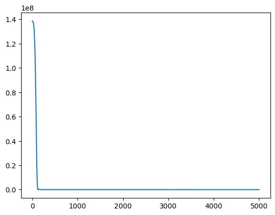
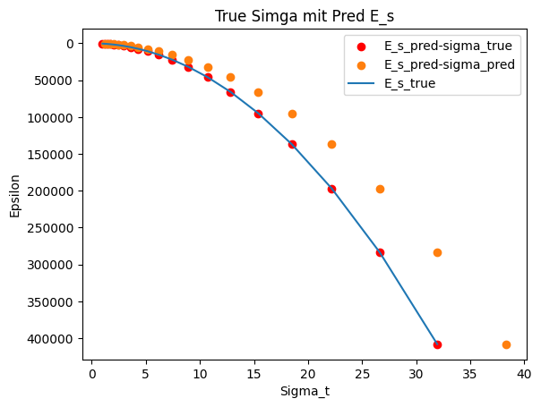

# Import and global variables


```python
import matplotlib.pyplot as plt

input_pts_label = "sigma_t"
output_pts_label = "e_s"
delta_epsilon=0.0005
```

# Problem definition


```python
import random

class Oedometer:
    def __init__(self, e_0: float = 1.00, C_c: float = 0.005, delta_epsilon: float = 0.0005,
                 sigma_t: float = 1.00, max_n: int = 50, rand_epsilon:bool=False, **kwargs):
        self.max_n = max_n

        # Standardwerte als Listen setzen
        self.e_0 = [e_0]
        self.C_c = [C_c]
        self.sigma_t = [sigma_t]
        self.delta_epsilon = []
        self.total_epsilon = [0]

        # Initiale Listen für Berechnungen
        self.sigma_t = [sigma_t]
        self.delta_sigma = []
        self.e_s = []
        self.delta_epsilon = [delta_epsilon]

        # Dynamische Zuweisung von kwargs, falls vorhanden
        for key, value in kwargs.items():
            if hasattr(self, key):  # Nur vorhandene Attribute setzen
                setattr(self, key, [value])

        # Berechnungen durchführen
        self.__calc_sigma_t_p1()

        # Listenlängen anpassen
        self.__adjust_list_lengths()
        self.__calc_total_epsilon()

    def __adjust_list_lengths(self):
        """ Passt ALLE Listen-Attribute an `max_n` an. """
        attributes = ['e_0', 'C_c', 'delta_epsilon', 'sigma_t', 'sigma_t', 'delta_sigma', 'e_s']
        for attr in attributes:
            value_list = getattr(self, attr, [])
            current_length = len(value_list)

            if current_length > self.max_n:
                setattr(self, attr, value_list[:self.max_n])  # Kürzen
            elif current_length < self.max_n:
                setattr(self, attr, value_list + [value_list[-1] if value_list else 0] * (self.max_n - current_length))  # Auffüllen

    def __calc_total_epsilon(self):
        for i in range(len(self.delta_epsilon)-1):
            self.total_epsilon.append(self.total_epsilon[i] + self.delta_epsilon[i])

    def __calc_e_s(self, sigma_t):
        """ Berechnet `e_s` aus `sigma_t`. """
        e_s = (1 + self.e_0[0]) / self.C_c[0] * sigma_t
        self.e_s.append(e_s)
        return e_s

    def __calc_sigma_t_p1(self):
        """ Berechnet `sigma_t` und `delta_sigma` für die nächsten Schritte. """
        for i in range(self.max_n):  # -1, weil sigma_t bereits gesetzt ist
            e_s = self.__calc_e_s(self.sigma_t[i])
            delta_sigma = e_s * self.delta_epsilon[0]
            sigma = self.sigma_t[i] + delta_sigma
            self.sigma_t.append(sigma)
            self.delta_sigma.append(delta_sigma)
```

# Generate random trainingsdata


```python
from random import randint

oedo_para = {
    'max_n': 100,
    'e_0': 1.0,
    'C_c': 0.005,
    'delta_epsilon' : delta_epsilon,
}
list_output = []
list_input = []
n = oedo_para['max_n']
oedo_para['max_n'] = 1
for i in range(n):
    oedo_para['sigma_t'] = randint(1,50)
    oedo_output = Oedometer(**oedo_para)
    list_output.append(oedo_output.e_s[0])
    list_input.append(oedo_output.sigma_t[0])
```

# Show trainingsdata


```python
import pandas as pd
from pandas import DataFrame

pd.DataFrame([list_input, list_output])
```


<div>
<style scoped>
    .dataframe tbody tr th:only-of-type {
        vertical-align: middle;
    }

    .dataframe tbody tr th {
        vertical-align: top;
    }

    .dataframe thead th {
        text-align: right;
    }
</style>
<table border="1" class="dataframe">
  <thead>
    <tr style="text-align: right;">
      <th></th>
      <th>0</th>
      <th>1</th>
      <th>2</th>
      <th>3</th>
      <th>4</th>
      <th>5</th>
      <th>6</th>
      <th>7</th>
      <th>8</th>
      <th>9</th>
      <th>...</th>
      <th>90</th>
      <th>91</th>
      <th>92</th>
      <th>93</th>
      <th>94</th>
      <th>95</th>
      <th>96</th>
      <th>97</th>
      <th>98</th>
      <th>99</th>
    </tr>
  </thead>
  <tbody>
    <tr>
      <th>0</th>
      <td>9.0</td>
      <td>17.0</td>
      <td>45.0</td>
      <td>25.0</td>
      <td>24.0</td>
      <td>29.0</td>
      <td>35.0</td>
      <td>15.0</td>
      <td>40.0</td>
      <td>46.0</td>
      <td>...</td>
      <td>2.0</td>
      <td>15.0</td>
      <td>35.0</td>
      <td>17.0</td>
      <td>44.0</td>
      <td>2.0</td>
      <td>46.0</td>
      <td>42.0</td>
      <td>37.0</td>
      <td>14.0</td>
    </tr>
    <tr>
      <th>1</th>
      <td>3600.0</td>
      <td>6800.0</td>
      <td>18000.0</td>
      <td>10000.0</td>
      <td>9600.0</td>
      <td>11600.0</td>
      <td>14000.0</td>
      <td>6000.0</td>
      <td>16000.0</td>
      <td>18400.0</td>
      <td>...</td>
      <td>800.0</td>
      <td>6000.0</td>
      <td>14000.0</td>
      <td>6800.0</td>
      <td>17600.0</td>
      <td>800.0</td>
      <td>18400.0</td>
      <td>16800.0</td>
      <td>14800.0</td>
      <td>5600.0</td>
    </tr>
  </tbody>
</table>
<p>2 rows × 100 columns</p>
</div>


# Convert list to tensor


```python
from torch import tensor
import torch

sigma_t_tensor = torch.tensor(list_input, dtype=torch.float).unsqueeze(-1)
e_s_tensor = torch.tensor(list_output, dtype=torch.float).unsqueeze(-1)
```

# Einfaches Feedforward-Netz

# Define SimpleRegressor Model


```python
import torch
import torch.nn as nn
import torch.optim as optim
import matplotlib.pyplot as plt

class SimpleRegressor(nn.Module):
    def __init__(self):
        super(SimpleRegressor, self).__init__()
        self.model = nn.Sequential(
            nn.Linear(1, 16),
            nn.ReLU(),
            nn.Linear(16, 16),
            nn.ReLU(),
            nn.Linear(16, 1)
        )

    def forward(self, x):
        return self.model(x)

model = SimpleRegressor()
```

# Training


```python
loss_fn = nn.MSELoss()
optimizer = optim.Adam(model.parameters(), lr=0.01)

epochs = 5000
loss_history = []
for epoch in range(epochs):
    model.train()
    optimizer.zero_grad()
    pred = model(sigma_t_tensor)
    loss = loss_fn(pred, e_s_tensor)
    loss.backward()
    loss_history.append(loss.item())
    optimizer.step()

    if epoch % 100 == 0:
        print(f"Epoch {epoch}: Loss = {loss.item():.6f}")
```

    Epoch 0: Loss = 138716960.000000
    Epoch 100: Loss = 18432360.000000
    Epoch 200: Loss = 32317.492188
    Epoch 300: Loss = 29755.869141
    Epoch 400: Loss = 27378.242188
    Epoch 500: Loss = 24849.810547
    Epoch 600: Loss = 22261.812500
    Epoch 700: Loss = 19689.150391
    Epoch 800: Loss = 17192.818359
    Epoch 900: Loss = 14821.009766
    Epoch 1000: Loss = 12610.442383
    Epoch 1100: Loss = 10587.031250
    Epoch 1200: Loss = 8766.829102
    Epoch 1300: Loss = 7157.091309
    Epoch 1400: Loss = 5757.470703
    Epoch 1500: Loss = 4561.178223
    Epoch 1600: Loss = 3556.290283
    Epoch 1700: Loss = 2727.079346
    Epoch 1800: Loss = 2055.189453
    Epoch 1900: Loss = 1520.990601
    Epoch 2000: Loss = 1104.481445
    Epoch 2100: Loss = 786.257324
    Epoch 2200: Loss = 548.231384
    Epoch 2300: Loss = 374.015259
    Epoch 2400: Loss = 249.440506
    Epoch 2500: Loss = 162.421387
    Epoch 2600: Loss = 103.151779
    Epoch 2700: Loss = 63.819149
    Epoch 2800: Loss = 38.414352
    Epoch 2900: Loss = 22.462780
    Epoch 3000: Loss = 12.745688
    Epoch 3100: Loss = 7.005270
    Epoch 3200: Loss = 3.724057
    Epoch 3300: Loss = 1.911139
    Epoch 3400: Loss = 0.945234
    Epoch 3500: Loss = 0.449556
    Epoch 3600: Loss = 0.205142
    Epoch 3700: Loss = 0.089981
    Epoch 3800: Loss = 0.037488
    Epoch 3900: Loss = 0.014909
    Epoch 4000: Loss = 0.005670
    Epoch 4100: Loss = 0.002037
    Epoch 4200: Loss = 0.000709
    Epoch 4300: Loss = 0.000237
    Epoch 4400: Loss = 0.000078
    Epoch 4500: Loss = 0.000025
    Epoch 4600: Loss = 0.000009
    Epoch 4700: Loss = 0.000003
    Epoch 4800: Loss = 0.000001
    Epoch 4900: Loss = 0.000001
    

# Loss function


```python
plt.plot(loss_history, label="Loss")
plt.show()
```


    

    


```python
pred_input = torch.tensor([1.0], dtype=torch.float).unsqueeze(-1) 

model.eval()
with torch.no_grad():
    pred = model(pred_input)

print(pred)
```

    tensor([[400.0014]])
    

# Plot of stress–strain curve


```python
def plot_result(iterations=20, start_sigma=1, delta_epsilon=0.0005):
    oedo_para = {
    'max_n': iterations,
    'e_0': 1.0,
    'C_c': 0.005,
    'delta_epsilon' : delta_epsilon,
    'sigma_t' : start_sigma,
    }

    oedo = Oedometer(**oedo_para)
    sigma_true = oedo.sigma_t
    e_s_true = oedo.e_s
    
    # print(sigma_true)
    # print(e_s_true)
    model.eval()
    e_s_pred = []
    e_s_true_plot = []
    sigma_t = start_sigma
    sigma_pred = []
    with torch.no_grad():
        for i in range(iterations):
            sigma_true_tensor = torch.tensor(sigma_true[i], dtype=torch.float).unsqueeze(-1) 
            pred = model(sigma_true_tensor)
            e_s_pred.append(pred * sigma_true[i])
            e_s_true_plot.append(e_s_true[i] * sigma_true[i])

            sigma_t = sigma_t + pred * delta_epsilon
            sigma_pred.append(sigma_t)
    # Plot der Losskurve
    plt.scatter(sigma_true, e_s_pred, label='E_s_pred-sigma_true').set_color("red")
    plt.scatter(sigma_pred, e_s_pred, label='E_s_pred-sigma_pred')
    plt.plot(sigma_true, e_s_true_plot, label='E_s_true')

    plt.gca().invert_yaxis()
    plt.xlabel('Sigma_t')
    plt.ylabel('Epsilon')
    plt.title('True Simga mit Pred E_s')
    plt.legend()
    plt.show()
    
plot_result()
```


    

    

