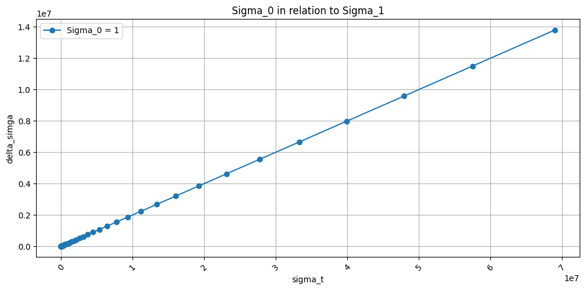
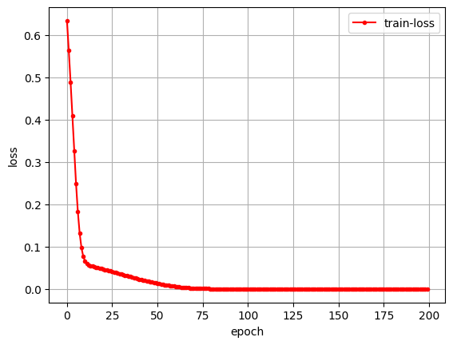

# 031_main_problem_lstm_old.ipynb
## Load modules & Check PyTorch


```python
# Import modules
import torch
import torch.nn as nn
import torch.optim as optim

from IPython.display import display, Markdown

import seaborn as sns
import numpy as np
import pandas as pd
import matplotlib.pyplot as plt

# for noramlization
from sklearn.preprocessing import MinMaxScaler
```

## Parameters


```python
# Debugger: Aktiviert
debug_mode = True
# Normalisierung der Daten: Deaktiviert
normalize_data = False
use_excel = False
max_input_pts = 20

# Trainingsdaten e_0:float=1.00, C_c:float=0.005, delta_epsilon:float=0.0005, sigma_t:float=1.00, max_n:int=50
oedo_parameter = {'e_0':1.00, 'C_c':0.005, 'delta_epsilon':0.0005, 'sigma_t':1.00, 'max_n':100, 'rand_epsilon':False}
```

## Preloaded Modules


```python
def dict_to_markdown_table(data: dict, title: str = "Datenübersicht", include_index: bool = True, round_digits: int = 4):
    """
    Wandelt ein Dictionary mit Listenwerten in eine Markdown-Tabelle für Jupyter Notebooks um.
    
    - Schlüssel werden als Header genutzt
    - Erste Spalte ist ein Index, falls `include_index=True`
    - Einzelwerte werden als separate Tabelle unterhalb dargestellt
    - Zahlenwerte werden auf eine einstellbare Anzahl an Nachkommastellen gerundet

    :param data: Dictionary mit Key-Value-Paaren
    :param title: Überschrift für die Tabelle
    :param include_index: Falls True, wird eine Index-Spalte erstellt
    :param round_digits: Anzahl der Nachkommastellen, auf die Werte gerundet werden sollen
    :return: Markdown-String zur Anzeige in Jupyter
    """
    
    # Hilfsfunktion zum Runden von Zahlen
    def round_value(val):
        if isinstance(val, (int, float)):
            return round(val, round_digits)
        return val

    # Listen und einzelne Werte trennen
    list_data = {k: v for k, v in data.items() if isinstance(v, list)}
    single_values = {k: v for k, v in data.items() if not isinstance(v, list)}

    # Falls es Listen gibt, erstelle eine Tabelle mit Index
    if list_data:
        max_len = max(len(v) for v in list_data.values())  # Längste Liste bestimmen

        # Tabellenkopf
        md_table = f"### {title}\n\n"
        md_table += "| " + ("Index | " if include_index else "") + " | ".join(list_data.keys()) + " |\n"
        md_table += "|-" + ("-|" if include_index else "") + "-|".join(["-" * len(k) for k in list_data.keys()]) + "-|\n"

        # Datenzeilen
        for i in range(max_len):
            row = [str(i)] if include_index else []  # Index hinzufügen (optional)
            for key in list_data:
                if i < len(list_data[key]):
                    row.append(str(round_value(list_data[key][i])))
                else:
                    row.append("")  # Leere Werte für ungleich lange Listen
            md_table += "| " + " | ".join(row) + " |\n"
    
    else:
        md_table = ""

    # Einzelwerte als extra Tabelle darstellen
    if single_values:
        md_table += "\n\n#### Einzelwerte\n\n"
        md_table += "| " + " | ".join(single_values.keys()) + " |\n"
        md_table += "|-" + "-|".join(["-" * len(k) for k in single_values.keys()]) + "-|\n"
        md_table += "| " + " | ".join(map(lambda v: str(round_value(v)), single_values.values())) + " |\n"

    return Markdown(md_table)


def display_data_loss_table(data_dict, delta_sigma_pred, max_i):
    """
    Erstellt eine Markdown-Tabelle zur übersichtlichen Darstellung von Datenverlust.
    
    Unterstützt sowohl Python-Listen als auch NumPy-Arrays.
    
    :param data_dict: Dictionary mit `sigma_t` und `delta_sigma` (Listen oder np.arrays)
    :param delta_sigma_pred: Vorhergesagte Werte für `delta_sigma` (Liste oder np.array)
    :param max_i: Anzahl der Werte, die in der Tabelle angezeigt werden sollen
    """
    
    # Sicherstellen, dass `sigma_t` und `delta_sigma` existieren
    if "sigma_t" not in data_dict or "delta_sigma" not in data_dict or delta_sigma_pred is None:
        print("Fehler: `data_dict` oder `delta_sigma_pred` ist nicht korrekt definiert!")
        return

    # Konvertiere alle Werte zu Listen (falls sie NumPy-Arrays sind)
    def to_list(arr):
        return arr.tolist() if isinstance(arr, np.ndarray) else arr

    total_epsilon = to_list(data_dict["total_epsilon"])
    delta_epsilon = to_list(data_dict["delta_epsilon"])
    sigma_t = to_list(data_dict["sigma_t"])
    delta_sigma_true = to_list(data_dict["delta_sigma"])
    delta_sigma_pred = to_list(delta_sigma_pred.flatten())  # Falls `delta_sigma_pred` ein 2D-Array ist
    
    # Überprüfen, ob die Längen konsistent sind
    min_len = min(len(total_epsilon), len(sigma_t), len(delta_epsilon), len(delta_sigma_true), len(delta_sigma_pred), max_i)

    # Erstelle eine Tabelle für die übersichtliche Darstellung
    data_loss_table = {
        "total_epsilon" : list(total_epsilon[:min_len]), 
        "delta_epsilon" : list(delta_epsilon[:min_len]), 
        "sigma_t" : list(sigma_t[:min_len]), 
        "True delta_sigma": list(delta_sigma_true[:min_len]),
        "Predicted delta_sigma": list(delta_sigma_pred[:min_len]),
        "Test-Loss (True - Predicted)": list(np.round(np.array(delta_sigma_true[:min_len]) - np.array(delta_sigma_pred[:min_len]), 5))
    }

    # Markdown-Tabelle für bessere Darstellung in Jupyter
    display(dict_to_markdown_table(data_loss_table, title=f"Data-Loss bis sigma_{min_len-1}", include_index=True))
```

## Check for use of CONDA if available


```python
use_cuda = torch.cuda.is_available()
device = torch.device("cuda:0" if use_cuda else "cpu")

if device.type == 'cpu':
    device_num = 0
    print('No GPU available.')
else:
    device_num = torch.cuda.device_count()
    print('Device:', device, '-- Number of devices:', device_num)
```

    No GPU available.
    

# Recurrent Neural Networks

Just as people do not have to think again each time about the things they have already learned, it is also possible to teach neural networks to recall knowledge they were being taught. This is done in so-called Recurrent Neural Networks (RNNs) with loops inside, which allow information to be retained. Currently the most used architectures of RNNs are Long short-term memory (LSTM) networks. LSTMs are RNNs that overcome the problem of long-term dependencies and thus have achieved the most state-of-the-art results in this area. In this exercise we will look at how to use LSTMs to predict future values using time series data sets.

## Data processing


```python
import random

class Oedometer:
    def __init__(self, e_0: float = 1.00, C_c: float = 0.005, delta_epsilon: float = 0.0005, 
                 sigma_t: float = 1.00, max_n: int = 50, rand_epsilon:bool=False, **kwargs):
        self.max_n = max_n

        # Standardwerte als Listen setzen
        self.e_0 = [e_0]
        self.C_c = [C_c]
        self.sigma_t = [sigma_t]
        self.delta_epsilon = []
        self.total_epsilon = [0]

        # Initiale Listen für Berechnungen
        self.sigma_t = [sigma_t]
        self.delta_sigma = []
        self.e_s = []
        self.delta_epsilon = [delta_epsilon]
        
        # Dynamische Zuweisung von kwargs, falls vorhanden
        for key, value in kwargs.items():
            if hasattr(self, key):  # Nur vorhandene Attribute setzen
                setattr(self, key, [value])
        
        # Berechnungen durchführen
        self.__calc_sigma_t_p1()

        # Listenlängen anpassen
        self.__adjust_list_lengths()
        self.__calc_total_epsilon()

    def __adjust_list_lengths(self):
        """ Passt ALLE Listen-Attribute an `max_n` an. """
        attributes = ['e_0', 'C_c', 'delta_epsilon', 'sigma_t', 'sigma_t', 'delta_sigma', 'e_s']
        for attr in attributes:
            value_list = getattr(self, attr, [])
            current_length = len(value_list)

            if current_length > self.max_n:
                setattr(self, attr, value_list[:self.max_n])  # Kürzen
            elif current_length < self.max_n:
                setattr(self, attr, value_list + [value_list[-1] if value_list else 0] * (self.max_n - current_length))  # Auffüllen
    
    def __calc_total_epsilon(self):
        for i in range(len(self.delta_epsilon)-1):
            self.total_epsilon.append(self.total_epsilon[i] + self.delta_epsilon[i])            
    
    def __calc_e_s(self, sigma_t):
        """ Berechnet `e_s` aus `sigma_t`. """
        e_s = (1 + self.e_0[0]) / self.C_c[0] * sigma_t
        self.e_s.append(e_s)
        return e_s

    def __calc_sigma_t_p1(self):
        """ Berechnet `sigma_t` und `delta_sigma` für die nächsten Schritte. """
        for i in range(self.max_n):  # -1, weil sigma_t bereits gesetzt ist
            e_s = self.__calc_e_s(self.sigma_t[i])
            delta_sigma = e_s * self.delta_epsilon[0]
            sigma = self.sigma_t[i] + delta_sigma
            self.sigma_t.append(sigma)
            self.delta_sigma.append(delta_sigma)

if not use_excel:
    data_dict_raw = dict(vars(Oedometer(**oedo_parameter)))

    # Leere Liste, um Datenzeilen zu sammeln
    data_list = []
    
    # Beispielhafte Annahme: alle Listen in data_dict_raw haben dieselbe Länge
    for i in range(len(data_dict_raw['sigma_t'])):
        row = [
            data_dict_raw['sigma_t'][i],
            data_dict_raw['delta_epsilon'][i],
            data_dict_raw['delta_sigma'][i]
        ]
        data_list.append(row)
    
    # Am Ende in ein numpy array umwandeln
    data = np.array(data_list)

    # Ausgabe
    display(dict_to_markdown_table(data_dict_raw, 'Ödometerdaten'))
    print(data)
    

def plot_input():
    # Plot
    plt.figure(figsize=(10, 5))
    plt.plot(data_dict_raw['sigma_t'], data_dict_raw['delta_sigma'], marker='o', linestyle='-', label='Sigma_0 = 1')
    
    # Formatting
    plt.xlabel('sigma_t')
    plt.ylabel('delta_simga')
    plt.title('Sigma_0 in relation to Sigma_1')
    plt.xticks(rotation=45)
    plt.grid(True)
    plt.legend()
    plt.tight_layout()
    plt.show()

plot_input()
```


### Ödometerdaten

| Index | e_0 | C_c | sigma_t | delta_epsilon | total_epsilon | delta_sigma | e_s |
|--|----|----|--------|--------------|--------------|------------|----|
| 0 | 1.0 | 0.005 | 1.0 | 0.0005 | 0 | 0.2 | 400.0 |
| 1 | 1.0 | 0.005 | 1.2 | 0.0005 | 0.0005 | 0.24 | 480.0 |
| 2 | 1.0 | 0.005 | 1.44 | 0.0005 | 0.001 | 0.288 | 576.0 |
| 3 | 1.0 | 0.005 | 1.728 | 0.0005 | 0.0015 | 0.3456 | 691.2 |
| 4 | 1.0 | 0.005 | 2.0736 | 0.0005 | 0.002 | 0.4147 | 829.44 |
| 5 | 1.0 | 0.005 | 2.4883 | 0.0005 | 0.0025 | 0.4977 | 995.328 |
| 6 | 1.0 | 0.005 | 2.986 | 0.0005 | 0.003 | 0.5972 | 1194.3936 |
| 7 | 1.0 | 0.005 | 3.5832 | 0.0005 | 0.0035 | 0.7166 | 1433.2723 |
| 8 | 1.0 | 0.005 | 4.2998 | 0.0005 | 0.004 | 0.86 | 1719.9268 |
| 9 | 1.0 | 0.005 | 5.1598 | 0.0005 | 0.0045 | 1.032 | 2063.9121 |
| 10 | 1.0 | 0.005 | 6.1917 | 0.0005 | 0.005 | 1.2383 | 2476.6946 |
| 11 | 1.0 | 0.005 | 7.4301 | 0.0005 | 0.0055 | 1.486 | 2972.0335 |
| 12 | 1.0 | 0.005 | 8.9161 | 0.0005 | 0.006 | 1.7832 | 3566.4402 |
| 13 | 1.0 | 0.005 | 10.6993 | 0.0005 | 0.0065 | 2.1399 | 4279.7282 |
| 14 | 1.0 | 0.005 | 12.8392 | 0.0005 | 0.007 | 2.5678 | 5135.6739 |
| 15 | 1.0 | 0.005 | 15.407 | 0.0005 | 0.0075 | 3.0814 | 6162.8086 |
| 16 | 1.0 | 0.005 | 18.4884 | 0.0005 | 0.008 | 3.6977 | 7395.3704 |
| 17 | 1.0 | 0.005 | 22.1861 | 0.0005 | 0.0085 | 4.4372 | 8874.4444 |
| 18 | 1.0 | 0.005 | 26.6233 | 0.0005 | 0.009 | 5.3247 | 10649.3333 |
| 19 | 1.0 | 0.005 | 31.948 | 0.0005 | 0.0095 | 6.3896 | 12779.2 |
| 20 | 1.0 | 0.005 | 38.3376 | 0.0005 | 0.01 | 7.6675 | 15335.04 |
| 21 | 1.0 | 0.005 | 46.0051 | 0.0005 | 0.0105 | 9.201 | 18402.048 |
| 22 | 1.0 | 0.005 | 55.2061 | 0.0005 | 0.011 | 11.0412 | 22082.4576 |
| 23 | 1.0 | 0.005 | 66.2474 | 0.0005 | 0.0115 | 13.2495 | 26498.9491 |
| 24 | 1.0 | 0.005 | 79.4968 | 0.0005 | 0.012 | 15.8994 | 31798.7389 |
| 25 | 1.0 | 0.005 | 95.3962 | 0.0005 | 0.0125 | 19.0792 | 38158.4867 |
| 26 | 1.0 | 0.005 | 114.4755 | 0.0005 | 0.013 | 22.8951 | 45790.184 |
| 27 | 1.0 | 0.005 | 137.3706 | 0.0005 | 0.0135 | 27.4741 | 54948.2208 |
| 28 | 1.0 | 0.005 | 164.8447 | 0.0005 | 0.014 | 32.9689 | 65937.8649 |
| 29 | 1.0 | 0.005 | 197.8136 | 0.0005 | 0.0145 | 39.5627 | 79125.4379 |
| 30 | 1.0 | 0.005 | 237.3763 | 0.0005 | 0.015 | 47.4753 | 94950.5255 |
| 31 | 1.0 | 0.005 | 284.8516 | 0.0005 | 0.0155 | 56.9703 | 113940.6306 |
| 32 | 1.0 | 0.005 | 341.8219 | 0.0005 | 0.016 | 68.3644 | 136728.7567 |
| 33 | 1.0 | 0.005 | 410.1863 | 0.0005 | 0.0165 | 82.0373 | 164074.5081 |
| 34 | 1.0 | 0.005 | 492.2235 | 0.0005 | 0.017 | 98.4447 | 196889.4097 |
| 35 | 1.0 | 0.005 | 590.6682 | 0.0005 | 0.0175 | 118.1336 | 236267.2917 |
| 36 | 1.0 | 0.005 | 708.8019 | 0.0005 | 0.018 | 141.7604 | 283520.75 |
| 37 | 1.0 | 0.005 | 850.5622 | 0.0005 | 0.0185 | 170.1124 | 340224.9 |
| 38 | 1.0 | 0.005 | 1020.6747 | 0.0005 | 0.019 | 204.1349 | 408269.88 |
| 39 | 1.0 | 0.005 | 1224.8096 | 0.0005 | 0.0195 | 244.9619 | 489923.856 |
| 40 | 1.0 | 0.005 | 1469.7716 | 0.0005 | 0.02 | 293.9543 | 587908.6272 |
| 41 | 1.0 | 0.005 | 1763.7259 | 0.0005 | 0.0205 | 352.7452 | 705490.3526 |
| 42 | 1.0 | 0.005 | 2116.4711 | 0.0005 | 0.021 | 423.2942 | 846588.4232 |
| 43 | 1.0 | 0.005 | 2539.7653 | 0.0005 | 0.0215 | 507.9531 | 1015906.1078 |
| 44 | 1.0 | 0.005 | 3047.7183 | 0.0005 | 0.022 | 609.5437 | 1219087.3293 |
| 45 | 1.0 | 0.005 | 3657.262 | 0.0005 | 0.0225 | 731.4524 | 1462904.7952 |
| 46 | 1.0 | 0.005 | 4388.7144 | 0.0005 | 0.023 | 877.7429 | 1755485.7542 |
| 47 | 1.0 | 0.005 | 5266.4573 | 0.0005 | 0.0235 | 1053.2915 | 2106582.9051 |
| 48 | 1.0 | 0.005 | 6319.7487 | 0.0005 | 0.024 | 1263.9497 | 2527899.4861 |
| 49 | 1.0 | 0.005 | 7583.6985 | 0.0005 | 0.0245 | 1516.7397 | 3033479.3833 |
| 50 | 1.0 | 0.005 | 9100.4382 | 0.0005 | 0.025 | 1820.0876 | 3640175.26 |
| 51 | 1.0 | 0.005 | 10920.5258 | 0.0005 | 0.0255 | 2184.1052 | 4368210.312 |
| 52 | 1.0 | 0.005 | 13104.6309 | 0.0005 | 0.026 | 2620.9262 | 5241852.3744 |
| 53 | 1.0 | 0.005 | 15725.5571 | 0.0005 | 0.0265 | 3145.1114 | 6290222.8493 |
| 54 | 1.0 | 0.005 | 18870.6685 | 0.0005 | 0.027 | 3774.1337 | 7548267.4191 |
| 55 | 1.0 | 0.005 | 22644.8023 | 0.0005 | 0.0275 | 4528.9605 | 9057920.903 |
| 56 | 1.0 | 0.005 | 27173.7627 | 0.0005 | 0.028 | 5434.7525 | 10869505.0836 |
| 57 | 1.0 | 0.005 | 32608.5153 | 0.0005 | 0.0285 | 6521.7031 | 13043406.1003 |
| 58 | 1.0 | 0.005 | 39130.2183 | 0.0005 | 0.029 | 7826.0437 | 15652087.3203 |
| 59 | 1.0 | 0.005 | 46956.262 | 0.0005 | 0.0295 | 9391.2524 | 18782504.7844 |
| 60 | 1.0 | 0.005 | 56347.5144 | 0.0005 | 0.03 | 11269.5029 | 22539005.7413 |
| 61 | 1.0 | 0.005 | 67617.0172 | 0.0005 | 0.0305 | 13523.4034 | 27046806.8895 |
| 62 | 1.0 | 0.005 | 81140.4207 | 0.0005 | 0.031 | 16228.0841 | 32456168.2674 |
| 63 | 1.0 | 0.005 | 97368.5048 | 0.0005 | 0.0315 | 19473.701 | 38947401.9209 |
| 64 | 1.0 | 0.005 | 116842.2058 | 0.0005 | 0.032 | 23368.4412 | 46736882.3051 |
| 65 | 1.0 | 0.005 | 140210.6469 | 0.0005 | 0.0325 | 28042.1294 | 56084258.7661 |
| 66 | 1.0 | 0.005 | 168252.7763 | 0.0005 | 0.033 | 33650.5553 | 67301110.5193 |
| 67 | 1.0 | 0.005 | 201903.3316 | 0.0005 | 0.0335 | 40380.6663 | 80761332.6232 |
| 68 | 1.0 | 0.005 | 242283.9979 | 0.0005 | 0.034 | 48456.7996 | 96913599.1478 |
| 69 | 1.0 | 0.005 | 290740.7974 | 0.0005 | 0.0345 | 58148.1595 | 116296318.9774 |
| 70 | 1.0 | 0.005 | 348888.9569 | 0.0005 | 0.035 | 69777.7914 | 139555582.7729 |
| 71 | 1.0 | 0.005 | 418666.7483 | 0.0005 | 0.0355 | 83733.3497 | 167466699.3275 |
| 72 | 1.0 | 0.005 | 502400.098 | 0.0005 | 0.036 | 100480.0196 | 200960039.193 |
| 73 | 1.0 | 0.005 | 602880.1176 | 0.0005 | 0.0365 | 120576.0235 | 241152047.0315 |
| 74 | 1.0 | 0.005 | 723456.1411 | 0.0005 | 0.037 | 144691.2282 | 289382456.4379 |
| 75 | 1.0 | 0.005 | 868147.3693 | 0.0005 | 0.0375 | 173629.4739 | 347258947.7254 |
| 76 | 1.0 | 0.005 | 1041776.8432 | 0.0005 | 0.038 | 208355.3686 | 416710737.2705 |
| 77 | 1.0 | 0.005 | 1250132.2118 | 0.0005 | 0.0385 | 250026.4424 | 500052884.7246 |
| 78 | 1.0 | 0.005 | 1500158.6542 | 0.0005 | 0.039 | 300031.7308 | 600063461.6695 |
| 79 | 1.0 | 0.005 | 1800190.385 | 0.0005 | 0.0395 | 360038.077 | 720076154.0034 |
| 80 | 1.0 | 0.005 | 2160228.462 | 0.0005 | 0.04 | 432045.6924 | 864091384.8041 |
| 81 | 1.0 | 0.005 | 2592274.1544 | 0.0005 | 0.0405 | 518454.8309 | 1036909661.7649 |
| 82 | 1.0 | 0.005 | 3110728.9853 | 0.0005 | 0.041 | 622145.7971 | 1244291594.1179 |
| 83 | 1.0 | 0.005 | 3732874.7824 | 0.0005 | 0.0415 | 746574.9565 | 1493149912.9415 |
| 84 | 1.0 | 0.005 | 4479449.7388 | 0.0005 | 0.042 | 895889.9478 | 1791779895.5298 |
| 85 | 1.0 | 0.005 | 5375339.6866 | 0.0005 | 0.0425 | 1075067.9373 | 2150135874.6358 |
| 86 | 1.0 | 0.005 | 6450407.6239 | 0.0005 | 0.043 | 1290081.5248 | 2580163049.563 |
| 87 | 1.0 | 0.005 | 7740489.1487 | 0.0005 | 0.0435 | 1548097.8297 | 3096195659.4755 |
| 88 | 1.0 | 0.005 | 9288586.9784 | 0.0005 | 0.044 | 1857717.3957 | 3715434791.3707 |
| 89 | 1.0 | 0.005 | 11146304.3741 | 0.0005 | 0.0445 | 2229260.8748 | 4458521749.6448 |
| 90 | 1.0 | 0.005 | 13375565.2489 | 0.0005 | 0.045 | 2675113.0498 | 5350226099.5737 |
| 91 | 1.0 | 0.005 | 16050678.2987 | 0.0005 | 0.0455 | 3210135.6597 | 6420271319.4885 |
| 92 | 1.0 | 0.005 | 19260813.9585 | 0.0005 | 0.046 | 3852162.7917 | 7704325583.3862 |
| 93 | 1.0 | 0.005 | 23112976.7502 | 0.0005 | 0.0465 | 4622595.35 | 9245190700.0634 |
| 94 | 1.0 | 0.005 | 27735572.1002 | 0.0005 | 0.047 | 5547114.42 | 11094228840.0761 |
| 95 | 1.0 | 0.005 | 33282686.5202 | 0.0005 | 0.0475 | 6656537.304 | 13313074608.0913 |
| 96 | 1.0 | 0.005 | 39939223.8243 | 0.0005 | 0.048 | 7987844.7649 | 15975689529.7096 |
| 97 | 1.0 | 0.005 | 47927068.5891 | 0.0005 | 0.0485 | 9585413.7178 | 19170827435.6515 |
| 98 | 1.0 | 0.005 | 57512482.307 | 0.0005 | 0.049 | 11502496.4614 | 23004992922.7818 |
| 99 | 1.0 | 0.005 | 69014978.7683 | 0.0005 | 0.0495 | 13802995.7537 | 27605991507.3382 |


#### Einzelwerte

| max_n |
|-------|
| 100 |


    [[1.00000000e+00 5.00000000e-04 2.00000000e-01]
     [1.20000000e+00 5.00000000e-04 2.40000000e-01]
     [1.44000000e+00 5.00000000e-04 2.88000000e-01]
     [1.72800000e+00 5.00000000e-04 3.45600000e-01]
     [2.07360000e+00 5.00000000e-04 4.14720000e-01]
     [2.48832000e+00 5.00000000e-04 4.97664000e-01]
     [2.98598400e+00 5.00000000e-04 5.97196800e-01]
     [3.58318080e+00 5.00000000e-04 7.16636160e-01]
     [4.29981696e+00 5.00000000e-04 8.59963392e-01]
     [5.15978035e+00 5.00000000e-04 1.03195607e+00]
     [6.19173642e+00 5.00000000e-04 1.23834728e+00]
     [7.43008371e+00 5.00000000e-04 1.48601674e+00]
     [8.91610045e+00 5.00000000e-04 1.78322009e+00]
     [1.06993205e+01 5.00000000e-04 2.13986411e+00]
     [1.28391846e+01 5.00000000e-04 2.56783693e+00]
     [1.54070216e+01 5.00000000e-04 3.08140431e+00]
     [1.84884259e+01 5.00000000e-04 3.69768518e+00]
     [2.21861111e+01 5.00000000e-04 4.43722221e+00]
     [2.66233333e+01 5.00000000e-04 5.32466666e+00]
     [3.19479999e+01 5.00000000e-04 6.38959999e+00]
     [3.83375999e+01 5.00000000e-04 7.66751998e+00]
     [4.60051199e+01 5.00000000e-04 9.20102398e+00]
     [5.52061439e+01 5.00000000e-04 1.10412288e+01]
     [6.62473727e+01 5.00000000e-04 1.32494745e+01]
     [7.94968472e+01 5.00000000e-04 1.58993694e+01]
     [9.53962166e+01 5.00000000e-04 1.90792433e+01]
     [1.14475460e+02 5.00000000e-04 2.28950920e+01]
     [1.37370552e+02 5.00000000e-04 2.74741104e+01]
     [1.64844662e+02 5.00000000e-04 3.29689325e+01]
     [1.97813595e+02 5.00000000e-04 3.95627190e+01]
     [2.37376314e+02 5.00000000e-04 4.74752628e+01]
     [2.84851577e+02 5.00000000e-04 5.69703153e+01]
     [3.41821892e+02 5.00000000e-04 6.83643784e+01]
     [4.10186270e+02 5.00000000e-04 8.20372540e+01]
     [4.92223524e+02 5.00000000e-04 9.84447049e+01]
     [5.90668229e+02 5.00000000e-04 1.18133646e+02]
     [7.08801875e+02 5.00000000e-04 1.41760375e+02]
     [8.50562250e+02 5.00000000e-04 1.70112450e+02]
     [1.02067470e+03 5.00000000e-04 2.04134940e+02]
     [1.22480964e+03 5.00000000e-04 2.44961928e+02]
     [1.46977157e+03 5.00000000e-04 2.93954314e+02]
     [1.76372588e+03 5.00000000e-04 3.52745176e+02]
     [2.11647106e+03 5.00000000e-04 4.23294212e+02]
     [2.53976527e+03 5.00000000e-04 5.07953054e+02]
     [3.04771832e+03 5.00000000e-04 6.09543665e+02]
     [3.65726199e+03 5.00000000e-04 7.31452398e+02]
     [4.38871439e+03 5.00000000e-04 8.77742877e+02]
     [5.26645726e+03 5.00000000e-04 1.05329145e+03]
     [6.31974872e+03 5.00000000e-04 1.26394974e+03]
     [7.58369846e+03 5.00000000e-04 1.51673969e+03]
     [9.10043815e+03 5.00000000e-04 1.82008763e+03]
     [1.09205258e+04 5.00000000e-04 2.18410516e+03]
     [1.31046309e+04 5.00000000e-04 2.62092619e+03]
     [1.57255571e+04 5.00000000e-04 3.14511142e+03]
     [1.88706685e+04 5.00000000e-04 3.77413371e+03]
     [2.26448023e+04 5.00000000e-04 4.52896045e+03]
     [2.71737627e+04 5.00000000e-04 5.43475254e+03]
     [3.26085153e+04 5.00000000e-04 6.52170305e+03]
     [3.91302183e+04 5.00000000e-04 7.82604366e+03]
     [4.69562620e+04 5.00000000e-04 9.39125239e+03]
     [5.63475144e+04 5.00000000e-04 1.12695029e+04]
     [6.76170172e+04 5.00000000e-04 1.35234034e+04]
     [8.11404207e+04 5.00000000e-04 1.62280841e+04]
     [9.73685048e+04 5.00000000e-04 1.94737010e+04]
     [1.16842206e+05 5.00000000e-04 2.33684412e+04]
     [1.40210647e+05 5.00000000e-04 2.80421294e+04]
     [1.68252776e+05 5.00000000e-04 3.36505553e+04]
     [2.01903332e+05 5.00000000e-04 4.03806663e+04]
     [2.42283998e+05 5.00000000e-04 4.84567996e+04]
     [2.90740797e+05 5.00000000e-04 5.81481595e+04]
     [3.48888957e+05 5.00000000e-04 6.97777914e+04]
     [4.18666748e+05 5.00000000e-04 8.37333497e+04]
     [5.02400098e+05 5.00000000e-04 1.00480020e+05]
     [6.02880118e+05 5.00000000e-04 1.20576024e+05]
     [7.23456141e+05 5.00000000e-04 1.44691228e+05]
     [8.68147369e+05 5.00000000e-04 1.73629474e+05]
     [1.04177684e+06 5.00000000e-04 2.08355369e+05]
     [1.25013221e+06 5.00000000e-04 2.50026442e+05]
     [1.50015865e+06 5.00000000e-04 3.00031731e+05]
     [1.80019039e+06 5.00000000e-04 3.60038077e+05]
     [2.16022846e+06 5.00000000e-04 4.32045692e+05]
     [2.59227415e+06 5.00000000e-04 5.18454831e+05]
     [3.11072899e+06 5.00000000e-04 6.22145797e+05]
     [3.73287478e+06 5.00000000e-04 7.46574956e+05]
     [4.47944974e+06 5.00000000e-04 8.95889948e+05]
     [5.37533969e+06 5.00000000e-04 1.07506794e+06]
     [6.45040762e+06 5.00000000e-04 1.29008152e+06]
     [7.74048915e+06 5.00000000e-04 1.54809783e+06]
     [9.28858698e+06 5.00000000e-04 1.85771740e+06]
     [1.11463044e+07 5.00000000e-04 2.22926087e+06]
     [1.33755652e+07 5.00000000e-04 2.67511305e+06]
     [1.60506783e+07 5.00000000e-04 3.21013566e+06]
     [1.92608140e+07 5.00000000e-04 3.85216279e+06]
     [2.31129768e+07 5.00000000e-04 4.62259535e+06]
     [2.77355721e+07 5.00000000e-04 5.54711442e+06]
     [3.32826865e+07 5.00000000e-04 6.65653730e+06]
     [3.99392238e+07 5.00000000e-04 7.98784476e+06]
     [4.79270686e+07 5.00000000e-04 9.58541372e+06]
     [5.75124823e+07 5.00000000e-04 1.15024965e+07]
     [6.90149788e+07 5.00000000e-04 1.38029958e+07]]
    


    

    


## Datenvorverarbeitung

Da wir zukünftige Datenpunkte in dieser Übung vorhersagen möchten, haben wir zuerst unsere Zeitreihen am Ende geschnitten und diesen Grenzwert als Testdaten behandeln.


```python
# Cut the end of the time series as test data
# TODO start** 
test_data_size = 10
# trva = train and val
trva_data = data[:-test_data_size]
test_data = data[-test_data_size:] 

print('Length of train data:', len(trva_data))
print('Length of test data:', len(test_data))
```

    Length of train data: 90
    Length of test data: 10
    

Die *trva_data* werden jetzt normalisiert und in PyTorch Tensoren umgewandelt, wie aus den vorherigen Übungen bekannt. Der nächste Schritt ist jedoch besonders, indem Sequenzen aus den TRVA -Daten erstellt werden. Daher verwenden wir die Helferfunktion *create_inout_sequences (Eingabedaten, Zugfenster) *, wodurch Sequenzen $ Input \Rightarrow Output $ aus den Zeitreihen erstellt werden
So (falls Zugfenster = 3):

$$ [x_ {t-2}, x_ {t-1}, x_t] \rightarrow x_ {t+1}, $$

Die Eingangssequenzen haben die Länge *train_window* und die Ausgabe hat die Länge 1.


```python
# Normalize data with MinMax Scaler

X = data[:, :2]  # sigma_t, delta_epsilon
y = data[:, 2:]  # delta_sigma

scaler_X = MinMaxScaler(feature_range=(-1, 1))
scaler_y = MinMaxScaler(feature_range=(-1, 1))

X_scaled = scaler_X.fit_transform(X)
y_scaled = scaler_y.fit_transform(y)
```


```python
# Convert to Torch Tensor
# view(-1) is similar to reshape for tensor and the array size is inferred for the -1 dimension

X_tensor = torch.FloatTensor(X_scaled)
Y_tensor = torch.FloatTensor(y_scaled)
```


```python
from torch.utils.data import TensorDataset, DataLoader

dataset = TensorDataset(X_tensor.view(-1, 1, 2), Y_tensor.view(-1, 1))
train_loader = DataLoader(dataset, batch_size=1, shuffle=True)
```

## LSTM bauen

Sie erhalten die Klasse LSTM. Ein Blick auf die Vorwärtsmethode zeigt, dass der Eingang direkt in LSTM -Module fließt. Die Zahl kann über * num_lstm_layers * und ihre Größe durch verstecktes Dim ermittelt werden. Zusätzlich zum Ausgang haben die LSTM -Module auch einen versteckten Zellzustand. Auf die letzte LSTM -Schicht folgt eine lineare Ausgangsschicht. Beachten Sie, dass wir eine lineare Ausgangsschicht wie in der Regression verwenden, da die Ausgangswerte unbegrenzt sind.


```python
# LSTM architecture
class LSTM(nn.Module):

    def __init__(self, input_dim, hidden_dim, batch_size, output_dim,
                    num_layers):
        super(LSTM, self).__init__()
        self.input_dim = input_dim
        self.hidden_dim = hidden_dim
        self.batch_size = batch_size
        self.num_layers = num_layers

        # Define the LSTM layer
        self.lstm = nn.LSTM(self.input_dim, self.hidden_dim, self.num_layers)

        # Define the output layer
        self.linear = nn.Linear(self.hidden_dim, output_dim)

    def init_hidden(self):
        # This is what we'll initialise our hidden state as
        return (torch.zeros(self.num_layers, self.batch_size, self.hidden_dim),
                torch.zeros(self.num_layers, self.batch_size, self.hidden_dim))

    def forward(self, input):
        # Forward pass through LSTM layer
        # Shape of lstm_out: [input_size, batch_size, hidden_dim]
        # Shape of self.hidden: (a, b), where a and b both 
        # Have shape (num_layers, batch_size, hidden_dim).
        lstm_out, self.hidden = self.lstm(input.view(len(input), self.batch_size, -1))
        
        # Only take the output from the final timestep
        # Can pass on the entirety of lstm_out to the next layer if it is a seq2seq prediction
        y_pred = self.linear(lstm_out[-1].view(self.batch_size, -1))
        return y_pred.view(-1)
```

## LSTM Instanz


```python
# Create an instance of class LSTM

# TODO start**
input_dim = 2 # Feature dimension of input
hidden_dim = 32 # Number of hidden neurons in LSTM
batch_size = 1 # We do not merge the sequences into batches. Therefore the batch_size is 1.
output_dim = 1 # Feature dimension of output
num_lstm_layers =  1       
net = LSTM(input_dim, hidden_dim, batch_size, output_dim, num_lstm_layers)
```


```python
# Send networks to GPU (if you have one which supports cuda) for faster computations

if device_num>1:
    print("Let's use", device_num, "GPU's")
    net = nn.DataParallel(net)
net.to(device) 
print(net)
```

    LSTM(
      (lstm): LSTM(2, 32)
      (linear): Linear(in_features=32, out_features=1, bias=True)
    )
    


```python
# Specify hyperparameter loss function and optimizer
# TODO start**
num_epochs =  200 
num_learning_rate = 1e-4
loss_function = nn.MSELoss()
optimizer = optim.Adam(net.parameters(), lr = num_learning_rate)
print(net)
```

    LSTM(
      (lstm): LSTM(2, 32)
      (linear): Linear(in_features=32, out_features=1, bias=True)
    )
    

## Training


```python
#%% Train the Model

loss_epoch_train = []

for epoch in range(num_epochs):
    loss_seq_train = []

    for seq, labels in train_loader:
        seq, labels = seq.to(device), labels.to(device)
        net.hidden = net.init_hidden()

        optimizer.zero_grad()
        y_pred_train = net(seq)

        loss = loss_function(y_pred_train, labels.view(-1))
        if torch.isnan(loss):  # Sicherheitscheck
            print(f"NaN im Loss bei Epoch {epoch}")
            continue

        loss.backward()
        optimizer.step()

        loss_seq_train.append(loss.item())

    if loss_seq_train:
        loss_epoch_train.append(np.mean(loss_seq_train))
    else:
        print(f"Epoch {epoch} hatte keine gültigen Samples.")
        loss_epoch_train.append(np.nan)

    print(f"Epoch {epoch}/{num_epochs}: Train-Loss: {np.round(loss_epoch_train[-1], 4)}")

plt.figure()
plt.plot(range(num_epochs), loss_epoch_train, color='r', marker='.', label = 'train-loss')
plt.legend()
plt.xlabel('epoch')
plt.ylabel('loss')
plt.grid(True)
plt.savefig('./results/main_lstm_loss.png')
plt.show()
```

    Epoch 0/200: Train-Loss: 0.6334
    Epoch 1/200: Train-Loss: 0.5628
    Epoch 2/200: Train-Loss: 0.4879
    Epoch 3/200: Train-Loss: 0.4084
    Epoch 4/200: Train-Loss: 0.3264
    Epoch 5/200: Train-Loss: 0.2493
    Epoch 6/200: Train-Loss: 0.1829
    Epoch 7/200: Train-Loss: 0.132
    Epoch 8/200: Train-Loss: 0.0975
    Epoch 9/200: Train-Loss: 0.0769
    Epoch 10/200: Train-Loss: 0.0658
    Epoch 11/200: Train-Loss: 0.06
    Epoch 12/200: Train-Loss: 0.057
    Epoch 13/200: Train-Loss: 0.0552
    Epoch 14/200: Train-Loss: 0.054
    Epoch 15/200: Train-Loss: 0.0528
    Epoch 16/200: Train-Loss: 0.0517
    Epoch 17/200: Train-Loss: 0.0506
    Epoch 18/200: Train-Loss: 0.0494
    Epoch 19/200: Train-Loss: 0.0483
    Epoch 20/200: Train-Loss: 0.0471
    Epoch 21/200: Train-Loss: 0.046
    Epoch 22/200: Train-Loss: 0.0448
    Epoch 23/200: Train-Loss: 0.0436
    Epoch 24/200: Train-Loss: 0.0424
    Epoch 25/200: Train-Loss: 0.0413
    Epoch 26/200: Train-Loss: 0.0401
    Epoch 27/200: Train-Loss: 0.0388
    Epoch 28/200: Train-Loss: 0.0376
    Epoch 29/200: Train-Loss: 0.0364
    Epoch 30/200: Train-Loss: 0.0353
    Epoch 31/200: Train-Loss: 0.034
    Epoch 32/200: Train-Loss: 0.0328
    Epoch 33/200: Train-Loss: 0.0316
    Epoch 34/200: Train-Loss: 0.0305
    Epoch 35/200: Train-Loss: 0.0293
    Epoch 36/200: Train-Loss: 0.028
    Epoch 37/200: Train-Loss: 0.0269
    Epoch 38/200: Train-Loss: 0.0258
    Epoch 39/200: Train-Loss: 0.0246
    Epoch 40/200: Train-Loss: 0.0234
    Epoch 41/200: Train-Loss: 0.0223
    Epoch 42/200: Train-Loss: 0.0213
    Epoch 43/200: Train-Loss: 0.0202
    Epoch 44/200: Train-Loss: 0.0192
    Epoch 45/200: Train-Loss: 0.0181
    Epoch 46/200: Train-Loss: 0.0171
    Epoch 47/200: Train-Loss: 0.0162
    Epoch 48/200: Train-Loss: 0.0151
    Epoch 49/200: Train-Loss: 0.0142
    Epoch 50/200: Train-Loss: 0.0133
    Epoch 51/200: Train-Loss: 0.0125
    Epoch 52/200: Train-Loss: 0.0116
    Epoch 53/200: Train-Loss: 0.0107
    Epoch 54/200: Train-Loss: 0.01
    Epoch 55/200: Train-Loss: 0.0092
    Epoch 56/200: Train-Loss: 0.0085
    Epoch 57/200: Train-Loss: 0.0078
    Epoch 58/200: Train-Loss: 0.0072
    Epoch 59/200: Train-Loss: 0.0065
    Epoch 60/200: Train-Loss: 0.006
    Epoch 61/200: Train-Loss: 0.0054
    Epoch 62/200: Train-Loss: 0.0049
    Epoch 63/200: Train-Loss: 0.0044
    Epoch 64/200: Train-Loss: 0.004
    Epoch 65/200: Train-Loss: 0.0036
    Epoch 66/200: Train-Loss: 0.0032
    Epoch 67/200: Train-Loss: 0.0028
    Epoch 68/200: Train-Loss: 0.0025
    Epoch 69/200: Train-Loss: 0.0023
    Epoch 70/200: Train-Loss: 0.002
    Epoch 71/200: Train-Loss: 0.0018
    Epoch 72/200: Train-Loss: 0.0016
    Epoch 73/200: Train-Loss: 0.0014
    Epoch 74/200: Train-Loss: 0.0013
    Epoch 75/200: Train-Loss: 0.0011
    Epoch 76/200: Train-Loss: 0.001
    Epoch 77/200: Train-Loss: 0.0009
    Epoch 78/200: Train-Loss: 0.0008
    Epoch 79/200: Train-Loss: 0.0008
    Epoch 80/200: Train-Loss: 0.0007
    Epoch 81/200: Train-Loss: 0.0007
    Epoch 82/200: Train-Loss: 0.0006
    Epoch 83/200: Train-Loss: 0.0006
    Epoch 84/200: Train-Loss: 0.0006
    Epoch 85/200: Train-Loss: 0.0006
    Epoch 86/200: Train-Loss: 0.0005
    Epoch 87/200: Train-Loss: 0.0005
    Epoch 88/200: Train-Loss: 0.0005
    Epoch 89/200: Train-Loss: 0.0005
    Epoch 90/200: Train-Loss: 0.0005
    Epoch 91/200: Train-Loss: 0.0005
    Epoch 92/200: Train-Loss: 0.0005
    Epoch 93/200: Train-Loss: 0.0005
    Epoch 94/200: Train-Loss: 0.0005
    Epoch 95/200: Train-Loss: 0.0004
    Epoch 96/200: Train-Loss: 0.0004
    Epoch 97/200: Train-Loss: 0.0004
    Epoch 98/200: Train-Loss: 0.0004
    Epoch 99/200: Train-Loss: 0.0004
    Epoch 100/200: Train-Loss: 0.0004
    Epoch 101/200: Train-Loss: 0.0004
    Epoch 102/200: Train-Loss: 0.0004
    Epoch 103/200: Train-Loss: 0.0004
    Epoch 104/200: Train-Loss: 0.0004
    Epoch 105/200: Train-Loss: 0.0004
    Epoch 106/200: Train-Loss: 0.0004
    Epoch 107/200: Train-Loss: 0.0004
    Epoch 108/200: Train-Loss: 0.0004
    Epoch 109/200: Train-Loss: 0.0004
    Epoch 110/200: Train-Loss: 0.0003
    Epoch 111/200: Train-Loss: 0.0003
    Epoch 112/200: Train-Loss: 0.0003
    Epoch 113/200: Train-Loss: 0.0003
    Epoch 114/200: Train-Loss: 0.0003
    Epoch 115/200: Train-Loss: 0.0003
    Epoch 116/200: Train-Loss: 0.0003
    Epoch 117/200: Train-Loss: 0.0003
    Epoch 118/200: Train-Loss: 0.0003
    Epoch 119/200: Train-Loss: 0.0003
    Epoch 120/200: Train-Loss: 0.0003
    Epoch 121/200: Train-Loss: 0.0003
    Epoch 122/200: Train-Loss: 0.0003
    Epoch 123/200: Train-Loss: 0.0003
    Epoch 124/200: Train-Loss: 0.0002
    Epoch 125/200: Train-Loss: 0.0002
    Epoch 126/200: Train-Loss: 0.0002
    Epoch 127/200: Train-Loss: 0.0002
    Epoch 128/200: Train-Loss: 0.0002
    Epoch 129/200: Train-Loss: 0.0002
    Epoch 130/200: Train-Loss: 0.0002
    Epoch 131/200: Train-Loss: 0.0002
    Epoch 132/200: Train-Loss: 0.0002
    Epoch 133/200: Train-Loss: 0.0002
    Epoch 134/200: Train-Loss: 0.0002
    Epoch 135/200: Train-Loss: 0.0002
    Epoch 136/200: Train-Loss: 0.0002
    Epoch 137/200: Train-Loss: 0.0002
    Epoch 138/200: Train-Loss: 0.0002
    Epoch 139/200: Train-Loss: 0.0002
    Epoch 140/200: Train-Loss: 0.0002
    Epoch 141/200: Train-Loss: 0.0002
    Epoch 142/200: Train-Loss: 0.0001
    Epoch 143/200: Train-Loss: 0.0001
    Epoch 144/200: Train-Loss: 0.0001
    Epoch 145/200: Train-Loss: 0.0001
    Epoch 146/200: Train-Loss: 0.0001
    Epoch 147/200: Train-Loss: 0.0001
    Epoch 148/200: Train-Loss: 0.0001
    Epoch 149/200: Train-Loss: 0.0001
    Epoch 150/200: Train-Loss: 0.0001
    Epoch 151/200: Train-Loss: 0.0001
    Epoch 152/200: Train-Loss: 0.0001
    Epoch 153/200: Train-Loss: 0.0001
    Epoch 154/200: Train-Loss: 0.0001
    Epoch 155/200: Train-Loss: 0.0001
    Epoch 156/200: Train-Loss: 0.0001
    Epoch 157/200: Train-Loss: 0.0001
    Epoch 158/200: Train-Loss: 0.0001
    Epoch 159/200: Train-Loss: 0.0001
    Epoch 160/200: Train-Loss: 0.0001
    Epoch 161/200: Train-Loss: 0.0001
    Epoch 162/200: Train-Loss: 0.0001
    Epoch 163/200: Train-Loss: 0.0001
    Epoch 164/200: Train-Loss: 0.0001
    Epoch 165/200: Train-Loss: 0.0001
    Epoch 166/200: Train-Loss: 0.0001
    Epoch 167/200: Train-Loss: 0.0001
    Epoch 168/200: Train-Loss: 0.0001
    Epoch 169/200: Train-Loss: 0.0001
    Epoch 170/200: Train-Loss: 0.0001
    Epoch 171/200: Train-Loss: 0.0001
    Epoch 172/200: Train-Loss: 0.0001
    Epoch 173/200: Train-Loss: 0.0001
    Epoch 174/200: Train-Loss: 0.0001
    Epoch 175/200: Train-Loss: 0.0001
    Epoch 176/200: Train-Loss: 0.0001
    Epoch 177/200: Train-Loss: 0.0001
    Epoch 178/200: Train-Loss: 0.0001
    Epoch 179/200: Train-Loss: 0.0
    Epoch 180/200: Train-Loss: 0.0001
    Epoch 181/200: Train-Loss: 0.0
    Epoch 182/200: Train-Loss: 0.0
    Epoch 183/200: Train-Loss: 0.0001
    Epoch 184/200: Train-Loss: 0.0
    Epoch 185/200: Train-Loss: 0.0
    Epoch 186/200: Train-Loss: 0.0
    Epoch 187/200: Train-Loss: 0.0
    Epoch 188/200: Train-Loss: 0.0
    Epoch 189/200: Train-Loss: 0.0
    Epoch 190/200: Train-Loss: 0.0
    Epoch 191/200: Train-Loss: 0.0
    Epoch 192/200: Train-Loss: 0.0
    Epoch 193/200: Train-Loss: 0.0
    Epoch 194/200: Train-Loss: 0.0
    Epoch 195/200: Train-Loss: 0.0
    Epoch 196/200: Train-Loss: 0.0
    Epoch 197/200: Train-Loss: 0.0
    Epoch 198/200: Train-Loss: 0.0
    Epoch 199/200: Train-Loss: 0.0
    


    

    


## Testing


```python
from torch.utils.data import TensorDataset, DataLoader

# Testdaten (z. B. letzte 10 Samples aus X_scaled und y_scaled)
X_test_tensor = torch.tensor(X_scaled[-10:], dtype=torch.float32).view(-1, 1, 2)
y_test_tensor = torch.tensor(y_scaled[-10:], dtype=torch.float32).view(-1, 1)

test_dataset = TensorDataset(X_test_tensor, y_test_tensor)
test_loader = DataLoader(test_dataset, batch_size=1, shuffle=False)

# Vorhersagen sammeln
predictions_scaled = []
targets_scaled = []

net.eval()
with torch.no_grad():
    for seq, label in test_loader:
        seq = seq.to(device)
        net.hidden = net.init_hidden()
        prediction = net(seq)
        predictions_scaled.append(prediction.cpu().numpy())
        targets_scaled.append(label.cpu().numpy())

```

## Rückskalierung (inverse transform)


```python
# Rückskalieren
predictions = scaler_y.inverse_transform(np.array(predictions_scaled).reshape(-1, 1))
targets = scaler_y.inverse_transform(np.array(targets_scaled).reshape(-1, 1))

# Ausgabe
for i, (pred, true) in enumerate(zip(predictions, targets)):
    print(f"[{i}]  vorhergesagt: {pred[0]:.4f} | tatsächlich: {true[0]:.4f}")
```

    [0]  vorhergesagt: 2611246.2500 | tatsächlich: 2675113.0000
    [1]  vorhergesagt: 3155669.0000 | tatsächlich: 3210135.7500
    [2]  vorhergesagt: 3816243.5000 | tatsächlich: 3852162.7500
    [3]  vorhergesagt: 4616685.5000 | tatsächlich: 4622595.0000
    [4]  vorhergesagt: 5583454.0000 | tatsächlich: 5547114.5000
    [5]  vorhergesagt: 6743765.5000 | tatsächlich: 6656537.5000
    [6]  vorhergesagt: 8121200.5000 | tatsächlich: 7987844.5000
    [7]  vorhergesagt: 9727713.0000 | tatsächlich: 9585413.0000
    [8]  vorhergesagt: 11551527.0000 | tatsächlich: 11502497.0000
    [9]  vorhergesagt: 13543007.0000 | tatsächlich: 13802996.0000
    


```python
import numpy as np
import torch

# Gegebene Eingabewerte
sigma_t = 1.0              # Anfangsspannung
delta_epsilon = 0.0005     # inkrementelle Dehnung

# Eingabewerte als NumPy-Array vorbereiten
X_input = np.array([[sigma_t, delta_epsilon]])

# Normalisieren mit trainiertem scaler_X
X_input_scaled = scaler_X.transform(X_input)

# In Tensor für das Modell umwandeln (seq_len=1, batch_size=1, input_dim=2)
X_tensor = torch.tensor(X_input_scaled, dtype=torch.float32).view(1, 1, 2).to(device)

# Modellvorhersage ausführen
net.eval()
with torch.no_grad():
    net.hidden = net.init_hidden()
    delta_sigma_scaled = net(X_tensor).cpu().numpy()

# Rückskalieren des Ergebnisses
delta_sigma = scaler_y.inverse_transform(delta_sigma_scaled.reshape(-1, 1))

# Ausgabe
print(f"Vorhergesagtes delta_sigma für sigma_t = {sigma_t} und delta_epsilon = {delta_epsilon}: {delta_sigma[0][0]:.6f}")
```

    Vorhergesagtes delta_sigma für sigma_t = 1.0 und delta_epsilon = 0.0005: 8853.107422
    


```python

```
