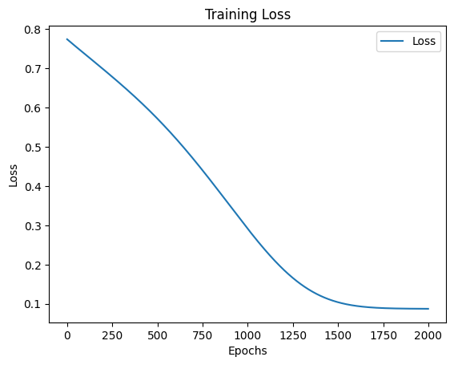
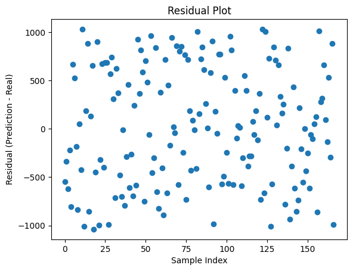
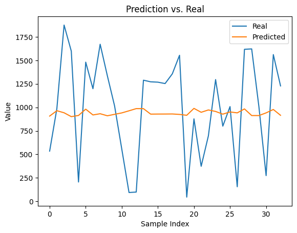

# Template
## Load modules & Check PyTorch


```python
# Import modules
import torch
import torch.nn as nn
import torch.optim as optim

import pandas as pd

# data processing
import random as r
from sys import exit
import numpy as np
import matplotlib.pyplot as plt
```

## Parameters


```python
# Debugger: Aktiviert
debug_mode = True
```

## Preloaded Modules


```python
def dict_to_markdown_table(data: dict, title: str = "Datenübersicht", include_index: bool = True, round_digits: int = 4):
    """
    Wandelt ein Dictionary mit Listenwerten in eine Markdown-Tabelle für Jupyter Notebooks um.
    
    - Schlüssel werden als Header genutzt
    - Erste Spalte ist ein Index, falls `include_index=True`
    - Einzelwerte werden als separate Tabelle unterhalb dargestellt
    - Zahlenwerte werden auf eine einstellbare Anzahl an Nachkommastellen gerundet

    :param data: Dictionary mit Key-Value-Paaren
    :param title: Überschrift für die Tabelle
    :param include_index: Falls True, wird eine Index-Spalte erstellt
    :param round_digits: Anzahl der Nachkommastellen, auf die Werte gerundet werden sollen
    :return: Markdown-String zur Anzeige in Jupyter
    """
    
    # Hilfsfunktion zum Runden von Zahlen
    def round_value(val):
        if isinstance(val, (int, float)):
            return round(val, round_digits)
        return val

    # Listen und einzelne Werte trennen
    list_data = {k: v for k, v in data.items() if isinstance(v, list)}
    single_values = {k: v for k, v in data.items() if not isinstance(v, list)}

    # Falls es Listen gibt, erstelle eine Tabelle mit Index
    if list_data:
        max_len = max(len(v) for v in list_data.values())  # Längste Liste bestimmen

        # Tabellenkopf
        md_table = f"### {title}\n\n"
        md_table += "| " + ("Index | " if include_index else "") + " | ".join(list_data.keys()) + " |\n"
        md_table += "|-" + ("-|" if include_index else "") + "-|".join(["-" * len(k) for k in list_data.keys()]) + "-|\n"

        # Datenzeilen
        for i in range(max_len):
            row = [str(i)] if include_index else []  # Index hinzufügen (optional)
            for key in list_data:
                if i < len(list_data[key]):
                    row.append(str(round_value(list_data[key][i])))
                else:
                    row.append("")  # Leere Werte für ungleich lange Listen
            md_table += "| " + " | ".join(row) + " |\n"
    
    else:
        md_table = ""

    # Einzelwerte als extra Tabelle darstellen
    if single_values:
        md_table += "\n\n#### Einzelwerte\n\n"
        md_table += "| " + " | ".join(single_values.keys()) + " |\n"
        md_table += "|-" + "-|".join(["-" * len(k) for k in single_values.keys()]) + "-|\n"
        md_table += "| " + " | ".join(map(lambda v: str(round_value(v)), single_values.values())) + " |\n"

    return Markdown(md_table)


def display_data_loss_table(data_dict, delta_sigma_pred, max_i):
    """
    Erstellt eine Markdown-Tabelle zur übersichtlichen Darstellung von Datenverlust.
    
    Unterstützt sowohl Python-Listen als auch NumPy-Arrays.
    
    :param data_dict: Dictionary mit `sigma_t` und `delta_sigma` (Listen oder np.arrays)
    :param delta_sigma_pred: Vorhergesagte Werte für `delta_sigma` (Liste oder np.array)
    :param max_i: Anzahl der Werte, die in der Tabelle angezeigt werden sollen
    """
    
    # Sicherstellen, dass `sigma_t` und `delta_sigma` existieren
    if "sigma_t" not in data_dict or "delta_sigma" not in data_dict or delta_sigma_pred is None:
        print("Fehler: `data_dict` oder `delta_sigma_pred` ist nicht korrekt definiert!")
        return

    # Konvertiere alle Werte zu Listen (falls sie NumPy-Arrays sind)
    def to_list(arr):
        return arr.tolist() if isinstance(arr, np.ndarray) else arr

    total_epsilon = to_list(data_dict["total_epsilon"])
    delta_epsilon = to_list(data_dict["delta_epsilon"])
    sigma_t = to_list(data_dict["sigma_t"])
    delta_sigma_true = to_list(data_dict["delta_sigma"])
    delta_sigma_pred = to_list(delta_sigma_pred.flatten())  # Falls `delta_sigma_pred` ein 2D-Array ist
    
    # Überprüfen, ob die Längen konsistent sind
    min_len = min(len(total_epsilon), len(sigma_t), len(delta_epsilon), len(delta_sigma_true), len(delta_sigma_pred), max_i)

    # Erstelle eine Tabelle für die übersichtliche Darstellung
    data_loss_table = {
        "total_epsilon" : list(total_epsilon[:min_len]), 
        "delta_epsilon" : list(delta_epsilon[:min_len]), 
        "sigma_t" : list(sigma_t[:min_len]), 
        "True delta_sigma": list(delta_sigma_true[:min_len]),
        "Predicted delta_sigma": list(delta_sigma_pred[:min_len]),
        "Test-Loss (True - Predicted)": list(np.round(np.array(delta_sigma_true[:min_len]) - np.array(delta_sigma_pred[:min_len]), 5))
    }

    # Markdown-Tabelle für bessere Darstellung in Jupyter
    display(dict_to_markdown_table(data_loss_table, title=f"Data-Loss bis sigma_{min_len-1}", include_index=True))
```

## Check for use of CONDA if available


```python
use_cuda = torch.cuda.is_available()
device = torch.device("cuda:0" if use_cuda else "cpu")

if device.type == 'cpu':
    device_num = 0
    print('No GPU available.')
else:
    device_num = torch.cuda.device_count()
    print('Device:', device, '-- Number of devices:', device_num)
```

    No GPU available.
    

# Recurrent Neural Networks

Just as people do not have to think again each time about the things they have already learned, it is also possible to teach neural networks to recall knowledge they were being taught. This is done in so-called Recurrent Neural Networks (RNNs) with loops inside, which allow information to be retained. Currently the most used architectures of RNNs are Long short-term memory (LSTM) networks. LSTMs are RNNs that overcome the problem of long-term dependencies and thus have achieved the most state-of-the-art results in this area. In this exercise we will look at how to use LSTMs to predict future values using time series data sets.

## Data processing


```python
import random

class Oedometer:
    def __init__(self, e_0: float = 1.00, C_c: float = 0.005, delta_epsilon: float = 0.0005, 
                 sigma_t: float = 1.00, max_n: int = 50, rand_epsilon:bool=False, **kwargs):
        self.max_n = max_n

        # Standardwerte als Listen setzen
        self.e_0 = [e_0]
        self.C_c = [C_c]
        self.sigma_t = [sigma_t]
        self.delta_epsilon = []
        self.total_epsilon = [0]

        # Initiale Listen für Berechnungen
        self.sigma_t = [sigma_t]
        self.delta_sigma = []
        self.e_s = []
        self.delta_epsilon = [delta_epsilon]
        
        # Dynamische Zuweisung von kwargs, falls vorhanden
        for key, value in kwargs.items():
            if hasattr(self, key):  # Nur vorhandene Attribute setzen
                setattr(self, key, [value])
        
        # Berechnungen durchführen
        self.__calc_sigma_t_p1()

        # Listenlängen anpassen
        self.__adjust_list_lengths()
        self.__calc_total_epsilon()

    def __adjust_list_lengths(self):
        """ Passt ALLE Listen-Attribute an `max_n` an. """
        attributes = ['e_0', 'C_c', 'delta_epsilon', 'sigma_t', 'sigma_t', 'delta_sigma', 'e_s']
        for attr in attributes:
            value_list = getattr(self, attr, [])
            current_length = len(value_list)

            if current_length > self.max_n:
                setattr(self, attr, value_list[:self.max_n])  # Kürzen
            elif current_length < self.max_n:
                setattr(self, attr, value_list + [value_list[-1] if value_list else 0] * (self.max_n - current_length))  # Auffüllen
    
    def __calc_total_epsilon(self):
        for i in range(len(self.delta_epsilon)-1):
            self.total_epsilon.append(self.total_epsilon[i] + self.delta_epsilon[i])            
    
    def __calc_e_s(self, sigma_t):
        """ Berechnet `e_s` aus `sigma_t`. """
        e_s = (1 + self.e_0[0]) / self.C_c[0] * sigma_t
        self.e_s.append(e_s)
        return e_s

    def __calc_sigma_t_p1(self):
        """ Berechnet `sigma_t` und `delta_sigma` für die nächsten Schritte. """
        for i in range(self.max_n):  # -1, weil sigma_t bereits gesetzt ist
            e_s = self.__calc_e_s(self.sigma_t[i])
            delta_sigma = e_s * self.delta_epsilon[0]
            sigma = self.sigma_t[i] + delta_sigma
            self.sigma_t.append(sigma)
            self.delta_sigma.append(delta_sigma)

def plot_input():
    # Plot
    plt.figure(figsize=(10, 5))
    plt.plot(data_dict_raw['sigma_t'], data_dict_raw['delta_sigma'], marker='o', linestyle='-', label='Sigma_0 = 1')
    
    # Formatting
    plt.xlabel('sigma_t')
    plt.ylabel('delta_simga')
    plt.title('Sigma_0 in relation to Sigma_1')
    plt.xticks(rotation=45)
    plt.grid(True)
    plt.legend()
    plt.tight_layout()
    plt.show()
```


```python
i = 500

oedo_para = {
    'max_n': 1, 
    'e_0': 1.0, 
    'C_c': 0.005,   
    'total_epsilon': 0,
    'e_s': 400.0
}

# Vorbereitung Tensoren
sigma_t = np.random.choice(range(1, 10000), size=i, replace=False)
delta_sigma = []
delta_epsilon = np.repeat(np.array(np.float64(0.0005)), i)
# delta_epsilon = np.random.uniform(0.0001, 0.001, size=i)
for i in range(i):
    oedo_para['sigma_t'] = sigma_t[i]
    oedo_para['delta_epsilon'] = delta_epsilon[i]
    oedo = Oedometer(**oedo_para)
    delta_sigma.append(round(oedo.delta_sigma[0], 2))

print('Anzahl Elemente delta_epsilon: ' + str(len(delta_epsilon)))
print('Anzahl Elemente sigma_t: ' + str(len(sigma_t)))
print('Anzahl Elemente delta_sigma: ' + str(len(delta_sigma)))
```

    Anzahl Elemente delta_epsilon: 500
    Anzahl Elemente sigma_t: 500
    Anzahl Elemente delta_sigma: 500
    


```python
data = [['sigma_t'] + sigma_t.tolist(), ['delta_sigma'] + delta_sigma, ['delta_epsilon'] + delta_epsilon.tolist()]
import tabulate
table = tabulate.tabulate(data, tablefmt='html')
table
```


<table>
<tbody>
<tr><td>sigma_t      </td><td style="text-align: right;">8150     </td><td style="text-align: right;">2789     </td><td style="text-align: right;">4573     </td><td style="text-align: right;">2842     </td><td style="text-align: right;">5398     </td><td style="text-align: right;">7318     </td><td style="text-align: right;">7491     </td><td style="text-align: right;">9248     </td><td style="text-align: right;">8565     </td><td style="text-align: right;">8998     </td><td style="text-align: right;">5486     </td><td style="text-align: right;">5994     </td><td style="text-align: right;">738     </td><td style="text-align: right;">8679     </td><td style="text-align: right;">69     </td><td style="text-align: right;">5570     </td><td style="text-align: right;">7006     </td><td style="text-align: right;">9562     </td><td style="text-align: right;">2811     </td><td style="text-align: right;">7770     </td><td style="text-align: right;">7208     </td><td style="text-align: right;">7399     </td><td style="text-align: right;">2272     </td><td style="text-align: right;">7596     </td><td style="text-align: right;">8758     </td><td style="text-align: right;">5023     </td><td style="text-align: right;">6789     </td><td style="text-align: right;">7833     </td><td style="text-align: right;">1562     </td><td style="text-align: right;">7335     </td><td style="text-align: right;">8008     </td><td style="text-align: right;">5154     </td><td style="text-align: right;">5736     </td><td style="text-align: right;">9143     </td><td style="text-align: right;">4146     </td><td style="text-align: right;">892     </td><td style="text-align: right;">2353     </td><td style="text-align: right;">998     </td><td style="text-align: right;">8605     </td><td style="text-align: right;">9077     </td><td style="text-align: right;">5513     </td><td style="text-align: right;">2389     </td><td style="text-align: right;">4624     </td><td style="text-align: right;">7388     </td><td style="text-align: right;">7838     </td><td style="text-align: right;">1753     </td><td style="text-align: right;">8407     </td><td style="text-align: right;">160     </td><td style="text-align: right;">156     </td><td style="text-align: right;">4530     </td><td style="text-align: right;">9218     </td><td style="text-align: right;">3927     </td><td style="text-align: right;">4375     </td><td style="text-align: right;">3360     </td><td style="text-align: right;">6908     </td><td style="text-align: right;">8954     </td><td style="text-align: right;">2072     </td><td style="text-align: right;">5207     </td><td style="text-align: right;">5878     </td><td style="text-align: right;">8993     </td><td style="text-align: right;">6663     </td><td style="text-align: right;">7859     </td><td style="text-align: right;">200     </td><td style="text-align: right;">5719     </td><td style="text-align: right;">7975     </td><td style="text-align: right;">7482     </td><td style="text-align: right;">6809     </td><td style="text-align: right;">6827     </td><td style="text-align: right;">1392     </td><td style="text-align: right;">2667     </td><td style="text-align: right;">9798     </td><td style="text-align: right;">2130     </td><td style="text-align: right;">3010     </td><td style="text-align: right;">7284     </td><td style="text-align: right;">1862     </td><td style="text-align: right;">8409     </td><td style="text-align: right;">9658     </td><td style="text-align: right;">6194     </td><td style="text-align: right;">1369     </td><td style="text-align: right;">9219     </td><td style="text-align: right;">4707     </td><td style="text-align: right;">4127     </td><td style="text-align: right;">402     </td><td style="text-align: right;">4335     </td><td style="text-align: right;">6548     </td><td style="text-align: right;">962     </td><td style="text-align: right;">1333     </td><td style="text-align: right;">7398     </td><td style="text-align: right;">2316     </td><td style="text-align: right;">9042     </td><td style="text-align: right;">8260     </td><td style="text-align: right;">6581     </td><td style="text-align: right;">6563     </td><td style="text-align: right;">7200     </td><td style="text-align: right;">4076     </td><td style="text-align: right;">7165     </td><td style="text-align: right;">7732     </td><td style="text-align: right;">8214     </td><td style="text-align: right;">2177     </td><td style="text-align: right;">3487     </td><td style="text-align: right;">4905     </td><td style="text-align: right;">6825     </td><td style="text-align: right;">2480     </td><td style="text-align: right;">6674     </td><td style="text-align: right;">3232     </td><td style="text-align: right;">3304     </td><td style="text-align: right;">7385     </td><td style="text-align: right;">8866     </td><td style="text-align: right;">2848     </td><td style="text-align: right;">3863     </td><td style="text-align: right;">7831     </td><td style="text-align: right;">9836     </td><td style="text-align: right;">3174     </td><td style="text-align: right;">988     </td><td style="text-align: right;">6642     </td><td style="text-align: right;">6386     </td><td style="text-align: right;">6627     </td><td style="text-align: right;">8697     </td><td style="text-align: right;">7378     </td><td style="text-align: right;">6015     </td><td style="text-align: right;">8614     </td><td style="text-align: right;">4028     </td><td style="text-align: right;">9484     </td><td style="text-align: right;">4897     </td><td style="text-align: right;">9959     </td><td style="text-align: right;">721     </td><td style="text-align: right;">3291     </td><td style="text-align: right;">3413     </td><td style="text-align: right;">8795     </td><td style="text-align: right;">825     </td><td style="text-align: right;">9953     </td><td style="text-align: right;">8191     </td><td style="text-align: right;">5695     </td><td style="text-align: right;">1482     </td><td style="text-align: right;">3603     </td><td style="text-align: right;">5973     </td><td style="text-align: right;">5236     </td><td style="text-align: right;">3367     </td><td style="text-align: right;">1032     </td><td style="text-align: right;">6022     </td><td style="text-align: right;">7455     </td><td style="text-align: right;">9765     </td><td style="text-align: right;">7947     </td><td style="text-align: right;">675     </td><td style="text-align: right;">5914     </td><td style="text-align: right;">7626     </td><td style="text-align: right;">83     </td><td style="text-align: right;">577     </td><td style="text-align: right;">7762     </td><td style="text-align: right;">3784     </td><td style="text-align: right;">7817     </td><td style="text-align: right;">6079     </td><td style="text-align: right;">4221     </td><td style="text-align: right;">8803     </td><td style="text-align: right;">9949     </td><td style="text-align: right;">6918     </td><td style="text-align: right;">9262     </td><td style="text-align: right;">3039     </td><td style="text-align: right;">1698     </td><td style="text-align: right;">8961     </td><td style="text-align: right;">2982     </td><td style="text-align: right;">6477     </td><td style="text-align: right;">7215     </td><td style="text-align: right;">3264     </td><td style="text-align: right;">9499     </td><td style="text-align: right;">1893     </td><td style="text-align: right;">5209     </td><td style="text-align: right;">4490     </td><td style="text-align: right;">7479     </td><td style="text-align: right;">7713     </td><td style="text-align: right;">8696     </td><td style="text-align: right;">4960     </td><td style="text-align: right;">1302     </td><td style="text-align: right;">7543     </td><td style="text-align: right;">776     </td><td style="text-align: right;">9566     </td><td style="text-align: right;">2457     </td><td style="text-align: right;">1874     </td><td style="text-align: right;">7149     </td><td style="text-align: right;">4287     </td><td style="text-align: right;">3895     </td><td style="text-align: right;">5333     </td><td style="text-align: right;">1895     </td><td style="text-align: right;">2958     </td><td style="text-align: right;">9130     </td><td style="text-align: right;">6047     </td><td style="text-align: right;">7443     </td><td style="text-align: right;">9478     </td><td style="text-align: right;">8562     </td><td style="text-align: right;">9510     </td><td style="text-align: right;">8421     </td><td style="text-align: right;">2705     </td><td style="text-align: right;">9148     </td><td style="text-align: right;">3250     </td><td style="text-align: right;">7719     </td><td style="text-align: right;">5630     </td><td style="text-align: right;">6943     </td><td style="text-align: right;">4330     </td><td style="text-align: right;">1904     </td><td style="text-align: right;">1365     </td><td style="text-align: right;">621     </td><td style="text-align: right;">9648     </td><td style="text-align: right;">5292     </td><td style="text-align: right;">9823     </td><td style="text-align: right;">2220     </td><td style="text-align: right;">8377     </td><td style="text-align: right;">218     </td><td style="text-align: right;">3467     </td><td style="text-align: right;">7949     </td><td style="text-align: right;">3439     </td><td style="text-align: right;">247     </td><td style="text-align: right;">8464     </td><td style="text-align: right;">2918     </td><td style="text-align: right;">8941     </td><td style="text-align: right;">1959     </td><td style="text-align: right;">7148     </td><td style="text-align: right;">3578     </td><td style="text-align: right;">1290     </td><td style="text-align: right;">6779     </td><td style="text-align: right;">264     </td><td style="text-align: right;">6407     </td><td style="text-align: right;">5120     </td><td style="text-align: right;">7189     </td><td style="text-align: right;">463     </td><td style="text-align: right;">6747     </td><td style="text-align: right;">2466     </td><td style="text-align: right;">1131     </td><td style="text-align: right;">6780     </td><td style="text-align: right;">7060     </td><td style="text-align: right;">2476     </td><td style="text-align: right;">8649     </td><td style="text-align: right;">5267     </td><td style="text-align: right;">9699     </td><td style="text-align: right;">2261     </td><td style="text-align: right;">5592     </td><td style="text-align: right;">7864     </td><td style="text-align: right;">9779     </td><td style="text-align: right;">3013     </td><td style="text-align: right;">7808     </td><td style="text-align: right;">8617     </td><td style="text-align: right;">5155     </td><td style="text-align: right;">5130     </td><td style="text-align: right;">5925     </td><td style="text-align: right;">9943     </td><td style="text-align: right;">7779     </td><td style="text-align: right;">2498     </td><td style="text-align: right;">2689     </td><td style="text-align: right;">3741     </td><td style="text-align: right;">4214     </td><td style="text-align: right;">1857     </td><td style="text-align: right;">6987     </td><td style="text-align: right;">4916     </td><td style="text-align: right;">1913     </td><td style="text-align: right;">3690     </td><td style="text-align: right;">6835     </td><td style="text-align: right;">8226     </td><td style="text-align: right;">6431     </td><td style="text-align: right;">4446     </td><td style="text-align: right;">777     </td><td style="text-align: right;">1802     </td><td style="text-align: right;">5882     </td><td style="text-align: right;">5410     </td><td style="text-align: right;">3371     </td><td style="text-align: right;">7009     </td><td style="text-align: right;">5317     </td><td style="text-align: right;">9497     </td><td style="text-align: right;">2712     </td><td style="text-align: right;">5168     </td><td style="text-align: right;">6675     </td><td style="text-align: right;">5422     </td><td style="text-align: right;">9274     </td><td style="text-align: right;">2557     </td><td style="text-align: right;">4419     </td><td style="text-align: right;">136     </td><td style="text-align: right;">7526     </td><td style="text-align: right;">7298     </td><td style="text-align: right;">7990     </td><td style="text-align: right;">6010     </td><td style="text-align: right;">1251     </td><td style="text-align: right;">5772     </td><td style="text-align: right;">4468     </td><td style="text-align: right;">6994     </td><td style="text-align: right;">6018     </td><td style="text-align: right;">9212     </td><td style="text-align: right;">9348     </td><td style="text-align: right;">277     </td><td style="text-align: right;">705     </td><td style="text-align: right;">3190     </td><td style="text-align: right;">562     </td><td style="text-align: right;">6207     </td><td style="text-align: right;">596     </td><td style="text-align: right;">6442     </td><td style="text-align: right;">5769     </td><td style="text-align: right;">7894     </td><td style="text-align: right;">4902     </td><td style="text-align: right;">1571     </td><td style="text-align: right;">6810     </td><td style="text-align: right;">382     </td><td style="text-align: right;">9061     </td><td style="text-align: right;">9396     </td><td style="text-align: right;">2421     </td><td style="text-align: right;">5099     </td><td style="text-align: right;">7522     </td><td style="text-align: right;">5999     </td><td style="text-align: right;">3     </td><td style="text-align: right;">8131     </td><td style="text-align: right;">9900     </td><td style="text-align: right;">7893     </td><td style="text-align: right;">1265     </td><td style="text-align: right;">2568     </td><td style="text-align: right;">632     </td><td style="text-align: right;">3656     </td><td style="text-align: right;">7340     </td><td style="text-align: right;">2717     </td><td style="text-align: right;">9340     </td><td style="text-align: right;">6238     </td><td style="text-align: right;">2236     </td><td style="text-align: right;">114     </td><td style="text-align: right;">7561     </td><td style="text-align: right;">7113     </td><td style="text-align: right;">837     </td><td style="text-align: right;">1981     </td><td style="text-align: right;">9883     </td><td style="text-align: right;">9403     </td><td style="text-align: right;">9930     </td><td style="text-align: right;">5757     </td><td style="text-align: right;">2871     </td><td style="text-align: right;">6267     </td><td style="text-align: right;">9062     </td><td style="text-align: right;">5812     </td><td style="text-align: right;">3721     </td><td style="text-align: right;">8677     </td><td style="text-align: right;">2660     </td><td style="text-align: right;">7594     </td><td style="text-align: right;">7253     </td><td style="text-align: right;">8618     </td><td style="text-align: right;">6791     </td><td style="text-align: right;">9479     </td><td style="text-align: right;">2454     </td><td style="text-align: right;">2212     </td><td style="text-align: right;">5723     </td><td style="text-align: right;">9476     </td><td style="text-align: right;">5545     </td><td style="text-align: right;">7404     </td><td style="text-align: right;">380     </td><td style="text-align: right;">9581     </td><td style="text-align: right;">4869     </td><td style="text-align: right;">779     </td><td style="text-align: right;">8861     </td><td style="text-align: right;">5062     </td><td style="text-align: right;">1956     </td><td style="text-align: right;">9966     </td><td style="text-align: right;">8104     </td><td style="text-align: right;">1113     </td><td style="text-align: right;">9631     </td><td style="text-align: right;">7410     </td><td style="text-align: right;">2183     </td><td style="text-align: right;">6813     </td><td style="text-align: right;">2040     </td><td style="text-align: right;">1349     </td><td style="text-align: right;">9646     </td><td style="text-align: right;">2976     </td><td style="text-align: right;">1202     </td><td style="text-align: right;">3111     </td><td style="text-align: right;">8515     </td><td style="text-align: right;">2554     </td><td style="text-align: right;">2991     </td><td style="text-align: right;">7304     </td><td style="text-align: right;">9036     </td><td style="text-align: right;">5793     </td><td style="text-align: right;">9290     </td><td style="text-align: right;">7228     </td><td style="text-align: right;">3217     </td><td style="text-align: right;">7987     </td><td style="text-align: right;">6942     </td><td style="text-align: right;">8937     </td><td style="text-align: right;">4527     </td><td style="text-align: right;">8061     </td><td style="text-align: right;">1004     </td><td style="text-align: right;">2812     </td><td style="text-align: right;">820     </td><td style="text-align: right;">1675     </td><td style="text-align: right;">8482     </td><td style="text-align: right;">2147     </td><td style="text-align: right;">2403     </td><td style="text-align: right;">5144     </td><td style="text-align: right;">419     </td><td style="text-align: right;">6822     </td><td style="text-align: right;">6953     </td><td style="text-align: right;">1264     </td><td style="text-align: right;">7936     </td><td style="text-align: right;">9710     </td><td style="text-align: right;">3938     </td><td style="text-align: right;">7086     </td><td style="text-align: right;">9961     </td><td style="text-align: right;">2289     </td><td style="text-align: right;">8136     </td><td style="text-align: right;">3381     </td><td style="text-align: right;">5845     </td><td style="text-align: right;">615     </td><td style="text-align: right;">4470     </td><td style="text-align: right;">5334     </td><td style="text-align: right;">959     </td><td style="text-align: right;">7506     </td><td style="text-align: right;">1535     </td><td style="text-align: right;">437     </td><td style="text-align: right;">5760     </td><td style="text-align: right;">1473     </td><td style="text-align: right;">8369     </td><td style="text-align: right;">2083     </td><td style="text-align: right;">3869     </td><td style="text-align: right;">7195     </td><td style="text-align: right;">5053     </td><td style="text-align: right;">5260     </td><td style="text-align: right;">7294     </td><td style="text-align: right;">478     </td><td style="text-align: right;">3785     </td><td style="text-align: right;">1421     </td><td style="text-align: right;">457     </td><td style="text-align: right;">1487     </td><td style="text-align: right;">3407     </td><td style="text-align: right;">4942     </td><td style="text-align: right;">8217     </td><td style="text-align: right;">2747     </td><td style="text-align: right;">353     </td><td style="text-align: right;">9464     </td><td style="text-align: right;">4910     </td><td style="text-align: right;">5423     </td><td style="text-align: right;">1396     </td><td style="text-align: right;">840     </td><td style="text-align: right;">7462     </td><td style="text-align: right;">7989     </td><td style="text-align: right;">2942     </td><td style="text-align: right;">6132     </td><td style="text-align: right;">8197     </td><td style="text-align: right;">855     </td><td style="text-align: right;">522     </td><td style="text-align: right;">7438     </td><td style="text-align: right;">3545     </td><td style="text-align: right;">5476     </td><td style="text-align: right;">5124     </td><td style="text-align: right;">5156     </td><td style="text-align: right;">8188     </td><td style="text-align: right;">7145     </td><td style="text-align: right;">2763     </td><td style="text-align: right;">2906     </td><td style="text-align: right;">6848     </td><td style="text-align: right;">6868     </td><td style="text-align: right;">6871     </td><td style="text-align: right;">5080     </td><td style="text-align: right;">5523     </td><td style="text-align: right;">4338     </td><td style="text-align: right;">5692     </td><td style="text-align: right;">3481     </td><td style="text-align: right;">8660     </td><td style="text-align: right;">546     </td><td style="text-align: right;">7891     </td><td style="text-align: right;">556     </td><td style="text-align: right;">3985     </td><td style="text-align: right;">1432     </td><td style="text-align: right;">9747     </td><td style="text-align: right;">8698     </td><td style="text-align: right;">1464     </td><td style="text-align: right;">1162     </td><td style="text-align: right;">4458     </td><td style="text-align: right;">1839     </td><td style="text-align: right;">3091     </td><td style="text-align: right;">4118     </td><td style="text-align: right;">3811     </td><td style="text-align: right;">8938     </td><td style="text-align: right;">6748     </td><td style="text-align: right;">1274     </td><td style="text-align: right;">9333     </td><td style="text-align: right;">7711     </td><td style="text-align: right;">3420     </td><td style="text-align: right;">8043     </td><td style="text-align: right;">9906     </td><td style="text-align: right;">9538     </td><td style="text-align: right;">4717     </td><td style="text-align: right;">6210     </td><td style="text-align: right;">8126     </td><td style="text-align: right;">5609     </td><td style="text-align: right;">7472     </td><td style="text-align: right;">6796     </td><td style="text-align: right;">8530     </td><td style="text-align: right;">5966     </td><td style="text-align: right;">5856     </td><td style="text-align: right;">5083     </td><td style="text-align: right;">4590     </td><td style="text-align: right;">9461     </td><td style="text-align: right;">754     </td><td style="text-align: right;">3192     </td><td style="text-align: right;">3359     </td><td style="text-align: right;">1671     </td><td style="text-align: right;">4258     </td><td style="text-align: right;">5774     </td><td style="text-align: right;">2662     </td><td style="text-align: right;">6339     </td><td style="text-align: right;">982     </td><td style="text-align: right;">9579     </td></tr>
<tr><td>delta_sigma  </td><td style="text-align: right;">1630     </td><td style="text-align: right;"> 557.8   </td><td style="text-align: right;"> 914.6   </td><td style="text-align: right;"> 568.4   </td><td style="text-align: right;">1079.6   </td><td style="text-align: right;">1463.6   </td><td style="text-align: right;">1498.2   </td><td style="text-align: right;">1849.6   </td><td style="text-align: right;">1713     </td><td style="text-align: right;">1799.6   </td><td style="text-align: right;">1097.2   </td><td style="text-align: right;">1198.8   </td><td style="text-align: right;">147.6   </td><td style="text-align: right;">1735.8   </td><td style="text-align: right;">13.8   </td><td style="text-align: right;">1114     </td><td style="text-align: right;">1401.2   </td><td style="text-align: right;">1912.4   </td><td style="text-align: right;"> 562.2   </td><td style="text-align: right;">1554     </td><td style="text-align: right;">1441.6   </td><td style="text-align: right;">1479.8   </td><td style="text-align: right;"> 454.4   </td><td style="text-align: right;">1519.2   </td><td style="text-align: right;">1751.6   </td><td style="text-align: right;">1004.6   </td><td style="text-align: right;">1357.8   </td><td style="text-align: right;">1566.6   </td><td style="text-align: right;"> 312.4   </td><td style="text-align: right;">1467     </td><td style="text-align: right;">1601.6   </td><td style="text-align: right;">1030.8   </td><td style="text-align: right;">1147.2   </td><td style="text-align: right;">1828.6   </td><td style="text-align: right;"> 829.2   </td><td style="text-align: right;">178.4   </td><td style="text-align: right;"> 470.6   </td><td style="text-align: right;">199.6   </td><td style="text-align: right;">1721     </td><td style="text-align: right;">1815.4   </td><td style="text-align: right;">1102.6   </td><td style="text-align: right;"> 477.8   </td><td style="text-align: right;"> 924.8   </td><td style="text-align: right;">1477.6   </td><td style="text-align: right;">1567.6   </td><td style="text-align: right;"> 350.6   </td><td style="text-align: right;">1681.4   </td><td style="text-align: right;"> 32     </td><td style="text-align: right;"> 31.2   </td><td style="text-align: right;"> 906     </td><td style="text-align: right;">1843.6   </td><td style="text-align: right;"> 785.4   </td><td style="text-align: right;"> 875     </td><td style="text-align: right;"> 672     </td><td style="text-align: right;">1381.6   </td><td style="text-align: right;">1790.8   </td><td style="text-align: right;"> 414.4   </td><td style="text-align: right;">1041.4   </td><td style="text-align: right;">1175.6   </td><td style="text-align: right;">1798.6   </td><td style="text-align: right;">1332.6   </td><td style="text-align: right;">1571.8   </td><td style="text-align: right;"> 40     </td><td style="text-align: right;">1143.8   </td><td style="text-align: right;">1595     </td><td style="text-align: right;">1496.4   </td><td style="text-align: right;">1361.8   </td><td style="text-align: right;">1365.4   </td><td style="text-align: right;"> 278.4   </td><td style="text-align: right;"> 533.4   </td><td style="text-align: right;">1959.6   </td><td style="text-align: right;"> 426     </td><td style="text-align: right;"> 602     </td><td style="text-align: right;">1456.8   </td><td style="text-align: right;"> 372.4   </td><td style="text-align: right;">1681.8   </td><td style="text-align: right;">1931.6   </td><td style="text-align: right;">1238.8   </td><td style="text-align: right;"> 273.8   </td><td style="text-align: right;">1843.8   </td><td style="text-align: right;"> 941.4   </td><td style="text-align: right;"> 825.4   </td><td style="text-align: right;"> 80.4   </td><td style="text-align: right;"> 867     </td><td style="text-align: right;">1309.6   </td><td style="text-align: right;">192.4   </td><td style="text-align: right;"> 266.6   </td><td style="text-align: right;">1479.6   </td><td style="text-align: right;"> 463.2   </td><td style="text-align: right;">1808.4   </td><td style="text-align: right;">1652     </td><td style="text-align: right;">1316.2   </td><td style="text-align: right;">1312.6   </td><td style="text-align: right;">1440     </td><td style="text-align: right;"> 815.2   </td><td style="text-align: right;">1433     </td><td style="text-align: right;">1546.4   </td><td style="text-align: right;">1642.8   </td><td style="text-align: right;"> 435.4   </td><td style="text-align: right;"> 697.4   </td><td style="text-align: right;"> 981     </td><td style="text-align: right;">1365     </td><td style="text-align: right;"> 496     </td><td style="text-align: right;">1334.8   </td><td style="text-align: right;"> 646.4   </td><td style="text-align: right;"> 660.8   </td><td style="text-align: right;">1477     </td><td style="text-align: right;">1773.2   </td><td style="text-align: right;"> 569.6   </td><td style="text-align: right;"> 772.6   </td><td style="text-align: right;">1566.2   </td><td style="text-align: right;">1967.2   </td><td style="text-align: right;"> 634.8   </td><td style="text-align: right;">197.6   </td><td style="text-align: right;">1328.4   </td><td style="text-align: right;">1277.2   </td><td style="text-align: right;">1325.4   </td><td style="text-align: right;">1739.4   </td><td style="text-align: right;">1475.6   </td><td style="text-align: right;">1203     </td><td style="text-align: right;">1722.8   </td><td style="text-align: right;"> 805.6   </td><td style="text-align: right;">1896.8   </td><td style="text-align: right;"> 979.4   </td><td style="text-align: right;">1991.8   </td><td style="text-align: right;">144.2   </td><td style="text-align: right;"> 658.2   </td><td style="text-align: right;"> 682.6   </td><td style="text-align: right;">1759     </td><td style="text-align: right;">165     </td><td style="text-align: right;">1990.6   </td><td style="text-align: right;">1638.2   </td><td style="text-align: right;">1139     </td><td style="text-align: right;"> 296.4   </td><td style="text-align: right;"> 720.6   </td><td style="text-align: right;">1194.6   </td><td style="text-align: right;">1047.2   </td><td style="text-align: right;"> 673.4   </td><td style="text-align: right;"> 206.4   </td><td style="text-align: right;">1204.4   </td><td style="text-align: right;">1491     </td><td style="text-align: right;">1953     </td><td style="text-align: right;">1589.4   </td><td style="text-align: right;">135     </td><td style="text-align: right;">1182.8   </td><td style="text-align: right;">1525.2   </td><td style="text-align: right;">16.6   </td><td style="text-align: right;">115.4   </td><td style="text-align: right;">1552.4   </td><td style="text-align: right;"> 756.8   </td><td style="text-align: right;">1563.4   </td><td style="text-align: right;">1215.8   </td><td style="text-align: right;"> 844.2   </td><td style="text-align: right;">1760.6   </td><td style="text-align: right;">1989.8   </td><td style="text-align: right;">1383.6   </td><td style="text-align: right;">1852.4   </td><td style="text-align: right;"> 607.8   </td><td style="text-align: right;"> 339.6   </td><td style="text-align: right;">1792.2   </td><td style="text-align: right;"> 596.4   </td><td style="text-align: right;">1295.4   </td><td style="text-align: right;">1443     </td><td style="text-align: right;"> 652.8   </td><td style="text-align: right;">1899.8   </td><td style="text-align: right;"> 378.6   </td><td style="text-align: right;">1041.8   </td><td style="text-align: right;"> 898     </td><td style="text-align: right;">1495.8   </td><td style="text-align: right;">1542.6   </td><td style="text-align: right;">1739.2   </td><td style="text-align: right;"> 992     </td><td style="text-align: right;"> 260.4   </td><td style="text-align: right;">1508.6   </td><td style="text-align: right;">155.2   </td><td style="text-align: right;">1913.2   </td><td style="text-align: right;"> 491.4   </td><td style="text-align: right;"> 374.8   </td><td style="text-align: right;">1429.8   </td><td style="text-align: right;"> 857.4   </td><td style="text-align: right;"> 779     </td><td style="text-align: right;">1066.6   </td><td style="text-align: right;"> 379     </td><td style="text-align: right;"> 591.6   </td><td style="text-align: right;">1826     </td><td style="text-align: right;">1209.4   </td><td style="text-align: right;">1488.6   </td><td style="text-align: right;">1895.6   </td><td style="text-align: right;">1712.4   </td><td style="text-align: right;">1902     </td><td style="text-align: right;">1684.2   </td><td style="text-align: right;"> 541     </td><td style="text-align: right;">1829.6   </td><td style="text-align: right;"> 650     </td><td style="text-align: right;">1543.8   </td><td style="text-align: right;">1126     </td><td style="text-align: right;">1388.6   </td><td style="text-align: right;"> 866     </td><td style="text-align: right;"> 380.8   </td><td style="text-align: right;"> 273     </td><td style="text-align: right;">124.2   </td><td style="text-align: right;">1929.6   </td><td style="text-align: right;">1058.4   </td><td style="text-align: right;">1964.6   </td><td style="text-align: right;"> 444     </td><td style="text-align: right;">1675.4   </td><td style="text-align: right;"> 43.6   </td><td style="text-align: right;"> 693.4   </td><td style="text-align: right;">1589.8   </td><td style="text-align: right;"> 687.8   </td><td style="text-align: right;"> 49.4   </td><td style="text-align: right;">1692.8   </td><td style="text-align: right;"> 583.6   </td><td style="text-align: right;">1788.2   </td><td style="text-align: right;"> 391.8   </td><td style="text-align: right;">1429.6   </td><td style="text-align: right;"> 715.6   </td><td style="text-align: right;"> 258     </td><td style="text-align: right;">1355.8   </td><td style="text-align: right;"> 52.8   </td><td style="text-align: right;">1281.4   </td><td style="text-align: right;">1024     </td><td style="text-align: right;">1437.8   </td><td style="text-align: right;"> 92.6   </td><td style="text-align: right;">1349.4   </td><td style="text-align: right;"> 493.2   </td><td style="text-align: right;"> 226.2   </td><td style="text-align: right;">1356     </td><td style="text-align: right;">1412     </td><td style="text-align: right;"> 495.2   </td><td style="text-align: right;">1729.8   </td><td style="text-align: right;">1053.4   </td><td style="text-align: right;">1939.8   </td><td style="text-align: right;"> 452.2   </td><td style="text-align: right;">1118.4   </td><td style="text-align: right;">1572.8   </td><td style="text-align: right;">1955.8   </td><td style="text-align: right;"> 602.6   </td><td style="text-align: right;">1561.6   </td><td style="text-align: right;">1723.4   </td><td style="text-align: right;">1031     </td><td style="text-align: right;">1026     </td><td style="text-align: right;">1185     </td><td style="text-align: right;">1988.6   </td><td style="text-align: right;">1555.8   </td><td style="text-align: right;"> 499.6   </td><td style="text-align: right;"> 537.8   </td><td style="text-align: right;"> 748.2   </td><td style="text-align: right;"> 842.8   </td><td style="text-align: right;"> 371.4   </td><td style="text-align: right;">1397.4   </td><td style="text-align: right;"> 983.2   </td><td style="text-align: right;"> 382.6   </td><td style="text-align: right;"> 738     </td><td style="text-align: right;">1367     </td><td style="text-align: right;">1645.2   </td><td style="text-align: right;">1286.2   </td><td style="text-align: right;"> 889.2   </td><td style="text-align: right;">155.4   </td><td style="text-align: right;"> 360.4   </td><td style="text-align: right;">1176.4   </td><td style="text-align: right;">1082     </td><td style="text-align: right;"> 674.2   </td><td style="text-align: right;">1401.8   </td><td style="text-align: right;">1063.4   </td><td style="text-align: right;">1899.4   </td><td style="text-align: right;"> 542.4   </td><td style="text-align: right;">1033.6   </td><td style="text-align: right;">1335     </td><td style="text-align: right;">1084.4   </td><td style="text-align: right;">1854.8   </td><td style="text-align: right;"> 511.4   </td><td style="text-align: right;"> 883.8   </td><td style="text-align: right;"> 27.2   </td><td style="text-align: right;">1505.2   </td><td style="text-align: right;">1459.6   </td><td style="text-align: right;">1598     </td><td style="text-align: right;">1202     </td><td style="text-align: right;"> 250.2   </td><td style="text-align: right;">1154.4   </td><td style="text-align: right;"> 893.6   </td><td style="text-align: right;">1398.8   </td><td style="text-align: right;">1203.6   </td><td style="text-align: right;">1842.4   </td><td style="text-align: right;">1869.6   </td><td style="text-align: right;"> 55.4   </td><td style="text-align: right;">141     </td><td style="text-align: right;"> 638     </td><td style="text-align: right;">112.4   </td><td style="text-align: right;">1241.4   </td><td style="text-align: right;">119.2   </td><td style="text-align: right;">1288.4   </td><td style="text-align: right;">1153.8   </td><td style="text-align: right;">1578.8   </td><td style="text-align: right;"> 980.4   </td><td style="text-align: right;"> 314.2   </td><td style="text-align: right;">1362     </td><td style="text-align: right;"> 76.4   </td><td style="text-align: right;">1812.2   </td><td style="text-align: right;">1879.2   </td><td style="text-align: right;"> 484.2   </td><td style="text-align: right;">1019.8   </td><td style="text-align: right;">1504.4   </td><td style="text-align: right;">1199.8   </td><td style="text-align: right;">0.6   </td><td style="text-align: right;">1626.2   </td><td style="text-align: right;">1980     </td><td style="text-align: right;">1578.6   </td><td style="text-align: right;"> 253     </td><td style="text-align: right;"> 513.6   </td><td style="text-align: right;">126.4   </td><td style="text-align: right;"> 731.2   </td><td style="text-align: right;">1468     </td><td style="text-align: right;"> 543.4   </td><td style="text-align: right;">1868     </td><td style="text-align: right;">1247.6   </td><td style="text-align: right;"> 447.2   </td><td style="text-align: right;"> 22.8   </td><td style="text-align: right;">1512.2   </td><td style="text-align: right;">1422.6   </td><td style="text-align: right;">167.4   </td><td style="text-align: right;"> 396.2   </td><td style="text-align: right;">1976.6   </td><td style="text-align: right;">1880.6   </td><td style="text-align: right;">1986     </td><td style="text-align: right;">1151.4   </td><td style="text-align: right;"> 574.2   </td><td style="text-align: right;">1253.4   </td><td style="text-align: right;">1812.4   </td><td style="text-align: right;">1162.4   </td><td style="text-align: right;"> 744.2   </td><td style="text-align: right;">1735.4   </td><td style="text-align: right;"> 532     </td><td style="text-align: right;">1518.8   </td><td style="text-align: right;">1450.6   </td><td style="text-align: right;">1723.6   </td><td style="text-align: right;">1358.2   </td><td style="text-align: right;">1895.8   </td><td style="text-align: right;"> 490.8   </td><td style="text-align: right;"> 442.4   </td><td style="text-align: right;">1144.6   </td><td style="text-align: right;">1895.2   </td><td style="text-align: right;">1109     </td><td style="text-align: right;">1480.8   </td><td style="text-align: right;"> 76     </td><td style="text-align: right;">1916.2   </td><td style="text-align: right;"> 973.8   </td><td style="text-align: right;">155.8   </td><td style="text-align: right;">1772.2   </td><td style="text-align: right;">1012.4   </td><td style="text-align: right;"> 391.2   </td><td style="text-align: right;">1993.2   </td><td style="text-align: right;">1620.8   </td><td style="text-align: right;"> 222.6   </td><td style="text-align: right;">1926.2   </td><td style="text-align: right;">1482     </td><td style="text-align: right;"> 436.6   </td><td style="text-align: right;">1362.6   </td><td style="text-align: right;"> 408     </td><td style="text-align: right;"> 269.8   </td><td style="text-align: right;">1929.2   </td><td style="text-align: right;"> 595.2   </td><td style="text-align: right;"> 240.4   </td><td style="text-align: right;"> 622.2   </td><td style="text-align: right;">1703     </td><td style="text-align: right;"> 510.8   </td><td style="text-align: right;"> 598.2   </td><td style="text-align: right;">1460.8   </td><td style="text-align: right;">1807.2   </td><td style="text-align: right;">1158.6   </td><td style="text-align: right;">1858     </td><td style="text-align: right;">1445.6   </td><td style="text-align: right;"> 643.4   </td><td style="text-align: right;">1597.4   </td><td style="text-align: right;">1388.4   </td><td style="text-align: right;">1787.4   </td><td style="text-align: right;"> 905.4   </td><td style="text-align: right;">1612.2   </td><td style="text-align: right;"> 200.8   </td><td style="text-align: right;"> 562.4   </td><td style="text-align: right;">164     </td><td style="text-align: right;"> 335     </td><td style="text-align: right;">1696.4   </td><td style="text-align: right;"> 429.4   </td><td style="text-align: right;"> 480.6   </td><td style="text-align: right;">1028.8   </td><td style="text-align: right;"> 83.8   </td><td style="text-align: right;">1364.4   </td><td style="text-align: right;">1390.6   </td><td style="text-align: right;"> 252.8   </td><td style="text-align: right;">1587.2   </td><td style="text-align: right;">1942     </td><td style="text-align: right;"> 787.6   </td><td style="text-align: right;">1417.2   </td><td style="text-align: right;">1992.2   </td><td style="text-align: right;"> 457.8   </td><td style="text-align: right;">1627.2   </td><td style="text-align: right;"> 676.2   </td><td style="text-align: right;">1169     </td><td style="text-align: right;">123     </td><td style="text-align: right;"> 894     </td><td style="text-align: right;">1066.8   </td><td style="text-align: right;">191.8   </td><td style="text-align: right;">1501.2   </td><td style="text-align: right;"> 307     </td><td style="text-align: right;"> 87.4   </td><td style="text-align: right;">1152     </td><td style="text-align: right;"> 294.6   </td><td style="text-align: right;">1673.8   </td><td style="text-align: right;"> 416.6   </td><td style="text-align: right;"> 773.8   </td><td style="text-align: right;">1439     </td><td style="text-align: right;">1010.6   </td><td style="text-align: right;">1052     </td><td style="text-align: right;">1458.8   </td><td style="text-align: right;"> 95.6   </td><td style="text-align: right;"> 757     </td><td style="text-align: right;"> 284.2   </td><td style="text-align: right;"> 91.4   </td><td style="text-align: right;"> 297.4   </td><td style="text-align: right;"> 681.4   </td><td style="text-align: right;"> 988.4   </td><td style="text-align: right;">1643.4   </td><td style="text-align: right;"> 549.4   </td><td style="text-align: right;"> 70.6   </td><td style="text-align: right;">1892.8   </td><td style="text-align: right;"> 982     </td><td style="text-align: right;">1084.6   </td><td style="text-align: right;"> 279.2   </td><td style="text-align: right;">168     </td><td style="text-align: right;">1492.4   </td><td style="text-align: right;">1597.8   </td><td style="text-align: right;"> 588.4   </td><td style="text-align: right;">1226.4   </td><td style="text-align: right;">1639.4   </td><td style="text-align: right;">171     </td><td style="text-align: right;">104.4   </td><td style="text-align: right;">1487.6   </td><td style="text-align: right;"> 709     </td><td style="text-align: right;">1095.2   </td><td style="text-align: right;">1024.8   </td><td style="text-align: right;">1031.2   </td><td style="text-align: right;">1637.6   </td><td style="text-align: right;">1429     </td><td style="text-align: right;"> 552.6   </td><td style="text-align: right;"> 581.2   </td><td style="text-align: right;">1369.6   </td><td style="text-align: right;">1373.6   </td><td style="text-align: right;">1374.2   </td><td style="text-align: right;">1016     </td><td style="text-align: right;">1104.6   </td><td style="text-align: right;"> 867.6   </td><td style="text-align: right;">1138.4   </td><td style="text-align: right;"> 696.2   </td><td style="text-align: right;">1732     </td><td style="text-align: right;">109.2   </td><td style="text-align: right;">1578.2   </td><td style="text-align: right;">111.2   </td><td style="text-align: right;"> 797     </td><td style="text-align: right;"> 286.4   </td><td style="text-align: right;">1949.4   </td><td style="text-align: right;">1739.6   </td><td style="text-align: right;"> 292.8   </td><td style="text-align: right;"> 232.4   </td><td style="text-align: right;"> 891.6   </td><td style="text-align: right;"> 367.8   </td><td style="text-align: right;"> 618.2   </td><td style="text-align: right;"> 823.6   </td><td style="text-align: right;"> 762.2   </td><td style="text-align: right;">1787.6   </td><td style="text-align: right;">1349.6   </td><td style="text-align: right;"> 254.8   </td><td style="text-align: right;">1866.6   </td><td style="text-align: right;">1542.2   </td><td style="text-align: right;"> 684     </td><td style="text-align: right;">1608.6   </td><td style="text-align: right;">1981.2   </td><td style="text-align: right;">1907.6   </td><td style="text-align: right;"> 943.4   </td><td style="text-align: right;">1242     </td><td style="text-align: right;">1625.2   </td><td style="text-align: right;">1121.8   </td><td style="text-align: right;">1494.4   </td><td style="text-align: right;">1359.2   </td><td style="text-align: right;">1706     </td><td style="text-align: right;">1193.2   </td><td style="text-align: right;">1171.2   </td><td style="text-align: right;">1016.6   </td><td style="text-align: right;"> 918     </td><td style="text-align: right;">1892.2   </td><td style="text-align: right;">150.8   </td><td style="text-align: right;"> 638.4   </td><td style="text-align: right;"> 671.8   </td><td style="text-align: right;"> 334.2   </td><td style="text-align: right;"> 851.6   </td><td style="text-align: right;">1154.8   </td><td style="text-align: right;"> 532.4   </td><td style="text-align: right;">1267.8   </td><td style="text-align: right;">196.4   </td><td style="text-align: right;">1915.8   </td></tr>
<tr><td>delta_epsilon</td><td style="text-align: right;">   0.0005</td><td style="text-align: right;">   0.0005</td><td style="text-align: right;">   0.0005</td><td style="text-align: right;">   0.0005</td><td style="text-align: right;">   0.0005</td><td style="text-align: right;">   0.0005</td><td style="text-align: right;">   0.0005</td><td style="text-align: right;">   0.0005</td><td style="text-align: right;">   0.0005</td><td style="text-align: right;">   0.0005</td><td style="text-align: right;">   0.0005</td><td style="text-align: right;">   0.0005</td><td style="text-align: right;">  0.0005</td><td style="text-align: right;">   0.0005</td><td style="text-align: right;"> 0.0005</td><td style="text-align: right;">   0.0005</td><td style="text-align: right;">   0.0005</td><td style="text-align: right;">   0.0005</td><td style="text-align: right;">   0.0005</td><td style="text-align: right;">   0.0005</td><td style="text-align: right;">   0.0005</td><td style="text-align: right;">   0.0005</td><td style="text-align: right;">   0.0005</td><td style="text-align: right;">   0.0005</td><td style="text-align: right;">   0.0005</td><td style="text-align: right;">   0.0005</td><td style="text-align: right;">   0.0005</td><td style="text-align: right;">   0.0005</td><td style="text-align: right;">   0.0005</td><td style="text-align: right;">   0.0005</td><td style="text-align: right;">   0.0005</td><td style="text-align: right;">   0.0005</td><td style="text-align: right;">   0.0005</td><td style="text-align: right;">   0.0005</td><td style="text-align: right;">   0.0005</td><td style="text-align: right;">  0.0005</td><td style="text-align: right;">   0.0005</td><td style="text-align: right;">  0.0005</td><td style="text-align: right;">   0.0005</td><td style="text-align: right;">   0.0005</td><td style="text-align: right;">   0.0005</td><td style="text-align: right;">   0.0005</td><td style="text-align: right;">   0.0005</td><td style="text-align: right;">   0.0005</td><td style="text-align: right;">   0.0005</td><td style="text-align: right;">   0.0005</td><td style="text-align: right;">   0.0005</td><td style="text-align: right;">  0.0005</td><td style="text-align: right;">  0.0005</td><td style="text-align: right;">   0.0005</td><td style="text-align: right;">   0.0005</td><td style="text-align: right;">   0.0005</td><td style="text-align: right;">   0.0005</td><td style="text-align: right;">   0.0005</td><td style="text-align: right;">   0.0005</td><td style="text-align: right;">   0.0005</td><td style="text-align: right;">   0.0005</td><td style="text-align: right;">   0.0005</td><td style="text-align: right;">   0.0005</td><td style="text-align: right;">   0.0005</td><td style="text-align: right;">   0.0005</td><td style="text-align: right;">   0.0005</td><td style="text-align: right;">  0.0005</td><td style="text-align: right;">   0.0005</td><td style="text-align: right;">   0.0005</td><td style="text-align: right;">   0.0005</td><td style="text-align: right;">   0.0005</td><td style="text-align: right;">   0.0005</td><td style="text-align: right;">   0.0005</td><td style="text-align: right;">   0.0005</td><td style="text-align: right;">   0.0005</td><td style="text-align: right;">   0.0005</td><td style="text-align: right;">   0.0005</td><td style="text-align: right;">   0.0005</td><td style="text-align: right;">   0.0005</td><td style="text-align: right;">   0.0005</td><td style="text-align: right;">   0.0005</td><td style="text-align: right;">   0.0005</td><td style="text-align: right;">   0.0005</td><td style="text-align: right;">   0.0005</td><td style="text-align: right;">   0.0005</td><td style="text-align: right;">   0.0005</td><td style="text-align: right;">  0.0005</td><td style="text-align: right;">   0.0005</td><td style="text-align: right;">   0.0005</td><td style="text-align: right;">  0.0005</td><td style="text-align: right;">   0.0005</td><td style="text-align: right;">   0.0005</td><td style="text-align: right;">   0.0005</td><td style="text-align: right;">   0.0005</td><td style="text-align: right;">   0.0005</td><td style="text-align: right;">   0.0005</td><td style="text-align: right;">   0.0005</td><td style="text-align: right;">   0.0005</td><td style="text-align: right;">   0.0005</td><td style="text-align: right;">   0.0005</td><td style="text-align: right;">   0.0005</td><td style="text-align: right;">   0.0005</td><td style="text-align: right;">   0.0005</td><td style="text-align: right;">   0.0005</td><td style="text-align: right;">   0.0005</td><td style="text-align: right;">   0.0005</td><td style="text-align: right;">   0.0005</td><td style="text-align: right;">   0.0005</td><td style="text-align: right;">   0.0005</td><td style="text-align: right;">   0.0005</td><td style="text-align: right;">   0.0005</td><td style="text-align: right;">   0.0005</td><td style="text-align: right;">   0.0005</td><td style="text-align: right;">   0.0005</td><td style="text-align: right;">   0.0005</td><td style="text-align: right;">   0.0005</td><td style="text-align: right;">   0.0005</td><td style="text-align: right;">  0.0005</td><td style="text-align: right;">   0.0005</td><td style="text-align: right;">   0.0005</td><td style="text-align: right;">   0.0005</td><td style="text-align: right;">   0.0005</td><td style="text-align: right;">   0.0005</td><td style="text-align: right;">   0.0005</td><td style="text-align: right;">   0.0005</td><td style="text-align: right;">   0.0005</td><td style="text-align: right;">   0.0005</td><td style="text-align: right;">   0.0005</td><td style="text-align: right;">   0.0005</td><td style="text-align: right;">  0.0005</td><td style="text-align: right;">   0.0005</td><td style="text-align: right;">   0.0005</td><td style="text-align: right;">   0.0005</td><td style="text-align: right;">  0.0005</td><td style="text-align: right;">   0.0005</td><td style="text-align: right;">   0.0005</td><td style="text-align: right;">   0.0005</td><td style="text-align: right;">   0.0005</td><td style="text-align: right;">   0.0005</td><td style="text-align: right;">   0.0005</td><td style="text-align: right;">   0.0005</td><td style="text-align: right;">   0.0005</td><td style="text-align: right;">   0.0005</td><td style="text-align: right;">   0.0005</td><td style="text-align: right;">   0.0005</td><td style="text-align: right;">   0.0005</td><td style="text-align: right;">   0.0005</td><td style="text-align: right;">  0.0005</td><td style="text-align: right;">   0.0005</td><td style="text-align: right;">   0.0005</td><td style="text-align: right;"> 0.0005</td><td style="text-align: right;">  0.0005</td><td style="text-align: right;">   0.0005</td><td style="text-align: right;">   0.0005</td><td style="text-align: right;">   0.0005</td><td style="text-align: right;">   0.0005</td><td style="text-align: right;">   0.0005</td><td style="text-align: right;">   0.0005</td><td style="text-align: right;">   0.0005</td><td style="text-align: right;">   0.0005</td><td style="text-align: right;">   0.0005</td><td style="text-align: right;">   0.0005</td><td style="text-align: right;">   0.0005</td><td style="text-align: right;">   0.0005</td><td style="text-align: right;">   0.0005</td><td style="text-align: right;">   0.0005</td><td style="text-align: right;">   0.0005</td><td style="text-align: right;">   0.0005</td><td style="text-align: right;">   0.0005</td><td style="text-align: right;">   0.0005</td><td style="text-align: right;">   0.0005</td><td style="text-align: right;">   0.0005</td><td style="text-align: right;">   0.0005</td><td style="text-align: right;">   0.0005</td><td style="text-align: right;">   0.0005</td><td style="text-align: right;">   0.0005</td><td style="text-align: right;">   0.0005</td><td style="text-align: right;">   0.0005</td><td style="text-align: right;">  0.0005</td><td style="text-align: right;">   0.0005</td><td style="text-align: right;">   0.0005</td><td style="text-align: right;">   0.0005</td><td style="text-align: right;">   0.0005</td><td style="text-align: right;">   0.0005</td><td style="text-align: right;">   0.0005</td><td style="text-align: right;">   0.0005</td><td style="text-align: right;">   0.0005</td><td style="text-align: right;">   0.0005</td><td style="text-align: right;">   0.0005</td><td style="text-align: right;">   0.0005</td><td style="text-align: right;">   0.0005</td><td style="text-align: right;">   0.0005</td><td style="text-align: right;">   0.0005</td><td style="text-align: right;">   0.0005</td><td style="text-align: right;">   0.0005</td><td style="text-align: right;">   0.0005</td><td style="text-align: right;">   0.0005</td><td style="text-align: right;">   0.0005</td><td style="text-align: right;">   0.0005</td><td style="text-align: right;">   0.0005</td><td style="text-align: right;">   0.0005</td><td style="text-align: right;">   0.0005</td><td style="text-align: right;">   0.0005</td><td style="text-align: right;">   0.0005</td><td style="text-align: right;">  0.0005</td><td style="text-align: right;">   0.0005</td><td style="text-align: right;">   0.0005</td><td style="text-align: right;">   0.0005</td><td style="text-align: right;">   0.0005</td><td style="text-align: right;">   0.0005</td><td style="text-align: right;">  0.0005</td><td style="text-align: right;">   0.0005</td><td style="text-align: right;">   0.0005</td><td style="text-align: right;">   0.0005</td><td style="text-align: right;">  0.0005</td><td style="text-align: right;">   0.0005</td><td style="text-align: right;">   0.0005</td><td style="text-align: right;">   0.0005</td><td style="text-align: right;">   0.0005</td><td style="text-align: right;">   0.0005</td><td style="text-align: right;">   0.0005</td><td style="text-align: right;">   0.0005</td><td style="text-align: right;">   0.0005</td><td style="text-align: right;">  0.0005</td><td style="text-align: right;">   0.0005</td><td style="text-align: right;">   0.0005</td><td style="text-align: right;">   0.0005</td><td style="text-align: right;">  0.0005</td><td style="text-align: right;">   0.0005</td><td style="text-align: right;">   0.0005</td><td style="text-align: right;">   0.0005</td><td style="text-align: right;">   0.0005</td><td style="text-align: right;">   0.0005</td><td style="text-align: right;">   0.0005</td><td style="text-align: right;">   0.0005</td><td style="text-align: right;">   0.0005</td><td style="text-align: right;">   0.0005</td><td style="text-align: right;">   0.0005</td><td style="text-align: right;">   0.0005</td><td style="text-align: right;">   0.0005</td><td style="text-align: right;">   0.0005</td><td style="text-align: right;">   0.0005</td><td style="text-align: right;">   0.0005</td><td style="text-align: right;">   0.0005</td><td style="text-align: right;">   0.0005</td><td style="text-align: right;">   0.0005</td><td style="text-align: right;">   0.0005</td><td style="text-align: right;">   0.0005</td><td style="text-align: right;">   0.0005</td><td style="text-align: right;">   0.0005</td><td style="text-align: right;">   0.0005</td><td style="text-align: right;">   0.0005</td><td style="text-align: right;">   0.0005</td><td style="text-align: right;">   0.0005</td><td style="text-align: right;">   0.0005</td><td style="text-align: right;">   0.0005</td><td style="text-align: right;">   0.0005</td><td style="text-align: right;">   0.0005</td><td style="text-align: right;">   0.0005</td><td style="text-align: right;">   0.0005</td><td style="text-align: right;">   0.0005</td><td style="text-align: right;">   0.0005</td><td style="text-align: right;">  0.0005</td><td style="text-align: right;">   0.0005</td><td style="text-align: right;">   0.0005</td><td style="text-align: right;">   0.0005</td><td style="text-align: right;">   0.0005</td><td style="text-align: right;">   0.0005</td><td style="text-align: right;">   0.0005</td><td style="text-align: right;">   0.0005</td><td style="text-align: right;">   0.0005</td><td style="text-align: right;">   0.0005</td><td style="text-align: right;">   0.0005</td><td style="text-align: right;">   0.0005</td><td style="text-align: right;">   0.0005</td><td style="text-align: right;">   0.0005</td><td style="text-align: right;">   0.0005</td><td style="text-align: right;">  0.0005</td><td style="text-align: right;">   0.0005</td><td style="text-align: right;">   0.0005</td><td style="text-align: right;">   0.0005</td><td style="text-align: right;">   0.0005</td><td style="text-align: right;">   0.0005</td><td style="text-align: right;">   0.0005</td><td style="text-align: right;">   0.0005</td><td style="text-align: right;">   0.0005</td><td style="text-align: right;">   0.0005</td><td style="text-align: right;">   0.0005</td><td style="text-align: right;">   0.0005</td><td style="text-align: right;">  0.0005</td><td style="text-align: right;">  0.0005</td><td style="text-align: right;">   0.0005</td><td style="text-align: right;">  0.0005</td><td style="text-align: right;">   0.0005</td><td style="text-align: right;">  0.0005</td><td style="text-align: right;">   0.0005</td><td style="text-align: right;">   0.0005</td><td style="text-align: right;">   0.0005</td><td style="text-align: right;">   0.0005</td><td style="text-align: right;">   0.0005</td><td style="text-align: right;">   0.0005</td><td style="text-align: right;">  0.0005</td><td style="text-align: right;">   0.0005</td><td style="text-align: right;">   0.0005</td><td style="text-align: right;">   0.0005</td><td style="text-align: right;">   0.0005</td><td style="text-align: right;">   0.0005</td><td style="text-align: right;">   0.0005</td><td style="text-align: right;">0.0005</td><td style="text-align: right;">   0.0005</td><td style="text-align: right;">   0.0005</td><td style="text-align: right;">   0.0005</td><td style="text-align: right;">   0.0005</td><td style="text-align: right;">   0.0005</td><td style="text-align: right;">  0.0005</td><td style="text-align: right;">   0.0005</td><td style="text-align: right;">   0.0005</td><td style="text-align: right;">   0.0005</td><td style="text-align: right;">   0.0005</td><td style="text-align: right;">   0.0005</td><td style="text-align: right;">   0.0005</td><td style="text-align: right;">  0.0005</td><td style="text-align: right;">   0.0005</td><td style="text-align: right;">   0.0005</td><td style="text-align: right;">  0.0005</td><td style="text-align: right;">   0.0005</td><td style="text-align: right;">   0.0005</td><td style="text-align: right;">   0.0005</td><td style="text-align: right;">   0.0005</td><td style="text-align: right;">   0.0005</td><td style="text-align: right;">   0.0005</td><td style="text-align: right;">   0.0005</td><td style="text-align: right;">   0.0005</td><td style="text-align: right;">   0.0005</td><td style="text-align: right;">   0.0005</td><td style="text-align: right;">   0.0005</td><td style="text-align: right;">   0.0005</td><td style="text-align: right;">   0.0005</td><td style="text-align: right;">   0.0005</td><td style="text-align: right;">   0.0005</td><td style="text-align: right;">   0.0005</td><td style="text-align: right;">   0.0005</td><td style="text-align: right;">   0.0005</td><td style="text-align: right;">   0.0005</td><td style="text-align: right;">   0.0005</td><td style="text-align: right;">   0.0005</td><td style="text-align: right;">   0.0005</td><td style="text-align: right;">   0.0005</td><td style="text-align: right;">  0.0005</td><td style="text-align: right;">   0.0005</td><td style="text-align: right;">   0.0005</td><td style="text-align: right;">  0.0005</td><td style="text-align: right;">   0.0005</td><td style="text-align: right;">   0.0005</td><td style="text-align: right;">   0.0005</td><td style="text-align: right;">   0.0005</td><td style="text-align: right;">   0.0005</td><td style="text-align: right;">   0.0005</td><td style="text-align: right;">   0.0005</td><td style="text-align: right;">   0.0005</td><td style="text-align: right;">   0.0005</td><td style="text-align: right;">   0.0005</td><td style="text-align: right;">   0.0005</td><td style="text-align: right;">   0.0005</td><td style="text-align: right;">   0.0005</td><td style="text-align: right;">   0.0005</td><td style="text-align: right;">   0.0005</td><td style="text-align: right;">   0.0005</td><td style="text-align: right;">   0.0005</td><td style="text-align: right;">   0.0005</td><td style="text-align: right;">   0.0005</td><td style="text-align: right;">   0.0005</td><td style="text-align: right;">   0.0005</td><td style="text-align: right;">   0.0005</td><td style="text-align: right;">   0.0005</td><td style="text-align: right;">   0.0005</td><td style="text-align: right;">   0.0005</td><td style="text-align: right;">   0.0005</td><td style="text-align: right;">   0.0005</td><td style="text-align: right;">   0.0005</td><td style="text-align: right;">   0.0005</td><td style="text-align: right;">   0.0005</td><td style="text-align: right;">   0.0005</td><td style="text-align: right;">   0.0005</td><td style="text-align: right;">  0.0005</td><td style="text-align: right;">   0.0005</td><td style="text-align: right;">   0.0005</td><td style="text-align: right;">   0.0005</td><td style="text-align: right;">   0.0005</td><td style="text-align: right;">   0.0005</td><td style="text-align: right;">  0.0005</td><td style="text-align: right;">   0.0005</td><td style="text-align: right;">   0.0005</td><td style="text-align: right;">   0.0005</td><td style="text-align: right;">   0.0005</td><td style="text-align: right;">   0.0005</td><td style="text-align: right;">   0.0005</td><td style="text-align: right;">   0.0005</td><td style="text-align: right;">   0.0005</td><td style="text-align: right;">   0.0005</td><td style="text-align: right;">   0.0005</td><td style="text-align: right;">   0.0005</td><td style="text-align: right;">   0.0005</td><td style="text-align: right;">  0.0005</td><td style="text-align: right;">   0.0005</td><td style="text-align: right;">   0.0005</td><td style="text-align: right;">  0.0005</td><td style="text-align: right;">   0.0005</td><td style="text-align: right;">   0.0005</td><td style="text-align: right;">  0.0005</td><td style="text-align: right;">   0.0005</td><td style="text-align: right;">   0.0005</td><td style="text-align: right;">   0.0005</td><td style="text-align: right;">   0.0005</td><td style="text-align: right;">   0.0005</td><td style="text-align: right;">   0.0005</td><td style="text-align: right;">   0.0005</td><td style="text-align: right;">   0.0005</td><td style="text-align: right;">   0.0005</td><td style="text-align: right;">  0.0005</td><td style="text-align: right;">   0.0005</td><td style="text-align: right;">   0.0005</td><td style="text-align: right;">  0.0005</td><td style="text-align: right;">   0.0005</td><td style="text-align: right;">   0.0005</td><td style="text-align: right;">   0.0005</td><td style="text-align: right;">   0.0005</td><td style="text-align: right;">   0.0005</td><td style="text-align: right;">  0.0005</td><td style="text-align: right;">   0.0005</td><td style="text-align: right;">   0.0005</td><td style="text-align: right;">   0.0005</td><td style="text-align: right;">   0.0005</td><td style="text-align: right;">  0.0005</td><td style="text-align: right;">   0.0005</td><td style="text-align: right;">   0.0005</td><td style="text-align: right;">   0.0005</td><td style="text-align: right;">   0.0005</td><td style="text-align: right;">   0.0005</td><td style="text-align: right;">  0.0005</td><td style="text-align: right;">  0.0005</td><td style="text-align: right;">   0.0005</td><td style="text-align: right;">   0.0005</td><td style="text-align: right;">   0.0005</td><td style="text-align: right;">   0.0005</td><td style="text-align: right;">   0.0005</td><td style="text-align: right;">   0.0005</td><td style="text-align: right;">   0.0005</td><td style="text-align: right;">   0.0005</td><td style="text-align: right;">   0.0005</td><td style="text-align: right;">   0.0005</td><td style="text-align: right;">   0.0005</td><td style="text-align: right;">   0.0005</td><td style="text-align: right;">   0.0005</td><td style="text-align: right;">   0.0005</td><td style="text-align: right;">   0.0005</td><td style="text-align: right;">   0.0005</td><td style="text-align: right;">   0.0005</td><td style="text-align: right;">   0.0005</td><td style="text-align: right;">  0.0005</td><td style="text-align: right;">   0.0005</td><td style="text-align: right;">  0.0005</td><td style="text-align: right;">   0.0005</td><td style="text-align: right;">   0.0005</td><td style="text-align: right;">   0.0005</td><td style="text-align: right;">   0.0005</td><td style="text-align: right;">   0.0005</td><td style="text-align: right;">   0.0005</td><td style="text-align: right;">   0.0005</td><td style="text-align: right;">   0.0005</td><td style="text-align: right;">   0.0005</td><td style="text-align: right;">   0.0005</td><td style="text-align: right;">   0.0005</td><td style="text-align: right;">   0.0005</td><td style="text-align: right;">   0.0005</td><td style="text-align: right;">   0.0005</td><td style="text-align: right;">   0.0005</td><td style="text-align: right;">   0.0005</td><td style="text-align: right;">   0.0005</td><td style="text-align: right;">   0.0005</td><td style="text-align: right;">   0.0005</td><td style="text-align: right;">   0.0005</td><td style="text-align: right;">   0.0005</td><td style="text-align: right;">   0.0005</td><td style="text-align: right;">   0.0005</td><td style="text-align: right;">   0.0005</td><td style="text-align: right;">   0.0005</td><td style="text-align: right;">   0.0005</td><td style="text-align: right;">   0.0005</td><td style="text-align: right;">   0.0005</td><td style="text-align: right;">   0.0005</td><td style="text-align: right;">   0.0005</td><td style="text-align: right;">   0.0005</td><td style="text-align: right;">   0.0005</td><td style="text-align: right;">  0.0005</td><td style="text-align: right;">   0.0005</td><td style="text-align: right;">   0.0005</td><td style="text-align: right;">   0.0005</td><td style="text-align: right;">   0.0005</td><td style="text-align: right;">   0.0005</td><td style="text-align: right;">   0.0005</td><td style="text-align: right;">   0.0005</td><td style="text-align: right;">  0.0005</td><td style="text-align: right;">   0.0005</td></tr>
</tbody>
</table>


```python
from sklearn.preprocessing import MinMaxScaler

data = {
    'input1': sigma_t,
    'input2': delta_epsilon,
    'output': delta_sigma
}
df = pd.DataFrame(data)

# Normalisierung
scaler = MinMaxScaler()
scaled_data = scaler.fit_transform(df)

# Zurück in DataFrame
df_scaled = pd.DataFrame(scaled_data, columns=df.columns)
df_scaled
```


<div>
<style scoped>
    .dataframe tbody tr th:only-of-type {
        vertical-align: middle;
    }

    .dataframe tbody tr th {
        vertical-align: top;
    }

    .dataframe thead th {
        text-align: right;
    }
</style>
<table border="1" class="dataframe">
  <thead>
    <tr style="text-align: right;">
      <th></th>
      <th>input1</th>
      <th>input2</th>
      <th>output</th>
    </tr>
  </thead>
  <tbody>
    <tr>
      <th>0</th>
      <td>0.817726</td>
      <td>0.0</td>
      <td>0.817726</td>
    </tr>
    <tr>
      <th>1</th>
      <td>0.279635</td>
      <td>0.0</td>
      <td>0.279635</td>
    </tr>
    <tr>
      <th>2</th>
      <td>0.458697</td>
      <td>0.0</td>
      <td>0.458697</td>
    </tr>
    <tr>
      <th>3</th>
      <td>0.284954</td>
      <td>0.0</td>
      <td>0.284954</td>
    </tr>
    <tr>
      <th>4</th>
      <td>0.541504</td>
      <td>0.0</td>
      <td>0.541504</td>
    </tr>
    <tr>
      <th>...</th>
      <td>...</td>
      <td>...</td>
      <td>...</td>
    </tr>
    <tr>
      <th>495</th>
      <td>0.579243</td>
      <td>0.0</td>
      <td>0.579243</td>
    </tr>
    <tr>
      <th>496</th>
      <td>0.266887</td>
      <td>0.0</td>
      <td>0.266887</td>
    </tr>
    <tr>
      <th>497</th>
      <td>0.635953</td>
      <td>0.0</td>
      <td>0.635953</td>
    </tr>
    <tr>
      <th>498</th>
      <td>0.098264</td>
      <td>0.0</td>
      <td>0.098264</td>
    </tr>
    <tr>
      <th>499</th>
      <td>0.961156</td>
      <td>0.0</td>
      <td>0.961156</td>
    </tr>
  </tbody>
</table>
<p>500 rows × 3 columns</p>
</div>


## Auszug aus Tutorial 6

    # Create sequences
    # Function to create sequences of input (passenger of train_window months) and ...
    # ... output passenger of train_window+1 month
    
    def create_inout_sequences(input_data, tw):
        inout_seq = []
        L = len(input_data)
        for i in range(L-tw):
            train_seq = input_data[i:i+tw]
            train_label = input_data[i+tw:i+tw+1]
            inout_seq.append((train_seq ,train_<label))
        return inout_seq
    
    # Set an appropiate Train window
    # TODO start**
    train_window = 24
    
    # Create sequences 
    trva_inout_seq = create_inout_sequences(trva_data_normalized, train_window)
    
    # Print the first 3 sequences
    print(trva_inout_seq[:3])


```python
import numpy as np
import torch

lookback=1

def create_dataset(df, lookback=1):
    """
    Erzeugt die Eingabe- und Ziel-Datensätze für ein LSTM.
    
    lookback definiert hier, wie viele vergangene Zeitschritte
    (Train Window / Sequences im Tutorial) das Modell als Input
    für jede Vorhersage erhält. Dadurch entsteht die nötige
    3D-Form (batch_size, seq_length, input_size), die ein LSTM erwartet,
    um zeitliche Abhängigkeiten zu lernen.
    """
    X, y = [], []
    for i in range(len(df) - lookback):
        # Wir nehmen hier 'lookback' Zeilen als eine Sequenz,
        # damit das LSTM-Modell weiß, wie weit es in die Vergangenheit
        # zurückschauen muss. Ohne diese Sequenz-Dimension (seq_length)
        # wäre die Eingabe nur eine 2D-Matrix und das LSTM könnte
        # keine zeitlichen Muster erfassen.
        seq = df.iloc[i:i+lookback, :-1].values
        X.append(seq)
        
        # Zielwert: der Wert direkt nach dieser Sequenz
        y.append(df.iloc[i+lookback, -1])
    
    # Rückgabe als Tensor mit Form (batch_size, seq_length, input_size) und (batch_size,)
    return torch.tensor(np.array(X), dtype=torch.float32), \
           torch.tensor(np.array(y), dtype=torch.float32)

X, y = create_dataset(df_scaled, lookback)
X_input_all = df_scaled.iloc[lookback:, :-1].to_numpy(dtype=np.float32)

print(np.shape(X))  # z.B. (4997, 3, 2)

# Falls lookback=1, wäre X anfangs (5000, 1, 2).
# Mit squeeze() könnte man die mittlere Dimension entfernen,
# aber für LSTM brauchen wir sie genau so:
# X = X.squeeze()
print(np.shape(X))
```

    torch.Size([499, 1, 2])
    torch.Size([499, 1, 2])
    


```python
# --- Aufteilen in Training (2/3) und Test (1/3) ---
train_size = int(X.shape[0] * 2/3)
X_train = X[:train_size]
y_train = y[:train_size].view(-1, 1)  # als (batch_size, 1)
X_test  = X[train_size:]
y_test  = y[train_size:].view(-1, 1)

X_input_train = X_input_all[:train_size]
X_input_test  = X_input_all[train_size:]

print("Shapes:")
print("  X_train:", X_train.shape, "y_train:", y_train.shape, "X_input_train:", X_input_train.shape)
print("  X_test: ", X_test.shape,  "y_test: ", y_test.shape,  "X_input_test: ",  X_input_test.shape)
```

    Shapes:
      X_train: torch.Size([332, 1, 2]) y_train: torch.Size([332, 1]) X_input_train: (332, 2)
      X_test:  torch.Size([167, 1, 2]) y_test:  torch.Size([167, 1]) X_input_test:  (167, 2)
    


```python
import torch.nn as nn

class LSTMModel(nn.Module):
    def __init__(self, input_size, hidden_size, num_layers, output_size):
        super(LSTMModel, self).__init__()
        self.lstm = nn.LSTM(input_size, hidden_size, num_layers, batch_first=True)
        self.fc = nn.Linear(hidden_size, output_size)

    def forward(self, x):
        _, (hn, _) = self.lstm(x)
        out = self.fc(hn[-1])
        return out

# Modell initialisieren
model = LSTMModel(input_size=2, hidden_size=50, num_layers=2, output_size=1)

```


```python
import torch.optim as optim

# Hyperparameter
input_size = X_train .shape[2]  # Anzahl der Input-Features
hidden_size = 10  # Die Anzahl der Neuronen im LSTM
num_layers = 2  # Anzahl der LSTM-Schichten
output_size = 1  # Output ist eine einzelne Zahl
epochs = 2000
improvment_block = False

# Modell, Loss und Optimizer
model = LSTMModel(input_size, hidden_size, num_layers, output_size)
criterion = nn.MSELoss()  # Mean Squared Error Loss
optimizer = optim.Adam(model.parameters(), lr=0.0001)
```


```python
# Frühzeitige Beendigung: Überwache den Verlust auf den Validierungsdaten
best_val_loss = float('inf')  # Initialer hoher Verlust
patience = 20  # Anzahl der Epochen ohne Verbesserung, bevor das Training gestoppt wird
patience_counter = 0  # Zähler für die Anzahl der Epochen ohne Verbesserung

# Liste zum Speichern der Loss-Werte
losses = []

# Training
for epoch in range(epochs):
    model.train()
    optimizer.zero_grad()
    outputs = model(X_train)
    loss = criterion(outputs, y_train)  # Verlust auf den Trainingsdaten
    loss.backward()
    optimizer.step()

    # Verlust speichern
    losses.append(loss.item())

    if improvment_block:
        # Validierungsverlust berechnen
        model.eval()  # Modell in Evaluierungsmodus setzen
        with torch.no_grad():
            val_outputs = model(X_test)  # Vorhersagen auf den Validierungsdaten
            val_loss = criterion(val_outputs, y_test)  # Verlust auf den Validierungsdaten
    
        # Frühzeitige Beendigung überwachen
        if val_loss < best_val_loss:
            best_val_loss = val_loss
            patience_counter = 0  # Reset der Geduld
        else:
            patience_counter += 1
    
        # Wenn keine Verbesserung erfolgt, abbrechen
        if patience_counter >= patience:
            print(f"Frühzeitige Beendigung nach {epoch + 1} Epochen wegen fehlender Verbesserung.")
            break

    # Ausgabe der Verlustinformationen
    if (epoch + 1) % 10 == 0:
        print(f'Epoch {epoch+1}/{epochs}, Train Loss: {loss.item()}' + (f', Validation Loss: {val_loss.item()}' if improvment_block else ""))
```

    Epoch 10/2000, Train Loss: 0.7704921960830688
    Epoch 20/2000, Train Loss: 0.7665892243385315
    Epoch 30/2000, Train Loss: 0.7627096772193909
    Epoch 40/2000, Train Loss: 0.7588527798652649
    Epoch 50/2000, Train Loss: 0.7550166845321655
    Epoch 60/2000, Train Loss: 0.751198947429657
    Epoch 70/2000, Train Loss: 0.7473960518836975
    Epoch 80/2000, Train Loss: 0.7436046004295349
    Epoch 90/2000, Train Loss: 0.7398207783699036
    Epoch 100/2000, Train Loss: 0.7360410094261169
    Epoch 110/2000, Train Loss: 0.7322626113891602
    Epoch 120/2000, Train Loss: 0.728483259677887
    Epoch 130/2000, Train Loss: 0.7247013449668884
    Epoch 140/2000, Train Loss: 0.7209151983261108
    Epoch 150/2000, Train Loss: 0.7171234488487244
    Epoch 160/2000, Train Loss: 0.7133249044418335
    Epoch 170/2000, Train Loss: 0.709518551826477
    Epoch 180/2000, Train Loss: 0.7057028412818909
    Epoch 190/2000, Train Loss: 0.7018768191337585
    Epoch 200/2000, Train Loss: 0.6980395317077637
    Epoch 210/2000, Train Loss: 0.6941899061203003
    Epoch 220/2000, Train Loss: 0.6903271079063416
    Epoch 230/2000, Train Loss: 0.6864498257637024
    Epoch 240/2000, Train Loss: 0.6825569868087769
    Epoch 250/2000, Train Loss: 0.6786479949951172
    Epoch 260/2000, Train Loss: 0.6747214794158936
    Epoch 270/2000, Train Loss: 0.6707764267921448
    Epoch 280/2000, Train Loss: 0.6668116450309753
    Epoch 290/2000, Train Loss: 0.6628261208534241
    Epoch 300/2000, Train Loss: 0.6588186025619507
    Epoch 310/2000, Train Loss: 0.6547878384590149
    Epoch 320/2000, Train Loss: 0.6507326364517212
    Epoch 330/2000, Train Loss: 0.6466516852378845
    Epoch 340/2000, Train Loss: 0.6425436735153198
    Epoch 350/2000, Train Loss: 0.638407289981842
    Epoch 360/2000, Train Loss: 0.6342412829399109
    Epoch 370/2000, Train Loss: 0.6300442218780518
    Epoch 380/2000, Train Loss: 0.6258150339126587
    Epoch 390/2000, Train Loss: 0.6215522885322571
    Epoch 400/2000, Train Loss: 0.6172549724578857
    Epoch 410/2000, Train Loss: 0.6129218339920044
    Epoch 420/2000, Train Loss: 0.6085518598556519
    Epoch 430/2000, Train Loss: 0.6041440963745117
    Epoch 440/2000, Train Loss: 0.5996973514556885
    Epoch 450/2000, Train Loss: 0.5952108502388
    Epoch 460/2000, Train Loss: 0.5906838178634644
    Epoch 470/2000, Train Loss: 0.5861154794692993
    Epoch 480/2000, Train Loss: 0.5815049409866333
    Epoch 490/2000, Train Loss: 0.5768516063690186
    Epoch 500/2000, Train Loss: 0.5721551179885864
    Epoch 510/2000, Train Loss: 0.5674148201942444
    Epoch 520/2000, Train Loss: 0.5626302361488342
    Epoch 530/2000, Train Loss: 0.5578012466430664
    Epoch 540/2000, Train Loss: 0.5529274344444275
    Epoch 550/2000, Train Loss: 0.5480085611343384
    Epoch 560/2000, Train Loss: 0.5430446267127991
    Epoch 570/2000, Train Loss: 0.5380355715751648
    Epoch 580/2000, Train Loss: 0.5329813361167908
    Epoch 590/2000, Train Loss: 0.5278820395469666
    Epoch 600/2000, Train Loss: 0.522737979888916
    Epoch 610/2000, Train Loss: 0.5175493359565735
    Epoch 620/2000, Train Loss: 0.5123164057731628
    Epoch 630/2000, Train Loss: 0.5070396065711975
    Epoch 640/2000, Train Loss: 0.5017195343971252
    Epoch 650/2000, Train Loss: 0.49635663628578186
    Epoch 660/2000, Train Loss: 0.49095144867897034
    Epoch 670/2000, Train Loss: 0.4855048954486847
    Epoch 680/2000, Train Loss: 0.4800175130367279
    Epoch 690/2000, Train Loss: 0.4744902551174164
    Epoch 700/2000, Train Loss: 0.4689239263534546
    Epoch 710/2000, Train Loss: 0.4633195400238037
    Epoch 720/2000, Train Loss: 0.4576779901981354
    Epoch 730/2000, Train Loss: 0.45200052857398987
    Epoch 740/2000, Train Loss: 0.44628822803497314
    Epoch 750/2000, Train Loss: 0.4405423402786255
    Epoch 760/2000, Train Loss: 0.43476417660713196
    Epoch 770/2000, Train Loss: 0.42895516753196716
    Epoch 780/2000, Train Loss: 0.4231168329715729
    Epoch 790/2000, Train Loss: 0.41725075244903564
    Epoch 800/2000, Train Loss: 0.4113588035106659
    Epoch 810/2000, Train Loss: 0.4054427146911621
    Epoch 820/2000, Train Loss: 0.3995044231414795
    Epoch 830/2000, Train Loss: 0.39354613423347473
    Epoch 840/2000, Train Loss: 0.38756993412971497
    Epoch 850/2000, Train Loss: 0.3815781772136688
    Epoch 860/2000, Train Loss: 0.3755733072757721
    Epoch 870/2000, Train Loss: 0.3695578873157501
    Epoch 880/2000, Train Loss: 0.3635345697402954
    Epoch 890/2000, Train Loss: 0.35750612616539
    Epoch 900/2000, Train Loss: 0.3514753580093384
    Epoch 910/2000, Train Loss: 0.34544527530670166
    Epoch 920/2000, Train Loss: 0.3394189774990082
    Epoch 930/2000, Train Loss: 0.33339962363243103
    Epoch 940/2000, Train Loss: 0.32739049196243286
    Epoch 950/2000, Train Loss: 0.3213949203491211
    Epoch 960/2000, Train Loss: 0.3154163062572479
    Epoch 970/2000, Train Loss: 0.30945828557014465
    Epoch 980/2000, Train Loss: 0.3035244643688202
    Epoch 990/2000, Train Loss: 0.2976185083389282
    Epoch 1000/2000, Train Loss: 0.2917442321777344
    Epoch 1010/2000, Train Loss: 0.2859053909778595
    Epoch 1020/2000, Train Loss: 0.2801060080528259
    Epoch 1030/2000, Train Loss: 0.27434995770454407
    Epoch 1040/2000, Train Loss: 0.26864132285118103
    Epoch 1050/2000, Train Loss: 0.26298388838768005
    Epoch 1060/2000, Train Loss: 0.25738176703453064
    Epoch 1070/2000, Train Loss: 0.25183892250061035
    Epoch 1080/2000, Train Loss: 0.24635928869247437
    Epoch 1090/2000, Train Loss: 0.24094673991203308
    Epoch 1100/2000, Train Loss: 0.2356051206588745
    Epoch 1110/2000, Train Loss: 0.23033811151981354
    Epoch 1120/2000, Train Loss: 0.22514936327934265
    Epoch 1130/2000, Train Loss: 0.220042422413826
    Epoch 1140/2000, Train Loss: 0.21502070128917694
    Epoch 1150/2000, Train Loss: 0.21008749306201935
    Epoch 1160/2000, Train Loss: 0.20524583756923676
    Epoch 1170/2000, Train Loss: 0.20049874484539032
    Epoch 1180/2000, Train Loss: 0.19584892690181732
    Epoch 1190/2000, Train Loss: 0.19129909574985504
    Epoch 1200/2000, Train Loss: 0.1868516057729721
    Epoch 1210/2000, Train Loss: 0.182508647441864
    Epoch 1220/2000, Train Loss: 0.17827221751213074
    Epoch 1230/2000, Train Loss: 0.17414411902427673
    Epoch 1240/2000, Train Loss: 0.17012593150138855
    Epoch 1250/2000, Train Loss: 0.16621898114681244
    Epoch 1260/2000, Train Loss: 0.16242441534996033
    Epoch 1270/2000, Train Loss: 0.15874308347702026
    Epoch 1280/2000, Train Loss: 0.15517567098140717
    Epoch 1290/2000, Train Loss: 0.15172262489795685
    Epoch 1300/2000, Train Loss: 0.14838412404060364
    Epoch 1310/2000, Train Loss: 0.14516016840934753
    Epoch 1320/2000, Train Loss: 0.14205048978328705
    Epoch 1330/2000, Train Loss: 0.13905464112758636
    Epoch 1340/2000, Train Loss: 0.13617192208766937
    Epoch 1350/2000, Train Loss: 0.13340145349502563
    Epoch 1360/2000, Train Loss: 0.130742147564888
    Epoch 1370/2000, Train Loss: 0.12819267809391022
    Epoch 1380/2000, Train Loss: 0.12575162947177887
    Epoch 1390/2000, Train Loss: 0.12341728061437607
    Epoch 1400/2000, Train Loss: 0.12118786573410034
    Epoch 1410/2000, Train Loss: 0.11906136572360992
    Epoch 1420/2000, Train Loss: 0.11703567951917648
    Epoch 1430/2000, Train Loss: 0.11510850489139557
    Epoch 1440/2000, Train Loss: 0.11327750235795975
    Epoch 1450/2000, Train Loss: 0.11154009401798248
    Epoch 1460/2000, Train Loss: 0.10989371687173843
    Epoch 1470/2000, Train Loss: 0.1083357036113739
    Epoch 1480/2000, Train Loss: 0.10686325281858444
    Epoch 1490/2000, Train Loss: 0.10547353327274323
    Epoch 1500/2000, Train Loss: 0.10416369885206223
    Epoch 1510/2000, Train Loss: 0.10293080657720566
    Epoch 1520/2000, Train Loss: 0.10177189111709595
    Epoch 1530/2000, Train Loss: 0.1006840243935585
    Epoch 1540/2000, Train Loss: 0.09966420382261276
    Epoch 1550/2000, Train Loss: 0.09870948642492294
    Epoch 1560/2000, Train Loss: 0.09781693667173386
    Epoch 1570/2000, Train Loss: 0.09698361903429031
    Epoch 1580/2000, Train Loss: 0.0962066724896431
    Epoch 1590/2000, Train Loss: 0.09548322856426239
    Epoch 1600/2000, Train Loss: 0.09481053054332733
    Epoch 1610/2000, Train Loss: 0.09418585896492004
    Epoch 1620/2000, Train Loss: 0.09360654652118683
    Epoch 1630/2000, Train Loss: 0.09306999295949936
    Epoch 1640/2000, Train Loss: 0.09257369488477707
    Epoch 1650/2000, Train Loss: 0.09211521595716476
    Epoch 1660/2000, Train Loss: 0.09169222414493561
    Epoch 1670/2000, Train Loss: 0.09130245447158813
    Epoch 1680/2000, Train Loss: 0.09094373881816864
    Epoch 1690/2000, Train Loss: 0.09061400592327118
    Epoch 1700/2000, Train Loss: 0.09031126648187637
    Epoch 1710/2000, Train Loss: 0.090033620595932
    Epoch 1720/2000, Train Loss: 0.08977930247783661
    Epoch 1730/2000, Train Loss: 0.0895465686917305
    Epoch 1740/2000, Train Loss: 0.08933383971452713
    Epoch 1750/2000, Train Loss: 0.08913958072662354
    Epoch 1760/2000, Train Loss: 0.08896234631538391
    Epoch 1770/2000, Train Loss: 0.08880079537630081
    Epoch 1780/2000, Train Loss: 0.08865367621183395
    Epoch 1790/2000, Train Loss: 0.08851978927850723
    Epoch 1800/2000, Train Loss: 0.0883980393409729
    Epoch 1810/2000, Train Loss: 0.08828737586736679
    Epoch 1820/2000, Train Loss: 0.08818686008453369
    Epoch 1830/2000, Train Loss: 0.08809560537338257
    Epoch 1840/2000, Train Loss: 0.08801276981830597
    Epoch 1850/2000, Train Loss: 0.0879376009106636
    Epoch 1860/2000, Train Loss: 0.08786939829587936
    Epoch 1870/2000, Train Loss: 0.08780749142169952
    Epoch 1880/2000, Train Loss: 0.08775132894515991
    Epoch 1890/2000, Train Loss: 0.08770030736923218
    Epoch 1900/2000, Train Loss: 0.08765397220849991
    Epoch 1910/2000, Train Loss: 0.0876118466258049
    Epoch 1920/2000, Train Loss: 0.08757350593805313
    Epoch 1930/2000, Train Loss: 0.08753856271505356
    Epoch 1940/2000, Train Loss: 0.08750669658184052
    Epoch 1950/2000, Train Loss: 0.08747756481170654
    Epoch 1960/2000, Train Loss: 0.08745089173316956
    Epoch 1970/2000, Train Loss: 0.08742640167474747
    Epoch 1980/2000, Train Loss: 0.08740390092134476
    Epoch 1990/2000, Train Loss: 0.08738312870264053
    Epoch 2000/2000, Train Loss: 0.08736392110586166
    


```python
import matplotlib.pyplot as plt
# Plot der Losskurve
plt.plot(range(epochs), losses, label='Loss')
plt.xlabel('Epochs')
plt.ylabel('Loss')
plt.title('Training Loss')
plt.legend()
plt.show()
```


    

    


```python
def evaluate_model(model, X_eval, y_eval, X_input_eval, scaler, max_print=5):
    """
    Führt das trainierte Modell auf X_eval aus,
    berechnet den MSE auf dem normierten Datensatz und
    zeigt für die ersten `max_print` Samples:
      - die unskalierten Lookback-Input-Sequenzen
      - den unskalierten aktuellen Input (zum Real-Wert)
      - die unskalierten Vorhersagen
      - die unskalierten Realwerte
    """

    model.eval()
    with torch.no_grad():
        # Vorhersagen im skalierten Raum
        preds_scaled = model(X_eval).cpu().numpy().ravel()
        y_scaled     = y_eval.cpu().numpy().ravel()
        mse_scaled   = np.mean((preds_scaled - y_scaled)**2)
        print(f"Evaluierung auf {X_eval.shape[0]} Proben → MSE (skaliert): {mse_scaled:.6f}\n")

        # Min/Max für jeden Kanal (input1, input2, output)
        mins = scaler.data_min_    # [min_input1, min_input2, min_output]
        maxs = scaler.data_max_    # [max_input1, max_input2, max_output]

        for i in range(min(max_print, len(preds_scaled))):
            # --- Unskalierte Lookback-Sequenz ---
            seq_scaled = X_eval[i].cpu().numpy()           # shape (lookback, 2)
            dummy_out  = np.zeros((seq_scaled.shape[0],1))
            stacked    = np.hstack([seq_scaled, dummy_out])  # (lookback, 3)
            seq_unscaled = scaler.inverse_transform(stacked)[:, :2]  # nur Input-Spalten

            # --- Unskalierter aktueller Input ---
            curr_scaled = X_input_eval[i]                  # shape (2,)
            curr_unscaled = [
                curr_scaled[j] * (maxs[j] - mins[j]) + mins[j]
                for j in range(2)
            ]

            # --- Unskalierte Vorhersage und Realwert ---
            pred_unscaled = preds_scaled[i] * (maxs[2] - mins[2]) + mins[2]
            real_unscaled = y_scaled[i]      * (maxs[2] - mins[2]) + mins[2]

            # --- Ausgabe ---
            print(f"Sample {i}:")
            print(f"  Lookback-Sequenz (unskaliert):")
            for t, vals in enumerate(seq_unscaled[::-1], 1):
                print(f"    t-{t}: {vals.tolist()}")
            print(f"  Aktueller Input (unskaliert): {curr_unscaled}")
            print(f"  Vorhersage = {pred_unscaled:.4f}, Real = {real_unscaled:.4f}\n")

    return mse_scaled

mse_test = evaluate_model(model, X_test, y_test, X_input_test, scaler)

```

    Evaluierung auf 167 Proben → MSE (skaliert): 0.090013
    
    Sample 0:
      Lookback-Sequenz (unskaliert):
        t-1: [2659.9999660849567, 0.0005]
      Aktueller Input (unskaliert): [np.float64(7593.999806106091), np.float64(0.0005)]
      Vorhersage = 974.4394, Real = 1518.8000
    
    Sample 1:
      Lookback-Sequenz (unskaliert):
        t-1: [7593.999806106091, 0.0005]
      Aktueller Input (unskaliert): [np.float64(7253.000226616859), np.float64(0.0005)]
      Vorhersage = 1111.5833, Real = 1450.6000
    
    Sample 2:
      Lookback-Sequenz (unskaliert):
        t-1: [7253.000226616859, 0.0005]
      Aktueller Input (unskaliert): [np.float64(8617.999760627747), np.float64(0.0005)]
      Vorhersage = 1102.5726, Real = 1723.6000
    
    Sample 3:
      Lookback-Sequenz (unskaliert):
        t-1: [8617.999760627747, 0.0005]
      Aktueller Input (unskaliert): [np.float64(6791.000183343887), np.float64(0.0005)]
      Vorhersage = 1138.1833, Real = 1358.2000
    
    Sample 4:
      Lookback-Sequenz (unskaliert):
        t-1: [6791.000183343887, 0.0005]
      Aktueller Input (unskaliert): [np.float64(9478.999841272831), np.float64(0.0005)]
      Vorhersage = 1090.2456, Real = 1895.8000
    
    


```python
import numpy as np
import matplotlib.pyplot as plt

def plot_residuals(y_true, y_pred, max_points=None):
    """
    Plots the residuals (y_pred - y_true) for each sample.
    If max_points is set, only the first max_points residuals are shown.
    Converts lists to numpy arrays for subtraction.
    """
    # Ensure numpy arrays
    y_true_arr = np.array(y_true, dtype=float)
    y_pred_arr = np.array(y_pred, dtype=float)
    residuals = y_pred_arr - y_true_arr

    if max_points is not None:
        residuals = residuals[:max_points]
    plt.figure()
    plt.scatter(range(len(residuals)), residuals)
    plt.xlabel('Sample Index')
    plt.ylabel('Residual (Prediction - Real)')
    plt.title('Residual Plot')
    plt.show()

def plot_pred_vs_real(y_true, y_pred, max_points=None):
    """
    Plots predicted vs. real values.
    If max_points is set, only the first max_points points are plotted.
    Converts lists to numpy arrays for plotting.
    """
    # Ensure numpy arrays
    y_true_arr = np.array(y_true, dtype=float)
    y_pred_arr = np.array(y_pred, dtype=float)

    if max_points is not None:
        y_true_arr = y_true_arr[:max_points]
        y_pred_arr = y_pred_arr[:max_points]
    plt.figure()
    plt.plot(y_true_arr, label='Real')
    plt.plot(y_pred_arr, label='Predicted')
    plt.xlabel('Sample Index')
    plt.ylabel('Value')
    plt.title('Prediction vs. Real')
    plt.legend()
    plt.show()

# Usage example:
# y_true = [...]  # list of real values
# y_pred = [...]  # list of predicted values
# plot_residuals(y_true, y_pred)
# plot_pred_vs_real(y_true, y_pred)


y_true = []
y_pred = []

model.eval()
with torch.no_grad():
    preds_scaled = model(X_test).cpu().numpy().ravel()
    y_scaled     = y_test.cpu().numpy().ravel()

    # Min/Max für jeden Kanal (input1, input2, output)
    mins = scaler.data_min_    # [min_input1, min_input2, min_output]
    maxs = scaler.data_max_    # [max_input1, max_input2, max_output]
for i in range(len(preds_scaled)):
    pred_unscaled = preds_scaled[i] * (maxs[2] - mins[2]) + mins[2]
    real_unscaled = y_scaled[i]      * (maxs[2] - mins[2]) + mins[2]
    y_true.append(real_unscaled)
    y_pred.append(pred_unscaled)

# print(y_true[0:10])
# print(y_pred[0:10])
```


```python
plot_residuals(y_true, y_pred)
```


    

    


```python
plot_pred_vs_real(y_true, y_pred)
```


    

    


```python

```
