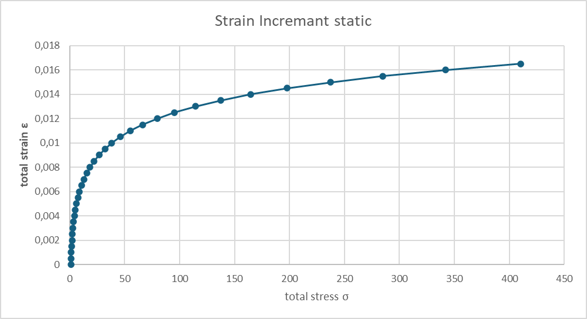
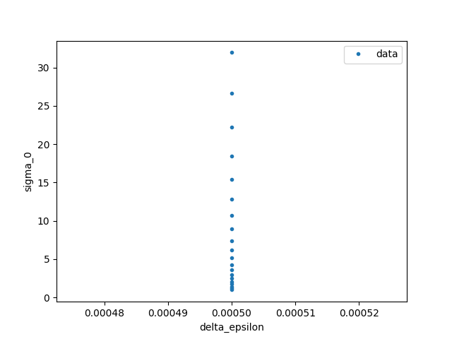
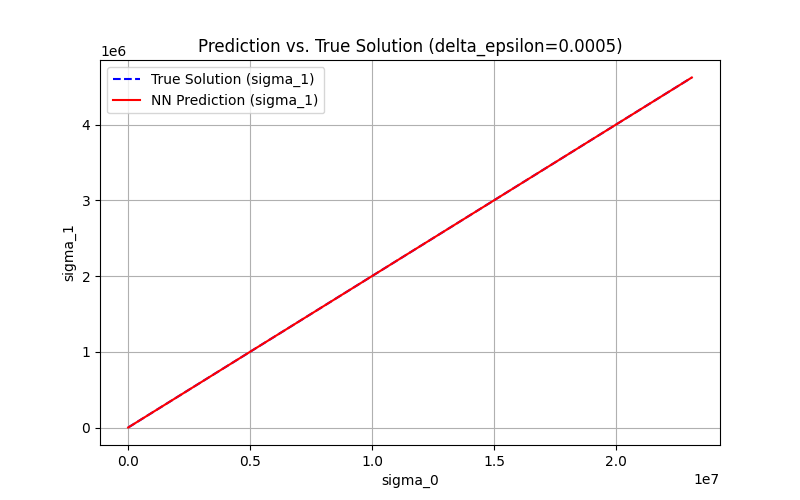
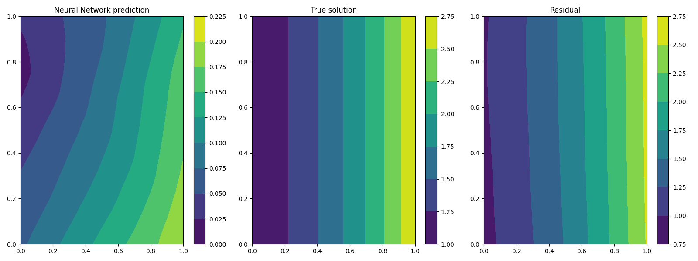
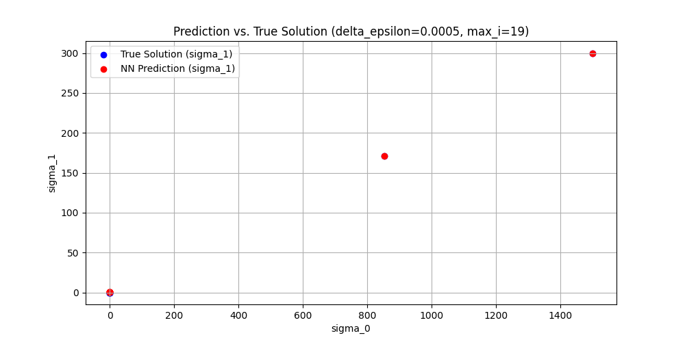

# Vorhersage des Ödometerversuches implementiert mit PINA
Ziel war die Implementierung eines neuronalen Netzwerks zur Modellierung des Ödometerversuchs. Dabei wurden gegebene Input-Parameter verarbeitet, um Output-Parameter vorherzusagen. Die physikalischen Rahmenbedingungen wurden zunächst auf Null gesetzt, sodass das Modell ausschließlich auf der KI-basierten Struktur arbeitet, ohne physikalische Optimierungen durch Physical Informed Neural Networks (PINNs).
<br>
Diese grundlegende Umsetzung bildet die Basis für weiterführende Optimierungen, wie die Integration physikalischer Gesetzmäßigkeiten, die jedoch nicht Teil des initialen Arbeitsauftrags waren.

### Was ist PINA?
PINA ist eine Open-Source-Python-Bibliothek, die eine intuitive Schnittstelle zur Lösung von Differentialgleichungen bietet, indem sie Physik-informierte Neuronale Netze (PINNs), Neuronale Operatoren (NOs) oder eine Kombination aus beiden verwendet. Basierend auf PyTorch und PyTorch Lightning ermöglicht PINA die formale Darstellung spezifischer (differentieller) Probleme und deren Lösung mittels neuronaler Netze.<br><br>
<strong>Hauptmerkmale von PINA:</strong>

- <span style="color:gray;"><i>Problemformulierung: Ermöglicht die Übersetzung mathematischer Gleichungen in Python-Code, um das Differentialproblem zu definieren.</i></span>
    - <small><i>→ In diesem Arbeitsauftrag nicht notwendig, da das neuronale Netzwerk ohne physikalische Gesetzmäßigkeiten trainiert wurde.</i></small>
- Modelltraining: Bietet Werkzeuge zum Training neuronaler Netze zur Lösung des definierten Problems.
- Lösungsauswertung: Erlaubt die Visualisierung und Analyse der approximierten Lösungen.

<small><i>Hinweis: Die physikalische Modellierung und die Einbindung von Differentialgleichungen zur Optimierung des Netzwerks (z. B. mittels PINNs) war nicht Teil dieses Arbeitsauftrags, könnte aber in einem späteren Schritt ergänzt werden.</i></small>
## Grundlagen
In diesem Notebook wird der Ödometerversuch <strong>ohne</strong> Randbedingungen betrachtet. Es werden vorberechnetet Daten aus der Exceltabelle `files/oedometer/oedo_trainingsdata.xlsx` verwendet.<br>
#### Das Problem ist wie folgt definiert:
$$
\begin{array}{rcl}
    \sigma_{t+1} & = & \sigma_{t}+\Delta\sigma \\ \\
    \Delta\sigma & = & E_s\cdot \Delta\epsilon \\ 
    E_s & = & \frac{1+e_0}{C_c} \cdot \sigma_t
\end{array}
\hspace{2cm}
\begin{array}{l}
    \textbf{Annahmen:} \\ \\
    \text{Startwert d. Iteration: } \sigma_0 = 1,00 \\ 
    e_0 = 1,00 \\ 
    C_c = 0,005 \\
    \Delta\epsilon = 0,0005
\end{array}
$$
<div = style="text-align: center;">
    
</div>

<br> 

Um das PINA-Model zu testen werden wir folgende vorberechnete Werte verwenden: `Input` { $\sigma_t$ ; $\Delta\epsilon$ }, `Output` { $\sigma_{t+1}$ }.
<br>
### Variablendeklaration
- $\sigma_t$ = `sigma_0`
- $\Delta\epsilon$ = `delta_epsilon`
- $\sigma_{t+1}$ = `sigma_1`
## Einstellungen und Utilities


```python
from IPython.display import display, Markdown

# Debugger: Aktiviert
debug_mode = True
# Normalisierung der Daten: Deaktiviert
normalize_data = False
```

## Laden der Daten aus `oedo_trainingsdata.xlsx`


```python
import pandas as pd
import numpy as np
from sympy.integrals.heurisch import components

file_path = "files/oedometer/oedo_trainingsdata.xlsx"
sheet_name = "Res"
selected_columns = [1, 3, 5] # Spaltenauswahl Spalte B, D und E
row_start_range = 0

def extract_excel(file_path, sheet_name, selected_columns, row_start_range):
    df = pd.read_excel(file_path, sheet_name=sheet_name)
    
    # Dynamische Ermittlung der letzten Zeile mit Daten
    row_start_range = 0  # Startet bei Zeile 6 (0-basiert)
    row_end_range = df.dropna(how="all").last_valid_index() + 1  # Letzte Zeile mit Daten
        
    # Daten extrahieren
    data_subset = df.iloc[row_start_range:row_end_range, selected_columns]
    data_dict = {col: np.array(data_subset[col]) for col in data_subset.columns}
    
    if debug_mode:
        print('‼️Geladene Exceldaten')
        print(data_dict)
    
    # Daten als dict speichern
    return data_dict

data_dict = extract_excel(file_path, sheet_name, selected_columns, row_start_range)
```

    ‼️Geladene Exceldaten
    {'sigma_0': array([ 1.        ,  1.2       ,  1.44      ,  1.728     ,  2.0736    ,
            2.48832   ,  2.985984  ,  3.5831808 ,  4.29981696,  5.15978035,
            6.19173642,  7.43008371,  8.91610045, 10.69932054, 12.83918465,
           15.40702157, 18.48842589, 22.18611107, 26.62333328, 31.94799994]), 'delta_epsilon': array([0.0005, 0.0005, 0.0005, 0.0005, 0.0005, 0.0005, 0.0005, 0.0005,
           0.0005, 0.0005, 0.0005, 0.0005, 0.0005, 0.0005, 0.0005, 0.0005,
           0.0005, 0.0005, 0.0005, 0.0005]), 'sigma_1': array([0.2       , 0.24      , 0.288     , 0.3456    , 0.41472   ,
           0.497664  , 0.5971968 , 0.71663616, 0.85996339, 1.03195607,
           1.23834728, 1.48601674, 1.78322009, 2.13986411, 2.56783693,
           3.08140431, 3.69768518, 4.43722221, 5.32466666, 6.38959999])}
    

<link rel="stylesheet" href="https://cdnjs.cloudflare.com/ajax/libs/font-awesome/4.7.0/css/font-awesome.min.css">

## Daten normalisieren
Die Normalisierung von Daten für neuronale Netze bedeutet, dass Eingabedaten auf eine vergleichbare Skala gebracht werden, um das Training stabiler und effizienter zu machen. Hier verwendete Methode:
- Min-Max-Skalierung: Werte auf einen Bereich (0 bis 1) bringen.  <i class="fa fa-info"> [Wiki](https://en.wikipedia.org/wiki/Feature_scaling#Methods)</i>


```python
if normalize_data:
    data_dict.update({'sigma_0_raw': data_dict.pop('sigma_0')})
    data_dict.update({'sigma_1_raw': data_dict.pop('sigma_1')})
    
    sigma_0_min, sigma_0_max = data_dict['sigma_0_raw'].min(), data_dict['sigma_0_raw'].max()
    sigma_1_min, sigma_1_max = data_dict['sigma_1_raw'].min(), data_dict['sigma_1_raw'].max()
    
    # Min-Max-Normalisierung
    data_dict['sigma_0'] = (data_dict['sigma_0_raw'] - sigma_0_min) / (sigma_0_max - sigma_0_min)
    data_dict['sigma_1'] = (data_dict['sigma_1_raw'] - sigma_1_min) / (sigma_1_max - sigma_1_min)
    print('‼️Tabellenwerte des Oedometerversuches normalisiert.')
else:
    print('‼️ Es wurde keine Normalisierung der Werte vorgenommen.')
```

    ‼️ Es wurde keine Normalisierung der Werte vorgenommen.
    

## **Datenvorbereitung für PINA mit LabelTensor**
In diesem Code werden die Eingabedaten aus `data_dict` als **LabelTensor** gespeichert, um sie strukturiert und mit benannten Dimensionen für das neuronale Netz in PINA bereitzustellen.  

- `sigma_0_train`, `delta_epsilon_train` und `sigma_1_train` werden als **einzelne beschriftete Tensoren** erstellt.  
- `input_points_combined` kombiniert `sigma_0` und `delta_epsilon` in einem **2D-Tensor** für das Training.  
- `LabelTensor` erleichtert die Nutzung der Daten in PINA, indem es Variablen klar zuordnet und mit physischen Größen verknüpft.

**Mehr zu `LabelTensor`:**  
[PINA Documentation – LabelTensor](https://mathlab.github.io/PINA/_rst/label_tensor.html)


```python
import torch
from pina.utils import LabelTensor
from torch import tensor

# Beispiel-Daten
sigma_0_train = LabelTensor(tensor(data_dict['sigma_0'], dtype=torch.float).unsqueeze(-1), ['sigma_0'])
delta_epsilon_train = LabelTensor(tensor(data_dict['delta_epsilon'], dtype=torch.float).unsqueeze(-1), ['delta_epsilon'])
sigma_1_train = LabelTensor(tensor(data_dict['sigma_1'], dtype=torch.float).unsqueeze(-1), ['sigma_1'])

# Kombinieren der Trainingsdaten (Verwendung von 'np.column_stack' für bessere Performance)
input_points_combined = LabelTensor(torch.tensor(np.column_stack([data_dict['sigma_0'], data_dict['delta_epsilon']]), dtype=torch.float), ['sigma_0', 'delta_epsilon'])

if debug_mode:
    print('‼️Data Loaded')
    print(f' sigma_0: {sigma_0_train.size()}')
    print(f' delta_epsilon: {delta_epsilon_train.shape}')
    print(f' sigma_0 und delta_epsilon combined: {input_points_combined.size()}')
    print(f' sigma_1: {sigma_1_train.shape}')
```

    ‼️Data Loaded
     sigma_0: torch.Size([20, 1])
     delta_epsilon: torch.Size([20, 1])
     sigma_0 und delta_epsilon combined: torch.Size([20, 2])
     sigma_1: torch.Size([20, 1])
    

### **Definition eines einfachen PINN-Problems in PINA**  
Dieser Code definiert ein **Physics-Informed Neural Network (PINN)**-Problem mithilfe der PINA-Bibliothek.  
 
- **Klassenstruktur (`SimpleODE`)**: Erbt von `AbstractProblem` und spezifiziert die Eingabe- und Ausgabevariablen basierend auf `LabelTensor`.
    - [PINA-Dokumentation - AbstractProblem](https://mathlab.github.io/PINA/_rst/problem/abstractproblem.html) 
- **Definitionsbereich (`domain`)**: Der Wertebereich der Eingabevariablen (`sigma_0`, `delta_epsilon`) wird als `CartesianDomain` festgelegt.
    - **Hinweis:** `domain` muss immer definiert sein, selbst wenn sie nicht direkt zur Datengenerierung verwendet wird.  
    - [PINA-Dokumentation - CartesianDomain](https://mathlab.github.io/PINA/_rst/geometry/cartesian.html) 
- **Randbedingungen (`conditions`)**: Die echten Messwerte (`in sigma_0, delta_epsilon` `out sigma_1_train`) werden als Randbedingung (`Condition`) für das Modell definiert.
    - [PINA-Dokumentation - Condition](https://mathlab.github.io/PINA/_rst/condition.html) 
- **"Wahre Lösung" (`truth_solution`)**: Falls erforderlich, kann eine analytische Lösung (hier `torch.exp(...)`) zur Validierung genutzt werden.
    - **Hinweis:** Funktioniert in unserem Fall nicht, da die Implementierung nicht für reine Input und Outpunkt Punkte implementiert ist.
    - [PINA-Tutorial - Physics Informed Neural Networks on PINA](https://mathlab.github.io/PINA/_rst/tutorials/tutorial1/tutorial.html) 
- **Probleminstanz (`problem = SimpleODE()`)**: Erstellt das Problem, das für das Training eines PINN verwendet wird.  


```python
from pina.problem import AbstractProblem
from pina.geometry import CartesianDomain
from pina import Condition
class SimpleODE(AbstractProblem):

    # Definition der Eingabe- und Ausgabevariablen basierend auf LabelTensor
    input_variables = input_points_combined.labels
    output_variables = sigma_1_train.labels

    # Wertebereich
    domain = CartesianDomain({'sigma_0': [0, 1], 'delta_epsilon': [0, 1]})  # Wertebereich immer definieren!

    # Definition der Randbedingungen und (hier: nur) vorberechnetet Punkte
    conditions = {
        'data': Condition(input_points=input_points_combined, output_points=sigma_1_train),
    }

    output_pts=sigma_1_train

    # Methode zur Definition der "wahren Lösung" des Problems
    def truth_solution(self, pts):
        return torch.exp(pts.extract(['sigma_0']))

# Problem-Instanz erzeugen
problem = SimpleODE()

# Datengenerierung, falls Randbedingungen definiert
# problem.discretise_domain(n=993, mode='random', variables='all', locations='all') # Notwendig, wenn "input_pts" und "output_pts" nicht vorgegeben sind

if debug_mode:
    # Debugging-Ausgaben
    print("‼️Geladene Input Variablen: ", problem.input_variables)
    print("‼️Geladene Output Variablen: ", problem.output_variables)
    print('‼️Input points:', problem.input_pts)
```

    ‼️Geladene Input Variablen:  ['sigma_0', 'delta_epsilon']
    ‼️Geladene Output Variablen:  ['sigma_1']
    ‼️Input points: {'data': LabelTensor([[[1.0000e+00, 5.0000e-04]],
                 [[1.2000e+00, 5.0000e-04]],
                 [[1.4400e+00, 5.0000e-04]],
                 [[1.7280e+00, 5.0000e-04]],
                 [[2.0736e+00, 5.0000e-04]],
                 [[2.4883e+00, 5.0000e-04]],
                 [[2.9860e+00, 5.0000e-04]],
                 [[3.5832e+00, 5.0000e-04]],
                 [[4.2998e+00, 5.0000e-04]],
                 [[5.1598e+00, 5.0000e-04]],
                 [[6.1917e+00, 5.0000e-04]],
                 [[7.4301e+00, 5.0000e-04]],
                 [[8.9161e+00, 5.0000e-04]],
                 [[1.0699e+01, 5.0000e-04]],
                 [[1.2839e+01, 5.0000e-04]],
                 [[1.5407e+01, 5.0000e-04]],
                 [[1.8488e+01, 5.0000e-04]],
                 [[2.2186e+01, 5.0000e-04]],
                 [[2.6623e+01, 5.0000e-04]],
                 [[3.1948e+01, 5.0000e-04]]])}
    

## Visualisierung Sampling
Darstellung Input: `sigma_0` und `delta_epsilon`


```python
from pina import Plotter

pl = Plotter()
pl.plot_samples(problem=problem, filename='./graph/visual_sampling.png', variables=['delta_epsilon','sigma_0'])
display(Markdown(''))
```


## **Training eines Physics-Informed Neural Networks (PINN) mit PINA**

Dieser Code definiert und trainiert ein **Physics-Informed Neural Network (PINN)** zur Lösung des Problems in PINA.

- **Modell (`FeedForward`)**: Ein neuronales Netz mit drei versteckten Schichten (`[50, 50, 50]`), das mit der ReLU-Aktivierungsfunktion arbeitet.
- **PINN-Objekt (`PINN`)**: Erstellt das PINN-Modell, das die physikalischen Randbedingungen des Problems berücksichtigt.
- **TensorBoard-Logger (`TensorBoardLogger`)**: Speichert Trainingsmetriken zur Visualisierung.
- **Trainer (`Trainer`)**: Führt das Training für 1500 Epochen mit Batch-Größe 10 durch.
- **Training starten (`trainer.train()`)**: Startet den Optimierungsprozess und protokolliert die Metriken.

Am Ende wird die **finale Loss-Funktion** ausgegeben, um die Trainingsqualität zu bewerten.

**Mehr zu `Trainer`:**  
[PINA-Dokumentation – Trainer](https://mathlab.github.io/PINA/_rst/trainer.html)


```python
from pina import Trainer
from pina.solvers import PINN
from pina.model import FeedForward
from pina.callbacks import MetricTracker
import torch
from pytorch_lightning.loggers import TensorBoardLogger  # Import TensorBoard Logger

if debug_mode:
    print('Debugging Info:')
    # Überprüfen der Größe der Eingabepunkte und Ausgabepunkte
    print("‼️Länge der Eingabepunkte (input_pts):", len(problem.input_pts['data']))
    print("‼️Länge der Ausgabepunkte (output_pts):", len(problem.output_pts))

# Model erstellen
model = FeedForward(
    layers=[50, 50, 50],
    func=torch.nn.ReLU,
    output_dimensions=len(problem.output_variables),
    input_dimensions=len(problem.input_variables)
)

# PINN-Objekt erstellen
pinn = PINN(problem, model)

# TensorBoard-Logger
logger = TensorBoardLogger("tensorboard_logs", name="pina_experiment")

# Trainer erstellen mit TensorBoard-Logger
trainer = Trainer(
    solver=pinn,
    max_epochs=1000,
    callbacks=[MetricTracker()],
    batch_size=10,
    accelerator='cpu',
    logger=logger,
    enable_model_summary=False,
)


# Training starten
trainer.train()

print('\nFinale Loss Werte')
# Inspect final loss
trainer.logged_metrics
```

    GPU available: False, used: False
    TPU available: False, using: 0 TPU cores
    HPU available: False, using: 0 HPUs
    

    Debugging Info:
    ‼️Länge der Eingabepunkte (input_pts): 20
    ‼️Länge der Ausgabepunkte (output_pts): 20
    

    C:\Users\hab185\Documents\00_Tim\01_Implementierung\pina_oedometer\venv\Lib\site-packages\pytorch_lightning\loops\fit_loop.py:310: The number of training batches (2) is smaller than the logging interval Trainer(log_every_n_steps=50). Set a lower value for log_every_n_steps if you want to see logs for the training epoch.
    


    Training: |                                                                                      | 0/? [00:00<…


    `Trainer.fit` stopped: `max_epochs=1000` reached.
    

    
    Finale Loss Werte
    


    {'data_loss': tensor(5.7616e-07), 'mean_loss': tensor(5.7616e-07)}


## **Visualisierung der Modellvorhersage für sigma_1**

Dieser Code erstellt einen **Plot der wahren Werte (`sigma_1`)** im Vergleich zur **Vorhersage des neuronalen Netzwerks**.

- **Datenvorbereitung (`input_data`)**: Die Eingabedaten (`sigma_0` und `delta_epsilon`) werden als `LabelTensor` für das trainierte Modell erstellt.
- **Modellvorhersage (`pinn(input_data)`)**: Das trainierte PINN-Modell gibt eine Prognose für `sigma_1` aus.
- **Plot-Erstellung mit `matplotlib`**:  
  - Die wahre Lösung (`sigma_1`) wird als **blaue gestrichelte Linie** dargestellt.  
  - Die Vorhersage des neuronalen Netzwerks wird als **rote durchgezogene Linie** geplottet.  

**Zusätzlicher Schritt:**  
Die Nutzung von `matplotlib` war notwendig, da die interne Plot-Funktion von PINA `pl.plot()` das Diagramm nicht wie in den Tutorials erwartungsgemäß generierte, selbst wenn `delta_epsilon` auf einen fixen Wert gesetzt wurde. Dies könnte auf eine fehlerhafte Nutzung der Funktion oder auf eine Inkompatibilität in der Darstellung zurückzuführen sein.


```python
import matplotlib
matplotlib.use('Agg') # Keine doppelte Darstellung des Plottes
import matplotlib.pyplot as plt
import torch

max_i = 20

# Erstelle die Eingabedaten als LabelTensor für das trainierte Modell
input_data = LabelTensor(torch.tensor(
    np.column_stack((data_dict['sigma_0'], data_dict['delta_epsilon'])), dtype=torch.float
), ['sigma_0', 'delta_epsilon'])

# Model-Vorhersage für sigma_1 berechnen
sigma_1_pred = pinn(input_data).detach().numpy()

# Plot der wahren vs. vorhergesagten Werte
plt.figure(figsize=(10, 5))

plt.plot(data_dict['sigma_0'][0:max_i], data_dict['sigma_1'][0:max_i], label="True Solution (sigma_1)", linestyle='dashed', color='blue')
plt.plot(data_dict['sigma_0'][0:max_i], sigma_1_pred[0:max_i], label="NN Prediction (sigma_1)", linestyle='solid', color='red')

plt.xlabel("sigma_0")
plt.ylabel("sigma_1")
plt.title(f"Prediction vs. True Solution (delta_epsilon=0.0005, max_i={str(max_i-1)})")
plt.legend()
plt.grid()
plt.savefig('./graph/visual_prediction-vs-truesolution.png',)

# Überprüfen, ob die notwendigen Variablen existieren
if 'data_dict' in globals() and 'sigma_1_pred' in globals():
    # Erstelle eine Tabelle für die übersichtliche Darstellung
    data_loss_table = pd.DataFrame({
        "sigma_t": np.round(data_dict["sigma_0"][0:max_i], 5),
        "True sigma_t+1": np.round(data_dict["sigma_1"][0:max_i], 5),
        "Predicted sigma_t+1": np.round(sigma_1_pred[0:max_i].flatten(), 5),
        "Loss (True - Predicted)": np.round(data_dict["sigma_1"][0:max_i] - sigma_1_pred[0:max_i].flatten(), 5)
    })

    pd.set_option('display.max_rows', None)  # Keine Begrenzung der Zeilen
    pd.set_option('display.max_columns', None)  # Keine Begrenzung der Spalten
    pd.set_option('display.width', 1000)  # Breite für bessere Lesbarkeit

    print(f'Data-Loss bis simga_{str(max_i-1)}\n')
    print(data_loss_table)
else:
    print("Fehler: `data_dict` oder `sigma_1_pred` ist nicht definiert!")

display(Markdown('<br>**Hinweis:** Datenpunkte liegen sehr nahe beieinander.'))
```

    Data-Loss bis simga_19
    
         sigma_t  True sigma_t+1  Predicted sigma_t+1  Loss (True - Predicted)
    0    1.00000         0.20000              0.20023                 -0.00023
    1    1.20000         0.24000              0.23986                  0.00014
    2    1.44000         0.28800              0.28768                  0.00032
    3    1.72800         0.34560              0.34581                 -0.00021
    4    2.07360         0.41472              0.41472                 -0.00000
    5    2.48832         0.49766              0.49814                 -0.00048
    6    2.98598         0.59720              0.59679                  0.00041
    7    3.58318         0.71664              0.71615                  0.00048
    8    4.29982         0.85996              0.85938                  0.00059
    9    5.15978         1.03196              1.03295                 -0.00099
    10   6.19174         1.23835              1.23977                 -0.00142
    11   7.43008         1.48602              1.48690                 -0.00089
    12   8.91610         1.78322              1.78347                 -0.00025
    13  10.69932         2.13986              2.13934                  0.00052
    14  12.83918         2.56784              2.56639                  0.00144
    15  15.40702         3.08140              3.08001                  0.00140
    16  18.48843         3.69769              3.69703                  0.00066
    17  22.18611         4.43722              4.43745                 -0.00023
    18  26.62333         5.32467              5.32596                 -0.00130
    19  31.94800         6.38960              6.38960                  0.00000
    


<br>**Hinweis:** Datenpunkte liegen sehr nahe beieinander.


## Visualisierung Error-Result


```python
pl.plot(solver=pinn, filename='./graph/visual_nn-result-error.png')
display(Markdown(''))
```


## Visualisierung Loss-Kurve


```python
# plotting the solution
pl.plot_loss(trainer, label='mean_loss', logy=True, filename='./graph/visual_loss.png')
display(Markdown(''))
```


# Fazit

Das Problem dieser Implementation ist, dass wir das Modell mit 20 Inpt Parametern gefüttert haben, die daraufhin auch immer erneut gefordert werden. Es ist also nicht möglich einen einzelnen Wert zu bestimmen, da das Modell nun weitere 19 Parameter braucht, um weitere Ausgaben zu generieren. <br>

Im folgenden wird dargestellt, wie es aussehen würde, wenn man bspw. das Modell mit einem Tensor füttert, der nur den ersten Wert mit einem Wert gefüllt hat (Rest 0).


```python
new_data = extract_excel(file_path="files/oedometer/oedo_trainingsdata_compare.xlsx", sheet_name="Res", selected_columns=[1, 3, 5], row_start_range=0)

# Erstelle die Eingabedaten als LabelTensor für das trainierte Modell
input_data = LabelTensor(torch.tensor(
    np.column_stack((new_data['sigma_0'], new_data['delta_epsilon'])), dtype=torch.float
), ['sigma_0', 'delta_epsilon'])

# Model-Vorhersage für sigma_1 berechnen
sigma_1_pred = pinn(input_data).detach().numpy()

# Plot der wahren vs. vorhergesagten Werte
plt.figure(figsize=(10, 5))

# True Solution als Punkte darstellen
plt.scatter(new_data['sigma_0'][0:max_i], new_data['sigma_1'][0:max_i], label="True Solution (sigma_1)", color='blue', marker='o')
# NN Prediction als Linie darstellen
plt.scatter(new_data['sigma_0'][0:max_i], sigma_1_pred[0:max_i], label="NN Prediction (sigma_1)", linestyle='solid', color='red')

plt.xlabel("sigma_0")
plt.ylabel("sigma_1")
plt.title(f"Prediction vs. True Solution (delta_epsilon=0.0005, max_i={str(max_i-1)})")
plt.legend()
plt.grid()
plt.savefig('./graph/visual_prediction-vs-truesolution_comp.png')

# Überprüfen, ob die notwendigen Variablen existieren
if 'data_dict' in globals() and 'sigma_1_pred' in globals():
    # Erstelle eine Tabelle für die übersichtliche Darstellung
    data_loss_table = pd.DataFrame({
        "sigma_t": np.round(new_data["sigma_0"][0:max_i], 5),
        "True sigma_t+1": np.round(new_data["sigma_1"][0:max_i], 5),
        "Predicted sigma_t+1": np.round(sigma_1_pred[0:max_i].flatten(), 5),
        "Loss (True - Predicted)": np.round(new_data["sigma_1"][0:max_i] - sigma_1_pred[0:max_i].flatten(), 5)
    })

    pd.set_option('display.max_rows', None)  # Keine Begrenzung der Zeilen
    pd.set_option('display.max_columns', None)  # Keine Begrenzung der Spalten
    pd.set_option('display.width', 1000)  # Breite für bessere Lesbarkeit

    print(f'Data-Loss bis sigma_{str(max_i-1)}\n')
    print(data_loss_table)
else:
    print("Fehler: `data_dict` oder `sigma_1_pred` ist nicht definiert!")

display(Markdown('<br>**Hinweis:** Datenpunkte liegen sehr nahe beieinander.'))
```

    ‼️Geladene Exceldaten
    {'sigma_0': array([1500,    0,    0,    0,    0,    0,    0,    0,    0,    0,    0,
              0,    0,    0,    0,    0,    0,    0,    0,    0], dtype=int64), 'delta_epsilon': array([0.0005, 0.    , 0.    , 0.    , 0.    , 0.    , 0.    , 0.    ,
           0.    , 0.    , 0.    , 0.    , 0.    , 0.    , 0.    , 0.    ,
           0.    , 0.    , 0.    , 0.    ]), 'sigma_1': array([300,   0,   0,   0,   0,   0,   0,   0,   0,   0,   0,   0,   0,
             0,   0,   0,   0,   0,   0,   0], dtype=int64)}
    Data-Loss bis sigma_19
    
        sigma_t  True sigma_t+1  Predicted sigma_t+1  Loss (True - Predicted)
    0      1500             300           299.636871                  0.36313
    1         0               0             0.038610                 -0.03861
    2         0               0             0.038610                 -0.03861
    3         0               0             0.038610                 -0.03861
    4         0               0             0.038610                 -0.03861
    5         0               0             0.038610                 -0.03861
    6         0               0             0.038610                 -0.03861
    7         0               0             0.038610                 -0.03861
    8         0               0             0.038610                 -0.03861
    9         0               0             0.038610                 -0.03861
    10        0               0             0.038610                 -0.03861
    11        0               0             0.038610                 -0.03861
    12        0               0             0.038610                 -0.03861
    13        0               0             0.038610                 -0.03861
    14        0               0             0.038610                 -0.03861
    15        0               0             0.038610                 -0.03861
    16        0               0             0.038610                 -0.03861
    17        0               0             0.038610                 -0.03861
    18        0               0             0.038610                 -0.03861
    19        0               0             0.038610                 -0.03861
    


<br>**Hinweis:** Datenpunkte liegen sehr nahe beieinander.


```python

```
