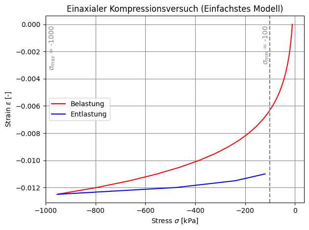
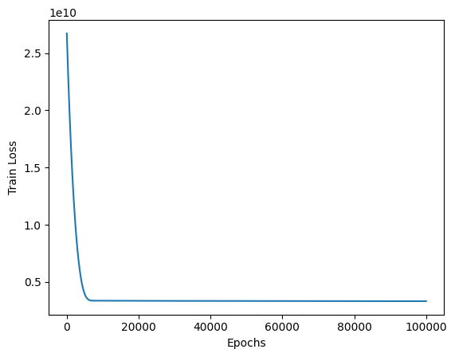

# Vorhersage des Ödometer-Versuchs mit einem neuronalen Netzwerk

**Ziel:**
Entwicklung eines neuronalen Netzes, das auf Basis gegebener Input-Parameter den Elastizitätsmodul $E_s$ im Ödometer-Versuch vorhersagt.

---

## 1. Problemformulierung

Es wird folgende Beziehung zugrunde gelegt:

$$
\dot{\sigma} = C_1\,\sigma_t\,\dot{\varepsilon} + C_2\,\sigma_t\,\left|\dot{\varepsilon}\right|
$$

Diese Gleichung beschreibt die Änderung der Spannung $\dot{\sigma}$ in Abhängigkeit von der aktuellen Spannung $\sigma_t$, der Dehnungsrate $\dot{\varepsilon}$ und den Koeffizienten $C_1, C_2$, die aus dem gewählten Modell abgeleitet sind.

---

## 2. Annahmen / Startwerte

Die Berechnung basiert auf folgenden festen Parametern:

- **Startspannung:** $\sigma_0 = -10{,}00\,\text{kPa}$
- **Porenverhältnis:** $e_0 = 1{,}00$
- **Koeffizienten:**
  - $C_c = 0{,}005$
  - $C_s = 0{,}002$
- **Dehnungsraten:**
  - Stauchungsphase: $\dot{\varepsilon}_c = -0{,}0005$
  - Dehnungsphase: $\dot{\varepsilon}_e = +0{,}0005$

---

## 3. Trainingssetup

- **Input:**
  $\sigma_t$, $\dot{\varepsilon}$
- **Output:**
  Elastizitätsmodul $E_s$

Das neuronale Netz soll aus den aktuellen Zustandsgrößen ($\sigma_t$, $\dot{\varepsilon}$) lernen, in welcher Phase (Kompression vs. Entlastung) sich der Versuch befindet, und darauf basierend $E_s$ schätzen.

---

## 4. Variablendeklaration

| Symbol              | Variable im Code     | Bedeutung |
|---------------------|----------------------|-----------|
| $\sigma_t$          | `sigma_t`            | Aktuelle Spannung zum Zeitpunkt $t$ |
| $\dot{\varepsilon}$ | `delta_epsilon`      | Dehnungsrate; negative Werte: Kompression, positive: Entlastung |
| $\dot\sigma_t$      | `delta_sigma`        | Inkrementelle Änderung der Spannung |
| $E_s$               | `e_s`                | Elastizitätsmodul (Zielgröße) |
| $e_0$               | `e_0`                | Porenverhältniszahl |

---

## 5. Hinweise zur Phase

Die Phase (Stauchung vs. Dehnung) lässt sich über das Vorzeichen von $\dot{\varepsilon}$ ablesen. Alternativ kann explizit ein Zustandsindikator (z. B. one-hot oder diskrete Labels für Belastung/Entlastung) zusätzlich als Feature mitgegeben werden, um dem Modell das Unterscheiden zu erleichtern.


# Grundparameter


```python
from random import randint

# Define input and output parameters
input_str = "sigma_t"
output_str = "e_s"

# 0 : simple, 1 : improved
oedo_model = 1

# Defining problem parameters
delta_epsilon = -0.0005
C_c = 0.005
e_0 = 1.0
amount_trainings_data = 1

# Data preparation for
oedo_para = {
    "e0":1,
    "c_c":0.005,
    "c_s":0.002,
    "sigma_prime_p":-1,
    "sigma_max":-1000,  # kPa
    "sigma_min":-100,   # kPa
    "eps_delta":-0.0005,
    "eps_0":0,
}
```

# Load problem and generate trainings


```python
from random import sample
import torch
if oedo_model == 0:
    from classes.classOedometerSimple import Oedometer
else:
    from classes.classOedometerImproved import Oedometer
sigma_t_train =  [-10] #sample(range(-amount_trainings_data * 2,0), amount_trainings_data)

list_output = []
dict_input = {'input1' : [], 'input2' : []}
for i in range(amount_trainings_data):
    oedo = Oedometer(sigma_prime_p=sigma_t_train[i])
    oedo.run()
    list_output += oedo.e_s_list
    dict_input['input1'] += oedo.sigma_0_list
    dict_input['input2'] += oedo.eps_delta_list

oedo.plot()


tensor_input1 = torch.tensor(dict_input['input1'], dtype=torch.float)  # (B, L)
tensor_input2 = torch.tensor(dict_input['input2'], dtype=torch.float)  # (B, L)

if tensor_input1.shape != tensor_input2.shape:
    raise ValueError(f"Input-Shapes mismatch: {tensor_input1.shape} vs {tensor_input2.shape}")

tensor_input = torch.stack((tensor_input1, tensor_input2), dim=-1)
tensor_output = torch.tensor(list_output, dtype=torch.float)          # (B, L)
tensor_output = tensor_output.unsqueeze(-1)  # (B, L, 1)
```


    

    


# Show trainingsdata (List) as DataFrame
Type `list`: `list_input` and `list_output`


```python
import pandas as pd

df = pd.DataFrame([['sigma_t'] + dict_input['input1'], ['eps_delta'] + dict_input['input2'], [output_str] + list_output])
display(df)
```


<div>
<style scoped>
    .dataframe tbody tr th:only-of-type {
        vertical-align: middle;
    }

    .dataframe tbody tr th {
        vertical-align: top;
    }

    .dataframe thead th {
        text-align: right;
    }
</style>
<table border="1" class="dataframe">
  <thead>
    <tr style="text-align: right;">
      <th></th>
      <th>0</th>
      <th>1</th>
      <th>2</th>
      <th>3</th>
      <th>4</th>
      <th>5</th>
      <th>6</th>
      <th>7</th>
      <th>8</th>
      <th>9</th>
      <th>...</th>
      <th>20</th>
      <th>21</th>
      <th>22</th>
      <th>23</th>
      <th>24</th>
      <th>25</th>
      <th>26</th>
      <th>27</th>
      <th>28</th>
      <th>29</th>
    </tr>
  </thead>
  <tbody>
    <tr>
      <th>0</th>
      <td>sigma_t</td>
      <td>-10.0000</td>
      <td>-12.0000</td>
      <td>-14.4000</td>
      <td>-17.2800</td>
      <td>-20.7360</td>
      <td>-24.8832</td>
      <td>-29.85984</td>
      <td>-35.831808</td>
      <td>-42.99817</td>
      <td>...</td>
      <td>-319.479999</td>
      <td>-383.375999</td>
      <td>-460.051199</td>
      <td>-552.061439</td>
      <td>-662.473727</td>
      <td>-794.968472</td>
      <td>-953.962166</td>
      <td>-476.981083</td>
      <td>-238.490542</td>
      <td>-119.245271</td>
    </tr>
    <tr>
      <th>1</th>
      <td>eps_delta</td>
      <td>-0.0005</td>
      <td>-0.0005</td>
      <td>-0.0005</td>
      <td>-0.0005</td>
      <td>-0.0005</td>
      <td>-0.0005</td>
      <td>-0.00050</td>
      <td>-0.000500</td>
      <td>-0.00050</td>
      <td>...</td>
      <td>-0.000500</td>
      <td>-0.000500</td>
      <td>-0.000500</td>
      <td>-0.000500</td>
      <td>-0.000500</td>
      <td>-0.000500</td>
      <td>0.000500</td>
      <td>0.000500</td>
      <td>0.000500</td>
      <td>0.000500</td>
    </tr>
    <tr>
      <th>2</th>
      <td>e_s</td>
      <td>4000.0000</td>
      <td>4800.0000</td>
      <td>5760.0000</td>
      <td>6912.0000</td>
      <td>8294.4000</td>
      <td>9953.2800</td>
      <td>11943.93600</td>
      <td>14332.723200</td>
      <td>17199.26784</td>
      <td>...</td>
      <td>127791.999748</td>
      <td>153350.399698</td>
      <td>184020.479637</td>
      <td>220824.575565</td>
      <td>264989.490678</td>
      <td>317987.388814</td>
      <td>381584.866576</td>
      <td>476981.083220</td>
      <td>238490.541610</td>
      <td>119245.270805</td>
    </tr>
  </tbody>
</table>
<p>3 rows × 30 columns</p>
</div>


# Show trainingsdata (Tensor) as DataFrame
Type `tensor`: `tensor_input` and `tensor_output`


```python
import torch

tensor_input_df = pd.DataFrame(
    torch.cat((tensor_input, tensor_output), dim=1), columns=[input_str, 'eps_delta', output_str]
)
display(tensor_input_df)
```


<div>
<style scoped>
    .dataframe tbody tr th:only-of-type {
        vertical-align: middle;
    }

    .dataframe tbody tr th {
        vertical-align: top;
    }

    .dataframe thead th {
        text-align: right;
    }
</style>
<table border="1" class="dataframe">
  <thead>
    <tr style="text-align: right;">
      <th></th>
      <th>sigma_t</th>
      <th>eps_delta</th>
      <th>e_s</th>
    </tr>
  </thead>
  <tbody>
    <tr>
      <th>0</th>
      <td>-10.000000</td>
      <td>-0.0005</td>
      <td>4000.000000</td>
    </tr>
    <tr>
      <th>1</th>
      <td>-12.000000</td>
      <td>-0.0005</td>
      <td>4800.000000</td>
    </tr>
    <tr>
      <th>2</th>
      <td>-14.400000</td>
      <td>-0.0005</td>
      <td>5760.000000</td>
    </tr>
    <tr>
      <th>3</th>
      <td>-17.280001</td>
      <td>-0.0005</td>
      <td>6912.000000</td>
    </tr>
    <tr>
      <th>4</th>
      <td>-20.736000</td>
      <td>-0.0005</td>
      <td>8294.400391</td>
    </tr>
    <tr>
      <th>5</th>
      <td>-24.883200</td>
      <td>-0.0005</td>
      <td>9953.280273</td>
    </tr>
    <tr>
      <th>6</th>
      <td>-29.859840</td>
      <td>-0.0005</td>
      <td>11943.935547</td>
    </tr>
    <tr>
      <th>7</th>
      <td>-35.831806</td>
      <td>-0.0005</td>
      <td>14332.723633</td>
    </tr>
    <tr>
      <th>8</th>
      <td>-42.998169</td>
      <td>-0.0005</td>
      <td>17199.267578</td>
    </tr>
    <tr>
      <th>9</th>
      <td>-51.597805</td>
      <td>-0.0005</td>
      <td>20639.121094</td>
    </tr>
    <tr>
      <th>10</th>
      <td>-61.917366</td>
      <td>-0.0005</td>
      <td>24766.945312</td>
    </tr>
    <tr>
      <th>11</th>
      <td>-74.300835</td>
      <td>-0.0005</td>
      <td>29720.333984</td>
    </tr>
    <tr>
      <th>12</th>
      <td>-89.161003</td>
      <td>-0.0005</td>
      <td>35664.402344</td>
    </tr>
    <tr>
      <th>13</th>
      <td>-106.993202</td>
      <td>-0.0005</td>
      <td>42797.281250</td>
    </tr>
    <tr>
      <th>14</th>
      <td>-128.391846</td>
      <td>-0.0005</td>
      <td>51356.738281</td>
    </tr>
    <tr>
      <th>15</th>
      <td>-154.070221</td>
      <td>-0.0005</td>
      <td>61628.085938</td>
    </tr>
    <tr>
      <th>16</th>
      <td>-184.884262</td>
      <td>-0.0005</td>
      <td>73953.703125</td>
    </tr>
    <tr>
      <th>17</th>
      <td>-221.861115</td>
      <td>-0.0005</td>
      <td>88744.445312</td>
    </tr>
    <tr>
      <th>18</th>
      <td>-266.233337</td>
      <td>-0.0005</td>
      <td>106493.335938</td>
    </tr>
    <tr>
      <th>19</th>
      <td>-319.480011</td>
      <td>-0.0005</td>
      <td>127792.000000</td>
    </tr>
    <tr>
      <th>20</th>
      <td>-383.376007</td>
      <td>-0.0005</td>
      <td>153350.406250</td>
    </tr>
    <tr>
      <th>21</th>
      <td>-460.051208</td>
      <td>-0.0005</td>
      <td>184020.484375</td>
    </tr>
    <tr>
      <th>22</th>
      <td>-552.061462</td>
      <td>-0.0005</td>
      <td>220824.578125</td>
    </tr>
    <tr>
      <th>23</th>
      <td>-662.473755</td>
      <td>-0.0005</td>
      <td>264989.500000</td>
    </tr>
    <tr>
      <th>24</th>
      <td>-794.968445</td>
      <td>-0.0005</td>
      <td>317987.375000</td>
    </tr>
    <tr>
      <th>25</th>
      <td>-953.962158</td>
      <td>0.0005</td>
      <td>381584.875000</td>
    </tr>
    <tr>
      <th>26</th>
      <td>-476.981079</td>
      <td>0.0005</td>
      <td>476981.093750</td>
    </tr>
    <tr>
      <th>27</th>
      <td>-238.490540</td>
      <td>0.0005</td>
      <td>238490.546875</td>
    </tr>
    <tr>
      <th>28</th>
      <td>-119.245270</td>
      <td>0.0005</td>
      <td>119245.273438</td>
    </tr>
  </tbody>
</table>
</div>


# Define SimpleRegressor Model


```python
import torch.nn as nn

class SimpleRegressor(nn.Module):
    def __init__(self):
        super(SimpleRegressor, self).__init__()
        self.linear = nn.Linear(2, 1)

    def forward(self, x):
        return self.linear(x)


model = SimpleRegressor()
```

# Training


```python
import torch.optim as optim

loss_fn = nn.MSELoss()
optimizer = optim.Adam(model.parameters(), lr=.1)

epochs = 100000
loss_history = []
for epoch in range(epochs):
    model.train()
    optimizer.zero_grad()
    pred = model(tensor_input)
    loss = loss_fn(pred, tensor_output)
    loss.backward()
    loss_history.append(loss.item())
    optimizer.step()

    if epoch % 100 == 0:
        print(f"Epoch {epoch}: Loss = {loss.item():.6f}")
```

    Epoch 0: Loss = 26719809536.000000
    Epoch 100: Loss = 25705486336.000000
    Epoch 200: Loss = 24723994624.000000
    Epoch 300: Loss = 23774715904.000000
    Epoch 400: Loss = 22856751104.000000
    Epoch 500: Loss = 21969217536.000000
    Epoch 600: Loss = 21111281664.000000
    Epoch 700: Loss = 20282130432.000000
    Epoch 800: Loss = 19481008128.000000
    Epoch 900: Loss = 18707161088.000000
    Epoch 1000: Loss = 17959884800.000000
    Epoch 1100: Loss = 17238493184.000000
    Epoch 1200: Loss = 16542324736.000000
    Epoch 1300: Loss = 15870754816.000000
    Epoch 1400: Loss = 15223174144.000000
    Epoch 1500: Loss = 14598995968.000000
    Epoch 1600: Loss = 13997659136.000000
    Epoch 1700: Loss = 13418607616.000000
    Epoch 1800: Loss = 12861332480.000000
    Epoch 1900: Loss = 12325313536.000000
    Epoch 2000: Loss = 11810068480.000000
    Epoch 2100: Loss = 11315111936.000000
    Epoch 2200: Loss = 10839988224.000000
    Epoch 2300: Loss = 10384242688.000000
    Epoch 2400: Loss = 9947439104.000000
    Epoch 2500: Loss = 9529152512.000000
    Epoch 2600: Loss = 9128961024.000000
    Epoch 2700: Loss = 8746455040.000000
    Epoch 2800: Loss = 8381232128.000000
    Epoch 2900: Loss = 8032896512.000000
    Epoch 3000: Loss = 7701056512.000000
    Epoch 3100: Loss = 7385323520.000000
    Epoch 3200: Loss = 7085315072.000000
    Epoch 3300: Loss = 6800650240.000000
    Epoch 3400: Loss = 6530951680.000000
    Epoch 3500: Loss = 6275836416.000000
    Epoch 3600: Loss = 6034924544.000000
    Epoch 3700: Loss = 5807839744.000000
    Epoch 3800: Loss = 5594191360.000000
    Epoch 3900: Loss = 5393605120.000000
    Epoch 4000: Loss = 5205680640.000000
    Epoch 4100: Loss = 5030033920.000000
    Epoch 4200: Loss = 4866262528.000000
    Epoch 4300: Loss = 4713968128.000000
    Epoch 4400: Loss = 4572742656.000000
    Epoch 4500: Loss = 4442171392.000000
    Epoch 4600: Loss = 4321839104.000000
    Epoch 4700: Loss = 4211318016.000000
    Epoch 4800: Loss = 4110179328.000000
    Epoch 4900: Loss = 4017982464.000000
    Epoch 5000: Loss = 3934294272.000000
    Epoch 5100: Loss = 3858657792.000000
    Epoch 5200: Loss = 3790627328.000000
    Epoch 5300: Loss = 3729747456.000000
    Epoch 5400: Loss = 3675563776.000000
    Epoch 5500: Loss = 3627620608.000000
    Epoch 5600: Loss = 3585464320.000000
    Epoch 5700: Loss = 3548643584.000000
    Epoch 5800: Loss = 3516710912.000000
    Epoch 5900: Loss = 3489227520.000000
    Epoch 6000: Loss = 3465769216.000000
    Epoch 6100: Loss = 3445920000.000000
    Epoch 6200: Loss = 3429279488.000000
    Epoch 6300: Loss = 3415468544.000000
    Epoch 6400: Loss = 3404127232.000000
    Epoch 6500: Loss = 3394916608.000000
    Epoch 6600: Loss = 3387527680.000000
    Epoch 6700: Loss = 3381673472.000000
    Epoch 6800: Loss = 3377097472.000000
    Epoch 6900: Loss = 3373571328.000000
    Epoch 7000: Loss = 3370892800.000000
    Epoch 7100: Loss = 3368889600.000000
    Epoch 7200: Loss = 3367413760.000000
    Epoch 7300: Loss = 3366344448.000000
    Epoch 7400: Loss = 3365581056.000000
    Epoch 7500: Loss = 3365043200.000000
    Epoch 7600: Loss = 3364667392.000000
    Epoch 7700: Loss = 3364406784.000000
    Epoch 7800: Loss = 3364224768.000000
    Epoch 7900: Loss = 3364095744.000000
    Epoch 8000: Loss = 3364000256.000000
    Epoch 8100: Loss = 3363925760.000000
    Epoch 8200: Loss = 3363863808.000000
    Epoch 8300: Loss = 3363808256.000000
    Epoch 8400: Loss = 3363756544.000000
    Epoch 8500: Loss = 3363705344.000000
    Epoch 8600: Loss = 3363654400.000000
    Epoch 8700: Loss = 3363602176.000000
    Epoch 8800: Loss = 3363549440.000000
    Epoch 8900: Loss = 3363494400.000000
    Epoch 9000: Loss = 3363437568.000000
    Epoch 9100: Loss = 3363379712.000000
    Epoch 9200: Loss = 3363319552.000000
    Epoch 9300: Loss = 3363258368.000000
    Epoch 9400: Loss = 3363194624.000000
    Epoch 9500: Loss = 3363130624.000000
    Epoch 9600: Loss = 3363063296.000000
    Epoch 9700: Loss = 3362995968.000000
    Epoch 9800: Loss = 3362926848.000000
    Epoch 9900: Loss = 3362856448.000000
    Epoch 10000: Loss = 3362783488.000000
    Epoch 10100: Loss = 3362711296.000000
    Epoch 10200: Loss = 3362636032.000000
    Epoch 10300: Loss = 3362560256.000000
    Epoch 10400: Loss = 3362483456.000000
    Epoch 10500: Loss = 3362406144.000000
    Epoch 10600: Loss = 3362326528.000000
    Epoch 10700: Loss = 3362247168.000000
    Epoch 10800: Loss = 3362166784.000000
    Epoch 10900: Loss = 3362086400.000000
    Epoch 11000: Loss = 3362003968.000000
    Epoch 11100: Loss = 3361920512.000000
    Epoch 11200: Loss = 3361838080.000000
    Epoch 11300: Loss = 3361754112.000000
    Epoch 11400: Loss = 3361669632.000000
    Epoch 11500: Loss = 3361585152.000000
    Epoch 11600: Loss = 3361500160.000000
    Epoch 11700: Loss = 3361414656.000000
    Epoch 11800: Loss = 3361328640.000000
    Epoch 11900: Loss = 3361242368.000000
    Epoch 12000: Loss = 3361156096.000000
    Epoch 12100: Loss = 3361069312.000000
    Epoch 12200: Loss = 3360982784.000000
    Epoch 12300: Loss = 3360895744.000000
    Epoch 12400: Loss = 3360808960.000000
    Epoch 12500: Loss = 3360720640.000000
    Epoch 12600: Loss = 3360634112.000000
    Epoch 12700: Loss = 3360546560.000000
    Epoch 12800: Loss = 3360459008.000000
    Epoch 12900: Loss = 3360371968.000000
    Epoch 13000: Loss = 3360284160.000000
    Epoch 13100: Loss = 3360196352.000000
    Epoch 13200: Loss = 3360109056.000000
    Epoch 13300: Loss = 3360021504.000000
    Epoch 13400: Loss = 3359933952.000000
    Epoch 13500: Loss = 3359845888.000000
    Epoch 13600: Loss = 3359758336.000000
    Epoch 13700: Loss = 3359671296.000000
    Epoch 13800: Loss = 3359583744.000000
    Epoch 13900: Loss = 3359495936.000000
    Epoch 14000: Loss = 3359408640.000000
    Epoch 14100: Loss = 3359321344.000000
    Epoch 14200: Loss = 3359233792.000000
    Epoch 14300: Loss = 3359147776.000000
    Epoch 14400: Loss = 3359059712.000000
    Epoch 14500: Loss = 3358973184.000000
    Epoch 14600: Loss = 3358886144.000000
    Epoch 14700: Loss = 3358798848.000000
    Epoch 14800: Loss = 3358711552.000000
    Epoch 14900: Loss = 3358626048.000000
    Epoch 15000: Loss = 3358538752.000000
    Epoch 15100: Loss = 3358452992.000000
    Epoch 15200: Loss = 3358365696.000000
    Epoch 15300: Loss = 3358279680.000000
    Epoch 15400: Loss = 3358193664.000000
    Epoch 15500: Loss = 3358107648.000000
    Epoch 15600: Loss = 3358021120.000000
    Epoch 15700: Loss = 3357935360.000000
    Epoch 15800: Loss = 3357849600.000000
    Epoch 15900: Loss = 3357763328.000000
    Epoch 16000: Loss = 3357677824.000000
    Epoch 16100: Loss = 3357592832.000000
    Epoch 16200: Loss = 3357507328.000000
    Epoch 16300: Loss = 3357422336.000000
    Epoch 16400: Loss = 3357336576.000000
    Epoch 16500: Loss = 3357252096.000000
    Epoch 16600: Loss = 3357166336.000000
    Epoch 16700: Loss = 3357081856.000000
    Epoch 16800: Loss = 3356996864.000000
    Epoch 16900: Loss = 3356912128.000000
    Epoch 17000: Loss = 3356827392.000000
    Epoch 17100: Loss = 3356743424.000000
    Epoch 17200: Loss = 3356658688.000000
    Epoch 17300: Loss = 3356574464.000000
    Epoch 17400: Loss = 3356489984.000000
    Epoch 17500: Loss = 3356405248.000000
    Epoch 17600: Loss = 3356322304.000000
    Epoch 17700: Loss = 3356237824.000000
    Epoch 17800: Loss = 3356153856.000000
    Epoch 17900: Loss = 3356070144.000000
    Epoch 18000: Loss = 3355986944.000000
    Epoch 18100: Loss = 3355903744.000000
    Epoch 18200: Loss = 3355820032.000000
    Epoch 18300: Loss = 3355737344.000000
    Epoch 18400: Loss = 3355653888.000000
    Epoch 18500: Loss = 3355569920.000000
    Epoch 18600: Loss = 3355488000.000000
    Epoch 18700: Loss = 3355405568.000000
    Epoch 18800: Loss = 3355322624.000000
    Epoch 18900: Loss = 3355240192.000000
    Epoch 19000: Loss = 3355157504.000000
    Epoch 19100: Loss = 3355075072.000000
    Epoch 19200: Loss = 3354993408.000000
    Epoch 19300: Loss = 3354911488.000000
    Epoch 19400: Loss = 3354828800.000000
    Epoch 19500: Loss = 3354747392.000000
    Epoch 19600: Loss = 3354665472.000000
    Epoch 19700: Loss = 3354583552.000000
    Epoch 19800: Loss = 3354501888.000000
    Epoch 19900: Loss = 3354420736.000000
    Epoch 20000: Loss = 3354339072.000000
    Epoch 20100: Loss = 3354257920.000000
    Epoch 20200: Loss = 3354176768.000000
    Epoch 20300: Loss = 3354096128.000000
    Epoch 20400: Loss = 3354015488.000000
    Epoch 20500: Loss = 3353934336.000000
    Epoch 20600: Loss = 3353853440.000000
    Epoch 20700: Loss = 3353773056.000000
    Epoch 20800: Loss = 3353693184.000000
    Epoch 20900: Loss = 3353612544.000000
    Epoch 21000: Loss = 3353532416.000000
    Epoch 21100: Loss = 3353452288.000000
    Epoch 21200: Loss = 3353372672.000000
    Epoch 21300: Loss = 3353292288.000000
    Epoch 21400: Loss = 3353212928.000000
    Epoch 21500: Loss = 3353133056.000000
    Epoch 21600: Loss = 3353052928.000000
    Epoch 21700: Loss = 3352974080.000000
    Epoch 21800: Loss = 3352894720.000000
    Epoch 21900: Loss = 3352815616.000000
    Epoch 22000: Loss = 3352736256.000000
    Epoch 22100: Loss = 3352657408.000000
    Epoch 22200: Loss = 3352578304.000000
    Epoch 22300: Loss = 3352499712.000000
    Epoch 22400: Loss = 3352420352.000000
    Epoch 22500: Loss = 3352341760.000000
    Epoch 22600: Loss = 3352264192.000000
    Epoch 22700: Loss = 3352185344.000000
    Epoch 22800: Loss = 3352106752.000000
    Epoch 22900: Loss = 3352028928.000000
    Epoch 23000: Loss = 3351951360.000000
    Epoch 23100: Loss = 3351873536.000000
    Epoch 23200: Loss = 3351795456.000000
    Epoch 23300: Loss = 3351717632.000000
    Epoch 23400: Loss = 3351639552.000000
    Epoch 23500: Loss = 3351562240.000000
    Epoch 23600: Loss = 3351485440.000000
    Epoch 23700: Loss = 3351407104.000000
    Epoch 23800: Loss = 3351330048.000000
    Epoch 23900: Loss = 3351254016.000000
    Epoch 24000: Loss = 3351176704.000000
    Epoch 24100: Loss = 3351099904.000000
    Epoch 24200: Loss = 3351022592.000000
    Epoch 24300: Loss = 3350946560.000000
    Epoch 24400: Loss = 3350869248.000000
    Epoch 24500: Loss = 3350792960.000000
    Epoch 24600: Loss = 3350716928.000000
    Epoch 24700: Loss = 3350640384.000000
    Epoch 24800: Loss = 3350564096.000000
    Epoch 24900: Loss = 3350488832.000000
    Epoch 25000: Loss = 3350412544.000000
    Epoch 25100: Loss = 3350336768.000000
    Epoch 25200: Loss = 3350261504.000000
    Epoch 25300: Loss = 3350185472.000000
    Epoch 25400: Loss = 3350110208.000000
    Epoch 25500: Loss = 3350034432.000000
    Epoch 25600: Loss = 3349959680.000000
    Epoch 25700: Loss = 3349884160.000000
    Epoch 25800: Loss = 3349809152.000000
    Epoch 25900: Loss = 3349734912.000000
    Epoch 26000: Loss = 3349659648.000000
    Epoch 26100: Loss = 3349584896.000000
    Epoch 26200: Loss = 3349509888.000000
    Epoch 26300: Loss = 3349435904.000000
    Epoch 26400: Loss = 3349361664.000000
    Epoch 26500: Loss = 3349287168.000000
    Epoch 26600: Loss = 3349212672.000000
    Epoch 26700: Loss = 3349139200.000000
    Epoch 26800: Loss = 3349065472.000000
    Epoch 26900: Loss = 3348991232.000000
    Epoch 27000: Loss = 3348917248.000000
    Epoch 27100: Loss = 3348843776.000000
    Epoch 27200: Loss = 3348770560.000000
    Epoch 27300: Loss = 3348696576.000000
    Epoch 27400: Loss = 3348623616.000000
    Epoch 27500: Loss = 3348550144.000000
    Epoch 27600: Loss = 3348477184.000000
    Epoch 27700: Loss = 3348404224.000000
    Epoch 27800: Loss = 3348330496.000000
    Epoch 27900: Loss = 3348258560.000000
    Epoch 28000: Loss = 3348185856.000000
    Epoch 28100: Loss = 3348113408.000000
    Epoch 28200: Loss = 3348040704.000000
    Epoch 28300: Loss = 3347968256.000000
    Epoch 28400: Loss = 3347896320.000000
    Epoch 28500: Loss = 3347824128.000000
    Epoch 28600: Loss = 3347751936.000000
    Epoch 28700: Loss = 3347680512.000000
    Epoch 28800: Loss = 3347609088.000000
    Epoch 28900: Loss = 3347537152.000000
    Epoch 29000: Loss = 3347464448.000000
    Epoch 29100: Loss = 3347393536.000000
    Epoch 29200: Loss = 3347322368.000000
    Epoch 29300: Loss = 3347251456.000000
    Epoch 29400: Loss = 3347180800.000000
    Epoch 29500: Loss = 3347109632.000000
    Epoch 29600: Loss = 3347039232.000000
    Epoch 29700: Loss = 3346968064.000000
    Epoch 29800: Loss = 3346897408.000000
    Epoch 29900: Loss = 3346827264.000000
    Epoch 30000: Loss = 3346756608.000000
    Epoch 30100: Loss = 3346686720.000000
    Epoch 30200: Loss = 3346616064.000000
    Epoch 30300: Loss = 3346546432.000000
    Epoch 30400: Loss = 3346476544.000000
    Epoch 30500: Loss = 3346406656.000000
    Epoch 30600: Loss = 3346336768.000000
    Epoch 30700: Loss = 3346267392.000000
    Epoch 30800: Loss = 3346198016.000000
    Epoch 30900: Loss = 3346128128.000000
    Epoch 31000: Loss = 3346059008.000000
    Epoch 31100: Loss = 3345989888.000000
    Epoch 31200: Loss = 3345921280.000000
    Epoch 31300: Loss = 3345852160.000000
    Epoch 31400: Loss = 3345783296.000000
    Epoch 31500: Loss = 3345714432.000000
    Epoch 31600: Loss = 3345645824.000000
    Epoch 31700: Loss = 3345576960.000000
    Epoch 31800: Loss = 3345508864.000000
    Epoch 31900: Loss = 3345440768.000000
    Epoch 32000: Loss = 3345372672.000000
    Epoch 32100: Loss = 3345305088.000000
    Epoch 32200: Loss = 3345236224.000000
    Epoch 32300: Loss = 3345168384.000000
    Epoch 32400: Loss = 3345100544.000000
    Epoch 32500: Loss = 3345033472.000000
    Epoch 32600: Loss = 3344965376.000000
    Epoch 32700: Loss = 3344898304.000000
    Epoch 32800: Loss = 3344830720.000000
    Epoch 32900: Loss = 3344764160.000000
    Epoch 33000: Loss = 3344696832.000000
    Epoch 33100: Loss = 3344629248.000000
    Epoch 33200: Loss = 3344562432.000000
    Epoch 33300: Loss = 3344496128.000000
    Epoch 33400: Loss = 3344429312.000000
    Epoch 33500: Loss = 3344362752.000000
    Epoch 33600: Loss = 3344295936.000000
    Epoch 33700: Loss = 3344229120.000000
    Epoch 33800: Loss = 3344163072.000000
    Epoch 33900: Loss = 3344097536.000000
    Epoch 34000: Loss = 3344030976.000000
    Epoch 34100: Loss = 3343965440.000000
    Epoch 34200: Loss = 3343900160.000000
    Epoch 34300: Loss = 3343833344.000000
    Epoch 34400: Loss = 3343768064.000000
    Epoch 34500: Loss = 3343702528.000000
    Epoch 34600: Loss = 3343636992.000000
    Epoch 34700: Loss = 3343571456.000000
    Epoch 34800: Loss = 3343507456.000000
    Epoch 34900: Loss = 3343441664.000000
    Epoch 35000: Loss = 3343376384.000000
    Epoch 35100: Loss = 3343311872.000000
    Epoch 35200: Loss = 3343247104.000000
    Epoch 35300: Loss = 3343182080.000000
    Epoch 35400: Loss = 3343117568.000000
    Epoch 35500: Loss = 3343053312.000000
    Epoch 35600: Loss = 3342988544.000000
    Epoch 35700: Loss = 3342924800.000000
    Epoch 35800: Loss = 3342860544.000000
    Epoch 35900: Loss = 3342796544.000000
    Epoch 36000: Loss = 3342732288.000000
    Epoch 36100: Loss = 3342669312.000000
    Epoch 36200: Loss = 3342604544.000000
    Epoch 36300: Loss = 3342541824.000000
    Epoch 36400: Loss = 3342478848.000000
    Epoch 36500: Loss = 3342414592.000000
    Epoch 36600: Loss = 3342351360.000000
    Epoch 36700: Loss = 3342288640.000000
    Epoch 36800: Loss = 3342225920.000000
    Epoch 36900: Loss = 3342162176.000000
    Epoch 37000: Loss = 3342099200.000000
    Epoch 37100: Loss = 3342036736.000000
    Epoch 37200: Loss = 3341974784.000000
    Epoch 37300: Loss = 3341912320.000000
    Epoch 37400: Loss = 3341849600.000000
    Epoch 37500: Loss = 3341787136.000000
    Epoch 37600: Loss = 3341724672.000000
    Epoch 37700: Loss = 3341663232.000000
    Epoch 37800: Loss = 3341600512.000000
    Epoch 37900: Loss = 3341538560.000000
    Epoch 38000: Loss = 3341477888.000000
    Epoch 38100: Loss = 3341414656.000000
    Epoch 38200: Loss = 3341353472.000000
    Epoch 38300: Loss = 3341292544.000000
    Epoch 38400: Loss = 3341231104.000000
    Epoch 38500: Loss = 3341170432.000000
    Epoch 38600: Loss = 3341109248.000000
    Epoch 38700: Loss = 3341048064.000000
    Epoch 38800: Loss = 3340986368.000000
    Epoch 38900: Loss = 3340925952.000000
    Epoch 39000: Loss = 3340865792.000000
    Epoch 39100: Loss = 3340805632.000000
    Epoch 39200: Loss = 3340745728.000000
    Epoch 39300: Loss = 3340684544.000000
    Epoch 39400: Loss = 3340624896.000000
    Epoch 39500: Loss = 3340564736.000000
    Epoch 39600: Loss = 3340504320.000000
    Epoch 39700: Loss = 3340445440.000000
    Epoch 39800: Loss = 3340385536.000000
    Epoch 39900: Loss = 3340326400.000000
    Epoch 40000: Loss = 3340266240.000000
    Epoch 40100: Loss = 3340206592.000000
    Epoch 40200: Loss = 3340148224.000000
    Epoch 40300: Loss = 3340088576.000000
    Epoch 40400: Loss = 3340029696.000000
    Epoch 40500: Loss = 3339970816.000000
    Epoch 40600: Loss = 3339911168.000000
    Epoch 40700: Loss = 3339852800.000000
    Epoch 40800: Loss = 3339794688.000000
    Epoch 40900: Loss = 3339735808.000000
    Epoch 41000: Loss = 3339677440.000000
    Epoch 41100: Loss = 3339619328.000000
    Epoch 41200: Loss = 3339561216.000000
    Epoch 41300: Loss = 3339503104.000000
    Epoch 41400: Loss = 3339445248.000000
    Epoch 41500: Loss = 3339386624.000000
    Epoch 41600: Loss = 3339329280.000000
    Epoch 41700: Loss = 3339271680.000000
    Epoch 41800: Loss = 3339214080.000000
    Epoch 41900: Loss = 3339156480.000000
    Epoch 42000: Loss = 3339099136.000000
    Epoch 42100: Loss = 3339042304.000000
    Epoch 42200: Loss = 3338985216.000000
    Epoch 42300: Loss = 3338928640.000000
    Epoch 42400: Loss = 3338871040.000000
    Epoch 42500: Loss = 3338814208.000000
    Epoch 42600: Loss = 3338757632.000000
    Epoch 42700: Loss = 3338700800.000000
    Epoch 42800: Loss = 3338644480.000000
    Epoch 42900: Loss = 3338587648.000000
    Epoch 43000: Loss = 3338531584.000000
    Epoch 43100: Loss = 3338475520.000000
    Epoch 43200: Loss = 3338419712.000000
    Epoch 43300: Loss = 3338363648.000000
    Epoch 43400: Loss = 3338308096.000000
    Epoch 43500: Loss = 3338251520.000000
    Epoch 43600: Loss = 3338196736.000000
    Epoch 43700: Loss = 3338140928.000000
    Epoch 43800: Loss = 3338085888.000000
    Epoch 43900: Loss = 3338030592.000000
    Epoch 44000: Loss = 3337974784.000000
    Epoch 44100: Loss = 3337920256.000000
    Epoch 44200: Loss = 3337865472.000000
    Epoch 44300: Loss = 3337809408.000000
    Epoch 44400: Loss = 3337755136.000000
    Epoch 44500: Loss = 3337700864.000000
    Epoch 44600: Loss = 3337646336.000000
    Epoch 44700: Loss = 3337591808.000000
    Epoch 44800: Loss = 3337537024.000000
    Epoch 44900: Loss = 3337483008.000000
    Epoch 45000: Loss = 3337428224.000000
    Epoch 45100: Loss = 3337374720.000000
    Epoch 45200: Loss = 3337320704.000000
    Epoch 45300: Loss = 3337267200.000000
    Epoch 45400: Loss = 3337212928.000000
    Epoch 45500: Loss = 3337160448.000000
    Epoch 45600: Loss = 3337106432.000000
    Epoch 45700: Loss = 3337053184.000000
    Epoch 45800: Loss = 3336999424.000000
    Epoch 45900: Loss = 3336946432.000000
    Epoch 46000: Loss = 3336893440.000000
    Epoch 46100: Loss = 3336840704.000000
    Epoch 46200: Loss = 3336787456.000000
    Epoch 46300: Loss = 3336734976.000000
    Epoch 46400: Loss = 3336681728.000000
    Epoch 46500: Loss = 3336628992.000000
    Epoch 46600: Loss = 3336577024.000000
    Epoch 46700: Loss = 3336524544.000000
    Epoch 46800: Loss = 3336472320.000000
    Epoch 46900: Loss = 3336419584.000000
    Epoch 47000: Loss = 3336368640.000000
    Epoch 47100: Loss = 3336316928.000000
    Epoch 47200: Loss = 3336264704.000000
    Epoch 47300: Loss = 3336213248.000000
    Epoch 47400: Loss = 3336161792.000000
    Epoch 47500: Loss = 3336110080.000000
    Epoch 47600: Loss = 3336058624.000000
    Epoch 47700: Loss = 3336007168.000000
    Epoch 47800: Loss = 3335955968.000000
    Epoch 47900: Loss = 3335905280.000000
    Epoch 48000: Loss = 3335854592.000000
    Epoch 48100: Loss = 3335803648.000000
    Epoch 48200: Loss = 3335751936.000000
    Epoch 48300: Loss = 3335702272.000000
    Epoch 48400: Loss = 3335650560.000000
    Epoch 48500: Loss = 3335600640.000000
    Epoch 48600: Loss = 3335550720.000000
    Epoch 48700: Loss = 3335501056.000000
    Epoch 48800: Loss = 3335450112.000000
    Epoch 48900: Loss = 3335400448.000000
    Epoch 49000: Loss = 3335350784.000000
    Epoch 49100: Loss = 3335301632.000000
    Epoch 49200: Loss = 3335251968.000000
    Epoch 49300: Loss = 3335203072.000000
    Epoch 49400: Loss = 3335153408.000000
    Epoch 49500: Loss = 3335104768.000000
    Epoch 49600: Loss = 3335056128.000000
    Epoch 49700: Loss = 3335005952.000000
    Epoch 49800: Loss = 3334957568.000000
    Epoch 49900: Loss = 3334909184.000000
    Epoch 50000: Loss = 3334860544.000000
    Epoch 50100: Loss = 3334812160.000000
    Epoch 50200: Loss = 3334763520.000000
    Epoch 50300: Loss = 3334715392.000000
    Epoch 50400: Loss = 3334667264.000000
    Epoch 50500: Loss = 3334619648.000000
    Epoch 50600: Loss = 3334571520.000000
    Epoch 50700: Loss = 3334524160.000000
    Epoch 50800: Loss = 3334476032.000000
    Epoch 50900: Loss = 3334427904.000000
    Epoch 51000: Loss = 3334380032.000000
    Epoch 51100: Loss = 3334333440.000000
    Epoch 51200: Loss = 3334285568.000000
    Epoch 51300: Loss = 3334238976.000000
    Epoch 51400: Loss = 3334191360.000000
    Epoch 51500: Loss = 3334144512.000000
    Epoch 51600: Loss = 3334097664.000000
    Epoch 51700: Loss = 3334051072.000000
    Epoch 51800: Loss = 3334004480.000000
    Epoch 51900: Loss = 3333957888.000000
    Epoch 52000: Loss = 3333911552.000000
    Epoch 52100: Loss = 3333865216.000000
    Epoch 52200: Loss = 3333818624.000000
    Epoch 52300: Loss = 3333772800.000000
    Epoch 52400: Loss = 3333726720.000000
    Epoch 52500: Loss = 3333680640.000000
    Epoch 52600: Loss = 3333634560.000000
    Epoch 52700: Loss = 3333588736.000000
    Epoch 52800: Loss = 3333542912.000000
    Epoch 52900: Loss = 3333497600.000000
    Epoch 53000: Loss = 3333452800.000000
    Epoch 53100: Loss = 3333408512.000000
    Epoch 53200: Loss = 3333361920.000000
    Epoch 53300: Loss = 3333317376.000000
    Epoch 53400: Loss = 3333272064.000000
    Epoch 53500: Loss = 3333227008.000000
    Epoch 53600: Loss = 3333182720.000000
    Epoch 53700: Loss = 3333138176.000000
    Epoch 53800: Loss = 3333092864.000000
    Epoch 53900: Loss = 3333048832.000000
    Epoch 54000: Loss = 3333004288.000000
    Epoch 54100: Loss = 3332959488.000000
    Epoch 54200: Loss = 3332916736.000000
    Epoch 54300: Loss = 3332871936.000000
    Epoch 54400: Loss = 3332828160.000000
    Epoch 54500: Loss = 3332784640.000000
    Epoch 54600: Loss = 3332740608.000000
    Epoch 54700: Loss = 3332697088.000000
    Epoch 54800: Loss = 3332653824.000000
    Epoch 54900: Loss = 3332610304.000000
    Epoch 55000: Loss = 3332566272.000000
    Epoch 55100: Loss = 3332523776.000000
    Epoch 55200: Loss = 3332480512.000000
    Epoch 55300: Loss = 3332437504.000000
    Epoch 55400: Loss = 3332394496.000000
    Epoch 55500: Loss = 3332352000.000000
    Epoch 55600: Loss = 3332309248.000000
    Epoch 55700: Loss = 3332266496.000000
    Epoch 55800: Loss = 3332224256.000000
    Epoch 55900: Loss = 3332181504.000000
    Epoch 56000: Loss = 3332139008.000000
    Epoch 56100: Loss = 3332097792.000000
    Epoch 56200: Loss = 3332055040.000000
    Epoch 56300: Loss = 3332013568.000000
    Epoch 56400: Loss = 3331971072.000000
    Epoch 56500: Loss = 3331929856.000000
    Epoch 56600: Loss = 3331888384.000000
    Epoch 56700: Loss = 3331846912.000000
    Epoch 56800: Loss = 3331804928.000000
    Epoch 56900: Loss = 3331764480.000000
    Epoch 57000: Loss = 3331722752.000000
    Epoch 57100: Loss = 3331681792.000000
    Epoch 57200: Loss = 3331640832.000000
    Epoch 57300: Loss = 3331600128.000000
    Epoch 57400: Loss = 3331559168.000000
    Epoch 57500: Loss = 3331519232.000000
    Epoch 57600: Loss = 3331478272.000000
    Epoch 57700: Loss = 3331438080.000000
    Epoch 57800: Loss = 3331397632.000000
    Epoch 57900: Loss = 3331357184.000000
    Epoch 58000: Loss = 3331317760.000000
    Epoch 58100: Loss = 3331277312.000000
    Epoch 58200: Loss = 3331238144.000000
    Epoch 58300: Loss = 3331197696.000000
    Epoch 58400: Loss = 3331158528.000000
    Epoch 58500: Loss = 3331119616.000000
    Epoch 58600: Loss = 3331080192.000000
    Epoch 58700: Loss = 3331040000.000000
    Epoch 58800: Loss = 3331001344.000000
    Epoch 58900: Loss = 3330962176.000000
    Epoch 59000: Loss = 3330924032.000000
    Epoch 59100: Loss = 3330885376.000000
    Epoch 59200: Loss = 3330847232.000000
    Epoch 59300: Loss = 3330808320.000000
    Epoch 59400: Loss = 3330769152.000000
    Epoch 59500: Loss = 3330731264.000000
    Epoch 59600: Loss = 3330692608.000000
    Epoch 59700: Loss = 3330654208.000000
    Epoch 59800: Loss = 3330616576.000000
    Epoch 59900: Loss = 3330579456.000000
    Epoch 60000: Loss = 3330541312.000000
    Epoch 60100: Loss = 3330503168.000000
    Epoch 60200: Loss = 3330465792.000000
    Epoch 60300: Loss = 3330428160.000000
    Epoch 60400: Loss = 3330390528.000000
    Epoch 60500: Loss = 3330353664.000000
    Epoch 60600: Loss = 3330315264.000000
    Epoch 60700: Loss = 3330279168.000000
    Epoch 60800: Loss = 3330241536.000000
    Epoch 60900: Loss = 3330205440.000000
    Epoch 61000: Loss = 3330167808.000000
    Epoch 61100: Loss = 3330131456.000000
    Epoch 61200: Loss = 3330095104.000000
    Epoch 61300: Loss = 3330058496.000000
    Epoch 61400: Loss = 3330021888.000000
    Epoch 61500: Loss = 3329986048.000000
    Epoch 61600: Loss = 3329949952.000000
    Epoch 61700: Loss = 3329913600.000000
    Epoch 61800: Loss = 3329878016.000000
    Epoch 61900: Loss = 3329841664.000000
    Epoch 62000: Loss = 3329805824.000000
    Epoch 62100: Loss = 3329770240.000000
    Epoch 62200: Loss = 3329734656.000000
    Epoch 62300: Loss = 3329699328.000000
    Epoch 62400: Loss = 3329664000.000000
    Epoch 62500: Loss = 3329628672.000000
    Epoch 62600: Loss = 3329593856.000000
    Epoch 62700: Loss = 3329558784.000000
    Epoch 62800: Loss = 3329523712.000000
    Epoch 62900: Loss = 3329488896.000000
    Epoch 63000: Loss = 3329455104.000000
    Epoch 63100: Loss = 3329419776.000000
    Epoch 63200: Loss = 3329385984.000000
    Epoch 63300: Loss = 3329351424.000000
    Epoch 63400: Loss = 3329316864.000000
    Epoch 63500: Loss = 3329282560.000000
    Epoch 63600: Loss = 3329248512.000000
    Epoch 63700: Loss = 3329214976.000000
    Epoch 63800: Loss = 3329181952.000000
    Epoch 63900: Loss = 3329147392.000000
    Epoch 64000: Loss = 3329113600.000000
    Epoch 64100: Loss = 3329079552.000000
    Epoch 64200: Loss = 3329045760.000000
    Epoch 64300: Loss = 3329012480.000000
    Epoch 64400: Loss = 3328979712.000000
    Epoch 64500: Loss = 3328947456.000000
    Epoch 64600: Loss = 3328914176.000000
    Epoch 64700: Loss = 3328881408.000000
    Epoch 64800: Loss = 3328849152.000000
    Epoch 64900: Loss = 3328816128.000000
    Epoch 65000: Loss = 3328783616.000000
    Epoch 65100: Loss = 3328751360.000000
    Epoch 65200: Loss = 3328718848.000000
    Epoch 65300: Loss = 3328687360.000000
    Epoch 65400: Loss = 3328655360.000000
    Epoch 65500: Loss = 3328623360.000000
    Epoch 65600: Loss = 3328591360.000000
    Epoch 65700: Loss = 3328559360.000000
    Epoch 65800: Loss = 3328528640.000000
    Epoch 65900: Loss = 3328496384.000000
    Epoch 66000: Loss = 3328465152.000000
    Epoch 66100: Loss = 3328433920.000000
    Epoch 66200: Loss = 3328402432.000000
    Epoch 66300: Loss = 3328371456.000000
    Epoch 66400: Loss = 3328340736.000000
    Epoch 66500: Loss = 3328309248.000000
    Epoch 66600: Loss = 3328279040.000000
    Epoch 66700: Loss = 3328248064.000000
    Epoch 66800: Loss = 3328216832.000000
    Epoch 66900: Loss = 3328186880.000000
    Epoch 67000: Loss = 3328156416.000000
    Epoch 67100: Loss = 3328125952.000000
    Epoch 67200: Loss = 3328095744.000000
    Epoch 67300: Loss = 3328066304.000000
    Epoch 67400: Loss = 3328036352.000000
    Epoch 67500: Loss = 3328005888.000000
    Epoch 67600: Loss = 3327976960.000000
    Epoch 67700: Loss = 3327947264.000000
    Epoch 67800: Loss = 3327917312.000000
    Epoch 67900: Loss = 3327888128.000000
    Epoch 68000: Loss = 3327858944.000000
    Epoch 68100: Loss = 3327829760.000000
    Epoch 68200: Loss = 3327800320.000000
    Epoch 68300: Loss = 3327770880.000000
    Epoch 68400: Loss = 3327741696.000000
    Epoch 68500: Loss = 3327713792.000000
    Epoch 68600: Loss = 3327684864.000000
    Epoch 68700: Loss = 3327655680.000000
    Epoch 68800: Loss = 3327627776.000000
    Epoch 68900: Loss = 3327600128.000000
    Epoch 69000: Loss = 3327570944.000000
    Epoch 69100: Loss = 3327543296.000000
    Epoch 69200: Loss = 3327515136.000000
    Epoch 69300: Loss = 3327487232.000000
    Epoch 69400: Loss = 3327458816.000000
    Epoch 69500: Loss = 3327431680.000000
    Epoch 69600: Loss = 3327404544.000000
    Epoch 69700: Loss = 3327377408.000000
    Epoch 69800: Loss = 3327350016.000000
    Epoch 69900: Loss = 3327322112.000000
    Epoch 70000: Loss = 3327295232.000000
    Epoch 70100: Loss = 3327268608.000000
    Epoch 70200: Loss = 3327241216.000000
    Epoch 70300: Loss = 3327215104.000000
    Epoch 70400: Loss = 3327187456.000000
    Epoch 70500: Loss = 3327161344.000000
    Epoch 70600: Loss = 3327134720.000000
    Epoch 70700: Loss = 3327107840.000000
    Epoch 70800: Loss = 3327081984.000000
    Epoch 70900: Loss = 3327055104.000000
    Epoch 71000: Loss = 3327029504.000000
    Epoch 71100: Loss = 3327003136.000000
    Epoch 71200: Loss = 3326977536.000000
    Epoch 71300: Loss = 3326951936.000000
    Epoch 71400: Loss = 3326926080.000000
    Epoch 71500: Loss = 3326899456.000000
    Epoch 71600: Loss = 3326875648.000000
    Epoch 71700: Loss = 3326849280.000000
    Epoch 71800: Loss = 3326823680.000000
    Epoch 71900: Loss = 3326798848.000000
    Epoch 72000: Loss = 3326774016.000000
    Epoch 72100: Loss = 3326748928.000000
    Epoch 72200: Loss = 3326724096.000000
    Epoch 72300: Loss = 3326699520.000000
    Epoch 72400: Loss = 3326674432.000000
    Epoch 72500: Loss = 3326650368.000000
    Epoch 72600: Loss = 3326625792.000000
    Epoch 72700: Loss = 3326601728.000000
    Epoch 72800: Loss = 3326577408.000000
    Epoch 72900: Loss = 3326554368.000000
    Epoch 73000: Loss = 3326530304.000000
    Epoch 73100: Loss = 3326505728.000000
    Epoch 73200: Loss = 3326482176.000000
    Epoch 73300: Loss = 3326458368.000000
    Epoch 73400: Loss = 3326435072.000000
    Epoch 73500: Loss = 3326411264.000000
    Epoch 73600: Loss = 3326387968.000000
    Epoch 73700: Loss = 3326365184.000000
    Epoch 73800: Loss = 3326341632.000000
    Epoch 73900: Loss = 3326318336.000000
    Epoch 74000: Loss = 3326295296.000000
    Epoch 74100: Loss = 3326272512.000000
    Epoch 74200: Loss = 3326250496.000000
    Epoch 74300: Loss = 3326227456.000000
    Epoch 74400: Loss = 3326204928.000000
    Epoch 74500: Loss = 3326182400.000000
    Epoch 74600: Loss = 3326160128.000000
    Epoch 74700: Loss = 3326138112.000000
    Epoch 74800: Loss = 3326115840.000000
    Epoch 74900: Loss = 3326093568.000000
    Epoch 75000: Loss = 3326071808.000000
    Epoch 75100: Loss = 3326050304.000000
    Epoch 75200: Loss = 3326028288.000000
    Epoch 75300: Loss = 3326006528.000000
    Epoch 75400: Loss = 3325985792.000000
    Epoch 75500: Loss = 3325965056.000000
    Epoch 75600: Loss = 3325943296.000000
    Epoch 75700: Loss = 3325922304.000000
    Epoch 75800: Loss = 3325901312.000000
    Epoch 75900: Loss = 3325880064.000000
    Epoch 76000: Loss = 3325859584.000000
    Epoch 76100: Loss = 3325838848.000000
    Epoch 76200: Loss = 3325817856.000000
    Epoch 76300: Loss = 3325797376.000000
    Epoch 76400: Loss = 3325776640.000000
    Epoch 76500: Loss = 3325756928.000000
    Epoch 76600: Loss = 3325736192.000000
    Epoch 76700: Loss = 3325716992.000000
    Epoch 76800: Loss = 3325696512.000000
    Epoch 76900: Loss = 3325676032.000000
    Epoch 77000: Loss = 3325656576.000000
    Epoch 77100: Loss = 3325637120.000000
    Epoch 77200: Loss = 3325617152.000000
    Epoch 77300: Loss = 3325597952.000000
    Epoch 77400: Loss = 3325578752.000000
    Epoch 77500: Loss = 3325559296.000000
    Epoch 77600: Loss = 3325540608.000000
    Epoch 77700: Loss = 3325522176.000000
    Epoch 77800: Loss = 3325502208.000000
    Epoch 77900: Loss = 3325484032.000000
    Epoch 78000: Loss = 3325465088.000000
    Epoch 78100: Loss = 3325445888.000000
    Epoch 78200: Loss = 3325427968.000000
    Epoch 78300: Loss = 3325409536.000000
    Epoch 78400: Loss = 3325391360.000000
    Epoch 78500: Loss = 3325373440.000000
    Epoch 78600: Loss = 3325354496.000000
    Epoch 78700: Loss = 3325336576.000000
    Epoch 78800: Loss = 3325318912.000000
    Epoch 78900: Loss = 3325301504.000000
    Epoch 79000: Loss = 3325283584.000000
    Epoch 79100: Loss = 3325266432.000000
    Epoch 79200: Loss = 3325248512.000000
    Epoch 79300: Loss = 3325230848.000000
    Epoch 79400: Loss = 3325213696.000000
    Epoch 79500: Loss = 3325196800.000000
    Epoch 79600: Loss = 3325179392.000000
    Epoch 79700: Loss = 3325162752.000000
    Epoch 79800: Loss = 3325145856.000000
    Epoch 79900: Loss = 3325129216.000000
    Epoch 80000: Loss = 3325112064.000000
    Epoch 80100: Loss = 3325096192.000000
    Epoch 80200: Loss = 3325079808.000000
    Epoch 80300: Loss = 3325062912.000000
    Epoch 80400: Loss = 3325047296.000000
    Epoch 80500: Loss = 3325031424.000000
    Epoch 80600: Loss = 3325014528.000000
    Epoch 80700: Loss = 3324998656.000000
    Epoch 80800: Loss = 3324982784.000000
    Epoch 80900: Loss = 3324966656.000000
    Epoch 81000: Loss = 3324951552.000000
    Epoch 81100: Loss = 3324936192.000000
    Epoch 81200: Loss = 3324920576.000000
    Epoch 81300: Loss = 3324905216.000000
    Epoch 81400: Loss = 3324890368.000000
    Epoch 81500: Loss = 3324875520.000000
    Epoch 81600: Loss = 3324859904.000000
    Epoch 81700: Loss = 3324845568.000000
    Epoch 81800: Loss = 3324830464.000000
    Epoch 81900: Loss = 3324815616.000000
    Epoch 82000: Loss = 3324801536.000000
    Epoch 82100: Loss = 3324786688.000000
    Epoch 82200: Loss = 3324772608.000000
    Epoch 82300: Loss = 3324758272.000000
    Epoch 82400: Loss = 3324744448.000000
    Epoch 82500: Loss = 3324730368.000000
    Epoch 82600: Loss = 3324716544.000000
    Epoch 82700: Loss = 3324702464.000000
    Epoch 82800: Loss = 3324688640.000000
    Epoch 82900: Loss = 3324674560.000000
    Epoch 83000: Loss = 3324661504.000000
    Epoch 83100: Loss = 3324647680.000000
    Epoch 83200: Loss = 3324634880.000000
    Epoch 83300: Loss = 3324621568.000000
    Epoch 83400: Loss = 3324608256.000000
    Epoch 83500: Loss = 3324595456.000000
    Epoch 83600: Loss = 3324582144.000000
    Epoch 83700: Loss = 3324569344.000000
    Epoch 83800: Loss = 3324557312.000000
    Epoch 83900: Loss = 3324544000.000000
    Epoch 84000: Loss = 3324531456.000000
    Epoch 84100: Loss = 3324518400.000000
    Epoch 84200: Loss = 3324507136.000000
    Epoch 84300: Loss = 3324494592.000000
    Epoch 84400: Loss = 3324482304.000000
    Epoch 84500: Loss = 3324471040.000000
    Epoch 84600: Loss = 3324457984.000000
    Epoch 84700: Loss = 3324446720.000000
    Epoch 84800: Loss = 3324435456.000000
    Epoch 84900: Loss = 3324422912.000000
    Epoch 85000: Loss = 3324411904.000000
    Epoch 85100: Loss = 3324400640.000000
    Epoch 85200: Loss = 3324389376.000000
    Epoch 85300: Loss = 3324378112.000000
    Epoch 85400: Loss = 3324367104.000000
    Epoch 85500: Loss = 3324356352.000000
    Epoch 85600: Loss = 3324345344.000000
    Epoch 85700: Loss = 3324333824.000000
    Epoch 85800: Loss = 3324323584.000000
    Epoch 85900: Loss = 3324312832.000000
    Epoch 86000: Loss = 3324302592.000000
    Epoch 86100: Loss = 3324292096.000000
    Epoch 86200: Loss = 3324281856.000000
    Epoch 86300: Loss = 3324271104.000000
    Epoch 86400: Loss = 3324261120.000000
    Epoch 86500: Loss = 3324251392.000000
    Epoch 86600: Loss = 3324241920.000000
    Epoch 86700: Loss = 3324231936.000000
    Epoch 86800: Loss = 3324221696.000000
    Epoch 86900: Loss = 3324212224.000000
    Epoch 87000: Loss = 3324203264.000000
    Epoch 87100: Loss = 3324193536.000000
    Epoch 87200: Loss = 3324183552.000000
    Epoch 87300: Loss = 3324174592.000000
    Epoch 87400: Loss = 3324166144.000000
    Epoch 87500: Loss = 3324157184.000000
    Epoch 87600: Loss = 3324147968.000000
    Epoch 87700: Loss = 3324138752.000000
    Epoch 87800: Loss = 3324130304.000000
    Epoch 87900: Loss = 3324121856.000000
    Epoch 88000: Loss = 3324112640.000000
    Epoch 88100: Loss = 3324104448.000000
    Epoch 88200: Loss = 3324096256.000000
    Epoch 88300: Loss = 3324088064.000000
    Epoch 88400: Loss = 3324079872.000000
    Epoch 88500: Loss = 3324072192.000000
    Epoch 88600: Loss = 3324064512.000000
    Epoch 88700: Loss = 3324056320.000000
    Epoch 88800: Loss = 3324048896.000000
    Epoch 88900: Loss = 3324040960.000000
    Epoch 89000: Loss = 3324033536.000000
    Epoch 89100: Loss = 3324026368.000000
    Epoch 89200: Loss = 3324018688.000000
    Epoch 89300: Loss = 3324011008.000000
    Epoch 89400: Loss = 3324004352.000000
    Epoch 89500: Loss = 3323997184.000000
    Epoch 89600: Loss = 3323990784.000000
    Epoch 89700: Loss = 3323983360.000000
    Epoch 89800: Loss = 3323976960.000000
    Epoch 89900: Loss = 3323969280.000000
    Epoch 90000: Loss = 3323963136.000000
    Epoch 90100: Loss = 3323956736.000000
    Epoch 90200: Loss = 3323950080.000000
    Epoch 90300: Loss = 3323944448.000000
    Epoch 90400: Loss = 3323938304.000000
    Epoch 90500: Loss = 3323931648.000000
    Epoch 90600: Loss = 3323926272.000000
    Epoch 90700: Loss = 3323919616.000000
    Epoch 90800: Loss = 3323914496.000000
    Epoch 90900: Loss = 3323908608.000000
    Epoch 91000: Loss = 3323903232.000000
    Epoch 91100: Loss = 3323897344.000000
    Epoch 91200: Loss = 3323891456.000000
    Epoch 91300: Loss = 3323886592.000000
    Epoch 91400: Loss = 3323880960.000000
    Epoch 91500: Loss = 3323875072.000000
    Epoch 91600: Loss = 3323871232.000000
    Epoch 91700: Loss = 3323865600.000000
    Epoch 91800: Loss = 3323860480.000000
    Epoch 91900: Loss = 3323855872.000000
    Epoch 92000: Loss = 3323851776.000000
    Epoch 92100: Loss = 3323846144.000000
    Epoch 92200: Loss = 3323841792.000000
    Epoch 92300: Loss = 3323837952.000000
    Epoch 92400: Loss = 3323833088.000000
    Epoch 92500: Loss = 3323828480.000000
    Epoch 92600: Loss = 3323824896.000000
    Epoch 92700: Loss = 3323819520.000000
    Epoch 92800: Loss = 3323816704.000000
    Epoch 92900: Loss = 3323813120.000000
    Epoch 93000: Loss = 3323808768.000000
    Epoch 93100: Loss = 3323805184.000000
    Epoch 93200: Loss = 3323801344.000000
    Epoch 93300: Loss = 3323797504.000000
    Epoch 93400: Loss = 3323794432.000000
    Epoch 93500: Loss = 3323790848.000000
    Epoch 93600: Loss = 3323787008.000000
    Epoch 93700: Loss = 3323784192.000000
    Epoch 93800: Loss = 3323781120.000000
    Epoch 93900: Loss = 3323777536.000000
    Epoch 94000: Loss = 3323774464.000000
    Epoch 94100: Loss = 3323772160.000000
    Epoch 94200: Loss = 3323769600.000000
    Epoch 94300: Loss = 3323765248.000000
    Epoch 94400: Loss = 3323763712.000000
    Epoch 94500: Loss = 3323761152.000000
    Epoch 94600: Loss = 3323758592.000000
    Epoch 94700: Loss = 3323755776.000000
    Epoch 94800: Loss = 3323753472.000000
    Epoch 94900: Loss = 3323750912.000000
    Epoch 95000: Loss = 3323749120.000000
    Epoch 95100: Loss = 3323746560.000000
    Epoch 95200: Loss = 3323744768.000000
    Epoch 95300: Loss = 3323742976.000000
    Epoch 95400: Loss = 3323740928.000000
    Epoch 95500: Loss = 3323738368.000000
    Epoch 95600: Loss = 3323737088.000000
    Epoch 95700: Loss = 3323735296.000000
    Epoch 95800: Loss = 3323733504.000000
    Epoch 95900: Loss = 3323732224.000000
    Epoch 96000: Loss = 3323730432.000000
    Epoch 96100: Loss = 3323729152.000000
    Epoch 96200: Loss = 3323727360.000000
    Epoch 96300: Loss = 3323726336.000000
    Epoch 96400: Loss = 3323725312.000000
    Epoch 96500: Loss = 3323723264.000000
    Epoch 96600: Loss = 3323722240.000000
    Epoch 96700: Loss = 3323721472.000000
    Epoch 96800: Loss = 3323720192.000000
    Epoch 96900: Loss = 3323720448.000000
    Epoch 97000: Loss = 3323718400.000000
    Epoch 97100: Loss = 3323717120.000000
    Epoch 97200: Loss = 3323716352.000000
    Epoch 97300: Loss = 3323715840.000000
    Epoch 97400: Loss = 3323715072.000000
    Epoch 97500: Loss = 3323714560.000000
    Epoch 97600: Loss = 3323713536.000000
    Epoch 97700: Loss = 3323712768.000000
    Epoch 97800: Loss = 3323712256.000000
    Epoch 97900: Loss = 3323711232.000000
    Epoch 98000: Loss = 3323710976.000000
    Epoch 98100: Loss = 3323710720.000000
    Epoch 98200: Loss = 3323709952.000000
    Epoch 98300: Loss = 3323709696.000000
    Epoch 98400: Loss = 3323708928.000000
    Epoch 98500: Loss = 3323708416.000000
    Epoch 98600: Loss = 3323708416.000000
    Epoch 98700: Loss = 3323707904.000000
    Epoch 98800: Loss = 3323707648.000000
    Epoch 98900: Loss = 3323707392.000000
    Epoch 99000: Loss = 3323706368.000000
    Epoch 99100: Loss = 3323707136.000000
    Epoch 99200: Loss = 3323706368.000000
    Epoch 99300: Loss = 3323705344.000000
    Epoch 99400: Loss = 3323705344.000000
    Epoch 99500: Loss = 3323705088.000000
    Epoch 99600: Loss = 3323705088.000000
    Epoch 99700: Loss = 3323704832.000000
    Epoch 99800: Loss = 3323704320.000000
    Epoch 99900: Loss = 3323704064.000000


# Loss function


```python
import matplotlib.pyplot as plt

plt.plot(loss_history, label="Loss")
plt.xlabel("Epochs")
plt.ylabel("Train Loss")
plt.show()
```


    

    


# Plot of stress–strain curve


```python
# from handler.handleVisuals import plot_result_graph
#
# oedo_para = {
#         "max_n": 48,
#         "e_0": e_0,
#         "C_c": C_c,
#         "delta_epsilon": delta_epsilon,
#         "sigma_t": -1,
#     }
#
# oedo = Oedometer(**oedo_para)
#
# e_s_list, delta_sigma_list = plot_result_graph(model=model, oedo=oedo,iterations=oedo_para["max_n"])
```


```python
# from handler.handleVisuals import plot_result_dataframe
# from IPython.display import Markdown, display
#
# plot_result_dataframe(pd, e_s_list, delta_sigma_list)
```


```python

```
