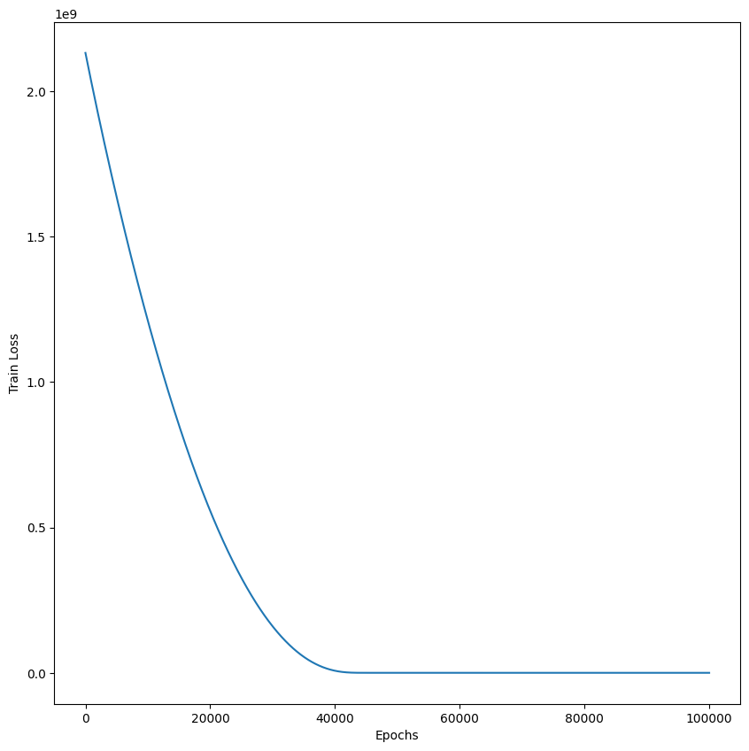
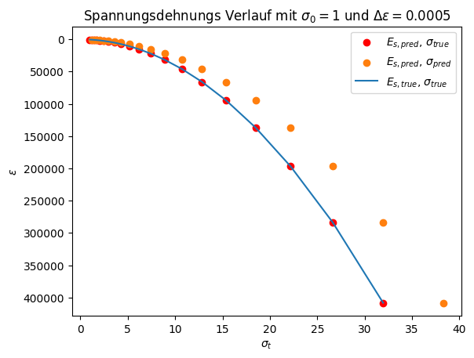

# MODUL PyTorch (Python 3.12)

# Vorhersage des Ödometerversuches implementiert
Ziel war die Implementierung eines neuronalen Netzwerks zur Modellierung des Ödometerversuchs. Dabei wurden gegebene Input-Parameter verarbeitet, um Output-Parameter vorherzusagen.

#### Das Problem ist wie folgt definiert:
$$
\begin{array}{rcl}
    \sigma_{t+1} & = & \sigma_{t}+\Delta\sigma \\ \\
    \Delta\sigma & = & E_s\cdot \Delta\epsilon \\ 
    E_s & = & \frac{1+e_0}{C_c} \cdot \sigma_t
\end{array}
\hspace{2cm}
\begin{array}{l}
    \textbf{Annahmen:} \\ \\
    \text{Startwert d. Iteration: } \sigma_t = 1,00 \\ 
    e_0 = 1,00 \\ 
    C_c = 0,005 \\
    \Delta\epsilon = 0,0005
\end{array}
$$

<br> 

Um das Model zu testen werden wir folgende vorberechnete Werte verwenden: `Input` { $\sigma_t$ }, `Output` { $E_s$ }.
<br>
### Variablendeklaration
- $\sigma_t$ = `sigma_t`
- $\Delta\epsilon$ = `delta_epsilon`
- $\sigma_{t+1}$ = `delta_sigma
- $E_s$ = `e_s`

# Generate random trainingsdata


```python
from random import randint

# Define input and output parameters
input_str = "sigma_t"
output_str = "e_s"

# Defining problem parameters
delta_epsilon=0.0005
C_c = 0.005
e_0 = 1.0
amount_trainings_data = 100

# Data preparation for 
oedo_para = {
    'max_n': 1,
    'e_0': e_0,
    'C_c': C_c,
    'delta_epsilon' : delta_epsilon,
}
```

# Load problem and generate trainings data from 00_problem_settings_functions.ipynb

Available classes: `Oedometer` <br>
Returns `list_input` and `list_output` as type `list` <br>
Returns `tensor_input` and `tensor_output` as type `tensor`


```python
%run 00_problem_settings_functions.ipynb

# Loads:
# Oedometer class

# Returns
# list_input: list
# list_output: list

# tensor_input: tensor
# tensor_output: tensor
```

# Show trainingsdata (List) as DataFrame
Type `list`: `list_input` and `list_output`


```python
import pandas as pd
from pandas import DataFrame

pd.DataFrame([[input_str] + list_input, [output_str] + list_output])
```


<div>
<style scoped>
    .dataframe tbody tr th:only-of-type {
        vertical-align: middle;
    }

    .dataframe tbody tr th {
        vertical-align: top;
    }

    .dataframe thead th {
        text-align: right;
    }
</style>
<table border="1" class="dataframe">
  <thead>
    <tr style="text-align: right;">
      <th></th>
      <th>0</th>
      <th>1</th>
      <th>2</th>
      <th>3</th>
      <th>4</th>
      <th>5</th>
      <th>6</th>
      <th>7</th>
      <th>8</th>
      <th>9</th>
      <th>...</th>
      <th>91</th>
      <th>92</th>
      <th>93</th>
      <th>94</th>
      <th>95</th>
      <th>96</th>
      <th>97</th>
      <th>98</th>
      <th>99</th>
      <th>100</th>
    </tr>
  </thead>
  <tbody>
    <tr>
      <th>0</th>
      <td>sigma_t</td>
      <td>46.0</td>
      <td>26.0</td>
      <td>45.0</td>
      <td>32.0</td>
      <td>22.0</td>
      <td>2.0</td>
      <td>15.0</td>
      <td>23.0</td>
      <td>45.0</td>
      <td>...</td>
      <td>32.0</td>
      <td>12.0</td>
      <td>1.0</td>
      <td>11.0</td>
      <td>44.0</td>
      <td>26.0</td>
      <td>19.0</td>
      <td>2.0</td>
      <td>21.0</td>
      <td>28.0</td>
    </tr>
    <tr>
      <th>1</th>
      <td>e_s</td>
      <td>18400.0</td>
      <td>10400.0</td>
      <td>18000.0</td>
      <td>12800.0</td>
      <td>8800.0</td>
      <td>800.0</td>
      <td>6000.0</td>
      <td>9200.0</td>
      <td>18000.0</td>
      <td>...</td>
      <td>12800.0</td>
      <td>4800.0</td>
      <td>400.0</td>
      <td>4400.0</td>
      <td>17600.0</td>
      <td>10400.0</td>
      <td>7600.0</td>
      <td>800.0</td>
      <td>8400.0</td>
      <td>11200.0</td>
    </tr>
  </tbody>
</table>
<p>2 rows × 101 columns</p>
</div>


# Show trainingsdata (Tensor) as DataFrame
Type `tensor`: `tensor_input` and `tensor_output`


```python
tensor_input_df = pd.DataFrame(torch.cat((tensor_input, tensor_output), dim=1), columns = [input_str, output_str])
tensor_input_df
```


<div>
<style scoped>
    .dataframe tbody tr th:only-of-type {
        vertical-align: middle;
    }

    .dataframe tbody tr th {
        vertical-align: top;
    }

    .dataframe thead th {
        text-align: right;
    }
</style>
<table border="1" class="dataframe">
  <thead>
    <tr style="text-align: right;">
      <th></th>
      <th>sigma_t</th>
      <th>e_s</th>
    </tr>
  </thead>
  <tbody>
    <tr>
      <th>0</th>
      <td>46.0</td>
      <td>18400.0</td>
    </tr>
    <tr>
      <th>1</th>
      <td>26.0</td>
      <td>10400.0</td>
    </tr>
    <tr>
      <th>2</th>
      <td>45.0</td>
      <td>18000.0</td>
    </tr>
    <tr>
      <th>3</th>
      <td>32.0</td>
      <td>12800.0</td>
    </tr>
    <tr>
      <th>4</th>
      <td>22.0</td>
      <td>8800.0</td>
    </tr>
    <tr>
      <th>...</th>
      <td>...</td>
      <td>...</td>
    </tr>
    <tr>
      <th>95</th>
      <td>26.0</td>
      <td>10400.0</td>
    </tr>
    <tr>
      <th>96</th>
      <td>19.0</td>
      <td>7600.0</td>
    </tr>
    <tr>
      <th>97</th>
      <td>2.0</td>
      <td>800.0</td>
    </tr>
    <tr>
      <th>98</th>
      <td>21.0</td>
      <td>8400.0</td>
    </tr>
    <tr>
      <th>99</th>
      <td>28.0</td>
      <td>11200.0</td>
    </tr>
  </tbody>
</table>
<p>100 rows × 2 columns</p>
</div>


# Define SimpleRegressor Model


```python
import torch.nn as nn
import torch.optim as optim


class SimpleRegressor(nn.Module):
    def __init__(self):
        super(SimpleRegressor, self).__init__()
        self.model = nn.Sequential(
            nn.Linear(1, 2),
            nn.Linear(2, 1),
        )

    def forward(self, x):
        return self.model(x)

model = SimpleRegressor()
```


```python
# import torch.nn as nn
# import torch.optim as optim


# class SimpleRegressor(nn.Module):
#     def __init__(self):
#         super(SimpleRegressor, self).__init__()
#         self.model = nn.Sequential(
#             nn.Linear(1, 16),
#             nn.ReLU(),
#             nn.Linear(16, 16),
#             nn.ReLU(),
#             nn.Linear(16, 1)
#         )

#     def forward(self, x):
#         return self.model(x)

# model = SimpleRegressor()
```

# Training


```python
loss_fn = nn.MSELoss()
optimizer = optim.Adam(model.parameters(), lr=0.01)

epochs = 15000
loss_history = []
for epoch in range(epochs):
    model.train()
    optimizer.zero_grad()
    pred = model(tensor_input)
    loss = loss_fn(pred, tensor_output)
    loss.backward()
    loss_history.append(loss.item())
    optimizer.step()

    if epoch % 100 == 0:
        print(f"Epoch {epoch}: Loss = {loss.item():.6f}")
```

    Epoch 0: Loss = 128486048.000000
    Epoch 100: Loss = 125310656.000000
    Epoch 200: Loss = 116046224.000000
    Epoch 300: Loss = 101191680.000000
    Epoch 400: Loss = 82714488.000000
    Epoch 500: Loss = 63004144.000000
    Epoch 600: Loss = 44359768.000000
    Epoch 700: Loss = 28576286.000000
    Epoch 800: Loss = 16649375.000000
    Epoch 900: Loss = 8676003.000000
    Epoch 1000: Loss = 4012856.250000
    Epoch 1100: Loss = 1649021.500000
    Epoch 1200: Loss = 614351.375000
    Epoch 1300: Loss = 222143.656250
    Epoch 1400: Loss = 92315.273438
    Epoch 1500: Loss = 54331.898438
    Epoch 1600: Loss = 44296.476562
    Epoch 1700: Loss = 41728.433594
    Epoch 1800: Loss = 40914.925781
    Epoch 1900: Loss = 40455.269531
    Epoch 2000: Loss = 40046.121094
    Epoch 2100: Loss = 39629.195312
    Epoch 2200: Loss = 39194.214844
    Epoch 2300: Loss = 38739.765625
    Epoch 2400: Loss = 38265.066406
    Epoch 2500: Loss = 37769.976562
    Epoch 2600: Loss = 37254.472656
    Epoch 2700: Loss = 36718.074219
    Epoch 2800: Loss = 36160.824219
    Epoch 2900: Loss = 35582.289062
    Epoch 3000: Loss = 34982.746094
    Epoch 3100: Loss = 34362.167969
    Epoch 3200: Loss = 33720.343750
    Epoch 3300: Loss = 33057.511719
    Epoch 3400: Loss = 32373.876953
    Epoch 3500: Loss = 31669.750000
    Epoch 3600: Loss = 30945.494141
    Epoch 3700: Loss = 30201.533203
    Epoch 3800: Loss = 29438.310547
    Epoch 3900: Loss = 28656.667969
    Epoch 4000: Loss = 27857.386719
    Epoch 4100: Loss = 27041.080078
    Epoch 4200: Loss = 26209.214844
    Epoch 4300: Loss = 25362.554688
    Epoch 4400: Loss = 24502.480469
    Epoch 4500: Loss = 23630.546875
    Epoch 4600: Loss = 22748.123047
    Epoch 4700: Loss = 21856.849609
    Epoch 4800: Loss = 20958.619141
    Epoch 4900: Loss = 20055.457031
    Epoch 5000: Loss = 19149.148438
    Epoch 5100: Loss = 18242.068359
    Epoch 5200: Loss = 17336.232422
    Epoch 5300: Loss = 16434.089844
    Epoch 5400: Loss = 15538.004883
    Epoch 5500: Loss = 14650.561523
    Epoch 5600: Loss = 13773.909180
    Epoch 5700: Loss = 12910.795898
    Epoch 5800: Loss = 12063.693359
    Epoch 5900: Loss = 11235.083984
    Epoch 6000: Loss = 10427.128906
    Epoch 6100: Loss = 9642.232422
    Epoch 6200: Loss = 8882.585938
    Epoch 6300: Loss = 8150.247559
    Epoch 6400: Loss = 7447.211426
    Epoch 6500: Loss = 6775.056641
    Epoch 6600: Loss = 6135.350586
    Epoch 6700: Loss = 5529.346191
    Epoch 6800: Loss = 4957.968750
    Epoch 6900: Loss = 4422.159180
    Epoch 7000: Loss = 3922.221680
    Epoch 7100: Loss = 3458.459961
    Epoch 7200: Loss = 3030.718994
    Epoch 7300: Loss = 2638.686768
    Epoch 7400: Loss = 2281.760986
    Epoch 7500: Loss = 1958.897217
    Epoch 7600: Loss = 1669.027832
    Epoch 7700: Loss = 1410.760498
    Epoch 7800: Loss = 1182.440063
    Epoch 7900: Loss = 982.319153
    Epoch 8000: Loss = 808.457520
    Epoch 8100: Loss = 658.851074
    Epoch 8200: Loss = 531.361938
    Epoch 8300: Loss = 423.871460
    Epoch 8400: Loss = 334.222931
    Epoch 8500: Loss = 260.351410
    Epoch 8600: Loss = 200.209000
    Epoch 8700: Loss = 151.877960
    Epoch 8800: Loss = 113.579910
    Epoch 8900: Loss = 83.663887
    Epoch 9000: Loss = 60.655853
    Epoch 9100: Loss = 43.245983
    Epoch 9200: Loss = 30.293329
    Epoch 9300: Loss = 20.826666
    Epoch 9400: Loss = 14.042776
    Epoch 9500: Loss = 9.273140
    Epoch 9600: Loss = 5.994133
    Epoch 9700: Loss = 3.784751
    Epoch 9800: Loss = 2.332833
    Epoch 9900: Loss = 1.401694
    Epoch 10000: Loss = 0.820376
    Epoch 10100: Loss = 0.466310
    Epoch 10200: Loss = 0.257401
    Epoch 10300: Loss = 0.137723
    Epoch 10400: Loss = 0.071429
    Epoch 10500: Loss = 0.035567
    Epoch 10600: Loss = 0.017147
    Epoch 10700: Loss = 0.007928
    Epoch 10800: Loss = 0.003544
    Epoch 10900: Loss = 0.001538
    Epoch 11000: Loss = 0.000627
    Epoch 11100: Loss = 0.000264
    Epoch 11200: Loss = 0.000098
    Epoch 11300: Loss = 0.000039
    Epoch 11400: Loss = 0.000015
    Epoch 11500: Loss = 0.000007
    Epoch 11600: Loss = 0.000004
    Epoch 11700: Loss = 0.000002
    Epoch 11800: Loss = 0.000002
    Epoch 11900: Loss = 0.000002
    Epoch 12000: Loss = 0.000001
    Epoch 12100: Loss = 0.000001
    Epoch 12200: Loss = 0.000001
    Epoch 12300: Loss = 0.000001
    Epoch 12400: Loss = 0.000001
    Epoch 12500: Loss = 0.000001
    Epoch 12600: Loss = 0.000001
    Epoch 12700: Loss = 0.000001
    Epoch 12800: Loss = 0.000001
    Epoch 12900: Loss = 0.000001
    Epoch 13000: Loss = 0.000001
    Epoch 13100: Loss = 0.000001
    Epoch 13200: Loss = 0.000001
    Epoch 13300: Loss = 0.000001
    Epoch 13400: Loss = 0.000001
    Epoch 13500: Loss = 0.000001
    Epoch 13600: Loss = 0.000001
    Epoch 13700: Loss = 0.000001
    Epoch 13800: Loss = 0.000001
    Epoch 13900: Loss = 0.000001
    Epoch 14000: Loss = 0.000001
    Epoch 14100: Loss = 0.000001
    Epoch 14200: Loss = 0.000001
    Epoch 14300: Loss = 0.000001
    Epoch 14400: Loss = 0.000001
    Epoch 14500: Loss = 0.000001
    Epoch 14600: Loss = 0.000001
    Epoch 14700: Loss = 0.000001
    Epoch 14800: Loss = 0.000001
    Epoch 14900: Loss = 0.000001


# Loss function


```python
import matplotlib.pyplot as plt

plt.plot(loss_history, label="Loss")
plt.xlabel('Epochs')
plt.ylabel('Train Loss')
plt.show()
```


    

    


```python
pred_input = torch.tensor([1.0], dtype=torch.float).unsqueeze(-1) 

model.eval()
with torch.no_grad():
    pred = model(pred_input)

print(pred)
```

    tensor([[400.0004]])


# Plot of stress–strain curve


```python
def plot_result(iterations=20, start_sigma=1, delta_epsilon=0.0005):
    oedo_para = {
    'max_n': iterations,
    'e_0': 1.0,
    'C_c': 0.005,
    'delta_epsilon' : delta_epsilon,
    'sigma_t' : start_sigma,
    }

    oedo = Oedometer(**oedo_para)
    sigma_true = oedo.sigma_t
    e_s_true = oedo.e_s
    
    # print(sigma_true)
    # print(e_s_true)
    model.eval()
    e_s_pred = []
    e_s_true_plot = []
    sigma_t = start_sigma
    sigma_pred = []
    pred_list = []
    with torch.no_grad():
        for i in range(iterations):
            sigma_true_tensor = torch.tensor(sigma_true[i], dtype=torch.float).unsqueeze(-1)
            pred = model(sigma_true_tensor)
            e_s_pred.append(pred * sigma_true[i])
            e_s_true_plot.append(e_s_true[i] * sigma_true[i])
            sigma_t = sigma_t + pred * delta_epsilon
            sigma_pred.append(sigma_t)
            pred_list.append(pred)
            
    # Plot der Losskurve
    plt.scatter(sigma_true, e_s_pred, label='$E_{s,pred}$, $\sigma_{true}$').set_color("red")
    plt.scatter(sigma_pred, e_s_pred, label='$E_{s,pred}$, $\sigma_{pred}$')
    plt.plot(sigma_true, e_s_true_plot, label='$E_{s,true}$, $\sigma_{true}$')

    plt.gca().invert_yaxis()
    plt.xlabel('$\sigma_t$')
    plt.ylabel('$\epsilon$')
    plt.title(f'Spannungsdehnungs Verlauf mit $\sigma_0={start_sigma}$ und $\Delta\epsilon=0.0005$')
    plt.legend()
    plt.show()

    return e_s_true, pred_list
e_s_true, e_s_pred = plot_result()
```

    <>:33: SyntaxWarning: invalid escape sequence '\s'
    <>:34: SyntaxWarning: invalid escape sequence '\s'
    <>:35: SyntaxWarning: invalid escape sequence '\s'
    <>:38: SyntaxWarning: invalid escape sequence '\s'
    <>:39: SyntaxWarning: invalid escape sequence '\e'
    <>:40: SyntaxWarning: invalid escape sequence '\s'
    <>:40: SyntaxWarning: invalid escape sequence '\D'
    <>:33: SyntaxWarning: invalid escape sequence '\s'
    <>:34: SyntaxWarning: invalid escape sequence '\s'
    <>:35: SyntaxWarning: invalid escape sequence '\s'
    <>:38: SyntaxWarning: invalid escape sequence '\s'
    <>:39: SyntaxWarning: invalid escape sequence '\e'
    <>:40: SyntaxWarning: invalid escape sequence '\s'
    <>:40: SyntaxWarning: invalid escape sequence '\D'
    /tmp/ipykernel_26437/196604954.py:33: SyntaxWarning: invalid escape sequence '\s'
      plt.scatter(sigma_true, e_s_pred, label='$E_{s,pred}$, $\sigma_{true}$').set_color("red")
    /tmp/ipykernel_26437/196604954.py:34: SyntaxWarning: invalid escape sequence '\s'
      plt.scatter(sigma_pred, e_s_pred, label='$E_{s,pred}$, $\sigma_{pred}$')
    /tmp/ipykernel_26437/196604954.py:35: SyntaxWarning: invalid escape sequence '\s'
      plt.plot(sigma_true, e_s_true_plot, label='$E_{s,true}$, $\sigma_{true}$')
    /tmp/ipykernel_26437/196604954.py:38: SyntaxWarning: invalid escape sequence '\s'
      plt.xlabel('$\sigma_t$')
    /tmp/ipykernel_26437/196604954.py:39: SyntaxWarning: invalid escape sequence '\e'
      plt.ylabel('$\epsilon$')
    /tmp/ipykernel_26437/196604954.py:40: SyntaxWarning: invalid escape sequence '\s'
      plt.title(f'Spannungsdehnungs Verlauf mit $\sigma_0={start_sigma}$ und $\Delta\epsilon=0.0005$')
    /tmp/ipykernel_26437/196604954.py:40: SyntaxWarning: invalid escape sequence '\D'
      plt.title(f'Spannungsdehnungs Verlauf mit $\sigma_0={start_sigma}$ und $\Delta\epsilon=0.0005$')


    

    


```python
key_1 = "$E_{s,true}$"
key_2 = "$E_{s,pred}$"
key_3 = "$\Delta$"

dict_diff = {
    key_1 : [],
    key_2 : [],
    key_3 : [],
}
for i, x in zip(e_s_true, e_s_pred):
    dict_diff[key_1].append(i)
    dict_diff[key_2].append(x.item())
    dict_diff[key_3].append(x.item() - i)

df = pd.DataFrame(dict_diff)
df
```

    <>:3: SyntaxWarning: invalid escape sequence '\D'
    <>:3: SyntaxWarning: invalid escape sequence '\D'
    /tmp/ipykernel_26437/1978223764.py:3: SyntaxWarning: invalid escape sequence '\D'
      key_3 = "$\Delta$"


<div>
<style scoped>
    .dataframe tbody tr th:only-of-type {
        vertical-align: middle;
    }

    .dataframe tbody tr th {
        vertical-align: top;
    }

    .dataframe thead th {
        text-align: right;
    }
</style>
<table border="1" class="dataframe">
  <thead>
    <tr style="text-align: right;">
      <th></th>
      <th>$E_{s,true}$</th>
      <th>$E_{s,pred}$</th>
      <th>$\Delta$</th>
    </tr>
  </thead>
  <tbody>
    <tr>
      <th>0</th>
      <td>400.000000</td>
      <td>400.000427</td>
      <td>0.000427</td>
    </tr>
    <tr>
      <th>1</th>
      <td>480.000000</td>
      <td>480.000458</td>
      <td>0.000458</td>
    </tr>
    <tr>
      <th>2</th>
      <td>576.000000</td>
      <td>576.000488</td>
      <td>0.000488</td>
    </tr>
    <tr>
      <th>3</th>
      <td>691.200000</td>
      <td>691.200439</td>
      <td>0.000439</td>
    </tr>
    <tr>
      <th>4</th>
      <td>829.440000</td>
      <td>829.440430</td>
      <td>0.000430</td>
    </tr>
    <tr>
      <th>5</th>
      <td>995.328000</td>
      <td>995.328430</td>
      <td>0.000430</td>
    </tr>
    <tr>
      <th>6</th>
      <td>1194.393600</td>
      <td>1194.394043</td>
      <td>0.000443</td>
    </tr>
    <tr>
      <th>7</th>
      <td>1433.272320</td>
      <td>1433.272705</td>
      <td>0.000385</td>
    </tr>
    <tr>
      <th>8</th>
      <td>1719.926784</td>
      <td>1719.927246</td>
      <td>0.000462</td>
    </tr>
    <tr>
      <th>9</th>
      <td>2063.912141</td>
      <td>2063.912598</td>
      <td>0.000457</td>
    </tr>
    <tr>
      <th>10</th>
      <td>2476.694569</td>
      <td>2476.694580</td>
      <td>0.000011</td>
    </tr>
    <tr>
      <th>11</th>
      <td>2972.033483</td>
      <td>2972.033936</td>
      <td>0.000453</td>
    </tr>
    <tr>
      <th>12</th>
      <td>3566.440179</td>
      <td>3566.440674</td>
      <td>0.000495</td>
    </tr>
    <tr>
      <th>13</th>
      <td>4279.728215</td>
      <td>4279.728516</td>
      <td>0.000300</td>
    </tr>
    <tr>
      <th>14</th>
      <td>5135.673858</td>
      <td>5135.673828</td>
      <td>-0.000030</td>
    </tr>
    <tr>
      <th>15</th>
      <td>6162.808630</td>
      <td>6162.808594</td>
      <td>-0.000036</td>
    </tr>
    <tr>
      <th>16</th>
      <td>7395.370356</td>
      <td>7395.370117</td>
      <td>-0.000239</td>
    </tr>
    <tr>
      <th>17</th>
      <td>8874.444427</td>
      <td>8874.444336</td>
      <td>-0.000091</td>
    </tr>
    <tr>
      <th>18</th>
      <td>10649.333312</td>
      <td>10649.333008</td>
      <td>-0.000305</td>
    </tr>
    <tr>
      <th>19</th>
      <td>12779.199975</td>
      <td>12779.199219</td>
      <td>-0.000756</td>
    </tr>
  </tbody>
</table>
</div>


```python

```
