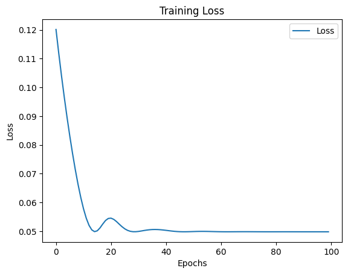

# Template
## Load modules & Check PyTorch


```python
# Import modules
import torch
import torch.nn as nn
import torch.optim as optim

import pandas as pd

# data processing
import random as r
from sys import exit
import numpy as np
import matplotlib.pyplot as plt
```

## Parameters


```python
# Debugger: Aktiviert
debug_mode = True
```

## Preloaded Modules


```python
def dict_to_markdown_table(data: dict, title: str = "Datenübersicht", include_index: bool = True, round_digits: int = 4):
    """
    Wandelt ein Dictionary mit Listenwerten in eine Markdown-Tabelle für Jupyter Notebooks um.
    
    - Schlüssel werden als Header genutzt
    - Erste Spalte ist ein Index, falls `include_index=True`
    - Einzelwerte werden als separate Tabelle unterhalb dargestellt
    - Zahlenwerte werden auf eine einstellbare Anzahl an Nachkommastellen gerundet

    :param data: Dictionary mit Key-Value-Paaren
    :param title: Überschrift für die Tabelle
    :param include_index: Falls True, wird eine Index-Spalte erstellt
    :param round_digits: Anzahl der Nachkommastellen, auf die Werte gerundet werden sollen
    :return: Markdown-String zur Anzeige in Jupyter
    """
    
    # Hilfsfunktion zum Runden von Zahlen
    def round_value(val):
        if isinstance(val, (int, float)):
            return round(val, round_digits)
        return val

    # Listen und einzelne Werte trennen
    list_data = {k: v for k, v in data.items() if isinstance(v, list)}
    single_values = {k: v for k, v in data.items() if not isinstance(v, list)}

    # Falls es Listen gibt, erstelle eine Tabelle mit Index
    if list_data:
        max_len = max(len(v) for v in list_data.values())  # Längste Liste bestimmen

        # Tabellenkopf
        md_table = f"### {title}\n\n"
        md_table += "| " + ("Index | " if include_index else "") + " | ".join(list_data.keys()) + " |\n"
        md_table += "|-" + ("-|" if include_index else "") + "-|".join(["-" * len(k) for k in list_data.keys()]) + "-|\n"

        # Datenzeilen
        for i in range(max_len):
            row = [str(i)] if include_index else []  # Index hinzufügen (optional)
            for key in list_data:
                if i < len(list_data[key]):
                    row.append(str(round_value(list_data[key][i])))
                else:
                    row.append("")  # Leere Werte für ungleich lange Listen
            md_table += "| " + " | ".join(row) + " |\n"
    
    else:
        md_table = ""

    # Einzelwerte als extra Tabelle darstellen
    if single_values:
        md_table += "\n\n#### Einzelwerte\n\n"
        md_table += "| " + " | ".join(single_values.keys()) + " |\n"
        md_table += "|-" + "-|".join(["-" * len(k) for k in single_values.keys()]) + "-|\n"
        md_table += "| " + " | ".join(map(lambda v: str(round_value(v)), single_values.values())) + " |\n"

    return Markdown(md_table)


def display_data_loss_table(data_dict, delta_sigma_pred, max_i):
    """
    Erstellt eine Markdown-Tabelle zur übersichtlichen Darstellung von Datenverlust.
    
    Unterstützt sowohl Python-Listen als auch NumPy-Arrays.
    
    :param data_dict: Dictionary mit `sigma_t` und `delta_sigma` (Listen oder np.arrays)
    :param delta_sigma_pred: Vorhergesagte Werte für `delta_sigma` (Liste oder np.array)
    :param max_i: Anzahl der Werte, die in der Tabelle angezeigt werden sollen
    """
    
    # Sicherstellen, dass `sigma_t` und `delta_sigma` existieren
    if "sigma_t" not in data_dict or "delta_sigma" not in data_dict or delta_sigma_pred is None:
        print("Fehler: `data_dict` oder `delta_sigma_pred` ist nicht korrekt definiert!")
        return

    # Konvertiere alle Werte zu Listen (falls sie NumPy-Arrays sind)
    def to_list(arr):
        return arr.tolist() if isinstance(arr, np.ndarray) else arr

    total_epsilon = to_list(data_dict["total_epsilon"])
    delta_epsilon = to_list(data_dict["delta_epsilon"])
    sigma_t = to_list(data_dict["sigma_t"])
    delta_sigma_true = to_list(data_dict["delta_sigma"])
    delta_sigma_pred = to_list(delta_sigma_pred.flatten())  # Falls `delta_sigma_pred` ein 2D-Array ist
    
    # Überprüfen, ob die Längen konsistent sind
    min_len = min(len(total_epsilon), len(sigma_t), len(delta_epsilon), len(delta_sigma_true), len(delta_sigma_pred), max_i)

    # Erstelle eine Tabelle für die übersichtliche Darstellung
    data_loss_table = {
        "total_epsilon" : list(total_epsilon[:min_len]), 
        "delta_epsilon" : list(delta_epsilon[:min_len]), 
        "sigma_t" : list(sigma_t[:min_len]), 
        "True delta_sigma": list(delta_sigma_true[:min_len]),
        "Predicted delta_sigma": list(delta_sigma_pred[:min_len]),
        "Test-Loss (True - Predicted)": list(np.round(np.array(delta_sigma_true[:min_len]) - np.array(delta_sigma_pred[:min_len]), 5))
    }

    # Markdown-Tabelle für bessere Darstellung in Jupyter
    display(dict_to_markdown_table(data_loss_table, title=f"Data-Loss bis sigma_{min_len-1}", include_index=True))
```

## Check for use of CONDA if available


```python
use_cuda = torch.cuda.is_available()
device = torch.device("cuda:0" if use_cuda else "cpu")

if device.type == 'cpu':
    device_num = 0
    print('No GPU available.')
else:
    device_num = torch.cuda.device_count()
    print('Device:', device, '-- Number of devices:', device_num)
```

    Device: cuda:0 -- Number of devices: 1
    

# Recurrent Neural Networks

Just as people do not have to think again each time about the things they have already learned, it is also possible to teach neural networks to recall knowledge they were being taught. This is done in so-called Recurrent Neural Networks (RNNs) with loops inside, which allow information to be retained. Currently the most used architectures of RNNs are Long short-term memory (LSTM) networks. LSTMs are RNNs that overcome the problem of long-term dependencies and thus have achieved the most state-of-the-art results in this area. In this exercise we will look at how to use LSTMs to predict future values using time series data sets.

## Data processing


```python
import random

class Oedometer:
    def __init__(self, e_0: float = 1.00, C_c: float = 0.005, delta_epsilon: float = 0.0005, 
                 sigma_t: float = 1.00, max_n: int = 50, rand_epsilon:bool=False, **kwargs):
        self.max_n = max_n

        # Standardwerte als Listen setzen
        self.e_0 = [e_0]
        self.C_c = [C_c]
        self.sigma_t = [sigma_t]
        self.delta_epsilon = []
        self.total_epsilon = [0]

        # Initiale Listen für Berechnungen
        self.sigma_t = [sigma_t]
        self.delta_sigma = []
        self.e_s = []
        self.delta_epsilon = [delta_epsilon]
        
        # Dynamische Zuweisung von kwargs, falls vorhanden
        for key, value in kwargs.items():
            if hasattr(self, key):  # Nur vorhandene Attribute setzen
                setattr(self, key, [value])
        
        # Berechnungen durchführen
        self.__calc_sigma_t_p1()

        # Listenlängen anpassen
        self.__adjust_list_lengths()
        self.__calc_total_epsilon()

    def __adjust_list_lengths(self):
        """ Passt ALLE Listen-Attribute an `max_n` an. """
        attributes = ['e_0', 'C_c', 'delta_epsilon', 'sigma_t', 'sigma_t', 'delta_sigma', 'e_s']
        for attr in attributes:
            value_list = getattr(self, attr, [])
            current_length = len(value_list)

            if current_length > self.max_n:
                setattr(self, attr, value_list[:self.max_n])  # Kürzen
            elif current_length < self.max_n:
                setattr(self, attr, value_list + [value_list[-1] if value_list else 0] * (self.max_n - current_length))  # Auffüllen
    
    def __calc_total_epsilon(self):
        for i in range(len(self.delta_epsilon)-1):
            self.total_epsilon.append(self.total_epsilon[i] + self.delta_epsilon[i])            
    
    def __calc_e_s(self, sigma_t):
        """ Berechnet `e_s` aus `sigma_t`. """
        e_s = (1 + self.e_0[0]) / self.C_c[0] * sigma_t
        self.e_s.append(e_s)
        return e_s

    def __calc_sigma_t_p1(self):
        """ Berechnet `sigma_t` und `delta_sigma` für die nächsten Schritte. """
        for i in range(self.max_n):  # -1, weil sigma_t bereits gesetzt ist
            e_s = self.__calc_e_s(self.sigma_t[i])
            delta_sigma = e_s * self.delta_epsilon[0]
            sigma = self.sigma_t[i] + delta_sigma
            self.sigma_t.append(sigma)
            self.delta_sigma.append(delta_sigma)

def plot_input():
    # Plot
    plt.figure(figsize=(10, 5))
    plt.plot(data_dict_raw['sigma_t'], data_dict_raw['delta_sigma'], marker='o', linestyle='-', label='Sigma_0 = 1')
    
    # Formatting
    plt.xlabel('sigma_t')
    plt.ylabel('delta_simga')
    plt.title('Sigma_0 in relation to Sigma_1')
    plt.xticks(rotation=45)
    plt.grid(True)
    plt.legend()
    plt.tight_layout()
    plt.show()
```


```python
i = 5000

oedo_para = {
    'max_n': 1, 
    'e_0': 1.0, 
    'C_c': 0.005,   
    'total_epsilon': 0,
    'e_s': 400.0
}

# Vorbereitung Tensoren
sigma_t = []
delta_sigma = []
delta_epsilon =  []
for i in range(i):
    oedo_para['sigma_t'] = r.randrange(0,500)
    oedo_para['delta_epsilon'] = r.uniform(0.0001,0.001)
    oedo = Oedometer(**oedo_para)
    delta_epsilon.append(round(oedo.delta_epsilon[0], 4))
    delta_sigma.append(round(oedo.delta_sigma[0], 2))
    sigma_t.append(round(oedo.sigma_t[0], 2))


```


```python
data = [['sigma_t'] + sigma_t, ['delta_sigma'] + delta_sigma, ['delta_epsilon'] + delta_epsilon]
import tabulate
table = tabulate.tabulate(data, tablefmt='html')
table
```


<table>
<tbody>
<tr><td>sigma_t      </td><td style="text-align: right;">398     </td><td style="text-align: right;">240     </td><td style="text-align: right;">43     </td><td style="text-align: right;">449     </td><td style="text-align: right;">32     </td><td style="text-align: right;">231     </td><td style="text-align: right;">115     </td><td style="text-align: right;">362     </td><td style="text-align: right;">353     </td><td style="text-align: right;">362     </td><td style="text-align: right;">176     </td><td style="text-align: right;">255     </td><td style="text-align: right;">381     </td><td style="text-align: right;">446     </td><td style="text-align: right;">148    </td><td style="text-align: right;">140     </td><td style="text-align: right;">5     </td><td style="text-align: right;">319     </td><td style="text-align: right;">167     </td><td style="text-align: right;">34     </td><td style="text-align: right;">207     </td><td style="text-align: right;">444     </td><td style="text-align: right;">73     </td><td style="text-align: right;">153     </td><td style="text-align: right;">184     </td><td style="text-align: right;">270     </td><td style="text-align: right;">202     </td><td style="text-align: right;">82     </td><td style="text-align: right;">364    </td><td style="text-align: right;">42     </td><td style="text-align: right;">416     </td><td style="text-align: right;">8     </td><td style="text-align: right;">186     </td><td style="text-align: right;">92     </td><td style="text-align: right;">353     </td><td style="text-align: right;">194     </td><td style="text-align: right;">497     </td><td style="text-align: right;">284     </td><td style="text-align: right;">181     </td><td style="text-align: right;">415     </td><td style="text-align: right;">110     </td><td style="text-align: right;">380     </td><td style="text-align: right;">19     </td><td style="text-align: right;">367     </td><td style="text-align: right;">384     </td><td style="text-align: right;">110     </td><td style="text-align: right;">143     </td><td style="text-align: right;">71     </td><td style="text-align: right;">307     </td><td style="text-align: right;">167     </td><td style="text-align: right;">259     </td><td style="text-align: right;">315     </td><td style="text-align: right;">253     </td><td style="text-align: right;">128     </td><td style="text-align: right;">213     </td><td style="text-align: right;">314     </td><td style="text-align: right;">155     </td><td style="text-align: right;">271     </td><td style="text-align: right;">151     </td><td style="text-align: right;">288     </td><td style="text-align: right;">297    </td><td style="text-align: right;">398    </td><td style="text-align: right;">207     </td><td style="text-align: right;">405     </td><td style="text-align: right;">63     </td><td style="text-align: right;">411     </td><td style="text-align: right;">41     </td><td style="text-align: right;">209     </td><td style="text-align: right;">237     </td><td style="text-align: right;">432     </td><td style="text-align: right;">492     </td><td style="text-align: right;">477     </td><td style="text-align: right;">68     </td><td style="text-align: right;">88     </td><td style="text-align: right;">432     </td><td style="text-align: right;">394     </td><td style="text-align: right;">386     </td><td style="text-align: right;">342     </td><td style="text-align: right;">267     </td><td style="text-align: right;">237    </td><td style="text-align: right;">281     </td><td style="text-align: right;">314     </td><td style="text-align: right;">245     </td><td style="text-align: right;">340     </td><td style="text-align: right;">277     </td><td style="text-align: right;">123     </td><td style="text-align: right;">23     </td><td style="text-align: right;">269     </td><td style="text-align: right;">55     </td><td style="text-align: right;">414     </td><td style="text-align: right;">396     </td><td style="text-align: right;">123     </td><td style="text-align: right;">87     </td><td style="text-align: right;">388    </td><td style="text-align: right;">19     </td><td style="text-align: right;">436     </td><td style="text-align: right;">167     </td><td style="text-align: right;">193     </td><td style="text-align: right;">214     </td><td style="text-align: right;">298     </td><td style="text-align: right;">109     </td><td style="text-align: right;">428     </td><td style="text-align: right;">439     </td><td style="text-align: right;">490     </td><td style="text-align: right;">345     </td><td style="text-align: right;">409     </td><td style="text-align: right;">303     </td><td style="text-align: right;">60     </td><td style="text-align: right;">355     </td><td style="text-align: right;">442     </td><td style="text-align: right;">472    </td><td style="text-align: right;">491    </td><td style="text-align: right;">64     </td><td style="text-align: right;">471     </td><td style="text-align: right;">260     </td><td style="text-align: right;">10     </td><td style="text-align: right;">319     </td><td style="text-align: right;">29     </td><td style="text-align: right;">130     </td><td style="text-align: right;">461     </td><td style="text-align: right;">330     </td><td style="text-align: right;">216     </td><td style="text-align: right;">97     </td><td style="text-align: right;">411     </td><td style="text-align: right;">334     </td><td style="text-align: right;">179     </td><td style="text-align: right;">214     </td><td style="text-align: right;">13     </td><td style="text-align: right;">84     </td><td style="text-align: right;">62     </td><td style="text-align: right;">30     </td><td style="text-align: right;">494     </td><td style="text-align: right;">379     </td><td style="text-align: right;">408     </td><td style="text-align: right;">307     </td><td style="text-align: right;">50     </td><td style="text-align: right;">259     </td><td style="text-align: right;">137     </td><td style="text-align: right;">498     </td><td style="text-align: right;">414     </td><td style="text-align: right;">384     </td><td style="text-align: right;">351    </td><td style="text-align: right;">177     </td><td style="text-align: right;">366     </td><td style="text-align: right;">371     </td><td style="text-align: right;">126     </td><td style="text-align: right;">367     </td><td style="text-align: right;">211     </td><td style="text-align: right;">57     </td><td style="text-align: right;">250     </td><td style="text-align: right;">343     </td><td style="text-align: right;">378     </td><td style="text-align: right;">135     </td><td style="text-align: right;">483     </td><td style="text-align: right;">219     </td><td style="text-align: right;">102     </td><td style="text-align: right;">104     </td><td style="text-align: right;">147     </td><td style="text-align: right;">123     </td><td style="text-align: right;">68     </td><td style="text-align: right;">272     </td><td style="text-align: right;">115     </td><td style="text-align: right;">97     </td><td style="text-align: right;">76     </td><td style="text-align: right;">459     </td><td style="text-align: right;">475     </td><td style="text-align: right;">486     </td><td style="text-align: right;">124     </td><td style="text-align: right;">133     </td><td style="text-align: right;">143     </td><td style="text-align: right;">325    </td><td style="text-align: right;">441     </td><td style="text-align: right;">277     </td><td style="text-align: right;">2     </td><td style="text-align: right;">72     </td><td style="text-align: right;">358     </td><td style="text-align: right;">246     </td><td style="text-align: right;">296     </td><td style="text-align: right;">227     </td><td style="text-align: right;">145     </td><td style="text-align: right;">345     </td><td style="text-align: right;">175     </td><td style="text-align: right;">23     </td><td style="text-align: right;">189     </td><td style="text-align: right;">336     </td><td style="text-align: right;">126     </td><td style="text-align: right;">394     </td><td style="text-align: right;">241     </td><td style="text-align: right;">326     </td><td style="text-align: right;">436    </td><td style="text-align: right;">165     </td><td style="text-align: right;">15     </td><td style="text-align: right;">197     </td><td style="text-align: right;">425     </td><td style="text-align: right;">291     </td><td style="text-align: right;">315     </td><td style="text-align: right;">243    </td><td style="text-align: right;">14     </td><td style="text-align: right;">19     </td><td style="text-align: right;">50     </td><td style="text-align: right;">366     </td><td style="text-align: right;">128     </td><td style="text-align: right;">19     </td><td style="text-align: right;">249     </td><td style="text-align: right;">310     </td><td style="text-align: right;">287     </td><td style="text-align: right;">447     </td><td style="text-align: right;">165     </td><td style="text-align: right;">114     </td><td style="text-align: right;">14     </td><td style="text-align: right;">288     </td><td style="text-align: right;">146     </td><td style="text-align: right;">482     </td><td style="text-align: right;">248     </td><td style="text-align: right;">418     </td><td style="text-align: right;">354     </td><td style="text-align: right;">16     </td><td style="text-align: right;">312     </td><td style="text-align: right;">442     </td><td style="text-align: right;">468    </td><td style="text-align: right;">226     </td><td style="text-align: right;">388     </td><td style="text-align: right;">76     </td><td style="text-align: right;">142     </td><td style="text-align: right;">440     </td><td style="text-align: right;">82     </td><td style="text-align: right;">96     </td><td style="text-align: right;">347    </td><td style="text-align: right;">150     </td><td style="text-align: right;">99     </td><td style="text-align: right;">156     </td><td style="text-align: right;">0     </td><td style="text-align: right;">430     </td><td style="text-align: right;">162     </td><td style="text-align: right;">421     </td><td style="text-align: right;">22     </td><td style="text-align: right;">163     </td><td style="text-align: right;">180     </td><td style="text-align: right;">438     </td><td style="text-align: right;">365     </td><td style="text-align: right;">54    </td><td style="text-align: right;">186     </td><td style="text-align: right;">484     </td><td style="text-align: right;">165     </td><td style="text-align: right;">493     </td><td style="text-align: right;">22     </td><td style="text-align: right;">130     </td><td style="text-align: right;">492     </td><td style="text-align: right;">488     </td><td style="text-align: right;">387     </td><td style="text-align: right;">480     </td><td style="text-align: right;">499     </td><td style="text-align: right;">386     </td><td style="text-align: right;">428     </td><td style="text-align: right;">274     </td><td style="text-align: right;">11     </td><td style="text-align: right;">397     </td><td style="text-align: right;">320     </td><td style="text-align: right;">18     </td><td style="text-align: right;">83     </td><td style="text-align: right;">252     </td><td style="text-align: right;">87     </td><td style="text-align: right;">470     </td><td style="text-align: right;">123     </td><td style="text-align: right;">478     </td><td style="text-align: right;">107     </td><td style="text-align: right;">471     </td><td style="text-align: right;">144     </td><td style="text-align: right;">124     </td><td style="text-align: right;">330     </td><td style="text-align: right;">256     </td><td style="text-align: right;">190    </td><td style="text-align: right;">216     </td><td style="text-align: right;">62     </td><td style="text-align: right;">432     </td><td style="text-align: right;">70     </td><td style="text-align: right;">466    </td><td style="text-align: right;">163     </td><td style="text-align: right;">276    </td><td style="text-align: right;">66     </td><td style="text-align: right;">258     </td><td style="text-align: right;">380     </td><td style="text-align: right;">425     </td><td style="text-align: right;">315     </td><td style="text-align: right;">131     </td><td style="text-align: right;">488     </td><td style="text-align: right;">375     </td><td style="text-align: right;">383     </td><td style="text-align: right;">321     </td><td style="text-align: right;">67     </td><td style="text-align: right;">484     </td><td style="text-align: right;">274     </td><td style="text-align: right;">108     </td><td style="text-align: right;">98     </td><td style="text-align: right;">126     </td><td style="text-align: right;">116     </td><td style="text-align: right;">267     </td><td style="text-align: right;">3     </td><td style="text-align: right;">257     </td><td style="text-align: right;">133     </td><td style="text-align: right;">201     </td><td style="text-align: right;">440     </td><td style="text-align: right;">403     </td><td style="text-align: right;">226     </td><td style="text-align: right;">53    </td><td style="text-align: right;">377     </td><td style="text-align: right;">135     </td><td style="text-align: right;">492     </td><td style="text-align: right;">106     </td><td style="text-align: right;">413     </td><td style="text-align: right;">460     </td><td style="text-align: right;">262     </td><td style="text-align: right;">14     </td><td style="text-align: right;">280     </td><td style="text-align: right;">477     </td><td style="text-align: right;">97     </td><td style="text-align: right;">193     </td><td style="text-align: right;">333     </td><td style="text-align: right;">202     </td><td style="text-align: right;">382     </td><td style="text-align: right;">115     </td><td style="text-align: right;">78     </td><td style="text-align: right;">151     </td><td style="text-align: right;">381     </td><td style="text-align: right;">444     </td><td style="text-align: right;">421     </td><td style="text-align: right;">115     </td><td style="text-align: right;">352     </td><td style="text-align: right;">375     </td><td style="text-align: right;">205     </td><td style="text-align: right;">308     </td><td style="text-align: right;">447     </td><td style="text-align: right;">446     </td><td style="text-align: right;">84     </td><td style="text-align: right;">191     </td><td style="text-align: right;">488     </td><td style="text-align: right;">253     </td><td style="text-align: right;">456     </td><td style="text-align: right;">143     </td><td style="text-align: right;">26     </td><td style="text-align: right;">182    </td><td style="text-align: right;">163     </td><td style="text-align: right;">93     </td><td style="text-align: right;">312     </td><td style="text-align: right;">35    </td><td style="text-align: right;">379     </td><td style="text-align: right;">12     </td><td style="text-align: right;">491     </td><td style="text-align: right;">72     </td><td style="text-align: right;">344     </td><td style="text-align: right;">73     </td><td style="text-align: right;">303     </td><td style="text-align: right;">13     </td><td style="text-align: right;">198     </td><td style="text-align: right;">206     </td><td style="text-align: right;">294     </td><td style="text-align: right;">170     </td><td style="text-align: right;">131     </td><td style="text-align: right;">263     </td><td style="text-align: right;">364     </td><td style="text-align: right;">39    </td><td style="text-align: right;">178     </td><td style="text-align: right;">165     </td><td style="text-align: right;">252     </td><td style="text-align: right;">479     </td><td style="text-align: right;">113     </td><td style="text-align: right;">250     </td><td style="text-align: right;">257    </td><td style="text-align: right;">289     </td><td style="text-align: right;">44     </td><td style="text-align: right;">243     </td><td style="text-align: right;">185     </td><td style="text-align: right;">185     </td><td style="text-align: right;">249     </td><td style="text-align: right;">7     </td><td style="text-align: right;">267     </td><td style="text-align: right;">398     </td><td style="text-align: right;">277     </td><td style="text-align: right;">56     </td><td style="text-align: right;">292     </td><td style="text-align: right;">398    </td><td style="text-align: right;">299     </td><td style="text-align: right;">283     </td><td style="text-align: right;">394     </td><td style="text-align: right;">277    </td><td style="text-align: right;">339     </td><td style="text-align: right;">148     </td><td style="text-align: right;">473     </td><td style="text-align: right;">421    </td><td style="text-align: right;">277     </td><td style="text-align: right;">11     </td><td style="text-align: right;">339     </td><td style="text-align: right;">175     </td><td style="text-align: right;">142     </td><td style="text-align: right;">190     </td><td style="text-align: right;">343     </td><td style="text-align: right;">417     </td><td style="text-align: right;">429     </td><td style="text-align: right;">405     </td><td style="text-align: right;">193     </td><td style="text-align: right;">217     </td><td style="text-align: right;">253     </td><td style="text-align: right;">452     </td><td style="text-align: right;">73     </td><td style="text-align: right;">442     </td><td style="text-align: right;">72     </td><td style="text-align: right;">473     </td><td style="text-align: right;">47     </td><td style="text-align: right;">321     </td><td style="text-align: right;">13     </td><td style="text-align: right;">37     </td><td style="text-align: right;">281     </td><td style="text-align: right;">325     </td><td style="text-align: right;">251     </td><td style="text-align: right;">264     </td><td style="text-align: right;">11     </td><td style="text-align: right;">171     </td><td style="text-align: right;">192     </td><td style="text-align: right;">325     </td><td style="text-align: right;">346     </td><td style="text-align: right;">476     </td><td style="text-align: right;">271     </td><td style="text-align: right;">483     </td><td style="text-align: right;">492     </td><td style="text-align: right;">260     </td><td style="text-align: right;">407     </td><td style="text-align: right;">471     </td><td style="text-align: right;">422     </td><td style="text-align: right;">193     </td><td style="text-align: right;">73    </td><td style="text-align: right;">122     </td><td style="text-align: right;">27     </td><td style="text-align: right;">49     </td><td style="text-align: right;">16     </td><td style="text-align: right;">220     </td><td style="text-align: right;">412     </td><td style="text-align: right;">305     </td><td style="text-align: right;">405     </td><td style="text-align: right;">154     </td><td style="text-align: right;">169     </td><td style="text-align: right;">440     </td><td style="text-align: right;">267     </td><td style="text-align: right;">159     </td><td style="text-align: right;">376     </td><td style="text-align: right;">360     </td><td style="text-align: right;">231     </td><td style="text-align: right;">133     </td><td style="text-align: right;">264     </td><td style="text-align: right;">67     </td><td style="text-align: right;">470     </td><td style="text-align: right;">244     </td><td style="text-align: right;">478     </td><td style="text-align: right;">355     </td><td style="text-align: right;">182     </td><td style="text-align: right;">161     </td><td style="text-align: right;">76     </td><td style="text-align: right;">0     </td><td style="text-align: right;">298     </td><td style="text-align: right;">145     </td><td style="text-align: right;">377     </td><td style="text-align: right;">25    </td><td style="text-align: right;">125     </td><td style="text-align: right;">222     </td><td style="text-align: right;">224    </td><td style="text-align: right;">106     </td><td style="text-align: right;">65     </td><td style="text-align: right;">296     </td><td style="text-align: right;">111     </td><td style="text-align: right;">443    </td><td style="text-align: right;">86     </td><td style="text-align: right;">415     </td><td style="text-align: right;">475     </td><td style="text-align: right;">450     </td><td style="text-align: right;">90     </td><td style="text-align: right;">261    </td><td style="text-align: right;">270    </td><td style="text-align: right;">42     </td><td style="text-align: right;">349     </td><td style="text-align: right;">59     </td><td style="text-align: right;">214     </td><td style="text-align: right;">60     </td><td style="text-align: right;">276     </td><td style="text-align: right;">217     </td><td style="text-align: right;">460     </td><td style="text-align: right;">304     </td><td style="text-align: right;">340     </td><td style="text-align: right;">285     </td><td style="text-align: right;">136     </td><td style="text-align: right;">199     </td><td style="text-align: right;">129     </td><td style="text-align: right;">155     </td><td style="text-align: right;">374     </td><td style="text-align: right;">406     </td><td style="text-align: right;">393     </td><td style="text-align: right;">330     </td><td style="text-align: right;">295     </td><td style="text-align: right;">226    </td><td style="text-align: right;">312     </td><td style="text-align: right;">7     </td><td style="text-align: right;">92     </td><td style="text-align: right;">457     </td><td style="text-align: right;">376     </td><td style="text-align: right;">4     </td><td style="text-align: right;">333     </td><td style="text-align: right;">84     </td><td style="text-align: right;">75     </td><td style="text-align: right;">309     </td><td style="text-align: right;">185     </td><td style="text-align: right;">433     </td><td style="text-align: right;">173     </td><td style="text-align: right;">187     </td><td style="text-align: right;">487     </td><td style="text-align: right;">175     </td><td style="text-align: right;">420     </td><td style="text-align: right;">447     </td><td style="text-align: right;">3     </td><td style="text-align: right;">57    </td><td style="text-align: right;">236     </td><td style="text-align: right;">319     </td><td style="text-align: right;">30     </td><td style="text-align: right;">271     </td><td style="text-align: right;">145     </td><td style="text-align: right;">150     </td><td style="text-align: right;">141     </td><td style="text-align: right;">144     </td><td style="text-align: right;">295     </td><td style="text-align: right;">334     </td><td style="text-align: right;">302     </td><td style="text-align: right;">298     </td><td style="text-align: right;">383     </td><td style="text-align: right;">278     </td><td style="text-align: right;">304     </td><td style="text-align: right;">77     </td><td style="text-align: right;">412     </td><td style="text-align: right;">140     </td><td style="text-align: right;">242     </td><td style="text-align: right;">478     </td><td style="text-align: right;">155     </td><td style="text-align: right;">370     </td><td style="text-align: right;">99     </td><td style="text-align: right;">367     </td><td style="text-align: right;">467     </td><td style="text-align: right;">409     </td><td style="text-align: right;">342    </td><td style="text-align: right;">132     </td><td style="text-align: right;">393     </td><td style="text-align: right;">58     </td><td style="text-align: right;">399     </td><td style="text-align: right;">65     </td><td style="text-align: right;">372     </td><td style="text-align: right;">259     </td><td style="text-align: right;">373     </td><td style="text-align: right;">402    </td><td style="text-align: right;">148     </td><td style="text-align: right;">474     </td><td style="text-align: right;">287     </td><td style="text-align: right;">436     </td><td style="text-align: right;">306     </td><td style="text-align: right;">244     </td><td style="text-align: right;">95     </td><td style="text-align: right;">133     </td><td style="text-align: right;">253     </td><td style="text-align: right;">476     </td><td style="text-align: right;">485     </td><td style="text-align: right;">330    </td><td style="text-align: right;">397     </td><td style="text-align: right;">366     </td><td style="text-align: right;">348     </td><td style="text-align: right;">299     </td><td style="text-align: right;">109     </td><td style="text-align: right;">99     </td><td style="text-align: right;">97     </td><td style="text-align: right;">373     </td><td style="text-align: right;">132     </td><td style="text-align: right;">27     </td><td style="text-align: right;">369     </td><td style="text-align: right;">194     </td><td style="text-align: right;">24     </td><td style="text-align: right;">126     </td><td style="text-align: right;">428     </td><td style="text-align: right;">187     </td><td style="text-align: right;">219     </td><td style="text-align: right;">239     </td><td style="text-align: right;">12     </td><td style="text-align: right;">462     </td><td style="text-align: right;">139     </td><td style="text-align: right;">290     </td><td style="text-align: right;">32     </td><td style="text-align: right;">480     </td><td style="text-align: right;">483     </td><td style="text-align: right;">88     </td><td style="text-align: right;">389    </td><td style="text-align: right;">171     </td><td style="text-align: right;">274     </td><td style="text-align: right;">123    </td><td style="text-align: right;">251     </td><td style="text-align: right;">465     </td><td style="text-align: right;">498    </td><td style="text-align: right;">103     </td><td style="text-align: right;">428     </td><td style="text-align: right;">444     </td><td style="text-align: right;">53    </td><td style="text-align: right;">380     </td><td style="text-align: right;">284     </td><td style="text-align: right;">241    </td><td style="text-align: right;">124     </td><td style="text-align: right;">381     </td><td style="text-align: right;">483     </td><td style="text-align: right;">156     </td><td style="text-align: right;">166     </td><td style="text-align: right;">444     </td><td style="text-align: right;">490     </td><td style="text-align: right;">12     </td><td style="text-align: right;">424     </td><td style="text-align: right;">469    </td><td style="text-align: right;">381     </td><td style="text-align: right;">433     </td><td style="text-align: right;">83     </td><td style="text-align: right;">69     </td><td style="text-align: right;">291    </td><td style="text-align: right;">473     </td><td style="text-align: right;">39     </td><td style="text-align: right;">254     </td><td style="text-align: right;">166     </td><td style="text-align: right;">386     </td><td style="text-align: right;">471     </td><td style="text-align: right;">333     </td><td style="text-align: right;">284     </td><td style="text-align: right;">308     </td><td style="text-align: right;">202     </td><td style="text-align: right;">191     </td><td style="text-align: right;">412     </td><td style="text-align: right;">54     </td><td style="text-align: right;">33     </td><td style="text-align: right;">434     </td><td style="text-align: right;">381     </td><td style="text-align: right;">313     </td><td style="text-align: right;">469     </td><td style="text-align: right;">38     </td><td style="text-align: right;">289     </td><td style="text-align: right;">404     </td><td style="text-align: right;">29     </td><td style="text-align: right;">494     </td><td style="text-align: right;">375     </td><td style="text-align: right;">247     </td><td style="text-align: right;">295    </td><td style="text-align: right;">254     </td><td style="text-align: right;">91     </td><td style="text-align: right;">205     </td><td style="text-align: right;">308     </td><td style="text-align: right;">95     </td><td style="text-align: right;">125     </td><td style="text-align: right;">436    </td><td style="text-align: right;">308     </td><td style="text-align: right;">362     </td><td style="text-align: right;">266    </td><td style="text-align: right;">104     </td><td style="text-align: right;">180     </td><td style="text-align: right;">95     </td><td style="text-align: right;">422    </td><td style="text-align: right;">107     </td><td style="text-align: right;">377     </td><td style="text-align: right;">47     </td><td style="text-align: right;">469     </td><td style="text-align: right;">145     </td><td style="text-align: right;">436     </td><td style="text-align: right;">480     </td><td style="text-align: right;">407     </td><td style="text-align: right;">417     </td><td style="text-align: right;">121     </td><td style="text-align: right;">148     </td><td style="text-align: right;">469     </td><td style="text-align: right;">373     </td><td style="text-align: right;">429     </td><td style="text-align: right;">216     </td><td style="text-align: right;">448     </td><td style="text-align: right;">331     </td><td style="text-align: right;">27     </td><td style="text-align: right;">27     </td><td style="text-align: right;">152     </td><td style="text-align: right;">12     </td><td style="text-align: right;">78     </td><td style="text-align: right;">313     </td><td style="text-align: right;">257     </td><td style="text-align: right;">347     </td><td style="text-align: right;">362     </td><td style="text-align: right;">287     </td><td style="text-align: right;">91     </td><td style="text-align: right;">384     </td><td style="text-align: right;">139     </td><td style="text-align: right;">22     </td><td style="text-align: right;">152     </td><td style="text-align: right;">207    </td><td style="text-align: right;">364    </td><td style="text-align: right;">455     </td><td style="text-align: right;">253     </td><td style="text-align: right;">238    </td><td style="text-align: right;">346     </td><td style="text-align: right;">325     </td><td style="text-align: right;">35     </td><td style="text-align: right;">41     </td><td style="text-align: right;">198     </td><td style="text-align: right;">466    </td><td style="text-align: right;">450     </td><td style="text-align: right;">56     </td><td style="text-align: right;">321     </td><td style="text-align: right;">317     </td><td style="text-align: right;">312     </td><td style="text-align: right;">22     </td><td style="text-align: right;">390     </td><td style="text-align: right;">462     </td><td style="text-align: right;">18     </td><td style="text-align: right;">104     </td><td style="text-align: right;">396     </td><td style="text-align: right;">271     </td><td style="text-align: right;">43     </td><td style="text-align: right;">236    </td><td style="text-align: right;">362     </td><td style="text-align: right;">364     </td><td style="text-align: right;">58     </td><td style="text-align: right;">381     </td><td style="text-align: right;">114     </td><td style="text-align: right;">116     </td><td style="text-align: right;">379     </td><td style="text-align: right;">40     </td><td style="text-align: right;">326     </td><td style="text-align: right;">367     </td><td style="text-align: right;">474     </td><td style="text-align: right;">459     </td><td style="text-align: right;">345     </td><td style="text-align: right;">408     </td><td style="text-align: right;">329     </td><td style="text-align: right;">201     </td><td style="text-align: right;">32     </td><td style="text-align: right;">3     </td><td style="text-align: right;">20     </td><td style="text-align: right;">316     </td><td style="text-align: right;">335     </td><td style="text-align: right;">427     </td><td style="text-align: right;">131     </td><td style="text-align: right;">207     </td><td style="text-align: right;">43     </td><td style="text-align: right;">337     </td><td style="text-align: right;">119     </td><td style="text-align: right;">8     </td><td style="text-align: right;">151     </td><td style="text-align: right;">348     </td><td style="text-align: right;">263     </td><td style="text-align: right;">12     </td><td style="text-align: right;">125     </td><td style="text-align: right;">358     </td><td style="text-align: right;">69     </td><td style="text-align: right;">416     </td><td style="text-align: right;">382     </td><td style="text-align: right;">117     </td><td style="text-align: right;">237     </td><td style="text-align: right;">306     </td><td style="text-align: right;">497     </td><td style="text-align: right;">37     </td><td style="text-align: right;">137     </td><td style="text-align: right;">149     </td><td style="text-align: right;">13     </td><td style="text-align: right;">479     </td><td style="text-align: right;">385     </td><td style="text-align: right;">298     </td><td style="text-align: right;">359     </td><td style="text-align: right;">375     </td><td style="text-align: right;">268     </td><td style="text-align: right;">291     </td><td style="text-align: right;">81    </td><td style="text-align: right;">318     </td><td style="text-align: right;">79     </td><td style="text-align: right;">403     </td><td style="text-align: right;">226     </td><td style="text-align: right;">329     </td><td style="text-align: right;">10     </td><td style="text-align: right;">318     </td><td style="text-align: right;">473     </td><td style="text-align: right;">107     </td><td style="text-align: right;">263     </td><td style="text-align: right;">479     </td><td style="text-align: right;">245     </td><td style="text-align: right;">432     </td><td style="text-align: right;">188     </td><td style="text-align: right;">96     </td><td style="text-align: right;">368     </td><td style="text-align: right;">75     </td><td style="text-align: right;">350     </td><td style="text-align: right;">30     </td><td style="text-align: right;">120    </td><td style="text-align: right;">184     </td><td style="text-align: right;">28     </td><td style="text-align: right;">119     </td><td style="text-align: right;">396     </td><td style="text-align: right;">464     </td><td style="text-align: right;">216     </td><td style="text-align: right;">99     </td><td style="text-align: right;">41     </td><td style="text-align: right;">187     </td><td style="text-align: right;">25     </td><td style="text-align: right;">141     </td><td style="text-align: right;">189     </td><td style="text-align: right;">255     </td><td style="text-align: right;">276     </td><td style="text-align: right;">316     </td><td style="text-align: right;">480     </td><td style="text-align: right;">356    </td><td style="text-align: right;">108     </td><td style="text-align: right;">41     </td><td style="text-align: right;">108     </td><td style="text-align: right;">62     </td><td style="text-align: right;">352     </td><td style="text-align: right;">391     </td><td style="text-align: right;">466     </td><td style="text-align: right;">432     </td><td style="text-align: right;">497     </td><td style="text-align: right;">289     </td><td style="text-align: right;">159     </td><td style="text-align: right;">332     </td><td style="text-align: right;">64    </td><td style="text-align: right;">26     </td><td style="text-align: right;">39    </td><td style="text-align: right;">14     </td><td style="text-align: right;">350     </td><td style="text-align: right;">269     </td><td style="text-align: right;">376    </td><td style="text-align: right;">392    </td><td style="text-align: right;">70     </td><td style="text-align: right;">363     </td><td style="text-align: right;">304     </td><td style="text-align: right;">406     </td><td style="text-align: right;">186     </td><td style="text-align: right;">255     </td><td style="text-align: right;">81     </td><td style="text-align: right;">438     </td><td style="text-align: right;">200     </td><td style="text-align: right;">218     </td><td style="text-align: right;">321     </td><td style="text-align: right;">314     </td><td style="text-align: right;">486     </td><td style="text-align: right;">395    </td><td style="text-align: right;">480     </td><td style="text-align: right;">43     </td><td style="text-align: right;">355     </td><td style="text-align: right;">42     </td><td style="text-align: right;">330     </td><td style="text-align: right;">335     </td><td style="text-align: right;">26     </td><td style="text-align: right;">338     </td><td style="text-align: right;">281     </td><td style="text-align: right;">296     </td><td style="text-align: right;">207    </td><td style="text-align: right;">172     </td><td style="text-align: right;">149     </td><td style="text-align: right;">342     </td><td style="text-align: right;">19     </td><td style="text-align: right;">55     </td><td style="text-align: right;">169     </td><td style="text-align: right;">461     </td><td style="text-align: right;">154     </td><td style="text-align: right;">123     </td><td style="text-align: right;">7     </td><td style="text-align: right;">205     </td><td style="text-align: right;">140     </td><td style="text-align: right;">74     </td><td style="text-align: right;">491     </td><td style="text-align: right;">133     </td><td style="text-align: right;">32     </td><td style="text-align: right;">311     </td><td style="text-align: right;">325     </td><td style="text-align: right;">182     </td><td style="text-align: right;">7     </td><td style="text-align: right;">240     </td><td style="text-align: right;">471     </td><td style="text-align: right;">45     </td><td style="text-align: right;">491     </td><td style="text-align: right;">175     </td><td style="text-align: right;">92    </td><td style="text-align: right;">499     </td><td style="text-align: right;">291     </td><td style="text-align: right;">97     </td><td style="text-align: right;">143     </td><td style="text-align: right;">106     </td><td style="text-align: right;">292     </td><td style="text-align: right;">128     </td><td style="text-align: right;">82     </td><td style="text-align: right;">364     </td><td style="text-align: right;">127     </td><td style="text-align: right;">298     </td><td style="text-align: right;">137     </td><td style="text-align: right;">328     </td><td style="text-align: right;">38     </td><td style="text-align: right;">240     </td><td style="text-align: right;">318     </td><td style="text-align: right;">158     </td><td style="text-align: right;">183     </td><td style="text-align: right;">102     </td><td style="text-align: right;">369     </td><td style="text-align: right;">303     </td><td style="text-align: right;">461     </td><td style="text-align: right;">267     </td><td style="text-align: right;">367     </td><td style="text-align: right;">141     </td><td style="text-align: right;">383     </td><td style="text-align: right;">12     </td><td style="text-align: right;">417     </td><td style="text-align: right;">472     </td><td style="text-align: right;">364     </td><td style="text-align: right;">266     </td><td style="text-align: right;">280     </td><td style="text-align: right;">240     </td><td style="text-align: right;">106     </td><td style="text-align: right;">236     </td><td style="text-align: right;">136     </td><td style="text-align: right;">154     </td><td style="text-align: right;">42     </td><td style="text-align: right;">344     </td><td style="text-align: right;">432     </td><td style="text-align: right;">233     </td><td style="text-align: right;">268     </td><td style="text-align: right;">295     </td><td style="text-align: right;">209     </td><td style="text-align: right;">76     </td><td style="text-align: right;">387     </td><td style="text-align: right;">52     </td><td style="text-align: right;">457    </td><td style="text-align: right;">74     </td><td style="text-align: right;">217     </td><td style="text-align: right;">27     </td><td style="text-align: right;">155     </td><td style="text-align: right;">437     </td><td style="text-align: right;">175     </td><td style="text-align: right;">428     </td><td style="text-align: right;">241     </td><td style="text-align: right;">142     </td><td style="text-align: right;">264     </td><td style="text-align: right;">373     </td><td style="text-align: right;">44     </td><td style="text-align: right;">310     </td><td style="text-align: right;">129     </td><td style="text-align: right;">460     </td><td style="text-align: right;">254     </td><td style="text-align: right;">322     </td><td style="text-align: right;">92     </td><td style="text-align: right;">134     </td><td style="text-align: right;">141     </td><td style="text-align: right;">111     </td><td style="text-align: right;">381     </td><td style="text-align: right;">489     </td><td style="text-align: right;">384     </td><td style="text-align: right;">23     </td><td style="text-align: right;">204     </td><td style="text-align: right;">163     </td><td style="text-align: right;">231     </td><td style="text-align: right;">258     </td><td style="text-align: right;">229     </td><td style="text-align: right;">99     </td><td style="text-align: right;">318     </td><td style="text-align: right;">361     </td><td style="text-align: right;">196     </td><td style="text-align: right;">225     </td><td style="text-align: right;">255     </td><td style="text-align: right;">200     </td><td style="text-align: right;">81     </td><td style="text-align: right;">321     </td><td style="text-align: right;">189     </td><td style="text-align: right;">301    </td><td style="text-align: right;">229     </td><td style="text-align: right;">382     </td><td style="text-align: right;">87     </td><td style="text-align: right;">149     </td><td style="text-align: right;">388     </td><td style="text-align: right;">479     </td><td style="text-align: right;">481     </td><td style="text-align: right;">458     </td><td style="text-align: right;">103     </td><td style="text-align: right;">318     </td><td style="text-align: right;">86     </td><td style="text-align: right;">0     </td><td style="text-align: right;">365     </td><td style="text-align: right;">352     </td><td style="text-align: right;">334     </td><td style="text-align: right;">110     </td><td style="text-align: right;">80     </td><td style="text-align: right;">162     </td><td style="text-align: right;">67     </td><td style="text-align: right;">208     </td><td style="text-align: right;">111     </td><td style="text-align: right;">425     </td><td style="text-align: right;">8     </td><td style="text-align: right;">295     </td><td style="text-align: right;">311     </td><td style="text-align: right;">111     </td><td style="text-align: right;">316     </td><td style="text-align: right;">326     </td><td style="text-align: right;">426     </td><td style="text-align: right;">249     </td><td style="text-align: right;">201     </td><td style="text-align: right;">230     </td><td style="text-align: right;">17     </td><td style="text-align: right;">51     </td><td style="text-align: right;">34    </td><td style="text-align: right;">221     </td><td style="text-align: right;">79     </td><td style="text-align: right;">92    </td><td style="text-align: right;">163     </td><td style="text-align: right;">318     </td><td style="text-align: right;">471     </td><td style="text-align: right;">24     </td><td style="text-align: right;">339     </td><td style="text-align: right;">163     </td><td style="text-align: right;">327     </td><td style="text-align: right;">19     </td><td style="text-align: right;">333     </td><td style="text-align: right;">274     </td><td style="text-align: right;">463     </td><td style="text-align: right;">335     </td><td style="text-align: right;">490     </td><td style="text-align: right;">303     </td><td style="text-align: right;">476     </td><td style="text-align: right;">266     </td><td style="text-align: right;">225     </td><td style="text-align: right;">94     </td><td style="text-align: right;">178     </td><td style="text-align: right;">223     </td><td style="text-align: right;">140     </td><td style="text-align: right;">369     </td><td style="text-align: right;">344     </td><td style="text-align: right;">246     </td><td style="text-align: right;">27     </td><td style="text-align: right;">410     </td><td style="text-align: right;">248     </td><td style="text-align: right;">238     </td><td style="text-align: right;">462     </td><td style="text-align: right;">378     </td><td style="text-align: right;">217     </td><td style="text-align: right;">377     </td><td style="text-align: right;">114     </td><td style="text-align: right;">69     </td><td style="text-align: right;">401     </td><td style="text-align: right;">463     </td><td style="text-align: right;">326     </td><td style="text-align: right;">271    </td><td style="text-align: right;">227     </td><td style="text-align: right;">231     </td><td style="text-align: right;">472     </td><td style="text-align: right;">305     </td><td style="text-align: right;">260     </td><td style="text-align: right;">401     </td><td style="text-align: right;">148     </td><td style="text-align: right;">239     </td><td style="text-align: right;">492     </td><td style="text-align: right;">434     </td><td style="text-align: right;">0     </td><td style="text-align: right;">254     </td><td style="text-align: right;">427     </td><td style="text-align: right;">66     </td><td style="text-align: right;">350     </td><td style="text-align: right;">283     </td><td style="text-align: right;">381     </td><td style="text-align: right;">221     </td><td style="text-align: right;">352     </td><td style="text-align: right;">378     </td><td style="text-align: right;">304     </td><td style="text-align: right;">141     </td><td style="text-align: right;">106     </td><td style="text-align: right;">95     </td><td style="text-align: right;">281     </td><td style="text-align: right;">330     </td><td style="text-align: right;">367     </td><td style="text-align: right;">248     </td><td style="text-align: right;">465     </td><td style="text-align: right;">455     </td><td style="text-align: right;">320     </td><td style="text-align: right;">306     </td><td style="text-align: right;">279     </td><td style="text-align: right;">437     </td><td style="text-align: right;">92     </td><td style="text-align: right;">89     </td><td style="text-align: right;">431     </td><td style="text-align: right;">461     </td><td style="text-align: right;">348    </td><td style="text-align: right;">269     </td><td style="text-align: right;">230     </td><td style="text-align: right;">450     </td><td style="text-align: right;">197     </td><td style="text-align: right;">130     </td><td style="text-align: right;">112     </td><td style="text-align: right;">168    </td><td style="text-align: right;">472     </td><td style="text-align: right;">176     </td><td style="text-align: right;">36     </td><td style="text-align: right;">48    </td><td style="text-align: right;">316     </td><td style="text-align: right;">158     </td><td style="text-align: right;">196     </td><td style="text-align: right;">449     </td><td style="text-align: right;">249     </td><td style="text-align: right;">104     </td><td style="text-align: right;">122     </td><td style="text-align: right;">150     </td><td style="text-align: right;">76     </td><td style="text-align: right;">227     </td><td style="text-align: right;">322     </td><td style="text-align: right;">247     </td><td style="text-align: right;">444     </td><td style="text-align: right;">308     </td><td style="text-align: right;">333     </td><td style="text-align: right;">461     </td><td style="text-align: right;">84     </td><td style="text-align: right;">477     </td><td style="text-align: right;">203    </td><td style="text-align: right;">3     </td><td style="text-align: right;">257     </td><td style="text-align: right;">281     </td><td style="text-align: right;">344     </td><td style="text-align: right;">317     </td><td style="text-align: right;">468     </td><td style="text-align: right;">26     </td><td style="text-align: right;">295     </td><td style="text-align: right;">321     </td><td style="text-align: right;">139     </td><td style="text-align: right;">10     </td><td style="text-align: right;">270     </td><td style="text-align: right;">497     </td><td style="text-align: right;">303     </td><td style="text-align: right;">277     </td><td style="text-align: right;">241     </td><td style="text-align: right;">295     </td><td style="text-align: right;">409     </td><td style="text-align: right;">43     </td><td style="text-align: right;">70     </td><td style="text-align: right;">221     </td><td style="text-align: right;">258     </td><td style="text-align: right;">274     </td><td style="text-align: right;">136     </td><td style="text-align: right;">307     </td><td style="text-align: right;">222     </td><td style="text-align: right;">300     </td><td style="text-align: right;">78     </td><td style="text-align: right;">198     </td><td style="text-align: right;">189    </td><td style="text-align: right;">153     </td><td style="text-align: right;">279     </td><td style="text-align: right;">342     </td><td style="text-align: right;">400     </td><td style="text-align: right;">91    </td><td style="text-align: right;">386     </td><td style="text-align: right;">208    </td><td style="text-align: right;">181     </td><td style="text-align: right;">179     </td><td style="text-align: right;">476     </td><td style="text-align: right;">226     </td><td style="text-align: right;">24     </td><td style="text-align: right;">290     </td><td style="text-align: right;">139     </td><td style="text-align: right;">373     </td><td style="text-align: right;">431     </td><td style="text-align: right;">161    </td><td style="text-align: right;">95     </td><td style="text-align: right;">354     </td><td style="text-align: right;">278     </td><td style="text-align: right;">138     </td><td style="text-align: right;">453     </td><td style="text-align: right;">226     </td><td style="text-align: right;">141     </td><td style="text-align: right;">403     </td><td style="text-align: right;">109     </td><td style="text-align: right;">463    </td><td style="text-align: right;">422     </td><td style="text-align: right;">411     </td><td style="text-align: right;">441     </td><td style="text-align: right;">103     </td><td style="text-align: right;">47     </td><td style="text-align: right;">10     </td><td style="text-align: right;">248     </td><td style="text-align: right;">64     </td><td style="text-align: right;">399     </td><td style="text-align: right;">42     </td><td style="text-align: right;">349     </td><td style="text-align: right;">149     </td><td style="text-align: right;">50     </td><td style="text-align: right;">440     </td><td style="text-align: right;">217     </td><td style="text-align: right;">253     </td><td style="text-align: right;">136     </td><td style="text-align: right;">56    </td><td style="text-align: right;">492     </td><td style="text-align: right;">43     </td><td style="text-align: right;">379     </td><td style="text-align: right;">114     </td><td style="text-align: right;">222     </td><td style="text-align: right;">236     </td><td style="text-align: right;">138     </td><td style="text-align: right;">261     </td><td style="text-align: right;">50     </td><td style="text-align: right;">189     </td><td style="text-align: right;">301     </td><td style="text-align: right;">173     </td><td style="text-align: right;">483     </td><td style="text-align: right;">167     </td><td style="text-align: right;">336     </td><td style="text-align: right;">416     </td><td style="text-align: right;">441     </td><td style="text-align: right;">482     </td><td style="text-align: right;">242     </td><td style="text-align: right;">187     </td><td style="text-align: right;">290     </td><td style="text-align: right;">308     </td><td style="text-align: right;">378     </td><td style="text-align: right;">271     </td><td style="text-align: right;">143     </td><td style="text-align: right;">185     </td><td style="text-align: right;">7     </td><td style="text-align: right;">492     </td><td style="text-align: right;">93     </td><td style="text-align: right;">362     </td><td style="text-align: right;">367     </td><td style="text-align: right;">266     </td><td style="text-align: right;">448     </td><td style="text-align: right;">253     </td><td style="text-align: right;">337     </td><td style="text-align: right;">104     </td><td style="text-align: right;">361     </td><td style="text-align: right;">291     </td><td style="text-align: right;">446     </td><td style="text-align: right;">320     </td><td style="text-align: right;">376     </td><td style="text-align: right;">111     </td><td style="text-align: right;">76     </td><td style="text-align: right;">55     </td><td style="text-align: right;">172     </td><td style="text-align: right;">137     </td><td style="text-align: right;">311     </td><td style="text-align: right;">432     </td><td style="text-align: right;">368     </td><td style="text-align: right;">235     </td><td style="text-align: right;">397     </td><td style="text-align: right;">262     </td><td style="text-align: right;">384     </td><td style="text-align: right;">277     </td><td style="text-align: right;">76     </td><td style="text-align: right;">387     </td><td style="text-align: right;">190    </td><td style="text-align: right;">35     </td><td style="text-align: right;">353     </td><td style="text-align: right;">248     </td><td style="text-align: right;">456     </td><td style="text-align: right;">127    </td><td style="text-align: right;">428     </td><td style="text-align: right;">285     </td><td style="text-align: right;">27     </td><td style="text-align: right;">115     </td><td style="text-align: right;">388     </td><td style="text-align: right;">286     </td><td style="text-align: right;">112     </td><td style="text-align: right;">322    </td><td style="text-align: right;">138     </td><td style="text-align: right;">459     </td><td style="text-align: right;">309     </td><td style="text-align: right;">22     </td><td style="text-align: right;">34     </td><td style="text-align: right;">486     </td><td style="text-align: right;">308     </td><td style="text-align: right;">14     </td><td style="text-align: right;">311     </td><td style="text-align: right;">241     </td><td style="text-align: right;">321     </td><td style="text-align: right;">93    </td><td style="text-align: right;">333     </td><td style="text-align: right;">293     </td><td style="text-align: right;">303     </td><td style="text-align: right;">69     </td><td style="text-align: right;">448     </td><td style="text-align: right;">244    </td><td style="text-align: right;">103     </td><td style="text-align: right;">118     </td><td style="text-align: right;">466     </td><td style="text-align: right;">234     </td><td style="text-align: right;">396     </td><td style="text-align: right;">172     </td><td style="text-align: right;">143     </td><td style="text-align: right;">66    </td><td style="text-align: right;">471     </td><td style="text-align: right;">267     </td><td style="text-align: right;">422     </td><td style="text-align: right;">48     </td><td style="text-align: right;">453     </td><td style="text-align: right;">305     </td><td style="text-align: right;">82     </td><td style="text-align: right;">443     </td><td style="text-align: right;">89     </td><td style="text-align: right;">36     </td><td style="text-align: right;">236     </td><td style="text-align: right;">305     </td><td style="text-align: right;">280     </td><td style="text-align: right;">181     </td><td style="text-align: right;">296     </td><td style="text-align: right;">394     </td><td style="text-align: right;">248     </td><td style="text-align: right;">442     </td><td style="text-align: right;">172     </td><td style="text-align: right;">196     </td><td style="text-align: right;">178     </td><td style="text-align: right;">5     </td><td style="text-align: right;">424     </td><td style="text-align: right;">388     </td><td style="text-align: right;">443     </td><td style="text-align: right;">355     </td><td style="text-align: right;">220     </td><td style="text-align: right;">235     </td><td style="text-align: right;">209     </td><td style="text-align: right;">30     </td><td style="text-align: right;">120     </td><td style="text-align: right;">137     </td><td style="text-align: right;">94     </td><td style="text-align: right;">434     </td><td style="text-align: right;">70     </td><td style="text-align: right;">272     </td><td style="text-align: right;">214     </td><td style="text-align: right;">25     </td><td style="text-align: right;">34     </td><td style="text-align: right;">379     </td><td style="text-align: right;">165     </td><td style="text-align: right;">96     </td><td style="text-align: right;">440     </td><td style="text-align: right;">323     </td><td style="text-align: right;">87     </td><td style="text-align: right;">402     </td><td style="text-align: right;">125     </td><td style="text-align: right;">111     </td><td style="text-align: right;">389     </td><td style="text-align: right;">487     </td><td style="text-align: right;">143     </td><td style="text-align: right;">6     </td><td style="text-align: right;">194     </td><td style="text-align: right;">375     </td><td style="text-align: right;">217     </td><td style="text-align: right;">452     </td><td style="text-align: right;">422     </td><td style="text-align: right;">165     </td><td style="text-align: right;">328     </td><td style="text-align: right;">145     </td><td style="text-align: right;">256     </td><td style="text-align: right;">259    </td><td style="text-align: right;">113     </td><td style="text-align: right;">392     </td><td style="text-align: right;">167    </td><td style="text-align: right;">89     </td><td style="text-align: right;">189     </td><td style="text-align: right;">114     </td><td style="text-align: right;">7     </td><td style="text-align: right;">197     </td><td style="text-align: right;">271     </td><td style="text-align: right;">238     </td><td style="text-align: right;">450     </td><td style="text-align: right;">214     </td><td style="text-align: right;">392     </td><td style="text-align: right;">2     </td><td style="text-align: right;">83     </td><td style="text-align: right;">254     </td><td style="text-align: right;">225     </td><td style="text-align: right;">191     </td><td style="text-align: right;">159     </td><td style="text-align: right;">46     </td><td style="text-align: right;">176    </td><td style="text-align: right;">487     </td><td style="text-align: right;">358     </td><td style="text-align: right;">478     </td><td style="text-align: right;">286     </td><td style="text-align: right;">463     </td><td style="text-align: right;">79     </td><td style="text-align: right;">441     </td><td style="text-align: right;">217     </td><td style="text-align: right;">53     </td><td style="text-align: right;">191     </td><td style="text-align: right;">433     </td><td style="text-align: right;">496     </td><td style="text-align: right;">26     </td><td style="text-align: right;">239    </td><td style="text-align: right;">378     </td><td style="text-align: right;">57    </td><td style="text-align: right;">311     </td><td style="text-align: right;">78     </td><td style="text-align: right;">85     </td><td style="text-align: right;">145     </td><td style="text-align: right;">320     </td><td style="text-align: right;">127     </td><td style="text-align: right;">17     </td><td style="text-align: right;">349     </td><td style="text-align: right;">356     </td><td style="text-align: right;">360     </td><td style="text-align: right;">322     </td><td style="text-align: right;">327    </td><td style="text-align: right;">29    </td><td style="text-align: right;">423     </td><td style="text-align: right;">425     </td><td style="text-align: right;">306     </td><td style="text-align: right;">216     </td><td style="text-align: right;">16     </td><td style="text-align: right;">25    </td><td style="text-align: right;">82     </td><td style="text-align: right;">57     </td><td style="text-align: right;">152     </td><td style="text-align: right;">162     </td><td style="text-align: right;">206     </td><td style="text-align: right;">325     </td><td style="text-align: right;">327     </td><td style="text-align: right;">228    </td><td style="text-align: right;">70     </td><td style="text-align: right;">228     </td><td style="text-align: right;">301     </td><td style="text-align: right;">480     </td><td style="text-align: right;">231     </td><td style="text-align: right;">357     </td><td style="text-align: right;">200     </td><td style="text-align: right;">81     </td><td style="text-align: right;">276     </td><td style="text-align: right;">203     </td><td style="text-align: right;">392     </td><td style="text-align: right;">415     </td><td style="text-align: right;">167     </td><td style="text-align: right;">412     </td><td style="text-align: right;">277     </td><td style="text-align: right;">87     </td><td style="text-align: right;">18     </td><td style="text-align: right;">346     </td><td style="text-align: right;">84     </td><td style="text-align: right;">497    </td><td style="text-align: right;">188     </td><td style="text-align: right;">471     </td><td style="text-align: right;">219     </td><td style="text-align: right;">355     </td><td style="text-align: right;">132     </td><td style="text-align: right;">461     </td><td style="text-align: right;">267     </td><td style="text-align: right;">239    </td><td style="text-align: right;">311    </td><td style="text-align: right;">3     </td><td style="text-align: right;">31     </td><td style="text-align: right;">49     </td><td style="text-align: right;">167     </td><td style="text-align: right;">393     </td><td style="text-align: right;">148     </td><td style="text-align: right;">432    </td><td style="text-align: right;">102     </td><td style="text-align: right;">393     </td><td style="text-align: right;">421     </td><td style="text-align: right;">421     </td><td style="text-align: right;">291     </td><td style="text-align: right;">437     </td><td style="text-align: right;">224     </td><td style="text-align: right;">369     </td><td style="text-align: right;">407    </td><td style="text-align: right;">387     </td><td style="text-align: right;">234     </td><td style="text-align: right;">155     </td><td style="text-align: right;">340     </td><td style="text-align: right;">123     </td><td style="text-align: right;">132     </td><td style="text-align: right;">483     </td><td style="text-align: right;">253     </td><td style="text-align: right;">331     </td><td style="text-align: right;">487     </td><td style="text-align: right;">7     </td><td style="text-align: right;">35     </td><td style="text-align: right;">320     </td><td style="text-align: right;">186     </td><td style="text-align: right;">233     </td><td style="text-align: right;">187     </td><td style="text-align: right;">238     </td><td style="text-align: right;">490     </td><td style="text-align: right;">100     </td><td style="text-align: right;">116     </td><td style="text-align: right;">6     </td><td style="text-align: right;">450     </td><td style="text-align: right;">91     </td><td style="text-align: right;">133     </td><td style="text-align: right;">154     </td><td style="text-align: right;">459     </td><td style="text-align: right;">470     </td><td style="text-align: right;">54     </td><td style="text-align: right;">53     </td><td style="text-align: right;">210     </td><td style="text-align: right;">164     </td><td style="text-align: right;">40     </td><td style="text-align: right;">285     </td><td style="text-align: right;">314     </td><td style="text-align: right;">382     </td><td style="text-align: right;">172     </td><td style="text-align: right;">62     </td><td style="text-align: right;">337     </td><td style="text-align: right;">317     </td><td style="text-align: right;">16     </td><td style="text-align: right;">272     </td><td style="text-align: right;">253     </td><td style="text-align: right;">463     </td><td style="text-align: right;">323     </td><td style="text-align: right;">92    </td><td style="text-align: right;">377     </td><td style="text-align: right;">395     </td><td style="text-align: right;">6     </td><td style="text-align: right;">49     </td><td style="text-align: right;">439     </td><td style="text-align: right;">67     </td><td style="text-align: right;">413     </td><td style="text-align: right;">11     </td><td style="text-align: right;">141     </td><td style="text-align: right;">374     </td><td style="text-align: right;">71     </td><td style="text-align: right;">400     </td><td style="text-align: right;">412     </td><td style="text-align: right;">282     </td><td style="text-align: right;">177     </td><td style="text-align: right;">133     </td><td style="text-align: right;">266     </td><td style="text-align: right;">194     </td><td style="text-align: right;">368     </td><td style="text-align: right;">176    </td><td style="text-align: right;">389     </td><td style="text-align: right;">56     </td><td style="text-align: right;">442     </td><td style="text-align: right;">211     </td><td style="text-align: right;">224     </td><td style="text-align: right;">102     </td><td style="text-align: right;">170    </td><td style="text-align: right;">101     </td><td style="text-align: right;">82     </td><td style="text-align: right;">35     </td><td style="text-align: right;">325     </td><td style="text-align: right;">333     </td><td style="text-align: right;">337     </td><td style="text-align: right;">374     </td><td style="text-align: right;">112     </td><td style="text-align: right;">302     </td><td style="text-align: right;">398     </td><td style="text-align: right;">71     </td><td style="text-align: right;">141     </td><td style="text-align: right;">100     </td><td style="text-align: right;">494     </td><td style="text-align: right;">17     </td><td style="text-align: right;">9     </td><td style="text-align: right;">228     </td><td style="text-align: right;">242     </td><td style="text-align: right;">158    </td><td style="text-align: right;">198     </td><td style="text-align: right;">106     </td><td style="text-align: right;">346    </td><td style="text-align: right;">196     </td><td style="text-align: right;">391    </td><td style="text-align: right;">10     </td><td style="text-align: right;">269     </td><td style="text-align: right;">436     </td><td style="text-align: right;">141     </td><td style="text-align: right;">139     </td><td style="text-align: right;">102     </td><td style="text-align: right;">337     </td><td style="text-align: right;">295    </td><td style="text-align: right;">320     </td><td style="text-align: right;">104    </td><td style="text-align: right;">288     </td><td style="text-align: right;">93     </td><td style="text-align: right;">59     </td><td style="text-align: right;">422     </td><td style="text-align: right;">12     </td><td style="text-align: right;">273     </td><td style="text-align: right;">254     </td><td style="text-align: right;">45     </td><td style="text-align: right;">227     </td><td style="text-align: right;">319     </td><td style="text-align: right;">303     </td><td style="text-align: right;">336     </td><td style="text-align: right;">467     </td><td style="text-align: right;">59     </td><td style="text-align: right;">304     </td><td style="text-align: right;">204     </td><td style="text-align: right;">101     </td><td style="text-align: right;">139     </td><td style="text-align: right;">157     </td><td style="text-align: right;">387     </td><td style="text-align: right;">439     </td><td style="text-align: right;">123     </td><td style="text-align: right;">242     </td><td style="text-align: right;">204    </td><td style="text-align: right;">499     </td><td style="text-align: right;">482     </td><td style="text-align: right;">166     </td><td style="text-align: right;">106     </td><td style="text-align: right;">391     </td><td style="text-align: right;">32     </td><td style="text-align: right;">303     </td><td style="text-align: right;">83     </td><td style="text-align: right;">51     </td><td style="text-align: right;">478     </td><td style="text-align: right;">418     </td><td style="text-align: right;">327     </td><td style="text-align: right;">23     </td><td style="text-align: right;">495    </td><td style="text-align: right;">139     </td><td style="text-align: right;">444     </td><td style="text-align: right;">71     </td><td style="text-align: right;">424     </td><td style="text-align: right;">450    </td><td style="text-align: right;">456     </td><td style="text-align: right;">351     </td><td style="text-align: right;">264     </td><td style="text-align: right;">312     </td><td style="text-align: right;">219     </td><td style="text-align: right;">461     </td><td style="text-align: right;">326     </td><td style="text-align: right;">428     </td><td style="text-align: right;">488     </td><td style="text-align: right;">387     </td><td style="text-align: right;">201     </td><td style="text-align: right;">87     </td><td style="text-align: right;">180     </td><td style="text-align: right;">62     </td><td style="text-align: right;">345     </td><td style="text-align: right;">376     </td><td style="text-align: right;">362     </td><td style="text-align: right;">323     </td><td style="text-align: right;">234     </td><td style="text-align: right;">195     </td><td style="text-align: right;">174     </td><td style="text-align: right;">423     </td><td style="text-align: right;">346     </td><td style="text-align: right;">415     </td><td style="text-align: right;">390     </td><td style="text-align: right;">8     </td><td style="text-align: right;">36     </td><td style="text-align: right;">467     </td><td style="text-align: right;">494     </td><td style="text-align: right;">412     </td><td style="text-align: right;">327     </td><td style="text-align: right;">406     </td><td style="text-align: right;">227     </td><td style="text-align: right;">343    </td><td style="text-align: right;">358     </td><td style="text-align: right;">137     </td><td style="text-align: right;">435     </td><td style="text-align: right;">496     </td><td style="text-align: right;">316     </td><td style="text-align: right;">244     </td><td style="text-align: right;">212     </td><td style="text-align: right;">18     </td><td style="text-align: right;">388     </td><td style="text-align: right;">118     </td><td style="text-align: right;">14     </td><td style="text-align: right;">46     </td><td style="text-align: right;">12     </td><td style="text-align: right;">210     </td><td style="text-align: right;">125     </td><td style="text-align: right;">83     </td><td style="text-align: right;">18     </td><td style="text-align: right;">361     </td><td style="text-align: right;">486     </td><td style="text-align: right;">96     </td><td style="text-align: right;">42     </td><td style="text-align: right;">478     </td><td style="text-align: right;">317     </td><td style="text-align: right;">69     </td><td style="text-align: right;">495     </td><td style="text-align: right;">380     </td><td style="text-align: right;">95     </td><td style="text-align: right;">303     </td><td style="text-align: right;">247     </td><td style="text-align: right;">169     </td><td style="text-align: right;">39     </td><td style="text-align: right;">396     </td><td style="text-align: right;">394     </td><td style="text-align: right;">499     </td><td style="text-align: right;">450     </td><td style="text-align: right;">257     </td><td style="text-align: right;">266     </td><td style="text-align: right;">295     </td><td style="text-align: right;">32     </td><td style="text-align: right;">255     </td><td style="text-align: right;">89     </td><td style="text-align: right;">14     </td><td style="text-align: right;">466     </td><td style="text-align: right;">427     </td><td style="text-align: right;">377     </td><td style="text-align: right;">340     </td><td style="text-align: right;">11     </td><td style="text-align: right;">58     </td><td style="text-align: right;">124     </td><td style="text-align: right;">217     </td><td style="text-align: right;">355     </td><td style="text-align: right;">298     </td><td style="text-align: right;">429     </td><td style="text-align: right;">414     </td><td style="text-align: right;">343     </td><td style="text-align: right;">307     </td><td style="text-align: right;">217     </td><td style="text-align: right;">90     </td><td style="text-align: right;">350     </td><td style="text-align: right;">435     </td><td style="text-align: right;">352     </td><td style="text-align: right;">258     </td><td style="text-align: right;">413     </td><td style="text-align: right;">279     </td><td style="text-align: right;">272     </td><td style="text-align: right;">236     </td><td style="text-align: right;">6     </td><td style="text-align: right;">87    </td><td style="text-align: right;">266     </td><td style="text-align: right;">378     </td><td style="text-align: right;">419     </td><td style="text-align: right;">438    </td><td style="text-align: right;">68     </td><td style="text-align: right;">487     </td><td style="text-align: right;">183     </td><td style="text-align: right;">124     </td><td style="text-align: right;">482     </td><td style="text-align: right;">22     </td><td style="text-align: right;">129     </td><td style="text-align: right;">110     </td><td style="text-align: right;">342     </td><td style="text-align: right;">113     </td><td style="text-align: right;">196     </td><td style="text-align: right;">74     </td><td style="text-align: right;">90     </td><td style="text-align: right;">221     </td><td style="text-align: right;">66     </td><td style="text-align: right;">487     </td><td style="text-align: right;">145    </td><td style="text-align: right;">26     </td><td style="text-align: right;">318     </td><td style="text-align: right;">387     </td><td style="text-align: right;">445     </td><td style="text-align: right;">430     </td><td style="text-align: right;">363     </td><td style="text-align: right;">214     </td><td style="text-align: right;">410     </td><td style="text-align: right;">441     </td><td style="text-align: right;">176     </td><td style="text-align: right;">418     </td><td style="text-align: right;">272     </td><td style="text-align: right;">115     </td><td style="text-align: right;">329     </td><td style="text-align: right;">289     </td><td style="text-align: right;">93     </td><td style="text-align: right;">126     </td><td style="text-align: right;">325     </td><td style="text-align: right;">232     </td><td style="text-align: right;">95     </td><td style="text-align: right;">137     </td><td style="text-align: right;">468     </td><td style="text-align: right;">489    </td><td style="text-align: right;">90     </td><td style="text-align: right;">325     </td><td style="text-align: right;">92     </td><td style="text-align: right;">435     </td><td style="text-align: right;">442     </td><td style="text-align: right;">194     </td><td style="text-align: right;">272     </td><td style="text-align: right;">247     </td><td style="text-align: right;">402     </td><td style="text-align: right;">410     </td><td style="text-align: right;">111     </td><td style="text-align: right;">66     </td><td style="text-align: right;">349     </td><td style="text-align: right;">65     </td><td style="text-align: right;">42     </td><td style="text-align: right;">404     </td><td style="text-align: right;">397     </td><td style="text-align: right;">299     </td><td style="text-align: right;">210     </td><td style="text-align: right;">477     </td><td style="text-align: right;">124     </td><td style="text-align: right;">352     </td><td style="text-align: right;">268     </td><td style="text-align: right;">30     </td><td style="text-align: right;">250     </td><td style="text-align: right;">449    </td><td style="text-align: right;">188    </td><td style="text-align: right;">76     </td><td style="text-align: right;">46     </td><td style="text-align: right;">67     </td><td style="text-align: right;">2     </td><td style="text-align: right;">187    </td><td style="text-align: right;">58     </td><td style="text-align: right;">130     </td><td style="text-align: right;">307    </td><td style="text-align: right;">442     </td><td style="text-align: right;">253     </td><td style="text-align: right;">417     </td><td style="text-align: right;">321     </td><td style="text-align: right;">262     </td><td style="text-align: right;">191     </td><td style="text-align: right;">224     </td><td style="text-align: right;">159     </td><td style="text-align: right;">346     </td><td style="text-align: right;">315     </td><td style="text-align: right;">168     </td><td style="text-align: right;">477     </td><td style="text-align: right;">478     </td><td style="text-align: right;">433     </td><td style="text-align: right;">360     </td><td style="text-align: right;">76    </td><td style="text-align: right;">166     </td><td style="text-align: right;">169     </td><td style="text-align: right;">387     </td><td style="text-align: right;">421     </td><td style="text-align: right;">99     </td><td style="text-align: right;">6     </td><td style="text-align: right;">406    </td><td style="text-align: right;">326     </td><td style="text-align: right;">334     </td><td style="text-align: right;">110     </td><td style="text-align: right;">304     </td><td style="text-align: right;">408     </td><td style="text-align: right;">446     </td><td style="text-align: right;">490     </td><td style="text-align: right;">15     </td><td style="text-align: right;">447     </td><td style="text-align: right;">393     </td><td style="text-align: right;">252     </td><td style="text-align: right;">422     </td><td style="text-align: right;">219     </td><td style="text-align: right;">243     </td><td style="text-align: right;">190     </td><td style="text-align: right;">44     </td><td style="text-align: right;">199     </td><td style="text-align: right;">458     </td><td style="text-align: right;">51    </td><td style="text-align: right;">343     </td><td style="text-align: right;">100    </td><td style="text-align: right;">68     </td><td style="text-align: right;">326     </td><td style="text-align: right;">313     </td><td style="text-align: right;">225     </td><td style="text-align: right;">179     </td><td style="text-align: right;">138     </td><td style="text-align: right;">12     </td><td style="text-align: right;">67    </td><td style="text-align: right;">33     </td><td style="text-align: right;">321     </td><td style="text-align: right;">473     </td><td style="text-align: right;">491     </td><td style="text-align: right;">181     </td><td style="text-align: right;">186     </td><td style="text-align: right;">299     </td><td style="text-align: right;">169     </td><td style="text-align: right;">259     </td><td style="text-align: right;">137     </td><td style="text-align: right;">376     </td><td style="text-align: right;">496     </td><td style="text-align: right;">34     </td><td style="text-align: right;">177     </td><td style="text-align: right;">277     </td><td style="text-align: right;">39     </td><td style="text-align: right;">220     </td><td style="text-align: right;">344    </td><td style="text-align: right;">278     </td><td style="text-align: right;">7     </td><td style="text-align: right;">50     </td><td style="text-align: right;">156     </td><td style="text-align: right;">211     </td><td style="text-align: right;">319     </td><td style="text-align: right;">371     </td><td style="text-align: right;">157     </td><td style="text-align: right;">256     </td><td style="text-align: right;">251     </td><td style="text-align: right;">157     </td><td style="text-align: right;">406     </td><td style="text-align: right;">344     </td><td style="text-align: right;">29     </td><td style="text-align: right;">399     </td><td style="text-align: right;">132     </td><td style="text-align: right;">437     </td><td style="text-align: right;">21     </td><td style="text-align: right;">331     </td><td style="text-align: right;">85     </td><td style="text-align: right;">160     </td><td style="text-align: right;">250     </td><td style="text-align: right;">235     </td><td style="text-align: right;">390     </td><td style="text-align: right;">422     </td><td style="text-align: right;">329     </td><td style="text-align: right;">124    </td><td style="text-align: right;">189     </td><td style="text-align: right;">68     </td><td style="text-align: right;">241     </td><td style="text-align: right;">188     </td><td style="text-align: right;">15     </td><td style="text-align: right;">43     </td><td style="text-align: right;">0     </td><td style="text-align: right;">271     </td><td style="text-align: right;">330     </td><td style="text-align: right;">430     </td><td style="text-align: right;">84     </td><td style="text-align: right;">269     </td><td style="text-align: right;">140     </td><td style="text-align: right;">255     </td><td style="text-align: right;">113     </td><td style="text-align: right;">316     </td><td style="text-align: right;">283     </td><td style="text-align: right;">406     </td><td style="text-align: right;">91     </td><td style="text-align: right;">478     </td><td style="text-align: right;">352     </td><td style="text-align: right;">345    </td><td style="text-align: right;">414     </td><td style="text-align: right;">206    </td><td style="text-align: right;">115     </td><td style="text-align: right;">158     </td><td style="text-align: right;">178    </td><td style="text-align: right;">322     </td><td style="text-align: right;">194     </td><td style="text-align: right;">342     </td><td style="text-align: right;">460    </td><td style="text-align: right;">270     </td><td style="text-align: right;">389     </td><td style="text-align: right;">258     </td><td style="text-align: right;">391     </td><td style="text-align: right;">83     </td><td style="text-align: right;">272     </td><td style="text-align: right;">340     </td><td style="text-align: right;">292     </td><td style="text-align: right;">458     </td><td style="text-align: right;">429     </td><td style="text-align: right;">12     </td><td style="text-align: right;">485     </td><td style="text-align: right;">366     </td><td style="text-align: right;">243     </td><td style="text-align: right;">185     </td><td style="text-align: right;">231     </td><td style="text-align: right;">108     </td><td style="text-align: right;">411     </td><td style="text-align: right;">325     </td><td style="text-align: right;">343     </td><td style="text-align: right;">256    </td><td style="text-align: right;">453     </td><td style="text-align: right;">161     </td><td style="text-align: right;">406     </td><td style="text-align: right;">362     </td><td style="text-align: right;">175     </td><td style="text-align: right;">307     </td><td style="text-align: right;">8     </td><td style="text-align: right;">370     </td><td style="text-align: right;">477     </td><td style="text-align: right;">197     </td><td style="text-align: right;">342     </td><td style="text-align: right;">118     </td><td style="text-align: right;">191     </td><td style="text-align: right;">22     </td><td style="text-align: right;">373     </td><td style="text-align: right;">70     </td><td style="text-align: right;">419     </td><td style="text-align: right;">446     </td><td style="text-align: right;">78     </td><td style="text-align: right;">245     </td><td style="text-align: right;">371     </td><td style="text-align: right;">252     </td><td style="text-align: right;">438     </td><td style="text-align: right;">134     </td><td style="text-align: right;">171     </td><td style="text-align: right;">80     </td><td style="text-align: right;">390     </td><td style="text-align: right;">414     </td><td style="text-align: right;">385     </td><td style="text-align: right;">304     </td><td style="text-align: right;">399     </td><td style="text-align: right;">401    </td><td style="text-align: right;">304     </td><td style="text-align: right;">472    </td><td style="text-align: right;">360     </td><td style="text-align: right;">27    </td><td style="text-align: right;">239     </td><td style="text-align: right;">37     </td><td style="text-align: right;">99     </td><td style="text-align: right;">418     </td><td style="text-align: right;">90     </td><td style="text-align: right;">20     </td><td style="text-align: right;">142     </td><td style="text-align: right;">405     </td><td style="text-align: right;">240     </td><td style="text-align: right;">141     </td><td style="text-align: right;">43     </td><td style="text-align: right;">299     </td><td style="text-align: right;">39     </td><td style="text-align: right;">359     </td><td style="text-align: right;">161     </td><td style="text-align: right;">336     </td><td style="text-align: right;">481     </td><td style="text-align: right;">115     </td><td style="text-align: right;">395    </td><td style="text-align: right;">328     </td><td style="text-align: right;">30     </td><td style="text-align: right;">360     </td><td style="text-align: right;">7     </td><td style="text-align: right;">142     </td><td style="text-align: right;">81     </td><td style="text-align: right;">258     </td><td style="text-align: right;">168     </td><td style="text-align: right;">90     </td><td style="text-align: right;">31     </td><td style="text-align: right;">174     </td><td style="text-align: right;">74     </td><td style="text-align: right;">285     </td><td style="text-align: right;">291     </td><td style="text-align: right;">264     </td><td style="text-align: right;">111     </td><td style="text-align: right;">330     </td><td style="text-align: right;">375    </td><td style="text-align: right;">176     </td><td style="text-align: right;">471    </td><td style="text-align: right;">343     </td><td style="text-align: right;">105     </td><td style="text-align: right;">473     </td><td style="text-align: right;">382     </td><td style="text-align: right;">471     </td><td style="text-align: right;">119    </td><td style="text-align: right;">20     </td><td style="text-align: right;">480     </td><td style="text-align: right;">492     </td><td style="text-align: right;">470     </td><td style="text-align: right;">227     </td><td style="text-align: right;">48     </td><td style="text-align: right;">326     </td><td style="text-align: right;">274     </td><td style="text-align: right;">272     </td><td style="text-align: right;">450     </td><td style="text-align: right;">466    </td><td style="text-align: right;">453     </td><td style="text-align: right;">418     </td><td style="text-align: right;">113     </td><td style="text-align: right;">26     </td><td style="text-align: right;">214     </td><td style="text-align: right;">118     </td><td style="text-align: right;">492     </td><td style="text-align: right;">464     </td><td style="text-align: right;">57     </td><td style="text-align: right;">209     </td><td style="text-align: right;">494     </td><td style="text-align: right;">39     </td><td style="text-align: right;">489     </td><td style="text-align: right;">46     </td><td style="text-align: right;">356     </td><td style="text-align: right;">251     </td><td style="text-align: right;">14     </td><td style="text-align: right;">432     </td><td style="text-align: right;">482     </td><td style="text-align: right;">14     </td><td style="text-align: right;">477     </td><td style="text-align: right;">87     </td><td style="text-align: right;">315     </td><td style="text-align: right;">80     </td><td style="text-align: right;">238     </td><td style="text-align: right;">121     </td><td style="text-align: right;">33     </td><td style="text-align: right;">123     </td><td style="text-align: right;">30     </td><td style="text-align: right;">358     </td><td style="text-align: right;">31     </td><td style="text-align: right;">157     </td><td style="text-align: right;">37     </td><td style="text-align: right;">323     </td><td style="text-align: right;">422     </td><td style="text-align: right;">466     </td><td style="text-align: right;">410     </td><td style="text-align: right;">496     </td><td style="text-align: right;">135     </td><td style="text-align: right;">292     </td><td style="text-align: right;">28     </td><td style="text-align: right;">14     </td><td style="text-align: right;">306     </td><td style="text-align: right;">108     </td><td style="text-align: right;">338     </td><td style="text-align: right;">8     </td><td style="text-align: right;">6     </td><td style="text-align: right;">234     </td><td style="text-align: right;">410     </td><td style="text-align: right;">93     </td><td style="text-align: right;">485     </td><td style="text-align: right;">133     </td><td style="text-align: right;">12     </td><td style="text-align: right;">107     </td><td style="text-align: right;">337     </td><td style="text-align: right;">364     </td><td style="text-align: right;">270     </td><td style="text-align: right;">84     </td><td style="text-align: right;">256     </td><td style="text-align: right;">441     </td><td style="text-align: right;">383     </td><td style="text-align: right;">69     </td><td style="text-align: right;">162     </td><td style="text-align: right;">236     </td><td style="text-align: right;">384     </td><td style="text-align: right;">49     </td><td style="text-align: right;">297     </td><td style="text-align: right;">438     </td><td style="text-align: right;">46    </td><td style="text-align: right;">415     </td><td style="text-align: right;">288     </td><td style="text-align: right;">497     </td><td style="text-align: right;">334     </td><td style="text-align: right;">439     </td><td style="text-align: right;">488     </td><td style="text-align: right;">206     </td><td style="text-align: right;">375     </td><td style="text-align: right;">355     </td><td style="text-align: right;">468     </td><td style="text-align: right;">57     </td><td style="text-align: right;">403     </td><td style="text-align: right;">472     </td><td style="text-align: right;">409     </td><td style="text-align: right;">307     </td><td style="text-align: right;">184     </td><td style="text-align: right;">95     </td><td style="text-align: right;">278     </td><td style="text-align: right;">271     </td><td style="text-align: right;">323     </td><td style="text-align: right;">262     </td><td style="text-align: right;">224     </td><td style="text-align: right;">210     </td><td style="text-align: right;">41     </td><td style="text-align: right;">218     </td><td style="text-align: right;">95     </td><td style="text-align: right;">277     </td><td style="text-align: right;">89     </td><td style="text-align: right;">4     </td><td style="text-align: right;">6     </td><td style="text-align: right;">251     </td><td style="text-align: right;">236     </td><td style="text-align: right;">410     </td><td style="text-align: right;">325     </td><td style="text-align: right;">221     </td><td style="text-align: right;">342     </td><td style="text-align: right;">230     </td><td style="text-align: right;">57     </td><td style="text-align: right;">452     </td><td style="text-align: right;">192     </td><td style="text-align: right;">21     </td><td style="text-align: right;">47     </td><td style="text-align: right;">357     </td><td style="text-align: right;">326     </td><td style="text-align: right;">242     </td><td style="text-align: right;">191     </td><td style="text-align: right;">93     </td><td style="text-align: right;">287     </td><td style="text-align: right;">302     </td><td style="text-align: right;">93    </td><td style="text-align: right;">484     </td><td style="text-align: right;">341     </td><td style="text-align: right;">127     </td><td style="text-align: right;">331     </td><td style="text-align: right;">11     </td><td style="text-align: right;">365     </td><td style="text-align: right;">267     </td><td style="text-align: right;">181     </td><td style="text-align: right;">397     </td><td style="text-align: right;">220     </td><td style="text-align: right;">445     </td><td style="text-align: right;">75     </td><td style="text-align: right;">241     </td><td style="text-align: right;">2     </td><td style="text-align: right;">482     </td><td style="text-align: right;">123     </td><td style="text-align: right;">391     </td><td style="text-align: right;">174     </td><td style="text-align: right;">116    </td><td style="text-align: right;">479     </td><td style="text-align: right;">345     </td><td style="text-align: right;">183     </td><td style="text-align: right;">171     </td><td style="text-align: right;">230     </td><td style="text-align: right;">234     </td><td style="text-align: right;">376     </td><td style="text-align: right;">471     </td><td style="text-align: right;">206     </td><td style="text-align: right;">471     </td><td style="text-align: right;">376     </td><td style="text-align: right;">322     </td><td style="text-align: right;">84     </td><td style="text-align: right;">373     </td><td style="text-align: right;">283     </td><td style="text-align: right;">311     </td><td style="text-align: right;">349    </td><td style="text-align: right;">8     </td><td style="text-align: right;">491     </td><td style="text-align: right;">107     </td><td style="text-align: right;">374     </td><td style="text-align: right;">93     </td><td style="text-align: right;">387     </td><td style="text-align: right;">329     </td><td style="text-align: right;">192     </td><td style="text-align: right;">431     </td><td style="text-align: right;">282     </td><td style="text-align: right;">20     </td><td style="text-align: right;">179     </td><td style="text-align: right;">346     </td><td style="text-align: right;">442     </td><td style="text-align: right;">419     </td><td style="text-align: right;">310    </td><td style="text-align: right;">316     </td><td style="text-align: right;">52     </td><td style="text-align: right;">190     </td><td style="text-align: right;">118     </td><td style="text-align: right;">437     </td><td style="text-align: right;">345     </td><td style="text-align: right;">43     </td><td style="text-align: right;">137     </td><td style="text-align: right;">256     </td><td style="text-align: right;">55     </td><td style="text-align: right;">198     </td><td style="text-align: right;">260     </td><td style="text-align: right;">189    </td><td style="text-align: right;">297     </td><td style="text-align: right;">159     </td><td style="text-align: right;">323     </td><td style="text-align: right;">446    </td><td style="text-align: right;">41     </td><td style="text-align: right;">40    </td><td style="text-align: right;">364     </td><td style="text-align: right;">233     </td><td style="text-align: right;">301     </td><td style="text-align: right;">285     </td><td style="text-align: right;">185     </td><td style="text-align: right;">430     </td><td style="text-align: right;">257     </td><td style="text-align: right;">15     </td><td style="text-align: right;">197     </td><td style="text-align: right;">471     </td><td style="text-align: right;">432    </td><td style="text-align: right;">292     </td><td style="text-align: right;">197     </td><td style="text-align: right;">25     </td><td style="text-align: right;">44     </td><td style="text-align: right;">371     </td><td style="text-align: right;">291     </td><td style="text-align: right;">411     </td><td style="text-align: right;">288     </td><td style="text-align: right;">272    </td><td style="text-align: right;">272     </td><td style="text-align: right;">297     </td><td style="text-align: right;">420     </td><td style="text-align: right;">336     </td><td style="text-align: right;">465     </td><td style="text-align: right;">242     </td><td style="text-align: right;">103     </td><td style="text-align: right;">440     </td><td style="text-align: right;">13     </td><td style="text-align: right;">482     </td><td style="text-align: right;">30     </td><td style="text-align: right;">147     </td><td style="text-align: right;">179     </td><td style="text-align: right;">289     </td><td style="text-align: right;">11     </td><td style="text-align: right;">266     </td><td style="text-align: right;">141     </td><td style="text-align: right;">395     </td><td style="text-align: right;">78     </td><td style="text-align: right;">203     </td><td style="text-align: right;">351     </td><td style="text-align: right;">292     </td><td style="text-align: right;">20     </td><td style="text-align: right;">139     </td><td style="text-align: right;">280     </td><td style="text-align: right;">163     </td><td style="text-align: right;">223     </td><td style="text-align: right;">128     </td><td style="text-align: right;">275     </td><td style="text-align: right;">374     </td><td style="text-align: right;">467     </td><td style="text-align: right;">265     </td><td style="text-align: right;">0     </td><td style="text-align: right;">237     </td><td style="text-align: right;">204     </td><td style="text-align: right;">491     </td><td style="text-align: right;">421     </td><td style="text-align: right;">461     </td><td style="text-align: right;">277     </td><td style="text-align: right;">332     </td><td style="text-align: right;">27     </td><td style="text-align: right;">483     </td><td style="text-align: right;">301     </td><td style="text-align: right;">245     </td><td style="text-align: right;">271     </td><td style="text-align: right;">7     </td><td style="text-align: right;">345     </td><td style="text-align: right;">152     </td><td style="text-align: right;">483     </td><td style="text-align: right;">369     </td><td style="text-align: right;">487     </td><td style="text-align: right;">396     </td><td style="text-align: right;">191     </td><td style="text-align: right;">151     </td><td style="text-align: right;">365     </td><td style="text-align: right;">377     </td><td style="text-align: right;">89     </td><td style="text-align: right;">485     </td><td style="text-align: right;">332     </td><td style="text-align: right;">46     </td><td style="text-align: right;">48     </td><td style="text-align: right;">404     </td><td style="text-align: right;">265     </td><td style="text-align: right;">446     </td><td style="text-align: right;">70     </td><td style="text-align: right;">108     </td><td style="text-align: right;">177    </td><td style="text-align: right;">62     </td><td style="text-align: right;">155     </td><td style="text-align: right;">205     </td><td style="text-align: right;">475     </td><td style="text-align: right;">328    </td><td style="text-align: right;">101     </td><td style="text-align: right;">148     </td><td style="text-align: right;">342     </td><td style="text-align: right;">143     </td><td style="text-align: right;">377     </td><td style="text-align: right;">12     </td><td style="text-align: right;">142     </td><td style="text-align: right;">204    </td><td style="text-align: right;">7     </td><td style="text-align: right;">193     </td><td style="text-align: right;">250     </td><td style="text-align: right;">138    </td><td style="text-align: right;">305     </td><td style="text-align: right;">166     </td><td style="text-align: right;">431     </td><td style="text-align: right;">182     </td><td style="text-align: right;">37     </td><td style="text-align: right;">174     </td><td style="text-align: right;">454     </td><td style="text-align: right;">58     </td><td style="text-align: right;">336     </td><td style="text-align: right;">139     </td><td style="text-align: right;">201     </td><td style="text-align: right;">453     </td><td style="text-align: right;">449     </td><td style="text-align: right;">202     </td><td style="text-align: right;">165    </td><td style="text-align: right;">236     </td><td style="text-align: right;">491     </td><td style="text-align: right;">147     </td><td style="text-align: right;">419     </td><td style="text-align: right;">168     </td><td style="text-align: right;">458     </td><td style="text-align: right;">493     </td><td style="text-align: right;">32     </td><td style="text-align: right;">143     </td><td style="text-align: right;">499     </td><td style="text-align: right;">279     </td><td style="text-align: right;">323     </td><td style="text-align: right;">140     </td><td style="text-align: right;">252     </td><td style="text-align: right;">380    </td><td style="text-align: right;">100     </td><td style="text-align: right;">310     </td><td style="text-align: right;">61     </td><td style="text-align: right;">451     </td><td style="text-align: right;">224     </td><td style="text-align: right;">207     </td><td style="text-align: right;">48     </td><td style="text-align: right;">121     </td><td style="text-align: right;">57     </td><td style="text-align: right;">439     </td><td style="text-align: right;">7     </td><td style="text-align: right;">370     </td><td style="text-align: right;">144     </td><td style="text-align: right;">124     </td><td style="text-align: right;">450     </td><td style="text-align: right;">26     </td><td style="text-align: right;">451     </td><td style="text-align: right;">394     </td><td style="text-align: right;">437     </td><td style="text-align: right;">8     </td><td style="text-align: right;">65     </td><td style="text-align: right;">7     </td><td style="text-align: right;">431     </td><td style="text-align: right;">238     </td><td style="text-align: right;">202     </td><td style="text-align: right;">433     </td><td style="text-align: right;">203     </td><td style="text-align: right;">87     </td><td style="text-align: right;">288     </td><td style="text-align: right;">417     </td><td style="text-align: right;">275     </td><td style="text-align: right;">59     </td><td style="text-align: right;">257     </td><td style="text-align: right;">323     </td><td style="text-align: right;">119     </td><td style="text-align: right;">78     </td><td style="text-align: right;">188     </td><td style="text-align: right;">315     </td><td style="text-align: right;">288     </td><td style="text-align: right;">116     </td><td style="text-align: right;">292     </td><td style="text-align: right;">84     </td><td style="text-align: right;">218     </td><td style="text-align: right;">252     </td><td style="text-align: right;">56    </td><td style="text-align: right;">8     </td><td style="text-align: right;">252     </td><td style="text-align: right;">232     </td><td style="text-align: right;">243     </td><td style="text-align: right;">127     </td><td style="text-align: right;">340     </td><td style="text-align: right;">350     </td><td style="text-align: right;">80     </td><td style="text-align: right;">248     </td><td style="text-align: right;">74     </td><td style="text-align: right;">489     </td><td style="text-align: right;">486     </td><td style="text-align: right;">234     </td><td style="text-align: right;">184     </td><td style="text-align: right;">147     </td><td style="text-align: right;">34     </td><td style="text-align: right;">401     </td><td style="text-align: right;">246     </td><td style="text-align: right;">166     </td><td style="text-align: right;">75     </td><td style="text-align: right;">378    </td><td style="text-align: right;">370     </td><td style="text-align: right;">117     </td><td style="text-align: right;">315     </td><td style="text-align: right;">189     </td><td style="text-align: right;">150     </td><td style="text-align: right;">393     </td><td style="text-align: right;">232     </td><td style="text-align: right;">449     </td><td style="text-align: right;">52     </td><td style="text-align: right;">126     </td><td style="text-align: right;">427     </td><td style="text-align: right;">61     </td><td style="text-align: right;">12    </td><td style="text-align: right;">112     </td><td style="text-align: right;">388     </td><td style="text-align: right;">245     </td><td style="text-align: right;">14     </td><td style="text-align: right;">456    </td><td style="text-align: right;">302     </td><td style="text-align: right;">317     </td><td style="text-align: right;">460     </td><td style="text-align: right;">29     </td><td style="text-align: right;">314     </td><td style="text-align: right;">58     </td><td style="text-align: right;">207     </td><td style="text-align: right;">390     </td><td style="text-align: right;">296     </td><td style="text-align: right;">162     </td><td style="text-align: right;">302     </td><td style="text-align: right;">458     </td><td style="text-align: right;">45     </td><td style="text-align: right;">243     </td><td style="text-align: right;">155     </td><td style="text-align: right;">426     </td><td style="text-align: right;">111     </td><td style="text-align: right;">182     </td><td style="text-align: right;">2     </td><td style="text-align: right;">140     </td><td style="text-align: right;">107    </td><td style="text-align: right;">187     </td><td style="text-align: right;">211     </td><td style="text-align: right;">286     </td><td style="text-align: right;">232     </td><td style="text-align: right;">81     </td><td style="text-align: right;">451     </td><td style="text-align: right;">390     </td><td style="text-align: right;">366     </td><td style="text-align: right;">483     </td><td style="text-align: right;">128     </td><td style="text-align: right;">233     </td><td style="text-align: right;">197     </td><td style="text-align: right;">51     </td><td style="text-align: right;">192     </td><td style="text-align: right;">267     </td><td style="text-align: right;">428     </td><td style="text-align: right;">157     </td><td style="text-align: right;">94     </td><td style="text-align: right;">257     </td><td style="text-align: right;">221     </td><td style="text-align: right;">362     </td><td style="text-align: right;">80     </td><td style="text-align: right;">405     </td><td style="text-align: right;">378     </td><td style="text-align: right;">183     </td><td style="text-align: right;">433     </td><td style="text-align: right;">484     </td><td style="text-align: right;">412     </td><td style="text-align: right;">117     </td><td style="text-align: right;">257     </td><td style="text-align: right;">376     </td><td style="text-align: right;">32     </td><td style="text-align: right;">182     </td><td style="text-align: right;">69     </td><td style="text-align: right;">180     </td><td style="text-align: right;">190     </td><td style="text-align: right;">265     </td><td style="text-align: right;">77     </td><td style="text-align: right;">238     </td><td style="text-align: right;">279     </td><td style="text-align: right;">487     </td><td style="text-align: right;">238     </td><td style="text-align: right;">59     </td><td style="text-align: right;">420     </td><td style="text-align: right;">113     </td><td style="text-align: right;">381     </td><td style="text-align: right;">248     </td><td style="text-align: right;">369     </td><td style="text-align: right;">107     </td><td style="text-align: right;">321     </td><td style="text-align: right;">115     </td><td style="text-align: right;">489     </td><td style="text-align: right;">463     </td><td style="text-align: right;">430     </td><td style="text-align: right;">448     </td><td style="text-align: right;">413     </td><td style="text-align: right;">83    </td><td style="text-align: right;">41     </td><td style="text-align: right;">458     </td><td style="text-align: right;">249    </td><td style="text-align: right;">37     </td><td style="text-align: right;">314     </td><td style="text-align: right;">61     </td><td style="text-align: right;">104     </td><td style="text-align: right;">253     </td><td style="text-align: right;">45     </td><td style="text-align: right;">112     </td><td style="text-align: right;">69     </td><td style="text-align: right;">496     </td><td style="text-align: right;">124     </td><td style="text-align: right;">494     </td><td style="text-align: right;">315     </td><td style="text-align: right;">498     </td><td style="text-align: right;">317     </td><td style="text-align: right;">407     </td><td style="text-align: right;">127     </td><td style="text-align: right;">1     </td><td style="text-align: right;">417     </td><td style="text-align: right;">226     </td><td style="text-align: right;">92     </td><td style="text-align: right;">324     </td><td style="text-align: right;">248     </td><td style="text-align: right;">352     </td><td style="text-align: right;">77     </td><td style="text-align: right;">309     </td><td style="text-align: right;">326     </td><td style="text-align: right;">56    </td><td style="text-align: right;">290    </td><td style="text-align: right;">203     </td><td style="text-align: right;">40     </td><td style="text-align: right;">119     </td><td style="text-align: right;">189     </td><td style="text-align: right;">207     </td><td style="text-align: right;">131     </td><td style="text-align: right;">72     </td><td style="text-align: right;">61     </td><td style="text-align: right;">118     </td><td style="text-align: right;">354     </td><td style="text-align: right;">361     </td><td style="text-align: right;">231     </td><td style="text-align: right;">421     </td><td style="text-align: right;">96     </td><td style="text-align: right;">175     </td><td style="text-align: right;">279     </td><td style="text-align: right;">212     </td><td style="text-align: right;">35     </td><td style="text-align: right;">470     </td><td style="text-align: right;">82     </td><td style="text-align: right;">299     </td><td style="text-align: right;">380     </td><td style="text-align: right;">146     </td><td style="text-align: right;">428     </td><td style="text-align: right;">392     </td><td style="text-align: right;">376     </td><td style="text-align: right;">402    </td><td style="text-align: right;">85     </td><td style="text-align: right;">347     </td><td style="text-align: right;">76     </td><td style="text-align: right;">233     </td><td style="text-align: right;">401     </td><td style="text-align: right;">292     </td><td style="text-align: right;">337     </td><td style="text-align: right;">266     </td><td style="text-align: right;">462     </td><td style="text-align: right;">268     </td><td style="text-align: right;">29     </td><td style="text-align: right;">418     </td><td style="text-align: right;">222     </td><td style="text-align: right;">180     </td><td style="text-align: right;">88     </td><td style="text-align: right;">185    </td><td style="text-align: right;">314     </td><td style="text-align: right;">104     </td><td style="text-align: right;">453     </td><td style="text-align: right;">195     </td><td style="text-align: right;">125     </td><td style="text-align: right;">460     </td><td style="text-align: right;">248     </td><td style="text-align: right;">67    </td><td style="text-align: right;">416     </td><td style="text-align: right;">141     </td><td style="text-align: right;">88     </td><td style="text-align: right;">36     </td><td style="text-align: right;">9     </td><td style="text-align: right;">63     </td><td style="text-align: right;">416    </td><td style="text-align: right;">14     </td><td style="text-align: right;">49     </td><td style="text-align: right;">310     </td><td style="text-align: right;">335     </td><td style="text-align: right;">416     </td><td style="text-align: right;">58     </td><td style="text-align: right;">465     </td><td style="text-align: right;">46     </td><td style="text-align: right;">450     </td><td style="text-align: right;">147     </td><td style="text-align: right;">282     </td><td style="text-align: right;">198     </td><td style="text-align: right;">480     </td><td style="text-align: right;">447     </td><td style="text-align: right;">269    </td><td style="text-align: right;">486     </td><td style="text-align: right;">441    </td><td style="text-align: right;">469     </td><td style="text-align: right;">318     </td><td style="text-align: right;">113     </td><td style="text-align: right;">400     </td><td style="text-align: right;">361     </td><td style="text-align: right;">170     </td><td style="text-align: right;">84     </td><td style="text-align: right;">388    </td><td style="text-align: right;">385     </td><td style="text-align: right;">391     </td><td style="text-align: right;">450     </td><td style="text-align: right;">31     </td><td style="text-align: right;">54     </td><td style="text-align: right;">8     </td><td style="text-align: right;">65     </td><td style="text-align: right;">412     </td><td style="text-align: right;">364     </td><td style="text-align: right;">108     </td><td style="text-align: right;">92     </td><td style="text-align: right;">21     </td><td style="text-align: right;">437     </td><td style="text-align: right;">367     </td><td style="text-align: right;">94     </td><td style="text-align: right;">453     </td><td style="text-align: right;">346     </td><td style="text-align: right;">26     </td><td style="text-align: right;">492    </td><td style="text-align: right;">489     </td><td style="text-align: right;">52     </td><td style="text-align: right;">44     </td><td style="text-align: right;">116     </td><td style="text-align: right;">231     </td><td style="text-align: right;">436     </td><td style="text-align: right;">350     </td><td style="text-align: right;">15     </td><td style="text-align: right;">111     </td><td style="text-align: right;">268     </td><td style="text-align: right;">60     </td><td style="text-align: right;">496     </td><td style="text-align: right;">47     </td><td style="text-align: right;">259     </td><td style="text-align: right;">35     </td><td style="text-align: right;">203     </td><td style="text-align: right;">449     </td><td style="text-align: right;">73     </td><td style="text-align: right;">263     </td><td style="text-align: right;">330     </td><td style="text-align: right;">314     </td><td style="text-align: right;">391     </td><td style="text-align: right;">231     </td><td style="text-align: right;">439     </td><td style="text-align: right;">102     </td><td style="text-align: right;">208     </td><td style="text-align: right;">344     </td><td style="text-align: right;">189     </td><td style="text-align: right;">405     </td><td style="text-align: right;">483    </td><td style="text-align: right;">172     </td><td style="text-align: right;">229     </td><td style="text-align: right;">490     </td><td style="text-align: right;">339     </td><td style="text-align: right;">136     </td><td style="text-align: right;">241     </td><td style="text-align: right;">180     </td><td style="text-align: right;">467     </td><td style="text-align: right;">47     </td><td style="text-align: right;">144     </td><td style="text-align: right;">226     </td><td style="text-align: right;">196     </td><td style="text-align: right;">364     </td><td style="text-align: right;">250     </td><td style="text-align: right;">329     </td><td style="text-align: right;">397     </td><td style="text-align: right;">243     </td><td style="text-align: right;">174     </td><td style="text-align: right;">301     </td><td style="text-align: right;">7     </td><td style="text-align: right;">357    </td><td style="text-align: right;">348     </td><td style="text-align: right;">480     </td><td style="text-align: right;">230     </td><td style="text-align: right;">85    </td><td style="text-align: right;">178     </td><td style="text-align: right;">421     </td><td style="text-align: right;">480     </td><td style="text-align: right;">104     </td><td style="text-align: right;">180     </td><td style="text-align: right;">194     </td><td style="text-align: right;">337     </td><td style="text-align: right;">316     </td><td style="text-align: right;">223     </td><td style="text-align: right;">147     </td><td style="text-align: right;">258     </td><td style="text-align: right;">497     </td><td style="text-align: right;">195     </td><td style="text-align: right;">332    </td><td style="text-align: right;">379     </td><td style="text-align: right;">89     </td><td style="text-align: right;">296     </td><td style="text-align: right;">283     </td><td style="text-align: right;">90     </td><td style="text-align: right;">40     </td><td style="text-align: right;">231     </td><td style="text-align: right;">487     </td><td style="text-align: right;">421     </td><td style="text-align: right;">173     </td><td style="text-align: right;">233    </td><td style="text-align: right;">202     </td><td style="text-align: right;">459    </td><td style="text-align: right;">12     </td><td style="text-align: right;">367     </td><td style="text-align: right;">225     </td><td style="text-align: right;">63     </td><td style="text-align: right;">479     </td><td style="text-align: right;">290     </td><td style="text-align: right;">319     </td><td style="text-align: right;">242     </td><td style="text-align: right;">106     </td><td style="text-align: right;">228     </td><td style="text-align: right;">297     </td><td style="text-align: right;">480    </td><td style="text-align: right;">46     </td><td style="text-align: right;">452     </td><td style="text-align: right;">325     </td><td style="text-align: right;">388     </td><td style="text-align: right;">149     </td><td style="text-align: right;">298     </td><td style="text-align: right;">18     </td><td style="text-align: right;">146     </td><td style="text-align: right;">208     </td><td style="text-align: right;">67    </td><td style="text-align: right;">390     </td><td style="text-align: right;">256    </td><td style="text-align: right;">208     </td><td style="text-align: right;">123     </td><td style="text-align: right;">353     </td><td style="text-align: right;">117     </td><td style="text-align: right;">404     </td><td style="text-align: right;">320     </td><td style="text-align: right;">387     </td><td style="text-align: right;">283     </td><td style="text-align: right;">277     </td><td style="text-align: right;">440     </td><td style="text-align: right;">491     </td><td style="text-align: right;">124     </td><td style="text-align: right;">97     </td><td style="text-align: right;">106     </td><td style="text-align: right;">456     </td><td style="text-align: right;">239     </td><td style="text-align: right;">213     </td><td style="text-align: right;">78     </td><td style="text-align: right;">314     </td><td style="text-align: right;">12     </td><td style="text-align: right;">280     </td><td style="text-align: right;">274    </td><td style="text-align: right;">72     </td><td style="text-align: right;">495     </td><td style="text-align: right;">289     </td><td style="text-align: right;">261     </td><td style="text-align: right;">497     </td><td style="text-align: right;">453     </td><td style="text-align: right;">145     </td><td style="text-align: right;">488     </td><td style="text-align: right;">285     </td><td style="text-align: right;">420     </td><td style="text-align: right;">208     </td><td style="text-align: right;">101     </td><td style="text-align: right;">450     </td><td style="text-align: right;">23     </td><td style="text-align: right;">13     </td><td style="text-align: right;">310     </td><td style="text-align: right;">287     </td><td style="text-align: right;">196     </td><td style="text-align: right;">397     </td><td style="text-align: right;">51     </td><td style="text-align: right;">62     </td><td style="text-align: right;">311     </td><td style="text-align: right;">461     </td><td style="text-align: right;">280     </td><td style="text-align: right;">462     </td><td style="text-align: right;">452     </td><td style="text-align: right;">126     </td><td style="text-align: right;">444     </td><td style="text-align: right;">16     </td><td style="text-align: right;">240     </td><td style="text-align: right;">69     </td><td style="text-align: right;">459     </td><td style="text-align: right;">197     </td><td style="text-align: right;">352    </td><td style="text-align: right;">189     </td><td style="text-align: right;">275    </td><td style="text-align: right;">9    </td><td style="text-align: right;">419     </td><td style="text-align: right;">37     </td><td style="text-align: right;">66     </td><td style="text-align: right;">35     </td><td style="text-align: right;">431     </td><td style="text-align: right;">1     </td><td style="text-align: right;">28     </td><td style="text-align: right;">475     </td><td style="text-align: right;">427     </td><td style="text-align: right;">8     </td><td style="text-align: right;">26     </td><td style="text-align: right;">374     </td><td style="text-align: right;">103     </td><td style="text-align: right;">194     </td><td style="text-align: right;">202     </td><td style="text-align: right;">134     </td><td style="text-align: right;">194     </td><td style="text-align: right;">17     </td><td style="text-align: right;">326     </td><td style="text-align: right;">144     </td><td style="text-align: right;">254     </td><td style="text-align: right;">279     </td><td style="text-align: right;">3     </td><td style="text-align: right;">118     </td><td style="text-align: right;">320     </td><td style="text-align: right;">93     </td><td style="text-align: right;">477     </td><td style="text-align: right;">439     </td><td style="text-align: right;">203     </td><td style="text-align: right;">458     </td><td style="text-align: right;">440     </td><td style="text-align: right;">143     </td><td style="text-align: right;">237     </td><td style="text-align: right;">27     </td><td style="text-align: right;">45     </td><td style="text-align: right;">298     </td><td style="text-align: right;">214     </td><td style="text-align: right;">21     </td><td style="text-align: right;">404     </td><td style="text-align: right;">233     </td><td style="text-align: right;">217     </td><td style="text-align: right;">70     </td><td style="text-align: right;">183     </td><td style="text-align: right;">461     </td><td style="text-align: right;">359     </td><td style="text-align: right;">268     </td><td style="text-align: right;">125     </td><td style="text-align: right;">440     </td><td style="text-align: right;">147     </td><td style="text-align: right;">499     </td><td style="text-align: right;">173     </td><td style="text-align: right;">47     </td><td style="text-align: right;">431     </td><td style="text-align: right;">228     </td><td style="text-align: right;">2     </td><td style="text-align: right;">53     </td><td style="text-align: right;">70     </td><td style="text-align: right;">146     </td><td style="text-align: right;">200     </td><td style="text-align: right;">39     </td><td style="text-align: right;">52     </td><td style="text-align: right;">246     </td><td style="text-align: right;">275     </td><td style="text-align: right;">47     </td><td style="text-align: right;">310     </td><td style="text-align: right;">283     </td><td style="text-align: right;">185     </td><td style="text-align: right;">461     </td><td style="text-align: right;">220     </td><td style="text-align: right;">183     </td><td style="text-align: right;">133     </td><td style="text-align: right;">225     </td><td style="text-align: right;">278     </td><td style="text-align: right;">294     </td><td style="text-align: right;">22     </td><td style="text-align: right;">415     </td><td style="text-align: right;">391     </td><td style="text-align: right;">408     </td><td style="text-align: right;">337     </td><td style="text-align: right;">285     </td><td style="text-align: right;">425     </td><td style="text-align: right;">415     </td><td style="text-align: right;">180     </td><td style="text-align: right;">411     </td><td style="text-align: right;">455     </td><td style="text-align: right;">62     </td><td style="text-align: right;">232     </td><td style="text-align: right;">298     </td><td style="text-align: right;">374     </td><td style="text-align: right;">435     </td><td style="text-align: right;">175     </td><td style="text-align: right;">288     </td><td style="text-align: right;">379     </td><td style="text-align: right;">401     </td><td style="text-align: right;">83     </td><td style="text-align: right;">372     </td><td style="text-align: right;">461     </td><td style="text-align: right;">182     </td><td style="text-align: right;">80     </td><td style="text-align: right;">137     </td><td style="text-align: right;">232     </td><td style="text-align: right;">116     </td><td style="text-align: right;">406     </td><td style="text-align: right;">195     </td><td style="text-align: right;">413     </td><td style="text-align: right;">318     </td><td style="text-align: right;">83     </td><td style="text-align: right;">96     </td><td style="text-align: right;">80     </td><td style="text-align: right;">232     </td><td style="text-align: right;">499     </td><td style="text-align: right;">192     </td><td style="text-align: right;">30     </td><td style="text-align: right;">176     </td><td style="text-align: right;">437     </td><td style="text-align: right;">489     </td><td style="text-align: right;">473    </td><td style="text-align: right;">157     </td><td style="text-align: right;">198     </td><td style="text-align: right;">22     </td><td style="text-align: right;">327     </td><td style="text-align: right;">272    </td><td style="text-align: right;">166     </td><td style="text-align: right;">229     </td><td style="text-align: right;">330     </td><td style="text-align: right;">251     </td><td style="text-align: right;">206     </td><td style="text-align: right;">149     </td><td style="text-align: right;">254     </td><td style="text-align: right;">458     </td><td style="text-align: right;">297     </td><td style="text-align: right;">461     </td><td style="text-align: right;">265     </td><td style="text-align: right;">210    </td><td style="text-align: right;">81     </td><td style="text-align: right;">250     </td><td style="text-align: right;">223     </td><td style="text-align: right;">298     </td><td style="text-align: right;">383     </td><td style="text-align: right;">189     </td><td style="text-align: right;">337    </td><td style="text-align: right;">186     </td><td style="text-align: right;">160     </td><td style="text-align: right;">375     </td><td style="text-align: right;">34    </td><td style="text-align: right;">336     </td><td style="text-align: right;">146     </td><td style="text-align: right;">209     </td><td style="text-align: right;">446     </td><td style="text-align: right;">300     </td><td style="text-align: right;">341     </td><td style="text-align: right;">341     </td><td style="text-align: right;">201     </td><td style="text-align: right;">279     </td><td style="text-align: right;">477     </td><td style="text-align: right;">396     </td><td style="text-align: right;">377     </td><td style="text-align: right;">227     </td><td style="text-align: right;">303     </td><td style="text-align: right;">394     </td><td style="text-align: right;">172     </td><td style="text-align: right;">378    </td><td style="text-align: right;">474     </td><td style="text-align: right;">205     </td><td style="text-align: right;">131     </td><td style="text-align: right;">163     </td><td style="text-align: right;">237     </td><td style="text-align: right;">316     </td><td style="text-align: right;">276     </td><td style="text-align: right;">257     </td><td style="text-align: right;">86     </td><td style="text-align: right;">119     </td><td style="text-align: right;">185     </td><td style="text-align: right;">397     </td><td style="text-align: right;">250     </td><td style="text-align: right;">253     </td><td style="text-align: right;">181     </td><td style="text-align: right;">255     </td><td style="text-align: right;">462     </td><td style="text-align: right;">107     </td><td style="text-align: right;">317     </td><td style="text-align: right;">28     </td><td style="text-align: right;">216     </td><td style="text-align: right;">381     </td><td style="text-align: right;">252     </td><td style="text-align: right;">197     </td><td style="text-align: right;">43     </td><td style="text-align: right;">85     </td><td style="text-align: right;">175     </td><td style="text-align: right;">60     </td><td style="text-align: right;">155     </td><td style="text-align: right;">133     </td><td style="text-align: right;">289     </td><td style="text-align: right;">462     </td><td style="text-align: right;">52     </td><td style="text-align: right;">92     </td><td style="text-align: right;">57     </td><td style="text-align: right;">83    </td><td style="text-align: right;">375     </td><td style="text-align: right;">315     </td><td style="text-align: right;">65     </td><td style="text-align: right;">89     </td><td style="text-align: right;">221     </td><td style="text-align: right;">322     </td><td style="text-align: right;">167     </td><td style="text-align: right;">165     </td><td style="text-align: right;">86     </td><td style="text-align: right;">285     </td><td style="text-align: right;">385     </td><td style="text-align: right;">87     </td><td style="text-align: right;">38     </td><td style="text-align: right;">382     </td><td style="text-align: right;">284     </td><td style="text-align: right;">25     </td><td style="text-align: right;">173     </td><td style="text-align: right;">246     </td><td style="text-align: right;">262     </td><td style="text-align: right;">37     </td><td style="text-align: right;">470     </td><td style="text-align: right;">420     </td><td style="text-align: right;">455     </td><td style="text-align: right;">80     </td><td style="text-align: right;">74     </td><td style="text-align: right;">375     </td><td style="text-align: right;">352     </td><td style="text-align: right;">12     </td><td style="text-align: right;">212     </td><td style="text-align: right;">189     </td><td style="text-align: right;">76     </td><td style="text-align: right;">356     </td><td style="text-align: right;">399     </td><td style="text-align: right;">499     </td><td style="text-align: right;">478     </td><td style="text-align: right;">321     </td><td style="text-align: right;">211     </td><td style="text-align: right;">134     </td><td style="text-align: right;">467     </td><td style="text-align: right;">411     </td><td style="text-align: right;">444     </td><td style="text-align: right;">97     </td><td style="text-align: right;">20     </td><td style="text-align: right;">65     </td><td style="text-align: right;">428     </td><td style="text-align: right;">252     </td><td style="text-align: right;">17     </td><td style="text-align: right;">354     </td><td style="text-align: right;">298     </td><td style="text-align: right;">97     </td><td style="text-align: right;">120     </td><td style="text-align: right;">451     </td><td style="text-align: right;">330     </td><td style="text-align: right;">12     </td><td style="text-align: right;">285     </td><td style="text-align: right;">422     </td><td style="text-align: right;">393     </td><td style="text-align: right;">306     </td><td style="text-align: right;">9     </td><td style="text-align: right;">253     </td><td style="text-align: right;">325     </td><td style="text-align: right;">54     </td><td style="text-align: right;">353     </td><td style="text-align: right;">455     </td><td style="text-align: right;">107     </td><td style="text-align: right;">396     </td><td style="text-align: right;">443     </td><td style="text-align: right;">393     </td><td style="text-align: right;">98     </td><td style="text-align: right;">42     </td><td style="text-align: right;">87     </td><td style="text-align: right;">227     </td><td style="text-align: right;">28     </td><td style="text-align: right;">387     </td><td style="text-align: right;">114     </td><td style="text-align: right;">105     </td><td style="text-align: right;">388     </td><td style="text-align: right;">3     </td><td style="text-align: right;">109    </td><td style="text-align: right;">128    </td><td style="text-align: right;">377     </td><td style="text-align: right;">18     </td><td style="text-align: right;">450     </td><td style="text-align: right;">47     </td><td style="text-align: right;">289     </td><td style="text-align: right;">31     </td><td style="text-align: right;">391     </td><td style="text-align: right;">66     </td><td style="text-align: right;">167     </td><td style="text-align: right;">351     </td><td style="text-align: right;">219     </td><td style="text-align: right;">121     </td><td style="text-align: right;">332     </td><td style="text-align: right;">167     </td><td style="text-align: right;">97     </td><td style="text-align: right;">341     </td><td style="text-align: right;">365     </td><td style="text-align: right;">223     </td><td style="text-align: right;">21     </td><td style="text-align: right;">52     </td><td style="text-align: right;">120     </td><td style="text-align: right;">387     </td><td style="text-align: right;">51     </td><td style="text-align: right;">378     </td><td style="text-align: right;">186     </td><td style="text-align: right;">145     </td><td style="text-align: right;">190     </td><td style="text-align: right;">215     </td><td style="text-align: right;">293     </td><td style="text-align: right;">468     </td><td style="text-align: right;">308     </td><td style="text-align: right;">278     </td><td style="text-align: right;">249     </td><td style="text-align: right;">227     </td><td style="text-align: right;">135     </td><td style="text-align: right;">496     </td><td style="text-align: right;">351     </td><td style="text-align: right;">122     </td><td style="text-align: right;">473     </td><td style="text-align: right;">401     </td><td style="text-align: right;">187     </td><td style="text-align: right;">275     </td><td style="text-align: right;">325     </td><td style="text-align: right;">60     </td><td style="text-align: right;">373     </td><td style="text-align: right;">181     </td><td style="text-align: right;">151     </td><td style="text-align: right;">41     </td><td style="text-align: right;">88     </td><td style="text-align: right;">264     </td><td style="text-align: right;">49     </td><td style="text-align: right;">311     </td><td style="text-align: right;">135     </td><td style="text-align: right;">130     </td><td style="text-align: right;">43     </td><td style="text-align: right;">410     </td><td style="text-align: right;">54     </td><td style="text-align: right;">275     </td><td style="text-align: right;">387     </td><td style="text-align: right;">342     </td><td style="text-align: right;">257    </td><td style="text-align: right;">433     </td><td style="text-align: right;">327     </td><td style="text-align: right;">330     </td><td style="text-align: right;">69     </td><td style="text-align: right;">303     </td><td style="text-align: right;">91     </td><td style="text-align: right;">404     </td><td style="text-align: right;">408     </td><td style="text-align: right;">60     </td><td style="text-align: right;">341    </td><td style="text-align: right;">396     </td><td style="text-align: right;">428     </td><td style="text-align: right;">267     </td><td style="text-align: right;">448     </td><td style="text-align: right;">461     </td><td style="text-align: right;">224     </td><td style="text-align: right;">157     </td><td style="text-align: right;">49     </td><td style="text-align: right;">283     </td><td style="text-align: right;">286     </td><td style="text-align: right;">304     </td><td style="text-align: right;">262     </td><td style="text-align: right;">37     </td><td style="text-align: right;">267     </td><td style="text-align: right;">311     </td><td style="text-align: right;">317     </td><td style="text-align: right;">134     </td><td style="text-align: right;">102     </td><td style="text-align: right;">341     </td><td style="text-align: right;">420     </td><td style="text-align: right;">346     </td><td style="text-align: right;">387     </td><td style="text-align: right;">421     </td><td style="text-align: right;">102     </td><td style="text-align: right;">75     </td><td style="text-align: right;">131     </td><td style="text-align: right;">163     </td><td style="text-align: right;">155     </td><td style="text-align: right;">210     </td><td style="text-align: right;">172     </td><td style="text-align: right;">403     </td><td style="text-align: right;">499     </td><td style="text-align: right;">22     </td><td style="text-align: right;">344     </td><td style="text-align: right;">274     </td><td style="text-align: right;">423     </td><td style="text-align: right;">451     </td><td style="text-align: right;">452     </td><td style="text-align: right;">107     </td><td style="text-align: right;">169     </td><td style="text-align: right;">80     </td><td style="text-align: right;">412     </td><td style="text-align: right;">279     </td><td style="text-align: right;">424     </td><td style="text-align: right;">336     </td><td style="text-align: right;">3     </td><td style="text-align: right;">169     </td><td style="text-align: right;">225     </td><td style="text-align: right;">478     </td><td style="text-align: right;">300     </td><td style="text-align: right;">210     </td><td style="text-align: right;">360     </td><td style="text-align: right;">296     </td><td style="text-align: right;">187     </td><td style="text-align: right;">164     </td><td style="text-align: right;">390     </td><td style="text-align: right;">18     </td><td style="text-align: right;">428     </td><td style="text-align: right;">91     </td><td style="text-align: right;">86     </td><td style="text-align: right;">337     </td><td style="text-align: right;">417     </td><td style="text-align: right;">189     </td><td style="text-align: right;">264     </td><td style="text-align: right;">330    </td><td style="text-align: right;">6     </td><td style="text-align: right;">0    </td><td style="text-align: right;">363     </td><td style="text-align: right;">448     </td><td style="text-align: right;">225     </td><td style="text-align: right;">10     </td><td style="text-align: right;">292     </td><td style="text-align: right;">2     </td><td style="text-align: right;">239     </td><td style="text-align: right;">249     </td><td style="text-align: right;">324     </td><td style="text-align: right;">451     </td><td style="text-align: right;">409     </td><td style="text-align: right;">425     </td><td style="text-align: right;">214     </td><td style="text-align: right;">460     </td><td style="text-align: right;">84     </td><td style="text-align: right;">27     </td><td style="text-align: right;">348     </td><td style="text-align: right;">430     </td><td style="text-align: right;">214     </td><td style="text-align: right;">156    </td><td style="text-align: right;">259     </td><td style="text-align: right;">34     </td><td style="text-align: right;">480     </td><td style="text-align: right;">448     </td><td style="text-align: right;">487     </td><td style="text-align: right;">114     </td><td style="text-align: right;">447     </td><td style="text-align: right;">314     </td><td style="text-align: right;">226     </td><td style="text-align: right;">344     </td><td style="text-align: right;">243     </td><td style="text-align: right;">276     </td><td style="text-align: right;">99     </td><td style="text-align: right;">3     </td><td style="text-align: right;">164     </td><td style="text-align: right;">84     </td><td style="text-align: right;">99     </td><td style="text-align: right;">218     </td><td style="text-align: right;">101     </td><td style="text-align: right;">50     </td><td style="text-align: right;">282     </td><td style="text-align: right;">330     </td><td style="text-align: right;">366     </td><td style="text-align: right;">286     </td><td style="text-align: right;">121     </td><td style="text-align: right;">394     </td><td style="text-align: right;">87     </td><td style="text-align: right;">48     </td><td style="text-align: right;">114     </td><td style="text-align: right;">367     </td><td style="text-align: right;">449     </td><td style="text-align: right;">365     </td><td style="text-align: right;">335     </td><td style="text-align: right;">76     </td><td style="text-align: right;">84     </td><td style="text-align: right;">418     </td><td style="text-align: right;">183    </td><td style="text-align: right;">338     </td><td style="text-align: right;">272     </td><td style="text-align: right;">183     </td><td style="text-align: right;">481     </td><td style="text-align: right;">493     </td><td style="text-align: right;">418     </td><td style="text-align: right;">398     </td><td style="text-align: right;">213     </td><td style="text-align: right;">168     </td><td style="text-align: right;">326     </td><td style="text-align: right;">442     </td><td style="text-align: right;">271     </td><td style="text-align: right;">477     </td><td style="text-align: right;">130     </td><td style="text-align: right;">242     </td><td style="text-align: right;">238     </td><td style="text-align: right;">353     </td><td style="text-align: right;">268     </td><td style="text-align: right;">121     </td><td style="text-align: right;">37     </td><td style="text-align: right;">163     </td><td style="text-align: right;">351     </td><td style="text-align: right;">197     </td><td style="text-align: right;">463     </td><td style="text-align: right;">493     </td><td style="text-align: right;">448     </td><td style="text-align: right;">201     </td><td style="text-align: right;">312     </td><td style="text-align: right;">114     </td><td style="text-align: right;">264     </td><td style="text-align: right;">399     </td><td style="text-align: right;">218     </td><td style="text-align: right;">323     </td><td style="text-align: right;">250     </td><td style="text-align: right;">231     </td><td style="text-align: right;">193     </td><td style="text-align: right;">285     </td><td style="text-align: right;">290     </td><td style="text-align: right;">380     </td><td style="text-align: right;">217     </td><td style="text-align: right;">45     </td><td style="text-align: right;">317     </td><td style="text-align: right;">380     </td><td style="text-align: right;">266     </td><td style="text-align: right;">498     </td><td style="text-align: right;">217     </td><td style="text-align: right;">132     </td><td style="text-align: right;">227     </td><td style="text-align: right;">73     </td><td style="text-align: right;">271     </td><td style="text-align: right;">136     </td><td style="text-align: right;">61     </td><td style="text-align: right;">197     </td><td style="text-align: right;">312     </td><td style="text-align: right;">257     </td><td style="text-align: right;">405     </td><td style="text-align: right;">32     </td><td style="text-align: right;">90     </td><td style="text-align: right;">171     </td><td style="text-align: right;">399     </td><td style="text-align: right;">204     </td><td style="text-align: right;">282     </td><td style="text-align: right;">379     </td><td style="text-align: right;">337     </td><td style="text-align: right;">204     </td><td style="text-align: right;">342     </td><td style="text-align: right;">67     </td><td style="text-align: right;">11     </td><td style="text-align: right;">304     </td><td style="text-align: right;">436     </td><td style="text-align: right;">485     </td><td style="text-align: right;">300     </td><td style="text-align: right;">379     </td><td style="text-align: right;">401     </td><td style="text-align: right;">79     </td><td style="text-align: right;">315     </td><td style="text-align: right;">407     </td><td style="text-align: right;">239     </td><td style="text-align: right;">150    </td><td style="text-align: right;">474     </td><td style="text-align: right;">472     </td><td style="text-align: right;">390     </td><td style="text-align: right;">261     </td><td style="text-align: right;">487     </td><td style="text-align: right;">254     </td><td style="text-align: right;">378     </td><td style="text-align: right;">130     </td><td style="text-align: right;">434     </td><td style="text-align: right;">107     </td><td style="text-align: right;">429     </td><td style="text-align: right;">128     </td><td style="text-align: right;">10     </td><td style="text-align: right;">394     </td><td style="text-align: right;">109     </td><td style="text-align: right;">281     </td><td style="text-align: right;">487     </td><td style="text-align: right;">400    </td><td style="text-align: right;">400     </td><td style="text-align: right;">69     </td><td style="text-align: right;">277     </td><td style="text-align: right;">43     </td><td style="text-align: right;">468     </td><td style="text-align: right;">274     </td><td style="text-align: right;">496     </td><td style="text-align: right;">225     </td><td style="text-align: right;">194     </td><td style="text-align: right;">256     </td><td style="text-align: right;">80     </td><td style="text-align: right;">278     </td><td style="text-align: right;">212     </td><td style="text-align: right;">330     </td><td style="text-align: right;">122     </td><td style="text-align: right;">116     </td><td style="text-align: right;">471     </td><td style="text-align: right;">411     </td><td style="text-align: right;">478     </td><td style="text-align: right;">176     </td><td style="text-align: right;">174     </td><td style="text-align: right;">496     </td><td style="text-align: right;">189     </td><td style="text-align: right;">88     </td><td style="text-align: right;">93     </td><td style="text-align: right;">213     </td><td style="text-align: right;">215     </td><td style="text-align: right;">253     </td><td style="text-align: right;">138     </td><td style="text-align: right;">473     </td><td style="text-align: right;">134     </td><td style="text-align: right;">474     </td><td style="text-align: right;">382     </td><td style="text-align: right;">141    </td><td style="text-align: right;">277     </td><td style="text-align: right;">153     </td><td style="text-align: right;">342    </td><td style="text-align: right;">7     </td><td style="text-align: right;">107     </td><td style="text-align: right;">244     </td><td style="text-align: right;">130     </td><td style="text-align: right;">317     </td><td style="text-align: right;">45     </td><td style="text-align: right;">134     </td><td style="text-align: right;">385     </td><td style="text-align: right;">481    </td><td style="text-align: right;">266     </td><td style="text-align: right;">338     </td><td style="text-align: right;">409     </td><td style="text-align: right;">456     </td><td style="text-align: right;">480     </td><td style="text-align: right;">94     </td><td style="text-align: right;">91     </td><td style="text-align: right;">213     </td><td style="text-align: right;">137     </td><td style="text-align: right;">328     </td><td style="text-align: right;">136     </td><td style="text-align: right;">493     </td><td style="text-align: right;">480    </td><td style="text-align: right;">145     </td><td style="text-align: right;">98     </td><td style="text-align: right;">389     </td><td style="text-align: right;">9     </td><td style="text-align: right;">307     </td><td style="text-align: right;">15     </td><td style="text-align: right;">460     </td><td style="text-align: right;">308     </td><td style="text-align: right;">172     </td><td style="text-align: right;">401     </td><td style="text-align: right;">326     </td><td style="text-align: right;">200     </td><td style="text-align: right;">268     </td><td style="text-align: right;">440     </td><td style="text-align: right;">153     </td><td style="text-align: right;">281     </td><td style="text-align: right;">357     </td><td style="text-align: right;">72     </td><td style="text-align: right;">488    </td><td style="text-align: right;">469     </td><td style="text-align: right;">425     </td><td style="text-align: right;">393     </td><td style="text-align: right;">29     </td><td style="text-align: right;">234     </td><td style="text-align: right;">459     </td><td style="text-align: right;">171     </td><td style="text-align: right;">280     </td><td style="text-align: right;">111     </td><td style="text-align: right;">126     </td><td style="text-align: right;">87     </td><td style="text-align: right;">282     </td><td style="text-align: right;">179     </td><td style="text-align: right;">325     </td><td style="text-align: right;">186     </td><td style="text-align: right;">113    </td><td style="text-align: right;">293     </td><td style="text-align: right;">244     </td><td style="text-align: right;">485     </td><td style="text-align: right;">290     </td><td style="text-align: right;">354     </td><td style="text-align: right;">406     </td><td style="text-align: right;">204     </td><td style="text-align: right;">43     </td><td style="text-align: right;">470     </td><td style="text-align: right;">157     </td><td style="text-align: right;">315     </td><td style="text-align: right;">461     </td><td style="text-align: right;">397     </td><td style="text-align: right;">365     </td><td style="text-align: right;">113     </td><td style="text-align: right;">399     </td><td style="text-align: right;">188     </td><td style="text-align: right;">395     </td><td style="text-align: right;">445     </td><td style="text-align: right;">416     </td><td style="text-align: right;">429     </td><td style="text-align: right;">271     </td><td style="text-align: right;">164    </td><td style="text-align: right;">67     </td><td style="text-align: right;">406     </td><td style="text-align: right;">343     </td><td style="text-align: right;">244     </td><td style="text-align: right;">395     </td><td style="text-align: right;">74    </td><td style="text-align: right;">167     </td><td style="text-align: right;">42     </td><td style="text-align: right;">42     </td><td style="text-align: right;">130    </td><td style="text-align: right;">335     </td><td style="text-align: right;">323     </td><td style="text-align: right;">456     </td><td style="text-align: right;">262     </td><td style="text-align: right;">314     </td><td style="text-align: right;">411     </td><td style="text-align: right;">425     </td><td style="text-align: right;">323     </td><td style="text-align: right;">401     </td><td style="text-align: right;">69     </td><td style="text-align: right;">221     </td><td style="text-align: right;">460     </td><td style="text-align: right;">340     </td><td style="text-align: right;">140     </td><td style="text-align: right;">416     </td><td style="text-align: right;">251     </td><td style="text-align: right;">300     </td><td style="text-align: right;">244     </td><td style="text-align: right;">484     </td><td style="text-align: right;">101     </td><td style="text-align: right;">281     </td><td style="text-align: right;">250     </td><td style="text-align: right;">413     </td><td style="text-align: right;">259     </td><td style="text-align: right;">418     </td><td style="text-align: right;">336     </td><td style="text-align: right;">457     </td><td style="text-align: right;">202     </td><td style="text-align: right;">470     </td><td style="text-align: right;">356     </td><td style="text-align: right;">431     </td><td style="text-align: right;">399     </td><td style="text-align: right;">100     </td><td style="text-align: right;">334     </td><td style="text-align: right;">30     </td><td style="text-align: right;">79     </td><td style="text-align: right;">322     </td><td style="text-align: right;">76     </td><td style="text-align: right;">30     </td><td style="text-align: right;">346     </td><td style="text-align: right;">297     </td><td style="text-align: right;">378     </td><td style="text-align: right;">307    </td><td style="text-align: right;">459     </td><td style="text-align: right;">230     </td><td style="text-align: right;">373     </td><td style="text-align: right;">442     </td><td style="text-align: right;">23     </td><td style="text-align: right;">182     </td><td style="text-align: right;">406     </td><td style="text-align: right;">353     </td><td style="text-align: right;">354     </td><td style="text-align: right;">379     </td><td style="text-align: right;">440     </td><td style="text-align: right;">359     </td><td style="text-align: right;">370     </td><td style="text-align: right;">232     </td><td style="text-align: right;">70     </td><td style="text-align: right;">99     </td><td style="text-align: right;">434     </td><td style="text-align: right;">202     </td><td style="text-align: right;">145     </td><td style="text-align: right;">293     </td><td style="text-align: right;">358     </td><td style="text-align: right;">306     </td><td style="text-align: right;">135    </td><td style="text-align: right;">430     </td><td style="text-align: right;">174     </td><td style="text-align: right;">31     </td><td style="text-align: right;">391     </td><td style="text-align: right;">221     </td><td style="text-align: right;">170     </td><td style="text-align: right;">301     </td><td style="text-align: right;">306     </td><td style="text-align: right;">155     </td><td style="text-align: right;">55     </td><td style="text-align: right;">265     </td><td style="text-align: right;">93     </td><td style="text-align: right;">367     </td><td style="text-align: right;">226     </td><td style="text-align: right;">196     </td><td style="text-align: right;">297     </td><td style="text-align: right;">161     </td><td style="text-align: right;">438     </td><td style="text-align: right;">357     </td><td style="text-align: right;">80     </td><td style="text-align: right;">485     </td><td style="text-align: right;">258     </td><td style="text-align: right;">179     </td><td style="text-align: right;">153     </td><td style="text-align: right;">381    </td><td style="text-align: right;">340     </td><td style="text-align: right;">102     </td><td style="text-align: right;">43     </td><td style="text-align: right;">248     </td><td style="text-align: right;">27     </td><td style="text-align: right;">349     </td><td style="text-align: right;">397     </td><td style="text-align: right;">497     </td><td style="text-align: right;">249     </td><td style="text-align: right;">222     </td><td style="text-align: right;">399     </td><td style="text-align: right;">195     </td><td style="text-align: right;">288     </td><td style="text-align: right;">119     </td><td style="text-align: right;">49    </td><td style="text-align: right;">118     </td><td style="text-align: right;">448     </td><td style="text-align: right;">90     </td><td style="text-align: right;">84     </td><td style="text-align: right;">104     </td><td style="text-align: right;">275     </td><td style="text-align: right;">402     </td><td style="text-align: right;">461     </td><td style="text-align: right;">491     </td><td style="text-align: right;">186     </td><td style="text-align: right;">21     </td><td style="text-align: right;">31     </td><td style="text-align: right;">139     </td><td style="text-align: right;">151     </td><td style="text-align: right;">282     </td><td style="text-align: right;">251    </td><td style="text-align: right;">347     </td><td style="text-align: right;">242     </td><td style="text-align: right;">47     </td><td style="text-align: right;">288     </td><td style="text-align: right;">190     </td><td style="text-align: right;">10     </td><td style="text-align: right;">360     </td><td style="text-align: right;">38     </td><td style="text-align: right;">320     </td><td style="text-align: right;">415     </td><td style="text-align: right;">338     </td><td style="text-align: right;">164     </td><td style="text-align: right;">449     </td><td style="text-align: right;">396     </td><td style="text-align: right;">2     </td><td style="text-align: right;">15     </td><td style="text-align: right;">491     </td><td style="text-align: right;">450     </td><td style="text-align: right;">165     </td><td style="text-align: right;">32    </td><td style="text-align: right;">231     </td><td style="text-align: right;">237     </td><td style="text-align: right;">143     </td><td style="text-align: right;">66     </td><td style="text-align: right;">411    </td><td style="text-align: right;">393    </td><td style="text-align: right;">372     </td><td style="text-align: right;">63     </td><td style="text-align: right;">217     </td><td style="text-align: right;">97     </td><td style="text-align: right;">284     </td><td style="text-align: right;">182     </td><td style="text-align: right;">432     </td><td style="text-align: right;">170     </td><td style="text-align: right;">307     </td><td style="text-align: right;">304     </td><td style="text-align: right;">396     </td><td style="text-align: right;">261     </td><td style="text-align: right;">141     </td><td style="text-align: right;">155     </td><td style="text-align: right;">468     </td><td style="text-align: right;">397     </td><td style="text-align: right;">423     </td><td style="text-align: right;">300     </td><td style="text-align: right;">209     </td><td style="text-align: right;">86     </td><td style="text-align: right;">317     </td><td style="text-align: right;">47     </td><td style="text-align: right;">37    </td><td style="text-align: right;">14     </td><td style="text-align: right;">219     </td><td style="text-align: right;">274     </td><td style="text-align: right;">264     </td><td style="text-align: right;">37     </td><td style="text-align: right;">393     </td><td style="text-align: right;">51     </td><td style="text-align: right;">401     </td><td style="text-align: right;">280     </td><td style="text-align: right;">498     </td><td style="text-align: right;">107    </td><td style="text-align: right;">490     </td><td style="text-align: right;">104     </td><td style="text-align: right;">196     </td><td style="text-align: right;">337     </td><td style="text-align: right;">476     </td><td style="text-align: right;">178     </td><td style="text-align: right;">99     </td><td style="text-align: right;">470     </td><td style="text-align: right;">338     </td><td style="text-align: right;">333     </td><td style="text-align: right;">328     </td><td style="text-align: right;">151     </td><td style="text-align: right;">253     </td><td style="text-align: right;">153     </td><td style="text-align: right;">372     </td><td style="text-align: right;">315     </td><td style="text-align: right;">276     </td><td style="text-align: right;">113     </td><td style="text-align: right;">456     </td><td style="text-align: right;">196     </td><td style="text-align: right;">410    </td><td style="text-align: right;">107     </td><td style="text-align: right;">242     </td><td style="text-align: right;">260     </td><td style="text-align: right;">386     </td><td style="text-align: right;">329     </td><td style="text-align: right;">175     </td><td style="text-align: right;">404     </td><td style="text-align: right;">427     </td><td style="text-align: right;">108     </td><td style="text-align: right;">146     </td><td style="text-align: right;">23     </td><td style="text-align: right;">450     </td><td style="text-align: right;">73     </td><td style="text-align: right;">292     </td><td style="text-align: right;">159     </td><td style="text-align: right;">244     </td><td style="text-align: right;">0     </td><td style="text-align: right;">77     </td><td style="text-align: right;">412    </td><td style="text-align: right;">218     </td><td style="text-align: right;">341     </td><td style="text-align: right;">46     </td><td style="text-align: right;">246     </td><td style="text-align: right;">446     </td><td style="text-align: right;">7    </td><td style="text-align: right;">91     </td><td style="text-align: right;">395     </td><td style="text-align: right;">155     </td><td style="text-align: right;">82     </td><td style="text-align: right;">124     </td><td style="text-align: right;">440     </td><td style="text-align: right;">343     </td><td style="text-align: right;">115     </td><td style="text-align: right;">57     </td><td style="text-align: right;">327     </td><td style="text-align: right;">24     </td><td style="text-align: right;">492     </td><td style="text-align: right;">421     </td><td style="text-align: right;">222     </td><td style="text-align: right;">418     </td><td style="text-align: right;">337     </td><td style="text-align: right;">392     </td><td style="text-align: right;">177     </td><td style="text-align: right;">162     </td><td style="text-align: right;">432     </td><td style="text-align: right;">147     </td><td style="text-align: right;">390     </td><td style="text-align: right;">191     </td><td style="text-align: right;">71     </td><td style="text-align: right;">230     </td><td style="text-align: right;">418     </td><td style="text-align: right;">360     </td><td style="text-align: right;">77     </td><td style="text-align: right;">453     </td><td style="text-align: right;">241     </td><td style="text-align: right;">391     </td><td style="text-align: right;">100     </td><td style="text-align: right;">136     </td><td style="text-align: right;">155     </td><td style="text-align: right;">383    </td><td style="text-align: right;">450     </td><td style="text-align: right;">236     </td><td style="text-align: right;">31     </td><td style="text-align: right;">323     </td><td style="text-align: right;">117     </td><td style="text-align: right;">426     </td><td style="text-align: right;">409     </td><td style="text-align: right;">11     </td><td style="text-align: right;">109     </td><td style="text-align: right;">208     </td><td style="text-align: right;">89     </td><td style="text-align: right;">277     </td><td style="text-align: right;">131     </td><td style="text-align: right;">210     </td><td style="text-align: right;">314     </td><td style="text-align: right;">138     </td><td style="text-align: right;">9     </td><td style="text-align: right;">340     </td><td style="text-align: right;">366     </td><td style="text-align: right;">364     </td><td style="text-align: right;">148     </td><td style="text-align: right;">239     </td><td style="text-align: right;">27     </td><td style="text-align: right;">455    </td><td style="text-align: right;">315     </td><td style="text-align: right;">97     </td><td style="text-align: right;">146     </td><td style="text-align: right;">40     </td><td style="text-align: right;">417     </td><td style="text-align: right;">392     </td><td style="text-align: right;">100     </td><td style="text-align: right;">190     </td><td style="text-align: right;">296     </td><td style="text-align: right;">280     </td><td style="text-align: right;">93     </td><td style="text-align: right;">74     </td><td style="text-align: right;">99     </td><td style="text-align: right;">401     </td><td style="text-align: right;">381     </td><td style="text-align: right;">458     </td><td style="text-align: right;">93     </td><td style="text-align: right;">498     </td><td style="text-align: right;">97     </td><td style="text-align: right;">427     </td><td style="text-align: right;">270     </td><td style="text-align: right;">158     </td><td style="text-align: right;">382     </td><td style="text-align: right;">176     </td><td style="text-align: right;">426     </td><td style="text-align: right;">219     </td><td style="text-align: right;">373     </td><td style="text-align: right;">22     </td><td style="text-align: right;">131     </td><td style="text-align: right;">131     </td><td style="text-align: right;">484     </td><td style="text-align: right;">361     </td><td style="text-align: right;">185     </td><td style="text-align: right;">427     </td><td style="text-align: right;">97     </td><td style="text-align: right;">396     </td><td style="text-align: right;">334     </td><td style="text-align: right;">221     </td><td style="text-align: right;">146    </td><td style="text-align: right;">14     </td><td style="text-align: right;">277     </td><td style="text-align: right;">417     </td><td style="text-align: right;">425     </td><td style="text-align: right;">127     </td><td style="text-align: right;">39     </td><td style="text-align: right;">22     </td><td style="text-align: right;">428     </td><td style="text-align: right;">217     </td><td style="text-align: right;">135     </td><td style="text-align: right;">185     </td><td style="text-align: right;">119    </td><td style="text-align: right;">197     </td><td style="text-align: right;">268     </td><td style="text-align: right;">58     </td><td style="text-align: right;">417     </td><td style="text-align: right;">496     </td><td style="text-align: right;">214     </td><td style="text-align: right;">299     </td><td style="text-align: right;">110     </td><td style="text-align: right;">123     </td><td style="text-align: right;">246     </td><td style="text-align: right;">427     </td><td style="text-align: right;">371     </td><td style="text-align: right;">460     </td><td style="text-align: right;">408    </td><td style="text-align: right;">202     </td><td style="text-align: right;">332     </td><td style="text-align: right;">152     </td><td style="text-align: right;">363     </td><td style="text-align: right;">159     </td><td style="text-align: right;">373     </td><td style="text-align: right;">47     </td><td style="text-align: right;">112     </td><td style="text-align: right;">357     </td><td style="text-align: right;">87     </td><td style="text-align: right;">216     </td><td style="text-align: right;">72     </td><td style="text-align: right;">10     </td><td style="text-align: right;">199     </td><td style="text-align: right;">322     </td><td style="text-align: right;">39     </td><td style="text-align: right;">342     </td><td style="text-align: right;">237     </td><td style="text-align: right;">473     </td><td style="text-align: right;">59     </td><td style="text-align: right;">248     </td><td style="text-align: right;">154     </td><td style="text-align: right;">166     </td><td style="text-align: right;">468    </td><td style="text-align: right;">104     </td><td style="text-align: right;">290     </td><td style="text-align: right;">171     </td><td style="text-align: right;">404     </td><td style="text-align: right;">415    </td><td style="text-align: right;">365     </td><td style="text-align: right;">65     </td><td style="text-align: right;">60     </td><td style="text-align: right;">78     </td><td style="text-align: right;">352     </td><td style="text-align: right;">323     </td><td style="text-align: right;">221     </td><td style="text-align: right;">433     </td><td style="text-align: right;">267     </td><td style="text-align: right;">330     </td><td style="text-align: right;">226     </td><td style="text-align: right;">41     </td><td style="text-align: right;">12     </td><td style="text-align: right;">11     </td><td style="text-align: right;">90     </td><td style="text-align: right;">66     </td><td style="text-align: right;">263     </td><td style="text-align: right;">499     </td><td style="text-align: right;">369     </td><td style="text-align: right;">367     </td><td style="text-align: right;">354     </td><td style="text-align: right;">446     </td><td style="text-align: right;">150     </td><td style="text-align: right;">240     </td><td style="text-align: right;">497     </td><td style="text-align: right;">377     </td><td style="text-align: right;">151     </td><td style="text-align: right;">458     </td><td style="text-align: right;">331     </td><td style="text-align: right;">495     </td><td style="text-align: right;">363     </td><td style="text-align: right;">326     </td><td style="text-align: right;">489     </td><td style="text-align: right;">295     </td><td style="text-align: right;">84     </td><td style="text-align: right;">295     </td><td style="text-align: right;">301     </td><td style="text-align: right;">282     </td><td style="text-align: right;">25     </td><td style="text-align: right;">386     </td><td style="text-align: right;">406     </td><td style="text-align: right;">437     </td><td style="text-align: right;">382     </td><td style="text-align: right;">341     </td><td style="text-align: right;">494     </td><td style="text-align: right;">47     </td><td style="text-align: right;">372     </td><td style="text-align: right;">77     </td><td style="text-align: right;">494     </td><td style="text-align: right;">210     </td><td style="text-align: right;">245     </td><td style="text-align: right;">163     </td><td style="text-align: right;">46    </td><td style="text-align: right;">300    </td><td style="text-align: right;">448     </td><td style="text-align: right;">426     </td><td style="text-align: right;">406     </td><td style="text-align: right;">111     </td><td style="text-align: right;">159     </td><td style="text-align: right;">193     </td><td style="text-align: right;">213     </td><td style="text-align: right;">162     </td><td style="text-align: right;">77     </td><td style="text-align: right;">412     </td><td style="text-align: right;">51     </td><td style="text-align: right;">475     </td><td style="text-align: right;">369     </td><td style="text-align: right;">322    </td><td style="text-align: right;">143     </td><td style="text-align: right;">67     </td><td style="text-align: right;">463     </td><td style="text-align: right;">338     </td><td style="text-align: right;">72    </td><td style="text-align: right;">75     </td><td style="text-align: right;">354     </td><td style="text-align: right;">92     </td><td style="text-align: right;">117     </td><td style="text-align: right;">355     </td><td style="text-align: right;">472     </td><td style="text-align: right;">78     </td><td style="text-align: right;">117     </td><td style="text-align: right;">64     </td><td style="text-align: right;">408     </td><td style="text-align: right;">397     </td><td style="text-align: right;">75     </td><td style="text-align: right;">192     </td><td style="text-align: right;">218     </td><td style="text-align: right;">417    </td><td style="text-align: right;">400     </td><td style="text-align: right;">280     </td><td style="text-align: right;">433     </td><td style="text-align: right;">345     </td><td style="text-align: right;">404     </td><td style="text-align: right;">50     </td><td style="text-align: right;">418     </td><td style="text-align: right;">175     </td><td style="text-align: right;">329     </td><td style="text-align: right;">482     </td><td style="text-align: right;">440     </td><td style="text-align: right;">370     </td><td style="text-align: right;">285     </td><td style="text-align: right;">108     </td><td style="text-align: right;">279     </td><td style="text-align: right;">400     </td><td style="text-align: right;">431     </td><td style="text-align: right;">177     </td><td style="text-align: right;">476     </td><td style="text-align: right;">38     </td><td style="text-align: right;">150     </td><td style="text-align: right;">418     </td><td style="text-align: right;">204     </td><td style="text-align: right;">396     </td><td style="text-align: right;">69     </td><td style="text-align: right;">13     </td><td style="text-align: right;">108     </td><td style="text-align: right;">54     </td><td style="text-align: right;">194     </td><td style="text-align: right;">121     </td><td style="text-align: right;">3     </td><td style="text-align: right;">292     </td><td style="text-align: right;">256     </td><td style="text-align: right;">62     </td><td style="text-align: right;">24     </td><td style="text-align: right;">175    </td><td style="text-align: right;">393     </td><td style="text-align: right;">429     </td><td style="text-align: right;">228     </td><td style="text-align: right;">248     </td><td style="text-align: right;">327     </td><td style="text-align: right;">258     </td><td style="text-align: right;">313     </td><td style="text-align: right;">278     </td><td style="text-align: right;">466     </td><td style="text-align: right;">447     </td><td style="text-align: right;">155     </td><td style="text-align: right;">345     </td><td style="text-align: right;">198     </td><td style="text-align: right;">488     </td><td style="text-align: right;">335     </td><td style="text-align: right;">98     </td><td style="text-align: right;">152     </td><td style="text-align: right;">280     </td><td style="text-align: right;">264     </td><td style="text-align: right;">399     </td><td style="text-align: right;">468     </td><td style="text-align: right;">296     </td><td style="text-align: right;">23     </td><td style="text-align: right;">48     </td><td style="text-align: right;">354     </td><td style="text-align: right;">464     </td><td style="text-align: right;">103    </td><td style="text-align: right;">387     </td><td style="text-align: right;">406     </td><td style="text-align: right;">178     </td><td style="text-align: right;">402     </td><td style="text-align: right;">210     </td><td style="text-align: right;">121     </td><td style="text-align: right;">218     </td><td style="text-align: right;">391     </td><td style="text-align: right;">275     </td><td style="text-align: right;">470     </td><td style="text-align: right;">122     </td><td style="text-align: right;">462     </td><td style="text-align: right;">88     </td><td style="text-align: right;">485     </td><td style="text-align: right;">400     </td><td style="text-align: right;">178    </td><td style="text-align: right;">145     </td><td style="text-align: right;">39     </td><td style="text-align: right;">128     </td><td style="text-align: right;">102     </td><td style="text-align: right;">298     </td><td style="text-align: right;">258     </td><td style="text-align: right;">40     </td><td style="text-align: right;">362     </td><td style="text-align: right;">330     </td><td style="text-align: right;">195     </td><td style="text-align: right;">220     </td><td style="text-align: right;">6    </td><td style="text-align: right;">354     </td><td style="text-align: right;">233     </td><td style="text-align: right;">141     </td><td style="text-align: right;">51     </td><td style="text-align: right;">80     </td><td style="text-align: right;">271     </td><td style="text-align: right;">53     </td><td style="text-align: right;">144     </td><td style="text-align: right;">32     </td><td style="text-align: right;">415     </td><td style="text-align: right;">30     </td><td style="text-align: right;">85     </td><td style="text-align: right;">345     </td><td style="text-align: right;">317     </td><td style="text-align: right;">265     </td><td style="text-align: right;">178     </td><td style="text-align: right;">474     </td><td style="text-align: right;">444     </td><td style="text-align: right;">16     </td><td style="text-align: right;">390     </td><td style="text-align: right;">130     </td><td style="text-align: right;">456     </td><td style="text-align: right;">269     </td><td style="text-align: right;">152     </td><td style="text-align: right;">132     </td><td style="text-align: right;">201     </td><td style="text-align: right;">317     </td><td style="text-align: right;">386     </td><td style="text-align: right;">365     </td><td style="text-align: right;">145     </td><td style="text-align: right;">253     </td><td style="text-align: right;">132     </td><td style="text-align: right;">416     </td><td style="text-align: right;">103     </td><td style="text-align: right;">252     </td><td style="text-align: right;">404     </td><td style="text-align: right;">62     </td><td style="text-align: right;">171     </td><td style="text-align: right;">182     </td><td style="text-align: right;">441     </td><td style="text-align: right;">140     </td><td style="text-align: right;">285     </td><td style="text-align: right;">424     </td><td style="text-align: right;">6     </td><td style="text-align: right;">315     </td><td style="text-align: right;">25     </td><td style="text-align: right;">333     </td><td style="text-align: right;">335    </td><td style="text-align: right;">378     </td><td style="text-align: right;">114     </td><td style="text-align: right;">74     </td><td style="text-align: right;">113    </td><td style="text-align: right;">410     </td><td style="text-align: right;">26     </td><td style="text-align: right;">297     </td><td style="text-align: right;">282     </td><td style="text-align: right;">398    </td><td style="text-align: right;">20     </td><td style="text-align: right;">497     </td><td style="text-align: right;">283     </td><td style="text-align: right;">17     </td><td style="text-align: right;">448     </td><td style="text-align: right;">8     </td><td style="text-align: right;">468     </td><td style="text-align: right;">220     </td><td style="text-align: right;">327     </td><td style="text-align: right;">174     </td><td style="text-align: right;">411     </td><td style="text-align: right;">324     </td><td style="text-align: right;">122     </td><td style="text-align: right;">124     </td><td style="text-align: right;">326     </td><td style="text-align: right;">127     </td><td style="text-align: right;">461     </td><td style="text-align: right;">165     </td><td style="text-align: right;">290     </td><td style="text-align: right;">292     </td><td style="text-align: right;">75     </td><td style="text-align: right;">180     </td><td style="text-align: right;">113     </td><td style="text-align: right;">209     </td><td style="text-align: right;">320     </td><td style="text-align: right;">227     </td><td style="text-align: right;">495     </td><td style="text-align: right;">294     </td><td style="text-align: right;">45     </td><td style="text-align: right;">60     </td><td style="text-align: right;">448     </td><td style="text-align: right;">220     </td><td style="text-align: right;">49     </td><td style="text-align: right;">23    </td><td style="text-align: right;">200    </td><td style="text-align: right;">284     </td><td style="text-align: right;">403     </td><td style="text-align: right;">309     </td><td style="text-align: right;">445    </td><td style="text-align: right;">267     </td><td style="text-align: right;">165     </td><td style="text-align: right;">301     </td><td style="text-align: right;">37     </td><td style="text-align: right;">397     </td><td style="text-align: right;">9     </td><td style="text-align: right;">456     </td><td style="text-align: right;">251     </td><td style="text-align: right;">26    </td><td style="text-align: right;">206    </td><td style="text-align: right;">75     </td><td style="text-align: right;">17     </td><td style="text-align: right;">76     </td><td style="text-align: right;">410     </td><td style="text-align: right;">34     </td><td style="text-align: right;">347    </td><td style="text-align: right;">139     </td><td style="text-align: right;">168     </td><td style="text-align: right;">167     </td><td style="text-align: right;">489     </td><td style="text-align: right;">83     </td><td style="text-align: right;">382     </td><td style="text-align: right;">160     </td><td style="text-align: right;">496     </td><td style="text-align: right;">467     </td><td style="text-align: right;">29    </td><td style="text-align: right;">412     </td><td style="text-align: right;">443     </td><td style="text-align: right;">7     </td><td style="text-align: right;">351     </td><td style="text-align: right;">6     </td><td style="text-align: right;">27     </td><td style="text-align: right;">178     </td><td style="text-align: right;">326     </td><td style="text-align: right;">44     </td><td style="text-align: right;">295     </td><td style="text-align: right;">374     </td><td style="text-align: right;">438     </td><td style="text-align: right;">411     </td><td style="text-align: right;">18     </td><td style="text-align: right;">479     </td><td style="text-align: right;">328     </td><td style="text-align: right;">2     </td><td style="text-align: right;">411     </td><td style="text-align: right;">1     </td><td style="text-align: right;">343     </td><td style="text-align: right;">406     </td><td style="text-align: right;">346     </td><td style="text-align: right;">254     </td><td style="text-align: right;">281     </td><td style="text-align: right;">315     </td><td style="text-align: right;">312     </td><td style="text-align: right;">30     </td><td style="text-align: right;">370     </td><td style="text-align: right;">457     </td><td style="text-align: right;">441     </td><td style="text-align: right;">406     </td><td style="text-align: right;">205     </td><td style="text-align: right;">71     </td><td style="text-align: right;">33     </td><td style="text-align: right;">373     </td><td style="text-align: right;">398     </td><td style="text-align: right;">28     </td><td style="text-align: right;">242     </td><td style="text-align: right;">52     </td><td style="text-align: right;">263     </td><td style="text-align: right;">442     </td><td style="text-align: right;">206     </td><td style="text-align: right;">445     </td><td style="text-align: right;">470     </td><td style="text-align: right;">210     </td><td style="text-align: right;">287     </td><td style="text-align: right;">106     </td><td style="text-align: right;">121     </td><td style="text-align: right;">202     </td><td style="text-align: right;">424     </td><td style="text-align: right;">334     </td><td style="text-align: right;">63     </td><td style="text-align: right;">397     </td><td style="text-align: right;">163     </td><td style="text-align: right;">225     </td><td style="text-align: right;">110     </td><td style="text-align: right;">73     </td><td style="text-align: right;">96     </td><td style="text-align: right;">484     </td><td style="text-align: right;">309     </td><td style="text-align: right;">145     </td><td style="text-align: right;">470     </td><td style="text-align: right;">372    </td><td style="text-align: right;">297     </td><td style="text-align: right;">19     </td><td style="text-align: right;">317     </td><td style="text-align: right;">13     </td><td style="text-align: right;">43     </td><td style="text-align: right;">411     </td><td style="text-align: right;">121     </td><td style="text-align: right;">32     </td><td style="text-align: right;">356     </td><td style="text-align: right;">60     </td><td style="text-align: right;">151     </td><td style="text-align: right;">246     </td><td style="text-align: right;">293     </td><td style="text-align: right;">14     </td><td style="text-align: right;">328     </td><td style="text-align: right;">386     </td><td style="text-align: right;">325     </td><td style="text-align: right;">3     </td><td style="text-align: right;">226     </td><td style="text-align: right;">433     </td><td style="text-align: right;">49     </td><td style="text-align: right;">358    </td><td style="text-align: right;">16     </td><td style="text-align: right;">464     </td><td style="text-align: right;">470     </td><td style="text-align: right;">82     </td><td style="text-align: right;">13     </td><td style="text-align: right;">174     </td><td style="text-align: right;">398     </td><td style="text-align: right;">449     </td><td style="text-align: right;">319    </td><td style="text-align: right;">26     </td><td style="text-align: right;">211     </td><td style="text-align: right;">291     </td><td style="text-align: right;">145    </td><td style="text-align: right;">228     </td><td style="text-align: right;">494    </td><td style="text-align: right;">480     </td><td style="text-align: right;">17     </td><td style="text-align: right;">281     </td><td style="text-align: right;">270     </td><td style="text-align: right;">274     </td><td style="text-align: right;">286    </td><td style="text-align: right;">361     </td><td style="text-align: right;">102     </td><td style="text-align: right;">248     </td><td style="text-align: right;">202     </td><td style="text-align: right;">202     </td><td style="text-align: right;">333     </td><td style="text-align: right;">17     </td><td style="text-align: right;">497     </td><td style="text-align: right;">264     </td><td style="text-align: right;">423     </td><td style="text-align: right;">417     </td><td style="text-align: right;">77     </td><td style="text-align: right;">198     </td><td style="text-align: right;">81    </td><td style="text-align: right;">132     </td><td style="text-align: right;">128     </td><td style="text-align: right;">322     </td><td style="text-align: right;">171     </td><td style="text-align: right;">160     </td><td style="text-align: right;">46     </td><td style="text-align: right;">32     </td><td style="text-align: right;">9     </td><td style="text-align: right;">179     </td><td style="text-align: right;">351     </td><td style="text-align: right;">490     </td><td style="text-align: right;">148    </td><td style="text-align: right;">228     </td><td style="text-align: right;">338     </td><td style="text-align: right;">122    </td><td style="text-align: right;">484     </td><td style="text-align: right;">160     </td><td style="text-align: right;">264     </td><td style="text-align: right;">488     </td><td style="text-align: right;">40    </td><td style="text-align: right;">470     </td><td style="text-align: right;">307     </td><td style="text-align: right;">361     </td><td style="text-align: right;">388     </td><td style="text-align: right;">245     </td><td style="text-align: right;">368     </td><td style="text-align: right;">301     </td><td style="text-align: right;">51     </td><td style="text-align: right;">39     </td><td style="text-align: right;">81     </td><td style="text-align: right;">121     </td><td style="text-align: right;">290     </td><td style="text-align: right;">196     </td><td style="text-align: right;">483     </td><td style="text-align: right;">417     </td><td style="text-align: right;">362     </td><td style="text-align: right;">133     </td><td style="text-align: right;">29     </td><td style="text-align: right;">266     </td><td style="text-align: right;">465    </td><td style="text-align: right;">347     </td><td style="text-align: right;">497     </td><td style="text-align: right;">311     </td><td style="text-align: right;">102     </td><td style="text-align: right;">179     </td><td style="text-align: right;">55     </td><td style="text-align: right;">236     </td><td style="text-align: right;">310     </td><td style="text-align: right;">355     </td><td style="text-align: right;">54     </td><td style="text-align: right;">209     </td><td style="text-align: right;">28     </td><td style="text-align: right;">195     </td><td style="text-align: right;">22     </td><td style="text-align: right;">350     </td><td style="text-align: right;">229     </td><td style="text-align: right;">4     </td><td style="text-align: right;">137     </td><td style="text-align: right;">266     </td><td style="text-align: right;">136     </td><td style="text-align: right;">435     </td><td style="text-align: right;">490     </td><td style="text-align: right;">147     </td><td style="text-align: right;">347     </td><td style="text-align: right;">190    </td><td style="text-align: right;">329     </td><td style="text-align: right;">361    </td><td style="text-align: right;">50     </td><td style="text-align: right;">13     </td><td style="text-align: right;">282     </td><td style="text-align: right;">254     </td><td style="text-align: right;">240     </td><td style="text-align: right;">106     </td><td style="text-align: right;">23     </td><td style="text-align: right;">192     </td><td style="text-align: right;">1     </td><td style="text-align: right;">355     </td><td style="text-align: right;">281     </td><td style="text-align: right;">299     </td><td style="text-align: right;">294     </td><td style="text-align: right;">235    </td><td style="text-align: right;">22     </td><td style="text-align: right;">381     </td><td style="text-align: right;">100     </td><td style="text-align: right;">330     </td><td style="text-align: right;">18     </td><td style="text-align: right;">290     </td><td style="text-align: right;">367     </td><td style="text-align: right;">465     </td><td style="text-align: right;">290     </td><td style="text-align: right;">429     </td><td style="text-align: right;">204     </td><td style="text-align: right;">488     </td><td style="text-align: right;">363     </td><td style="text-align: right;">412     </td><td style="text-align: right;">22     </td><td style="text-align: right;">56     </td><td style="text-align: right;">182     </td><td style="text-align: right;">452     </td><td style="text-align: right;">153     </td><td style="text-align: right;">198     </td><td style="text-align: right;">355     </td><td style="text-align: right;">188     </td><td style="text-align: right;">297     </td><td style="text-align: right;">194     </td><td style="text-align: right;">444     </td><td style="text-align: right;">206     </td><td style="text-align: right;">45     </td><td style="text-align: right;">196     </td><td style="text-align: right;">208     </td><td style="text-align: right;">400     </td><td style="text-align: right;">461     </td><td style="text-align: right;">151     </td><td style="text-align: right;">40     </td><td style="text-align: right;">403    </td><td style="text-align: right;">421     </td><td style="text-align: right;">198     </td><td style="text-align: right;">280     </td><td style="text-align: right;">357     </td><td style="text-align: right;">222     </td><td style="text-align: right;">53     </td><td style="text-align: right;">456     </td><td style="text-align: right;">103     </td><td style="text-align: right;">351     </td><td style="text-align: right;">268     </td><td style="text-align: right;">449     </td><td style="text-align: right;">25     </td><td style="text-align: right;">312     </td><td style="text-align: right;">486     </td><td style="text-align: right;">179     </td><td style="text-align: right;">358     </td><td style="text-align: right;">223     </td><td style="text-align: right;">33     </td><td style="text-align: right;">267     </td><td style="text-align: right;">480     </td><td style="text-align: right;">167     </td><td style="text-align: right;">204     </td><td style="text-align: right;">388     </td><td style="text-align: right;">304     </td><td style="text-align: right;">135     </td><td style="text-align: right;">193     </td><td style="text-align: right;">217     </td><td style="text-align: right;">121     </td><td style="text-align: right;">355     </td><td style="text-align: right;">337     </td><td style="text-align: right;">346     </td><td style="text-align: right;">171     </td><td style="text-align: right;">38     </td><td style="text-align: right;">483     </td><td style="text-align: right;">58     </td><td style="text-align: right;">33     </td><td style="text-align: right;">126     </td><td style="text-align: right;">387     </td><td style="text-align: right;">308     </td><td style="text-align: right;">487     </td><td style="text-align: right;">384     </td><td style="text-align: right;">334     </td><td style="text-align: right;">311     </td><td style="text-align: right;">138     </td><td style="text-align: right;">433     </td><td style="text-align: right;">374     </td><td style="text-align: right;">167     </td><td style="text-align: right;">451     </td><td style="text-align: right;">275     </td><td style="text-align: right;">165     </td><td style="text-align: right;">357     </td><td style="text-align: right;">430     </td><td style="text-align: right;">84     </td><td style="text-align: right;">266     </td><td style="text-align: right;">94    </td><td style="text-align: right;">115     </td><td style="text-align: right;">373     </td><td style="text-align: right;">433     </td><td style="text-align: right;">279     </td><td style="text-align: right;">413     </td><td style="text-align: right;">163     </td><td style="text-align: right;">247     </td><td style="text-align: right;">174     </td><td style="text-align: right;">86     </td><td style="text-align: right;">359     </td><td style="text-align: right;">136     </td><td style="text-align: right;">335     </td><td style="text-align: right;">386    </td><td style="text-align: right;">325     </td><td style="text-align: right;">416     </td><td style="text-align: right;">392     </td><td style="text-align: right;">32     </td><td style="text-align: right;">477     </td><td style="text-align: right;">93     </td><td style="text-align: right;">496     </td><td style="text-align: right;">456     </td><td style="text-align: right;">25     </td><td style="text-align: right;">349     </td><td style="text-align: right;">410     </td><td style="text-align: right;">121     </td><td style="text-align: right;">156     </td><td style="text-align: right;">431     </td><td style="text-align: right;">136     </td><td style="text-align: right;">270     </td><td style="text-align: right;">23    </td><td style="text-align: right;">161     </td><td style="text-align: right;">72     </td><td style="text-align: right;">240     </td><td style="text-align: right;">46     </td><td style="text-align: right;">437     </td><td style="text-align: right;">388     </td><td style="text-align: right;">129     </td><td style="text-align: right;">261     </td><td style="text-align: right;">151     </td><td style="text-align: right;">173     </td><td style="text-align: right;">86     </td><td style="text-align: right;">296     </td><td style="text-align: right;">370    </td><td style="text-align: right;">22     </td><td style="text-align: right;">194     </td><td style="text-align: right;">482     </td><td style="text-align: right;">353     </td><td style="text-align: right;">478     </td><td style="text-align: right;">186     </td><td style="text-align: right;">479     </td><td style="text-align: right;">168     </td><td style="text-align: right;">385     </td><td style="text-align: right;">149     </td><td style="text-align: right;">178     </td><td style="text-align: right;">204     </td><td style="text-align: right;">91     </td><td style="text-align: right;">113     </td><td style="text-align: right;">340     </td><td style="text-align: right;">370     </td><td style="text-align: right;">237     </td><td style="text-align: right;">388     </td><td style="text-align: right;">449     </td><td style="text-align: right;">301     </td><td style="text-align: right;">63     </td><td style="text-align: right;">412     </td><td style="text-align: right;">61     </td><td style="text-align: right;">57     </td><td style="text-align: right;">17     </td><td style="text-align: right;">417     </td><td style="text-align: right;">181     </td><td style="text-align: right;">67     </td><td style="text-align: right;">149     </td><td style="text-align: right;">190     </td><td style="text-align: right;">239     </td><td style="text-align: right;">137     </td><td style="text-align: right;">388     </td><td style="text-align: right;">182     </td><td style="text-align: right;">186     </td><td style="text-align: right;">353     </td><td style="text-align: right;">6     </td><td style="text-align: right;">419     </td><td style="text-align: right;">142     </td><td style="text-align: right;">19     </td><td style="text-align: right;">344     </td><td style="text-align: right;">358     </td><td style="text-align: right;">318    </td><td style="text-align: right;">255     </td><td style="text-align: right;">204     </td><td style="text-align: right;">411     </td><td style="text-align: right;">289     </td><td style="text-align: right;">214     </td><td style="text-align: right;">290     </td><td style="text-align: right;">41     </td><td style="text-align: right;">14     </td><td style="text-align: right;">48     </td><td style="text-align: right;">109     </td><td style="text-align: right;">259     </td><td style="text-align: right;">2     </td><td style="text-align: right;">213     </td><td style="text-align: right;">365     </td><td style="text-align: right;">295     </td><td style="text-align: right;">32     </td><td style="text-align: right;">313     </td><td style="text-align: right;">270    </td><td style="text-align: right;">259     </td><td style="text-align: right;">254     </td><td style="text-align: right;">333     </td><td style="text-align: right;">413     </td><td style="text-align: right;">279     </td><td style="text-align: right;">72     </td><td style="text-align: right;">362     </td><td style="text-align: right;">79     </td><td style="text-align: right;">258     </td><td style="text-align: right;">349     </td><td style="text-align: right;">21     </td><td style="text-align: right;">439     </td><td style="text-align: right;">214     </td><td style="text-align: right;">464     </td><td style="text-align: right;">22     </td><td style="text-align: right;">146     </td><td style="text-align: right;">294     </td><td style="text-align: right;">374     </td><td style="text-align: right;">128     </td><td style="text-align: right;">435     </td><td style="text-align: right;">110     </td><td style="text-align: right;">89     </td><td style="text-align: right;">266     </td><td style="text-align: right;">110     </td><td style="text-align: right;">48     </td><td style="text-align: right;">438     </td><td style="text-align: right;">458     </td><td style="text-align: right;">147     </td><td style="text-align: right;">148     </td><td style="text-align: right;">236     </td><td style="text-align: right;">454     </td><td style="text-align: right;">82     </td><td style="text-align: right;">8     </td><td style="text-align: right;">115     </td><td style="text-align: right;">180     </td><td style="text-align: right;">23     </td><td style="text-align: right;">427     </td><td style="text-align: right;">22     </td><td style="text-align: right;">401     </td><td style="text-align: right;">437     </td><td style="text-align: right;">259     </td><td style="text-align: right;">80     </td><td style="text-align: right;">211     </td><td style="text-align: right;">104     </td><td style="text-align: right;">251     </td><td style="text-align: right;">256     </td><td style="text-align: right;">326     </td><td style="text-align: right;">36     </td><td style="text-align: right;">317     </td><td style="text-align: right;">428     </td><td style="text-align: right;">420     </td><td style="text-align: right;">453     </td><td style="text-align: right;">385     </td><td style="text-align: right;">448     </td><td style="text-align: right;">10     </td><td style="text-align: right;">176     </td><td style="text-align: right;">425     </td><td style="text-align: right;">99     </td><td style="text-align: right;">72    </td><td style="text-align: right;">345     </td><td style="text-align: right;">23     </td><td style="text-align: right;">122     </td><td style="text-align: right;">493     </td><td style="text-align: right;">339     </td><td style="text-align: right;">227    </td><td style="text-align: right;">308     </td><td style="text-align: right;">477     </td><td style="text-align: right;">473     </td><td style="text-align: right;">143     </td><td style="text-align: right;">164     </td><td style="text-align: right;">165     </td><td style="text-align: right;">130     </td><td style="text-align: right;">197     </td><td style="text-align: right;">167     </td><td style="text-align: right;">2     </td><td style="text-align: right;">271     </td><td style="text-align: right;">458    </td><td style="text-align: right;">262     </td><td style="text-align: right;">236     </td><td style="text-align: right;">220     </td><td style="text-align: right;">325     </td><td style="text-align: right;">95     </td><td style="text-align: right;">47     </td><td style="text-align: right;">111     </td><td style="text-align: right;">484     </td><td style="text-align: right;">371     </td><td style="text-align: right;">247     </td><td style="text-align: right;">41     </td><td style="text-align: right;">204     </td><td style="text-align: right;">107     </td><td style="text-align: right;">387     </td><td style="text-align: right;">480     </td><td style="text-align: right;">375     </td><td style="text-align: right;">118     </td><td style="text-align: right;">309     </td><td style="text-align: right;">164     </td><td style="text-align: right;">329     </td><td style="text-align: right;">94     </td><td style="text-align: right;">242     </td><td style="text-align: right;">385     </td><td style="text-align: right;">35     </td><td style="text-align: right;">50     </td><td style="text-align: right;">145     </td><td style="text-align: right;">447     </td><td style="text-align: right;">492     </td><td style="text-align: right;">480     </td><td style="text-align: right;">407     </td><td style="text-align: right;">305     </td><td style="text-align: right;">120     </td><td style="text-align: right;">404     </td><td style="text-align: right;">278    </td><td style="text-align: right;">350     </td><td style="text-align: right;">281     </td><td style="text-align: right;">158     </td><td style="text-align: right;">419     </td><td style="text-align: right;">401     </td><td style="text-align: right;">405     </td><td style="text-align: right;">297     </td><td style="text-align: right;">438     </td><td style="text-align: right;">344     </td><td style="text-align: right;">341     </td><td style="text-align: right;">196     </td><td style="text-align: right;">77     </td><td style="text-align: right;">232     </td><td style="text-align: right;">2     </td><td style="text-align: right;">247     </td><td style="text-align: right;">7     </td><td style="text-align: right;">166     </td><td style="text-align: right;">450     </td><td style="text-align: right;">230     </td><td style="text-align: right;">322     </td><td style="text-align: right;">243     </td><td style="text-align: right;">220     </td><td style="text-align: right;">432     </td><td style="text-align: right;">20     </td><td style="text-align: right;">96     </td><td style="text-align: right;">464     </td><td style="text-align: right;">34    </td><td style="text-align: right;">379     </td><td style="text-align: right;">368     </td><td style="text-align: right;">467     </td><td style="text-align: right;">318     </td><td style="text-align: right;">377     </td><td style="text-align: right;">127     </td><td style="text-align: right;">415     </td><td style="text-align: right;">398     </td><td style="text-align: right;">116     </td><td style="text-align: right;">293     </td><td style="text-align: right;">346     </td><td style="text-align: right;">216     </td><td style="text-align: right;">171     </td><td style="text-align: right;">187     </td><td style="text-align: right;">409     </td><td style="text-align: right;">317     </td><td style="text-align: right;">256     </td><td style="text-align: right;">26     </td><td style="text-align: right;">340     </td><td style="text-align: right;">219     </td><td style="text-align: right;">365     </td><td style="text-align: right;">183    </td><td style="text-align: right;">154     </td><td style="text-align: right;">468     </td><td style="text-align: right;">290     </td><td style="text-align: right;">274     </td><td style="text-align: right;">9     </td><td style="text-align: right;">408     </td><td style="text-align: right;">373     </td><td style="text-align: right;">313     </td><td style="text-align: right;">25     </td><td style="text-align: right;">51     </td><td style="text-align: right;">105     </td><td style="text-align: right;">203     </td><td style="text-align: right;">496     </td><td style="text-align: right;">360    </td><td style="text-align: right;">397     </td><td style="text-align: right;">58    </td><td style="text-align: right;">455     </td><td style="text-align: right;">295     </td><td style="text-align: right;">257     </td><td style="text-align: right;">93    </td><td style="text-align: right;">128     </td><td style="text-align: right;">481     </td><td style="text-align: right;">364    </td><td style="text-align: right;">177     </td><td style="text-align: right;">368     </td><td style="text-align: right;">496     </td><td style="text-align: right;">106     </td><td style="text-align: right;">326     </td><td style="text-align: right;">6     </td><td style="text-align: right;">288     </td><td style="text-align: right;">189     </td><td style="text-align: right;">422    </td><td style="text-align: right;">350     </td><td style="text-align: right;">102     </td><td style="text-align: right;">9     </td><td style="text-align: right;">429     </td><td style="text-align: right;">210     </td><td style="text-align: right;">496     </td><td style="text-align: right;">270     </td><td style="text-align: right;">459     </td><td style="text-align: right;">311     </td><td style="text-align: right;">361     </td><td style="text-align: right;">356     </td><td style="text-align: right;">450     </td><td style="text-align: right;">445     </td><td style="text-align: right;">89     </td><td style="text-align: right;">161     </td><td style="text-align: right;">305     </td><td style="text-align: right;">477     </td><td style="text-align: right;">445     </td><td style="text-align: right;">28     </td><td style="text-align: right;">279     </td><td style="text-align: right;">50     </td><td style="text-align: right;">360     </td><td style="text-align: right;">143     </td><td style="text-align: right;">145     </td><td style="text-align: right;">56     </td><td style="text-align: right;">132     </td><td style="text-align: right;">421    </td><td style="text-align: right;">55     </td><td style="text-align: right;">77     </td><td style="text-align: right;">134     </td><td style="text-align: right;">395     </td><td style="text-align: right;">74     </td><td style="text-align: right;">217     </td><td style="text-align: right;">14     </td><td style="text-align: right;">255     </td><td style="text-align: right;">25    </td><td style="text-align: right;">78     </td><td style="text-align: right;">350     </td><td style="text-align: right;">95     </td><td style="text-align: right;">208     </td><td style="text-align: right;">196     </td><td style="text-align: right;">360     </td><td style="text-align: right;">116     </td><td style="text-align: right;">75     </td><td style="text-align: right;">330     </td><td style="text-align: right;">214     </td><td style="text-align: right;">156     </td><td style="text-align: right;">470     </td><td style="text-align: right;">94     </td><td style="text-align: right;">163     </td><td style="text-align: right;">224    </td><td style="text-align: right;">478     </td><td style="text-align: right;">271     </td><td style="text-align: right;">318     </td><td style="text-align: right;">37     </td><td style="text-align: right;">488    </td><td style="text-align: right;">174     </td><td style="text-align: right;">87     </td><td style="text-align: right;">344     </td><td style="text-align: right;">357     </td><td style="text-align: right;">21     </td><td style="text-align: right;">61     </td><td style="text-align: right;">493    </td><td style="text-align: right;">411     </td><td style="text-align: right;">104     </td><td style="text-align: right;">79     </td><td style="text-align: right;">358     </td><td style="text-align: right;">431     </td><td style="text-align: right;">234     </td><td style="text-align: right;">403     </td><td style="text-align: right;">421     </td><td style="text-align: right;">8    </td><td style="text-align: right;">345     </td><td style="text-align: right;">493     </td><td style="text-align: right;">432     </td><td style="text-align: right;">478     </td><td style="text-align: right;">215     </td><td style="text-align: right;">408    </td><td style="text-align: right;">323     </td><td style="text-align: right;">214     </td><td style="text-align: right;">461     </td><td style="text-align: right;">84     </td><td style="text-align: right;">421     </td><td style="text-align: right;">46     </td><td style="text-align: right;">471     </td><td style="text-align: right;">298     </td><td style="text-align: right;">494     </td><td style="text-align: right;">424     </td><td style="text-align: right;">291     </td><td style="text-align: right;">150     </td><td style="text-align: right;">487     </td><td style="text-align: right;">16     </td><td style="text-align: right;">480     </td><td style="text-align: right;">152     </td><td style="text-align: right;">86    </td><td style="text-align: right;">464     </td><td style="text-align: right;">70     </td><td style="text-align: right;">5     </td><td style="text-align: right;">110     </td><td style="text-align: right;">66     </td><td style="text-align: right;">147     </td><td style="text-align: right;">380     </td><td style="text-align: right;">186     </td><td style="text-align: right;">156     </td><td style="text-align: right;">114     </td><td style="text-align: right;">245     </td><td style="text-align: right;">434     </td><td style="text-align: right;">34     </td><td style="text-align: right;">355     </td><td style="text-align: right;">364     </td><td style="text-align: right;">471     </td><td style="text-align: right;">6     </td><td style="text-align: right;">411     </td><td style="text-align: right;">80     </td><td style="text-align: right;">189     </td><td style="text-align: right;">232     </td><td style="text-align: right;">420     </td><td style="text-align: right;">256     </td><td style="text-align: right;">140     </td><td style="text-align: right;">382     </td><td style="text-align: right;">134     </td><td style="text-align: right;">108     </td><td style="text-align: right;">378     </td><td style="text-align: right;">112     </td><td style="text-align: right;">325     </td><td style="text-align: right;">288     </td><td style="text-align: right;">334     </td><td style="text-align: right;">422     </td><td style="text-align: right;">106     </td><td style="text-align: right;">60     </td><td style="text-align: right;">112     </td><td style="text-align: right;">402     </td><td style="text-align: right;">61     </td><td style="text-align: right;">312     </td><td style="text-align: right;">87     </td><td style="text-align: right;">489     </td><td style="text-align: right;">139     </td><td style="text-align: right;">181     </td><td style="text-align: right;">69     </td><td style="text-align: right;">375     </td><td style="text-align: right;">224     </td><td style="text-align: right;">135     </td><td style="text-align: right;">244     </td><td style="text-align: right;">239     </td><td style="text-align: right;">112     </td><td style="text-align: right;">315     </td><td style="text-align: right;">118     </td><td style="text-align: right;">150     </td><td style="text-align: right;">282     </td><td style="text-align: right;">387     </td><td style="text-align: right;">117     </td><td style="text-align: right;">366     </td><td style="text-align: right;">202     </td><td style="text-align: right;">211     </td><td style="text-align: right;">167     </td><td style="text-align: right;">413     </td><td style="text-align: right;">337     </td><td style="text-align: right;">330     </td><td style="text-align: right;">245     </td><td style="text-align: right;">187     </td><td style="text-align: right;">413     </td><td style="text-align: right;">126     </td><td style="text-align: right;">371     </td><td style="text-align: right;">321     </td><td style="text-align: right;">295    </td><td style="text-align: right;">142     </td><td style="text-align: right;">373     </td><td style="text-align: right;">275     </td><td style="text-align: right;">217     </td><td style="text-align: right;">457     </td><td style="text-align: right;">448     </td><td style="text-align: right;">256     </td><td style="text-align: right;">24     </td><td style="text-align: right;">75     </td><td style="text-align: right;">213     </td><td style="text-align: right;">331     </td><td style="text-align: right;">45     </td><td style="text-align: right;">350     </td><td style="text-align: right;">23     </td><td style="text-align: right;">47     </td><td style="text-align: right;">326     </td><td style="text-align: right;">295     </td><td style="text-align: right;">16     </td><td style="text-align: right;">487     </td><td style="text-align: right;">432     </td><td style="text-align: right;">221     </td><td style="text-align: right;">431     </td><td style="text-align: right;">148     </td><td style="text-align: right;">170     </td><td style="text-align: right;">324     </td><td style="text-align: right;">24     </td><td style="text-align: right;">264     </td><td style="text-align: right;">203     </td><td style="text-align: right;">330    </td><td style="text-align: right;">12     </td><td style="text-align: right;">247     </td><td style="text-align: right;">308     </td><td style="text-align: right;">459     </td><td style="text-align: right;">228     </td><td style="text-align: right;">358     </td><td style="text-align: right;">109     </td><td style="text-align: right;">36    </td><td style="text-align: right;">207     </td><td style="text-align: right;">378     </td><td style="text-align: right;">411     </td><td style="text-align: right;">471     </td><td style="text-align: right;">438     </td><td style="text-align: right;">366     </td><td style="text-align: right;">142     </td><td style="text-align: right;">403     </td><td style="text-align: right;">382     </td><td style="text-align: right;">409     </td><td style="text-align: right;">104     </td><td style="text-align: right;">98     </td><td style="text-align: right;">338     </td><td style="text-align: right;">456     </td><td style="text-align: right;">282     </td><td style="text-align: right;">82     </td><td style="text-align: right;">212    </td><td style="text-align: right;">104     </td><td style="text-align: right;">319     </td><td style="text-align: right;">388     </td><td style="text-align: right;">57     </td><td style="text-align: right;">203    </td><td style="text-align: right;">249     </td><td style="text-align: right;">259     </td></tr>
<tr><td>delta_sigma  </td><td style="text-align: right;"> 24.84  </td><td style="text-align: right;"> 40.48  </td><td style="text-align: right;"> 8.31  </td><td style="text-align: right;">103.03  </td><td style="text-align: right;"> 2.48  </td><td style="text-align: right;"> 83.22  </td><td style="text-align: right;"> 42     </td><td style="text-align: right;"> 64.9   </td><td style="text-align: right;"> 29.19  </td><td style="text-align: right;"> 30.39  </td><td style="text-align: right;"> 44.81  </td><td style="text-align: right;"> 44.17  </td><td style="text-align: right;">143.56  </td><td style="text-align: right;"> 25.81  </td><td style="text-align: right;"> 56.3  </td><td style="text-align: right;"> 38.53  </td><td style="text-align: right;">1.55  </td><td style="text-align: right;">118.81  </td><td style="text-align: right;"> 41.37  </td><td style="text-align: right;"> 9.37  </td><td style="text-align: right;"> 48.8   </td><td style="text-align: right;"> 74.19  </td><td style="text-align: right;">11.72  </td><td style="text-align: right;"> 55.12  </td><td style="text-align: right;"> 46.98  </td><td style="text-align: right;"> 28.77  </td><td style="text-align: right;"> 55.46  </td><td style="text-align: right;"> 4.01  </td><td style="text-align: right;">144.49 </td><td style="text-align: right;"> 9.31  </td><td style="text-align: right;"> 22.13  </td><td style="text-align: right;">1.37  </td><td style="text-align: right;"> 69.74  </td><td style="text-align: right;">16.33  </td><td style="text-align: right;">115.85  </td><td style="text-align: right;"> 25.71  </td><td style="text-align: right;"> 49.78  </td><td style="text-align: right;"> 29.41  </td><td style="text-align: right;"> 35.06  </td><td style="text-align: right;">140.77  </td><td style="text-align: right;"> 25.41  </td><td style="text-align: right;"> 52.68  </td><td style="text-align: right;"> 4.02  </td><td style="text-align: right;">100.97  </td><td style="text-align: right;"> 30.15  </td><td style="text-align: right;">  6.27  </td><td style="text-align: right;"> 42.39  </td><td style="text-align: right;">18.44  </td><td style="text-align: right;"> 57.44  </td><td style="text-align: right;"> 37.21  </td><td style="text-align: right;"> 55.9   </td><td style="text-align: right;"> 39.01  </td><td style="text-align: right;"> 52.72  </td><td style="text-align: right;"> 40.88  </td><td style="text-align: right;"> 76.82  </td><td style="text-align: right;">103.83  </td><td style="text-align: right;"> 28.53  </td><td style="text-align: right;"> 80.13  </td><td style="text-align: right;"> 19.95  </td><td style="text-align: right;"> 81.58  </td><td style="text-align: right;">118.42 </td><td style="text-align: right;">151.98 </td><td style="text-align: right;"> 48.91  </td><td style="text-align: right;"> 60.17  </td><td style="text-align: right;">19.92  </td><td style="text-align: right;"> 71.08  </td><td style="text-align: right;"> 7.97  </td><td style="text-align: right;"> 18.35  </td><td style="text-align: right;"> 41.13  </td><td style="text-align: right;"> 30.81  </td><td style="text-align: right;">163.1   </td><td style="text-align: right;"> 78.32  </td><td style="text-align: right;">15.19  </td><td style="text-align: right;">18.18  </td><td style="text-align: right;">134.73  </td><td style="text-align: right;"> 49.7   </td><td style="text-align: right;">114.09  </td><td style="text-align: right;"> 92.71  </td><td style="text-align: right;"> 61.83  </td><td style="text-align: right;"> 94.78 </td><td style="text-align: right;"> 26.74  </td><td style="text-align: right;"> 57.84  </td><td style="text-align: right;"> 22.17  </td><td style="text-align: right;"> 15.08  </td><td style="text-align: right;"> 93.74  </td><td style="text-align: right;"> 21.83  </td><td style="text-align: right;"> 2.35  </td><td style="text-align: right;"> 99.99  </td><td style="text-align: right;">18.11  </td><td style="text-align: right;"> 86.6   </td><td style="text-align: right;"> 53.6   </td><td style="text-align: right;"> 13.69  </td><td style="text-align: right;">30.31  </td><td style="text-align: right;">153.86 </td><td style="text-align: right;"> 6.9   </td><td style="text-align: right;"> 29.72  </td><td style="text-align: right;"> 58.01  </td><td style="text-align: right;"> 12.38  </td><td style="text-align: right;"> 77     </td><td style="text-align: right;"> 42.69  </td><td style="text-align: right;"> 13.92  </td><td style="text-align: right;"> 77.3   </td><td style="text-align: right;">164.29  </td><td style="text-align: right;"> 91.45  </td><td style="text-align: right;"> 74.5   </td><td style="text-align: right;"> 99.46  </td><td style="text-align: right;">111.51  </td><td style="text-align: right;"> 3.87  </td><td style="text-align: right;">115.46  </td><td style="text-align: right;">104.68  </td><td style="text-align: right;">180.57 </td><td style="text-align: right;">195.69 </td><td style="text-align: right;">13.36  </td><td style="text-align: right;"> 84.24  </td><td style="text-align: right;"> 12.22  </td><td style="text-align: right;"> 3.57  </td><td style="text-align: right;"> 65.12  </td><td style="text-align: right;"> 2.07  </td><td style="text-align: right;"> 13.48  </td><td style="text-align: right;">128.92  </td><td style="text-align: right;"> 77.26  </td><td style="text-align: right;"> 62.9   </td><td style="text-align: right;">15.5   </td><td style="text-align: right;"> 40.44  </td><td style="text-align: right;"> 83.49  </td><td style="text-align: right;"> 59.61  </td><td style="text-align: right;"> 53.08  </td><td style="text-align: right;"> 3.17  </td><td style="text-align: right;">31.14  </td><td style="text-align: right;">23.08  </td><td style="text-align: right;">10.6   </td><td style="text-align: right;"> 56.74  </td><td style="text-align: right;"> 64.34  </td><td style="text-align: right;"> 93.33  </td><td style="text-align: right;"> 80.7   </td><td style="text-align: right;"> 2.44  </td><td style="text-align: right;"> 17.37  </td><td style="text-align: right;"> 15.13  </td><td style="text-align: right;"> 59.34  </td><td style="text-align: right;"> 67.32  </td><td style="text-align: right;"> 94.98  </td><td style="text-align: right;">133.48 </td><td style="text-align: right;"> 35.14  </td><td style="text-align: right;">137.56  </td><td style="text-align: right;">132.36  </td><td style="text-align: right;">  9.36  </td><td style="text-align: right;">126     </td><td style="text-align: right;"> 53.59  </td><td style="text-align: right;">17.47  </td><td style="text-align: right;"> 34.83  </td><td style="text-align: right;">113.68  </td><td style="text-align: right;">115.25  </td><td style="text-align: right;">  9.18  </td><td style="text-align: right;">166.38  </td><td style="text-align: right;"> 47.06  </td><td style="text-align: right;"> 10.83  </td><td style="text-align: right;"> 22.23  </td><td style="text-align: right;"> 13.97  </td><td style="text-align: right;"> 10.12  </td><td style="text-align: right;">20.78  </td><td style="text-align: right;"> 32.88  </td><td style="text-align: right;"> 19.23  </td><td style="text-align: right;">20.1   </td><td style="text-align: right;"> 7.5   </td><td style="text-align: right;"> 49.85  </td><td style="text-align: right;"> 54.7   </td><td style="text-align: right;"> 81.83  </td><td style="text-align: right;"> 28.26  </td><td style="text-align: right;"> 19.14  </td><td style="text-align: right;"> 39.05  </td><td style="text-align: right;">127.18 </td><td style="text-align: right;">141.21  </td><td style="text-align: right;"> 45.64  </td><td style="text-align: right;">0.57  </td><td style="text-align: right;"> 5.92  </td><td style="text-align: right;"> 44.21  </td><td style="text-align: right;"> 63.98  </td><td style="text-align: right;"> 92.56  </td><td style="text-align: right;"> 78.4   </td><td style="text-align: right;"> 41.04  </td><td style="text-align: right;"> 78.29  </td><td style="text-align: right;"> 32.25  </td><td style="text-align: right;"> 5.48  </td><td style="text-align: right;"> 52.8   </td><td style="text-align: right;"> 28.19  </td><td style="text-align: right;"> 45.16  </td><td style="text-align: right;">115.31  </td><td style="text-align: right;"> 69.61  </td><td style="text-align: right;"> 52.98  </td><td style="text-align: right;">168.43 </td><td style="text-align: right;"> 35.63  </td><td style="text-align: right;"> 0.7   </td><td style="text-align: right;"> 30.31  </td><td style="text-align: right;"> 50.8   </td><td style="text-align: right;"> 98.69  </td><td style="text-align: right;"> 44.27  </td><td style="text-align: right;"> 97.05 </td><td style="text-align: right;"> 1.24  </td><td style="text-align: right;"> 6.92  </td><td style="text-align: right;">15.09  </td><td style="text-align: right;"> 75.06  </td><td style="text-align: right;"> 23.36  </td><td style="text-align: right;"> 3.2   </td><td style="text-align: right;"> 34.71  </td><td style="text-align: right;"> 53.04  </td><td style="text-align: right;"> 88.81  </td><td style="text-align: right;"> 22.34  </td><td style="text-align: right;"> 58.1   </td><td style="text-align: right;"> 11.93  </td><td style="text-align: right;"> 2.28  </td><td style="text-align: right;"> 45.31  </td><td style="text-align: right;"> 34.29  </td><td style="text-align: right;"> 22.35  </td><td style="text-align: right;"> 64.89  </td><td style="text-align: right;">148.08  </td><td style="text-align: right;"> 36.93  </td><td style="text-align: right;"> 1.65  </td><td style="text-align: right;"> 79.46  </td><td style="text-align: right;"> 50.79  </td><td style="text-align: right;">184.93 </td><td style="text-align: right;"> 28.94  </td><td style="text-align: right;">143.3   </td><td style="text-align: right;"> 9.94  </td><td style="text-align: right;">  7.81  </td><td style="text-align: right;">116.33  </td><td style="text-align: right;"> 6.08  </td><td style="text-align: right;"> 8.42  </td><td style="text-align: right;">138.01 </td><td style="text-align: right;"> 47.67  </td><td style="text-align: right;">31.56  </td><td style="text-align: right;"> 37.09  </td><td style="text-align: right;">0     </td><td style="text-align: right;">132.34  </td><td style="text-align: right;"> 60.84  </td><td style="text-align: right;"> 54.78  </td><td style="text-align: right;"> 6.79  </td><td style="text-align: right;">  7.85  </td><td style="text-align: right;"> 23.98  </td><td style="text-align: right;"> 50.2   </td><td style="text-align: right;"> 33.08  </td><td style="text-align: right;">20.76 </td><td style="text-align: right;"> 44.4   </td><td style="text-align: right;">126.19  </td><td style="text-align: right;"> 13.79  </td><td style="text-align: right;"> 44.81  </td><td style="text-align: right;"> 6.04  </td><td style="text-align: right;"> 47.36  </td><td style="text-align: right;">173.15  </td><td style="text-align: right;"> 52.87  </td><td style="text-align: right;">113.19  </td><td style="text-align: right;">103.46  </td><td style="text-align: right;">138.61  </td><td style="text-align: right;"> 62.16  </td><td style="text-align: right;"> 41.88  </td><td style="text-align: right;"> 93.35  </td><td style="text-align: right;"> 1.19  </td><td style="text-align: right;">103.08  </td><td style="text-align: right;"> 36.19  </td><td style="text-align: right;"> 1.47  </td><td style="text-align: right;">18.86  </td><td style="text-align: right;"> 61.66  </td><td style="text-align: right;"> 4.99  </td><td style="text-align: right;"> 37.95  </td><td style="text-align: right;"> 43     </td><td style="text-align: right;"> 21.12  </td><td style="text-align: right;"> 12.03  </td><td style="text-align: right;"> 31.52  </td><td style="text-align: right;"> 33.26  </td><td style="text-align: right;"> 43.43  </td><td style="text-align: right;"> 75.28  </td><td style="text-align: right;"> 52.51  </td><td style="text-align: right;"> 74.49 </td><td style="text-align: right;">  9.64  </td><td style="text-align: right;">23.11  </td><td style="text-align: right;">122.27  </td><td style="text-align: right;"> 7.55  </td><td style="text-align: right;">179.84 </td><td style="text-align: right;"> 53.15  </td><td style="text-align: right;">105.38 </td><td style="text-align: right;">20.91  </td><td style="text-align: right;"> 26.74  </td><td style="text-align: right;"> 53.34  </td><td style="text-align: right;">122.64  </td><td style="text-align: right;"> 50.36  </td><td style="text-align: right;"> 30.69  </td><td style="text-align: right;"> 28.96  </td><td style="text-align: right;">121.91  </td><td style="text-align: right;">127.9   </td><td style="text-align: right;"> 73.98  </td><td style="text-align: right;"> 4.46  </td><td style="text-align: right;">133.11  </td><td style="text-align: right;"> 62.77  </td><td style="text-align: right;"> 29.91  </td><td style="text-align: right;">23.61  </td><td style="text-align: right;"> 39.94  </td><td style="text-align: right;"> 38.81  </td><td style="text-align: right;"> 68.25  </td><td style="text-align: right;">0.54  </td><td style="text-align: right;"> 31.88  </td><td style="text-align: right;"> 34.63  </td><td style="text-align: right;"> 38.97  </td><td style="text-align: right;">113.65  </td><td style="text-align: right;"> 24.92  </td><td style="text-align: right;"> 58.12  </td><td style="text-align: right;">21.02 </td><td style="text-align: right;"> 81.49  </td><td style="text-align: right;"> 31.56  </td><td style="text-align: right;">146.76  </td><td style="text-align: right;"> 30.61  </td><td style="text-align: right;">102.39  </td><td style="text-align: right;"> 19.12  </td><td style="text-align: right;"> 26.16  </td><td style="text-align: right;"> 3.4   </td><td style="text-align: right;"> 41.69  </td><td style="text-align: right;"> 41.17  </td><td style="text-align: right;">27.8   </td><td style="text-align: right;"> 46.51  </td><td style="text-align: right;"> 72.37  </td><td style="text-align: right;"> 65.35  </td><td style="text-align: right;"> 79.4   </td><td style="text-align: right;"> 40.98  </td><td style="text-align: right;">25.81  </td><td style="text-align: right;"> 12.91  </td><td style="text-align: right;"> 85.23  </td><td style="text-align: right;"> 89.73  </td><td style="text-align: right;"> 81.32  </td><td style="text-align: right;"> 21.34  </td><td style="text-align: right;"> 60.91  </td><td style="text-align: right;"> 77.6   </td><td style="text-align: right;"> 28.23  </td><td style="text-align: right;"> 39.83  </td><td style="text-align: right;"> 45.02  </td><td style="text-align: right;">141.88  </td><td style="text-align: right;">23.44  </td><td style="text-align: right;"> 25.51  </td><td style="text-align: right;"> 36.81  </td><td style="text-align: right;"> 79.61  </td><td style="text-align: right;">162.12  </td><td style="text-align: right;"> 45.59  </td><td style="text-align: right;"> 3.48  </td><td style="text-align: right;"> 70.36 </td><td style="text-align: right;"> 25.9   </td><td style="text-align: right;">27.97  </td><td style="text-align: right;">115.17  </td><td style="text-align: right;">13.95 </td><td style="text-align: right;"> 18.73  </td><td style="text-align: right;"> 4.4   </td><td style="text-align: right;">119.92  </td><td style="text-align: right;">20.85  </td><td style="text-align: right;"> 60.2   </td><td style="text-align: right;"> 5.28  </td><td style="text-align: right;"> 52.68  </td><td style="text-align: right;"> 4.39  </td><td style="text-align: right;"> 47.4   </td><td style="text-align: right;"> 31.06  </td><td style="text-align: right;"> 33.92  </td><td style="text-align: right;"> 25.81  </td><td style="text-align: right;"> 16.59  </td><td style="text-align: right;"> 65.57  </td><td style="text-align: right;"> 36.59  </td><td style="text-align: right;">14.95 </td><td style="text-align: right;"> 28.02  </td><td style="text-align: right;"> 23.24  </td><td style="text-align: right;"> 69.06  </td><td style="text-align: right;"> 57.17  </td><td style="text-align: right;"> 36.72  </td><td style="text-align: right;"> 30.18  </td><td style="text-align: right;"> 99.68 </td><td style="text-align: right;"> 76.63  </td><td style="text-align: right;"> 5.79  </td><td style="text-align: right;"> 71.59  </td><td style="text-align: right;"> 67.53  </td><td style="text-align: right;"> 51.7   </td><td style="text-align: right;"> 36.54  </td><td style="text-align: right;">1.08  </td><td style="text-align: right;"> 29.9   </td><td style="text-align: right;"> 58.71  </td><td style="text-align: right;"> 88.61  </td><td style="text-align: right;">10.94  </td><td style="text-align: right;"> 38.92  </td><td style="text-align: right;">155.56 </td><td style="text-align: right;"> 68.92  </td><td style="text-align: right;">101.46  </td><td style="text-align: right;">128.94  </td><td style="text-align: right;">105.98 </td><td style="text-align: right;">126.32  </td><td style="text-align: right;"> 21.7   </td><td style="text-align: right;">154.29  </td><td style="text-align: right;">160.66 </td><td style="text-align: right;"> 85.69  </td><td style="text-align: right;"> 2.32  </td><td style="text-align: right;"> 23.14  </td><td style="text-align: right;"> 49.9   </td><td style="text-align: right;"> 20.29  </td><td style="text-align: right;"> 49.67  </td><td style="text-align: right;"> 14.57  </td><td style="text-align: right;"> 89.29  </td><td style="text-align: right;"> 67.3   </td><td style="text-align: right;"> 56.87  </td><td style="text-align: right;"> 70.74  </td><td style="text-align: right;"> 49.94  </td><td style="text-align: right;"> 74.01  </td><td style="text-align: right;">150.69  </td><td style="text-align: right;"> 5.31  </td><td style="text-align: right;"> 72.39  </td><td style="text-align: right;"> 7.04  </td><td style="text-align: right;">129.18  </td><td style="text-align: right;"> 5.43  </td><td style="text-align: right;"> 42.19  </td><td style="text-align: right;"> 3.72  </td><td style="text-align: right;"> 9.82  </td><td style="text-align: right;"> 59.27  </td><td style="text-align: right;">107.81  </td><td style="text-align: right;"> 92.66  </td><td style="text-align: right;"> 56.76  </td><td style="text-align: right;"> 0.54  </td><td style="text-align: right;"> 49.44  </td><td style="text-align: right;"> 17.54  </td><td style="text-align: right;"> 23.76  </td><td style="text-align: right;">101.67  </td><td style="text-align: right;">128.97  </td><td style="text-align: right;"> 35.42  </td><td style="text-align: right;"> 21.28  </td><td style="text-align: right;">162.92  </td><td style="text-align: right;"> 83.12  </td><td style="text-align: right;"> 20.3   </td><td style="text-align: right;"> 83.21  </td><td style="text-align: right;"> 50.66  </td><td style="text-align: right;"> 73.21  </td><td style="text-align: right;">28.73 </td><td style="text-align: right;">  6.7   </td><td style="text-align: right;"> 6.28  </td><td style="text-align: right;">11.24  </td><td style="text-align: right;"> 2.08  </td><td style="text-align: right;"> 63.17  </td><td style="text-align: right;"> 92.84  </td><td style="text-align: right;"> 33.16  </td><td style="text-align: right;">149.99  </td><td style="text-align: right;"> 22.99  </td><td style="text-align: right;"> 35.58  </td><td style="text-align: right;"> 30.34  </td><td style="text-align: right;"> 30.72  </td><td style="text-align: right;"> 53.51  </td><td style="text-align: right;"> 65.37  </td><td style="text-align: right;"> 24.78  </td><td style="text-align: right;"> 50.8   </td><td style="text-align: right;"> 17.29  </td><td style="text-align: right;"> 43.43  </td><td style="text-align: right;">21.64  </td><td style="text-align: right;"> 23.75  </td><td style="text-align: right;"> 28.71  </td><td style="text-align: right;">148.89  </td><td style="text-align: right;"> 57.75  </td><td style="text-align: right;"> 57.44  </td><td style="text-align: right;"> 59.61  </td><td style="text-align: right;">12.17  </td><td style="text-align: right;">0     </td><td style="text-align: right;"> 49.8   </td><td style="text-align: right;"> 15.89  </td><td style="text-align: right;"> 71.14  </td><td style="text-align: right;"> 9.81 </td><td style="text-align: right;"> 44.94  </td><td style="text-align: right;"> 20.64  </td><td style="text-align: right;"> 87.35 </td><td style="text-align: right;"> 39.5   </td><td style="text-align: right;"> 6.74  </td><td style="text-align: right;">100.91  </td><td style="text-align: right;"> 12.82  </td><td style="text-align: right;">175.63 </td><td style="text-align: right;"> 3.81  </td><td style="text-align: right;"> 43.54  </td><td style="text-align: right;">177.32  </td><td style="text-align: right;"> 52.49  </td><td style="text-align: right;">29.58  </td><td style="text-align: right;">100.24 </td><td style="text-align: right;">104.6  </td><td style="text-align: right;"> 5.89  </td><td style="text-align: right;">109.79  </td><td style="text-align: right;">13.79  </td><td style="text-align: right;"> 58.65  </td><td style="text-align: right;">13.41  </td><td style="text-align: right;"> 34.13  </td><td style="text-align: right;"> 50.07  </td><td style="text-align: right;"> 72.18  </td><td style="text-align: right;"> 85.37  </td><td style="text-align: right;"> 95.59  </td><td style="text-align: right;"> 45.76  </td><td style="text-align: right;"> 42.35  </td><td style="text-align: right;"> 37.99  </td><td style="text-align: right;"> 12.03  </td><td style="text-align: right;"> 27.42  </td><td style="text-align: right;">127.16  </td><td style="text-align: right;"> 28.99  </td><td style="text-align: right;">134.59  </td><td style="text-align: right;"> 70.56  </td><td style="text-align: right;"> 64.67  </td><td style="text-align: right;"> 87.37 </td><td style="text-align: right;">117.08  </td><td style="text-align: right;">1.93  </td><td style="text-align: right;"> 8.47  </td><td style="text-align: right;">107.72  </td><td style="text-align: right;">113.8   </td><td style="text-align: right;">0.29  </td><td style="text-align: right;"> 84.41  </td><td style="text-align: right;">12.84  </td><td style="text-align: right;">12.4   </td><td style="text-align: right;"> 24.99  </td><td style="text-align: right;"> 56.47  </td><td style="text-align: right;"> 73.63  </td><td style="text-align: right;"> 47.7   </td><td style="text-align: right;"> 59.68  </td><td style="text-align: right;">122.98  </td><td style="text-align: right;"> 59.37  </td><td style="text-align: right;">120.14  </td><td style="text-align: right;"> 56.97  </td><td style="text-align: right;">0.57  </td><td style="text-align: right;">22.72 </td><td style="text-align: right;"> 17.98  </td><td style="text-align: right;"> 86.11  </td><td style="text-align: right;"> 6.84  </td><td style="text-align: right;"> 33.03  </td><td style="text-align: right;"> 42.23  </td><td style="text-align: right;"> 33.97  </td><td style="text-align: right;"> 13.14  </td><td style="text-align: right;"> 43.65  </td><td style="text-align: right;">104.66  </td><td style="text-align: right;"> 64.83  </td><td style="text-align: right;"> 94     </td><td style="text-align: right;"> 82.43  </td><td style="text-align: right;">106.72  </td><td style="text-align: right;"> 24.36  </td><td style="text-align: right;"> 23.4   </td><td style="text-align: right;"> 8.14  </td><td style="text-align: right;">101.53  </td><td style="text-align: right;"> 18.07  </td><td style="text-align: right;"> 71.82  </td><td style="text-align: right;">114.12  </td><td style="text-align: right;"> 17.19  </td><td style="text-align: right;">107.87  </td><td style="text-align: right;"> 5.32  </td><td style="text-align: right;"> 28.25  </td><td style="text-align: right;">110.73  </td><td style="text-align: right;">148.3   </td><td style="text-align: right;">135.82 </td><td style="text-align: right;"> 26.77  </td><td style="text-align: right;"> 84.43  </td><td style="text-align: right;">20.17  </td><td style="text-align: right;">124.63  </td><td style="text-align: right;">15.37  </td><td style="text-align: right;"> 75.64  </td><td style="text-align: right;"> 40.74  </td><td style="text-align: right;"> 77.81  </td><td style="text-align: right;">154.17 </td><td style="text-align: right;"> 29.8   </td><td style="text-align: right;">161.8   </td><td style="text-align: right;"> 98.61  </td><td style="text-align: right;"> 54.74  </td><td style="text-align: right;"> 64.38  </td><td style="text-align: right;"> 45.61  </td><td style="text-align: right;">18.51  </td><td style="text-align: right;"> 32.13  </td><td style="text-align: right;"> 88.25  </td><td style="text-align: right;">102.63  </td><td style="text-align: right;">172.26  </td><td style="text-align: right;">131.68 </td><td style="text-align: right;"> 98.69  </td><td style="text-align: right;">102.52  </td><td style="text-align: right;"> 45.66  </td><td style="text-align: right;"> 85.32  </td><td style="text-align: right;">  7.34  </td><td style="text-align: right;"> 7.59  </td><td style="text-align: right;">12.31  </td><td style="text-align: right;"> 22.58  </td><td style="text-align: right;"> 20.36  </td><td style="text-align: right;"> 3.61  </td><td style="text-align: right;"> 30.07  </td><td style="text-align: right;"> 47.58  </td><td style="text-align: right;"> 8.39  </td><td style="text-align: right;"> 32.56  </td><td style="text-align: right;"> 92.35  </td><td style="text-align: right;">  8.06  </td><td style="text-align: right;"> 75.98  </td><td style="text-align: right;"> 83.97  </td><td style="text-align: right;"> 1.04  </td><td style="text-align: right;">144.89  </td><td style="text-align: right;"> 20.84  </td><td style="text-align: right;"> 35.7   </td><td style="text-align: right;"> 6.96  </td><td style="text-align: right;">126.65  </td><td style="text-align: right;"> 83.51  </td><td style="text-align: right;"> 8.94  </td><td style="text-align: right;">154.55 </td><td style="text-align: right;"> 36.58  </td><td style="text-align: right;"> 87.94  </td><td style="text-align: right;"> 48.47 </td><td style="text-align: right;"> 89.43  </td><td style="text-align: right;"> 96.9   </td><td style="text-align: right;">197.47 </td><td style="text-align: right;"> 27.33  </td><td style="text-align: right;">154.36  </td><td style="text-align: right;"> 68.13  </td><td style="text-align: right;">20.31 </td><td style="text-align: right;"> 33.71  </td><td style="text-align: right;"> 72.52  </td><td style="text-align: right;"> 95.07 </td><td style="text-align: right;"> 21.34  </td><td style="text-align: right;">120.47  </td><td style="text-align: right;">120.15  </td><td style="text-align: right;"> 17.59  </td><td style="text-align: right;"> 43.94  </td><td style="text-align: right;">152.75  </td><td style="text-align: right;"> 97.78  </td><td style="text-align: right;"> 0.78  </td><td style="text-align: right;"> 38.65  </td><td style="text-align: right;">185.98 </td><td style="text-align: right;"> 89.81  </td><td style="text-align: right;">122.91  </td><td style="text-align: right;">20.42  </td><td style="text-align: right;">22.94  </td><td style="text-align: right;">116.27 </td><td style="text-align: right;">121.64  </td><td style="text-align: right;"> 2.29  </td><td style="text-align: right;"> 52.08  </td><td style="text-align: right;"> 31.68  </td><td style="text-align: right;">105.15  </td><td style="text-align: right;">124.93  </td><td style="text-align: right;">105     </td><td style="text-align: right;"> 40.6   </td><td style="text-align: right;"> 31.25  </td><td style="text-align: right;"> 51.72  </td><td style="text-align: right;"> 39.29  </td><td style="text-align: right;">122.31  </td><td style="text-align: right;">11.59  </td><td style="text-align: right;">12.4   </td><td style="text-align: right;">102.29  </td><td style="text-align: right;"> 82.28  </td><td style="text-align: right;"> 45.71  </td><td style="text-align: right;">111.8   </td><td style="text-align: right;">13.73  </td><td style="text-align: right;"> 44.5   </td><td style="text-align: right;">101.47  </td><td style="text-align: right;"> 7.2   </td><td style="text-align: right;">173.41  </td><td style="text-align: right;"> 87.32  </td><td style="text-align: right;"> 85.37  </td><td style="text-align: right;">115.76 </td><td style="text-align: right;"> 44.66  </td><td style="text-align: right;">16.41  </td><td style="text-align: right;"> 25.98  </td><td style="text-align: right;"> 40.38  </td><td style="text-align: right;">17.68  </td><td style="text-align: right;"> 13.81  </td><td style="text-align: right;">172.25 </td><td style="text-align: right;"> 78.96  </td><td style="text-align: right;"> 59.72  </td><td style="text-align: right;">106.16 </td><td style="text-align: right;"> 37.66  </td><td style="text-align: right;"> 39.45  </td><td style="text-align: right;">28.5   </td><td style="text-align: right;">164.29 </td><td style="text-align: right;"> 15.28  </td><td style="text-align: right;"> 55.72  </td><td style="text-align: right;"> 5.2   </td><td style="text-align: right;">111.27  </td><td style="text-align: right;"> 45.03  </td><td style="text-align: right;"> 26.77  </td><td style="text-align: right;"> 50.67  </td><td style="text-align: right;"> 68.43  </td><td style="text-align: right;"> 46.68  </td><td style="text-align: right;"> 21.4   </td><td style="text-align: right;"> 22.16  </td><td style="text-align: right;"> 44.88  </td><td style="text-align: right;"> 15.16  </td><td style="text-align: right;">125.67  </td><td style="text-align: right;"> 40.75  </td><td style="text-align: right;"> 83.18  </td><td style="text-align: right;">101.15  </td><td style="text-align: right;">10.22  </td><td style="text-align: right;"> 8.59  </td><td style="text-align: right;"> 31.31  </td><td style="text-align: right;"> 1.17  </td><td style="text-align: right;"> 9.06  </td><td style="text-align: right;">111.52  </td><td style="text-align: right;"> 39.4   </td><td style="text-align: right;"> 51.83  </td><td style="text-align: right;">122.22  </td><td style="text-align: right;"> 83.11  </td><td style="text-align: right;">34.45  </td><td style="text-align: right;"> 21.86  </td><td style="text-align: right;"> 27.21  </td><td style="text-align: right;"> 6.84  </td><td style="text-align: right;"> 24.04  </td><td style="text-align: right;"> 81.8  </td><td style="text-align: right;">145.57 </td><td style="text-align: right;">149.12  </td><td style="text-align: right;"> 72.5   </td><td style="text-align: right;"> 91.59 </td><td style="text-align: right;"> 94.63  </td><td style="text-align: right;"> 52.57  </td><td style="text-align: right;"> 6.19  </td><td style="text-align: right;"> 4.98  </td><td style="text-align: right;"> 18.21  </td><td style="text-align: right;">181.93 </td><td style="text-align: right;">159.27  </td><td style="text-align: right;">16.74  </td><td style="text-align: right;"> 93     </td><td style="text-align: right;">116.44  </td><td style="text-align: right;"> 18.93  </td><td style="text-align: right;"> 4.27  </td><td style="text-align: right;"> 19.31  </td><td style="text-align: right;"> 68.15  </td><td style="text-align: right;"> 1.91  </td><td style="text-align: right;"> 34.51  </td><td style="text-align: right;"> 97.73  </td><td style="text-align: right;"> 29.96  </td><td style="text-align: right;"> 4.08  </td><td style="text-align: right;"> 93.04 </td><td style="text-align: right;"> 81.78  </td><td style="text-align: right;"> 86.75  </td><td style="text-align: right;"> 3.2   </td><td style="text-align: right;"> 17.22  </td><td style="text-align: right;"> 14.49  </td><td style="text-align: right;"> 11.15  </td><td style="text-align: right;">119.83  </td><td style="text-align: right;">10.61  </td><td style="text-align: right;">114.6   </td><td style="text-align: right;">113.04  </td><td style="text-align: right;"> 21.52  </td><td style="text-align: right;"> 31.55  </td><td style="text-align: right;"> 55.3   </td><td style="text-align: right;"> 26.74  </td><td style="text-align: right;"> 54.03  </td><td style="text-align: right;"> 72.81  </td><td style="text-align: right;">10.53  </td><td style="text-align: right;">1.02  </td><td style="text-align: right;"> 1.69  </td><td style="text-align: right;">108.4   </td><td style="text-align: right;">109.17  </td><td style="text-align: right;"> 51.18  </td><td style="text-align: right;"> 15.66  </td><td style="text-align: right;"> 73.34  </td><td style="text-align: right;"> 2.94  </td><td style="text-align: right;"> 74.35  </td><td style="text-align: right;"> 33.47  </td><td style="text-align: right;">2.92  </td><td style="text-align: right;"> 50.27  </td><td style="text-align: right;">107.73  </td><td style="text-align: right;"> 61.01  </td><td style="text-align: right;"> 3.67  </td><td style="text-align: right;">  7.74  </td><td style="text-align: right;"> 28.41  </td><td style="text-align: right;">22.15  </td><td style="text-align: right;"> 48.96  </td><td style="text-align: right;">139.08  </td><td style="text-align: right;"> 28.94  </td><td style="text-align: right;"> 48.22  </td><td style="text-align: right;">108.43  </td><td style="text-align: right;">180.76  </td><td style="text-align: right;"> 8.89  </td><td style="text-align: right;"> 36.94  </td><td style="text-align: right;"> 12.9   </td><td style="text-align: right;"> 0.54  </td><td style="text-align: right;">103.97  </td><td style="text-align: right;"> 35.07  </td><td style="text-align: right;"> 25.51  </td><td style="text-align: right;"> 68.22  </td><td style="text-align: right;"> 48.39  </td><td style="text-align: right;"> 18.16  </td><td style="text-align: right;"> 91.51  </td><td style="text-align: right;">31.77 </td><td style="text-align: right;"> 16.31  </td><td style="text-align: right;">28.47  </td><td style="text-align: right;">130.65  </td><td style="text-align: right;"> 29.54  </td><td style="text-align: right;"> 97.55  </td><td style="text-align: right;"> 3.08  </td><td style="text-align: right;">112.69  </td><td style="text-align: right;">136.72  </td><td style="text-align: right;"> 38.66  </td><td style="text-align: right;"> 14.04  </td><td style="text-align: right;"> 63.81  </td><td style="text-align: right;"> 79.44  </td><td style="text-align: right;"> 86.63  </td><td style="text-align: right;"> 42.91  </td><td style="text-align: right;">19.99  </td><td style="text-align: right;">106.53  </td><td style="text-align: right;"> 3.31  </td><td style="text-align: right;"> 16.27  </td><td style="text-align: right;"> 4.76  </td><td style="text-align: right;"> 47.27 </td><td style="text-align: right;"> 42.78  </td><td style="text-align: right;"> 6.94  </td><td style="text-align: right;">  9.87  </td><td style="text-align: right;">109.72  </td><td style="text-align: right;">159.76  </td><td style="text-align: right;"> 62.63  </td><td style="text-align: right;">12.45  </td><td style="text-align: right;"> 6.83  </td><td style="text-align: right;"> 43.4   </td><td style="text-align: right;"> 8.75  </td><td style="text-align: right;"> 38.86  </td><td style="text-align: right;"> 55.92  </td><td style="text-align: right;"> 35.55  </td><td style="text-align: right;"> 85.62  </td><td style="text-align: right;"> 83.05  </td><td style="text-align: right;"> 37.22  </td><td style="text-align: right;">140.75 </td><td style="text-align: right;"> 19.6   </td><td style="text-align: right;"> 7.64  </td><td style="text-align: right;"> 20.63  </td><td style="text-align: right;"> 7.74  </td><td style="text-align: right;"> 36.03  </td><td style="text-align: right;">148.55  </td><td style="text-align: right;"> 92.16  </td><td style="text-align: right;">156.18  </td><td style="text-align: right;">165.3   </td><td style="text-align: right;"> 65.99  </td><td style="text-align: right;"> 13.74  </td><td style="text-align: right;"> 82.2   </td><td style="text-align: right;">24.87 </td><td style="text-align: right;"> 6.21  </td><td style="text-align: right;">15.53 </td><td style="text-align: right;"> 4.48  </td><td style="text-align: right;"> 58.29  </td><td style="text-align: right;"> 99.94  </td><td style="text-align: right;">147.91 </td><td style="text-align: right;">154.69 </td><td style="text-align: right;">14.03  </td><td style="text-align: right;"> 94.85  </td><td style="text-align: right;"> 47.33  </td><td style="text-align: right;"> 49.22  </td><td style="text-align: right;"> 36     </td><td style="text-align: right;"> 18.77  </td><td style="text-align: right;"> 3.41  </td><td style="text-align: right;"> 37.99  </td><td style="text-align: right;"> 69.3   </td><td style="text-align: right;"> 31.01  </td><td style="text-align: right;"> 33.17  </td><td style="text-align: right;"> 44.16  </td><td style="text-align: right;">165.98  </td><td style="text-align: right;">156.1  </td><td style="text-align: right;"> 87.81  </td><td style="text-align: right;">16.12  </td><td style="text-align: right;"> 47.11  </td><td style="text-align: right;"> 8.1   </td><td style="text-align: right;"> 61.17  </td><td style="text-align: right;">117.34  </td><td style="text-align: right;"> 8.51  </td><td style="text-align: right;"> 33.44  </td><td style="text-align: right;"> 92.37  </td><td style="text-align: right;"> 94.93  </td><td style="text-align: right;"> 78.89 </td><td style="text-align: right;"> 18.36  </td><td style="text-align: right;"> 43.83  </td><td style="text-align: right;">106.74  </td><td style="text-align: right;"> 4.78  </td><td style="text-align: right;"> 4.02  </td><td style="text-align: right;"> 13.28  </td><td style="text-align: right;"> 99.06  </td><td style="text-align: right;"> 21.38  </td><td style="text-align: right;"> 11.62  </td><td style="text-align: right;">2.52  </td><td style="text-align: right;"> 73.08  </td><td style="text-align: right;"> 41.3   </td><td style="text-align: right;">25.29  </td><td style="text-align: right;"> 65.35  </td><td style="text-align: right;"> 17.92  </td><td style="text-align: right;">10.38  </td><td style="text-align: right;">118.04  </td><td style="text-align: right;"> 72.76  </td><td style="text-align: right;"> 11     </td><td style="text-align: right;">0.72  </td><td style="text-align: right;"> 12.51  </td><td style="text-align: right;"> 61.41  </td><td style="text-align: right;">13.95  </td><td style="text-align: right;"> 43.43  </td><td style="text-align: right;"> 66.06  </td><td style="text-align: right;">36.46 </td><td style="text-align: right;"> 98.06  </td><td style="text-align: right;">110.08  </td><td style="text-align: right;"> 5.64  </td><td style="text-align: right;"> 39.77  </td><td style="text-align: right;"> 13.8   </td><td style="text-align: right;">109.79  </td><td style="text-align: right;"> 17.11  </td><td style="text-align: right;"> 4.41  </td><td style="text-align: right;">111.07  </td><td style="text-align: right;"> 10.07  </td><td style="text-align: right;">112.86  </td><td style="text-align: right;"> 26.33  </td><td style="text-align: right;">121.86  </td><td style="text-align: right;"> 6.38  </td><td style="text-align: right;"> 44.87  </td><td style="text-align: right;"> 85.95  </td><td style="text-align: right;"> 46.08  </td><td style="text-align: right;"> 56.77  </td><td style="text-align: right;"> 30.18  </td><td style="text-align: right;"> 46.57  </td><td style="text-align: right;"> 78.79  </td><td style="text-align: right;">110.23  </td><td style="text-align: right;">100.23  </td><td style="text-align: right;"> 58.15  </td><td style="text-align: right;"> 25.63  </td><td style="text-align: right;"> 66.43  </td><td style="text-align: right;"> 1.99  </td><td style="text-align: right;">132.63  </td><td style="text-align: right;"> 32.71  </td><td style="text-align: right;"> 93.9   </td><td style="text-align: right;"> 89.75  </td><td style="text-align: right;"> 53.06  </td><td style="text-align: right;"> 21.98  </td><td style="text-align: right;"> 36.88  </td><td style="text-align: right;"> 88.6   </td><td style="text-align: right;"> 50.65  </td><td style="text-align: right;"> 10.52  </td><td style="text-align: right;"> 9.83  </td><td style="text-align: right;"> 56.52  </td><td style="text-align: right;"> 34.16  </td><td style="text-align: right;"> 86.36  </td><td style="text-align: right;"> 26.56  </td><td style="text-align: right;"> 77.63  </td><td style="text-align: right;"> 37.08  </td><td style="text-align: right;"> 4.15  </td><td style="text-align: right;"> 52.2   </td><td style="text-align: right;"> 6.8   </td><td style="text-align: right;">176.38 </td><td style="text-align: right;">26.03  </td><td style="text-align: right;"> 11.62  </td><td style="text-align: right;"> 2.39  </td><td style="text-align: right;"> 30.43  </td><td style="text-align: right;"> 92.96  </td><td style="text-align: right;"> 22.6   </td><td style="text-align: right;"> 66.32  </td><td style="text-align: right;"> 85.81  </td><td style="text-align: right;"> 17.46  </td><td style="text-align: right;"> 15.55  </td><td style="text-align: right;">111.16  </td><td style="text-align: right;"> 8.65  </td><td style="text-align: right;"> 90.61  </td><td style="text-align: right;"> 20.99  </td><td style="text-align: right;"> 39.58  </td><td style="text-align: right;"> 31.47  </td><td style="text-align: right;"> 23.84  </td><td style="text-align: right;">33.71  </td><td style="text-align: right;">  8.92  </td><td style="text-align: right;"> 27.45  </td><td style="text-align: right;"> 17.01  </td><td style="text-align: right;"> 27.13  </td><td style="text-align: right;"> 32.98  </td><td style="text-align: right;"> 48.2   </td><td style="text-align: right;"> 1.69  </td><td style="text-align: right;"> 12.83  </td><td style="text-align: right;"> 45.43  </td><td style="text-align: right;"> 40.81  </td><td style="text-align: right;"> 10.44  </td><td style="text-align: right;"> 74.97  </td><td style="text-align: right;"> 5.26  </td><td style="text-align: right;"> 43.38  </td><td style="text-align: right;">121.98  </td><td style="text-align: right;"> 39.5   </td><td style="text-align: right;"> 32.72  </td><td style="text-align: right;"> 34.6   </td><td style="text-align: right;"> 14.6   </td><td style="text-align: right;"> 3.58  </td><td style="text-align: right;"> 57.85  </td><td style="text-align: right;"> 69.85  </td><td style="text-align: right;">118.27 </td><td style="text-align: right;"> 42.95  </td><td style="text-align: right;"> 24.32  </td><td style="text-align: right;"> 7.28  </td><td style="text-align: right;"> 49.8   </td><td style="text-align: right;">103.44  </td><td style="text-align: right;"> 62.61  </td><td style="text-align: right;">167.42  </td><td style="text-align: right;">102.35  </td><td style="text-align: right;">  9.05  </td><td style="text-align: right;"> 47.98  </td><td style="text-align: right;"> 5.95  </td><td style="text-align: right;">0     </td><td style="text-align: right;"> 52.65  </td><td style="text-align: right;"> 95.62  </td><td style="text-align: right;"> 17.39  </td><td style="text-align: right;"> 40.66  </td><td style="text-align: right;"> 4     </td><td style="text-align: right;"> 38.11  </td><td style="text-align: right;">10.61  </td><td style="text-align: right;"> 54.84  </td><td style="text-align: right;"> 25.38  </td><td style="text-align: right;"> 58.75  </td><td style="text-align: right;">2.18  </td><td style="text-align: right;">104.71  </td><td style="text-align: right;"> 63.58  </td><td style="text-align: right;"> 18.29  </td><td style="text-align: right;">118.74  </td><td style="text-align: right;"> 86.14  </td><td style="text-align: right;">149.22  </td><td style="text-align: right;"> 49.87  </td><td style="text-align: right;"> 30.99  </td><td style="text-align: right;"> 62.74  </td><td style="text-align: right;"> 6.42  </td><td style="text-align: right;">11.68  </td><td style="text-align: right;">13.1  </td><td style="text-align: right;"> 69.72  </td><td style="text-align: right;"> 6.93  </td><td style="text-align: right;">36.29 </td><td style="text-align: right;"> 23.85  </td><td style="text-align: right;"> 95.33  </td><td style="text-align: right;">170.81  </td><td style="text-align: right;"> 5.13  </td><td style="text-align: right;"> 37.68  </td><td style="text-align: right;"> 35.16  </td><td style="text-align: right;"> 71.31  </td><td style="text-align: right;"> 4.8   </td><td style="text-align: right;"> 85.77  </td><td style="text-align: right;">102.27  </td><td style="text-align: right;"> 30.59  </td><td style="text-align: right;"> 54.7   </td><td style="text-align: right;">148.21  </td><td style="text-align: right;"> 43.23  </td><td style="text-align: right;">109.53  </td><td style="text-align: right;"> 31.11  </td><td style="text-align: right;"> 33.31  </td><td style="text-align: right;">21.12  </td><td style="text-align: right;"> 64.79  </td><td style="text-align: right;"> 37.13  </td><td style="text-align: right;"> 36.9   </td><td style="text-align: right;"> 45.1   </td><td style="text-align: right;"> 61.09  </td><td style="text-align: right;"> 89.27  </td><td style="text-align: right;"> 6.57  </td><td style="text-align: right;"> 42.19  </td><td style="text-align: right;"> 33.21  </td><td style="text-align: right;"> 81.07  </td><td style="text-align: right;"> 60.68  </td><td style="text-align: right;"> 55.7   </td><td style="text-align: right;"> 35.54  </td><td style="text-align: right;"> 84.07  </td><td style="text-align: right;"> 40.96  </td><td style="text-align: right;"> 6.13  </td><td style="text-align: right;">107.86  </td><td style="text-align: right;"> 58.05  </td><td style="text-align: right;"> 82.92  </td><td style="text-align: right;">106.65 </td><td style="text-align: right;"> 58.89  </td><td style="text-align: right;"> 47.55  </td><td style="text-align: right;"> 68.4   </td><td style="text-align: right;">106.91  </td><td style="text-align: right;"> 70.93  </td><td style="text-align: right;"> 86.94  </td><td style="text-align: right;"> 37.86  </td><td style="text-align: right;"> 85.09  </td><td style="text-align: right;">116.72  </td><td style="text-align: right;"> 18.7   </td><td style="text-align: right;">0     </td><td style="text-align: right;"> 41.45  </td><td style="text-align: right;">101.16  </td><td style="text-align: right;">22.92  </td><td style="text-align: right;"> 58.36  </td><td style="text-align: right;"> 39.08  </td><td style="text-align: right;">110.56  </td><td style="text-align: right;"> 57.92  </td><td style="text-align: right;">119.73  </td><td style="text-align: right;"> 35.97  </td><td style="text-align: right;"> 21.8   </td><td style="text-align: right;"> 15.03  </td><td style="text-align: right;">  4.8   </td><td style="text-align: right;"> 5.67  </td><td style="text-align: right;"> 53.76  </td><td style="text-align: right;">111.01  </td><td style="text-align: right;"> 86.44  </td><td style="text-align: right;"> 91.95  </td><td style="text-align: right;">124.69  </td><td style="text-align: right;"> 31.81  </td><td style="text-align: right;"> 19.32  </td><td style="text-align: right;"> 34.76  </td><td style="text-align: right;"> 66.01  </td><td style="text-align: right;">133.61  </td><td style="text-align: right;">18.05  </td><td style="text-align: right;"> 7.47  </td><td style="text-align: right;"> 39.39  </td><td style="text-align: right;">121.91  </td><td style="text-align: right;">133.95 </td><td style="text-align: right;"> 75.04  </td><td style="text-align: right;"> 19.41  </td><td style="text-align: right;">159.77  </td><td style="text-align: right;"> 15.22  </td><td style="text-align: right;"> 30.5   </td><td style="text-align: right;"> 39.94  </td><td style="text-align: right;"> 64.97 </td><td style="text-align: right;">160.33  </td><td style="text-align: right;">  9.56  </td><td style="text-align: right;"> 5.37  </td><td style="text-align: right;">18.59 </td><td style="text-align: right;">111.38  </td><td style="text-align: right;"> 21.84  </td><td style="text-align: right;"> 31.06  </td><td style="text-align: right;">162.14  </td><td style="text-align: right;"> 33.91  </td><td style="text-align: right;"> 33.68  </td><td style="text-align: right;"> 19.1   </td><td style="text-align: right;"> 30.62  </td><td style="text-align: right;">23.57  </td><td style="text-align: right;"> 68.74  </td><td style="text-align: right;">107.77  </td><td style="text-align: right;"> 25.84  </td><td style="text-align: right;">129.61  </td><td style="text-align: right;">112.01  </td><td style="text-align: right;"> 15.98  </td><td style="text-align: right;">103.98  </td><td style="text-align: right;">26.31  </td><td style="text-align: right;">119.39  </td><td style="text-align: right;"> 78.29 </td><td style="text-align: right;">0.37  </td><td style="text-align: right;"> 84.09  </td><td style="text-align: right;"> 73.17  </td><td style="text-align: right;"> 37.81  </td><td style="text-align: right;"> 27.06  </td><td style="text-align: right;"> 83.11  </td><td style="text-align: right;"> 8.39  </td><td style="text-align: right;"> 74.72  </td><td style="text-align: right;"> 43.77  </td><td style="text-align: right;">  5.68  </td><td style="text-align: right;"> 0.44  </td><td style="text-align: right;"> 43.87  </td><td style="text-align: right;">170.52  </td><td style="text-align: right;"> 99.88  </td><td style="text-align: right;"> 33.79  </td><td style="text-align: right;"> 41.95  </td><td style="text-align: right;"> 32.71  </td><td style="text-align: right;"> 61.02  </td><td style="text-align: right;">15.79  </td><td style="text-align: right;"> 4.2   </td><td style="text-align: right;"> 36.36  </td><td style="text-align: right;"> 22.12  </td><td style="text-align: right;"> 99.79  </td><td style="text-align: right;"> 47.17  </td><td style="text-align: right;"> 42.81  </td><td style="text-align: right;"> 57.9   </td><td style="text-align: right;"> 51.57  </td><td style="text-align: right;"> 7.74  </td><td style="text-align: right;"> 21.23  </td><td style="text-align: right;"> 72.99 </td><td style="text-align: right;"> 44.07  </td><td style="text-align: right;"> 62.58  </td><td style="text-align: right;"> 61.48  </td><td style="text-align: right;"> 60.08  </td><td style="text-align: right;">36.03 </td><td style="text-align: right;">102.92  </td><td style="text-align: right;"> 79.96 </td><td style="text-align: right;"> 65.83  </td><td style="text-align: right;"> 37.28  </td><td style="text-align: right;"> 35.82  </td><td style="text-align: right;"> 70.74  </td><td style="text-align: right;"> 6.49  </td><td style="text-align: right;"> 53.51  </td><td style="text-align: right;"> 34.87  </td><td style="text-align: right;">130.5   </td><td style="text-align: right;">157.57  </td><td style="text-align: right;"> 63.1  </td><td style="text-align: right;">13.74  </td><td style="text-align: right;"> 67.88  </td><td style="text-align: right;"> 60.17  </td><td style="text-align: right;"> 25.87  </td><td style="text-align: right;">107.74  </td><td style="text-align: right;"> 41.29  </td><td style="text-align: right;"> 18.69  </td><td style="text-align: right;"> 29.21  </td><td style="text-align: right;"> 26.25  </td><td style="text-align: right;">179.94 </td><td style="text-align: right;"> 85.52  </td><td style="text-align: right;"> 28.99  </td><td style="text-align: right;">119.76  </td><td style="text-align: right;"> 31.32  </td><td style="text-align: right;">17.35  </td><td style="text-align: right;"> 3.32  </td><td style="text-align: right;"> 16.73  </td><td style="text-align: right;">11.75  </td><td style="text-align: right;">150.55  </td><td style="text-align: right;"> 3.48  </td><td style="text-align: right;">131.93  </td><td style="text-align: right;"> 46.62  </td><td style="text-align: right;">18.92  </td><td style="text-align: right;"> 33.31  </td><td style="text-align: right;"> 67.45  </td><td style="text-align: right;"> 20.54  </td><td style="text-align: right;"> 34.1   </td><td style="text-align: right;">21.99 </td><td style="text-align: right;">120.1   </td><td style="text-align: right;">13.01  </td><td style="text-align: right;"> 21.15  </td><td style="text-align: right;"> 39.13  </td><td style="text-align: right;"> 35.84  </td><td style="text-align: right;"> 54.19  </td><td style="text-align: right;"> 27.59  </td><td style="text-align: right;"> 24.72  </td><td style="text-align: right;">13.22  </td><td style="text-align: right;">  8.2   </td><td style="text-align: right;"> 87.15  </td><td style="text-align: right;"> 62.35  </td><td style="text-align: right;"> 88.89  </td><td style="text-align: right;"> 37.1   </td><td style="text-align: right;"> 15.79  </td><td style="text-align: right;">100.53  </td><td style="text-align: right;">157.33  </td><td style="text-align: right;"> 75.94  </td><td style="text-align: right;"> 44.21  </td><td style="text-align: right;"> 56.78  </td><td style="text-align: right;"> 27.26  </td><td style="text-align: right;"> 20.83  </td><td style="text-align: right;"> 86.94  </td><td style="text-align: right;"> 36.03  </td><td style="text-align: right;"> 16.98  </td><td style="text-align: right;"> 37.98  </td><td style="text-align: right;">0.36  </td><td style="text-align: right;">147.7   </td><td style="text-align: right;">20.53  </td><td style="text-align: right;">121.05  </td><td style="text-align: right;"> 56.96  </td><td style="text-align: right;"> 49.4   </td><td style="text-align: right;"> 44.61  </td><td style="text-align: right;"> 22.96  </td><td style="text-align: right;"> 73.22  </td><td style="text-align: right;"> 14.98  </td><td style="text-align: right;"> 76.7   </td><td style="text-align: right;"> 70.82  </td><td style="text-align: right;">163.88  </td><td style="text-align: right;"> 20.15  </td><td style="text-align: right;">110.77  </td><td style="text-align: right;"> 13.17  </td><td style="text-align: right;">19.78  </td><td style="text-align: right;">18.31  </td><td style="text-align: right;"> 57.8   </td><td style="text-align: right;"> 49.34  </td><td style="text-align: right;"> 87.91  </td><td style="text-align: right;">130.22  </td><td style="text-align: right;"> 66.46  </td><td style="text-align: right;"> 24.81  </td><td style="text-align: right;"> 99.85  </td><td style="text-align: right;"> 99.25  </td><td style="text-align: right;">101.46  </td><td style="text-align: right;"> 43.66  </td><td style="text-align: right;"> 3.46  </td><td style="text-align: right;"> 34.06  </td><td style="text-align: right;"> 74.53 </td><td style="text-align: right;"> 5.34  </td><td style="text-align: right;">107.96  </td><td style="text-align: right;"> 21.46  </td><td style="text-align: right;"> 91.75  </td><td style="text-align: right;"> 50.55 </td><td style="text-align: right;"> 59.76  </td><td style="text-align: right;"> 21.75  </td><td style="text-align: right;"> 5.18  </td><td style="text-align: right;"> 15.34  </td><td style="text-align: right;"> 48.89  </td><td style="text-align: right;">104.65  </td><td style="text-align: right;"> 18.02  </td><td style="text-align: right;">127.12 </td><td style="text-align: right;"> 16.04  </td><td style="text-align: right;"> 24.61  </td><td style="text-align: right;"> 18.79  </td><td style="text-align: right;"> 7.4   </td><td style="text-align: right;"> 7.63  </td><td style="text-align: right;"> 82.3   </td><td style="text-align: right;"> 83.14  </td><td style="text-align: right;"> 4.73  </td><td style="text-align: right;">116.53  </td><td style="text-align: right;"> 23.9   </td><td style="text-align: right;"> 60.54  </td><td style="text-align: right;">35.6  </td><td style="text-align: right;">109.3   </td><td style="text-align: right;"> 63.91  </td><td style="text-align: right;"> 61.69  </td><td style="text-align: right;"> 9.02  </td><td style="text-align: right;"> 67.98  </td><td style="text-align: right;"> 93.25 </td><td style="text-align: right;"> 25.74  </td><td style="text-align: right;"> 28.83  </td><td style="text-align: right;"> 41.41  </td><td style="text-align: right;"> 70.88  </td><td style="text-align: right;"> 73.75  </td><td style="text-align: right;"> 57.86  </td><td style="text-align: right;"> 44.53  </td><td style="text-align: right;">25.56 </td><td style="text-align: right;">135.48  </td><td style="text-align: right;"> 43.3   </td><td style="text-align: right;"> 99.32  </td><td style="text-align: right;"> 7.21  </td><td style="text-align: right;"> 22.16  </td><td style="text-align: right;">111.44  </td><td style="text-align: right;"> 9.19  </td><td style="text-align: right;"> 28.16  </td><td style="text-align: right;">21.01  </td><td style="text-align: right;"> 5.34  </td><td style="text-align: right;"> 17.98  </td><td style="text-align: right;"> 90.78  </td><td style="text-align: right;"> 77.63  </td><td style="text-align: right;"> 68.66  </td><td style="text-align: right;"> 48.84  </td><td style="text-align: right;">137.4   </td><td style="text-align: right;"> 92.53  </td><td style="text-align: right;">131.63  </td><td style="text-align: right;"> 40.2   </td><td style="text-align: right;">  8.46  </td><td style="text-align: right;"> 14.27  </td><td style="text-align: right;">1.71  </td><td style="text-align: right;"> 78.47  </td><td style="text-align: right;"> 74.01  </td><td style="text-align: right;"> 94.16  </td><td style="text-align: right;"> 48.48  </td><td style="text-align: right;"> 65.83  </td><td style="text-align: right;"> 40.62  </td><td style="text-align: right;"> 53.14  </td><td style="text-align: right;"> 6.05  </td><td style="text-align: right;"> 31.42  </td><td style="text-align: right;"> 21.38  </td><td style="text-align: right;">20.73  </td><td style="text-align: right;">121.15  </td><td style="text-align: right;">25.27  </td><td style="text-align: right;"> 84.96  </td><td style="text-align: right;"> 72.99  </td><td style="text-align: right;"> 2.05  </td><td style="text-align: right;"> 7.14  </td><td style="text-align: right;"> 57.67  </td><td style="text-align: right;"> 37.59  </td><td style="text-align: right;">32.5   </td><td style="text-align: right;">167.02  </td><td style="text-align: right;"> 90.06  </td><td style="text-align: right;"> 5.99  </td><td style="text-align: right;"> 37.23  </td><td style="text-align: right;"> 12.63  </td><td style="text-align: right;"> 28.36  </td><td style="text-align: right;"> 21.27  </td><td style="text-align: right;">122.09  </td><td style="text-align: right;"> 35.03  </td><td style="text-align: right;">0.33  </td><td style="text-align: right;"> 17.79  </td><td style="text-align: right;"> 17.38  </td><td style="text-align: right;"> 17.83  </td><td style="text-align: right;"> 42.09  </td><td style="text-align: right;">143.48  </td><td style="text-align: right;"> 62.68  </td><td style="text-align: right;">107.99  </td><td style="text-align: right;"> 41.2   </td><td style="text-align: right;"> 90.52  </td><td style="text-align: right;"> 99.61 </td><td style="text-align: right;"> 22.19  </td><td style="text-align: right;">126.87  </td><td style="text-align: right;"> 65.59 </td><td style="text-align: right;">24.92  </td><td style="text-align: right;"> 53.47  </td><td style="text-align: right;"> 18.47  </td><td style="text-align: right;">1.22  </td><td style="text-align: right;"> 29.04  </td><td style="text-align: right;">101.83  </td><td style="text-align: right;"> 57.12  </td><td style="text-align: right;">134.67  </td><td style="text-align: right;"> 48.89  </td><td style="text-align: right;"> 26.11  </td><td style="text-align: right;">0.6   </td><td style="text-align: right;"> 9.22  </td><td style="text-align: right;"> 46.93  </td><td style="text-align: right;"> 33.94  </td><td style="text-align: right;"> 68.01  </td><td style="text-align: right;"> 26.6   </td><td style="text-align: right;">13.33  </td><td style="text-align: right;"> 67.76 </td><td style="text-align: right;">164.16  </td><td style="text-align: right;"> 18.31  </td><td style="text-align: right;">111.65  </td><td style="text-align: right;"> 75.79  </td><td style="text-align: right;">164.56  </td><td style="text-align: right;">29.87  </td><td style="text-align: right;">158.75  </td><td style="text-align: right;"> 76.08  </td><td style="text-align: right;">15.65  </td><td style="text-align: right;"> 23.2   </td><td style="text-align: right;"> 84.03  </td><td style="text-align: right;"> 78.76  </td><td style="text-align: right;"> 1.78  </td><td style="text-align: right;"> 91.21 </td><td style="text-align: right;">126.7   </td><td style="text-align: right;">22.57 </td><td style="text-align: right;"> 53.03  </td><td style="text-align: right;">26.24  </td><td style="text-align: right;">15.78  </td><td style="text-align: right;"> 53.34  </td><td style="text-align: right;"> 65.31  </td><td style="text-align: right;"> 30.16  </td><td style="text-align: right;"> 1.01  </td><td style="text-align: right;"> 32.9   </td><td style="text-align: right;">112.04  </td><td style="text-align: right;"> 72.58  </td><td style="text-align: right;"> 45.24  </td><td style="text-align: right;">130.76 </td><td style="text-align: right;">11.12 </td><td style="text-align: right;">151.32  </td><td style="text-align: right;"> 50.36  </td><td style="text-align: right;">100.31  </td><td style="text-align: right;"> 51.39  </td><td style="text-align: right;"> 5.62  </td><td style="text-align: right;"> 9.68 </td><td style="text-align: right;"> 8.78  </td><td style="text-align: right;">12.51  </td><td style="text-align: right;"> 34.29  </td><td style="text-align: right;">  8.97  </td><td style="text-align: right;"> 19.05  </td><td style="text-align: right;"> 18.34  </td><td style="text-align: right;"> 14.61  </td><td style="text-align: right;"> 89.94 </td><td style="text-align: right;"> 9.91  </td><td style="text-align: right;"> 42.31  </td><td style="text-align: right;"> 26.48  </td><td style="text-align: right;"> 51.06  </td><td style="text-align: right;"> 10.88  </td><td style="text-align: right;"> 51.77  </td><td style="text-align: right;"> 14.57  </td><td style="text-align: right;">17.19  </td><td style="text-align: right;"> 46.24  </td><td style="text-align: right;"> 62.89  </td><td style="text-align: right;">139.09  </td><td style="text-align: right;"> 19.99  </td><td style="text-align: right;"> 42.69  </td><td style="text-align: right;">113.48  </td><td style="text-align: right;"> 56     </td><td style="text-align: right;">30.2   </td><td style="text-align: right;"> 5.41  </td><td style="text-align: right;"> 93.86  </td><td style="text-align: right;">21.22  </td><td style="text-align: right;">196.05 </td><td style="text-align: right;"> 56.33  </td><td style="text-align: right;"> 54.47  </td><td style="text-align: right;"> 43.79  </td><td style="text-align: right;"> 14.28  </td><td style="text-align: right;"> 40.98  </td><td style="text-align: right;"> 29.45  </td><td style="text-align: right;"> 17.66  </td><td style="text-align: right;"> 91.13 </td><td style="text-align: right;">119.84 </td><td style="text-align: right;">1.04  </td><td style="text-align: right;">10.22  </td><td style="text-align: right;"> 4.18  </td><td style="text-align: right;"> 59.65  </td><td style="text-align: right;"> 70.97  </td><td style="text-align: right;"> 43.73  </td><td style="text-align: right;">167.85 </td><td style="text-align: right;"> 18.57  </td><td style="text-align: right;">147.15  </td><td style="text-align: right;">150.16  </td><td style="text-align: right;">125.82  </td><td style="text-align: right;"> 59.72  </td><td style="text-align: right;">165.13  </td><td style="text-align: right;"> 28.83  </td><td style="text-align: right;"> 89.57  </td><td style="text-align: right;">156.01 </td><td style="text-align: right;"> 96.48  </td><td style="text-align: right;"> 43.04  </td><td style="text-align: right;"> 50.6   </td><td style="text-align: right;"> 69.56  </td><td style="text-align: right;"> 32.26  </td><td style="text-align: right;"> 18.99  </td><td style="text-align: right;">112.21  </td><td style="text-align: right;"> 82.78  </td><td style="text-align: right;"> 57.28  </td><td style="text-align: right;">178.8   </td><td style="text-align: right;">2.49  </td><td style="text-align: right;">11.22  </td><td style="text-align: right;"> 25.97  </td><td style="text-align: right;"> 32.91  </td><td style="text-align: right;"> 76.2   </td><td style="text-align: right;"> 40.39  </td><td style="text-align: right;">  9.79  </td><td style="text-align: right;">147.74  </td><td style="text-align: right;"> 11.03  </td><td style="text-align: right;"> 32.66  </td><td style="text-align: right;">0.38  </td><td style="text-align: right;">117.45  </td><td style="text-align: right;">24.92  </td><td style="text-align: right;"> 23.71  </td><td style="text-align: right;"> 39.69  </td><td style="text-align: right;"> 79.74  </td><td style="text-align: right;">129.58  </td><td style="text-align: right;">15.03  </td><td style="text-align: right;"> 8.73  </td><td style="text-align: right;"> 45.07  </td><td style="text-align: right;"> 19.75  </td><td style="text-align: right;"> 2.79  </td><td style="text-align: right;"> 97.41  </td><td style="text-align: right;"> 99.21  </td><td style="text-align: right;"> 38     </td><td style="text-align: right;"> 39.77  </td><td style="text-align: right;">18.52  </td><td style="text-align: right;"> 18.83  </td><td style="text-align: right;"> 74.21  </td><td style="text-align: right;"> 3.9   </td><td style="text-align: right;"> 94.61  </td><td style="text-align: right;"> 13.34  </td><td style="text-align: right;">170.24  </td><td style="text-align: right;"> 92.33  </td><td style="text-align: right;">35.49 </td><td style="text-align: right;"> 30.95  </td><td style="text-align: right;"> 48.73  </td><td style="text-align: right;">0.75  </td><td style="text-align: right;">18.43  </td><td style="text-align: right;">150.37  </td><td style="text-align: right;">11.23  </td><td style="text-align: right;">101.07  </td><td style="text-align: right;"> 3.92  </td><td style="text-align: right;"> 39.31  </td><td style="text-align: right;">106.61  </td><td style="text-align: right;">24.66  </td><td style="text-align: right;"> 70.79  </td><td style="text-align: right;">123.21  </td><td style="text-align: right;"> 44.91  </td><td style="text-align: right;"> 56.08  </td><td style="text-align: right;"> 10.77  </td><td style="text-align: right;"> 64.32  </td><td style="text-align: right;"> 60.75  </td><td style="text-align: right;"> 28.31  </td><td style="text-align: right;"> 67.53 </td><td style="text-align: right;">101.34  </td><td style="text-align: right;">19.98  </td><td style="text-align: right;"> 38.85  </td><td style="text-align: right;"> 62.75  </td><td style="text-align: right;"> 42.11  </td><td style="text-align: right;"> 33.59  </td><td style="text-align: right;"> 67.2  </td><td style="text-align: right;"> 28.32  </td><td style="text-align: right;">22.22  </td><td style="text-align: right;"> 2.05  </td><td style="text-align: right;"> 25.71  </td><td style="text-align: right;"> 72.05  </td><td style="text-align: right;"> 36.77  </td><td style="text-align: right;"> 84.41  </td><td style="text-align: right;"> 13.25  </td><td style="text-align: right;"> 81.41  </td><td style="text-align: right;"> 37.74  </td><td style="text-align: right;">21.99  </td><td style="text-align: right;"> 47.76  </td><td style="text-align: right;"> 30.3   </td><td style="text-align: right;"> 88.53  </td><td style="text-align: right;"> 3.47  </td><td style="text-align: right;">2.2   </td><td style="text-align: right;"> 25.17  </td><td style="text-align: right;"> 49.42  </td><td style="text-align: right;"> 61.24 </td><td style="text-align: right;"> 51.74  </td><td style="text-align: right;"> 11.31  </td><td style="text-align: right;">134.96 </td><td style="text-align: right;"> 49.38  </td><td style="text-align: right;">152.81 </td><td style="text-align: right;"> 1.21  </td><td style="text-align: right;"> 53.65  </td><td style="text-align: right;">160.2   </td><td style="text-align: right;"> 52.22  </td><td style="text-align: right;"> 13.57  </td><td style="text-align: right;">  9.88  </td><td style="text-align: right;"> 79.25  </td><td style="text-align: right;">117.93 </td><td style="text-align: right;"> 79.53  </td><td style="text-align: right;"> 40.26 </td><td style="text-align: right;"> 15.72  </td><td style="text-align: right;"> 6.23  </td><td style="text-align: right;">17.39  </td><td style="text-align: right;">133.63  </td><td style="text-align: right;"> 3.89  </td><td style="text-align: right;"> 80.61  </td><td style="text-align: right;"> 15.56  </td><td style="text-align: right;">12.51  </td><td style="text-align: right;"> 46.98  </td><td style="text-align: right;"> 40.38  </td><td style="text-align: right;"> 20.6   </td><td style="text-align: right;">110.14  </td><td style="text-align: right;">176.93  </td><td style="text-align: right;">12.2   </td><td style="text-align: right;"> 77.52  </td><td style="text-align: right;"> 25.71  </td><td style="text-align: right;">  6.06  </td><td style="text-align: right;"> 19.67  </td><td style="text-align: right;"> 24.53  </td><td style="text-align: right;">131.5   </td><td style="text-align: right;">109.58  </td><td style="text-align: right;"> 14.41  </td><td style="text-align: right;"> 54.14  </td><td style="text-align: right;"> 81.49 </td><td style="text-align: right;"> 61.65  </td><td style="text-align: right;"> 44.9   </td><td style="text-align: right;"> 33     </td><td style="text-align: right;"> 21.02  </td><td style="text-align: right;"> 99.17  </td><td style="text-align: right;"> 2.82  </td><td style="text-align: right;"> 52.09  </td><td style="text-align: right;">31.43  </td><td style="text-align: right;">15.79  </td><td style="text-align: right;">153.9   </td><td style="text-align: right;">136.91  </td><td style="text-align: right;"> 87.12  </td><td style="text-align: right;"> 6.44  </td><td style="text-align: right;">192.3  </td><td style="text-align: right;"> 22.95  </td><td style="text-align: right;">161.95  </td><td style="text-align: right;">24.24  </td><td style="text-align: right;"> 69.4   </td><td style="text-align: right;">172.61 </td><td style="text-align: right;">127.22  </td><td style="text-align: right;">118.06  </td><td style="text-align: right;"> 61.95  </td><td style="text-align: right;">110.57  </td><td style="text-align: right;"> 81.65  </td><td style="text-align: right;"> 35.98  </td><td style="text-align: right;"> 68.79  </td><td style="text-align: right;"> 30.51  </td><td style="text-align: right;"> 38.48  </td><td style="text-align: right;">136.75  </td><td style="text-align: right;"> 75.18  </td><td style="text-align: right;">24.75  </td><td style="text-align: right;">  7.21  </td><td style="text-align: right;">22.15  </td><td style="text-align: right;"> 81.34  </td><td style="text-align: right;"> 80.65  </td><td style="text-align: right;"> 35.7   </td><td style="text-align: right;"> 83.66  </td><td style="text-align: right;"> 36.13  </td><td style="text-align: right;"> 36.82  </td><td style="text-align: right;"> 22.45  </td><td style="text-align: right;">108.66  </td><td style="text-align: right;"> 42.03  </td><td style="text-align: right;"> 61.95  </td><td style="text-align: right;"> 63.49  </td><td style="text-align: right;">2.2   </td><td style="text-align: right;"> 8.69  </td><td style="text-align: right;"> 60.76  </td><td style="text-align: right;">177.18  </td><td style="text-align: right;">108.77  </td><td style="text-align: right;"> 35.8   </td><td style="text-align: right;"> 93.07  </td><td style="text-align: right;"> 59.14  </td><td style="text-align: right;">133.12 </td><td style="text-align: right;"> 57.96  </td><td style="text-align: right;"> 26.1   </td><td style="text-align: right;"> 78.61  </td><td style="text-align: right;">130.44  </td><td style="text-align: right;"> 80.7   </td><td style="text-align: right;"> 75.17  </td><td style="text-align: right;"> 47.61  </td><td style="text-align: right;"> 1.18  </td><td style="text-align: right;">118.77  </td><td style="text-align: right;"> 44.4   </td><td style="text-align: right;"> 3.59  </td><td style="text-align: right;">12.91  </td><td style="text-align: right;"> 3.39  </td><td style="text-align: right;"> 72.72  </td><td style="text-align: right;"> 24.21  </td><td style="text-align: right;">14.36  </td><td style="text-align: right;"> 0.83  </td><td style="text-align: right;"> 95.68  </td><td style="text-align: right;"> 49.02  </td><td style="text-align: right;"> 5.82  </td><td style="text-align: right;"> 7.23  </td><td style="text-align: right;">131.95  </td><td style="text-align: right;"> 47.14  </td><td style="text-align: right;">15.33  </td><td style="text-align: right;"> 61.5   </td><td style="text-align: right;"> 39.55  </td><td style="text-align: right;">16.67  </td><td style="text-align: right;"> 20.18  </td><td style="text-align: right;"> 53.78  </td><td style="text-align: right;">  7.46  </td><td style="text-align: right;"> 6.04  </td><td style="text-align: right;">137.33  </td><td style="text-align: right;"> 23.02  </td><td style="text-align: right;"> 71.14  </td><td style="text-align: right;">120.19  </td><td style="text-align: right;"> 70.35  </td><td style="text-align: right;"> 90.84  </td><td style="text-align: right;"> 83.45  </td><td style="text-align: right;"> 7.57  </td><td style="text-align: right;"> 12.72  </td><td style="text-align: right;">26.12  </td><td style="text-align: right;"> 4.11  </td><td style="text-align: right;"> 89.86  </td><td style="text-align: right;">129.94  </td><td style="text-align: right;">104.86  </td><td style="text-align: right;"> 51.35  </td><td style="text-align: right;"> 1.64  </td><td style="text-align: right;">11.67  </td><td style="text-align: right;"> 33.79  </td><td style="text-align: right;"> 66.87  </td><td style="text-align: right;">103.2   </td><td style="text-align: right;"> 29.43  </td><td style="text-align: right;"> 34.64  </td><td style="text-align: right;"> 37.77  </td><td style="text-align: right;"> 67.59  </td><td style="text-align: right;"> 54.24  </td><td style="text-align: right;"> 43.42  </td><td style="text-align: right;">19.77  </td><td style="text-align: right;"> 57.11  </td><td style="text-align: right;"> 55.9   </td><td style="text-align: right;"> 85.33  </td><td style="text-align: right;"> 97.04  </td><td style="text-align: right;"> 19.54  </td><td style="text-align: right;"> 30.31  </td><td style="text-align: right;"> 14.11  </td><td style="text-align: right;"> 18.96  </td><td style="text-align: right;">1     </td><td style="text-align: right;">34.04 </td><td style="text-align: right;"> 71.79  </td><td style="text-align: right;">100.47  </td><td style="text-align: right;"> 54.81  </td><td style="text-align: right;">174.31 </td><td style="text-align: right;"> 4.25  </td><td style="text-align: right;">107.03  </td><td style="text-align: right;"> 62.93  </td><td style="text-align: right;"> 13.87  </td><td style="text-align: right;"> 20.05  </td><td style="text-align: right;"> 2.27  </td><td style="text-align: right;"> 43.49  </td><td style="text-align: right;"> 18.35  </td><td style="text-align: right;"> 38.29  </td><td style="text-align: right;"> 18.73  </td><td style="text-align: right;"> 61.5   </td><td style="text-align: right;">19.72  </td><td style="text-align: right;">23.83  </td><td style="text-align: right;"> 77.61  </td><td style="text-align: right;">18.85  </td><td style="text-align: right;">177.34  </td><td style="text-align: right;"> 57.93 </td><td style="text-align: right;"> 1.22  </td><td style="text-align: right;"> 73.98  </td><td style="text-align: right;"> 69.29  </td><td style="text-align: right;">130.11  </td><td style="text-align: right;"> 63.65  </td><td style="text-align: right;"> 47.39  </td><td style="text-align: right;"> 54.09  </td><td style="text-align: right;">134.33  </td><td style="text-align: right;"> 20.8   </td><td style="text-align: right;"> 16.72  </td><td style="text-align: right;"> 73.53  </td><td style="text-align: right;"> 48.96  </td><td style="text-align: right;"> 11.1   </td><td style="text-align: right;"> 51.12  </td><td style="text-align: right;"> 90.15  </td><td style="text-align: right;">25.9   </td><td style="text-align: right;">  6.3   </td><td style="text-align: right;"> 70.17  </td><td style="text-align: right;"> 74.15  </td><td style="text-align: right;"> 6.26  </td><td style="text-align: right;"> 18.01  </td><td style="text-align: right;">150.79  </td><td style="text-align: right;">189.95 </td><td style="text-align: right;">29.29  </td><td style="text-align: right;">104.33  </td><td style="text-align: right;"> 5.21  </td><td style="text-align: right;">109.27  </td><td style="text-align: right;">166.72  </td><td style="text-align: right;"> 25.38  </td><td style="text-align: right;"> 50.41  </td><td style="text-align: right;"> 92.75  </td><td style="text-align: right;"> 75.14  </td><td style="text-align: right;"> 90.08  </td><td style="text-align: right;"> 19.8   </td><td style="text-align: right;">19.07  </td><td style="text-align: right;"> 88.1   </td><td style="text-align: right;"> 4.25  </td><td style="text-align: right;"> 2.28  </td><td style="text-align: right;"> 49.61  </td><td style="text-align: right;"> 65.65  </td><td style="text-align: right;"> 78.34  </td><td style="text-align: right;"> 37.79  </td><td style="text-align: right;"> 54.4   </td><td style="text-align: right;">  6.34  </td><td style="text-align: right;"> 49.42  </td><td style="text-align: right;"> 23.04  </td><td style="text-align: right;"> 2.38  </td><td style="text-align: right;"> 23.42  </td><td style="text-align: right;">178.25 </td><td style="text-align: right;"> 73.7  </td><td style="text-align: right;">14.68  </td><td style="text-align: right;">12.67  </td><td style="text-align: right;">19.97  </td><td style="text-align: right;">0.62  </td><td style="text-align: right;"> 73.75 </td><td style="text-align: right;">17.09  </td><td style="text-align: right;"> 11.26  </td><td style="text-align: right;">118.7  </td><td style="text-align: right;"> 20.59  </td><td style="text-align: right;"> 12.16  </td><td style="text-align: right;">134.48  </td><td style="text-align: right;"> 69.57  </td><td style="text-align: right;"> 15.62  </td><td style="text-align: right;"> 16.36  </td><td style="text-align: right;"> 75.87  </td><td style="text-align: right;"> 11.07  </td><td style="text-align: right;"> 89.16  </td><td style="text-align: right;"> 17.41  </td><td style="text-align: right;"> 26.62  </td><td style="text-align: right;">128.48  </td><td style="text-align: right;"> 86.9   </td><td style="text-align: right;">128.4   </td><td style="text-align: right;"> 46.11  </td><td style="text-align: right;">29.94 </td><td style="text-align: right;"> 14.33  </td><td style="text-align: right;"> 56.78  </td><td style="text-align: right;">142.58  </td><td style="text-align: right;"> 98.39  </td><td style="text-align: right;">32.79  </td><td style="text-align: right;">1.91  </td><td style="text-align: right;">161.46 </td><td style="text-align: right;"> 37.66  </td><td style="text-align: right;"> 44.92  </td><td style="text-align: right;"> 22.27  </td><td style="text-align: right;"> 49.56  </td><td style="text-align: right;">132.59  </td><td style="text-align: right;"> 73.52  </td><td style="text-align: right;"> 97.27  </td><td style="text-align: right;"> 2.54  </td><td style="text-align: right;">131.54  </td><td style="text-align: right;">140.75  </td><td style="text-align: right;"> 41.49  </td><td style="text-align: right;"> 20.67  </td><td style="text-align: right;"> 67.09  </td><td style="text-align: right;"> 57.92  </td><td style="text-align: right;"> 15.88  </td><td style="text-align: right;">15.13  </td><td style="text-align: right;"> 34.52  </td><td style="text-align: right;"> 94.66  </td><td style="text-align: right;">19.52 </td><td style="text-align: right;"> 32.12  </td><td style="text-align: right;"> 38.9  </td><td style="text-align: right;">14.34  </td><td style="text-align: right;">106.12  </td><td style="text-align: right;"> 62.21  </td><td style="text-align: right;"> 32.93  </td><td style="text-align: right;"> 55.2   </td><td style="text-align: right;"> 14.14  </td><td style="text-align: right;"> 1.75  </td><td style="text-align: right;">25.77 </td><td style="text-align: right;">12.41  </td><td style="text-align: right;"> 20.51  </td><td style="text-align: right;"> 33.53  </td><td style="text-align: right;">121.31  </td><td style="text-align: right;"> 48.71  </td><td style="text-align: right;"> 44.48  </td><td style="text-align: right;"> 81.53  </td><td style="text-align: right;"> 19.78  </td><td style="text-align: right;"> 27.03  </td><td style="text-align: right;"> 34.03  </td><td style="text-align: right;"> 71.24  </td><td style="text-align: right;"> 84.5   </td><td style="text-align: right;">11.82  </td><td style="text-align: right;"> 25.55  </td><td style="text-align: right;"> 11.99  </td><td style="text-align: right;">10.14  </td><td style="text-align: right;"> 37.88  </td><td style="text-align: right;">131.02 </td><td style="text-align: right;"> 26.95  </td><td style="text-align: right;">2.61  </td><td style="text-align: right;">13.13  </td><td style="text-align: right;"> 57.37  </td><td style="text-align: right;"> 43.61  </td><td style="text-align: right;"> 32.51  </td><td style="text-align: right;"> 64.24  </td><td style="text-align: right;"> 47.44  </td><td style="text-align: right;"> 67.69  </td><td style="text-align: right;"> 20.72  </td><td style="text-align: right;"> 12.33  </td><td style="text-align: right;"> 45.46  </td><td style="text-align: right;"> 37.75  </td><td style="text-align: right;"> 3.32  </td><td style="text-align: right;"> 53.32  </td><td style="text-align: right;"> 11.25  </td><td style="text-align: right;">122.69  </td><td style="text-align: right;"> 5.96  </td><td style="text-align: right;"> 23.64  </td><td style="text-align: right;">20.62  </td><td style="text-align: right;">  7.25  </td><td style="text-align: right;"> 61.88  </td><td style="text-align: right;"> 23.99  </td><td style="text-align: right;"> 66.15  </td><td style="text-align: right;"> 55.77  </td><td style="text-align: right;"> 89.85  </td><td style="text-align: right;"> 47.27 </td><td style="text-align: right;"> 31.73  </td><td style="text-align: right;">20.15  </td><td style="text-align: right;"> 80.31  </td><td style="text-align: right;"> 13.53  </td><td style="text-align: right;"> 4.36  </td><td style="text-align: right;"> 7.16  </td><td style="text-align: right;">0     </td><td style="text-align: right;"> 26.37  </td><td style="text-align: right;">104.63  </td><td style="text-align: right;"> 28.73  </td><td style="text-align: right;"> 7.9   </td><td style="text-align: right;"> 82.24  </td><td style="text-align: right;"> 11.5   </td><td style="text-align: right;"> 18.02  </td><td style="text-align: right;"> 32.64  </td><td style="text-align: right;"> 69.22  </td><td style="text-align: right;"> 31.5   </td><td style="text-align: right;"> 69.71  </td><td style="text-align: right;"> 4.88  </td><td style="text-align: right;"> 64.51  </td><td style="text-align: right;"> 85.19  </td><td style="text-align: right;">135.88 </td><td style="text-align: right;"> 99.83  </td><td style="text-align: right;"> 81.91 </td><td style="text-align: right;">  8.56  </td><td style="text-align: right;">  8.6   </td><td style="text-align: right;"> 69.26 </td><td style="text-align: right;"> 92.17  </td><td style="text-align: right;"> 42.41  </td><td style="text-align: right;"> 45.2   </td><td style="text-align: right;">176.37 </td><td style="text-align: right;"> 68.92  </td><td style="text-align: right;"> 62.6   </td><td style="text-align: right;"> 35.83  </td><td style="text-align: right;"> 61.17  </td><td style="text-align: right;"> 7.69  </td><td style="text-align: right;"> 25.4   </td><td style="text-align: right;"> 57.27  </td><td style="text-align: right;"> 22.39  </td><td style="text-align: right;">103.45  </td><td style="text-align: right;">123.08  </td><td style="text-align: right;"> 3.75  </td><td style="text-align: right;"> 81.51  </td><td style="text-align: right;"> 61.17  </td><td style="text-align: right;"> 60.83  </td><td style="text-align: right;">  9.77  </td><td style="text-align: right;"> 50.63  </td><td style="text-align: right;"> 38.11  </td><td style="text-align: right;"> 46.83  </td><td style="text-align: right;"> 72.47  </td><td style="text-align: right;"> 43.82  </td><td style="text-align: right;"> 98.87 </td><td style="text-align: right;"> 74.96  </td><td style="text-align: right;"> 45.62  </td><td style="text-align: right;">126.46  </td><td style="text-align: right;">115.29  </td><td style="text-align: right;"> 65.13  </td><td style="text-align: right;"> 57.91  </td><td style="text-align: right;">2.15  </td><td style="text-align: right;">129.71  </td><td style="text-align: right;">180.49  </td><td style="text-align: right;"> 61.18  </td><td style="text-align: right;"> 70.08  </td><td style="text-align: right;">  8.84  </td><td style="text-align: right;"> 31.43  </td><td style="text-align: right;"> 2.85  </td><td style="text-align: right;"> 90.14  </td><td style="text-align: right;">15.79  </td><td style="text-align: right;"> 68.56  </td><td style="text-align: right;"> 75.71  </td><td style="text-align: right;">15.61  </td><td style="text-align: right;"> 86.24  </td><td style="text-align: right;">128.75  </td><td style="text-align: right;"> 70.2   </td><td style="text-align: right;">143.01  </td><td style="text-align: right;"> 49.36  </td><td style="text-align: right;"> 31.25  </td><td style="text-align: right;">10.61  </td><td style="text-align: right;"> 63.06  </td><td style="text-align: right;"> 54.35  </td><td style="text-align: right;"> 30.03  </td><td style="text-align: right;"> 61.99  </td><td style="text-align: right;">122.29  </td><td style="text-align: right;">155.73 </td><td style="text-align: right;"> 34.9   </td><td style="text-align: right;">181.55 </td><td style="text-align: right;"> 86.21  </td><td style="text-align: right;">10.7  </td><td style="text-align: right;"> 80.28  </td><td style="text-align: right;"> 3.27  </td><td style="text-align: right;">29.15  </td><td style="text-align: right;"> 73.12  </td><td style="text-align: right;"> 5.01  </td><td style="text-align: right;"> 7.34  </td><td style="text-align: right;"> 36.12  </td><td style="text-align: right;">106.91  </td><td style="text-align: right;"> 69.09  </td><td style="text-align: right;"> 16.62  </td><td style="text-align: right;"> 9.77  </td><td style="text-align: right;"> 75.92  </td><td style="text-align: right;"> 3.48  </td><td style="text-align: right;"> 41.68  </td><td style="text-align: right;"> 60.18  </td><td style="text-align: right;"> 61.69  </td><td style="text-align: right;"> 40.33  </td><td style="text-align: right;"> 22.24  </td><td style="text-align: right;">152.67 </td><td style="text-align: right;"> 30.66  </td><td style="text-align: right;"> 5.26  </td><td style="text-align: right;">111.2   </td><td style="text-align: right;">2.02  </td><td style="text-align: right;"> 28.19  </td><td style="text-align: right;">26.94  </td><td style="text-align: right;"> 21.82  </td><td style="text-align: right;"> 29.14  </td><td style="text-align: right;">13.12  </td><td style="text-align: right;"> 7.78  </td><td style="text-align: right;"> 20.94  </td><td style="text-align: right;">12.88  </td><td style="text-align: right;">105.95  </td><td style="text-align: right;">100.66  </td><td style="text-align: right;"> 51.99  </td><td style="text-align: right;"> 28.62  </td><td style="text-align: right;"> 43.11  </td><td style="text-align: right;">148.85 </td><td style="text-align: right;"> 29.86  </td><td style="text-align: right;">179.74 </td><td style="text-align: right;"> 85.05  </td><td style="text-align: right;">  7.01  </td><td style="text-align: right;"> 97.07  </td><td style="text-align: right;"> 60.75  </td><td style="text-align: right;"> 89.18  </td><td style="text-align: right;"> 46.76 </td><td style="text-align: right;"> 6.28  </td><td style="text-align: right;">114.18  </td><td style="text-align: right;"> 76.56  </td><td style="text-align: right;"> 46.78  </td><td style="text-align: right;"> 66.43  </td><td style="text-align: right;"> 9.06  </td><td style="text-align: right;"> 64.52  </td><td style="text-align: right;"> 44.18  </td><td style="text-align: right;"> 15.17  </td><td style="text-align: right;"> 93.76  </td><td style="text-align: right;">182.23 </td><td style="text-align: right;"> 64.41  </td><td style="text-align: right;"> 30.08  </td><td style="text-align: right;"> 18.3   </td><td style="text-align: right;"> 9.25  </td><td style="text-align: right;"> 73.82  </td><td style="text-align: right;">  4.8   </td><td style="text-align: right;">107.95  </td><td style="text-align: right;"> 82.27  </td><td style="text-align: right;">17.09  </td><td style="text-align: right;"> 78.66  </td><td style="text-align: right;">128.56  </td><td style="text-align: right;">13.52  </td><td style="text-align: right;"> 91.58  </td><td style="text-align: right;">15.51  </td><td style="text-align: right;">128.89  </td><td style="text-align: right;"> 12.1   </td><td style="text-align: right;"> 3.61  </td><td style="text-align: right;"> 42.32  </td><td style="text-align: right;"> 65.71  </td><td style="text-align: right;"> 3.67  </td><td style="text-align: right;">168.57  </td><td style="text-align: right;">22.07  </td><td style="text-align: right;"> 64.75  </td><td style="text-align: right;">27.81  </td><td style="text-align: right;"> 62.16  </td><td style="text-align: right;"> 29.8   </td><td style="text-align: right;"> 2.46  </td><td style="text-align: right;">  7.06  </td><td style="text-align: right;"> 6.12  </td><td style="text-align: right;">112.63  </td><td style="text-align: right;"> 7.74  </td><td style="text-align: right;"> 55.9   </td><td style="text-align: right;"> 1.59  </td><td style="text-align: right;"> 98.09  </td><td style="text-align: right;"> 92.18  </td><td style="text-align: right;">144.41  </td><td style="text-align: right;">149.07  </td><td style="text-align: right;"> 90.64  </td><td style="text-align: right;"> 45.44  </td><td style="text-align: right;"> 21.32  </td><td style="text-align: right;"> 2.51  </td><td style="text-align: right;"> 3.02  </td><td style="text-align: right;">102.34  </td><td style="text-align: right;"> 32.22  </td><td style="text-align: right;">124.59  </td><td style="text-align: right;">2.22  </td><td style="text-align: right;">0.31  </td><td style="text-align: right;"> 76.97  </td><td style="text-align: right;">149.95  </td><td style="text-align: right;">11.06  </td><td style="text-align: right;"> 45.9   </td><td style="text-align: right;"> 21.18  </td><td style="text-align: right;"> 3.52  </td><td style="text-align: right;"> 21.83  </td><td style="text-align: right;"> 50.8   </td><td style="text-align: right;"> 41.74  </td><td style="text-align: right;"> 30.8   </td><td style="text-align: right;">17.09  </td><td style="text-align: right;"> 41.51  </td><td style="text-align: right;"> 93.59  </td><td style="text-align: right;">136.88  </td><td style="text-align: right;">20.95  </td><td style="text-align: right;"> 12.71  </td><td style="text-align: right;"> 85.89  </td><td style="text-align: right;">104.92  </td><td style="text-align: right;"> 4.22  </td><td style="text-align: right;"> 71.11  </td><td style="text-align: right;">111.65  </td><td style="text-align: right;">18.35 </td><td style="text-align: right;"> 31.62  </td><td style="text-align: right;"> 24.7   </td><td style="text-align: right;"> 88.2   </td><td style="text-align: right;"> 16.57  </td><td style="text-align: right;"> 18.76  </td><td style="text-align: right;">108.16  </td><td style="text-align: right;"> 30.04  </td><td style="text-align: right;"> 18.69  </td><td style="text-align: right;"> 72.35  </td><td style="text-align: right;">123.67  </td><td style="text-align: right;"> 8.78  </td><td style="text-align: right;"> 81.86  </td><td style="text-align: right;"> 20.1   </td><td style="text-align: right;"> 86.97  </td><td style="text-align: right;"> 22.39  </td><td style="text-align: right;"> 56.98  </td><td style="text-align: right;">12.65  </td><td style="text-align: right;"> 71.31  </td><td style="text-align: right;"> 91.89  </td><td style="text-align: right;"> 26.55  </td><td style="text-align: right;"> 13.3   </td><td style="text-align: right;"> 83.42  </td><td style="text-align: right;"> 15.11  </td><td style="text-align: right;"> 2.49  </td><td style="text-align: right;"> 58.09  </td><td style="text-align: right;">19.22  </td><td style="text-align: right;"> 30.34  </td><td style="text-align: right;">21.28  </td><td style="text-align: right;">1.03  </td><td style="text-align: right;">1.77  </td><td style="text-align: right;"> 32.43  </td><td style="text-align: right;"> 84.87  </td><td style="text-align: right;">127.81  </td><td style="text-align: right;"> 83.64  </td><td style="text-align: right;"> 83.09  </td><td style="text-align: right;"> 96.18  </td><td style="text-align: right;"> 72.73  </td><td style="text-align: right;">10.01  </td><td style="text-align: right;"> 25.26  </td><td style="text-align: right;"> 54.85  </td><td style="text-align: right;"> 1.02  </td><td style="text-align: right;"> 7.85  </td><td style="text-align: right;"> 70.87  </td><td style="text-align: right;"> 44.9   </td><td style="text-align: right;"> 40.32  </td><td style="text-align: right;"> 32.52  </td><td style="text-align: right;">24.31  </td><td style="text-align: right;"> 40.45  </td><td style="text-align: right;"> 75.39  </td><td style="text-align: right;">35.75 </td><td style="text-align: right;"> 48.53  </td><td style="text-align: right;"> 33.35  </td><td style="text-align: right;"> 29.62  </td><td style="text-align: right;"> 76.56  </td><td style="text-align: right;"> 2.7   </td><td style="text-align: right;"> 72.81  </td><td style="text-align: right;"> 70.41  </td><td style="text-align: right;"> 37.16  </td><td style="text-align: right;">113.63  </td><td style="text-align: right;"> 82.28  </td><td style="text-align: right;">142.64  </td><td style="text-align: right;">24.4   </td><td style="text-align: right;"> 62.85  </td><td style="text-align: right;">0.25  </td><td style="text-align: right;"> 74.86  </td><td style="text-align: right;"> 14.12  </td><td style="text-align: right;">118.1   </td><td style="text-align: right;"> 43.19  </td><td style="text-align: right;"> 46.2  </td><td style="text-align: right;"> 29.05  </td><td style="text-align: right;">100.03  </td><td style="text-align: right;"> 26.83  </td><td style="text-align: right;"> 22.49  </td><td style="text-align: right;"> 79.89  </td><td style="text-align: right;"> 66.24  </td><td style="text-align: right;"> 36     </td><td style="text-align: right;">109.36  </td><td style="text-align: right;"> 46.82  </td><td style="text-align: right;">178.87  </td><td style="text-align: right;"> 52.93  </td><td style="text-align: right;"> 53.08  </td><td style="text-align: right;"> 8.23  </td><td style="text-align: right;"> 41.42  </td><td style="text-align: right;"> 27.09  </td><td style="text-align: right;"> 27.65  </td><td style="text-align: right;">137.53 </td><td style="text-align: right;">2.31  </td><td style="text-align: right;">148.88  </td><td style="text-align: right;"> 12.75  </td><td style="text-align: right;"> 30.63  </td><td style="text-align: right;">30.03  </td><td style="text-align: right;"> 72.88  </td><td style="text-align: right;"> 86.57  </td><td style="text-align: right;"> 67.08  </td><td style="text-align: right;">104.96  </td><td style="text-align: right;"> 75.77  </td><td style="text-align: right;"> 7.15  </td><td style="text-align: right;"> 44.09  </td><td style="text-align: right;">106.2   </td><td style="text-align: right;"> 18.93  </td><td style="text-align: right;"> 28.17  </td><td style="text-align: right;">119.13 </td><td style="text-align: right;"> 81.27  </td><td style="text-align: right;">18.17  </td><td style="text-align: right;"> 21.03  </td><td style="text-align: right;"> 26.91  </td><td style="text-align: right;">116.11  </td><td style="text-align: right;"> 31.09  </td><td style="text-align: right;"> 8.82  </td><td style="text-align: right;"> 39.84  </td><td style="text-align: right;"> 96.05  </td><td style="text-align: right;"> 3.93  </td><td style="text-align: right;"> 47.98  </td><td style="text-align: right;"> 25.25  </td><td style="text-align: right;"> 74.39 </td><td style="text-align: right;"> 88.42  </td><td style="text-align: right;"> 31.63  </td><td style="text-align: right;">101.28  </td><td style="text-align: right;">172.61 </td><td style="text-align: right;"> 8.98  </td><td style="text-align: right;">15.31 </td><td style="text-align: right;"> 32.45  </td><td style="text-align: right;"> 32     </td><td style="text-align: right;"> 53.74  </td><td style="text-align: right;">102.55  </td><td style="text-align: right;"> 30.54  </td><td style="text-align: right;"> 89.83  </td><td style="text-align: right;"> 70.97  </td><td style="text-align: right;"> 0.74  </td><td style="text-align: right;"> 15.82  </td><td style="text-align: right;"> 86.52  </td><td style="text-align: right;">166.47 </td><td style="text-align: right;"> 79.21  </td><td style="text-align: right;"> 35.95  </td><td style="text-align: right;"> 6.46  </td><td style="text-align: right;"> 4.93  </td><td style="text-align: right;"> 16.65  </td><td style="text-align: right;"> 89.49  </td><td style="text-align: right;"> 59.51  </td><td style="text-align: right;"> 93.03  </td><td style="text-align: right;">108.78 </td><td style="text-align: right;"> 79.98  </td><td style="text-align: right;"> 78.08  </td><td style="text-align: right;">155.09  </td><td style="text-align: right;"> 50.68  </td><td style="text-align: right;"> 37.17  </td><td style="text-align: right;"> 11.79  </td><td style="text-align: right;"> 19.95  </td><td style="text-align: right;"> 82.94  </td><td style="text-align: right;"> 2.14  </td><td style="text-align: right;">141.91  </td><td style="text-align: right;"> 3.03  </td><td style="text-align: right;"> 32.39  </td><td style="text-align: right;"> 44.37  </td><td style="text-align: right;"> 99.38  </td><td style="text-align: right;"> 2.88  </td><td style="text-align: right;"> 17.88  </td><td style="text-align: right;"> 24.93  </td><td style="text-align: right;">107.39  </td><td style="text-align: right;"> 8.25  </td><td style="text-align: right;"> 13.23  </td><td style="text-align: right;"> 24.68  </td><td style="text-align: right;"> 51.31  </td><td style="text-align: right;"> 1.44  </td><td style="text-align: right;">  9.21  </td><td style="text-align: right;"> 24.13  </td><td style="text-align: right;"> 57.57  </td><td style="text-align: right;"> 17.95  </td><td style="text-align: right;"> 19.71  </td><td style="text-align: right;"> 68.9   </td><td style="text-align: right;">122.23  </td><td style="text-align: right;">149.31  </td><td style="text-align: right;"> 11.63  </td><td style="text-align: right;">0     </td><td style="text-align: right;"> 18.4   </td><td style="text-align: right;"> 45.11  </td><td style="text-align: right;">135.52  </td><td style="text-align: right;"> 52.57  </td><td style="text-align: right;"> 20.22  </td><td style="text-align: right;"> 47.71  </td><td style="text-align: right;">119.96  </td><td style="text-align: right;"> 4.2   </td><td style="text-align: right;">170.22  </td><td style="text-align: right;"> 57.01  </td><td style="text-align: right;"> 13.42  </td><td style="text-align: right;"> 48.32  </td><td style="text-align: right;">0.72  </td><td style="text-align: right;"> 21.51  </td><td style="text-align: right;"> 48.66  </td><td style="text-align: right;">126.35  </td><td style="text-align: right;"> 99.71  </td><td style="text-align: right;">139.8   </td><td style="text-align: right;"> 26.57  </td><td style="text-align: right;"> 49.02  </td><td style="text-align: right;"> 56.28  </td><td style="text-align: right;">119.7   </td><td style="text-align: right;"> 42.35  </td><td style="text-align: right;">32.59  </td><td style="text-align: right;">136.44  </td><td style="text-align: right;">100.32  </td><td style="text-align: right;"> 8.49  </td><td style="text-align: right;">11.82  </td><td style="text-align: right;"> 71.25  </td><td style="text-align: right;"> 10.86  </td><td style="text-align: right;"> 91     </td><td style="text-align: right;">16.51  </td><td style="text-align: right;"> 20.22  </td><td style="text-align: right;"> 68.61 </td><td style="text-align: right;"> 6.64  </td><td style="text-align: right;"> 49.94  </td><td style="text-align: right;"> 46.13  </td><td style="text-align: right;"> 67.68  </td><td style="text-align: right;">129.94 </td><td style="text-align: right;">  9.36  </td><td style="text-align: right;">  8.55  </td><td style="text-align: right;"> 66.02  </td><td style="text-align: right;"> 24.8   </td><td style="text-align: right;"> 51.48  </td><td style="text-align: right;"> 2.07  </td><td style="text-align: right;"> 21.36  </td><td style="text-align: right;"> 80.53 </td><td style="text-align: right;">0.9   </td><td style="text-align: right;"> 56.63  </td><td style="text-align: right;"> 91.29  </td><td style="text-align: right;"> 54    </td><td style="text-align: right;"> 72.16  </td><td style="text-align: right;"> 54.78  </td><td style="text-align: right;">132.9   </td><td style="text-align: right;"> 25.26  </td><td style="text-align: right;">10.14  </td><td style="text-align: right;"> 36.3   </td><td style="text-align: right;"> 64.02  </td><td style="text-align: right;">16.65  </td><td style="text-align: right;"> 67.82  </td><td style="text-align: right;"> 13.83  </td><td style="text-align: right;"> 39.42  </td><td style="text-align: right;"> 64.01  </td><td style="text-align: right;">158.45  </td><td style="text-align: right;"> 39.03  </td><td style="text-align: right;"> 65.25 </td><td style="text-align: right;"> 76.58  </td><td style="text-align: right;">118.69  </td><td style="text-align: right;"> 24.82  </td><td style="text-align: right;"> 46.5   </td><td style="text-align: right;"> 30.36  </td><td style="text-align: right;">116.99  </td><td style="text-align: right;"> 73.34  </td><td style="text-align: right;"> 9.21  </td><td style="text-align: right;"> 35.5   </td><td style="text-align: right;">147.93  </td><td style="text-align: right;"> 68.17  </td><td style="text-align: right;"> 18.1   </td><td style="text-align: right;"> 25.91  </td><td style="text-align: right;"> 81.54  </td><td style="text-align: right;">146.06 </td><td style="text-align: right;"> 13.24  </td><td style="text-align: right;"> 46.51  </td><td style="text-align: right;">17.58  </td><td style="text-align: right;"> 83.34  </td><td style="text-align: right;"> 54.57  </td><td style="text-align: right;"> 46.01  </td><td style="text-align: right;"> 3.52  </td><td style="text-align: right;"> 40.44  </td><td style="text-align: right;">13.17  </td><td style="text-align: right;"> 78.39  </td><td style="text-align: right;">1.45  </td><td style="text-align: right;"> 65.71  </td><td style="text-align: right;"> 21.39  </td><td style="text-align: right;">  6.5   </td><td style="text-align: right;">104.53  </td><td style="text-align: right;"> 3.86  </td><td style="text-align: right;"> 19.27  </td><td style="text-align: right;"> 88.89  </td><td style="text-align: right;">116.62  </td><td style="text-align: right;">0.78  </td><td style="text-align: right;">23.06  </td><td style="text-align: right;">0.35  </td><td style="text-align: right;"> 67.91  </td><td style="text-align: right;"> 16.61  </td><td style="text-align: right;"> 12.57  </td><td style="text-align: right;"> 70.22  </td><td style="text-align: right;"> 27.61  </td><td style="text-align: right;">31.93  </td><td style="text-align: right;"> 29.44  </td><td style="text-align: right;"> 71.11  </td><td style="text-align: right;"> 96.66  </td><td style="text-align: right;"> 6.53  </td><td style="text-align: right;"> 63.15  </td><td style="text-align: right;"> 49.67  </td><td style="text-align: right;">  7.84  </td><td style="text-align: right;">27.01  </td><td style="text-align: right;"> 14.92  </td><td style="text-align: right;"> 50.56  </td><td style="text-align: right;"> 62.51  </td><td style="text-align: right;"> 29.09  </td><td style="text-align: right;"> 59.21  </td><td style="text-align: right;">21.74  </td><td style="text-align: right;"> 20.85  </td><td style="text-align: right;"> 92     </td><td style="text-align: right;">21.55 </td><td style="text-align: right;">2.43  </td><td style="text-align: right;"> 24.56  </td><td style="text-align: right;"> 87.43  </td><td style="text-align: right;"> 26.57  </td><td style="text-align: right;"> 23.02  </td><td style="text-align: right;">119.48  </td><td style="text-align: right;"> 54.91  </td><td style="text-align: right;">27.77  </td><td style="text-align: right;"> 10.22  </td><td style="text-align: right;">17.35  </td><td style="text-align: right;"> 98.81  </td><td style="text-align: right;"> 54.68  </td><td style="text-align: right;"> 72.37  </td><td style="text-align: right;">  8.52  </td><td style="text-align: right;"> 54.83  </td><td style="text-align: right;"> 4.98  </td><td style="text-align: right;"> 71.16  </td><td style="text-align: right;"> 44.31  </td><td style="text-align: right;">  9.27  </td><td style="text-align: right;">21.5   </td><td style="text-align: right;">150.51 </td><td style="text-align: right;"> 30.02  </td><td style="text-align: right;">  8.75  </td><td style="text-align: right;"> 18.71  </td><td style="text-align: right;"> 35.64  </td><td style="text-align: right;">  8.63  </td><td style="text-align: right;">124.73  </td><td style="text-align: right;"> 48.65  </td><td style="text-align: right;">127.92  </td><td style="text-align: right;">11.02  </td><td style="text-align: right;"> 40.3   </td><td style="text-align: right;">137.98  </td><td style="text-align: right;">13.2   </td><td style="text-align: right;"> 4.68 </td><td style="text-align: right;">  5.05  </td><td style="text-align: right;"> 26.99  </td><td style="text-align: right;"> 42.64  </td><td style="text-align: right;"> 2.68  </td><td style="text-align: right;">174.33 </td><td style="text-align: right;"> 72.22  </td><td style="text-align: right;"> 56.4   </td><td style="text-align: right;">148.12  </td><td style="text-align: right;"> 7.08  </td><td style="text-align: right;"> 49.23  </td><td style="text-align: right;">18.85  </td><td style="text-align: right;"> 40.1   </td><td style="text-align: right;">110.69  </td><td style="text-align: right;"> 55.35  </td><td style="text-align: right;"> 11.88  </td><td style="text-align: right;"> 35.25  </td><td style="text-align: right;">108.58  </td><td style="text-align: right;">11.34  </td><td style="text-align: right;"> 70.13  </td><td style="text-align: right;"> 42.02  </td><td style="text-align: right;">160.2   </td><td style="text-align: right;"> 21.74  </td><td style="text-align: right;"> 31.55  </td><td style="text-align: right;">0.34  </td><td style="text-align: right;"> 40.32  </td><td style="text-align: right;"> 41.19 </td><td style="text-align: right;"> 38.27  </td><td style="text-align: right;"> 35.86  </td><td style="text-align: right;"> 24.04  </td><td style="text-align: right;"> 26.61  </td><td style="text-align: right;">13.36  </td><td style="text-align: right;">138.85  </td><td style="text-align: right;"> 93.26  </td><td style="text-align: right;"> 72.07  </td><td style="text-align: right;"> 23.9   </td><td style="text-align: right;"> 29.14  </td><td style="text-align: right;"> 64.87  </td><td style="text-align: right;"> 19.93  </td><td style="text-align: right;"> 2.91  </td><td style="text-align: right;"> 39.63  </td><td style="text-align: right;"> 87.89  </td><td style="text-align: right;">162.62  </td><td style="text-align: right;"> 55.95  </td><td style="text-align: right;">26.7   </td><td style="text-align: right;"> 20.7   </td><td style="text-align: right;"> 69.42  </td><td style="text-align: right;"> 58.39  </td><td style="text-align: right;">15.05  </td><td style="text-align: right;">123.58  </td><td style="text-align: right;">105.61  </td><td style="text-align: right;"> 14.57  </td><td style="text-align: right;">101.91  </td><td style="text-align: right;"> 73.97  </td><td style="text-align: right;"> 87.05  </td><td style="text-align: right;">  7.91  </td><td style="text-align: right;"> 51.44  </td><td style="text-align: right;">124.78  </td><td style="text-align: right;"> 1.42  </td><td style="text-align: right;"> 24.12  </td><td style="text-align: right;">13.98  </td><td style="text-align: right;"> 53.49  </td><td style="text-align: right;"> 39.22  </td><td style="text-align: right;"> 83.41  </td><td style="text-align: right;">18.01  </td><td style="text-align: right;"> 32.41  </td><td style="text-align: right;"> 33.79  </td><td style="text-align: right;">125.72  </td><td style="text-align: right;"> 59.68  </td><td style="text-align: right;">12.33  </td><td style="text-align: right;">153.37  </td><td style="text-align: right;">  8.36  </td><td style="text-align: right;"> 69.12  </td><td style="text-align: right;"> 23.4   </td><td style="text-align: right;"> 47.36  </td><td style="text-align: right;">  7.85  </td><td style="text-align: right;"> 50.87  </td><td style="text-align: right;"> 10.62  </td><td style="text-align: right;">156.42  </td><td style="text-align: right;">124.26  </td><td style="text-align: right;"> 71.44  </td><td style="text-align: right;"> 55.19  </td><td style="text-align: right;"> 50.08  </td><td style="text-align: right;">32.87 </td><td style="text-align: right;">10.23  </td><td style="text-align: right;"> 98.74  </td><td style="text-align: right;"> 95.81 </td><td style="text-align: right;"> 2.7   </td><td style="text-align: right;"> 69.9   </td><td style="text-align: right;">22.29  </td><td style="text-align: right;"> 35.11  </td><td style="text-align: right;"> 30.46  </td><td style="text-align: right;"> 4.18  </td><td style="text-align: right;"> 29.61  </td><td style="text-align: right;"> 4.96  </td><td style="text-align: right;">113.17  </td><td style="text-align: right;"> 32.77  </td><td style="text-align: right;">146.15  </td><td style="text-align: right;"> 56.37  </td><td style="text-align: right;"> 84.78  </td><td style="text-align: right;"> 14.42  </td><td style="text-align: right;"> 18.74  </td><td style="text-align: right;"> 12.73  </td><td style="text-align: right;">0.35  </td><td style="text-align: right;">119.38  </td><td style="text-align: right;"> 50.07  </td><td style="text-align: right;">17.93  </td><td style="text-align: right;"> 38.6   </td><td style="text-align: right;"> 86.09  </td><td style="text-align: right;">103.73  </td><td style="text-align: right;">26.94  </td><td style="text-align: right;"> 16.36  </td><td style="text-align: right;"> 83.28  </td><td style="text-align: right;">21.75 </td><td style="text-align: right;">112.38 </td><td style="text-align: right;"> 31.67  </td><td style="text-align: right;">11.31  </td><td style="text-align: right;"> 43.67  </td><td style="text-align: right;"> 11.76  </td><td style="text-align: right;"> 58.77  </td><td style="text-align: right;"> 40.14  </td><td style="text-align: right;"> 6.83  </td><td style="text-align: right;">13.22  </td><td style="text-align: right;"> 26.26  </td><td style="text-align: right;"> 63.44  </td><td style="text-align: right;"> 18.51  </td><td style="text-align: right;"> 26.18  </td><td style="text-align: right;">158.31  </td><td style="text-align: right;">20.64  </td><td style="text-align: right;"> 17.84  </td><td style="text-align: right;">101.16  </td><td style="text-align: right;"> 69.89  </td><td style="text-align: right;"> 9.67  </td><td style="text-align: right;">128.16  </td><td style="text-align: right;">28.28  </td><td style="text-align: right;"> 66.84  </td><td style="text-align: right;"> 72.08  </td><td style="text-align: right;"> 10.09  </td><td style="text-align: right;">102.75  </td><td style="text-align: right;">145.98  </td><td style="text-align: right;"> 24.7   </td><td style="text-align: right;">158.74 </td><td style="text-align: right;">29.95  </td><td style="text-align: right;"> 71.31  </td><td style="text-align: right;">10.78  </td><td style="text-align: right;"> 49.39  </td><td style="text-align: right;">100.16  </td><td style="text-align: right;"> 78.07  </td><td style="text-align: right;">102.71  </td><td style="text-align: right;"> 20.54  </td><td style="text-align: right;"> 48.45  </td><td style="text-align: right;"> 21.08  </td><td style="text-align: right;"> 3.86  </td><td style="text-align: right;"> 48.45  </td><td style="text-align: right;"> 29.77  </td><td style="text-align: right;"> 38.29  </td><td style="text-align: right;"> 9.71  </td><td style="text-align: right;"> 73.79 </td><td style="text-align: right;"> 22.2   </td><td style="text-align: right;"> 27.04  </td><td style="text-align: right;"> 80.73  </td><td style="text-align: right;"> 57.11  </td><td style="text-align: right;"> 12.31  </td><td style="text-align: right;">133.56  </td><td style="text-align: right;"> 48.12  </td><td style="text-align: right;">26.19 </td><td style="text-align: right;"> 64.77  </td><td style="text-align: right;"> 43.66  </td><td style="text-align: right;">29.69  </td><td style="text-align: right;"> 2.8   </td><td style="text-align: right;">1.73  </td><td style="text-align: right;"> 3.67  </td><td style="text-align: right;">161.9  </td><td style="text-align: right;"> 4.66  </td><td style="text-align: right;">14.32  </td><td style="text-align: right;"> 77.08  </td><td style="text-align: right;"> 63.78  </td><td style="text-align: right;">152.6   </td><td style="text-align: right;"> 9.65  </td><td style="text-align: right;"> 23.65  </td><td style="text-align: right;">11.55  </td><td style="text-align: right;">132.95  </td><td style="text-align: right;"> 50.78  </td><td style="text-align: right;"> 67.25  </td><td style="text-align: right;"> 68.1   </td><td style="text-align: right;">128.63  </td><td style="text-align: right;"> 66.54  </td><td style="text-align: right;">103.92 </td><td style="text-align: right;"> 98.7   </td><td style="text-align: right;">175.66 </td><td style="text-align: right;">171.66  </td><td style="text-align: right;"> 93.72  </td><td style="text-align: right;"> 17.7   </td><td style="text-align: right;">128.18  </td><td style="text-align: right;"> 15.95  </td><td style="text-align: right;">  7.66  </td><td style="text-align: right;"> 4.87  </td><td style="text-align: right;">154.27 </td><td style="text-align: right;"> 82.57  </td><td style="text-align: right;"> 20.95  </td><td style="text-align: right;"> 91.69  </td><td style="text-align: right;"> 5.28  </td><td style="text-align: right;">17.69  </td><td style="text-align: right;">1.36  </td><td style="text-align: right;">10.27  </td><td style="text-align: right;"> 95.76  </td><td style="text-align: right;">112.98  </td><td style="text-align: right;"> 37.77  </td><td style="text-align: right;">33.14  </td><td style="text-align: right;"> 5.44  </td><td style="text-align: right;"> 77.75  </td><td style="text-align: right;">100.08  </td><td style="text-align: right;">20.55  </td><td style="text-align: right;">126.03  </td><td style="text-align: right;"> 85.4   </td><td style="text-align: right;"> 8.5   </td><td style="text-align: right;">192.92 </td><td style="text-align: right;">111.25  </td><td style="text-align: right;"> 8.17  </td><td style="text-align: right;"> 2.79  </td><td style="text-align: right;"> 43.52  </td><td style="text-align: right;"> 12.32  </td><td style="text-align: right;">152.61  </td><td style="text-align: right;"> 98.08  </td><td style="text-align: right;"> 1.04  </td><td style="text-align: right;"> 31.89  </td><td style="text-align: right;"> 97.11  </td><td style="text-align: right;">20.76  </td><td style="text-align: right;"> 62.94  </td><td style="text-align: right;">10.52  </td><td style="text-align: right;"> 67.29  </td><td style="text-align: right;"> 3.33  </td><td style="text-align: right;"> 43.38  </td><td style="text-align: right;"> 88.17  </td><td style="text-align: right;">25.56  </td><td style="text-align: right;"> 18.27  </td><td style="text-align: right;"> 72.94  </td><td style="text-align: right;"> 56.83  </td><td style="text-align: right;"> 68.4   </td><td style="text-align: right;"> 18.64  </td><td style="text-align: right;">166.41  </td><td style="text-align: right;"> 23.77  </td><td style="text-align: right;"> 15.84  </td><td style="text-align: right;"> 23.5   </td><td style="text-align: right;"> 69.6   </td><td style="text-align: right;">145.4   </td><td style="text-align: right;">193.01 </td><td style="text-align: right;"> 44.5   </td><td style="text-align: right;"> 13.01  </td><td style="text-align: right;">145.38  </td><td style="text-align: right;"> 36.98  </td><td style="text-align: right;"> 48.7   </td><td style="text-align: right;"> 63.43  </td><td style="text-align: right;"> 25.46  </td><td style="text-align: right;">103.44  </td><td style="text-align: right;"> 8.8   </td><td style="text-align: right;"> 50.75  </td><td style="text-align: right;"> 35.87  </td><td style="text-align: right;"> 21.97  </td><td style="text-align: right;"> 64.34  </td><td style="text-align: right;"> 13.87  </td><td style="text-align: right;">116.15  </td><td style="text-align: right;"> 74.03  </td><td style="text-align: right;"> 50.38  </td><td style="text-align: right;"> 22.32  </td><td style="text-align: right;"> 90.58  </td><td style="text-align: right;">0.95  </td><td style="text-align: right;">140.45 </td><td style="text-align: right;"> 28.52  </td><td style="text-align: right;">159.1   </td><td style="text-align: right;"> 34.36  </td><td style="text-align: right;">33.36 </td><td style="text-align: right;"> 34.96  </td><td style="text-align: right;">156.31  </td><td style="text-align: right;"> 36     </td><td style="text-align: right;"> 21.06  </td><td style="text-align: right;"> 23.83  </td><td style="text-align: right;"> 29.53  </td><td style="text-align: right;"> 36.83  </td><td style="text-align: right;"> 78.94  </td><td style="text-align: right;"> 35.22  </td><td style="text-align: right;"> 43.96  </td><td style="text-align: right;"> 25.19  </td><td style="text-align: right;">133.74  </td><td style="text-align: right;"> 11.4   </td><td style="text-align: right;">132.43 </td><td style="text-align: right;"> 23.05  </td><td style="text-align: right;">25.25  </td><td style="text-align: right;"> 30.7   </td><td style="text-align: right;"> 19.66  </td><td style="text-align: right;">26.39  </td><td style="text-align: right;">10.17  </td><td style="text-align: right;"> 42.13  </td><td style="text-align: right;"> 29.94  </td><td style="text-align: right;">140.98  </td><td style="text-align: right;"> 59.41  </td><td style="text-align: right;"> 92.76 </td><td style="text-align: right;"> 52.72  </td><td style="text-align: right;">178.06 </td><td style="text-align: right;"> 0.95  </td><td style="text-align: right;"> 86.85  </td><td style="text-align: right;"> 75.36  </td><td style="text-align: right;">21.28  </td><td style="text-align: right;">100.1   </td><td style="text-align: right;"> 11.65  </td><td style="text-align: right;"> 97.31  </td><td style="text-align: right;"> 62.53  </td><td style="text-align: right;"> 10.86  </td><td style="text-align: right;"> 73.98  </td><td style="text-align: right;">107.98  </td><td style="text-align: right;">185.96 </td><td style="text-align: right;">16.83  </td><td style="text-align: right;"> 94.68  </td><td style="text-align: right;"> 76.15  </td><td style="text-align: right;">115.74  </td><td style="text-align: right;"> 22.24  </td><td style="text-align: right;"> 49.5   </td><td style="text-align: right;"> 1.14  </td><td style="text-align: right;"> 27.19  </td><td style="text-align: right;"> 53.29  </td><td style="text-align: right;">25.8  </td><td style="text-align: right;">139.83  </td><td style="text-align: right;"> 98.24 </td><td style="text-align: right;"> 28.64  </td><td style="text-align: right;"> 12.05  </td><td style="text-align: right;">126.88  </td><td style="text-align: right;"> 44.24  </td><td style="text-align: right;"> 53.61  </td><td style="text-align: right;"> 84     </td><td style="text-align: right;">131.13  </td><td style="text-align: right;"> 90.83  </td><td style="text-align: right;"> 35.49  </td><td style="text-align: right;"> 43.97  </td><td style="text-align: right;">117.84  </td><td style="text-align: right;"> 15.58  </td><td style="text-align: right;"> 8.94  </td><td style="text-align: right;"> 12.45  </td><td style="text-align: right;"> 62.34  </td><td style="text-align: right;"> 21.33  </td><td style="text-align: right;"> 24.27  </td><td style="text-align: right;"> 5.06  </td><td style="text-align: right;"> 69.42  </td><td style="text-align: right;"> 2.76  </td><td style="text-align: right;"> 27.31  </td><td style="text-align: right;">105.27 </td><td style="text-align: right;">14.46  </td><td style="text-align: right;"> 22.51  </td><td style="text-align: right;"> 98.23  </td><td style="text-align: right;"> 28.06  </td><td style="text-align: right;">170.97  </td><td style="text-align: right;"> 99.86  </td><td style="text-align: right;"> 18.28  </td><td style="text-align: right;"> 81.67  </td><td style="text-align: right;"> 68.43  </td><td style="text-align: right;"> 23.71  </td><td style="text-align: right;"> 57.37  </td><td style="text-align: right;">  9.29  </td><td style="text-align: right;">129.77  </td><td style="text-align: right;"> 6.79  </td><td style="text-align: right;"> 1.86  </td><td style="text-align: right;"> 76     </td><td style="text-align: right;"> 81.16  </td><td style="text-align: right;"> 61.02  </td><td style="text-align: right;">120.64  </td><td style="text-align: right;">16.44  </td><td style="text-align: right;">10.65  </td><td style="text-align: right;"> 87.94  </td><td style="text-align: right;"> 51.86  </td><td style="text-align: right;"> 27.47  </td><td style="text-align: right;">122.75  </td><td style="text-align: right;"> 83.01  </td><td style="text-align: right;"> 35.42  </td><td style="text-align: right;">148.65  </td><td style="text-align: right;"> 3.35  </td><td style="text-align: right;"> 55.14  </td><td style="text-align: right;">19.69  </td><td style="text-align: right;">103.58  </td><td style="text-align: right;"> 25.89  </td><td style="text-align: right;">136.06 </td><td style="text-align: right;"> 10.79  </td><td style="text-align: right;">107.46 </td><td style="text-align: right;">3.5  </td><td style="text-align: right;">120.15  </td><td style="text-align: right;"> 5.86  </td><td style="text-align: right;"> 9.76  </td><td style="text-align: right;"> 8.06  </td><td style="text-align: right;"> 54.43  </td><td style="text-align: right;">0.22  </td><td style="text-align: right;"> 5.56  </td><td style="text-align: right;"> 81.64  </td><td style="text-align: right;">120     </td><td style="text-align: right;">2.58  </td><td style="text-align: right;"> 4.77  </td><td style="text-align: right;"> 33.32  </td><td style="text-align: right;"> 23.61  </td><td style="text-align: right;"> 17.14  </td><td style="text-align: right;"> 56.02  </td><td style="text-align: right;"> 34.45  </td><td style="text-align: right;"> 46.81  </td><td style="text-align: right;"> 6.3   </td><td style="text-align: right;"> 46.53  </td><td style="text-align: right;"> 46.01  </td><td style="text-align: right;"> 90.33  </td><td style="text-align: right;"> 60.8   </td><td style="text-align: right;">0.38  </td><td style="text-align: right;"> 26.86  </td><td style="text-align: right;"> 43.76  </td><td style="text-align: right;"> 5.04  </td><td style="text-align: right;"> 92.16  </td><td style="text-align: right;"> 25.56  </td><td style="text-align: right;"> 27.37  </td><td style="text-align: right;">146.28  </td><td style="text-align: right;">136.01  </td><td style="text-align: right;">  6.44  </td><td style="text-align: right;"> 50.36  </td><td style="text-align: right;"> 7.38  </td><td style="text-align: right;">14.38  </td><td style="text-align: right;"> 21     </td><td style="text-align: right;"> 70.66  </td><td style="text-align: right;"> 1.18  </td><td style="text-align: right;"> 46.09  </td><td style="text-align: right;"> 80.49  </td><td style="text-align: right;"> 54.12  </td><td style="text-align: right;">14.39  </td><td style="text-align: right;"> 41.01  </td><td style="text-align: right;"> 60.71  </td><td style="text-align: right;">101.3   </td><td style="text-align: right;"> 76.57  </td><td style="text-align: right;"> 30.74  </td><td style="text-align: right;">135.85  </td><td style="text-align: right;"> 36.96  </td><td style="text-align: right;">169.26  </td><td style="text-align: right;"> 25.77  </td><td style="text-align: right;"> 7.21  </td><td style="text-align: right;"> 81.31  </td><td style="text-align: right;"> 19.14  </td><td style="text-align: right;">0.26  </td><td style="text-align: right;">10.61  </td><td style="text-align: right;">22.66  </td><td style="text-align: right;"> 50.81  </td><td style="text-align: right;"> 47.52  </td><td style="text-align: right;"> 4.54  </td><td style="text-align: right;">18.1   </td><td style="text-align: right;"> 44.26  </td><td style="text-align: right;"> 99.28  </td><td style="text-align: right;"> 6.98  </td><td style="text-align: right;"> 27.46  </td><td style="text-align: right;"> 91.34  </td><td style="text-align: right;"> 31.64  </td><td style="text-align: right;">157.98  </td><td style="text-align: right;"> 32.63  </td><td style="text-align: right;"> 40.24  </td><td style="text-align: right;"> 35.63  </td><td style="text-align: right;"> 50.79  </td><td style="text-align: right;"> 23.56  </td><td style="text-align: right;"> 39.32  </td><td style="text-align: right;"> 2.7   </td><td style="text-align: right;">135.1   </td><td style="text-align: right;">142.85  </td><td style="text-align: right;">132.89  </td><td style="text-align: right;"> 36.32  </td><td style="text-align: right;"> 11.68  </td><td style="text-align: right;"> 49.42  </td><td style="text-align: right;">138.76  </td><td style="text-align: right;"> 33.63  </td><td style="text-align: right;"> 19.3   </td><td style="text-align: right;"> 35.32  </td><td style="text-align: right;"> 2.51  </td><td style="text-align: right;"> 54.17  </td><td style="text-align: right;"> 89.21  </td><td style="text-align: right;">135.49  </td><td style="text-align: right;">158.16  </td><td style="text-align: right;"> 63.29  </td><td style="text-align: right;"> 70.39  </td><td style="text-align: right;">106.9   </td><td style="text-align: right;"> 60.02  </td><td style="text-align: right;">11.67  </td><td style="text-align: right;">136.55  </td><td style="text-align: right;">118.39  </td><td style="text-align: right;"> 56.31  </td><td style="text-align: right;">25.77  </td><td style="text-align: right;"> 11.73  </td><td style="text-align: right;"> 27.51  </td><td style="text-align: right;"> 38.44  </td><td style="text-align: right;">146.19  </td><td style="text-align: right;"> 30.86  </td><td style="text-align: right;">140.94  </td><td style="text-align: right;"> 90.48  </td><td style="text-align: right;">26.2   </td><td style="text-align: right;">10.93  </td><td style="text-align: right;">21.95  </td><td style="text-align: right;"> 77.87  </td><td style="text-align: right;">138.08  </td><td style="text-align: right;"> 29.56  </td><td style="text-align: right;">10.83  </td><td style="text-align: right;"> 35.67  </td><td style="text-align: right;">104.48  </td><td style="text-align: right;"> 61.84  </td><td style="text-align: right;">180.27 </td><td style="text-align: right;"> 19.93  </td><td style="text-align: right;"> 12.69  </td><td style="text-align: right;"> 1.92  </td><td style="text-align: right;"> 89.22  </td><td style="text-align: right;">106.76 </td><td style="text-align: right;"> 49.49  </td><td style="text-align: right;"> 12.99  </td><td style="text-align: right;"> 75.87  </td><td style="text-align: right;"> 39.93  </td><td style="text-align: right;"> 57.9   </td><td style="text-align: right;"> 28.17  </td><td style="text-align: right;"> 68.15  </td><td style="text-align: right;"> 73     </td><td style="text-align: right;"> 88.98  </td><td style="text-align: right;"> 64.57  </td><td style="text-align: right;"> 68.32  </td><td style="text-align: right;"> 83.52 </td><td style="text-align: right;">21.71  </td><td style="text-align: right;"> 23.33  </td><td style="text-align: right;"> 41.06  </td><td style="text-align: right;"> 39.63  </td><td style="text-align: right;"> 67.52  </td><td style="text-align: right;"> 44.69  </td><td style="text-align: right;">134.79 </td><td style="text-align: right;">  8.08  </td><td style="text-align: right;"> 12.49  </td><td style="text-align: right;"> 98.41  </td><td style="text-align: right;">13.13 </td><td style="text-align: right;"> 92.85  </td><td style="text-align: right;"> 18.86  </td><td style="text-align: right;"> 11.99  </td><td style="text-align: right;">150.29  </td><td style="text-align: right;"> 49.58  </td><td style="text-align: right;"> 84.39  </td><td style="text-align: right;"> 73.45  </td><td style="text-align: right;"> 44.84  </td><td style="text-align: right;"> 87.1   </td><td style="text-align: right;">106.91  </td><td style="text-align: right;"> 96.71  </td><td style="text-align: right;">122.55  </td><td style="text-align: right;"> 58.99  </td><td style="text-align: right;"> 21.34  </td><td style="text-align: right;"> 81.86  </td><td style="text-align: right;"> 26.95  </td><td style="text-align: right;">149.78 </td><td style="text-align: right;"> 78.11  </td><td style="text-align: right;"> 69.8   </td><td style="text-align: right;">  9.67  </td><td style="text-align: right;"> 57.41  </td><td style="text-align: right;"> 13.3   </td><td style="text-align: right;"> 62.04  </td><td style="text-align: right;"> 99.33  </td><td style="text-align: right;"> 35.34  </td><td style="text-align: right;">21.51  </td><td style="text-align: right;"> 23.1   </td><td style="text-align: right;"> 14.69  </td><td style="text-align: right;"> 69.73  </td><td style="text-align: right;"> 62.94  </td><td style="text-align: right;"> 11.93  </td><td style="text-align: right;"> 52.99  </td><td style="text-align: right;"> 18.34  </td><td style="text-align: right;">159.09  </td><td style="text-align: right;"> 20.6   </td><td style="text-align: right;"> 83.44  </td><td style="text-align: right;"> 2.19  </td><td style="text-align: right;"> 67.74  </td><td style="text-align: right;"> 77.05  </td><td style="text-align: right;"> 48.35  </td><td style="text-align: right;"> 21.65  </td><td style="text-align: right;"> 5.66  </td><td style="text-align: right;"> 4.37  </td><td style="text-align: right;"> 59.58  </td><td style="text-align: right;">10.48  </td><td style="text-align: right;"> 26.31  </td><td style="text-align: right;"> 35.09  </td><td style="text-align: right;"> 39.11  </td><td style="text-align: right;"> 68.05  </td><td style="text-align: right;"> 7.92  </td><td style="text-align: right;"> 5.84  </td><td style="text-align: right;"> 2.71  </td><td style="text-align: right;">33.12 </td><td style="text-align: right;"> 16.09  </td><td style="text-align: right;">103.52  </td><td style="text-align: right;">14.02  </td><td style="text-align: right;">30.7   </td><td style="text-align: right;"> 77.91  </td><td style="text-align: right;"> 26.83  </td><td style="text-align: right;"> 51.8   </td><td style="text-align: right;"> 38.15  </td><td style="text-align: right;"> 9.59  </td><td style="text-align: right;"> 93.23  </td><td style="text-align: right;">104.79  </td><td style="text-align: right;"> 4.63  </td><td style="text-align: right;"> 1.78  </td><td style="text-align: right;">113.6   </td><td style="text-align: right;"> 49.38  </td><td style="text-align: right;"> 4.21  </td><td style="text-align: right;"> 24.01  </td><td style="text-align: right;"> 37.89  </td><td style="text-align: right;"> 81.47  </td><td style="text-align: right;"> 2.99  </td><td style="text-align: right;">164.85  </td><td style="text-align: right;">111.11  </td><td style="text-align: right;"> 95.5   </td><td style="text-align: right;">29.11  </td><td style="text-align: right;"> 6.51  </td><td style="text-align: right;"> 93.43  </td><td style="text-align: right;">107.81  </td><td style="text-align: right;"> 3.84  </td><td style="text-align: right;"> 56.79  </td><td style="text-align: right;"> 41.07  </td><td style="text-align: right;"> 9.01  </td><td style="text-align: right;">111.12  </td><td style="text-align: right;"> 68.51  </td><td style="text-align: right;">173.88  </td><td style="text-align: right;"> 21.04  </td><td style="text-align: right;"> 59.44  </td><td style="text-align: right;"> 19.6   </td><td style="text-align: right;"> 10.19  </td><td style="text-align: right;"> 82.39  </td><td style="text-align: right;"> 33.29  </td><td style="text-align: right;"> 30.72  </td><td style="text-align: right;">35.43  </td><td style="text-align: right;"> 4.81  </td><td style="text-align: right;"> 5.03  </td><td style="text-align: right;"> 91.99  </td><td style="text-align: right;"> 29.82  </td><td style="text-align: right;"> 4.58  </td><td style="text-align: right;"> 64.51  </td><td style="text-align: right;">101.34  </td><td style="text-align: right;"> 8.57  </td><td style="text-align: right;"> 20.31  </td><td style="text-align: right;">118.53  </td><td style="text-align: right;"> 48.49  </td><td style="text-align: right;"> 2.74  </td><td style="text-align: right;">107.57  </td><td style="text-align: right;"> 62.82  </td><td style="text-align: right;"> 69.79  </td><td style="text-align: right;"> 32.93  </td><td style="text-align: right;">0.37  </td><td style="text-align: right;"> 85.51  </td><td style="text-align: right;">115.43  </td><td style="text-align: right;">15.5   </td><td style="text-align: right;"> 75.88  </td><td style="text-align: right;">143.3   </td><td style="text-align: right;"> 33.9   </td><td style="text-align: right;">105.73  </td><td style="text-align: right;">158.17  </td><td style="text-align: right;"> 33.03  </td><td style="text-align: right;">30.97  </td><td style="text-align: right;">13.06  </td><td style="text-align: right;"> 9.04  </td><td style="text-align: right;"> 16.09  </td><td style="text-align: right;"> 7.3   </td><td style="text-align: right;">137.92  </td><td style="text-align: right;"> 38.28  </td><td style="text-align: right;"> 17.03  </td><td style="text-align: right;">114.09  </td><td style="text-align: right;">0.64  </td><td style="text-align: right;"> 42.73 </td><td style="text-align: right;"> 49    </td><td style="text-align: right;">106.9   </td><td style="text-align: right;"> 6.68  </td><td style="text-align: right;">116.47  </td><td style="text-align: right;"> 2.23  </td><td style="text-align: right;"> 83     </td><td style="text-align: right;"> 3.8   </td><td style="text-align: right;">114.34  </td><td style="text-align: right;"> 4.23  </td><td style="text-align: right;"> 45.04  </td><td style="text-align: right;"> 43.78  </td><td style="text-align: right;"> 75.71  </td><td style="text-align: right;">  6.54  </td><td style="text-align: right;"> 98.13  </td><td style="text-align: right;"> 14.98  </td><td style="text-align: right;">23.8   </td><td style="text-align: right;">124.02  </td><td style="text-align: right;">132.32  </td><td style="text-align: right;"> 73.72  </td><td style="text-align: right;"> 3.32  </td><td style="text-align: right;">11.94  </td><td style="text-align: right;"> 42.67  </td><td style="text-align: right;"> 93.11  </td><td style="text-align: right;"> 6.71  </td><td style="text-align: right;">137.04  </td><td style="text-align: right;"> 68.59  </td><td style="text-align: right;"> 44.74  </td><td style="text-align: right;"> 66.62  </td><td style="text-align: right;"> 38.78  </td><td style="text-align: right;"> 18.71  </td><td style="text-align: right;"> 25.23  </td><td style="text-align: right;"> 55.43  </td><td style="text-align: right;"> 69.8   </td><td style="text-align: right;"> 28.5   </td><td style="text-align: right;"> 84.75  </td><td style="text-align: right;"> 15.18  </td><td style="text-align: right;">158.6   </td><td style="text-align: right;"> 39.54  </td><td style="text-align: right;"> 18.73  </td><td style="text-align: right;">126.9   </td><td style="text-align: right;"> 55.12  </td><td style="text-align: right;"> 41.32  </td><td style="text-align: right;"> 95.76  </td><td style="text-align: right;"> 40.4   </td><td style="text-align: right;">14.96  </td><td style="text-align: right;"> 75.52  </td><td style="text-align: right;"> 27.44  </td><td style="text-align: right;"> 22.58  </td><td style="text-align: right;"> 6.15  </td><td style="text-align: right;">19.96  </td><td style="text-align: right;"> 90.78  </td><td style="text-align: right;">17.01  </td><td style="text-align: right;"> 42.9   </td><td style="text-align: right;"> 17.28  </td><td style="text-align: right;"> 12.38  </td><td style="text-align: right;">13.11  </td><td style="text-align: right;"> 68.32  </td><td style="text-align: right;">19.14  </td><td style="text-align: right;">100.17  </td><td style="text-align: right;">114.63  </td><td style="text-align: right;">105.76  </td><td style="text-align: right;">101.5  </td><td style="text-align: right;"> 88.89  </td><td style="text-align: right;"> 87.39  </td><td style="text-align: right;"> 70.43  </td><td style="text-align: right;"> 6.5   </td><td style="text-align: right;"> 90.01  </td><td style="text-align: right;"> 7.72  </td><td style="text-align: right;"> 64.56  </td><td style="text-align: right;">146.03  </td><td style="text-align: right;">19.63  </td><td style="text-align: right;">134.52 </td><td style="text-align: right;"> 62.64  </td><td style="text-align: right;">119.36  </td><td style="text-align: right;"> 20.52  </td><td style="text-align: right;"> 90.93  </td><td style="text-align: right;"> 26.55  </td><td style="text-align: right;"> 15.87  </td><td style="text-align: right;"> 18.26  </td><td style="text-align: right;"> 4.14  </td><td style="text-align: right;"> 75.34  </td><td style="text-align: right;"> 25.2   </td><td style="text-align: right;"> 50.17  </td><td style="text-align: right;"> 95.84  </td><td style="text-align: right;">13.47  </td><td style="text-align: right;"> 69.36  </td><td style="text-align: right;"> 53.57  </td><td style="text-align: right;"> 85.48  </td><td style="text-align: right;"> 16.59  </td><td style="text-align: right;">  9.21  </td><td style="text-align: right;">119.31  </td><td style="text-align: right;">154.81  </td><td style="text-align: right;">106.36  </td><td style="text-align: right;"> 39.04  </td><td style="text-align: right;">106.82  </td><td style="text-align: right;"> 11.56  </td><td style="text-align: right;">11.83  </td><td style="text-align: right;"> 12.85  </td><td style="text-align: right;"> 12.8   </td><td style="text-align: right;"> 51.75  </td><td style="text-align: right;"> 63.23  </td><td style="text-align: right;"> 53.86  </td><td style="text-align: right;"> 57.56  </td><td style="text-align: right;">105.52  </td><td style="text-align: right;"> 5.66  </td><td style="text-align: right;"> 87.17  </td><td style="text-align: right;"> 33.6   </td><td style="text-align: right;"> 64.62  </td><td style="text-align: right;">106.55  </td><td style="text-align: right;"> 89.41  </td><td style="text-align: right;"> 29.69  </td><td style="text-align: right;"> 39.4   </td><td style="text-align: right;">15.93  </td><td style="text-align: right;">123.16  </td><td style="text-align: right;"> 96.59  </td><td style="text-align: right;">160.62  </td><td style="text-align: right;"> 28.66  </td><td style="text-align: right;">0.47  </td><td style="text-align: right;"> 56.24  </td><td style="text-align: right;"> 30.06  </td><td style="text-align: right;">139.43  </td><td style="text-align: right;">101.18  </td><td style="text-align: right;"> 62.45  </td><td style="text-align: right;"> 94.23  </td><td style="text-align: right;"> 74.42  </td><td style="text-align: right;"> 34.86  </td><td style="text-align: right;"> 60.78  </td><td style="text-align: right;"> 49.7   </td><td style="text-align: right;"> 3.56  </td><td style="text-align: right;"> 48.64  </td><td style="text-align: right;">24.35  </td><td style="text-align: right;">18.65  </td><td style="text-align: right;"> 79.32  </td><td style="text-align: right;"> 58.51  </td><td style="text-align: right;"> 18.03  </td><td style="text-align: right;"> 24.65  </td><td style="text-align: right;">130.39 </td><td style="text-align: right;">1.1   </td><td style="text-align: right;">0    </td><td style="text-align: right;">112.69  </td><td style="text-align: right;"> 53.83  </td><td style="text-align: right;"> 49.4   </td><td style="text-align: right;"> 3.27  </td><td style="text-align: right;"> 26.73  </td><td style="text-align: right;">0.56  </td><td style="text-align: right;"> 54.3   </td><td style="text-align: right;"> 31.52  </td><td style="text-align: right;">121.4   </td><td style="text-align: right;"> 33.38  </td><td style="text-align: right;"> 62.63  </td><td style="text-align: right;"> 78.36  </td><td style="text-align: right;"> 45.3   </td><td style="text-align: right;">123.09  </td><td style="text-align: right;">14.55  </td><td style="text-align: right;"> 5.81  </td><td style="text-align: right;"> 80.32  </td><td style="text-align: right;">109.35  </td><td style="text-align: right;"> 30.81  </td><td style="text-align: right;"> 60.96 </td><td style="text-align: right;"> 92.7   </td><td style="text-align: right;"> 7.24  </td><td style="text-align: right;"> 32.73  </td><td style="text-align: right;">155.32  </td><td style="text-align: right;"> 68.19  </td><td style="text-align: right;">  8.77  </td><td style="text-align: right;">118.24  </td><td style="text-align: right;"> 87.32  </td><td style="text-align: right;"> 60.46  </td><td style="text-align: right;"> 29.08  </td><td style="text-align: right;"> 35.25  </td><td style="text-align: right;"> 76.93  </td><td style="text-align: right;">16.2   </td><td style="text-align: right;">0.95  </td><td style="text-align: right;"> 37.25  </td><td style="text-align: right;">17.89  </td><td style="text-align: right;">27.13  </td><td style="text-align: right;"> 35.91  </td><td style="text-align: right;"> 27.13  </td><td style="text-align: right;"> 6.48  </td><td style="text-align: right;"> 90.62  </td><td style="text-align: right;"> 52.48  </td><td style="text-align: right;">116.09  </td><td style="text-align: right;"> 52.72  </td><td style="text-align: right;"> 34.28  </td><td style="text-align: right;"> 30.43  </td><td style="text-align: right;"> 6.06  </td><td style="text-align: right;">10.26  </td><td style="text-align: right;">  5.48  </td><td style="text-align: right;">126.13  </td><td style="text-align: right;"> 66.84  </td><td style="text-align: right;"> 87.46  </td><td style="text-align: right;">108.63  </td><td style="text-align: right;">22.31  </td><td style="text-align: right;">22.43  </td><td style="text-align: right;">113.08  </td><td style="text-align: right;"> 70.25 </td><td style="text-align: right;">126.34  </td><td style="text-align: right;"> 66.23  </td><td style="text-align: right;"> 16.69  </td><td style="text-align: right;"> 80.12  </td><td style="text-align: right;">141.34  </td><td style="text-align: right;"> 93.74  </td><td style="text-align: right;">108.2   </td><td style="text-align: right;"> 44.87  </td><td style="text-align: right;"> 44.17  </td><td style="text-align: right;">114.2   </td><td style="text-align: right;"> 23.68  </td><td style="text-align: right;"> 79.74  </td><td style="text-align: right;">130.74  </td><td style="text-align: right;">  8.86  </td><td style="text-align: right;"> 37.56  </td><td style="text-align: right;"> 74.39  </td><td style="text-align: right;"> 66.77  </td><td style="text-align: right;"> 65.6   </td><td style="text-align: right;"> 12.89  </td><td style="text-align: right;"> 8.46  </td><td style="text-align: right;"> 31.07  </td><td style="text-align: right;"> 19.67  </td><td style="text-align: right;"> 14.86  </td><td style="text-align: right;"> 57.86  </td><td style="text-align: right;"> 79.69  </td><td style="text-align: right;">144.91  </td><td style="text-align: right;"> 31.17  </td><td style="text-align: right;"> 82.12  </td><td style="text-align: right;"> 11.79  </td><td style="text-align: right;"> 13.17  </td><td style="text-align: right;"> 42.25  </td><td style="text-align: right;"> 14.34  </td><td style="text-align: right;">107.91  </td><td style="text-align: right;"> 61.94  </td><td style="text-align: right;"> 23.52  </td><td style="text-align: right;"> 42.68  </td><td style="text-align: right;"> 81.28  </td><td style="text-align: right;"> 45.12  </td><td style="text-align: right;"> 29.25  </td><td style="text-align: right;">  9.65  </td><td style="text-align: right;">11.08  </td><td style="text-align: right;"> 47.15  </td><td style="text-align: right;"> 18.89  </td><td style="text-align: right;"> 63.24  </td><td style="text-align: right;">101.32  </td><td style="text-align: right;"> 39.81  </td><td style="text-align: right;"> 25.16  </td><td style="text-align: right;"> 56.54  </td><td style="text-align: right;">11.26  </td><td style="text-align: right;"> 83.54  </td><td style="text-align: right;"> 26.17  </td><td style="text-align: right;">18.79  </td><td style="text-align: right;"> 61.09  </td><td style="text-align: right;"> 79.27  </td><td style="text-align: right;"> 81.68  </td><td style="text-align: right;"> 89.26  </td><td style="text-align: right;"> 2.99  </td><td style="text-align: right;">12.18  </td><td style="text-align: right;"> 30.79  </td><td style="text-align: right;"> 35.43  </td><td style="text-align: right;"> 66.77  </td><td style="text-align: right;"> 78.86  </td><td style="text-align: right;">130.84  </td><td style="text-align: right;">123.09  </td><td style="text-align: right;"> 39.94  </td><td style="text-align: right;"> 26.27  </td><td style="text-align: right;">10.29  </td><td style="text-align: right;"> 0.71  </td><td style="text-align: right;"> 68.86  </td><td style="text-align: right;">120.43  </td><td style="text-align: right;"> 34.56  </td><td style="text-align: right;"> 51.73  </td><td style="text-align: right;"> 75.13  </td><td style="text-align: right;"> 83.65  </td><td style="text-align: right;">22.05  </td><td style="text-align: right;"> 39.2   </td><td style="text-align: right;"> 76.59  </td><td style="text-align: right;"> 88.8   </td><td style="text-align: right;"> 59.88 </td><td style="text-align: right;">151.45  </td><td style="text-align: right;">163.65  </td><td style="text-align: right;"> 63.03  </td><td style="text-align: right;"> 87.91  </td><td style="text-align: right;"> 40.69  </td><td style="text-align: right;"> 24.4   </td><td style="text-align: right;"> 73.98  </td><td style="text-align: right;"> 23.17  </td><td style="text-align: right;"> 51.56  </td><td style="text-align: right;">  7.71  </td><td style="text-align: right;"> 17.46  </td><td style="text-align: right;"> 32.9   </td><td style="text-align: right;"> 2.65  </td><td style="text-align: right;"> 46.01  </td><td style="text-align: right;">  6.26  </td><td style="text-align: right;"> 41.77  </td><td style="text-align: right;">179.94  </td><td style="text-align: right;">156.38 </td><td style="text-align: right;"> 53.81  </td><td style="text-align: right;">24.32  </td><td style="text-align: right;">102.63  </td><td style="text-align: right;">12.61  </td><td style="text-align: right;"> 76.99  </td><td style="text-align: right;"> 76.78  </td><td style="text-align: right;"> 84.17  </td><td style="text-align: right;"> 59.75  </td><td style="text-align: right;"> 19.07  </td><td style="text-align: right;"> 30.05  </td><td style="text-align: right;">28.2   </td><td style="text-align: right;">103.77  </td><td style="text-align: right;"> 56.65  </td><td style="text-align: right;"> 23.32  </td><td style="text-align: right;"> 15.66  </td><td style="text-align: right;"> 11.57  </td><td style="text-align: right;">141.34  </td><td style="text-align: right;">149.09  </td><td style="text-align: right;">122.37  </td><td style="text-align: right;"> 54.04  </td><td style="text-align: right;"> 15.36  </td><td style="text-align: right;"> 40.28  </td><td style="text-align: right;"> 29.82  </td><td style="text-align: right;">12.79  </td><td style="text-align: right;">19.14  </td><td style="text-align: right;"> 18.78  </td><td style="text-align: right;"> 46.47  </td><td style="text-align: right;"> 48.71  </td><td style="text-align: right;"> 28.69  </td><td style="text-align: right;">137.73  </td><td style="text-align: right;"> 31.6   </td><td style="text-align: right;"> 27.29  </td><td style="text-align: right;"> 54.84  </td><td style="text-align: right;"> 53.6  </td><td style="text-align: right;"> 69.5   </td><td style="text-align: right;">  7.56  </td><td style="text-align: right;">136.31 </td><td style="text-align: right;">2.43  </td><td style="text-align: right;"> 36.53  </td><td style="text-align: right;"> 52.64  </td><td style="text-align: right;"> 39.79  </td><td style="text-align: right;"> 75.71  </td><td style="text-align: right;"> 6.27  </td><td style="text-align: right;"> 45.09  </td><td style="text-align: right;">116.6   </td><td style="text-align: right;">190.74 </td><td style="text-align: right;"> 25.13  </td><td style="text-align: right;"> 30.15  </td><td style="text-align: right;"> 24.96  </td><td style="text-align: right;"> 51.21  </td><td style="text-align: right;">176.34  </td><td style="text-align: right;">29.62  </td><td style="text-align: right;"> 6.89  </td><td style="text-align: right;"> 58.35  </td><td style="text-align: right;"> 37.25  </td><td style="text-align: right;">101.06  </td><td style="text-align: right;"> 32.62  </td><td style="text-align: right;">113.36  </td><td style="text-align: right;">191.79 </td><td style="text-align: right;"> 30.49  </td><td style="text-align: right;">34.53  </td><td style="text-align: right;"> 69.19  </td><td style="text-align: right;">1.92  </td><td style="text-align: right;">108.83  </td><td style="text-align: right;"> 3.65  </td><td style="text-align: right;">125.78  </td><td style="text-align: right;"> 89.45  </td><td style="text-align: right;"> 21.37  </td><td style="text-align: right;"> 77.44  </td><td style="text-align: right;"> 46.84  </td><td style="text-align: right;"> 62.67  </td><td style="text-align: right;"> 23.12  </td><td style="text-align: right;"> 78.98  </td><td style="text-align: right;"> 47.08  </td><td style="text-align: right;"> 85.8   </td><td style="text-align: right;">121.54  </td><td style="text-align: right;">27.28  </td><td style="text-align: right;">187.84 </td><td style="text-align: right;">167.11  </td><td style="text-align: right;"> 82.59  </td><td style="text-align: right;">105.01  </td><td style="text-align: right;"> 9.21  </td><td style="text-align: right;"> 34.96  </td><td style="text-align: right;"> 64.9   </td><td style="text-align: right;"> 17.01  </td><td style="text-align: right;"> 61.87  </td><td style="text-align: right;">  4.89  </td><td style="text-align: right;"> 39.74  </td><td style="text-align: right;"> 7.54  </td><td style="text-align: right;"> 31.37  </td><td style="text-align: right;"> 22.51  </td><td style="text-align: right;"> 34.29  </td><td style="text-align: right;"> 55.97  </td><td style="text-align: right;"> 43.22 </td><td style="text-align: right;">104.25  </td><td style="text-align: right;"> 75.09  </td><td style="text-align: right;">146.16  </td><td style="text-align: right;"> 37.17  </td><td style="text-align: right;"> 21.17  </td><td style="text-align: right;">111.54  </td><td style="text-align: right;"> 29.95  </td><td style="text-align: right;"> 2.13  </td><td style="text-align: right;"> 74.01  </td><td style="text-align: right;"> 38.87  </td><td style="text-align: right;"> 60     </td><td style="text-align: right;"> 34.88  </td><td style="text-align: right;"> 40.08  </td><td style="text-align: right;"> 37.05  </td><td style="text-align: right;"> 14.72  </td><td style="text-align: right;"> 98.24  </td><td style="text-align: right;"> 16.42  </td><td style="text-align: right;"> 24.02  </td><td style="text-align: right;"> 18.21  </td><td style="text-align: right;"> 76.14  </td><td style="text-align: right;">102.2   </td><td style="text-align: right;"> 68.41  </td><td style="text-align: right;"> 64.34 </td><td style="text-align: right;"> 7.25  </td><td style="text-align: right;"> 47.34  </td><td style="text-align: right;">119.19  </td><td style="text-align: right;"> 75.9   </td><td style="text-align: right;"> 43.59  </td><td style="text-align: right;">28.72 </td><td style="text-align: right;"> 35.17  </td><td style="text-align: right;">12.65  </td><td style="text-align: right;"> 9.56  </td><td style="text-align: right;"> 51.01 </td><td style="text-align: right;"> 91.08  </td><td style="text-align: right;"> 97.75  </td><td style="text-align: right;"> 57.55  </td><td style="text-align: right;"> 23.19  </td><td style="text-align: right;"> 96.99  </td><td style="text-align: right;">132.6   </td><td style="text-align: right;">131.8   </td><td style="text-align: right;">100.42  </td><td style="text-align: right;">136.1   </td><td style="text-align: right;"> 4.24  </td><td style="text-align: right;"> 57.76  </td><td style="text-align: right;">128.62  </td><td style="text-align: right;"> 91.89  </td><td style="text-align: right;"> 48.58  </td><td style="text-align: right;"> 86.77  </td><td style="text-align: right;"> 50.86  </td><td style="text-align: right;"> 15.48  </td><td style="text-align: right;"> 79.76  </td><td style="text-align: right;"> 93.17  </td><td style="text-align: right;"> 21.46  </td><td style="text-align: right;"> 55.63  </td><td style="text-align: right;"> 68.68  </td><td style="text-align: right;"> 39.73  </td><td style="text-align: right;"> 93.82  </td><td style="text-align: right;">142.16  </td><td style="text-align: right;">112     </td><td style="text-align: right;"> 71.41  </td><td style="text-align: right;"> 56.38  </td><td style="text-align: right;"> 81     </td><td style="text-align: right;">134.71  </td><td style="text-align: right;"> 87.15  </td><td style="text-align: right;"> 82.76  </td><td style="text-align: right;"> 33.58  </td><td style="text-align: right;"> 23.52  </td><td style="text-align: right;"> 3.98  </td><td style="text-align: right;">12.08  </td><td style="text-align: right;"> 19.78  </td><td style="text-align: right;">24.97  </td><td style="text-align: right;"> 3.76  </td><td style="text-align: right;">105.72  </td><td style="text-align: right;"> 70.27  </td><td style="text-align: right;"> 62.81  </td><td style="text-align: right;">117    </td><td style="text-align: right;"> 97.74  </td><td style="text-align: right;"> 66.39  </td><td style="text-align: right;">115.14  </td><td style="text-align: right;">103.85  </td><td style="text-align: right;"> 2.88  </td><td style="text-align: right;"> 12.38  </td><td style="text-align: right;"> 77.01  </td><td style="text-align: right;"> 38.11  </td><td style="text-align: right;"> 90.03  </td><td style="text-align: right;"> 25.05  </td><td style="text-align: right;">124.8   </td><td style="text-align: right;"> 54.03  </td><td style="text-align: right;"> 90.4   </td><td style="text-align: right;"> 29.08  </td><td style="text-align: right;">12.43  </td><td style="text-align: right;">10.58  </td><td style="text-align: right;"> 68.13  </td><td style="text-align: right;"> 69.22  </td><td style="text-align: right;"> 45.15  </td><td style="text-align: right;"> 83.59  </td><td style="text-align: right;"> 39.9   </td><td style="text-align: right;"> 25.32  </td><td style="text-align: right;"> 52.54 </td><td style="text-align: right;"> 47.34  </td><td style="text-align: right;"> 30.68  </td><td style="text-align: right;"> 4.34  </td><td style="text-align: right;"> 85.57  </td><td style="text-align: right;"> 33.27  </td><td style="text-align: right;"> 35.63  </td><td style="text-align: right;">114.09  </td><td style="text-align: right;"> 26.88  </td><td style="text-align: right;"> 15.32  </td><td style="text-align: right;">13.55  </td><td style="text-align: right;"> 52.64  </td><td style="text-align: right;">13.07  </td><td style="text-align: right;"> 21.08  </td><td style="text-align: right;"> 79.61  </td><td style="text-align: right;"> 31.76  </td><td style="text-align: right;"> 65.8   </td><td style="text-align: right;"> 15.47  </td><td style="text-align: right;"> 70.77  </td><td style="text-align: right;"> 89.55  </td><td style="text-align: right;">18.98  </td><td style="text-align: right;"> 76.51  </td><td style="text-align: right;"> 80.41  </td><td style="text-align: right;"> 36.79  </td><td style="text-align: right;"> 39.95  </td><td style="text-align: right;">146.76 </td><td style="text-align: right;"> 45.67  </td><td style="text-align: right;"> 36.26  </td><td style="text-align: right;"> 8.5   </td><td style="text-align: right;"> 55.45  </td><td style="text-align: right;"> 9.91  </td><td style="text-align: right;">121.59  </td><td style="text-align: right;"> 41.53  </td><td style="text-align: right;"> 54.63  </td><td style="text-align: right;"> 50     </td><td style="text-align: right;"> 39.26  </td><td style="text-align: right;"> 33.8   </td><td style="text-align: right;"> 64.43  </td><td style="text-align: right;"> 92.57  </td><td style="text-align: right;"> 24.12  </td><td style="text-align: right;">18.65 </td><td style="text-align: right;"> 15.31  </td><td style="text-align: right;">109.66  </td><td style="text-align: right;"> 7.55  </td><td style="text-align: right;">26.09  </td><td style="text-align: right;"> 35.96  </td><td style="text-align: right;"> 31.67  </td><td style="text-align: right;">143.26  </td><td style="text-align: right;"> 73.7   </td><td style="text-align: right;"> 89.09  </td><td style="text-align: right;"> 20.39  </td><td style="text-align: right;"> 4.36  </td><td style="text-align: right;"> 6.29  </td><td style="text-align: right;"> 51.74  </td><td style="text-align: right;"> 56.33  </td><td style="text-align: right;">105.4   </td><td style="text-align: right;"> 99.15 </td><td style="text-align: right;"> 51.03  </td><td style="text-align: right;"> 39.64  </td><td style="text-align: right;"> 4.4   </td><td style="text-align: right;"> 85.81  </td><td style="text-align: right;"> 24.77  </td><td style="text-align: right;"> 1.14  </td><td style="text-align: right;"> 75.15  </td><td style="text-align: right;"> 2.57  </td><td style="text-align: right;"> 14.11  </td><td style="text-align: right;"> 94.89  </td><td style="text-align: right;"> 81.26  </td><td style="text-align: right;"> 33.51  </td><td style="text-align: right;">130.66  </td><td style="text-align: right;"> 88.79  </td><td style="text-align: right;">0.71  </td><td style="text-align: right;"> 2.3   </td><td style="text-align: right;">160.03  </td><td style="text-align: right;">157.93  </td><td style="text-align: right;"> 55.01  </td><td style="text-align: right;">12.65 </td><td style="text-align: right;"> 79.63  </td><td style="text-align: right;"> 87.06  </td><td style="text-align: right;"> 28.99  </td><td style="text-align: right;">22.34  </td><td style="text-align: right;">156.85 </td><td style="text-align: right;">149.56 </td><td style="text-align: right;"> 59.52  </td><td style="text-align: right;">20.64  </td><td style="text-align: right;"> 56.46  </td><td style="text-align: right;">17.77  </td><td style="text-align: right;"> 96.52  </td><td style="text-align: right;"> 57.88  </td><td style="text-align: right;">133.7   </td><td style="text-align: right;"> 36.36  </td><td style="text-align: right;"> 82.51  </td><td style="text-align: right;"> 25.36  </td><td style="text-align: right;">120.03  </td><td style="text-align: right;"> 36.34  </td><td style="text-align: right;"> 29     </td><td style="text-align: right;"> 37.63  </td><td style="text-align: right;"> 80.51  </td><td style="text-align: right;"> 86.37  </td><td style="text-align: right;">132.25  </td><td style="text-align: right;"> 73.18  </td><td style="text-align: right;"> 62.87  </td><td style="text-align: right;">29.3   </td><td style="text-align: right;"> 20.26  </td><td style="text-align: right;"> 8.03  </td><td style="text-align: right;">14.28 </td><td style="text-align: right;"> 1.42  </td><td style="text-align: right;"> 80.49  </td><td style="text-align: right;"> 77.47  </td><td style="text-align: right;"> 84.95  </td><td style="text-align: right;"> 1.66  </td><td style="text-align: right;">125.88  </td><td style="text-align: right;"> 4.03  </td><td style="text-align: right;">104.15  </td><td style="text-align: right;"> 65.81  </td><td style="text-align: right;">186.94  </td><td style="text-align: right;"> 42.46 </td><td style="text-align: right;">173.05  </td><td style="text-align: right;"> 34.19  </td><td style="text-align: right;"> 24.41  </td><td style="text-align: right;"> 31.91  </td><td style="text-align: right;">146.76  </td><td style="text-align: right;"> 28.13  </td><td style="text-align: right;">12.01  </td><td style="text-align: right;"> 47.3   </td><td style="text-align: right;">111.83  </td><td style="text-align: right;"> 78.25  </td><td style="text-align: right;"> 17.85  </td><td style="text-align: right;"> 35.53  </td><td style="text-align: right;"> 53.03  </td><td style="text-align: right;">  9.92  </td><td style="text-align: right;">115.39  </td><td style="text-align: right;">108.97  </td><td style="text-align: right;"> 86.1   </td><td style="text-align: right;"> 35.6   </td><td style="text-align: right;"> 60.99  </td><td style="text-align: right;"> 55.17  </td><td style="text-align: right;">161.41 </td><td style="text-align: right;"> 28.22  </td><td style="text-align: right;"> 88.85  </td><td style="text-align: right;"> 45.14  </td><td style="text-align: right;">100.56  </td><td style="text-align: right;"> 15.82  </td><td style="text-align: right;"> 24.32  </td><td style="text-align: right;">151.88  </td><td style="text-align: right;"> 99.43  </td><td style="text-align: right;"> 38.74  </td><td style="text-align: right;"> 37.81  </td><td style="text-align: right;"> 6.45  </td><td style="text-align: right;">165.68  </td><td style="text-align: right;"> 4.48  </td><td style="text-align: right;">107.06  </td><td style="text-align: right;"> 15.27  </td><td style="text-align: right;"> 82.78  </td><td style="text-align: right;">0     </td><td style="text-align: right;">26.05  </td><td style="text-align: right;">163.83 </td><td style="text-align: right;"> 35.39  </td><td style="text-align: right;"> 80.31  </td><td style="text-align: right;"> 2.56  </td><td style="text-align: right;"> 66.25  </td><td style="text-align: right;"> 87.34  </td><td style="text-align: right;">2.78 </td><td style="text-align: right;">15.36  </td><td style="text-align: right;"> 91.06  </td><td style="text-align: right;"> 23.87  </td><td style="text-align: right;">14.4   </td><td style="text-align: right;"> 31.55  </td><td style="text-align: right;"> 75.67  </td><td style="text-align: right;">106.19  </td><td style="text-align: right;"> 23.6   </td><td style="text-align: right;"> 3.42  </td><td style="text-align: right;"> 35.59  </td><td style="text-align: right;"> 5.87  </td><td style="text-align: right;">182.6   </td><td style="text-align: right;"> 90.54  </td><td style="text-align: right;"> 19.63  </td><td style="text-align: right;"> 33.76  </td><td style="text-align: right;"> 67.61  </td><td style="text-align: right;">135.74  </td><td style="text-align: right;"> 57.43  </td><td style="text-align: right;"> 47.29  </td><td style="text-align: right;">122.74  </td><td style="text-align: right;">  9.77  </td><td style="text-align: right;"> 75.93  </td><td style="text-align: right;"> 11.46  </td><td style="text-align: right;">10.62  </td><td style="text-align: right;"> 76.45  </td><td style="text-align: right;"> 50.79  </td><td style="text-align: right;">100.09  </td><td style="text-align: right;"> 6.32  </td><td style="text-align: right;"> 86.94  </td><td style="text-align: right;"> 17     </td><td style="text-align: right;"> 81.27  </td><td style="text-align: right;">  9.98  </td><td style="text-align: right;">  7.54  </td><td style="text-align: right;"> 57.92  </td><td style="text-align: right;">148.86 </td><td style="text-align: right;"> 55.27  </td><td style="text-align: right;"> 82.02  </td><td style="text-align: right;"> 1.73  </td><td style="text-align: right;">108.73  </td><td style="text-align: right;"> 16.22  </td><td style="text-align: right;">134.55  </td><td style="text-align: right;"> 31.6   </td><td style="text-align: right;"> 2.01  </td><td style="text-align: right;"> 15.19  </td><td style="text-align: right;"> 14.79  </td><td style="text-align: right;">32.42  </td><td style="text-align: right;"> 30.89  </td><td style="text-align: right;"> 25.37  </td><td style="text-align: right;"> 20.32  </td><td style="text-align: right;"> 77.26  </td><td style="text-align: right;">  7.89  </td><td style="text-align: right;">3     </td><td style="text-align: right;"> 64.4   </td><td style="text-align: right;"> 71.73  </td><td style="text-align: right;"> 39.63  </td><td style="text-align: right;">  9.48  </td><td style="text-align: right;"> 40.22  </td><td style="text-align: right;"> 8.75  </td><td style="text-align: right;">173.18 </td><td style="text-align: right;">106.09  </td><td style="text-align: right;">31.02  </td><td style="text-align: right;"> 47.19  </td><td style="text-align: right;"> 5.22  </td><td style="text-align: right;"> 71.13  </td><td style="text-align: right;"> 71.32  </td><td style="text-align: right;"> 13.24  </td><td style="text-align: right;"> 17.44  </td><td style="text-align: right;"> 13.07  </td><td style="text-align: right;"> 35.5   </td><td style="text-align: right;">10.7   </td><td style="text-align: right;">17.45  </td><td style="text-align: right;"> 4.39  </td><td style="text-align: right;"> 65.03  </td><td style="text-align: right;">106.91  </td><td style="text-align: right;"> 92.68  </td><td style="text-align: right;"> 7.09  </td><td style="text-align: right;"> 37.23  </td><td style="text-align: right;">10.73  </td><td style="text-align: right;"> 84.58  </td><td style="text-align: right;"> 20.94  </td><td style="text-align: right;"> 25.8   </td><td style="text-align: right;">144.66  </td><td style="text-align: right;"> 17.08  </td><td style="text-align: right;"> 43.79  </td><td style="text-align: right;"> 68.53  </td><td style="text-align: right;"> 52.09  </td><td style="text-align: right;"> 3.52  </td><td style="text-align: right;">  5.85  </td><td style="text-align: right;"> 13.09  </td><td style="text-align: right;">114.12  </td><td style="text-align: right;"> 24.94  </td><td style="text-align: right;"> 11.29  </td><td style="text-align: right;"> 35.95  </td><td style="text-align: right;"> 8.82  </td><td style="text-align: right;">139.98  </td><td style="text-align: right;"> 95.02  </td><td style="text-align: right;"> 34.84  </td><td style="text-align: right;"> 57.39 </td><td style="text-align: right;"> 1.19  </td><td style="text-align: right;"> 24.61  </td><td style="text-align: right;"> 97.64  </td><td style="text-align: right;">153.64  </td><td style="text-align: right;"> 33.43  </td><td style="text-align: right;">10.66  </td><td style="text-align: right;"> 6.9   </td><td style="text-align: right;">158.6   </td><td style="text-align: right;"> 70.69  </td><td style="text-align: right;">  6.37  </td><td style="text-align: right;"> 16.93  </td><td style="text-align: right;"> 47.12 </td><td style="text-align: right;"> 47.57  </td><td style="text-align: right;"> 28.26  </td><td style="text-align: right;">12.96  </td><td style="text-align: right;"> 54.91  </td><td style="text-align: right;">111.28  </td><td style="text-align: right;"> 73.65  </td><td style="text-align: right;"> 22.1   </td><td style="text-align: right;"> 26.98  </td><td style="text-align: right;"> 39.51  </td><td style="text-align: right;"> 67.88  </td><td style="text-align: right;"> 27.47  </td><td style="text-align: right;"> 55.42  </td><td style="text-align: right;"> 49.04  </td><td style="text-align: right;">158.37 </td><td style="text-align: right;"> 44.36  </td><td style="text-align: right;">118.48  </td><td style="text-align: right;"> 12.78  </td><td style="text-align: right;"> 65.34  </td><td style="text-align: right;"> 25.1   </td><td style="text-align: right;">139.6   </td><td style="text-align: right;">15.71  </td><td style="text-align: right;"> 18.68  </td><td style="text-align: right;">109.91  </td><td style="text-align: right;"> 8.6   </td><td style="text-align: right;"> 25.57  </td><td style="text-align: right;">14.85  </td><td style="text-align: right;"> 2.72  </td><td style="text-align: right;"> 36     </td><td style="text-align: right;"> 21.34  </td><td style="text-align: right;"> 7.32  </td><td style="text-align: right;"> 18.94  </td><td style="text-align: right;"> 80.59  </td><td style="text-align: right;"> 54.77  </td><td style="text-align: right;">18.34  </td><td style="text-align: right;"> 74.66  </td><td style="text-align: right;"> 10.43  </td><td style="text-align: right;"> 59.16  </td><td style="text-align: right;">183.66 </td><td style="text-align: right;"> 10.93  </td><td style="text-align: right;"> 58.07  </td><td style="text-align: right;"> 51.71  </td><td style="text-align: right;">132.3   </td><td style="text-align: right;">164.69 </td><td style="text-align: right;"> 94.41  </td><td style="text-align: right;">12.76  </td><td style="text-align: right;">15.48  </td><td style="text-align: right;">11.75  </td><td style="text-align: right;"> 96.95  </td><td style="text-align: right;"> 67.95  </td><td style="text-align: right;"> 26.7   </td><td style="text-align: right;"> 39.19  </td><td style="text-align: right;"> 12.24  </td><td style="text-align: right;"> 34.49  </td><td style="text-align: right;"> 46     </td><td style="text-align: right;"> 4.66  </td><td style="text-align: right;"> 2.17  </td><td style="text-align: right;"> 1.02  </td><td style="text-align: right;">28.81  </td><td style="text-align: right;"> 7.03  </td><td style="text-align: right;"> 98.71  </td><td style="text-align: right;"> 93.2   </td><td style="text-align: right;"> 25.43  </td><td style="text-align: right;"> 20.51  </td><td style="text-align: right;"> 24.08  </td><td style="text-align: right;"> 72.27  </td><td style="text-align: right;"> 37.91  </td><td style="text-align: right;"> 45.94  </td><td style="text-align: right;">173.66  </td><td style="text-align: right;">127.72  </td><td style="text-align: right;"> 11.82  </td><td style="text-align: right;">129.87  </td><td style="text-align: right;">107.65  </td><td style="text-align: right;">122.82  </td><td style="text-align: right;"> 71.53  </td><td style="text-align: right;"> 38.03  </td><td style="text-align: right;"> 67.48  </td><td style="text-align: right;"> 74.62  </td><td style="text-align: right;">30.24  </td><td style="text-align: right;"> 39.26  </td><td style="text-align: right;"> 31.01  </td><td style="text-align: right;"> 81.48  </td><td style="text-align: right;"> 6.07  </td><td style="text-align: right;">114.48  </td><td style="text-align: right;">127.43  </td><td style="text-align: right;"> 94.19  </td><td style="text-align: right;">123.75  </td><td style="text-align: right;"> 22.48  </td><td style="text-align: right;"> 94.33  </td><td style="text-align: right;">17.34  </td><td style="text-align: right;"> 50.61  </td><td style="text-align: right;"> 8.04  </td><td style="text-align: right;">112.25  </td><td style="text-align: right;"> 20.73  </td><td style="text-align: right;"> 37.37  </td><td style="text-align: right;"> 23.7   </td><td style="text-align: right;">17.63 </td><td style="text-align: right;">117.55 </td><td style="text-align: right;">127.39  </td><td style="text-align: right;"> 67.03  </td><td style="text-align: right;">141.08  </td><td style="text-align: right;"> 29.99  </td><td style="text-align: right;"> 39.84  </td><td style="text-align: right;"> 31.18  </td><td style="text-align: right;"> 33.15  </td><td style="text-align: right;"> 16.12  </td><td style="text-align: right;"> 8.04  </td><td style="text-align: right;"> 17.65  </td><td style="text-align: right;">12.34  </td><td style="text-align: right;"> 64.78  </td><td style="text-align: right;"> 37.87  </td><td style="text-align: right;">124.23 </td><td style="text-align: right;"> 41.35  </td><td style="text-align: right;">10.31  </td><td style="text-align: right;"> 56.59  </td><td style="text-align: right;"> 16.52  </td><td style="text-align: right;">28.34 </td><td style="text-align: right;">25.72  </td><td style="text-align: right;"> 78.8   </td><td style="text-align: right;"> 9.66  </td><td style="text-align: right;"> 37.53  </td><td style="text-align: right;"> 31.51  </td><td style="text-align: right;"> 58.25  </td><td style="text-align: right;">10.33  </td><td style="text-align: right;"> 11.08  </td><td style="text-align: right;"> 8.93  </td><td style="text-align: right;"> 58.51  </td><td style="text-align: right;">123.18  </td><td style="text-align: right;"> 8.43  </td><td style="text-align: right;"> 39.25  </td><td style="text-align: right;"> 15.4   </td><td style="text-align: right;">162.78 </td><td style="text-align: right;">112.42  </td><td style="text-align: right;"> 80.04  </td><td style="text-align: right;"> 21.98  </td><td style="text-align: right;">125.36  </td><td style="text-align: right;"> 44.65  </td><td style="text-align: right;">15.01  </td><td style="text-align: right;">109.14  </td><td style="text-align: right;"> 51.85  </td><td style="text-align: right;"> 20.66  </td><td style="text-align: right;">160     </td><td style="text-align: right;"> 65.3   </td><td style="text-align: right;">113.57  </td><td style="text-align: right;"> 99.84  </td><td style="text-align: right;"> 12.33  </td><td style="text-align: right;"> 30.56  </td><td style="text-align: right;"> 41.42  </td><td style="text-align: right;"> 62.02  </td><td style="text-align: right;"> 45.63  </td><td style="text-align: right;">136.41  </td><td style="text-align: right;"> 4.59  </td><td style="text-align: right;"> 14.81  </td><td style="text-align: right;">143.12  </td><td style="text-align: right;"> 57.99  </td><td style="text-align: right;"> 88.41  </td><td style="text-align: right;">25.43  </td><td style="text-align: right;"> 3.54  </td><td style="text-align: right;"> 32.86  </td><td style="text-align: right;"> 7.43  </td><td style="text-align: right;"> 65.27  </td><td style="text-align: right;"> 20.8   </td><td style="text-align: right;">0.44  </td><td style="text-align: right;"> 45.22  </td><td style="text-align: right;"> 51.28  </td><td style="text-align: right;">13.42  </td><td style="text-align: right;"> 1.02  </td><td style="text-align: right;"> 68.04 </td><td style="text-align: right;">116.93  </td><td style="text-align: right;"> 19.85  </td><td style="text-align: right;"> 41.61  </td><td style="text-align: right;"> 66.13  </td><td style="text-align: right;"> 87.96  </td><td style="text-align: right;"> 66.92  </td><td style="text-align: right;"> 76.24  </td><td style="text-align: right;"> 67.74  </td><td style="text-align: right;">110.72  </td><td style="text-align: right;">124.81  </td><td style="text-align: right;"> 30.68  </td><td style="text-align: right;"> 18.46  </td><td style="text-align: right;"> 64.3   </td><td style="text-align: right;"> 51.21  </td><td style="text-align: right;"> 35.34  </td><td style="text-align: right;">25.08  </td><td style="text-align: right;"> 41.19  </td><td style="text-align: right;"> 35.73  </td><td style="text-align: right;"> 14.17  </td><td style="text-align: right;">143.74  </td><td style="text-align: right;">105.15  </td><td style="text-align: right;"> 25.28  </td><td style="text-align: right;"> 5.56  </td><td style="text-align: right;"> 3.58  </td><td style="text-align: right;"> 17.18  </td><td style="text-align: right;"> 67.67  </td><td style="text-align: right;"> 40.23 </td><td style="text-align: right;">122.26  </td><td style="text-align: right;"> 69.75  </td><td style="text-align: right;"> 37.46  </td><td style="text-align: right;"> 47.89  </td><td style="text-align: right;"> 16.33  </td><td style="text-align: right;"> 22.08  </td><td style="text-align: right;"> 72.01  </td><td style="text-align: right;">124.55  </td><td style="text-align: right;"> 89.28  </td><td style="text-align: right;">169.25  </td><td style="text-align: right;">  8.81  </td><td style="text-align: right;">108.13  </td><td style="text-align: right;">18.4   </td><td style="text-align: right;"> 71.39  </td><td style="text-align: right;"> 36.09  </td><td style="text-align: right;"> 68.11 </td><td style="text-align: right;"> 27.85  </td><td style="text-align: right;"> 3.69  </td><td style="text-align: right;"> 19.16  </td><td style="text-align: right;"> 36.05  </td><td style="text-align: right;">102.85  </td><td style="text-align: right;"> 53.71  </td><td style="text-align: right;">12.1   </td><td style="text-align: right;"> 33.31  </td><td style="text-align: right;">120.13  </td><td style="text-align: right;"> 45.61  </td><td style="text-align: right;"> 54.37  </td><td style="text-align: right;">2.3  </td><td style="text-align: right;"> 71.45  </td><td style="text-align: right;"> 50.79  </td><td style="text-align: right;"> 10.87  </td><td style="text-align: right;">19.14  </td><td style="text-align: right;">12.88  </td><td style="text-align: right;"> 78.45  </td><td style="text-align: right;"> 4.39  </td><td style="text-align: right;">  7.23  </td><td style="text-align: right;"> 8.92  </td><td style="text-align: right;">145.82  </td><td style="text-align: right;">10.11  </td><td style="text-align: right;"> 5.92  </td><td style="text-align: right;">124.94  </td><td style="text-align: right;"> 73.71  </td><td style="text-align: right;"> 72.58  </td><td style="text-align: right;"> 23.64  </td><td style="text-align: right;"> 55.83  </td><td style="text-align: right;"> 60.51  </td><td style="text-align: right;"> 3.19  </td><td style="text-align: right;">111.25  </td><td style="text-align: right;">  7.66  </td><td style="text-align: right;"> 33.56  </td><td style="text-align: right;"> 24.64  </td><td style="text-align: right;"> 49.99  </td><td style="text-align: right;"> 25.38  </td><td style="text-align: right;"> 27.78  </td><td style="text-align: right;"> 24.14  </td><td style="text-align: right;"> 22.07  </td><td style="text-align: right;"> 93.77  </td><td style="text-align: right;"> 43     </td><td style="text-align: right;"> 59.81  </td><td style="text-align: right;">  9.93  </td><td style="text-align: right;">134.36  </td><td style="text-align: right;"> 20.33  </td><td style="text-align: right;"> 90.61  </td><td style="text-align: right;">134.15  </td><td style="text-align: right;">16.75  </td><td style="text-align: right;"> 43.57  </td><td style="text-align: right;"> 47.91  </td><td style="text-align: right;"> 69.76  </td><td style="text-align: right;"> 41.57  </td><td style="text-align: right;"> 70.89  </td><td style="text-align: right;"> 49.51  </td><td style="text-align: right;">1.71  </td><td style="text-align: right;"> 90.97  </td><td style="text-align: right;"> 8.65  </td><td style="text-align: right;"> 83.97  </td><td style="text-align: right;">129.82 </td><td style="text-align: right;"> 36.78  </td><td style="text-align: right;"> 10.66  </td><td style="text-align: right;">20.55  </td><td style="text-align: right;"> 43.69 </td><td style="text-align: right;">104.05  </td><td style="text-align: right;"> 2.23  </td><td style="text-align: right;"> 70.23  </td><td style="text-align: right;"> 32.4   </td><td style="text-align: right;">154.95 </td><td style="text-align: right;"> 6.84  </td><td style="text-align: right;"> 61.86  </td><td style="text-align: right;"> 66.07  </td><td style="text-align: right;"> 3.5   </td><td style="text-align: right;"> 39.47  </td><td style="text-align: right;">1.25  </td><td style="text-align: right;"> 88.76  </td><td style="text-align: right;"> 23.63  </td><td style="text-align: right;"> 41.95  </td><td style="text-align: right;">  7.98  </td><td style="text-align: right;"> 36.86  </td><td style="text-align: right;"> 49.84  </td><td style="text-align: right;"> 35.1   </td><td style="text-align: right;"> 39.69  </td><td style="text-align: right;"> 97.53  </td><td style="text-align: right;"> 35.98  </td><td style="text-align: right;"> 96.74  </td><td style="text-align: right;"> 48.3   </td><td style="text-align: right;"> 11.8   </td><td style="text-align: right;">105.72  </td><td style="text-align: right;">23.84  </td><td style="text-align: right;"> 66.81  </td><td style="text-align: right;">  6.53  </td><td style="text-align: right;"> 76.6   </td><td style="text-align: right;"> 92.81  </td><td style="text-align: right;"> 59.93  </td><td style="text-align: right;"> 73.24  </td><td style="text-align: right;"> 47.57  </td><td style="text-align: right;">13.67  </td><td style="text-align: right;">10.63  </td><td style="text-align: right;"> 36.38  </td><td style="text-align: right;"> 80.98  </td><td style="text-align: right;">15.88  </td><td style="text-align: right;"> 8.85 </td><td style="text-align: right;"> 78.46 </td><td style="text-align: right;"> 58.02  </td><td style="text-align: right;">134.3   </td><td style="text-align: right;"> 82.3   </td><td style="text-align: right;">171.17 </td><td style="text-align: right;"> 76.41  </td><td style="text-align: right;"> 28.74  </td><td style="text-align: right;"> 99.16  </td><td style="text-align: right;"> 2.15  </td><td style="text-align: right;">143.64  </td><td style="text-align: right;">0.45  </td><td style="text-align: right;">129.29  </td><td style="text-align: right;"> 48.35  </td><td style="text-align: right;"> 9.89 </td><td style="text-align: right;"> 82.06 </td><td style="text-align: right;"> 8.79  </td><td style="text-align: right;"> 5.3   </td><td style="text-align: right;"> 5.04  </td><td style="text-align: right;">101.3   </td><td style="text-align: right;">11.93  </td><td style="text-align: right;">137.72 </td><td style="text-align: right;"> 20.19  </td><td style="text-align: right;"> 57.88  </td><td style="text-align: right;"> 36.49  </td><td style="text-align: right;">101.79  </td><td style="text-align: right;">20.02  </td><td style="text-align: right;">145.09  </td><td style="text-align: right;"> 29.87  </td><td style="text-align: right;">116.34  </td><td style="text-align: right;"> 51.2   </td><td style="text-align: right;">11.57 </td><td style="text-align: right;">155.47  </td><td style="text-align: right;"> 24.67  </td><td style="text-align: right;">2.38  </td><td style="text-align: right;">129.32  </td><td style="text-align: right;">0.29  </td><td style="text-align: right;"> 7.47  </td><td style="text-align: right;"> 22.06  </td><td style="text-align: right;"> 38     </td><td style="text-align: right;">13.06  </td><td style="text-align: right;"> 54.52  </td><td style="text-align: right;"> 42.03  </td><td style="text-align: right;">123.63  </td><td style="text-align: right;">109.69  </td><td style="text-align: right;"> 3.64  </td><td style="text-align: right;">120.22  </td><td style="text-align: right;"> 79.74  </td><td style="text-align: right;">0.34  </td><td style="text-align: right;">134.71  </td><td style="text-align: right;">0.11  </td><td style="text-align: right;">109.01  </td><td style="text-align: right;"> 78.44  </td><td style="text-align: right;"> 27.62  </td><td style="text-align: right;"> 58.21  </td><td style="text-align: right;"> 17.99  </td><td style="text-align: right;">113     </td><td style="text-align: right;"> 88.04  </td><td style="text-align: right;"> 6.67  </td><td style="text-align: right;"> 78.18  </td><td style="text-align: right;">160.12  </td><td style="text-align: right;">142.22  </td><td style="text-align: right;"> 72.69  </td><td style="text-align: right;"> 64.1   </td><td style="text-align: right;"> 4.68  </td><td style="text-align: right;"> 6.04  </td><td style="text-align: right;">103.79  </td><td style="text-align: right;">108.09  </td><td style="text-align: right;"> 3.24  </td><td style="text-align: right;"> 15.63  </td><td style="text-align: right;">19.01  </td><td style="text-align: right;"> 95.14  </td><td style="text-align: right;">153.71  </td><td style="text-align: right;"> 65.26  </td><td style="text-align: right;">109.08  </td><td style="text-align: right;">151.95  </td><td style="text-align: right;"> 26.4   </td><td style="text-align: right;"> 98.71  </td><td style="text-align: right;">  7.4   </td><td style="text-align: right;"> 33.56  </td><td style="text-align: right;"> 27.01  </td><td style="text-align: right;">103.44  </td><td style="text-align: right;"> 66.79  </td><td style="text-align: right;"> 2.53  </td><td style="text-align: right;"> 19.73  </td><td style="text-align: right;"> 17.91  </td><td style="text-align: right;"> 23.56  </td><td style="text-align: right;">  6.93  </td><td style="text-align: right;">14.97  </td><td style="text-align: right;">32.61  </td><td style="text-align: right;"> 69.32  </td><td style="text-align: right;">112.68  </td><td style="text-align: right;"> 23.85  </td><td style="text-align: right;"> 54.94  </td><td style="text-align: right;">147.01 </td><td style="text-align: right;"> 61.41  </td><td style="text-align: right;"> 1.44  </td><td style="text-align: right;"> 55.97  </td><td style="text-align: right;"> 1.58  </td><td style="text-align: right;">10.56  </td><td style="text-align: right;"> 18.7   </td><td style="text-align: right;"> 32.34  </td><td style="text-align: right;"> 8.53  </td><td style="text-align: right;"> 81.48  </td><td style="text-align: right;"> 3.11  </td><td style="text-align: right;"> 10.9   </td><td style="text-align: right;"> 65.96  </td><td style="text-align: right;"> 53.97  </td><td style="text-align: right;"> 1.37  </td><td style="text-align: right;"> 22.38  </td><td style="text-align: right;">117.46  </td><td style="text-align: right;"> 45.78  </td><td style="text-align: right;">1.1   </td><td style="text-align: right;"> 37.17  </td><td style="text-align: right;"> 93.37  </td><td style="text-align: right;"> 7.86  </td><td style="text-align: right;">140.1  </td><td style="text-align: right;"> 5.36  </td><td style="text-align: right;">100.82  </td><td style="text-align: right;">155.31  </td><td style="text-align: right;">31     </td><td style="text-align: right;"> 2.17  </td><td style="text-align: right;"> 55.14  </td><td style="text-align: right;">105.03  </td><td style="text-align: right;"> 22.04  </td><td style="text-align: right;">127.01 </td><td style="text-align: right;"> 1.87  </td><td style="text-align: right;"> 40.63  </td><td style="text-align: right;"> 14.99  </td><td style="text-align: right;"> 57.89 </td><td style="text-align: right;"> 61.58  </td><td style="text-align: right;">192.27 </td><td style="text-align: right;">115.93  </td><td style="text-align: right;"> 1.08  </td><td style="text-align: right;"> 57.12  </td><td style="text-align: right;"> 66.14  </td><td style="text-align: right;"> 41.23  </td><td style="text-align: right;">110.14 </td><td style="text-align: right;">111.32  </td><td style="text-align: right;"> 22.45  </td><td style="text-align: right;"> 70.72  </td><td style="text-align: right;"> 50.86  </td><td style="text-align: right;"> 14.41  </td><td style="text-align: right;"> 22.35  </td><td style="text-align: right;"> 4.74  </td><td style="text-align: right;"> 33.16  </td><td style="text-align: right;"> 51.75  </td><td style="text-align: right;">102.01  </td><td style="text-align: right;">153.66  </td><td style="text-align: right;">14.21  </td><td style="text-align: right;"> 72.06  </td><td style="text-align: right;">31.22 </td><td style="text-align: right;"> 46.3   </td><td style="text-align: right;">  6.95  </td><td style="text-align: right;"> 28     </td><td style="text-align: right;"> 16.59  </td><td style="text-align: right;"> 54.89  </td><td style="text-align: right;"> 3.29  </td><td style="text-align: right;"> 6.7   </td><td style="text-align: right;">1.5   </td><td style="text-align: right;"> 43.28  </td><td style="text-align: right;"> 37.9   </td><td style="text-align: right;"> 98     </td><td style="text-align: right;"> 58.93 </td><td style="text-align: right;"> 30.67  </td><td style="text-align: right;"> 56.72  </td><td style="text-align: right;"> 46.98 </td><td style="text-align: right;">119.86  </td><td style="text-align: right;"> 36.33  </td><td style="text-align: right;"> 18.05  </td><td style="text-align: right;">141.77  </td><td style="text-align: right;">15.48 </td><td style="text-align: right;">104.98  </td><td style="text-align: right;"> 12.48  </td><td style="text-align: right;"> 24.07  </td><td style="text-align: right;"> 39.71  </td><td style="text-align: right;"> 20.83  </td><td style="text-align: right;">133.45  </td><td style="text-align: right;"> 74.56  </td><td style="text-align: right;">17.66  </td><td style="text-align: right;"> 9.74  </td><td style="text-align: right;"> 6.11  </td><td style="text-align: right;"> 32.42  </td><td style="text-align: right;"> 71.9   </td><td style="text-align: right;"> 66.85  </td><td style="text-align: right;">137.76  </td><td style="text-align: right;">148.39  </td><td style="text-align: right;"> 34.32  </td><td style="text-align: right;"> 16.49  </td><td style="text-align: right;"> 6.35  </td><td style="text-align: right;"> 47.18  </td><td style="text-align: right;">181.31 </td><td style="text-align: right;"> 37.13  </td><td style="text-align: right;">118.04  </td><td style="text-align: right;"> 60.38  </td><td style="text-align: right;">  9.75  </td><td style="text-align: right;"> 45.87  </td><td style="text-align: right;">20.67  </td><td style="text-align: right;"> 18.71  </td><td style="text-align: right;"> 65.26  </td><td style="text-align: right;"> 90.61  </td><td style="text-align: right;">15.06  </td><td style="text-align: right;"> 12.61  </td><td style="text-align: right;"> 2.91  </td><td style="text-align: right;"> 29.7   </td><td style="text-align: right;"> 4.05  </td><td style="text-align: right;">129.02  </td><td style="text-align: right;"> 43.92  </td><td style="text-align: right;">0.52  </td><td style="text-align: right;"> 37.14  </td><td style="text-align: right;"> 86.16  </td><td style="text-align: right;"> 10.69  </td><td style="text-align: right;"> 94.53  </td><td style="text-align: right;">162.9   </td><td style="text-align: right;"> 18.46  </td><td style="text-align: right;">124.57  </td><td style="text-align: right;"> 73.07 </td><td style="text-align: right;"> 26.63  </td><td style="text-align: right;">139.08 </td><td style="text-align: right;"> 2.92  </td><td style="text-align: right;"> 3.1   </td><td style="text-align: right;"> 47.09  </td><td style="text-align: right;"> 68.72  </td><td style="text-align: right;"> 88.93  </td><td style="text-align: right;"> 35.29  </td><td style="text-align: right;"> 4.92  </td><td style="text-align: right;"> 25.74  </td><td style="text-align: right;">0.31  </td><td style="text-align: right;"> 31.57  </td><td style="text-align: right;"> 35.21  </td><td style="text-align: right;"> 83.61  </td><td style="text-align: right;"> 20.94  </td><td style="text-align: right;"> 92.12 </td><td style="text-align: right;"> 7.84  </td><td style="text-align: right;"> 33.83  </td><td style="text-align: right;"> 26.27  </td><td style="text-align: right;">119.45  </td><td style="text-align: right;"> 0.77  </td><td style="text-align: right;">106.79  </td><td style="text-align: right;"> 56.93  </td><td style="text-align: right;"> 34.41  </td><td style="text-align: right;"> 74.93  </td><td style="text-align: right;"> 64.47  </td><td style="text-align: right;"> 28.48  </td><td style="text-align: right;">171.55  </td><td style="text-align: right;">113.62  </td><td style="text-align: right;"> 45.56  </td><td style="text-align: right;"> 1.5   </td><td style="text-align: right;">13.84  </td><td style="text-align: right;"> 47.82  </td><td style="text-align: right;"> 90.69  </td><td style="text-align: right;"> 56.09  </td><td style="text-align: right;"> 38.23  </td><td style="text-align: right;"> 48.44  </td><td style="text-align: right;"> 48.05  </td><td style="text-align: right;">102.33  </td><td style="text-align: right;"> 51.3   </td><td style="text-align: right;">134.81  </td><td style="text-align: right;"> 36.85  </td><td style="text-align: right;">15.75  </td><td style="text-align: right;"> 65.73  </td><td style="text-align: right;"> 71.33  </td><td style="text-align: right;"> 79.75  </td><td style="text-align: right;">121.72  </td><td style="text-align: right;">  9.9   </td><td style="text-align: right;">12.96  </td><td style="text-align: right;">153.17 </td><td style="text-align: right;">126.94  </td><td style="text-align: right;">  9.44  </td><td style="text-align: right;"> 62.67  </td><td style="text-align: right;">109.96  </td><td style="text-align: right;"> 27.99  </td><td style="text-align: right;"> 5.27  </td><td style="text-align: right;">116.6   </td><td style="text-align: right;"> 36.24  </td><td style="text-align: right;"> 20.04  </td><td style="text-align: right;"> 25.53  </td><td style="text-align: right;"> 37.5   </td><td style="text-align: right;"> 2.02  </td><td style="text-align: right;"> 12.98  </td><td style="text-align: right;"> 48.14  </td><td style="text-align: right;"> 66.48  </td><td style="text-align: right;"> 91.97  </td><td style="text-align: right;"> 33.08  </td><td style="text-align: right;"> 6.16  </td><td style="text-align: right;"> 48.1   </td><td style="text-align: right;"> 38.36  </td><td style="text-align: right;"> 37.01  </td><td style="text-align: right;"> 41.58  </td><td style="text-align: right;">136.73  </td><td style="text-align: right;">113.67  </td><td style="text-align: right;"> 42.9   </td><td style="text-align: right;"> 46.5   </td><td style="text-align: right;"> 60.69  </td><td style="text-align: right;"> 29.35  </td><td style="text-align: right;"> 66.14  </td><td style="text-align: right;">111.15  </td><td style="text-align: right;"> 96     </td><td style="text-align: right;"> 18.97  </td><td style="text-align: right;"> 3.33  </td><td style="text-align: right;"> 72.9   </td><td style="text-align: right;">18.16  </td><td style="text-align: right;"> 9.22  </td><td style="text-align: right;">  6.51  </td><td style="text-align: right;"> 91.99  </td><td style="text-align: right;"> 71.01  </td><td style="text-align: right;">141.53  </td><td style="text-align: right;"> 64.97  </td><td style="text-align: right;"> 42.05  </td><td style="text-align: right;"> 80     </td><td style="text-align: right;">  8.1   </td><td style="text-align: right;"> 51.59  </td><td style="text-align: right;">102.85  </td><td style="text-align: right;"> 18.88  </td><td style="text-align: right;"> 27.85  </td><td style="text-align: right;"> 92.09  </td><td style="text-align: right;"> 23.79  </td><td style="text-align: right;">131.41  </td><td style="text-align: right;"> 28.83  </td><td style="text-align: right;">30.81  </td><td style="text-align: right;"> 62.88  </td><td style="text-align: right;">35.78 </td><td style="text-align: right;"> 25.45  </td><td style="text-align: right;">109.66  </td><td style="text-align: right;">154.42  </td><td style="text-align: right;"> 58.08  </td><td style="text-align: right;"> 88.16  </td><td style="text-align: right;"> 42.61  </td><td style="text-align: right;"> 76.1   </td><td style="text-align: right;"> 27.26  </td><td style="text-align: right;"> 5.11  </td><td style="text-align: right;"> 39.02  </td><td style="text-align: right;"> 20.57  </td><td style="text-align: right;"> 84.2   </td><td style="text-align: right;">149.72 </td><td style="text-align: right;"> 20.44  </td><td style="text-align: right;">123.5   </td><td style="text-align: right;"> 53.61  </td><td style="text-align: right;"> 3.78  </td><td style="text-align: right;">181.24  </td><td style="text-align: right;"> 4.77  </td><td style="text-align: right;">116.55  </td><td style="text-align: right;"> 33.83  </td><td style="text-align: right;"> 3.62  </td><td style="text-align: right;"> 97.82  </td><td style="text-align: right;">117.92  </td><td style="text-align: right;">  6.42  </td><td style="text-align: right;"> 18.38  </td><td style="text-align: right;"> 76.18  </td><td style="text-align: right;"> 40.61  </td><td style="text-align: right;"> 75.08  </td><td style="text-align: right;"> 8.85 </td><td style="text-align: right;"> 13.57  </td><td style="text-align: right;">15.1   </td><td style="text-align: right;"> 85.61  </td><td style="text-align: right;">11.72  </td><td style="text-align: right;"> 33.77  </td><td style="text-align: right;">145.25  </td><td style="text-align: right;"> 11.52  </td><td style="text-align: right;"> 38.7   </td><td style="text-align: right;"> 13.74  </td><td style="text-align: right;"> 22.02  </td><td style="text-align: right;">30.73  </td><td style="text-align: right;">107.03  </td><td style="text-align: right;">147.37 </td><td style="text-align: right;"> 4     </td><td style="text-align: right;"> 52.01  </td><td style="text-align: right;">133.8   </td><td style="text-align: right;">102.98  </td><td style="text-align: right;"> 24.36  </td><td style="text-align: right;"> 26.96  </td><td style="text-align: right;"> 84.72  </td><td style="text-align: right;"> 57.8   </td><td style="text-align: right;">120.33  </td><td style="text-align: right;"> 44.57  </td><td style="text-align: right;">  8.96  </td><td style="text-align: right;"> 76.92  </td><td style="text-align: right;">11.5   </td><td style="text-align: right;"> 13.09  </td><td style="text-align: right;"> 63.58  </td><td style="text-align: right;"> 57.91  </td><td style="text-align: right;"> 34.06  </td><td style="text-align: right;">132.83  </td><td style="text-align: right;"> 80.03  </td><td style="text-align: right;"> 21.58  </td><td style="text-align: right;"> 3.31  </td><td style="text-align: right;"> 46.17  </td><td style="text-align: right;">15.43  </td><td style="text-align: right;">13.76  </td><td style="text-align: right;"> 1.13  </td><td style="text-align: right;">153.47  </td><td style="text-align: right;"> 24.79  </td><td style="text-align: right;">24.19  </td><td style="text-align: right;"> 19.55  </td><td style="text-align: right;"> 46.68  </td><td style="text-align: right;"> 43.71  </td><td style="text-align: right;"> 20.18  </td><td style="text-align: right;"> 39.7   </td><td style="text-align: right;"> 26.03  </td><td style="text-align: right;"> 66.89  </td><td style="text-align: right;">133.53  </td><td style="text-align: right;">2.25  </td><td style="text-align: right;"> 67.69  </td><td style="text-align: right;"> 53.53  </td><td style="text-align: right;"> 1.08  </td><td style="text-align: right;"> 22.34  </td><td style="text-align: right;"> 99.75  </td><td style="text-align: right;">125.06 </td><td style="text-align: right;"> 88.76  </td><td style="text-align: right;"> 28.68  </td><td style="text-align: right;"> 66.8   </td><td style="text-align: right;">102.95  </td><td style="text-align: right;"> 79.46  </td><td style="text-align: right;">108.68  </td><td style="text-align: right;">13.9   </td><td style="text-align: right;"> 3.06  </td><td style="text-align: right;"> 6.94  </td><td style="text-align: right;"> 30.06  </td><td style="text-align: right;"> 53.29  </td><td style="text-align: right;">0.67  </td><td style="text-align: right;"> 14.59  </td><td style="text-align: right;"> 68.73  </td><td style="text-align: right;"> 48.62  </td><td style="text-align: right;"> 1.37  </td><td style="text-align: right;"> 34.98  </td><td style="text-align: right;">104.51 </td><td style="text-align: right;"> 27.47  </td><td style="text-align: right;"> 90.43  </td><td style="text-align: right;"> 61.65  </td><td style="text-align: right;">156.06  </td><td style="text-align: right;"> 98.49  </td><td style="text-align: right;">24.63  </td><td style="text-align: right;"> 34.36  </td><td style="text-align: right;"> 4.06  </td><td style="text-align: right;"> 16.19  </td><td style="text-align: right;"> 71.19  </td><td style="text-align: right;"> 1.21  </td><td style="text-align: right;">144.82  </td><td style="text-align: right;"> 57.34  </td><td style="text-align: right;"> 46.36  </td><td style="text-align: right;"> 5.66  </td><td style="text-align: right;"> 35.79  </td><td style="text-align: right;"> 39.16  </td><td style="text-align: right;"> 51.11  </td><td style="text-align: right;"> 15.55  </td><td style="text-align: right;"> 26.26  </td><td style="text-align: right;"> 33.54  </td><td style="text-align: right;">30.7   </td><td style="text-align: right;"> 39.5   </td><td style="text-align: right;"> 10.09  </td><td style="text-align: right;"> 4.81  </td><td style="text-align: right;"> 68.95  </td><td style="text-align: right;"> 94.5   </td><td style="text-align: right;">  9.62  </td><td style="text-align: right;"> 24.37  </td><td style="text-align: right;"> 79.53  </td><td style="text-align: right;">103.26  </td><td style="text-align: right;"> 7.21  </td><td style="text-align: right;">1.59  </td><td style="text-align: right;"> 23.93  </td><td style="text-align: right;"> 13.84  </td><td style="text-align: right;"> 8.48  </td><td style="text-align: right;"> 87.67  </td><td style="text-align: right;"> 1.78  </td><td style="text-align: right;"> 46.35  </td><td style="text-align: right;"> 47.87  </td><td style="text-align: right;"> 52.33  </td><td style="text-align: right;">15.5   </td><td style="text-align: right;"> 21.03  </td><td style="text-align: right;"> 35.31  </td><td style="text-align: right;"> 11.15  </td><td style="text-align: right;"> 77.55  </td><td style="text-align: right;"> 82.97  </td><td style="text-align: right;"> 7.25  </td><td style="text-align: right;"> 34.17  </td><td style="text-align: right;"> 78.59  </td><td style="text-align: right;"> 86.95  </td><td style="text-align: right;"> 64.27  </td><td style="text-align: right;"> 77.54  </td><td style="text-align: right;">117.92  </td><td style="text-align: right;"> 1.23  </td><td style="text-align: right;"> 45.17  </td><td style="text-align: right;">155.59  </td><td style="text-align: right;">19.79  </td><td style="text-align: right;">28.73 </td><td style="text-align: right;"> 48.35  </td><td style="text-align: right;"> 4.92  </td><td style="text-align: right;"> 45.84  </td><td style="text-align: right;">159.82  </td><td style="text-align: right;"> 31.83  </td><td style="text-align: right;"> 88.23 </td><td style="text-align: right;"> 65.54  </td><td style="text-align: right;">150.98  </td><td style="text-align: right;">129.6   </td><td style="text-align: right;"> 36.54  </td><td style="text-align: right;"> 37.63  </td><td style="text-align: right;"> 39.44  </td><td style="text-align: right;">  8.13  </td><td style="text-align: right;"> 59.64  </td><td style="text-align: right;"> 34.89  </td><td style="text-align: right;">0.15  </td><td style="text-align: right;"> 75.53  </td><td style="text-align: right;">174.3  </td><td style="text-align: right;"> 27.08  </td><td style="text-align: right;"> 64.77  </td><td style="text-align: right;"> 71.81  </td><td style="text-align: right;"> 47.03  </td><td style="text-align: right;">30.7   </td><td style="text-align: right;">14.93  </td><td style="text-align: right;"> 23.87  </td><td style="text-align: right;"> 76.81  </td><td style="text-align: right;"> 44.5   </td><td style="text-align: right;"> 64.65  </td><td style="text-align: right;"> 4.2   </td><td style="text-align: right;"> 11.78  </td><td style="text-align: right;"> 15.87  </td><td style="text-align: right;">122.41  </td><td style="text-align: right;">142.67  </td><td style="text-align: right;"> 18.25  </td><td style="text-align: right;"> 43.8   </td><td style="text-align: right;"> 29.01  </td><td style="text-align: right;"> 50.13  </td><td style="text-align: right;"> 24.14  </td><td style="text-align: right;"> 4.28  </td><td style="text-align: right;"> 91.63  </td><td style="text-align: right;">133.58  </td><td style="text-align: right;">11.92  </td><td style="text-align: right;">10.35  </td><td style="text-align: right;"> 48.05  </td><td style="text-align: right;">147.35  </td><td style="text-align: right;"> 42.85  </td><td style="text-align: right;">158.51  </td><td style="text-align: right;">122.49  </td><td style="text-align: right;"> 32.22  </td><td style="text-align: right;"> 29.46  </td><td style="text-align: right;">145.83  </td><td style="text-align: right;">110.82 </td><td style="text-align: right;"> 18.32  </td><td style="text-align: right;"> 89.45  </td><td style="text-align: right;"> 24.7   </td><td style="text-align: right;"> 37.85  </td><td style="text-align: right;"> 80.28  </td><td style="text-align: right;"> 67.17  </td><td style="text-align: right;"> 53.89  </td><td style="text-align: right;">149.7   </td><td style="text-align: right;">101     </td><td style="text-align: right;"> 57.31  </td><td style="text-align: right;"> 21.28  </td><td style="text-align: right;">22.55  </td><td style="text-align: right;"> 64.51  </td><td style="text-align: right;">0.26  </td><td style="text-align: right;"> 54.24  </td><td style="text-align: right;">1.42  </td><td style="text-align: right;"> 11.03  </td><td style="text-align: right;">130.58  </td><td style="text-align: right;"> 85.74  </td><td style="text-align: right;">102.54  </td><td style="text-align: right;"> 42.35  </td><td style="text-align: right;"> 28.45  </td><td style="text-align: right;"> 61.16  </td><td style="text-align: right;"> 3.27  </td><td style="text-align: right;">22.19  </td><td style="text-align: right;"> 50.65  </td><td style="text-align: right;">13.19 </td><td style="text-align: right;"> 23.56  </td><td style="text-align: right;">103.12  </td><td style="text-align: right;">113.72  </td><td style="text-align: right;"> 55.59  </td><td style="text-align: right;"> 33.44  </td><td style="text-align: right;"> 43.86  </td><td style="text-align: right;"> 66.3   </td><td style="text-align: right;">108.21  </td><td style="text-align: right;"> 17.65  </td><td style="text-align: right;"> 44.76  </td><td style="text-align: right;"> 20     </td><td style="text-align: right;"> 48.34  </td><td style="text-align: right;"> 35.34  </td><td style="text-align: right;"> 14.5   </td><td style="text-align: right;"> 28.68  </td><td style="text-align: right;"> 29.11  </td><td style="text-align: right;"> 59.74  </td><td style="text-align: right;"> 6.23  </td><td style="text-align: right;"> 66.22  </td><td style="text-align: right;"> 81.72  </td><td style="text-align: right;"> 41.98  </td><td style="text-align: right;"> 70.95 </td><td style="text-align: right;"> 22.34  </td><td style="text-align: right;"> 83.6   </td><td style="text-align: right;"> 54.54  </td><td style="text-align: right;"> 52.78  </td><td style="text-align: right;">1.64  </td><td style="text-align: right;">103.81  </td><td style="text-align: right;">124.64  </td><td style="text-align: right;">104.94  </td><td style="text-align: right;"> 9.13  </td><td style="text-align: right;">17.74  </td><td style="text-align: right;"> 17.92  </td><td style="text-align: right;"> 43.4   </td><td style="text-align: right;"> 83.26  </td><td style="text-align: right;">139.7  </td><td style="text-align: right;">125.07  </td><td style="text-align: right;">22.15 </td><td style="text-align: right;">147.68  </td><td style="text-align: right;"> 73.17  </td><td style="text-align: right;"> 44.06  </td><td style="text-align: right;">36.69 </td><td style="text-align: right;"> 29.44  </td><td style="text-align: right;">129.5   </td><td style="text-align: right;">138.55 </td><td style="text-align: right;"> 43.53  </td><td style="text-align: right;"> 32.3   </td><td style="text-align: right;"> 90.47  </td><td style="text-align: right;"> 23.87  </td><td style="text-align: right;"> 36.02  </td><td style="text-align: right;">1.78  </td><td style="text-align: right;"> 51.48  </td><td style="text-align: right;"> 68.16  </td><td style="text-align: right;">164.36 </td><td style="text-align: right;"> 37.23  </td><td style="text-align: right;"> 35.35  </td><td style="text-align: right;">1.8   </td><td style="text-align: right;">137.62  </td><td style="text-align: right;"> 44.17  </td><td style="text-align: right;">184.14  </td><td style="text-align: right;"> 63.26  </td><td style="text-align: right;">155.84  </td><td style="text-align: right;"> 52.77  </td><td style="text-align: right;"> 84.58  </td><td style="text-align: right;"> 49.05  </td><td style="text-align: right;"> 75.42  </td><td style="text-align: right;">163.88  </td><td style="text-align: right;"> 9.96  </td><td style="text-align: right;"> 32.48  </td><td style="text-align: right;">108.09  </td><td style="text-align: right;">114.6   </td><td style="text-align: right;"> 65.32  </td><td style="text-align: right;"> 6.68  </td><td style="text-align: right;"> 85.26  </td><td style="text-align: right;"> 5.81  </td><td style="text-align: right;">131.01  </td><td style="text-align: right;"> 12.01  </td><td style="text-align: right;">  8.74  </td><td style="text-align: right;">15.32  </td><td style="text-align: right;"> 48.36  </td><td style="text-align: right;">165.91 </td><td style="text-align: right;">16.54  </td><td style="text-align: right;">25.25  </td><td style="text-align: right;"> 26.41  </td><td style="text-align: right;"> 78.07  </td><td style="text-align: right;">19.72  </td><td style="text-align: right;"> 18.08  </td><td style="text-align: right;"> 2.12  </td><td style="text-align: right;"> 92.29  </td><td style="text-align: right;"> 9.69 </td><td style="text-align: right;">22.22  </td><td style="text-align: right;"> 74.63  </td><td style="text-align: right;">15.47  </td><td style="text-align: right;"> 23.4   </td><td style="text-align: right;"> 35.38  </td><td style="text-align: right;"> 38.32  </td><td style="text-align: right;"> 19.09  </td><td style="text-align: right;">18.9   </td><td style="text-align: right;"> 14.93  </td><td style="text-align: right;"> 37.32  </td><td style="text-align: right;"> 22.3   </td><td style="text-align: right;"> 38.67  </td><td style="text-align: right;">34.88  </td><td style="text-align: right;"> 33.71  </td><td style="text-align: right;"> 87.19 </td><td style="text-align: right;"> 42.33  </td><td style="text-align: right;"> 71.97  </td><td style="text-align: right;"> 80.01  </td><td style="text-align: right;"> 3.9   </td><td style="text-align: right;">187.02 </td><td style="text-align: right;"> 44.77  </td><td style="text-align: right;"> 4.53  </td><td style="text-align: right;"> 86.94  </td><td style="text-align: right;"> 43.59  </td><td style="text-align: right;"> 4.71  </td><td style="text-align: right;">11.33  </td><td style="text-align: right;">188.33 </td><td style="text-align: right;">135.89  </td><td style="text-align: right;"> 38.18  </td><td style="text-align: right;">22.73  </td><td style="text-align: right;"> 49.47  </td><td style="text-align: right;">120.25  </td><td style="text-align: right;"> 22.47  </td><td style="text-align: right;">145.38  </td><td style="text-align: right;">121.21  </td><td style="text-align: right;">3.13 </td><td style="text-align: right;"> 95.67  </td><td style="text-align: right;">138.21  </td><td style="text-align: right;">153.59  </td><td style="text-align: right;">159.32  </td><td style="text-align: right;"> 36     </td><td style="text-align: right;">158.6  </td><td style="text-align: right;"> 20.14  </td><td style="text-align: right;"> 79.96  </td><td style="text-align: right;">127.57  </td><td style="text-align: right;">23.95  </td><td style="text-align: right;"> 40.78  </td><td style="text-align: right;">10.88  </td><td style="text-align: right;">111.85  </td><td style="text-align: right;"> 72.71  </td><td style="text-align: right;"> 64.54  </td><td style="text-align: right;"> 24.39  </td><td style="text-align: right;"> 51.64  </td><td style="text-align: right;"> 20.33  </td><td style="text-align: right;"> 96.26  </td><td style="text-align: right;"> 3.63  </td><td style="text-align: right;"> 70.41  </td><td style="text-align: right;"> 42.89  </td><td style="text-align: right;">34.2  </td><td style="text-align: right;"> 87.21  </td><td style="text-align: right;">14     </td><td style="text-align: right;">0.38  </td><td style="text-align: right;"> 12.73  </td><td style="text-align: right;">13.5   </td><td style="text-align: right;"> 17.76  </td><td style="text-align: right;"> 87.13  </td><td style="text-align: right;"> 43.77  </td><td style="text-align: right;"> 57.34  </td><td style="text-align: right;"> 28.95  </td><td style="text-align: right;"> 27.13  </td><td style="text-align: right;">159.06  </td><td style="text-align: right;"> 7.11  </td><td style="text-align: right;"> 92.93  </td><td style="text-align: right;">130.59  </td><td style="text-align: right;">115.57  </td><td style="text-align: right;">1.13  </td><td style="text-align: right;"> 44.49  </td><td style="text-align: right;"> 6.57  </td><td style="text-align: right;"> 67.17  </td><td style="text-align: right;"> 32.92  </td><td style="text-align: right;"> 78.9   </td><td style="text-align: right;"> 45.54  </td><td style="text-align: right;">  8.6   </td><td style="text-align: right;"> 63.29  </td><td style="text-align: right;"> 29.3   </td><td style="text-align: right;"> 29.14  </td><td style="text-align: right;"> 35.21  </td><td style="text-align: right;"> 10.56  </td><td style="text-align: right;">109.97  </td><td style="text-align: right;"> 89.01  </td><td style="text-align: right;"> 39.56  </td><td style="text-align: right;">147.47  </td><td style="text-align: right;"> 35.23  </td><td style="text-align: right;"> 2.54  </td><td style="text-align: right;"> 27.5   </td><td style="text-align: right;"> 73.8   </td><td style="text-align: right;">19.06  </td><td style="text-align: right;">115.69  </td><td style="text-align: right;">13.54  </td><td style="text-align: right;">121.88  </td><td style="text-align: right;"> 19.33  </td><td style="text-align: right;"> 44.08  </td><td style="text-align: right;"> 5.04  </td><td style="text-align: right;"> 56.44  </td><td style="text-align: right;"> 76.93  </td><td style="text-align: right;"> 10.65  </td><td style="text-align: right;"> 91.82  </td><td style="text-align: right;"> 47.48  </td><td style="text-align: right;">  7.63  </td><td style="text-align: right;"> 19.49  </td><td style="text-align: right;"> 14.3   </td><td style="text-align: right;"> 55.66  </td><td style="text-align: right;"> 44.83  </td><td style="text-align: right;">119.8   </td><td style="text-align: right;"> 33.39  </td><td style="text-align: right;"> 88.95  </td><td style="text-align: right;"> 45.62  </td><td style="text-align: right;"> 77.56  </td><td style="text-align: right;"> 57.21  </td><td style="text-align: right;">117.12  </td><td style="text-align: right;"> 75.48  </td><td style="text-align: right;"> 99.81  </td><td style="text-align: right;"> 32.78  </td><td style="text-align: right;"> 53.33  </td><td style="text-align: right;">130.96  </td><td style="text-align: right;">  6.74  </td><td style="text-align: right;"> 91.75  </td><td style="text-align: right;"> 71.32  </td><td style="text-align: right;">114.78 </td><td style="text-align: right;"> 39.59  </td><td style="text-align: right;">106.92  </td><td style="text-align: right;"> 18.96  </td><td style="text-align: right;"> 66.38  </td><td style="text-align: right;">141.44  </td><td style="text-align: right;"> 42.16  </td><td style="text-align: right;"> 15.95  </td><td style="text-align: right;"> 3.18  </td><td style="text-align: right;">17.4   </td><td style="text-align: right;"> 67.36  </td><td style="text-align: right;"> 14.34  </td><td style="text-align: right;"> 7.41  </td><td style="text-align: right;">131.25  </td><td style="text-align: right;"> 5.04  </td><td style="text-align: right;"> 4.91  </td><td style="text-align: right;"> 67.1   </td><td style="text-align: right;"> 38.76  </td><td style="text-align: right;"> 3.92  </td><td style="text-align: right;"> 40.4   </td><td style="text-align: right;"> 21.33  </td><td style="text-align: right;"> 23.33  </td><td style="text-align: right;">119.84  </td><td style="text-align: right;"> 10.41  </td><td style="text-align: right;"> 38.41  </td><td style="text-align: right;"> 25.47  </td><td style="text-align: right;"> 1.64  </td><td style="text-align: right;"> 73.03  </td><td style="text-align: right;"> 35.8   </td><td style="text-align: right;">130.45 </td><td style="text-align: right;"> 1.37  </td><td style="text-align: right;"> 83.29  </td><td style="text-align: right;"> 83.94  </td><td style="text-align: right;"> 83.04  </td><td style="text-align: right;"> 64.57  </td><td style="text-align: right;"> 79.11  </td><td style="text-align: right;">  5.62  </td><td style="text-align: right;">14.37 </td><td style="text-align: right;"> 53.77  </td><td style="text-align: right;"> 85.57  </td><td style="text-align: right;"> 69.61  </td><td style="text-align: right;">173.15  </td><td style="text-align: right;">115.72  </td><td style="text-align: right;"> 91.43  </td><td style="text-align: right;"> 46.21  </td><td style="text-align: right;"> 49.89  </td><td style="text-align: right;">138.27  </td><td style="text-align: right;">129.68  </td><td style="text-align: right;"> 21.6   </td><td style="text-align: right;">29.33  </td><td style="text-align: right;">114.93  </td><td style="text-align: right;"> 67.85  </td><td style="text-align: right;"> 34.4   </td><td style="text-align: right;">28.09  </td><td style="text-align: right;"> 82.68 </td><td style="text-align: right;"> 32.63  </td><td style="text-align: right;">111.84  </td><td style="text-align: right;">100.6   </td><td style="text-align: right;">20.25  </td><td style="text-align: right;"> 80.75 </td><td style="text-align: right;"> 79.68  </td><td style="text-align: right;"> 48.03  </td></tr>
<tr><td>delta_epsilon</td><td style="text-align: right;">  0.0002</td><td style="text-align: right;">  0.0004</td><td style="text-align: right;"> 0.0005</td><td style="text-align: right;">  0.0006</td><td style="text-align: right;"> 0.0002</td><td style="text-align: right;">  0.0009</td><td style="text-align: right;">  0.0009</td><td style="text-align: right;">  0.0004</td><td style="text-align: right;">  0.0002</td><td style="text-align: right;">  0.0002</td><td style="text-align: right;">  0.0006</td><td style="text-align: right;">  0.0004</td><td style="text-align: right;">  0.0009</td><td style="text-align: right;">  0.0001</td><td style="text-align: right;">  0.001</td><td style="text-align: right;">  0.0007</td><td style="text-align: right;">0.0008</td><td style="text-align: right;">  0.0009</td><td style="text-align: right;">  0.0006</td><td style="text-align: right;"> 0.0007</td><td style="text-align: right;">  0.0006</td><td style="text-align: right;">  0.0004</td><td style="text-align: right;"> 0.0004</td><td style="text-align: right;">  0.0009</td><td style="text-align: right;">  0.0006</td><td style="text-align: right;">  0.0003</td><td style="text-align: right;">  0.0007</td><td style="text-align: right;"> 0.0001</td><td style="text-align: right;">  0.001</td><td style="text-align: right;"> 0.0006</td><td style="text-align: right;">  0.0001</td><td style="text-align: right;">0.0004</td><td style="text-align: right;">  0.0009</td><td style="text-align: right;"> 0.0004</td><td style="text-align: right;">  0.0008</td><td style="text-align: right;">  0.0003</td><td style="text-align: right;">  0.0003</td><td style="text-align: right;">  0.0003</td><td style="text-align: right;">  0.0005</td><td style="text-align: right;">  0.0008</td><td style="text-align: right;">  0.0006</td><td style="text-align: right;">  0.0003</td><td style="text-align: right;"> 0.0005</td><td style="text-align: right;">  0.0007</td><td style="text-align: right;">  0.0002</td><td style="text-align: right;">  0.0001</td><td style="text-align: right;">  0.0007</td><td style="text-align: right;"> 0.0006</td><td style="text-align: right;">  0.0005</td><td style="text-align: right;">  0.0006</td><td style="text-align: right;">  0.0005</td><td style="text-align: right;">  0.0003</td><td style="text-align: right;">  0.0005</td><td style="text-align: right;">  0.0008</td><td style="text-align: right;">  0.0009</td><td style="text-align: right;">  0.0008</td><td style="text-align: right;">  0.0005</td><td style="text-align: right;">  0.0007</td><td style="text-align: right;">  0.0003</td><td style="text-align: right;">  0.0007</td><td style="text-align: right;">  0.001</td><td style="text-align: right;">  0.001</td><td style="text-align: right;">  0.0006</td><td style="text-align: right;">  0.0004</td><td style="text-align: right;"> 0.0008</td><td style="text-align: right;">  0.0004</td><td style="text-align: right;"> 0.0005</td><td style="text-align: right;">  0.0002</td><td style="text-align: right;">  0.0004</td><td style="text-align: right;">  0.0002</td><td style="text-align: right;">  0.0008</td><td style="text-align: right;">  0.0004</td><td style="text-align: right;"> 0.0006</td><td style="text-align: right;"> 0.0005</td><td style="text-align: right;">  0.0008</td><td style="text-align: right;">  0.0003</td><td style="text-align: right;">  0.0007</td><td style="text-align: right;">  0.0007</td><td style="text-align: right;">  0.0006</td><td style="text-align: right;">  0.001</td><td style="text-align: right;">  0.0002</td><td style="text-align: right;">  0.0005</td><td style="text-align: right;">  0.0002</td><td style="text-align: right;">  0.0001</td><td style="text-align: right;">  0.0008</td><td style="text-align: right;">  0.0004</td><td style="text-align: right;"> 0.0003</td><td style="text-align: right;">  0.0009</td><td style="text-align: right;"> 0.0008</td><td style="text-align: right;">  0.0005</td><td style="text-align: right;">  0.0003</td><td style="text-align: right;">  0.0003</td><td style="text-align: right;"> 0.0009</td><td style="text-align: right;">  0.001</td><td style="text-align: right;"> 0.0009</td><td style="text-align: right;">  0.0002</td><td style="text-align: right;">  0.0009</td><td style="text-align: right;">  0.0002</td><td style="text-align: right;">  0.0009</td><td style="text-align: right;">  0.0004</td><td style="text-align: right;">  0.0003</td><td style="text-align: right;">  0.0005</td><td style="text-align: right;">  0.0009</td><td style="text-align: right;">  0.0005</td><td style="text-align: right;">  0.0005</td><td style="text-align: right;">  0.0006</td><td style="text-align: right;">  0.0009</td><td style="text-align: right;"> 0.0002</td><td style="text-align: right;">  0.0008</td><td style="text-align: right;">  0.0006</td><td style="text-align: right;">  0.001</td><td style="text-align: right;">  0.001</td><td style="text-align: right;"> 0.0005</td><td style="text-align: right;">  0.0004</td><td style="text-align: right;">  0.0001</td><td style="text-align: right;"> 0.0009</td><td style="text-align: right;">  0.0005</td><td style="text-align: right;"> 0.0002</td><td style="text-align: right;">  0.0003</td><td style="text-align: right;">  0.0007</td><td style="text-align: right;">  0.0006</td><td style="text-align: right;">  0.0007</td><td style="text-align: right;"> 0.0004</td><td style="text-align: right;">  0.0002</td><td style="text-align: right;">  0.0006</td><td style="text-align: right;">  0.0008</td><td style="text-align: right;">  0.0006</td><td style="text-align: right;"> 0.0006</td><td style="text-align: right;"> 0.0009</td><td style="text-align: right;"> 0.0009</td><td style="text-align: right;"> 0.0009</td><td style="text-align: right;">  0.0003</td><td style="text-align: right;">  0.0004</td><td style="text-align: right;">  0.0006</td><td style="text-align: right;">  0.0007</td><td style="text-align: right;"> 0.0001</td><td style="text-align: right;">  0.0002</td><td style="text-align: right;">  0.0003</td><td style="text-align: right;">  0.0003</td><td style="text-align: right;">  0.0004</td><td style="text-align: right;">  0.0006</td><td style="text-align: right;">  0.001</td><td style="text-align: right;">  0.0005</td><td style="text-align: right;">  0.0009</td><td style="text-align: right;">  0.0009</td><td style="text-align: right;">  0.0002</td><td style="text-align: right;">  0.0009</td><td style="text-align: right;">  0.0006</td><td style="text-align: right;"> 0.0008</td><td style="text-align: right;">  0.0003</td><td style="text-align: right;">  0.0008</td><td style="text-align: right;">  0.0008</td><td style="text-align: right;">  0.0002</td><td style="text-align: right;">  0.0009</td><td style="text-align: right;">  0.0005</td><td style="text-align: right;">  0.0003</td><td style="text-align: right;">  0.0005</td><td style="text-align: right;">  0.0002</td><td style="text-align: right;">  0.0002</td><td style="text-align: right;"> 0.0008</td><td style="text-align: right;">  0.0003</td><td style="text-align: right;">  0.0004</td><td style="text-align: right;"> 0.0005</td><td style="text-align: right;"> 0.0002</td><td style="text-align: right;">  0.0003</td><td style="text-align: right;">  0.0003</td><td style="text-align: right;">  0.0004</td><td style="text-align: right;">  0.0006</td><td style="text-align: right;">  0.0004</td><td style="text-align: right;">  0.0007</td><td style="text-align: right;">  0.001</td><td style="text-align: right;">  0.0008</td><td style="text-align: right;">  0.0004</td><td style="text-align: right;">0.0007</td><td style="text-align: right;"> 0.0002</td><td style="text-align: right;">  0.0003</td><td style="text-align: right;">  0.0007</td><td style="text-align: right;">  0.0008</td><td style="text-align: right;">  0.0009</td><td style="text-align: right;">  0.0007</td><td style="text-align: right;">  0.0006</td><td style="text-align: right;">  0.0005</td><td style="text-align: right;"> 0.0006</td><td style="text-align: right;">  0.0007</td><td style="text-align: right;">  0.0002</td><td style="text-align: right;">  0.0009</td><td style="text-align: right;">  0.0007</td><td style="text-align: right;">  0.0007</td><td style="text-align: right;">  0.0004</td><td style="text-align: right;">  0.001</td><td style="text-align: right;">  0.0005</td><td style="text-align: right;"> 0.0001</td><td style="text-align: right;">  0.0004</td><td style="text-align: right;">  0.0003</td><td style="text-align: right;">  0.0008</td><td style="text-align: right;">  0.0004</td><td style="text-align: right;">  0.001</td><td style="text-align: right;"> 0.0002</td><td style="text-align: right;"> 0.0009</td><td style="text-align: right;"> 0.0008</td><td style="text-align: right;">  0.0005</td><td style="text-align: right;">  0.0005</td><td style="text-align: right;"> 0.0004</td><td style="text-align: right;">  0.0003</td><td style="text-align: right;">  0.0004</td><td style="text-align: right;">  0.0008</td><td style="text-align: right;">  0.0001</td><td style="text-align: right;">  0.0009</td><td style="text-align: right;">  0.0003</td><td style="text-align: right;"> 0.0004</td><td style="text-align: right;">  0.0004</td><td style="text-align: right;">  0.0006</td><td style="text-align: right;">  0.0001</td><td style="text-align: right;">  0.0007</td><td style="text-align: right;">  0.0009</td><td style="text-align: right;">  0.0003</td><td style="text-align: right;"> 0.0003</td><td style="text-align: right;">  0.0006</td><td style="text-align: right;">  0.0003</td><td style="text-align: right;">  0.001</td><td style="text-align: right;">  0.0003</td><td style="text-align: right;">  0.0009</td><td style="text-align: right;"> 0.0003</td><td style="text-align: right;">  0.0001</td><td style="text-align: right;">  0.0007</td><td style="text-align: right;"> 0.0002</td><td style="text-align: right;"> 0.0002</td><td style="text-align: right;">  0.001</td><td style="text-align: right;">  0.0008</td><td style="text-align: right;"> 0.0008</td><td style="text-align: right;">  0.0006</td><td style="text-align: right;">0.0005</td><td style="text-align: right;">  0.0008</td><td style="text-align: right;">  0.0009</td><td style="text-align: right;">  0.0003</td><td style="text-align: right;"> 0.0008</td><td style="text-align: right;">  0.0001</td><td style="text-align: right;">  0.0003</td><td style="text-align: right;">  0.0003</td><td style="text-align: right;">  0.0002</td><td style="text-align: right;"> 0.001</td><td style="text-align: right;">  0.0006</td><td style="text-align: right;">  0.0007</td><td style="text-align: right;">  0.0002</td><td style="text-align: right;">  0.0002</td><td style="text-align: right;"> 0.0007</td><td style="text-align: right;">  0.0009</td><td style="text-align: right;">  0.0009</td><td style="text-align: right;">  0.0003</td><td style="text-align: right;">  0.0007</td><td style="text-align: right;">  0.0005</td><td style="text-align: right;">  0.0007</td><td style="text-align: right;">  0.0004</td><td style="text-align: right;">  0.0002</td><td style="text-align: right;">  0.0009</td><td style="text-align: right;"> 0.0003</td><td style="text-align: right;">  0.0006</td><td style="text-align: right;">  0.0003</td><td style="text-align: right;"> 0.0002</td><td style="text-align: right;"> 0.0006</td><td style="text-align: right;">  0.0006</td><td style="text-align: right;"> 0.0001</td><td style="text-align: right;">  0.0002</td><td style="text-align: right;">  0.0009</td><td style="text-align: right;">  0.0001</td><td style="text-align: right;">  0.0003</td><td style="text-align: right;">  0.0002</td><td style="text-align: right;">  0.0006</td><td style="text-align: right;">  0.0009</td><td style="text-align: right;">  0.0006</td><td style="text-align: right;">  0.0005</td><td style="text-align: right;">  0.001</td><td style="text-align: right;">  0.0001</td><td style="text-align: right;"> 0.0009</td><td style="text-align: right;">  0.0007</td><td style="text-align: right;"> 0.0003</td><td style="text-align: right;">  0.001</td><td style="text-align: right;">  0.0008</td><td style="text-align: right;">  0.001</td><td style="text-align: right;"> 0.0008</td><td style="text-align: right;">  0.0003</td><td style="text-align: right;">  0.0004</td><td style="text-align: right;">  0.0007</td><td style="text-align: right;">  0.0004</td><td style="text-align: right;">  0.0006</td><td style="text-align: right;">  0.0001</td><td style="text-align: right;">  0.0008</td><td style="text-align: right;">  0.0008</td><td style="text-align: right;">  0.0006</td><td style="text-align: right;"> 0.0002</td><td style="text-align: right;">  0.0007</td><td style="text-align: right;">  0.0006</td><td style="text-align: right;">  0.0007</td><td style="text-align: right;"> 0.0006</td><td style="text-align: right;">  0.0008</td><td style="text-align: right;">  0.0008</td><td style="text-align: right;">  0.0006</td><td style="text-align: right;">0.0004</td><td style="text-align: right;">  0.0003</td><td style="text-align: right;">  0.0007</td><td style="text-align: right;">  0.0005</td><td style="text-align: right;">  0.0006</td><td style="text-align: right;">  0.0002</td><td style="text-align: right;">  0.0006</td><td style="text-align: right;"> 0.001</td><td style="text-align: right;">  0.0005</td><td style="text-align: right;">  0.0006</td><td style="text-align: right;">  0.0007</td><td style="text-align: right;">  0.0007</td><td style="text-align: right;">  0.0006</td><td style="text-align: right;">  0.0001</td><td style="text-align: right;">  0.0002</td><td style="text-align: right;"> 0.0006</td><td style="text-align: right;">  0.0004</td><td style="text-align: right;">  0.0002</td><td style="text-align: right;"> 0.0007</td><td style="text-align: right;">  0.0006</td><td style="text-align: right;">  0.0005</td><td style="text-align: right;">  0.0008</td><td style="text-align: right;">  0.0005</td><td style="text-align: right;">  0.0009</td><td style="text-align: right;"> 0.0008</td><td style="text-align: right;">  0.0002</td><td style="text-align: right;">  0.0006</td><td style="text-align: right;">  0.0005</td><td style="text-align: right;">  0.0005</td><td style="text-align: right;">  0.0005</td><td style="text-align: right;">  0.0004</td><td style="text-align: right;">  0.0005</td><td style="text-align: right;">  0.0003</td><td style="text-align: right;">  0.0003</td><td style="text-align: right;">  0.0003</td><td style="text-align: right;">  0.0008</td><td style="text-align: right;"> 0.0007</td><td style="text-align: right;">  0.0003</td><td style="text-align: right;">  0.0002</td><td style="text-align: right;">  0.0008</td><td style="text-align: right;">  0.0009</td><td style="text-align: right;">  0.0008</td><td style="text-align: right;"> 0.0003</td><td style="text-align: right;">  0.001</td><td style="text-align: right;">  0.0004</td><td style="text-align: right;"> 0.0008</td><td style="text-align: right;">  0.0009</td><td style="text-align: right;"> 0.001</td><td style="text-align: right;">  0.0001</td><td style="text-align: right;"> 0.0009</td><td style="text-align: right;">  0.0006</td><td style="text-align: right;"> 0.0007</td><td style="text-align: right;">  0.0004</td><td style="text-align: right;"> 0.0002</td><td style="text-align: right;">  0.0004</td><td style="text-align: right;"> 0.0008</td><td style="text-align: right;">  0.0006</td><td style="text-align: right;">  0.0004</td><td style="text-align: right;">  0.0003</td><td style="text-align: right;">  0.0004</td><td style="text-align: right;">  0.0003</td><td style="text-align: right;">  0.0006</td><td style="text-align: right;">  0.0003</td><td style="text-align: right;"> 0.001</td><td style="text-align: right;">  0.0004</td><td style="text-align: right;">  0.0004</td><td style="text-align: right;">  0.0007</td><td style="text-align: right;">  0.0003</td><td style="text-align: right;">  0.0008</td><td style="text-align: right;">  0.0003</td><td style="text-align: right;">  0.001</td><td style="text-align: right;">  0.0007</td><td style="text-align: right;"> 0.0003</td><td style="text-align: right;">  0.0007</td><td style="text-align: right;">  0.0009</td><td style="text-align: right;">  0.0007</td><td style="text-align: right;">  0.0004</td><td style="text-align: right;">0.0004</td><td style="text-align: right;">  0.0003</td><td style="text-align: right;">  0.0004</td><td style="text-align: right;">  0.0008</td><td style="text-align: right;"> 0.0005</td><td style="text-align: right;">  0.0003</td><td style="text-align: right;">  0.001</td><td style="text-align: right;">  0.0006</td><td style="text-align: right;">  0.0009</td><td style="text-align: right;">  0.0008</td><td style="text-align: right;">  0.001</td><td style="text-align: right;">  0.0009</td><td style="text-align: right;">  0.0004</td><td style="text-align: right;">  0.0008</td><td style="text-align: right;">  0.001</td><td style="text-align: right;">  0.0008</td><td style="text-align: right;"> 0.0005</td><td style="text-align: right;">  0.0002</td><td style="text-align: right;">  0.0007</td><td style="text-align: right;">  0.0004</td><td style="text-align: right;">  0.0007</td><td style="text-align: right;">  0.0001</td><td style="text-align: right;">  0.0005</td><td style="text-align: right;">  0.0004</td><td style="text-align: right;">  0.0004</td><td style="text-align: right;">  0.0009</td><td style="text-align: right;">  0.0006</td><td style="text-align: right;">  0.0007</td><td style="text-align: right;">  0.0008</td><td style="text-align: right;"> 0.0002</td><td style="text-align: right;">  0.0004</td><td style="text-align: right;"> 0.0002</td><td style="text-align: right;">  0.0007</td><td style="text-align: right;"> 0.0003</td><td style="text-align: right;">  0.0003</td><td style="text-align: right;"> 0.0007</td><td style="text-align: right;"> 0.0007</td><td style="text-align: right;">  0.0005</td><td style="text-align: right;">  0.0008</td><td style="text-align: right;">  0.0009</td><td style="text-align: right;">  0.0005</td><td style="text-align: right;"> 0.0001</td><td style="text-align: right;">  0.0007</td><td style="text-align: right;">  0.0002</td><td style="text-align: right;">  0.0002</td><td style="text-align: right;">  0.0007</td><td style="text-align: right;">  0.0007</td><td style="text-align: right;">  0.0003</td><td style="text-align: right;">  0.0001</td><td style="text-align: right;">  0.0008</td><td style="text-align: right;">  0.0008</td><td style="text-align: right;">  0.0001</td><td style="text-align: right;">  0.0004</td><td style="text-align: right;">  0.0003</td><td style="text-align: right;">  0.0009</td><td style="text-align: right;"> 0.001</td><td style="text-align: right;">  0.0001</td><td style="text-align: right;"> 0.0006</td><td style="text-align: right;"> 0.0006</td><td style="text-align: right;"> 0.0003</td><td style="text-align: right;">  0.0007</td><td style="text-align: right;">  0.0006</td><td style="text-align: right;">  0.0003</td><td style="text-align: right;">  0.0009</td><td style="text-align: right;">  0.0004</td><td style="text-align: right;">  0.0005</td><td style="text-align: right;">  0.0002</td><td style="text-align: right;">  0.0003</td><td style="text-align: right;">  0.0008</td><td style="text-align: right;">  0.0004</td><td style="text-align: right;">  0.0002</td><td style="text-align: right;">  0.0005</td><td style="text-align: right;">  0.0003</td><td style="text-align: right;">  0.0004</td><td style="text-align: right;"> 0.0008</td><td style="text-align: right;">  0.0001</td><td style="text-align: right;">  0.0003</td><td style="text-align: right;">  0.0008</td><td style="text-align: right;">  0.0004</td><td style="text-align: right;">  0.0008</td><td style="text-align: right;">  0.0009</td><td style="text-align: right;"> 0.0004</td><td style="text-align: right;">0.0006</td><td style="text-align: right;">  0.0004</td><td style="text-align: right;">  0.0003</td><td style="text-align: right;">  0.0005</td><td style="text-align: right;"> 0.001</td><td style="text-align: right;">  0.0009</td><td style="text-align: right;">  0.0002</td><td style="text-align: right;">  0.001</td><td style="text-align: right;">  0.0009</td><td style="text-align: right;"> 0.0003</td><td style="text-align: right;">  0.0009</td><td style="text-align: right;">  0.0003</td><td style="text-align: right;">  0.001</td><td style="text-align: right;"> 0.0001</td><td style="text-align: right;">  0.0003</td><td style="text-align: right;">  0.0009</td><td style="text-align: right;">  0.0003</td><td style="text-align: right;"> 0.0008</td><td style="text-align: right;">  0.001</td><td style="text-align: right;">  0.001</td><td style="text-align: right;"> 0.0004</td><td style="text-align: right;">  0.0008</td><td style="text-align: right;"> 0.0006</td><td style="text-align: right;">  0.0007</td><td style="text-align: right;"> 0.0006</td><td style="text-align: right;">  0.0003</td><td style="text-align: right;">  0.0006</td><td style="text-align: right;">  0.0004</td><td style="text-align: right;">  0.0007</td><td style="text-align: right;">  0.0007</td><td style="text-align: right;">  0.0004</td><td style="text-align: right;">  0.0008</td><td style="text-align: right;">  0.0005</td><td style="text-align: right;">  0.0002</td><td style="text-align: right;">  0.0004</td><td style="text-align: right;">  0.0009</td><td style="text-align: right;">  0.0002</td><td style="text-align: right;">  0.0009</td><td style="text-align: right;">  0.0005</td><td style="text-align: right;">  0.0005</td><td style="text-align: right;">  0.001</td><td style="text-align: right;">  0.0009</td><td style="text-align: right;">0.0007</td><td style="text-align: right;"> 0.0002</td><td style="text-align: right;">  0.0006</td><td style="text-align: right;">  0.0008</td><td style="text-align: right;">0.0002</td><td style="text-align: right;">  0.0006</td><td style="text-align: right;"> 0.0004</td><td style="text-align: right;"> 0.0004</td><td style="text-align: right;">  0.0002</td><td style="text-align: right;">  0.0008</td><td style="text-align: right;">  0.0004</td><td style="text-align: right;">  0.0007</td><td style="text-align: right;">  0.0008</td><td style="text-align: right;">  0.0006</td><td style="text-align: right;">  0.0008</td><td style="text-align: right;">  0.0007</td><td style="text-align: right;">  0.0003</td><td style="text-align: right;">0.0005</td><td style="text-align: right;"> 0.001</td><td style="text-align: right;">  0.0002</td><td style="text-align: right;">  0.0007</td><td style="text-align: right;"> 0.0006</td><td style="text-align: right;">  0.0003</td><td style="text-align: right;">  0.0007</td><td style="text-align: right;">  0.0006</td><td style="text-align: right;">  0.0002</td><td style="text-align: right;">  0.0008</td><td style="text-align: right;">  0.0009</td><td style="text-align: right;">  0.0005</td><td style="text-align: right;">  0.0008</td><td style="text-align: right;">  0.0007</td><td style="text-align: right;">  0.0007</td><td style="text-align: right;">  0.0002</td><td style="text-align: right;">  0.0002</td><td style="text-align: right;"> 0.0003</td><td style="text-align: right;">  0.0006</td><td style="text-align: right;">  0.0003</td><td style="text-align: right;">  0.0007</td><td style="text-align: right;">  0.0006</td><td style="text-align: right;">  0.0003</td><td style="text-align: right;">  0.0007</td><td style="text-align: right;"> 0.0001</td><td style="text-align: right;">  0.0002</td><td style="text-align: right;">  0.0006</td><td style="text-align: right;">  0.0009</td><td style="text-align: right;">  0.001</td><td style="text-align: right;">  0.0005</td><td style="text-align: right;">  0.0005</td><td style="text-align: right;"> 0.0009</td><td style="text-align: right;">  0.0008</td><td style="text-align: right;"> 0.0006</td><td style="text-align: right;">  0.0005</td><td style="text-align: right;">  0.0004</td><td style="text-align: right;">  0.0005</td><td style="text-align: right;">  0.001</td><td style="text-align: right;">  0.0005</td><td style="text-align: right;">  0.0009</td><td style="text-align: right;">  0.0009</td><td style="text-align: right;">  0.0003</td><td style="text-align: right;">  0.0005</td><td style="text-align: right;">  0.0005</td><td style="text-align: right;"> 0.0005</td><td style="text-align: right;">  0.0006</td><td style="text-align: right;">  0.0009</td><td style="text-align: right;">  0.0005</td><td style="text-align: right;">  0.0009</td><td style="text-align: right;">  0.001</td><td style="text-align: right;">  0.0006</td><td style="text-align: right;">  0.0007</td><td style="text-align: right;">  0.0003</td><td style="text-align: right;">  0.0007</td><td style="text-align: right;">  0.0002</td><td style="text-align: right;"> 0.0002</td><td style="text-align: right;"> 0.0003</td><td style="text-align: right;">  0.0002</td><td style="text-align: right;">  0.0004</td><td style="text-align: right;"> 0.0003</td><td style="text-align: right;">  0.0002</td><td style="text-align: right;">  0.0006</td><td style="text-align: right;"> 0.0009</td><td style="text-align: right;">  0.0006</td><td style="text-align: right;">  0.0005</td><td style="text-align: right;">  0.0001</td><td style="text-align: right;">  0.0009</td><td style="text-align: right;">  0.0009</td><td style="text-align: right;"> 0.0002</td><td style="text-align: right;">  0.0008</td><td style="text-align: right;">  0.0004</td><td style="text-align: right;">  0.0003</td><td style="text-align: right;"> 0.0005</td><td style="text-align: right;">  0.0007</td><td style="text-align: right;">  0.0004</td><td style="text-align: right;"> 0.0003</td><td style="text-align: right;">  0.001</td><td style="text-align: right;">  0.0005</td><td style="text-align: right;">  0.0008</td><td style="text-align: right;">  0.001</td><td style="text-align: right;">  0.0009</td><td style="text-align: right;">  0.0005</td><td style="text-align: right;">  0.001</td><td style="text-align: right;">  0.0007</td><td style="text-align: right;">  0.0009</td><td style="text-align: right;">  0.0004</td><td style="text-align: right;"> 0.001</td><td style="text-align: right;">  0.0002</td><td style="text-align: right;">  0.0006</td><td style="text-align: right;">  0.001</td><td style="text-align: right;">  0.0004</td><td style="text-align: right;">  0.0008</td><td style="text-align: right;">  0.0006</td><td style="text-align: right;">  0.0003</td><td style="text-align: right;">  0.0007</td><td style="text-align: right;">  0.0009</td><td style="text-align: right;">  0.0005</td><td style="text-align: right;"> 0.0002</td><td style="text-align: right;">  0.0002</td><td style="text-align: right;">  0.001</td><td style="text-align: right;">  0.0006</td><td style="text-align: right;">  0.0007</td><td style="text-align: right;"> 0.0006</td><td style="text-align: right;"> 0.0008</td><td style="text-align: right;">  0.001</td><td style="text-align: right;">  0.0006</td><td style="text-align: right;"> 0.0001</td><td style="text-align: right;">  0.0005</td><td style="text-align: right;">  0.0005</td><td style="text-align: right;">  0.0007</td><td style="text-align: right;">  0.0007</td><td style="text-align: right;">  0.0008</td><td style="text-align: right;">  0.0004</td><td style="text-align: right;">  0.0003</td><td style="text-align: right;">  0.0006</td><td style="text-align: right;">  0.0005</td><td style="text-align: right;">  0.0007</td><td style="text-align: right;"> 0.0005</td><td style="text-align: right;"> 0.0009</td><td style="text-align: right;">  0.0006</td><td style="text-align: right;">  0.0005</td><td style="text-align: right;">  0.0004</td><td style="text-align: right;">  0.0006</td><td style="text-align: right;"> 0.0009</td><td style="text-align: right;">  0.0004</td><td style="text-align: right;">  0.0006</td><td style="text-align: right;"> 0.0006</td><td style="text-align: right;">  0.0009</td><td style="text-align: right;">  0.0006</td><td style="text-align: right;">  0.0009</td><td style="text-align: right;">  0.001</td><td style="text-align: right;">  0.0004</td><td style="text-align: right;"> 0.0005</td><td style="text-align: right;">  0.0003</td><td style="text-align: right;">  0.0003</td><td style="text-align: right;"> 0.0005</td><td style="text-align: right;">  0.0003</td><td style="text-align: right;">  0.001</td><td style="text-align: right;">  0.0006</td><td style="text-align: right;">  0.0004</td><td style="text-align: right;">  0.001</td><td style="text-align: right;">  0.0009</td><td style="text-align: right;">  0.0005</td><td style="text-align: right;"> 0.0008</td><td style="text-align: right;">  0.001</td><td style="text-align: right;">  0.0004</td><td style="text-align: right;">  0.0004</td><td style="text-align: right;"> 0.0003</td><td style="text-align: right;">  0.0006</td><td style="text-align: right;">  0.0008</td><td style="text-align: right;">  0.0002</td><td style="text-align: right;">  0.0003</td><td style="text-align: right;">  0.0004</td><td style="text-align: right;">  0.0003</td><td style="text-align: right;">  0.0004</td><td style="text-align: right;">  0.0004</td><td style="text-align: right;">  0.0002</td><td style="text-align: right;">  0.0001</td><td style="text-align: right;">  0.0007</td><td style="text-align: right;">  0.0005</td><td style="text-align: right;">  0.0005</td><td style="text-align: right;">  0.0008</td><td style="text-align: right;"> 0.0009</td><td style="text-align: right;"> 0.0008</td><td style="text-align: right;">  0.0005</td><td style="text-align: right;"> 0.0002</td><td style="text-align: right;"> 0.0003</td><td style="text-align: right;">  0.0009</td><td style="text-align: right;">  0.0004</td><td style="text-align: right;">  0.0004</td><td style="text-align: right;">  0.0008</td><td style="text-align: right;">  0.0007</td><td style="text-align: right;"> 0.0009</td><td style="text-align: right;">  0.0001</td><td style="text-align: right;">  0.0005</td><td style="text-align: right;"> 0.0008</td><td style="text-align: right;">  0.0004</td><td style="text-align: right;">  0.001</td><td style="text-align: right;">  0.001</td><td style="text-align: right;">  0.0008</td><td style="text-align: right;">  0.0007</td><td style="text-align: right;">  0.001</td><td style="text-align: right;">  0.0007</td><td style="text-align: right;">  0.0004</td><td style="text-align: right;"> 0.0004</td><td style="text-align: right;"> 0.0003</td><td style="text-align: right;">  0.0002</td><td style="text-align: right;">  0.001</td><td style="text-align: right;">  0.0009</td><td style="text-align: right;"> 0.0007</td><td style="text-align: right;">  0.0007</td><td style="text-align: right;">  0.0009</td><td style="text-align: right;">  0.0002</td><td style="text-align: right;"> 0.0005</td><td style="text-align: right;">  0.0001</td><td style="text-align: right;">  0.0004</td><td style="text-align: right;"> 0.0003</td><td style="text-align: right;">  0.0008</td><td style="text-align: right;">  0.0006</td><td style="text-align: right;">  0.0003</td><td style="text-align: right;"> 0.0002</td><td style="text-align: right;">  0.001</td><td style="text-align: right;">  0.0006</td><td style="text-align: right;">  0.0006</td><td style="text-align: right;"> 0.0001</td><td style="text-align: right;">  0.0001</td><td style="text-align: right;">  0.0003</td><td style="text-align: right;">  0.0002</td><td style="text-align: right;">  0.0008</td><td style="text-align: right;"> 0.0007</td><td style="text-align: right;">  0.0009</td><td style="text-align: right;">  0.0008</td><td style="text-align: right;">  0.0001</td><td style="text-align: right;">  0.0002</td><td style="text-align: right;">  0.0004</td><td style="text-align: right;">  0.0002</td><td style="text-align: right;">  0.0004</td><td style="text-align: right;">  0.0009</td><td style="text-align: right;"> 0.0008</td><td style="text-align: right;">0.0009</td><td style="text-align: right;"> 0.0002</td><td style="text-align: right;">  0.0009</td><td style="text-align: right;">  0.0008</td><td style="text-align: right;">  0.0003</td><td style="text-align: right;">  0.0003</td><td style="text-align: right;">  0.0009</td><td style="text-align: right;"> 0.0002</td><td style="text-align: right;">  0.0006</td><td style="text-align: right;">  0.0007</td><td style="text-align: right;">0.0009</td><td style="text-align: right;">  0.0008</td><td style="text-align: right;">  0.0008</td><td style="text-align: right;">  0.0006</td><td style="text-align: right;"> 0.0008</td><td style="text-align: right;">  0.0002</td><td style="text-align: right;">  0.0002</td><td style="text-align: right;"> 0.0008</td><td style="text-align: right;">  0.0003</td><td style="text-align: right;">  0.0009</td><td style="text-align: right;">  0.0006</td><td style="text-align: right;">  0.0005</td><td style="text-align: right;">  0.0009</td><td style="text-align: right;">  0.0009</td><td style="text-align: right;"> 0.0006</td><td style="text-align: right;">  0.0007</td><td style="text-align: right;">  0.0002</td><td style="text-align: right;"> 0.0001</td><td style="text-align: right;">  0.0005</td><td style="text-align: right;">  0.0002</td><td style="text-align: right;">  0.0002</td><td style="text-align: right;">  0.0005</td><td style="text-align: right;">  0.0003</td><td style="text-align: right;">  0.0002</td><td style="text-align: right;">  0.0008</td><td style="text-align: right;"> 0.001</td><td style="text-align: right;">  0.0001</td><td style="text-align: right;"> 0.0009</td><td style="text-align: right;">  0.0008</td><td style="text-align: right;">  0.0003</td><td style="text-align: right;">  0.0007</td><td style="text-align: right;"> 0.0008</td><td style="text-align: right;">  0.0009</td><td style="text-align: right;">  0.0007</td><td style="text-align: right;">  0.0009</td><td style="text-align: right;">  0.0001</td><td style="text-align: right;">  0.0003</td><td style="text-align: right;">  0.0008</td><td style="text-align: right;">  0.0005</td><td style="text-align: right;">  0.0006</td><td style="text-align: right;"> 0.0005</td><td style="text-align: right;">  0.0007</td><td style="text-align: right;"> 0.0001</td><td style="text-align: right;">  0.0001</td><td style="text-align: right;"> 0.0004</td><td style="text-align: right;">  0.001</td><td style="text-align: right;">  0.0006</td><td style="text-align: right;"> 0.0006</td><td style="text-align: right;">  0.0002</td><td style="text-align: right;">  0.0007</td><td style="text-align: right;">  0.0009</td><td style="text-align: right;">  0.0007</td><td style="text-align: right;"> 0.0003</td><td style="text-align: right;"> 0.0004</td><td style="text-align: right;">  0.0006</td><td style="text-align: right;"> 0.0009</td><td style="text-align: right;">  0.0007</td><td style="text-align: right;">  0.0007</td><td style="text-align: right;">  0.0003</td><td style="text-align: right;">  0.0008</td><td style="text-align: right;">  0.0007</td><td style="text-align: right;">  0.0002</td><td style="text-align: right;">  0.001</td><td style="text-align: right;">  0.0005</td><td style="text-align: right;"> 0.0005</td><td style="text-align: right;">  0.0005</td><td style="text-align: right;"> 0.0003</td><td style="text-align: right;">  0.0003</td><td style="text-align: right;">  0.0009</td><td style="text-align: right;">  0.0005</td><td style="text-align: right;">  0.0009</td><td style="text-align: right;">  0.0008</td><td style="text-align: right;">  0.0006</td><td style="text-align: right;">  0.0002</td><td style="text-align: right;">  0.0006</td><td style="text-align: right;"> 0.001</td><td style="text-align: right;"> 0.0006</td><td style="text-align: right;"> 0.001</td><td style="text-align: right;"> 0.0008</td><td style="text-align: right;">  0.0004</td><td style="text-align: right;">  0.0009</td><td style="text-align: right;">  0.001</td><td style="text-align: right;">  0.001</td><td style="text-align: right;"> 0.0005</td><td style="text-align: right;">  0.0007</td><td style="text-align: right;">  0.0004</td><td style="text-align: right;">  0.0003</td><td style="text-align: right;">  0.0005</td><td style="text-align: right;">  0.0002</td><td style="text-align: right;"> 0.0001</td><td style="text-align: right;">  0.0002</td><td style="text-align: right;">  0.0009</td><td style="text-align: right;">  0.0004</td><td style="text-align: right;">  0.0003</td><td style="text-align: right;">  0.0004</td><td style="text-align: right;">  0.0009</td><td style="text-align: right;">  0.001</td><td style="text-align: right;">  0.0005</td><td style="text-align: right;"> 0.0009</td><td style="text-align: right;">  0.0003</td><td style="text-align: right;"> 0.0005</td><td style="text-align: right;">  0.0005</td><td style="text-align: right;">  0.0009</td><td style="text-align: right;"> 0.0008</td><td style="text-align: right;">  0.0002</td><td style="text-align: right;">  0.0008</td><td style="text-align: right;">  0.0008</td><td style="text-align: right;">  0.001</td><td style="text-align: right;">  0.0003</td><td style="text-align: right;">  0.0007</td><td style="text-align: right;">  0.0008</td><td style="text-align: right;"> 0.0006</td><td style="text-align: right;"> 0.0002</td><td style="text-align: right;">  0.0002</td><td style="text-align: right;">  0.0005</td><td style="text-align: right;">  0.0003</td><td style="text-align: right;">  0.0002</td><td style="text-align: right;">0.0009</td><td style="text-align: right;">  0.0009</td><td style="text-align: right;">  0.0007</td><td style="text-align: right;"> 0.0009</td><td style="text-align: right;">  0.0003</td><td style="text-align: right;">  0.0003</td><td style="text-align: right;"> 0.0008</td><td style="text-align: right;">  0.0009</td><td style="text-align: right;">  0.0006</td><td style="text-align: right;">  0.0002</td><td style="text-align: right;">0.0003</td><td style="text-align: right;">  0.0001</td><td style="text-align: right;">  0.0003</td><td style="text-align: right;"> 0.0008</td><td style="text-align: right;">  0.0002</td><td style="text-align: right;">  0.0009</td><td style="text-align: right;"> 0.001</td><td style="text-align: right;">  0.0005</td><td style="text-align: right;">  0.0009</td><td style="text-align: right;"> 0.0001</td><td style="text-align: right;">  0.0007</td><td style="text-align: right;">  0.0003</td><td style="text-align: right;">  0.0009</td><td style="text-align: right;">  0.0003</td><td style="text-align: right;"> 0.0001</td><td style="text-align: right;">  0.0008</td><td style="text-align: right;">  0.0002</td><td style="text-align: right;">  0.0009</td><td style="text-align: right;">  0.0005</td><td style="text-align: right;">  0.0009</td><td style="text-align: right;"> 0.0004</td><td style="text-align: right;">  0.0005</td><td style="text-align: right;">  0.0007</td><td style="text-align: right;">  0.0007</td><td style="text-align: right;">  0.0008</td><td style="text-align: right;">  0.0007</td><td style="text-align: right;">  0.0003</td><td style="text-align: right;">  0.0007</td><td style="text-align: right;">  0.0006</td><td style="text-align: right;">  0.0009</td><td style="text-align: right;">  0.0004</td><td style="text-align: right;">  0.0005</td><td style="text-align: right;">  0.0004</td><td style="text-align: right;"> 0.0004</td><td style="text-align: right;">  0.0008</td><td style="text-align: right;">  0.0002</td><td style="text-align: right;">  0.0006</td><td style="text-align: right;">  0.0008</td><td style="text-align: right;">  0.0005</td><td style="text-align: right;">  0.0002</td><td style="text-align: right;">  0.0009</td><td style="text-align: right;">  0.0009</td><td style="text-align: right;">  0.0009</td><td style="text-align: right;">  0.0002</td><td style="text-align: right;"> 0.0006</td><td style="text-align: right;">  0.0004</td><td style="text-align: right;">  0.0002</td><td style="text-align: right;">  0.0009</td><td style="text-align: right;">  0.0002</td><td style="text-align: right;">  0.0007</td><td style="text-align: right;">  0.0004</td><td style="text-align: right;"> 0.0001</td><td style="text-align: right;">  0.0003</td><td style="text-align: right;"> 0.0003</td><td style="text-align: right;">  0.001</td><td style="text-align: right;"> 0.0009</td><td style="text-align: right;">  0.0001</td><td style="text-align: right;"> 0.0002</td><td style="text-align: right;">  0.0005</td><td style="text-align: right;">  0.0005</td><td style="text-align: right;">  0.0003</td><td style="text-align: right;">  0.0004</td><td style="text-align: right;">  0.0009</td><td style="text-align: right;">  0.0003</td><td style="text-align: right;">  0.0001</td><td style="text-align: right;">  0.0007</td><td style="text-align: right;"> 0.0005</td><td style="text-align: right;">  0.0007</td><td style="text-align: right;">  0.0004</td><td style="text-align: right;">  0.0002</td><td style="text-align: right;">  0.0003</td><td style="text-align: right;">  0.0002</td><td style="text-align: right;"> 0.0009</td><td style="text-align: right;">  0.0002</td><td style="text-align: right;">  0.0005</td><td style="text-align: right;">  0.0004</td><td style="text-align: right;">  0.0002</td><td style="text-align: right;">  0.0002</td><td style="text-align: right;">  0.0003</td><td style="text-align: right;"> 0.0002</td><td style="text-align: right;">  0.0002</td><td style="text-align: right;">  0.0007</td><td style="text-align: right;">  0.0004</td><td style="text-align: right;">  0.0001</td><td style="text-align: right;">  0.0008</td><td style="text-align: right;"> 0.0001</td><td style="text-align: right;">  0.0003</td><td style="text-align: right;">  0.0008</td><td style="text-align: right;">  0.0005</td><td style="text-align: right;">  0.0004</td><td style="text-align: right;">  0.0003</td><td style="text-align: right;">  0.0002</td><td style="text-align: right;"> 0.0001</td><td style="text-align: right;">  0.0005</td><td style="text-align: right;">  0.0009</td><td style="text-align: right;">  0.001</td><td style="text-align: right;">  0.0005</td><td style="text-align: right;">  0.0002</td><td style="text-align: right;"> 0.0002</td><td style="text-align: right;">  0.0008</td><td style="text-align: right;">  0.0007</td><td style="text-align: right;">  0.0003</td><td style="text-align: right;">  0.0009</td><td style="text-align: right;">  0.0006</td><td style="text-align: right;">  0.0002</td><td style="text-align: right;">  0.0004</td><td style="text-align: right;"> 0.0002</td><td style="text-align: right;">0.0008</td><td style="text-align: right;">  0.0004</td><td style="text-align: right;">  0.0007</td><td style="text-align: right;">  0.0001</td><td style="text-align: right;">  0.0009</td><td style="text-align: right;"> 0.0001</td><td style="text-align: right;">  0.0006</td><td style="text-align: right;"> 0.0004</td><td style="text-align: right;">  0.0007</td><td style="text-align: right;">  0.0006</td><td style="text-align: right;">  0.0003</td><td style="text-align: right;">0.0007</td><td style="text-align: right;">  0.0009</td><td style="text-align: right;">  0.0005</td><td style="text-align: right;">  0.0004</td><td style="text-align: right;">  0.0009</td><td style="text-align: right;">  0.0007</td><td style="text-align: right;">  0.0009</td><td style="text-align: right;">  0.0005</td><td style="text-align: right;">  0.0004</td><td style="text-align: right;">  0.0007</td><td style="text-align: right;"> 0.0009</td><td style="text-align: right;"> 0.0006</td><td style="text-align: right;"> 0.001</td><td style="text-align: right;">  0.0008</td><td style="text-align: right;"> 0.0002</td><td style="text-align: right;"> 0.001</td><td style="text-align: right;">  0.0004</td><td style="text-align: right;">  0.0007</td><td style="text-align: right;">  0.0009</td><td style="text-align: right;"> 0.0005</td><td style="text-align: right;">  0.0003</td><td style="text-align: right;">  0.0005</td><td style="text-align: right;">  0.0005</td><td style="text-align: right;"> 0.0006</td><td style="text-align: right;">  0.0006</td><td style="text-align: right;">  0.0009</td><td style="text-align: right;">  0.0002</td><td style="text-align: right;">  0.0004</td><td style="text-align: right;">  0.0008</td><td style="text-align: right;">  0.0004</td><td style="text-align: right;">  0.0006</td><td style="text-align: right;">  0.0003</td><td style="text-align: right;">  0.0004</td><td style="text-align: right;"> 0.0006</td><td style="text-align: right;">  0.0009</td><td style="text-align: right;">  0.0004</td><td style="text-align: right;">  0.0007</td><td style="text-align: right;">  0.0003</td><td style="text-align: right;">  0.0004</td><td style="text-align: right;">  0.0009</td><td style="text-align: right;"> 0.0006</td><td style="text-align: right;">  0.0003</td><td style="text-align: right;">  0.0003</td><td style="text-align: right;">  0.0009</td><td style="text-align: right;">  0.0003</td><td style="text-align: right;">  0.0004</td><td style="text-align: right;">  0.0004</td><td style="text-align: right;">  0.0006</td><td style="text-align: right;">  0.0009</td><td style="text-align: right;"> 0.0002</td><td style="text-align: right;">  0.0007</td><td style="text-align: right;">  0.0003</td><td style="text-align: right;">  0.0006</td><td style="text-align: right;">  0.001</td><td style="text-align: right;">  0.0006</td><td style="text-align: right;">  0.0005</td><td style="text-align: right;">  0.0004</td><td style="text-align: right;">  0.0009</td><td style="text-align: right;">  0.0007</td><td style="text-align: right;">  0.0005</td><td style="text-align: right;">  0.0006</td><td style="text-align: right;">  0.0009</td><td style="text-align: right;">  0.0006</td><td style="text-align: right;">  0.0001</td><td style="text-align: right;">0.0007</td><td style="text-align: right;">  0.0004</td><td style="text-align: right;">  0.0006</td><td style="text-align: right;"> 0.0009</td><td style="text-align: right;">  0.0004</td><td style="text-align: right;">  0.0003</td><td style="text-align: right;">  0.0007</td><td style="text-align: right;">  0.0007</td><td style="text-align: right;">  0.0009</td><td style="text-align: right;">  0.0002</td><td style="text-align: right;">  0.0002</td><td style="text-align: right;">  0.0003</td><td style="text-align: right;">  0.0001</td><td style="text-align: right;"> 0.0001</td><td style="text-align: right;">  0.0005</td><td style="text-align: right;">  0.0008</td><td style="text-align: right;">  0.0006</td><td style="text-align: right;">  0.0009</td><td style="text-align: right;">  0.0007</td><td style="text-align: right;">  0.0002</td><td style="text-align: right;">  0.0002</td><td style="text-align: right;">  0.0003</td><td style="text-align: right;">  0.0006</td><td style="text-align: right;">  0.0008</td><td style="text-align: right;"> 0.0005</td><td style="text-align: right;"> 0.0002</td><td style="text-align: right;">  0.0002</td><td style="text-align: right;">  0.0007</td><td style="text-align: right;">  0.001</td><td style="text-align: right;">  0.0007</td><td style="text-align: right;">  0.0002</td><td style="text-align: right;">  0.0009</td><td style="text-align: right;">  0.0002</td><td style="text-align: right;">  0.0006</td><td style="text-align: right;">  0.0009</td><td style="text-align: right;">  0.001</td><td style="text-align: right;">  0.0008</td><td style="text-align: right;">  0.0001</td><td style="text-align: right;"> 0.0004</td><td style="text-align: right;"> 0.001</td><td style="text-align: right;">  0.0009</td><td style="text-align: right;">  0.0003</td><td style="text-align: right;">  0.0004</td><td style="text-align: right;">  0.0009</td><td style="text-align: right;">  0.0003</td><td style="text-align: right;">  0.0008</td><td style="text-align: right;">  0.0004</td><td style="text-align: right;">  0.0005</td><td style="text-align: right;"> 0.0008</td><td style="text-align: right;">  0.0008</td><td style="text-align: right;">  0.0008</td><td style="text-align: right;">  0.0003</td><td style="text-align: right;">  0.0007</td><td style="text-align: right;">  0.0009</td><td style="text-align: right;">  0.0001</td><td style="text-align: right;">  0.0006</td><td style="text-align: right;"> 0.0008</td><td style="text-align: right;">  0.0006</td><td style="text-align: right;">  0.001</td><td style="text-align: right;">0.0003</td><td style="text-align: right;">  0.0008</td><td style="text-align: right;">  0.0007</td><td style="text-align: right;">  0.0003</td><td style="text-align: right;">  0.0002</td><td style="text-align: right;">  0.0004</td><td style="text-align: right;"> 0.0008</td><td style="text-align: right;">  0.0006</td><td style="text-align: right;">  0.0003</td><td style="text-align: right;">  0.0001</td><td style="text-align: right;"> 0.0001</td><td style="text-align: right;">  0.0004</td><td style="text-align: right;">  0.0009</td><td style="text-align: right;">  0.0008</td><td style="text-align: right;">  0.0003</td><td style="text-align: right;">  0.0004</td><td style="text-align: right;">  0.0003</td><td style="text-align: right;">  0.0004</td><td style="text-align: right;"> 0.0009</td><td style="text-align: right;"> 0.0002</td><td style="text-align: right;">  0.0004</td><td style="text-align: right;">  0.0002</td><td style="text-align: right;">  0.0009</td><td style="text-align: right;">  0.0009</td><td style="text-align: right;">  0.0003</td><td style="text-align: right;">  0.0007</td><td style="text-align: right;">  0.0004</td><td style="text-align: right;"> 0.0002</td><td style="text-align: right;">  0.0003</td><td style="text-align: right;">  0.001</td><td style="text-align: right;">  0.0007</td><td style="text-align: right;">  0.0006</td><td style="text-align: right;">  0.0004</td><td style="text-align: right;">  0.0004</td><td style="text-align: right;"> 0.001</td><td style="text-align: right;">  0.0007</td><td style="text-align: right;">  0.001</td><td style="text-align: right;">  0.0009</td><td style="text-align: right;">  0.0005</td><td style="text-align: right;">  0.0002</td><td style="text-align: right;">  0.0008</td><td style="text-align: right;"> 0.0007</td><td style="text-align: right;">  0.0005</td><td style="text-align: right;">  0.0006</td><td style="text-align: right;">  0.0009</td><td style="text-align: right;">  0.0009</td><td style="text-align: right;">  0.001</td><td style="text-align: right;"> 0.0004</td><td style="text-align: right;">  0.0005</td><td style="text-align: right;">  0.0005</td><td style="text-align: right;">  0.0005</td><td style="text-align: right;">  0.0006</td><td style="text-align: right;">  0.0005</td><td style="text-align: right;">  0.0003</td><td style="text-align: right;">  0.0002</td><td style="text-align: right;">  0.0006</td><td style="text-align: right;">  0.001</td><td style="text-align: right;">  0.0005</td><td style="text-align: right;">  0.0002</td><td style="text-align: right;">  0.0007</td><td style="text-align: right;">  0.0008</td><td style="text-align: right;"> 0.0009</td><td style="text-align: right;"> 0.0008</td><td style="text-align: right;">  0.0002</td><td style="text-align: right;"> 0.0005</td><td style="text-align: right;">  0.0009</td><td style="text-align: right;"> 0.0002</td><td style="text-align: right;">  0.0009</td><td style="text-align: right;">  0.0008</td><td style="text-align: right;"> 0.0009</td><td style="text-align: right;">  0.0002</td><td style="text-align: right;">  0.0008</td><td style="text-align: right;">  0.0002</td><td style="text-align: right;">  0.0006</td><td style="text-align: right;"> 0.001</td><td style="text-align: right;">  0.0006</td><td style="text-align: right;"> 0.0008</td><td style="text-align: right;">  0.0001</td><td style="text-align: right;">  0.0009</td><td style="text-align: right;">  0.0004</td><td style="text-align: right;">  0.0006</td><td style="text-align: right;">  0.0005</td><td style="text-align: right;">  0.0002</td><td style="text-align: right;"> 0.0007</td><td style="text-align: right;">  0.0001</td><td style="text-align: right;">  0.0007</td><td style="text-align: right;">  0.0009</td><td style="text-align: right;">  0.0005</td><td style="text-align: right;">  0.0006</td><td style="text-align: right;">  0.0001</td><td style="text-align: right;">  0.0006</td><td style="text-align: right;">  0.0009</td><td style="text-align: right;">  0.0004</td><td style="text-align: right;">  0.0005</td><td style="text-align: right;">  0.0008</td><td style="text-align: right;">  0.0002</td><td style="text-align: right;">  0.0002</td><td style="text-align: right;">  0.0006</td><td style="text-align: right;">  0.0003</td><td style="text-align: right;">  0.0003</td><td style="text-align: right;">  0.0005</td><td style="text-align: right;">0.0001</td><td style="text-align: right;">  0.0008</td><td style="text-align: right;"> 0.0006</td><td style="text-align: right;">  0.0008</td><td style="text-align: right;">  0.0004</td><td style="text-align: right;">  0.0005</td><td style="text-align: right;">  0.0002</td><td style="text-align: right;">  0.0002</td><td style="text-align: right;">  0.0005</td><td style="text-align: right;">  0.0004</td><td style="text-align: right;">  0.0005</td><td style="text-align: right;">  0.0006</td><td style="text-align: right;">  0.0009</td><td style="text-align: right;">  0.0002</td><td style="text-align: right;">  0.0007</td><td style="text-align: right;">  0.0003</td><td style="text-align: right;"> 0.0007</td><td style="text-align: right;"> 0.0008</td><td style="text-align: right;">  0.0008</td><td style="text-align: right;">  0.0009</td><td style="text-align: right;">  0.0007</td><td style="text-align: right;">  0.0008</td><td style="text-align: right;">  0.0005</td><td style="text-align: right;">  0.0003</td><td style="text-align: right;">  0.0006</td><td style="text-align: right;">  0.0009</td><td style="text-align: right;">  0.0007</td><td style="text-align: right;">  0.0004</td><td style="text-align: right;"> 0.0001</td><td style="text-align: right;">  0.0002</td><td style="text-align: right;">  0.001</td><td style="text-align: right;"> 0.0004</td><td style="text-align: right;">  0.0008</td><td style="text-align: right;">  0.0002</td><td style="text-align: right;">  0.0005</td><td style="text-align: right;">  0.001</td><td style="text-align: right;">  0.0003</td><td style="text-align: right;">  0.0002</td><td style="text-align: right;"> 0.0005</td><td style="text-align: right;">  0.0003</td><td style="text-align: right;">  0.0003</td><td style="text-align: right;">  0.0009</td><td style="text-align: right;">  0.0004</td><td style="text-align: right;">  0.001</td><td style="text-align: right;">  0.0003</td><td style="text-align: right;">  0.0001</td><td style="text-align: right;">  0.0002</td><td style="text-align: right;"> 0.0008</td><td style="text-align: right;"> 0.0006</td><td style="text-align: right;">  0.0004</td><td style="text-align: right;">  0.0007</td><td style="text-align: right;"> 0.0008</td><td style="text-align: right;">  0.0009</td><td style="text-align: right;">  0.0002</td><td style="text-align: right;">  0.0005</td><td style="text-align: right;"> 0.001</td><td style="text-align: right;">  0.0008</td><td style="text-align: right;">  0.0005</td><td style="text-align: right;">  0.0005</td><td style="text-align: right;"> 0.0003</td><td style="text-align: right;">  0.0004</td><td style="text-align: right;">  0.001</td><td style="text-align: right;">  0.0006</td><td style="text-align: right;">  0.0006</td><td style="text-align: right;">  0.0002</td><td style="text-align: right;">  0.0008</td><td style="text-align: right;">  0.0005</td><td style="text-align: right;">  0.0008</td><td style="text-align: right;">  0.0008</td><td style="text-align: right;"> 0.001</td><td style="text-align: right;">  0.0007</td><td style="text-align: right;">  0.0004</td><td style="text-align: right;">  0.0006</td><td style="text-align: right;"> 0.0004</td><td style="text-align: right;">  0.0001</td><td style="text-align: right;">  0.0009</td><td style="text-align: right;"> 0.0003</td><td style="text-align: right;">  0.0002</td><td style="text-align: right;"> 0.0006</td><td style="text-align: right;"> 0.0004</td><td style="text-align: right;">  0.0002</td><td style="text-align: right;">  0.0007</td><td style="text-align: right;">  0.0007</td><td style="text-align: right;">  0.0009</td><td style="text-align: right;">  0.0004</td><td style="text-align: right;">  0.0009</td><td style="text-align: right;">  0.0009</td><td style="text-align: right;">  0.0007</td><td style="text-align: right;">  0.0006</td><td style="text-align: right;">  0.0001</td><td style="text-align: right;">  0.0002</td><td style="text-align: right;">0.0009</td><td style="text-align: right;">  0.0005</td><td style="text-align: right;">  0.0005</td><td style="text-align: right;">  0.0005</td><td style="text-align: right;">  0.0003</td><td style="text-align: right;">  0.0007</td><td style="text-align: right;">  0.0004</td><td style="text-align: right;">  0.0006</td><td style="text-align: right;"> 0.0005</td><td style="text-align: right;">  0.0007</td><td style="text-align: right;">  0.0004</td><td style="text-align: right;"> 0.0006</td><td style="text-align: right;">  0.0007</td><td style="text-align: right;"> 0.0009</td><td style="text-align: right;">  0.0008</td><td style="text-align: right;">  0.0009</td><td style="text-align: right;"> 0.0002</td><td style="text-align: right;"> 0.0005</td><td style="text-align: right;">  0.0004</td><td style="text-align: right;">  0.0006</td><td style="text-align: right;"> 0.0008</td><td style="text-align: right;">  0.0009</td><td style="text-align: right;">  0.0007</td><td style="text-align: right;"> 0.0002</td><td style="text-align: right;">  0.0002</td><td style="text-align: right;">  0.0003</td><td style="text-align: right;">  0.0006</td><td style="text-align: right;">  0.0001</td><td style="text-align: right;">  0.0006</td><td style="text-align: right;">  0.0006</td><td style="text-align: right;">0.0001</td><td style="text-align: right;">  0.0002</td><td style="text-align: right;">  0.0001</td><td style="text-align: right;">  0.0002</td><td style="text-align: right;">  0.0002</td><td style="text-align: right;">  0.0008</td><td style="text-align: right;">  0.0009</td><td style="text-align: right;">  0.0008</td><td style="text-align: right;">  0.0007</td><td style="text-align: right;">  0.0009</td><td style="text-align: right;">  0.001</td><td style="text-align: right;">  0.0005</td><td style="text-align: right;">  0.0008</td><td style="text-align: right;">  0.001</td><td style="text-align: right;"> 0.0007</td><td style="text-align: right;">  0.0007</td><td style="text-align: right;">  0.0004</td><td style="text-align: right;">0.0004</td><td style="text-align: right;">  0.0004</td><td style="text-align: right;">  0.0009</td><td style="text-align: right;">  0.0006</td><td style="text-align: right;">  0.0007</td><td style="text-align: right;">  0.0006</td><td style="text-align: right;">  0.0002</td><td style="text-align: right;">0.0007</td><td style="text-align: right;"> 0.0003</td><td style="text-align: right;">  0.0005</td><td style="text-align: right;">  0.0004</td><td style="text-align: right;">  0.0009</td><td style="text-align: right;">  0.0004</td><td style="text-align: right;"> 0.0007</td><td style="text-align: right;">  0.001</td><td style="text-align: right;">  0.0008</td><td style="text-align: right;">  0.0001</td><td style="text-align: right;">  0.0006</td><td style="text-align: right;">  0.0007</td><td style="text-align: right;">  0.0009</td><td style="text-align: right;"> 0.0009</td><td style="text-align: right;">  0.0009</td><td style="text-align: right;">  0.0009</td><td style="text-align: right;"> 0.0007</td><td style="text-align: right;">  0.0003</td><td style="text-align: right;">  0.0005</td><td style="text-align: right;">  0.0004</td><td style="text-align: right;"> 0.0002</td><td style="text-align: right;">  0.001</td><td style="text-align: right;">  0.0008</td><td style="text-align: right;"> 0.001</td><td style="text-align: right;">  0.0004</td><td style="text-align: right;"> 0.0008</td><td style="text-align: right;"> 0.0005</td><td style="text-align: right;">  0.0009</td><td style="text-align: right;">  0.0005</td><td style="text-align: right;">  0.0006</td><td style="text-align: right;"> 0.0001</td><td style="text-align: right;">  0.0002</td><td style="text-align: right;">  0.0008</td><td style="text-align: right;">  0.0005</td><td style="text-align: right;">  0.0004</td><td style="text-align: right;">  0.001</td><td style="text-align: right;"> 0.001</td><td style="text-align: right;">  0.0009</td><td style="text-align: right;">  0.0003</td><td style="text-align: right;">  0.0008</td><td style="text-align: right;">  0.0006</td><td style="text-align: right;"> 0.0009</td><td style="text-align: right;"> 0.001</td><td style="text-align: right;"> 0.0003</td><td style="text-align: right;"> 0.0005</td><td style="text-align: right;">  0.0006</td><td style="text-align: right;">  0.0001</td><td style="text-align: right;">  0.0002</td><td style="text-align: right;">  0.0001</td><td style="text-align: right;">  0.0001</td><td style="text-align: right;">  0.001</td><td style="text-align: right;"> 0.0004</td><td style="text-align: right;">  0.0005</td><td style="text-align: right;">  0.0002</td><td style="text-align: right;">  0.0003</td><td style="text-align: right;">  0.0001</td><td style="text-align: right;">  0.0004</td><td style="text-align: right;">  0.0002</td><td style="text-align: right;"> 0.0005</td><td style="text-align: right;">  0.0004</td><td style="text-align: right;">  0.0008</td><td style="text-align: right;">  0.0009</td><td style="text-align: right;">  0.0001</td><td style="text-align: right;">  0.0006</td><td style="text-align: right;">  0.0007</td><td style="text-align: right;">  0.0005</td><td style="text-align: right;"> 0.0009</td><td style="text-align: right;"> 0.0008</td><td style="text-align: right;">  0.0007</td><td style="text-align: right;"> 0.0006</td><td style="text-align: right;">  0.001</td><td style="text-align: right;">  0.0007</td><td style="text-align: right;">  0.0003</td><td style="text-align: right;">  0.0005</td><td style="text-align: right;">  0.0001</td><td style="text-align: right;">  0.0008</td><td style="text-align: right;">  0.0002</td><td style="text-align: right;">  0.0002</td><td style="text-align: right;">  0.001</td><td style="text-align: right;">  0.001</td><td style="text-align: right;">0.0009</td><td style="text-align: right;"> 0.0008</td><td style="text-align: right;"> 0.0002</td><td style="text-align: right;">  0.0009</td><td style="text-align: right;">  0.0005</td><td style="text-align: right;">  0.0007</td><td style="text-align: right;">  0.001</td><td style="text-align: right;">  0.0005</td><td style="text-align: right;">  0.0009</td><td style="text-align: right;">  0.0009</td><td style="text-align: right;">  0.0007</td><td style="text-align: right;">  0.0005</td><td style="text-align: right;">  0.0009</td><td style="text-align: right;">  0.0003</td><td style="text-align: right;">  0.0006</td><td style="text-align: right;">  0.001</td><td style="text-align: right;">  0.0006</td><td style="text-align: right;">  0.0005</td><td style="text-align: right;">  0.0008</td><td style="text-align: right;">  0.0005</td><td style="text-align: right;">  0.0007</td><td style="text-align: right;">  0.0004</td><td style="text-align: right;">  0.0006</td><td style="text-align: right;">  0.0008</td><td style="text-align: right;">  0.0004</td><td style="text-align: right;">  0.0009</td><td style="text-align: right;">0.0009</td><td style="text-align: right;"> 0.0008</td><td style="text-align: right;">  0.0002</td><td style="text-align: right;">  0.0004</td><td style="text-align: right;">  0.0008</td><td style="text-align: right;">  0.0005</td><td style="text-align: right;">  0.0001</td><td style="text-align: right;">  0.0008</td><td style="text-align: right;">  0.0003</td><td style="text-align: right;">  0.0007</td><td style="text-align: right;">0.0002</td><td style="text-align: right;">  0.0007</td><td style="text-align: right;"> 0.0007</td><td style="text-align: right;">  0.0004</td><td style="text-align: right;">  0.0006</td><td style="text-align: right;">  0.0004</td><td style="text-align: right;">  0.0007</td><td style="text-align: right;"> 0.0007</td><td style="text-align: right;"> 0.0004</td><td style="text-align: right;">  0.0005</td><td style="text-align: right;">  0.0003</td><td style="text-align: right;"> 0.0002</td><td style="text-align: right;">  0.0009</td><td style="text-align: right;">  0.0008</td><td style="text-align: right;">  0.0002</td><td style="text-align: right;">  0.0006</td><td style="text-align: right;"> 0.0007</td><td style="text-align: right;">  0.0001</td><td style="text-align: right;">  0.0006</td><td style="text-align: right;"> 0.0006</td><td style="text-align: right;">  0.0009</td><td style="text-align: right;">  0.0001</td><td style="text-align: right;">  0.0009</td><td style="text-align: right;">  0.0007</td><td style="text-align: right;"> 0.001</td><td style="text-align: right;">  0.0002</td><td style="text-align: right;">  0.0003</td><td style="text-align: right;">0.0003</td><td style="text-align: right;"> 0.0009</td><td style="text-align: right;">  0.0009</td><td style="text-align: right;"> 0.0004</td><td style="text-align: right;">  0.0006</td><td style="text-align: right;"> 0.0009</td><td style="text-align: right;">  0.0007</td><td style="text-align: right;">  0.0007</td><td style="text-align: right;"> 0.0009</td><td style="text-align: right;">  0.0004</td><td style="text-align: right;">  0.0007</td><td style="text-align: right;">  0.0004</td><td style="text-align: right;">  0.0008</td><td style="text-align: right;">  0.0002</td><td style="text-align: right;">  0.0006</td><td style="text-align: right;">  0.0008</td><td style="text-align: right;">  0.0002</td><td style="text-align: right;">  0.001</td><td style="text-align: right;">  0.0007</td><td style="text-align: right;"> 0.0009</td><td style="text-align: right;">  0.0002</td><td style="text-align: right;">  0.0007</td><td style="text-align: right;">  0.0005</td><td style="text-align: right;">  0.0008</td><td style="text-align: right;">  0.001</td><td style="text-align: right;">  0.0007</td><td style="text-align: right;"> 0.0007</td><td style="text-align: right;"> 0.0001</td><td style="text-align: right;">  0.0002</td><td style="text-align: right;">  0.0005</td><td style="text-align: right;">  0.0003</td><td style="text-align: right;">  0.0006</td><td style="text-align: right;">  0.0003</td><td style="text-align: right;">  0.0007</td><td style="text-align: right;">  0.0002</td><td style="text-align: right;"> 0.0008</td><td style="text-align: right;">  0.0008</td><td style="text-align: right;">  0.0008</td><td style="text-align: right;">  0.0004</td><td style="text-align: right;"> 0.0005</td><td style="text-align: right;">0.0006</td><td style="text-align: right;">  0.0003</td><td style="text-align: right;">  0.0005</td><td style="text-align: right;">  0.001</td><td style="text-align: right;">  0.0007</td><td style="text-align: right;">  0.0003</td><td style="text-align: right;">  0.001</td><td style="text-align: right;">  0.0006</td><td style="text-align: right;">  0.001</td><td style="text-align: right;"> 0.0003</td><td style="text-align: right;">  0.0005</td><td style="text-align: right;">  0.0009</td><td style="text-align: right;">  0.0009</td><td style="text-align: right;">  0.0002</td><td style="text-align: right;">  0.0002</td><td style="text-align: right;">  0.0006</td><td style="text-align: right;">  0.001</td><td style="text-align: right;">  0.0006</td><td style="text-align: right;">  0.001</td><td style="text-align: right;">  0.0001</td><td style="text-align: right;"> 0.0002</td><td style="text-align: right;"> 0.0007</td><td style="text-align: right;">  0.0008</td><td style="text-align: right;"> 0.0008</td><td style="text-align: right;">  0.0007</td><td style="text-align: right;">  0.0002</td><td style="text-align: right;"> 0.0007</td><td style="text-align: right;">  0.0005</td><td style="text-align: right;">  0.0003</td><td style="text-align: right;">  0.0002</td><td style="text-align: right;">  0.0008</td><td style="text-align: right;">  0.0009</td><td style="text-align: right;"> 0.0005</td><td style="text-align: right;">  0.0006</td><td style="text-align: right;">  0.0003</td><td style="text-align: right;">  0.0001</td><td style="text-align: right;">  0.0004</td><td style="text-align: right;">  0.0004</td><td style="text-align: right;">  0.0008</td><td style="text-align: right;">  0.0006</td><td style="text-align: right;">  0.0003</td><td style="text-align: right;">  0.0006</td><td style="text-align: right;">  0.001</td><td style="text-align: right;">  0.0003</td><td style="text-align: right;">  0.0002</td><td style="text-align: right;">  0.0005</td><td style="text-align: right;">  0.0005</td><td style="text-align: right;">  0.0006</td><td style="text-align: right;"> 0.0002</td><td style="text-align: right;">  0.0004</td><td style="text-align: right;"> 0.0009</td><td style="text-align: right;"> 0.0008</td><td style="text-align: right;">  0.0008</td><td style="text-align: right;">  0.0008</td><td style="text-align: right;">  0.0007</td><td style="text-align: right;"> 0.0007</td><td style="text-align: right;">  0.001</td><td style="text-align: right;">  0.0004</td><td style="text-align: right;">  0.0009</td><td style="text-align: right;"> 0.0009</td><td style="text-align: right;">  0.0004</td><td style="text-align: right;">  0.001</td><td style="text-align: right;">  0.0007</td><td style="text-align: right;">  0.0008</td><td style="text-align: right;">  0.0006</td><td style="text-align: right;">  0.0009</td><td style="text-align: right;">  0.0009</td><td style="text-align: right;">  0.0002</td><td style="text-align: right;">  0.0005</td><td style="text-align: right;">  0.0002</td><td style="text-align: right;">  0.0002</td><td style="text-align: right;">  0.0009</td><td style="text-align: right;">  0.0009</td><td style="text-align: right;"> 0.0007</td><td style="text-align: right;">  0.0001</td><td style="text-align: right;"> 0.0009</td><td style="text-align: right;">  0.0006</td><td style="text-align: right;">  0.0005</td><td style="text-align: right;">  0.0002</td><td style="text-align: right;">  0.0006</td><td style="text-align: right;">  0.0004</td><td style="text-align: right;">  0.0005</td><td style="text-align: right;">  0.0003</td><td style="text-align: right;">  0.0006</td><td style="text-align: right;">  0.0003</td><td style="text-align: right;">  0.0004</td><td style="text-align: right;">  0.0004</td><td style="text-align: right;">0.0007</td><td style="text-align: right;"> 0.0006</td><td style="text-align: right;">  0.0003</td><td style="text-align: right;">  0.0009</td><td style="text-align: right;">  0.0007</td><td style="text-align: right;">  0.0003</td><td style="text-align: right;">  0.0006</td><td style="text-align: right;">  0.0007</td><td style="text-align: right;">  0.001</td><td style="text-align: right;">  0.0004</td><td style="text-align: right;">  0.0005</td><td style="text-align: right;">  0.0005</td><td style="text-align: right;">  0.0007</td><td style="text-align: right;">  0.0006</td><td style="text-align: right;">  0.0008</td><td style="text-align: right;">  0.0006</td><td style="text-align: right;"> 0.0002</td><td style="text-align: right;">  0.0008</td><td style="text-align: right;">  0.0009</td><td style="text-align: right;"> 0.0006</td><td style="text-align: right;"> 0.0007</td><td style="text-align: right;"> 0.0007</td><td style="text-align: right;">  0.0009</td><td style="text-align: right;">  0.0005</td><td style="text-align: right;"> 0.0004</td><td style="text-align: right;"> 0.0001</td><td style="text-align: right;">  0.0007</td><td style="text-align: right;">  0.0003</td><td style="text-align: right;"> 0.0002</td><td style="text-align: right;"> 0.0004</td><td style="text-align: right;">  0.0007</td><td style="text-align: right;">  0.0004</td><td style="text-align: right;"> 0.0006</td><td style="text-align: right;">  0.0003</td><td style="text-align: right;">  0.0003</td><td style="text-align: right;"> 0.0004</td><td style="text-align: right;">  0.0002</td><td style="text-align: right;">  0.0005</td><td style="text-align: right;">  0.0001</td><td style="text-align: right;"> 0.0004</td><td style="text-align: right;">  0.0009</td><td style="text-align: right;">  0.0001</td><td style="text-align: right;">  0.0004</td><td style="text-align: right;">  0.0007</td><td style="text-align: right;">  0.0007</td><td style="text-align: right;">  0.0009</td><td style="text-align: right;">  0.0007</td><td style="text-align: right;"> 0.0006</td><td style="text-align: right;">  0.0001</td><td style="text-align: right;"> 0.0007</td><td style="text-align: right;"> 0.0007</td><td style="text-align: right;">  0.0005</td><td style="text-align: right;">  0.0008</td><td style="text-align: right;">  0.0007</td><td style="text-align: right;">  0.0004</td><td style="text-align: right;"> 0.0004</td><td style="text-align: right;"> 0.0005</td><td style="text-align: right;">  0.0007</td><td style="text-align: right;">  0.0008</td><td style="text-align: right;">  0.0007</td><td style="text-align: right;">  0.0002</td><td style="text-align: right;">  0.0002</td><td style="text-align: right;">  0.0002</td><td style="text-align: right;">  0.0005</td><td style="text-align: right;">  0.0004</td><td style="text-align: right;">  0.0005</td><td style="text-align: right;"> 0.0005</td><td style="text-align: right;">  0.0004</td><td style="text-align: right;">  0.0003</td><td style="text-align: right;">  0.0006</td><td style="text-align: right;">  0.0009</td><td style="text-align: right;">  0.0001</td><td style="text-align: right;">  0.0003</td><td style="text-align: right;">  0.0001</td><td style="text-align: right;">  0.0002</td><td style="text-align: right;">0.0004</td><td style="text-align: right;"> 0.001</td><td style="text-align: right;">  0.0007</td><td style="text-align: right;">  0.0007</td><td style="text-align: right;">  0.0003</td><td style="text-align: right;">  0.001</td><td style="text-align: right;"> 0.0002</td><td style="text-align: right;">  0.0005</td><td style="text-align: right;">  0.0009</td><td style="text-align: right;">  0.0003</td><td style="text-align: right;">  0.0001</td><td style="text-align: right;"> 0.0003</td><td style="text-align: right;">  0.0008</td><td style="text-align: right;">  0.0004</td><td style="text-align: right;">  0.0003</td><td style="text-align: right;">  0.0004</td><td style="text-align: right;">  0.0008</td><td style="text-align: right;"> 0.0007</td><td style="text-align: right;"> 0.0007</td><td style="text-align: right;">  0.0009</td><td style="text-align: right;"> 0.0007</td><td style="text-align: right;">  0.0009</td><td style="text-align: right;">  0.001</td><td style="text-align: right;"> 0.0001</td><td style="text-align: right;">  0.0006</td><td style="text-align: right;">  0.0004</td><td style="text-align: right;">  0.0007</td><td style="text-align: right;">  0.0004</td><td style="text-align: right;">  0.0003</td><td style="text-align: right;">  0.0006</td><td style="text-align: right;">  0.0008</td><td style="text-align: right;">  0.0001</td><td style="text-align: right;">  0.0002</td><td style="text-align: right;">  0.0004</td><td style="text-align: right;">  0.0004</td><td style="text-align: right;">  0.0002</td><td style="text-align: right;">  0.0004</td><td style="text-align: right;">  0.0008</td><td style="text-align: right;"> 0.0007</td><td style="text-align: right;">  0.0001</td><td style="text-align: right;">  0.0005</td><td style="text-align: right;">  0.0008</td><td style="text-align: right;"> 0.0002</td><td style="text-align: right;">  0.0003</td><td style="text-align: right;">  0.0008</td><td style="text-align: right;">  0.001</td><td style="text-align: right;"> 0.0008</td><td style="text-align: right;">  0.0008</td><td style="text-align: right;"> 0.0001</td><td style="text-align: right;">  0.0006</td><td style="text-align: right;">  0.0009</td><td style="text-align: right;">  0.0003</td><td style="text-align: right;">  0.0005</td><td style="text-align: right;">  0.0009</td><td style="text-align: right;">  0.0005</td><td style="text-align: right;">  0.0005</td><td style="text-align: right;">  0.0004</td><td style="text-align: right;"> 0.0007</td><td style="text-align: right;">  0.0006</td><td style="text-align: right;"> 0.0002</td><td style="text-align: right;"> 0.0001</td><td style="text-align: right;">  0.0003</td><td style="text-align: right;">  0.0004</td><td style="text-align: right;">  0.0007</td><td style="text-align: right;">  0.0004</td><td style="text-align: right;">  0.0003</td><td style="text-align: right;">  0.0001</td><td style="text-align: right;">  0.0004</td><td style="text-align: right;">  0.0002</td><td style="text-align: right;"> 0.0002</td><td style="text-align: right;">  0.0002</td><td style="text-align: right;">  0.001</td><td style="text-align: right;">  0.001</td><td style="text-align: right;"> 0.0005</td><td style="text-align: right;"> 0.0007</td><td style="text-align: right;"> 0.0007</td><td style="text-align: right;">0.0008</td><td style="text-align: right;">  0.001</td><td style="text-align: right;"> 0.0007</td><td style="text-align: right;">  0.0002</td><td style="text-align: right;">  0.001</td><td style="text-align: right;">  0.0001</td><td style="text-align: right;">  0.0001</td><td style="text-align: right;">  0.0008</td><td style="text-align: right;">  0.0005</td><td style="text-align: right;">  0.0001</td><td style="text-align: right;">  0.0002</td><td style="text-align: right;">  0.0008</td><td style="text-align: right;">  0.0002</td><td style="text-align: right;">  0.0006</td><td style="text-align: right;">  0.0001</td><td style="text-align: right;">  0.0004</td><td style="text-align: right;">  0.0007</td><td style="text-align: right;">  0.0005</td><td style="text-align: right;">  0.0007</td><td style="text-align: right;">  0.0003</td><td style="text-align: right;"> 0.001</td><td style="text-align: right;">  0.0002</td><td style="text-align: right;">  0.0008</td><td style="text-align: right;">  0.0009</td><td style="text-align: right;">  0.0006</td><td style="text-align: right;"> 0.0008</td><td style="text-align: right;">0.0008</td><td style="text-align: right;">  0.001</td><td style="text-align: right;">  0.0003</td><td style="text-align: right;">  0.0003</td><td style="text-align: right;">  0.0005</td><td style="text-align: right;">  0.0004</td><td style="text-align: right;">  0.0008</td><td style="text-align: right;">  0.0004</td><td style="text-align: right;">  0.0005</td><td style="text-align: right;"> 0.0004</td><td style="text-align: right;">  0.0007</td><td style="text-align: right;">  0.0009</td><td style="text-align: right;">  0.0004</td><td style="text-align: right;">  0.0001</td><td style="text-align: right;">  0.0008</td><td style="text-align: right;">  0.0006</td><td style="text-align: right;">  0.0002</td><td style="text-align: right;"> 0.0009</td><td style="text-align: right;">  0.0004</td><td style="text-align: right;">  0.0005</td><td style="text-align: right;"> 0.001</td><td style="text-align: right;">  0.0002</td><td style="text-align: right;">  0.001</td><td style="text-align: right;"> 0.0005</td><td style="text-align: right;">  0.0008</td><td style="text-align: right;">  0.0005</td><td style="text-align: right;">  0.0004</td><td style="text-align: right;">  0.0008</td><td style="text-align: right;">  0.0003</td><td style="text-align: right;"> 0.0004</td><td style="text-align: right;"> 0.001</td><td style="text-align: right;"> 0.0009</td><td style="text-align: right;">  0.0002</td><td style="text-align: right;">  0.0002</td><td style="text-align: right;">  0.0006</td><td style="text-align: right;">  0.0007</td><td style="text-align: right;">  0.0006</td><td style="text-align: right;">  0.0007</td><td style="text-align: right;">  0.0003</td><td style="text-align: right;">  0.0003</td><td style="text-align: right;">  0.0006</td><td style="text-align: right;">  0.0005</td><td style="text-align: right;">  0.0004</td><td style="text-align: right;"> 0.0009</td><td style="text-align: right;">  0.0004</td><td style="text-align: right;">  0.0001</td><td style="text-align: right;"> 0.0007</td><td style="text-align: right;">  0.0004</td><td style="text-align: right;">  0.001</td><td style="text-align: right;">  0.0002</td><td style="text-align: right;">0.0009</td><td style="text-align: right;"> 0.0007</td><td style="text-align: right;">  0.0009</td><td style="text-align: right;">  0.0005</td><td style="text-align: right;">  0.0003</td><td style="text-align: right;">  0.0004</td><td style="text-align: right;">  0.0008</td><td style="text-align: right;">  0.0007</td><td style="text-align: right;">  0.0002</td><td style="text-align: right;">  0.0002</td><td style="text-align: right;">  0.0003</td><td style="text-align: right;">  0.0003</td><td style="text-align: right;"> 0.0003</td><td style="text-align: right;">  0.0003</td><td style="text-align: right;">  0.0002</td><td style="text-align: right;">  0.0007</td><td style="text-align: right;"> 0.0007</td><td style="text-align: right;">  0.0002</td><td style="text-align: right;"> 0.0006</td><td style="text-align: right;">  0.0001</td><td style="text-align: right;">  0.0006</td><td style="text-align: right;">  0.0003</td><td style="text-align: right;">  0.0004</td><td style="text-align: right;">  0.0003</td><td style="text-align: right;">  0.0007</td><td style="text-align: right;">  0.001</td><td style="text-align: right;">  0.0004</td><td style="text-align: right;"> 0.0007</td><td style="text-align: right;">  0.0008</td><td style="text-align: right;">  0.0002</td><td style="text-align: right;"> 0.0007</td><td style="text-align: right;"> 0.0004</td><td style="text-align: right;">0.0009</td><td style="text-align: right;">  0.0002</td><td style="text-align: right;">  0.0008</td><td style="text-align: right;">  0.0002</td><td style="text-align: right;"> 0.0002</td><td style="text-align: right;">  0.0008</td><td style="text-align: right;">  0.0002</td><td style="text-align: right;">  0.0002</td><td style="text-align: right;">  0.0007</td><td style="text-align: right;">  0.0005</td><td style="text-align: right;">  0.0003</td><td style="text-align: right;">  0.0004</td><td style="text-align: right;"> 0.0001</td><td style="text-align: right;">  0.0003</td><td style="text-align: right;">  0.0006</td><td style="text-align: right;">  0.001</td><td style="text-align: right;">  0.0006</td><td style="text-align: right;">  0.001</td><td style="text-align: right;">  0.0002</td><td style="text-align: right;">  0.0001</td><td style="text-align: right;">  0.001</td><td style="text-align: right;">  0.0007</td><td style="text-align: right;">  0.0005</td><td style="text-align: right;">  0.0003</td><td style="text-align: right;">  0.001</td><td style="text-align: right;">  0.0006</td><td style="text-align: right;">  0.0004</td><td style="text-align: right;">  0.0003</td><td style="text-align: right;">  0.0004</td><td style="text-align: right;"> 0.0002</td><td style="text-align: right;">  0.0002</td><td style="text-align: right;">  0.0004</td><td style="text-align: right;">  0.0002</td><td style="text-align: right;">  0.0006</td><td style="text-align: right;">  0.0007</td><td style="text-align: right;"> 0.0008</td><td style="text-align: right;">  0.0004</td><td style="text-align: right;">  0.0004</td><td style="text-align: right;">  0.0006</td><td style="text-align: right;">  0.0001</td><td style="text-align: right;">  0.0005</td><td style="text-align: right;">  0.0009</td><td style="text-align: right;">  0.0003</td><td style="text-align: right;">  0.0006</td><td style="text-align: right;">  0.0003</td><td style="text-align: right;">  0.001</td><td style="text-align: right;">  0.0004</td><td style="text-align: right;">  0.0007</td><td style="text-align: right;">  0.0008</td><td style="text-align: right;">  0.0008</td><td style="text-align: right;">  0.0009</td><td style="text-align: right;">  0.0005</td><td style="text-align: right;">0.0007</td><td style="text-align: right;">  0.0009</td><td style="text-align: right;">  0.0009</td><td style="text-align: right;">  0.0008</td><td style="text-align: right;">  0.0005</td><td style="text-align: right;">  0.0002</td><td style="text-align: right;">  0.0004</td><td style="text-align: right;"> 0.0003</td><td style="text-align: right;">  0.0006</td><td style="text-align: right;"> 0.0006</td><td style="text-align: right;">  0.0004</td><td style="text-align: right;">  0.0004</td><td style="text-align: right;"> 0.0005</td><td style="text-align: right;">  0.0009</td><td style="text-align: right;">  0.0009</td><td style="text-align: right;">  0.0007</td><td style="text-align: right;">  0.0008</td><td style="text-align: right;">  0.0009</td><td style="text-align: right;">  0.0005</td><td style="text-align: right;"> 0.0003</td><td style="text-align: right;">  0.0004</td><td style="text-align: right;">  0.0003</td><td style="text-align: right;">  0.0002</td><td style="text-align: right;">  0.0005</td><td style="text-align: right;">  0.0008</td><td style="text-align: right;">  0.001</td><td style="text-align: right;">  0.0003</td><td style="text-align: right;">  0.001</td><td style="text-align: right;">  0.0006</td><td style="text-align: right;"> 0.001</td><td style="text-align: right;">  0.0008</td><td style="text-align: right;"> 0.0002</td><td style="text-align: right;"> 0.0007</td><td style="text-align: right;">  0.0004</td><td style="text-align: right;"> 0.0001</td><td style="text-align: right;"> 0.0009</td><td style="text-align: right;">  0.0006</td><td style="text-align: right;">  0.0007</td><td style="text-align: right;">  0.0007</td><td style="text-align: right;">  0.0003</td><td style="text-align: right;"> 0.0006</td><td style="text-align: right;">  0.0006</td><td style="text-align: right;"> 0.0002</td><td style="text-align: right;">  0.0003</td><td style="text-align: right;">  0.0009</td><td style="text-align: right;">  0.0005</td><td style="text-align: right;">  0.0002</td><td style="text-align: right;">  0.0005</td><td style="text-align: right;">  0.001</td><td style="text-align: right;">  0.0002</td><td style="text-align: right;"> 0.0004</td><td style="text-align: right;">  0.0008</td><td style="text-align: right;">0.0007</td><td style="text-align: right;">  0.0005</td><td style="text-align: right;"> 0.0008</td><td style="text-align: right;">  0.0002</td><td style="text-align: right;">  0.0004</td><td style="text-align: right;"> 0.0004</td><td style="text-align: right;"> 0.0006</td><td style="text-align: right;">  0.0003</td><td style="text-align: right;"> 0.0004</td><td style="text-align: right;">  0.0009</td><td style="text-align: right;">  0.0009</td><td style="text-align: right;">  0.0005</td><td style="text-align: right;">  0.0006</td><td style="text-align: right;">  0.0003</td><td style="text-align: right;">  0.001</td><td style="text-align: right;">  0.0004</td><td style="text-align: right;">  0.001</td><td style="text-align: right;">  0.0006</td><td style="text-align: right;">  0.0002</td><td style="text-align: right;">  0.0005</td><td style="text-align: right;">  0.0004</td><td style="text-align: right;">  0.0005</td><td style="text-align: right;">  0.001</td><td style="text-align: right;"> 0.0008</td><td style="text-align: right;">  0.0006</td><td style="text-align: right;">  0.0004</td><td style="text-align: right;">  0.0002</td><td style="text-align: right;">  0.0007</td><td style="text-align: right;"> 0.0005</td><td style="text-align: right;">  0.0005</td><td style="text-align: right;">  0.0004</td><td style="text-align: right;">  0.0001</td><td style="text-align: right;">  0.0005</td><td style="text-align: right;">  0.001</td><td style="text-align: right;">  0.0004</td><td style="text-align: right;">  0.0002</td><td style="text-align: right;">  0.0004</td><td style="text-align: right;"> 0.0009</td><td style="text-align: right;">  0.0009</td><td style="text-align: right;">  0.0001</td><td style="text-align: right;">  0.0005</td><td style="text-align: right;">  0.0004</td><td style="text-align: right;"> 0.0007</td><td style="text-align: right;">  0.0009</td><td style="text-align: right;">  0.0007</td><td style="text-align: right;"> 0.0009</td><td style="text-align: right;">  0.0005</td><td style="text-align: right;"> 0.0008</td><td style="text-align: right;">  0.0009</td><td style="text-align: right;">  0.0001</td><td style="text-align: right;"> 0.0006</td><td style="text-align: right;">  0.0002</td><td style="text-align: right;">  0.0003</td><td style="text-align: right;"> 0.0007</td><td style="text-align: right;">  0.0009</td><td style="text-align: right;"> 0.0006</td><td style="text-align: right;">  0.0005</td><td style="text-align: right;"> 0.0009</td><td style="text-align: right;">  0.0007</td><td style="text-align: right;">  0.0006</td><td style="text-align: right;"> 0.0002</td><td style="text-align: right;">  0.0001</td><td style="text-align: right;"> 0.0005</td><td style="text-align: right;">  0.0008</td><td style="text-align: right;"> 0.0006</td><td style="text-align: right;">  0.0009</td><td style="text-align: right;"> 0.0001</td><td style="text-align: right;">  0.0008</td><td style="text-align: right;">  0.0005</td><td style="text-align: right;">  0.0008</td><td style="text-align: right;">  0.0009</td><td style="text-align: right;">  0.0005</td><td style="text-align: right;">  0.0008</td><td style="text-align: right;">  0.0002</td><td style="text-align: right;"> 0.0002</td><td style="text-align: right;"> 0.0005</td><td style="text-align: right;">  0.0008</td><td style="text-align: right;">  0.0007</td><td style="text-align: right;">  0.0009</td><td style="text-align: right;">0.0007</td><td style="text-align: right;">0.0001</td><td style="text-align: right;">  0.0008</td><td style="text-align: right;">  0.0009</td><td style="text-align: right;"> 0.0003</td><td style="text-align: right;">  0.0002</td><td style="text-align: right;">  0.0004</td><td style="text-align: right;"> 0.0007</td><td style="text-align: right;">  0.0005</td><td style="text-align: right;">  0.0004</td><td style="text-align: right;">  0.0003</td><td style="text-align: right;">  0.0003</td><td style="text-align: right;"> 0.0005</td><td style="text-align: right;">  0.0004</td><td style="text-align: right;">  0.0005</td><td style="text-align: right;">  0.0009</td><td style="text-align: right;"> 0.0008</td><td style="text-align: right;">  0.0002</td><td style="text-align: right;">  0.0009</td><td style="text-align: right;">  0.0007</td><td style="text-align: right;"> 0.0002</td><td style="text-align: right;">  0.0006</td><td style="text-align: right;">  0.0006</td><td style="text-align: right;"> 0.001</td><td style="text-align: right;">  0.0002</td><td style="text-align: right;">  0.0002</td><td style="text-align: right;">  0.0004</td><td style="text-align: right;">  0.0001</td><td style="text-align: right;">  0.0001</td><td style="text-align: right;">  0.0006</td><td style="text-align: right;">  0.0004</td><td style="text-align: right;">  0.0001</td><td style="text-align: right;">  0.0005</td><td style="text-align: right;">  0.0007</td><td style="text-align: right;"> 0.0004</td><td style="text-align: right;">  0.0005</td><td style="text-align: right;">  0.0001</td><td style="text-align: right;">  0.0005</td><td style="text-align: right;">  0.0002</td><td style="text-align: right;">  0.0008</td><td style="text-align: right;"> 0.0003</td><td style="text-align: right;">  0.0006</td><td style="text-align: right;">  0.0008</td><td style="text-align: right;">  0.0002</td><td style="text-align: right;">  0.0001</td><td style="text-align: right;">  0.0009</td><td style="text-align: right;">  0.0002</td><td style="text-align: right;"> 0.0002</td><td style="text-align: right;">  0.0007</td><td style="text-align: right;"> 0.0005</td><td style="text-align: right;">  0.0003</td><td style="text-align: right;"> 0.0006</td><td style="text-align: right;">0.0006</td><td style="text-align: right;">0.0007</td><td style="text-align: right;">  0.0003</td><td style="text-align: right;">  0.0009</td><td style="text-align: right;">  0.0008</td><td style="text-align: right;">  0.0006</td><td style="text-align: right;">  0.0009</td><td style="text-align: right;">  0.0007</td><td style="text-align: right;">  0.0008</td><td style="text-align: right;"> 0.0004</td><td style="text-align: right;">  0.0001</td><td style="text-align: right;">  0.0007</td><td style="text-align: right;"> 0.0001</td><td style="text-align: right;"> 0.0004</td><td style="text-align: right;">  0.0005</td><td style="text-align: right;">  0.0003</td><td style="text-align: right;">  0.0004</td><td style="text-align: right;">  0.0004</td><td style="text-align: right;"> 0.0007</td><td style="text-align: right;">  0.0004</td><td style="text-align: right;">  0.0006</td><td style="text-align: right;"> 0.001</td><td style="text-align: right;">  0.0003</td><td style="text-align: right;">  0.0002</td><td style="text-align: right;">  0.0006</td><td style="text-align: right;">  0.0006</td><td style="text-align: right;"> 0.0006</td><td style="text-align: right;">  0.0005</td><td style="text-align: right;">  0.0007</td><td style="text-align: right;">  0.0005</td><td style="text-align: right;">  0.0007</td><td style="text-align: right;">  0.0009</td><td style="text-align: right;">  0.0008</td><td style="text-align: right;"> 0.0008</td><td style="text-align: right;">  0.0007</td><td style="text-align: right;">0.0003</td><td style="text-align: right;">  0.0004</td><td style="text-align: right;">  0.0003</td><td style="text-align: right;">  0.0008</td><td style="text-align: right;">  0.0006</td><td style="text-align: right;">  0.001</td><td style="text-align: right;">  0.0002</td><td style="text-align: right;">  0.0007</td><td style="text-align: right;">  0.0004</td><td style="text-align: right;">  0.0003</td><td style="text-align: right;">  0.0009</td><td style="text-align: right;">  0.0007</td><td style="text-align: right;">  0.0002</td><td style="text-align: right;">  0.0006</td><td style="text-align: right;">  0.0006</td><td style="text-align: right;">  0.0009</td><td style="text-align: right;">  0.0004</td><td style="text-align: right;">  0.0004</td><td style="text-align: right;"> 0.0002</td><td style="text-align: right;">  0.0003</td><td style="text-align: right;">  0.0002</td><td style="text-align: right;">  0.0002</td><td style="text-align: right;">  0.001</td><td style="text-align: right;">0.0007</td><td style="text-align: right;">  0.0008</td><td style="text-align: right;">  0.0003</td><td style="text-align: right;">  0.0002</td><td style="text-align: right;"> 0.0008</td><td style="text-align: right;">  0.0005</td><td style="text-align: right;">  0.0007</td><td style="text-align: right;">  0.0009</td><td style="text-align: right;">  0.0006</td><td style="text-align: right;">  0.0007</td><td style="text-align: right;"> 0.0009</td><td style="text-align: right;">  0.0006</td><td style="text-align: right;">  0.0008</td><td style="text-align: right;">  0.0001</td><td style="text-align: right;">  0.0002</td><td style="text-align: right;">  0.001</td><td style="text-align: right;">  0.0006</td><td style="text-align: right;"> 0.0009</td><td style="text-align: right;">  0.0003</td><td style="text-align: right;">  0.0006</td><td style="text-align: right;">  0.0007</td><td style="text-align: right;">  0.0002</td><td style="text-align: right;"> 0.0005</td><td style="text-align: right;">  0.0007</td><td style="text-align: right;">  0.0009</td><td style="text-align: right;"> 0.0002</td><td style="text-align: right;">  0.0006</td><td style="text-align: right;">  0.0002</td><td style="text-align: right;">  0.001</td><td style="text-align: right;">  0.0007</td><td style="text-align: right;">  0.0005</td><td style="text-align: right;">  0.0008</td><td style="text-align: right;">  0.001</td><td style="text-align: right;"> 0.0005</td><td style="text-align: right;"> 0.001</td><td style="text-align: right;">  0.0002</td><td style="text-align: right;">  0.0003</td><td style="text-align: right;">  0.0004</td><td style="text-align: right;">  0.0009</td><td style="text-align: right;">  0.0004</td><td style="text-align: right;">  0.0005</td><td style="text-align: right;">  0.0007</td><td style="text-align: right;"> 0.0001</td><td style="text-align: right;">  0.0002</td><td style="text-align: right;">  0.0005</td><td style="text-align: right;">  0.001</td><td style="text-align: right;">  0.0007</td><td style="text-align: right;">  0.0005</td><td style="text-align: right;"> 0.0006</td><td style="text-align: right;"> 0.0003</td><td style="text-align: right;">  0.0001</td><td style="text-align: right;">  0.0008</td><td style="text-align: right;">  0.0004</td><td style="text-align: right;">  0.0008</td><td style="text-align: right;">  0.001</td><td style="text-align: right;">  0.0007</td><td style="text-align: right;">  0.0007</td><td style="text-align: right;">  0.0009</td><td style="text-align: right;">  0.0004</td><td style="text-align: right;">  0.0002</td><td style="text-align: right;">  0.0001</td><td style="text-align: right;">  0.0005</td><td style="text-align: right;">  0.0005</td><td style="text-align: right;"> 0.0004</td><td style="text-align: right;">  0.0007</td><td style="text-align: right;"> 0.0003</td><td style="text-align: right;">  0.0006</td><td style="text-align: right;">  0.0006</td><td style="text-align: right;">  0.0009</td><td style="text-align: right;"> 0.0007</td><td style="text-align: right;">  0.0002</td><td style="text-align: right;">  0.0004</td><td style="text-align: right;">  0.0007</td><td style="text-align: right;"> 0.0003</td><td style="text-align: right;">  0.0002</td><td style="text-align: right;">  0.0002</td><td style="text-align: right;">  0.0004</td><td style="text-align: right;"> 0.0002</td><td style="text-align: right;">  0.0002</td><td style="text-align: right;">  0.0002</td><td style="text-align: right;">  0.0009</td><td style="text-align: right;">  0.0002</td><td style="text-align: right;">  0.0004</td><td style="text-align: right;">  0.0006</td><td style="text-align: right;">  0.0008</td><td style="text-align: right;">  0.0008</td><td style="text-align: right;">  0.0001</td><td style="text-align: right;">0.0001</td><td style="text-align: right;">  0.0002</td><td style="text-align: right;">  0.0006</td><td style="text-align: right;">  0.0007</td><td style="text-align: right;">  0.0003</td><td style="text-align: right;">  0.0001</td><td style="text-align: right;">  0.0004</td><td style="text-align: right;">  0.0009</td><td style="text-align: right;"> 0.0004</td><td style="text-align: right;">  0.0009</td><td style="text-align: right;">  0.0005</td><td style="text-align: right;">  0.0001</td><td style="text-align: right;">  0.0004</td><td style="text-align: right;">0.0003</td><td style="text-align: right;">  0.0002</td><td style="text-align: right;">  0.0008</td><td style="text-align: right;">  0.0007</td><td style="text-align: right;">  0.0007</td><td style="text-align: right;">  0.0007</td><td style="text-align: right;">  0.0002</td><td style="text-align: right;">  0.0006</td><td style="text-align: right;">  0.0009</td><td style="text-align: right;">  0.0008</td><td style="text-align: right;">  0.0003</td><td style="text-align: right;"> 0.0009</td><td style="text-align: right;">  0.0007</td><td style="text-align: right;">  0.0008</td><td style="text-align: right;"> 0.0005</td><td style="text-align: right;"> 0.0006</td><td style="text-align: right;">  0.0004</td><td style="text-align: right;">  0.0001</td><td style="text-align: right;">  0.0005</td><td style="text-align: right;"> 0.0006</td><td style="text-align: right;">  0.0005</td><td style="text-align: right;">  0.001</td><td style="text-align: right;"> 0.0003</td><td style="text-align: right;">  0.0008</td><td style="text-align: right;">  0.0006</td><td style="text-align: right;">  0.0004</td><td style="text-align: right;">  0.001</td><td style="text-align: right;">  0.0002</td><td style="text-align: right;">  0.0001</td><td style="text-align: right;">  0.0005</td><td style="text-align: right;">  0.0004</td><td style="text-align: right;">  0.0003</td><td style="text-align: right;"> 0.0004</td><td style="text-align: right;">  0.0004</td><td style="text-align: right;">  0.001</td><td style="text-align: right;">0.0003</td><td style="text-align: right;">  0.0007</td><td style="text-align: right;">  0.0009</td><td style="text-align: right;">  0.001</td><td style="text-align: right;">  0.0006</td><td style="text-align: right;">  0.0008</td><td style="text-align: right;">  0.0008</td><td style="text-align: right;">  0.0003</td><td style="text-align: right;"> 0.0007</td><td style="text-align: right;">  0.0005</td><td style="text-align: right;">  0.0004</td><td style="text-align: right;"> 0.0007</td><td style="text-align: right;">  0.0005</td><td style="text-align: right;">  0.0002</td><td style="text-align: right;">  0.0005</td><td style="text-align: right;">  0.0004</td><td style="text-align: right;">  0.0009</td><td style="text-align: right;">  0.0005</td><td style="text-align: right;">  0.001</td><td style="text-align: right;">  0.0008</td><td style="text-align: right;">  0.0006</td><td style="text-align: right;">  0.0004</td><td style="text-align: right;">  0.0003</td><td style="text-align: right;">  0.0005</td><td style="text-align: right;">  0.0006</td><td style="text-align: right;">  0.0004</td><td style="text-align: right;"> 0.0007</td><td style="text-align: right;">  0.0006</td><td style="text-align: right;">  0.0007</td><td style="text-align: right;">  0.0006</td><td style="text-align: right;">  0.0001</td><td style="text-align: right;">  0.0005</td><td style="text-align: right;">  0.0008</td><td style="text-align: right;">  0.001</td><td style="text-align: right;">  0.0003</td><td style="text-align: right;">  0.0004</td><td style="text-align: right;"> 0.0007</td><td style="text-align: right;">  0.0005</td><td style="text-align: right;">  0.0006</td><td style="text-align: right;">  0.0006</td><td style="text-align: right;"> 0.0002</td><td style="text-align: right;">  0.0008</td><td style="text-align: right;"> 0.0006</td><td style="text-align: right;">  0.0004</td><td style="text-align: right;">0.0005</td><td style="text-align: right;">  0.0004</td><td style="text-align: right;">  0.0004</td><td style="text-align: right;">  0.0001</td><td style="text-align: right;">  0.0006</td><td style="text-align: right;"> 0.0004</td><td style="text-align: right;">  0.0001</td><td style="text-align: right;">  0.0006</td><td style="text-align: right;">  0.0007</td><td style="text-align: right;">0.0002</td><td style="text-align: right;"> 0.0009</td><td style="text-align: right;">0.0001</td><td style="text-align: right;">  0.0004</td><td style="text-align: right;">  0.0002</td><td style="text-align: right;">  0.0002</td><td style="text-align: right;">  0.0004</td><td style="text-align: right;">  0.0003</td><td style="text-align: right;"> 0.0009</td><td style="text-align: right;">  0.0003</td><td style="text-align: right;">  0.0004</td><td style="text-align: right;">  0.0009</td><td style="text-align: right;"> 0.0003</td><td style="text-align: right;">  0.0006</td><td style="text-align: right;">  0.0004</td><td style="text-align: right;">  0.0002</td><td style="text-align: right;"> 0.0009</td><td style="text-align: right;">  0.0002</td><td style="text-align: right;">  0.0004</td><td style="text-align: right;">  0.0005</td><td style="text-align: right;">  0.0006</td><td style="text-align: right;">  0.0005</td><td style="text-align: right;"> 0.0006</td><td style="text-align: right;">  0.0002</td><td style="text-align: right;">  0.0009</td><td style="text-align: right;"> 0.001</td><td style="text-align: right;">0.0008</td><td style="text-align: right;">  0.0002</td><td style="text-align: right;">  0.0009</td><td style="text-align: right;">  0.0003</td><td style="text-align: right;">  0.0005</td><td style="text-align: right;">  0.0009</td><td style="text-align: right;">  0.0004</td><td style="text-align: right;"> 0.0009</td><td style="text-align: right;">  0.0001</td><td style="text-align: right;"> 0.0006</td><td style="text-align: right;">  0.0005</td><td style="text-align: right;">  0.0003</td><td style="text-align: right;">  0.0008</td><td style="text-align: right;">  0.0001</td><td style="text-align: right;">  0.0009</td><td style="text-align: right;"> 0.0004</td><td style="text-align: right;">  0.0004</td><td style="text-align: right;">  0.0005</td><td style="text-align: right;">  0.0001</td><td style="text-align: right;"> 0.0007</td><td style="text-align: right;">  0.001</td><td style="text-align: right;">  0.0002</td><td style="text-align: right;">  0.0002</td><td style="text-align: right;">  0.0001</td><td style="text-align: right;">  0.0005</td><td style="text-align: right;">  0.0001</td><td style="text-align: right;">  0.0008</td><td style="text-align: right;">  0.0005</td><td style="text-align: right;">  0.0007</td><td style="text-align: right;"> 0.0005</td><td style="text-align: right;">  0.0008</td><td style="text-align: right;">  0.0008</td><td style="text-align: right;"> 0.0005</td><td style="text-align: right;"> 0.001</td><td style="text-align: right;">  0.0001</td><td style="text-align: right;">  0.0002</td><td style="text-align: right;">  0.0004</td><td style="text-align: right;"> 0.0005</td><td style="text-align: right;">  0.001</td><td style="text-align: right;">  0.0006</td><td style="text-align: right;">  0.0004</td><td style="text-align: right;">  0.0008</td><td style="text-align: right;"> 0.0006</td><td style="text-align: right;">  0.0004</td><td style="text-align: right;"> 0.0008</td><td style="text-align: right;">  0.0005</td><td style="text-align: right;">  0.0007</td><td style="text-align: right;">  0.0005</td><td style="text-align: right;">  0.0002</td><td style="text-align: right;">  0.0003</td><td style="text-align: right;">  0.0006</td><td style="text-align: right;"> 0.0006</td><td style="text-align: right;">  0.0007</td><td style="text-align: right;">  0.0007</td><td style="text-align: right;">  0.0009</td><td style="text-align: right;">  0.0005</td><td style="text-align: right;">  0.0004</td><td style="text-align: right;">0.0004</td><td style="text-align: right;">  0.0007</td><td style="text-align: right;">  0.001</td><td style="text-align: right;">  0.0005</td><td style="text-align: right;">  0.0004</td><td style="text-align: right;">  0.0002</td><td style="text-align: right;">  0.0003</td><td style="text-align: right;"> 0.0004</td><td style="text-align: right;">  0.0008</td><td style="text-align: right;">  0.0006</td><td style="text-align: right;">  0.0005</td><td style="text-align: right;">  0.0001</td><td style="text-align: right;">  0.0006</td><td style="text-align: right;">  0.0007</td><td style="text-align: right;">  0.0003</td><td style="text-align: right;"> 0.0001</td><td style="text-align: right;">  0.0005</td><td style="text-align: right;">  0.0008</td><td style="text-align: right;">  0.0009</td><td style="text-align: right;">  0.0009</td><td style="text-align: right;"> 0.0007</td><td style="text-align: right;">  0.0002</td><td style="text-align: right;">  0.0008</td><td style="text-align: right;">  0.0004</td><td style="text-align: right;"> 0.0005</td><td style="text-align: right;">  0.0008</td><td style="text-align: right;">  0.0007</td><td style="text-align: right;">  0.0002</td><td style="text-align: right;">  0.0006</td><td style="text-align: right;">  0.0004</td><td style="text-align: right;">  0.0005</td><td style="text-align: right;">  0.0002</td><td style="text-align: right;">  0.0005</td><td style="text-align: right;">  0.0008</td><td style="text-align: right;"> 0.0001</td><td style="text-align: right;">  0.0003</td><td style="text-align: right;"> 0.0005</td><td style="text-align: right;">  0.0007</td><td style="text-align: right;">  0.0005</td><td style="text-align: right;">  0.0008</td><td style="text-align: right;"> 0.0006</td><td style="text-align: right;">  0.0003</td><td style="text-align: right;">  0.0003</td><td style="text-align: right;">  0.0006</td><td style="text-align: right;">  0.0006</td><td style="text-align: right;"> 0.0005</td><td style="text-align: right;">  0.0009</td><td style="text-align: right;">  0.0002</td><td style="text-align: right;">  0.0005</td><td style="text-align: right;">  0.0002</td><td style="text-align: right;">  0.0003</td><td style="text-align: right;">  0.0002</td><td style="text-align: right;">  0.0004</td><td style="text-align: right;">  0.0002</td><td style="text-align: right;">  0.0008</td><td style="text-align: right;">  0.0007</td><td style="text-align: right;">  0.0004</td><td style="text-align: right;">  0.0003</td><td style="text-align: right;">  0.0003</td><td style="text-align: right;"> 0.001</td><td style="text-align: right;"> 0.0006</td><td style="text-align: right;">  0.0005</td><td style="text-align: right;">  0.001</td><td style="text-align: right;"> 0.0002</td><td style="text-align: right;">  0.0006</td><td style="text-align: right;"> 0.0009</td><td style="text-align: right;">  0.0008</td><td style="text-align: right;">  0.0003</td><td style="text-align: right;"> 0.0002</td><td style="text-align: right;">  0.0007</td><td style="text-align: right;"> 0.0002</td><td style="text-align: right;">  0.0006</td><td style="text-align: right;">  0.0007</td><td style="text-align: right;">  0.0007</td><td style="text-align: right;">  0.0004</td><td style="text-align: right;">  0.0004</td><td style="text-align: right;">  0.0001</td><td style="text-align: right;">  0.0001</td><td style="text-align: right;">  0.0003</td><td style="text-align: right;">0.0009</td><td style="text-align: right;">  0.0007</td><td style="text-align: right;">  0.0006</td><td style="text-align: right;"> 0.0005</td><td style="text-align: right;">  0.0003</td><td style="text-align: right;">  0.0009</td><td style="text-align: right;">  0.0007</td><td style="text-align: right;"> 0.0009</td><td style="text-align: right;">  0.0001</td><td style="text-align: right;">  0.0006</td><td style="text-align: right;"> 0.001</td><td style="text-align: right;">  0.001</td><td style="text-align: right;">  0.0004</td><td style="text-align: right;"> 0.0007</td><td style="text-align: right;">  0.0009</td><td style="text-align: right;">  0.0002</td><td style="text-align: right;">  0.0007</td><td style="text-align: right;">  0.0008</td><td style="text-align: right;"> 0.0002</td><td style="text-align: right;"> 0.0005</td><td style="text-align: right;">  0.0006</td><td style="text-align: right;">  0.0004</td><td style="text-align: right;">  0.0001</td><td style="text-align: right;">  0.0003</td><td style="text-align: right;">  0.0009</td><td style="text-align: right;"> 0.0005</td><td style="text-align: right;">  0.0003</td><td style="text-align: right;">  0.0009</td><td style="text-align: right;">  0.0008</td><td style="text-align: right;"> 0.0007</td><td style="text-align: right;">  0.0007</td><td style="text-align: right;"> 0.0009</td><td style="text-align: right;">  0.0006</td><td style="text-align: right;">  0.0005</td><td style="text-align: right;">  0.0002</td><td style="text-align: right;">  0.0006</td><td style="text-align: right;">  0.0009</td><td style="text-align: right;">  0.0002</td><td style="text-align: right;">  0.001</td><td style="text-align: right;"> 0.0009</td><td style="text-align: right;">  0.0005</td><td style="text-align: right;"> 0.0004</td><td style="text-align: right;">  0.0005</td><td style="text-align: right;">  0.0006</td><td style="text-align: right;">  0.0007</td><td style="text-align: right;">  0.0008</td><td style="text-align: right;">  0.0002</td><td style="text-align: right;">  0.0003</td><td style="text-align: right;">  0.0002</td><td style="text-align: right;"> 0.0003</td><td style="text-align: right;">  0.0003</td><td style="text-align: right;">  0.0003</td><td style="text-align: right;">  0.0005</td><td style="text-align: right;"> 0.0003</td><td style="text-align: right;">  0.001</td><td style="text-align: right;">  0.0002</td><td style="text-align: right;">  0.0007</td><td style="text-align: right;">  0.0004</td><td style="text-align: right;">  0.0007</td><td style="text-align: right;">  0.0002</td><td style="text-align: right;">  0.0007</td><td style="text-align: right;">  0.0005</td><td style="text-align: right;"> 0.001</td><td style="text-align: right;">  0.0004</td><td style="text-align: right;">  0.0008</td><td style="text-align: right;"> 0.0008</td><td style="text-align: right;"> 0.0002</td><td style="text-align: right;">0.0005</td><td style="text-align: right;"> 0.0001</td><td style="text-align: right;">  0.001</td><td style="text-align: right;"> 0.0008</td><td style="text-align: right;"> 0.0007</td><td style="text-align: right;">  0.0006</td><td style="text-align: right;">  0.0005</td><td style="text-align: right;">  0.0009</td><td style="text-align: right;"> 0.0004</td><td style="text-align: right;">  0.0001</td><td style="text-align: right;"> 0.0006</td><td style="text-align: right;">  0.0007</td><td style="text-align: right;">  0.0009</td><td style="text-align: right;">  0.0006</td><td style="text-align: right;">  0.0009</td><td style="text-align: right;">  0.0007</td><td style="text-align: right;">  0.0004</td><td style="text-align: right;">  0.001</td><td style="text-align: right;">  0.0005</td><td style="text-align: right;">  0.001</td><td style="text-align: right;">  0.0009</td><td style="text-align: right;">  0.0007</td><td style="text-align: right;">  0.0004</td><td style="text-align: right;">  0.0008</td><td style="text-align: right;">  0.0001</td><td style="text-align: right;">  0.0001</td><td style="text-align: right;"> 0.0001</td><td style="text-align: right;">  0.001</td><td style="text-align: right;">  0.0005</td><td style="text-align: right;">  0.0001</td><td style="text-align: right;">  0.0005</td><td style="text-align: right;"> 0.0004</td><td style="text-align: right;"> 0.0008</td><td style="text-align: right;">0.0004</td><td style="text-align: right;"> 0.0004</td><td style="text-align: right;">  0.0006</td><td style="text-align: right;">  0.0008</td><td style="text-align: right;">  0.0009</td><td style="text-align: right;"> 0.0009</td><td style="text-align: right;"> 0.0006</td><td style="text-align: right;">  0.0004</td><td style="text-align: right;">  0.0007</td><td style="text-align: right;"> 0.0005</td><td style="text-align: right;">  0.0007</td><td style="text-align: right;">  0.0006</td><td style="text-align: right;"> 0.0008</td><td style="text-align: right;">  0.001</td><td style="text-align: right;">  0.0006</td><td style="text-align: right;"> 0.0004</td><td style="text-align: right;"> 0.0002</td><td style="text-align: right;">  0.0009</td><td style="text-align: right;">  0.0001</td><td style="text-align: right;">  0.0009</td><td style="text-align: right;">  0.0007</td><td style="text-align: right;"> 0.0002</td><td style="text-align: right;">  0.0007</td><td style="text-align: right;">  0.0009</td><td style="text-align: right;"> 0.0009</td><td style="text-align: right;">  0.0003</td><td style="text-align: right;"> 0.0006</td><td style="text-align: right;">  0.0006</td><td style="text-align: right;"> 0.0002</td><td style="text-align: right;">  0.0005</td><td style="text-align: right;">  0.0005</td><td style="text-align: right;"> 0.0009</td><td style="text-align: right;">  0.0002</td><td style="text-align: right;">  0.0006</td><td style="text-align: right;">  0.0005</td><td style="text-align: right;">  0.0004</td><td style="text-align: right;">  0.0002</td><td style="text-align: right;">  0.0009</td><td style="text-align: right;">  0.0006</td><td style="text-align: right;">  0.0002</td><td style="text-align: right;">  0.0002</td><td style="text-align: right;">  0.0009</td><td style="text-align: right;">  0.0009</td><td style="text-align: right;">  0.001</td><td style="text-align: right;">  0.0006</td><td style="text-align: right;">  0.0001</td><td style="text-align: right;">  0.0007</td><td style="text-align: right;">  0.0003</td><td style="text-align: right;">  0.0009</td><td style="text-align: right;">  0.0007</td><td style="text-align: right;">  0.0004</td><td style="text-align: right;">  0.0006</td><td style="text-align: right;"> 0.0005</td><td style="text-align: right;">  0.0009</td><td style="text-align: right;">  0.0004</td><td style="text-align: right;">  0.0003</td><td style="text-align: right;">  0.0004</td><td style="text-align: right;">  0.0001</td><td style="text-align: right;">  0.0009</td><td style="text-align: right;">  0.0005</td><td style="text-align: right;">  0.0005</td><td style="text-align: right;">  0.0003</td><td style="text-align: right;">  0.0008</td><td style="text-align: right;">0.0003</td><td style="text-align: right;">  0.001</td><td style="text-align: right;">  0.0002</td><td style="text-align: right;">  0.0008</td><td style="text-align: right;">  0.0004</td><td style="text-align: right;"> 0.001</td><td style="text-align: right;">  0.0005</td><td style="text-align: right;">  0.0009</td><td style="text-align: right;">  0.0002</td><td style="text-align: right;">  0.0005</td><td style="text-align: right;">  0.0003</td><td style="text-align: right;">  0.0004</td><td style="text-align: right;">  0.0003</td><td style="text-align: right;">  0.0006</td><td style="text-align: right;">  0.0004</td><td style="text-align: right;">  0.0007</td><td style="text-align: right;">  0.0002</td><td style="text-align: right;">  0.0007</td><td style="text-align: right;">  0.0001</td><td style="text-align: right;">  0.001</td><td style="text-align: right;">  0.0002</td><td style="text-align: right;"> 0.0007</td><td style="text-align: right;">  0.0003</td><td style="text-align: right;">  0.0002</td><td style="text-align: right;"> 0.0007</td><td style="text-align: right;"> 0.0006</td><td style="text-align: right;">  0.0005</td><td style="text-align: right;">  0.0002</td><td style="text-align: right;">  0.0008</td><td style="text-align: right;">  0.0009</td><td style="text-align: right;">  0.001</td><td style="text-align: right;">  0.0007</td><td style="text-align: right;">  0.001</td><td style="text-align: right;"> 0.0002</td><td style="text-align: right;">  0.0006</td><td style="text-align: right;">  0.0008</td><td style="text-align: right;"> 0.0008</td><td style="text-align: right;">  0.0005</td><td style="text-align: right;">  0.0001</td><td style="text-align: right;">  0.0008</td><td style="text-align: right;">  0.0006</td><td style="text-align: right;">  0.0003</td><td style="text-align: right;">  0.0008</td><td style="text-align: right;">  0.0009</td><td style="text-align: right;">  0.001</td><td style="text-align: right;"> 0.0009</td><td style="text-align: right;">  0.0005</td><td style="text-align: right;">  0.0006</td><td style="text-align: right;">  0.0007</td><td style="text-align: right;">  0.0004</td><td style="text-align: right;">  0.0004</td><td style="text-align: right;"> 0.0002</td><td style="text-align: right;">  0.0005</td><td style="text-align: right;">  0.0006</td><td style="text-align: right;"> 0.001</td><td style="text-align: right;">  0.0009</td><td style="text-align: right;">  0.001</td><td style="text-align: right;">  0.0003</td><td style="text-align: right;">  0.0002</td><td style="text-align: right;">  0.0009</td><td style="text-align: right;">  0.0009</td><td style="text-align: right;">  0.0003</td><td style="text-align: right;">  0.0007</td><td style="text-align: right;">  0.0008</td><td style="text-align: right;">  0.0008</td><td style="text-align: right;">  0.0003</td><td style="text-align: right;">  0.0002</td><td style="text-align: right;">  0.0006</td><td style="text-align: right;">  0.0003</td><td style="text-align: right;"> 0.0002</td><td style="text-align: right;">  0.0003</td><td style="text-align: right;">  0.0003</td><td style="text-align: right;">  0.0002</td><td style="text-align: right;">  0.0003</td><td style="text-align: right;"> 0.0002</td><td style="text-align: right;">  0.0006</td><td style="text-align: right;"> 0.0006</td><td style="text-align: right;">  0.0002</td><td style="text-align: right;">  0.001</td><td style="text-align: right;"> 0.0005</td><td style="text-align: right;">  0.0001</td><td style="text-align: right;">  0.0008</td><td style="text-align: right;">  0.0003</td><td style="text-align: right;">  0.0009</td><td style="text-align: right;">  0.0006</td><td style="text-align: right;">  0.0003</td><td style="text-align: right;">  0.0004</td><td style="text-align: right;">  0.0006</td><td style="text-align: right;">  0.0001</td><td style="text-align: right;">  0.0007</td><td style="text-align: right;">  0.0002</td><td style="text-align: right;">  0.0007</td><td style="text-align: right;"> 0.0007</td><td style="text-align: right;"> 0.0004</td><td style="text-align: right;">  0.0006</td><td style="text-align: right;">  0.0007</td><td style="text-align: right;">  0.0008</td><td style="text-align: right;">  0.0008</td><td style="text-align: right;"> 0.0008</td><td style="text-align: right;"> 0.0004</td><td style="text-align: right;">  0.0007</td><td style="text-align: right;">  0.0003</td><td style="text-align: right;">  0.0002</td><td style="text-align: right;">  0.0007</td><td style="text-align: right;">  0.0005</td><td style="text-align: right;">  0.0007</td><td style="text-align: right;">  0.0008</td><td style="text-align: right;"> 0.0005</td><td style="text-align: right;">  0.0006</td><td style="text-align: right;"> 0.0007</td><td style="text-align: right;">  0.0006</td><td style="text-align: right;">  0.0003</td><td style="text-align: right;">  0.001</td><td style="text-align: right;">  0.0001</td><td style="text-align: right;">  0.001</td><td style="text-align: right;">0.001</td><td style="text-align: right;">  0.0007</td><td style="text-align: right;"> 0.0004</td><td style="text-align: right;"> 0.0004</td><td style="text-align: right;"> 0.0006</td><td style="text-align: right;">  0.0003</td><td style="text-align: right;">0.0005</td><td style="text-align: right;"> 0.0005</td><td style="text-align: right;">  0.0004</td><td style="text-align: right;">  0.0007</td><td style="text-align: right;">0.0008</td><td style="text-align: right;"> 0.0005</td><td style="text-align: right;">  0.0002</td><td style="text-align: right;">  0.0006</td><td style="text-align: right;">  0.0002</td><td style="text-align: right;">  0.0007</td><td style="text-align: right;">  0.0006</td><td style="text-align: right;">  0.0006</td><td style="text-align: right;"> 0.0009</td><td style="text-align: right;">  0.0004</td><td style="text-align: right;">  0.0008</td><td style="text-align: right;">  0.0009</td><td style="text-align: right;">  0.0005</td><td style="text-align: right;">0.0003</td><td style="text-align: right;">  0.0006</td><td style="text-align: right;">  0.0003</td><td style="text-align: right;"> 0.0001</td><td style="text-align: right;">  0.0005</td><td style="text-align: right;">  0.0001</td><td style="text-align: right;">  0.0003</td><td style="text-align: right;">  0.0008</td><td style="text-align: right;">  0.0008</td><td style="text-align: right;">  0.0001</td><td style="text-align: right;">  0.0005</td><td style="text-align: right;"> 0.0007</td><td style="text-align: right;"> 0.0008</td><td style="text-align: right;">  0.0002</td><td style="text-align: right;">  0.0008</td><td style="text-align: right;"> 0.0001</td><td style="text-align: right;">  0.0003</td><td style="text-align: right;">  0.0009</td><td style="text-align: right;">  0.0006</td><td style="text-align: right;"> 0.0005</td><td style="text-align: right;">  0.0006</td><td style="text-align: right;">  0.0003</td><td style="text-align: right;">  0.0007</td><td style="text-align: right;">  0.0007</td><td style="text-align: right;">  0.0006</td><td style="text-align: right;">  0.0008</td><td style="text-align: right;">  0.0006</td><td style="text-align: right;">  0.0008</td><td style="text-align: right;">  0.0004</td><td style="text-align: right;"> 0.0004</td><td style="text-align: right;">  0.0005</td><td style="text-align: right;">  0.0002</td><td style="text-align: right;">0.0003</td><td style="text-align: right;"> 0.0005</td><td style="text-align: right;"> 0.0008</td><td style="text-align: right;">  0.0009</td><td style="text-align: right;">  0.0006</td><td style="text-align: right;"> 0.0003</td><td style="text-align: right;"> 0.0009</td><td style="text-align: right;">  0.0004</td><td style="text-align: right;">  0.0009</td><td style="text-align: right;"> 0.0004</td><td style="text-align: right;">  0.0002</td><td style="text-align: right;">  0.0008</td><td style="text-align: right;">  0.0004</td><td style="text-align: right;">  0.0009</td><td style="text-align: right;">  0.0004</td><td style="text-align: right;">  0.0005</td><td style="text-align: right;">  0.0007</td><td style="text-align: right;">  0.0006</td><td style="text-align: right;">  0.0002</td><td style="text-align: right;">  0.0003</td><td style="text-align: right;"> 0.0003</td><td style="text-align: right;">  0.0008</td><td style="text-align: right;">  0.0009</td><td style="text-align: right;">  0.0008</td><td style="text-align: right;">  0.0003</td><td style="text-align: right;">  0.0001</td><td style="text-align: right;">  0.0003</td><td style="text-align: right;">  0.0008</td><td style="text-align: right;">  0.0005</td><td style="text-align: right;">  0.0001</td><td style="text-align: right;">  0.0002</td><td style="text-align: right;"> 0.0001</td><td style="text-align: right;">  0.0006</td><td style="text-align: right;">  0.0007</td><td style="text-align: right;">  0.0009</td><td style="text-align: right;">  0.0009</td><td style="text-align: right;">  0.0009</td><td style="text-align: right;">  0.0006</td><td style="text-align: right;">  0.0007</td><td style="text-align: right;">  0.0004</td><td style="text-align: right;"> 0.0004</td><td style="text-align: right;">  0.0009</td><td style="text-align: right;">  0.0006</td><td style="text-align: right;">  0.0008</td><td style="text-align: right;"> 0.0008</td><td style="text-align: right;">  0.0002</td><td style="text-align: right;">  0.0003</td><td style="text-align: right;">  0.0008</td><td style="text-align: right;">  0.0009</td><td style="text-align: right;">  0.0004</td><td style="text-align: right;">  0.0009</td><td style="text-align: right;">  0.0007</td><td style="text-align: right;"> 0.0008</td><td style="text-align: right;"> 0.0003</td><td style="text-align: right;"> 0.0007</td><td style="text-align: right;">  0.0008</td><td style="text-align: right;">  0.0007</td><td style="text-align: right;">  0.0004</td><td style="text-align: right;"> 0.0009</td><td style="text-align: right;">  0.0005</td><td style="text-align: right;">  0.0006</td><td style="text-align: right;">  0.0003</td><td style="text-align: right;">  0.001</td><td style="text-align: right;">  0.0003</td><td style="text-align: right;">  0.0002</td><td style="text-align: right;"> 0.0002</td><td style="text-align: right;">  0.0007</td><td style="text-align: right;">  0.001</td><td style="text-align: right;">  0.0007</td><td style="text-align: right;">  0.0001</td><td style="text-align: right;">  0.0006</td><td style="text-align: right;">  0.0004</td><td style="text-align: right;">  0.0007</td><td style="text-align: right;">  0.0005</td><td style="text-align: right;">  0.0007</td><td style="text-align: right;">  0.0004</td><td style="text-align: right;">  0.0007</td><td style="text-align: right;">  0.0004</td><td style="text-align: right;">  0.0006</td><td style="text-align: right;">  0.001</td><td style="text-align: right;"> 0.0007</td><td style="text-align: right;">  0.0002</td><td style="text-align: right;">  0.0005</td><td style="text-align: right;">  0.0003</td><td style="text-align: right;">  0.0004</td><td style="text-align: right;">  0.0006</td><td style="text-align: right;">  0.001</td><td style="text-align: right;">  0.0001</td><td style="text-align: right;">  0.0002</td><td style="text-align: right;">  0.0007</td><td style="text-align: right;"> 0.001</td><td style="text-align: right;">  0.0007</td><td style="text-align: right;">  0.0003</td><td style="text-align: right;">  0.0001</td><td style="text-align: right;">  0.0008</td><td style="text-align: right;">  0.0004</td><td style="text-align: right;">  0.0006</td><td style="text-align: right;">  0.0005</td><td style="text-align: right;">  0.0006</td><td style="text-align: right;">  0.0008</td><td style="text-align: right;">  0.0006</td><td style="text-align: right;">  0.0006</td><td style="text-align: right;">  0.0008</td><td style="text-align: right;">  0.0006</td><td style="text-align: right;">  0.0002</td><td style="text-align: right;">  0.0005</td><td style="text-align: right;">  0.0004</td><td style="text-align: right;">  0.001</td><td style="text-align: right;">  0.0004</td><td style="text-align: right;">  0.0009</td><td style="text-align: right;">  0.0002</td><td style="text-align: right;">  0.0009</td><td style="text-align: right;">  0.0001</td><td style="text-align: right;">  0.0005</td><td style="text-align: right;">  0.0009</td><td style="text-align: right;">  0.0003</td><td style="text-align: right;"> 0.0006</td><td style="text-align: right;">  0.0005</td><td style="text-align: right;">  0.0002</td><td style="text-align: right;">  0.0004</td><td style="text-align: right;">  0.0006</td><td style="text-align: right;">  0.0001</td><td style="text-align: right;">  0.0007</td><td style="text-align: right;">  0.0002</td><td style="text-align: right;">  0.0009</td><td style="text-align: right;">  0.0005</td><td style="text-align: right;">  0.0007</td><td style="text-align: right;"> 0.0002</td><td style="text-align: right;">  0.0008</td><td style="text-align: right;">  0.0005</td><td style="text-align: right;">  0.0005</td><td style="text-align: right;">  0.0003</td><td style="text-align: right;"> 0.0003</td><td style="text-align: right;"> 0.0001</td><td style="text-align: right;">  0.0009</td><td style="text-align: right;"> 0.0004</td><td style="text-align: right;">  0.0004</td><td style="text-align: right;">  0.0007</td><td style="text-align: right;">  0.0003</td><td style="text-align: right;">  0.0004</td><td style="text-align: right;"> 0.0004</td><td style="text-align: right;"> 0.0002</td><td style="text-align: right;"> 0.0001</td><td style="text-align: right;"> 0.001</td><td style="text-align: right;">  0.0001</td><td style="text-align: right;">  0.0008</td><td style="text-align: right;"> 0.0005</td><td style="text-align: right;"> 0.0009</td><td style="text-align: right;">  0.0009</td><td style="text-align: right;">  0.0002</td><td style="text-align: right;">  0.0008</td><td style="text-align: right;">  0.0006</td><td style="text-align: right;"> 0.0003</td><td style="text-align: right;">  0.0008</td><td style="text-align: right;">  0.0007</td><td style="text-align: right;"> 0.0001</td><td style="text-align: right;"> 0.0001</td><td style="text-align: right;">  0.0007</td><td style="text-align: right;">  0.0004</td><td style="text-align: right;"> 0.0004</td><td style="text-align: right;">  0.0003</td><td style="text-align: right;">  0.0004</td><td style="text-align: right;">  0.0008</td><td style="text-align: right;"> 0.0002</td><td style="text-align: right;">  0.0009</td><td style="text-align: right;">  0.0007</td><td style="text-align: right;">  0.0005</td><td style="text-align: right;"> 0.0009</td><td style="text-align: right;"> 0.0002</td><td style="text-align: right;">  0.0006</td><td style="text-align: right;">  0.0008</td><td style="text-align: right;"> 0.0008</td><td style="text-align: right;">  0.0007</td><td style="text-align: right;">  0.0005</td><td style="text-align: right;"> 0.0003</td><td style="text-align: right;">  0.0008</td><td style="text-align: right;">  0.0004</td><td style="text-align: right;">  0.0009</td><td style="text-align: right;">  0.0001</td><td style="text-align: right;">  0.0005</td><td style="text-align: right;">  0.0002</td><td style="text-align: right;">  0.0002</td><td style="text-align: right;">  0.0004</td><td style="text-align: right;">  0.0002</td><td style="text-align: right;">  0.0002</td><td style="text-align: right;"> 0.0009</td><td style="text-align: right;"> 0.0006</td><td style="text-align: right;"> 0.0002</td><td style="text-align: right;">  0.0005</td><td style="text-align: right;">  0.0003</td><td style="text-align: right;"> 0.0007</td><td style="text-align: right;">  0.0005</td><td style="text-align: right;">  0.0009</td><td style="text-align: right;"> 0.0002</td><td style="text-align: right;">  0.0004</td><td style="text-align: right;">  0.0007</td><td style="text-align: right;">  0.0004</td><td style="text-align: right;"> 0.0006</td><td style="text-align: right;">  0.0009</td><td style="text-align: right;">  0.0004</td><td style="text-align: right;">  0.0004</td><td style="text-align: right;">  0.0003</td><td style="text-align: right;">0.0001</td><td style="text-align: right;">  0.0008</td><td style="text-align: right;">  0.0009</td><td style="text-align: right;"> 0.0007</td><td style="text-align: right;">  0.0005</td><td style="text-align: right;">  0.0008</td><td style="text-align: right;">  0.0008</td><td style="text-align: right;">  0.0007</td><td style="text-align: right;">  0.0009</td><td style="text-align: right;">  0.0002</td><td style="text-align: right;"> 0.0008</td><td style="text-align: right;"> 0.0008</td><td style="text-align: right;"> 0.0003</td><td style="text-align: right;">  0.0002</td><td style="text-align: right;"> 0.0007</td><td style="text-align: right;">  0.0009</td><td style="text-align: right;">  0.0008</td><td style="text-align: right;">  0.0004</td><td style="text-align: right;">  0.0007</td><td style="text-align: right;">0.0005</td><td style="text-align: right;">  0.001</td><td style="text-align: right;">  0.001</td><td style="text-align: right;">  0.0007</td><td style="text-align: right;"> 0.0009</td><td style="text-align: right;">  0.0006</td><td style="text-align: right;"> 0.0001</td><td style="text-align: right;">  0.0007</td><td style="text-align: right;"> 0.0003</td><td style="text-align: right;">  0.0007</td><td style="text-align: right;"> 0.0002</td><td style="text-align: right;">  0.0007</td><td style="text-align: right;">  0.0003</td><td style="text-align: right;">  0.0009</td><td style="text-align: right;">  0.0001</td><td style="text-align: right;">  0.0007</td><td style="text-align: right;">  0.0002</td><td style="text-align: right;"> 0.0006</td><td style="text-align: right;">  0.0009</td><td style="text-align: right;">  0.0009</td><td style="text-align: right;">  0.0008</td><td style="text-align: right;"> 0.0004</td><td style="text-align: right;"> 0.0006</td><td style="text-align: right;">  0.0009</td><td style="text-align: right;">  0.0006</td><td style="text-align: right;"> 0.0003</td><td style="text-align: right;">  0.0009</td><td style="text-align: right;">  0.0009</td><td style="text-align: right;">  0.0008</td><td style="text-align: right;">  0.0009</td><td style="text-align: right;">  0.0005</td><td style="text-align: right;">  0.0002</td><td style="text-align: right;">  0.0001</td><td style="text-align: right;">  0.0004</td><td style="text-align: right;">  0.0006</td><td style="text-align: right;">  0.0003</td><td style="text-align: right;">  0.0009</td><td style="text-align: right;">  0.0003</td><td style="text-align: right;">  0.0008</td><td style="text-align: right;">  0.0003</td><td style="text-align: right;">  0.0004</td><td style="text-align: right;">  0.0007</td><td style="text-align: right;">  0.0003</td><td style="text-align: right;">  0.0006</td><td style="text-align: right;">  0.0009</td><td style="text-align: right;">  0.0003</td><td style="text-align: right;"> 0.0006</td><td style="text-align: right;">  0.0005</td><td style="text-align: right;">  0.0004</td><td style="text-align: right;">  0.0004</td><td style="text-align: right;"> 0.0004</td><td style="text-align: right;"> 0.0006</td><td style="text-align: right;">  0.0009</td><td style="text-align: right;"> 0.0009</td><td style="text-align: right;">  0.0003</td><td style="text-align: right;">  0.0003</td><td style="text-align: right;">  0.0002</td><td style="text-align: right;"> 0.0008</td><td style="text-align: right;">  0.0004</td><td style="text-align: right;"> 0.0009</td><td style="text-align: right;">  0.0009</td><td style="text-align: right;">  0.0007</td><td style="text-align: right;">  0.0008</td><td style="text-align: right;">  0.001</td><td style="text-align: right;">  0.0005</td><td style="text-align: right;">  0.0007</td><td style="text-align: right;">  0.0005</td><td style="text-align: right;"> 0.0002</td><td style="text-align: right;">  0.0007</td><td style="text-align: right;"> 0.0002</td><td style="text-align: right;">  0.0004</td><td style="text-align: right;">  0.0009</td><td style="text-align: right;"> 0.0008</td><td style="text-align: right;">  0.001</td><td style="text-align: right;">  0.0004</td><td style="text-align: right;">  0.0007</td><td style="text-align: right;">  0.0002</td><td style="text-align: right;">  0.0005</td><td style="text-align: right;">  0.0001</td><td style="text-align: right;">  0.0002</td><td style="text-align: right;">  0.0003</td><td style="text-align: right;"> 0.0002</td><td style="text-align: right;">  0.0007</td><td style="text-align: right;">  0.0002</td><td style="text-align: right;">  0.0004</td><td style="text-align: right;">  0.0009</td><td style="text-align: right;"> 0.0009</td><td style="text-align: right;">  0.0006</td><td style="text-align: right;">  0.0004</td><td style="text-align: right;">  0.0007</td><td style="text-align: right;">  0.0003</td><td style="text-align: right;">  0.0002</td><td style="text-align: right;">  0.0009</td><td style="text-align: right;">  0.0009</td><td style="text-align: right;">  0.0008</td><td style="text-align: right;">  0.0003</td><td style="text-align: right;">  0.0006</td><td style="text-align: right;">  0.0003</td><td style="text-align: right;"> 0.0004</td><td style="text-align: right;">  0.0002</td><td style="text-align: right;">  0.0002</td><td style="text-align: right;">  0.0008</td><td style="text-align: right;">  0.0008</td><td style="text-align: right;">  0.0008</td><td style="text-align: right;">  0.0004</td><td style="text-align: right;">  0.0005</td><td style="text-align: right;"> 0.0006</td><td style="text-align: right;">  0.0006</td><td style="text-align: right;">  0.0003</td><td style="text-align: right;">  0.0004</td><td style="text-align: right;">  0.0006</td><td style="text-align: right;">  0.0005</td><td style="text-align: right;">  0.0007</td><td style="text-align: right;">  0.0006</td><td style="text-align: right;"> 0.0005</td><td style="text-align: right;">  0.0007</td><td style="text-align: right;">  0.0009</td><td style="text-align: right;">  0.0009</td><td style="text-align: right;">  0.0002</td><td style="text-align: right;">0.0004</td><td style="text-align: right;">  0.0008</td><td style="text-align: right;">  0.0003</td><td style="text-align: right;">  0.0007</td><td style="text-align: right;">  0.0008</td><td style="text-align: right;">  0.0007</td><td style="text-align: right;">  0.0007</td><td style="text-align: right;">  0.0006</td><td style="text-align: right;">  0.0005</td><td style="text-align: right;">  0.0009</td><td style="text-align: right;">  0.0003</td><td style="text-align: right;"> 0.0005</td><td style="text-align: right;">  0.0003</td><td style="text-align: right;"> 0.0007</td><td style="text-align: right;"> 0.0005</td><td style="text-align: right;">  0.0006</td><td style="text-align: right;">  0.0004</td><td style="text-align: right;">  0.0002</td><td style="text-align: right;">  0.0002</td><td style="text-align: right;">  0.001</td><td style="text-align: right;">0.0005</td><td style="text-align: right;">0.001</td><td style="text-align: right;">  0.0008</td><td style="text-align: right;">  0.0003</td><td style="text-align: right;">  0.0005</td><td style="text-align: right;"> 0.0008</td><td style="text-align: right;">  0.0002</td><td style="text-align: right;">0.0007</td><td style="text-align: right;">  0.0006</td><td style="text-align: right;">  0.0003</td><td style="text-align: right;">  0.0009</td><td style="text-align: right;">  0.0002</td><td style="text-align: right;">  0.0004</td><td style="text-align: right;">  0.0005</td><td style="text-align: right;">  0.0005</td><td style="text-align: right;">  0.0007</td><td style="text-align: right;"> 0.0004</td><td style="text-align: right;"> 0.0005</td><td style="text-align: right;">  0.0006</td><td style="text-align: right;">  0.0006</td><td style="text-align: right;">  0.0004</td><td style="text-align: right;">  0.001</td><td style="text-align: right;">  0.0009</td><td style="text-align: right;"> 0.0005</td><td style="text-align: right;">  0.0002</td><td style="text-align: right;">  0.0009</td><td style="text-align: right;">  0.0004</td><td style="text-align: right;">  0.0002</td><td style="text-align: right;">  0.0007</td><td style="text-align: right;">  0.0007</td><td style="text-align: right;">  0.0007</td><td style="text-align: right;">  0.0002</td><td style="text-align: right;">  0.0004</td><td style="text-align: right;">  0.0007</td><td style="text-align: right;"> 0.0004</td><td style="text-align: right;">0.0008</td><td style="text-align: right;">  0.0006</td><td style="text-align: right;"> 0.0005</td><td style="text-align: right;"> 0.0007</td><td style="text-align: right;">  0.0004</td><td style="text-align: right;">  0.0007</td><td style="text-align: right;"> 0.0003</td><td style="text-align: right;">  0.0008</td><td style="text-align: right;">  0.0004</td><td style="text-align: right;">  0.0008</td><td style="text-align: right;">  0.0005</td><td style="text-align: right;">  0.0007</td><td style="text-align: right;">  0.0002</td><td style="text-align: right;"> 0.0002</td><td style="text-align: right;"> 0.0005</td><td style="text-align: right;">  0.0001</td><td style="text-align: right;">  0.0009</td><td style="text-align: right;">  0.0004</td><td style="text-align: right;">  0.0006</td><td style="text-align: right;">  0.0008</td><td style="text-align: right;"> 0.0007</td><td style="text-align: right;"> 0.0007</td><td style="text-align: right;">  0.0007</td><td style="text-align: right;">  0.001</td><td style="text-align: right;">  0.0009</td><td style="text-align: right;">  0.0006</td><td style="text-align: right;">  0.0002</td><td style="text-align: right;">  0.0004</td><td style="text-align: right;">  0.0007</td><td style="text-align: right;">  0.0006</td><td style="text-align: right;">  0.0007</td><td style="text-align: right;">  0.0005</td><td style="text-align: right;">  0.0007</td><td style="text-align: right;">  0.0009</td><td style="text-align: right;">  0.0001</td><td style="text-align: right;">  0.0007</td><td style="text-align: right;">  0.0007</td><td style="text-align: right;">  0.0002</td><td style="text-align: right;">  0.0004</td><td style="text-align: right;">  0.0008</td><td style="text-align: right;">  0.0005</td><td style="text-align: right;">  0.0006</td><td style="text-align: right;">  0.0003</td><td style="text-align: right;"> 0.0006</td><td style="text-align: right;">  0.0005</td><td style="text-align: right;">  0.0001</td><td style="text-align: right;">  0.0002</td><td style="text-align: right;">  0.0003</td><td style="text-align: right;">  0.0004</td><td style="text-align: right;">  0.0008</td><td style="text-align: right;">  0.0004</td><td style="text-align: right;">  0.0007</td><td style="text-align: right;">  0.0003</td><td style="text-align: right;">  0.0001</td><td style="text-align: right;">  0.0003</td><td style="text-align: right;">  0.0002</td><td style="text-align: right;">  0.0008</td><td style="text-align: right;">  0.0006</td><td style="text-align: right;">  0.0003</td><td style="text-align: right;">  0.0006</td><td style="text-align: right;">  0.0007</td><td style="text-align: right;">  0.0004</td><td style="text-align: right;">  0.0002</td><td style="text-align: right;">  0.0001</td><td style="text-align: right;"> 0.0006</td><td style="text-align: right;">  0.0004</td><td style="text-align: right;">  0.0001</td><td style="text-align: right;">  0.0006</td><td style="text-align: right;">  0.0005</td><td style="text-align: right;">  0.0005</td><td style="text-align: right;">  0.0005</td><td style="text-align: right;">  0.0006</td><td style="text-align: right;"> 0.0004</td><td style="text-align: right;">  0.0008</td><td style="text-align: right;">  0.0005</td><td style="text-align: right;"> 0.0008</td><td style="text-align: right;">  0.0008</td><td style="text-align: right;">  0.0006</td><td style="text-align: right;">  0.0008</td><td style="text-align: right;">  0.0006</td><td style="text-align: right;"> 0.0002</td><td style="text-align: right;"> 0.0003</td><td style="text-align: right;">  0.0005</td><td style="text-align: right;">  0.0002</td><td style="text-align: right;">  0.0008</td><td style="text-align: right;">  0.0007</td><td style="text-align: right;">  0.0009</td><td style="text-align: right;">  0.0009</td><td style="text-align: right;">  0.0005</td><td style="text-align: right;">  0.0002</td><td style="text-align: right;"> 0.0004</td><td style="text-align: right;"> 0.0002</td><td style="text-align: right;">  0.0006</td><td style="text-align: right;">  0.0007</td><td style="text-align: right;">  0.0002</td><td style="text-align: right;">  0.0004</td><td style="text-align: right;">  0.0005</td><td style="text-align: right;">  0.0005</td><td style="text-align: right;"> 0.0007</td><td style="text-align: right;">  0.0003</td><td style="text-align: right;">  0.0005</td><td style="text-align: right;">  0.0009</td><td style="text-align: right;">  0.001</td><td style="text-align: right;">  0.0008</td><td style="text-align: right;">  0.0009</td><td style="text-align: right;">  0.0004</td><td style="text-align: right;">  0.0008</td><td style="text-align: right;">  0.0002</td><td style="text-align: right;">  0.0002</td><td style="text-align: right;">  0.0005</td><td style="text-align: right;">  0.0004</td><td style="text-align: right;">  0.0003</td><td style="text-align: right;">  0.0002</td><td style="text-align: right;">  0.0001</td><td style="text-align: right;">  0.0006</td><td style="text-align: right;"> 0.0007</td><td style="text-align: right;">  0.0003</td><td style="text-align: right;">  0.0001</td><td style="text-align: right;">  0.0004</td><td style="text-align: right;">  0.0009</td><td style="text-align: right;">  0.001</td><td style="text-align: right;">  0.0003</td><td style="text-align: right;"> 0.0009</td><td style="text-align: right;">  0.0009</td><td style="text-align: right;"> 0.0007</td><td style="text-align: right;">  0.0004</td><td style="text-align: right;">  0.0007</td><td style="text-align: right;">  0.0004</td><td style="text-align: right;">  0.0007</td><td style="text-align: right;">  0.0002</td><td style="text-align: right;">  0.0003</td><td style="text-align: right;"> 0.0009</td><td style="text-align: right;">  0.0009</td><td style="text-align: right;">  0.0007</td><td style="text-align: right;">  0.0002</td><td style="text-align: right;">  0.0003</td><td style="text-align: right;">  0.0002</td><td style="text-align: right;">  0.0008</td><td style="text-align: right;">  0.0009</td><td style="text-align: right;">  0.0006</td><td style="text-align: right;">  0.0008</td><td style="text-align: right;">  0.0002</td><td style="text-align: right;">  0.0002</td><td style="text-align: right;">  0.0004</td><td style="text-align: right;"> 0.0004</td><td style="text-align: right;"> 0.0005</td><td style="text-align: right;">  0.0002</td><td style="text-align: right;">  0.0005</td><td style="text-align: right;">  0.0005</td><td style="text-align: right;">  0.0005</td><td style="text-align: right;">  0.0007</td><td style="text-align: right;">  0.0006</td><td style="text-align: right;">  0.0001</td><td style="text-align: right;">  0.0004</td><td style="text-align: right;">  0.001</td><td style="text-align: right;">  0.0006</td><td style="text-align: right;">  0.0001</td><td style="text-align: right;">  0.001</td><td style="text-align: right;">0.0009</td><td style="text-align: right;">  0.0009</td><td style="text-align: right;">  0.0005</td><td style="text-align: right;">  0.0008</td><td style="text-align: right;">  0.0006</td><td style="text-align: right;"> 0.0003</td><td style="text-align: right;">  0.0008</td><td style="text-align: right;">  0.0008</td><td style="text-align: right;">  0.001</td><td style="text-align: right;">  0.0002</td><td style="text-align: right;">  0.0002</td><td style="text-align: right;">  0.0002</td><td style="text-align: right;">  0.0003</td><td style="text-align: right;">  0.0009</td><td style="text-align: right;"> 0.0008</td><td style="text-align: right;"> 0.0002</td><td style="text-align: right;">  0.0007</td><td style="text-align: right;">  0.0007</td><td style="text-align: right;">  0.0008</td><td style="text-align: right;">  0.0006</td><td style="text-align: right;">  0.0006</td><td style="text-align: right;">  0.001</td><td style="text-align: right;">  0.0005</td><td style="text-align: right;"> 0.0009</td><td style="text-align: right;">  0.0004</td><td style="text-align: right;">0.0005</td><td style="text-align: right;">  0.0009</td><td style="text-align: right;"> 0.0006</td><td style="text-align: right;">  0.0007</td><td style="text-align: right;">  0.0007</td><td style="text-align: right;">  0.0003</td><td style="text-align: right;">  0.0005</td><td style="text-align: right;">  0.0004</td><td style="text-align: right;">  0.0008</td><td style="text-align: right;">  0.0002</td><td style="text-align: right;">  0.0004</td><td style="text-align: right;">  0.0008</td><td style="text-align: right;">  0.0008</td><td style="text-align: right;">  0.0009</td><td style="text-align: right;"> 0.0009</td><td style="text-align: right;">  0.001</td><td style="text-align: right;">  0.0009</td><td style="text-align: right;">  0.0005</td><td style="text-align: right;">  0.0007</td><td style="text-align: right;"> 0.0008</td><td style="text-align: right;">  0.0004</td><td style="text-align: right;">  0.0004</td><td style="text-align: right;">  0.0002</td><td style="text-align: right;">  0.0006</td><td style="text-align: right;">  0.0001</td><td style="text-align: right;">  0.0008</td><td style="text-align: right;"> 0.0002</td><td style="text-align: right;">  0.0003</td><td style="text-align: right;">  0.0003</td><td style="text-align: right;">  0.0003</td><td style="text-align: right;">  0.0008</td><td style="text-align: right;">  0.001</td><td style="text-align: right;">  0.0009</td><td style="text-align: right;">  0.0008</td><td style="text-align: right;">  0.0008</td><td style="text-align: right;">  0.0003</td><td style="text-align: right;">  0.0001</td><td style="text-align: right;">  0.0007</td><td style="text-align: right;">  0.0004</td><td style="text-align: right;"> 0.0001</td><td style="text-align: right;">  0.0004</td><td style="text-align: right;">  0.0006</td><td style="text-align: right;">  0.0005</td><td style="text-align: right;">  0.0002</td><td style="text-align: right;">  0.0003</td><td style="text-align: right;">  0.0003</td><td style="text-align: right;">  0.0003</td><td style="text-align: right;">  0.0006</td><td style="text-align: right;">  0.0002</td><td style="text-align: right;">  0.0002</td><td style="text-align: right;">  0.0001</td><td style="text-align: right;">  0.0005</td><td style="text-align: right;">  0.0006</td><td style="text-align: right;">  0.0006</td><td style="text-align: right;">  0.001</td><td style="text-align: right;"> 0.0003</td><td style="text-align: right;">  0.0003</td><td style="text-align: right;">  0.0009</td><td style="text-align: right;">  0.0008</td><td style="text-align: right;">  0.0003</td><td style="text-align: right;"> 0.001</td><td style="text-align: right;">  0.0005</td><td style="text-align: right;"> 0.0008</td><td style="text-align: right;"> 0.0006</td><td style="text-align: right;">  0.001</td><td style="text-align: right;">  0.0007</td><td style="text-align: right;">  0.0008</td><td style="text-align: right;">  0.0003</td><td style="text-align: right;">  0.0002</td><td style="text-align: right;">  0.0008</td><td style="text-align: right;">  0.0008</td><td style="text-align: right;">  0.0008</td><td style="text-align: right;">  0.0008</td><td style="text-align: right;">  0.0008</td><td style="text-align: right;"> 0.0002</td><td style="text-align: right;">  0.0007</td><td style="text-align: right;">  0.0007</td><td style="text-align: right;">  0.0007</td><td style="text-align: right;">  0.0009</td><td style="text-align: right;">  0.0005</td><td style="text-align: right;">  0.0005</td><td style="text-align: right;">  0.0001</td><td style="text-align: right;">  0.0008</td><td style="text-align: right;">  0.0005</td><td style="text-align: right;">  0.0005</td><td style="text-align: right;">  0.0005</td><td style="text-align: right;">  0.0007</td><td style="text-align: right;">  0.0002</td><td style="text-align: right;">  0.0009</td><td style="text-align: right;">  0.0009</td><td style="text-align: right;">  0.0008</td><td style="text-align: right;">  0.0004</td><td style="text-align: right;">  0.0007</td><td style="text-align: right;">  0.0004</td><td style="text-align: right;">  0.0009</td><td style="text-align: right;">  0.0005</td><td style="text-align: right;">  0.0005</td><td style="text-align: right;">  0.0008</td><td style="text-align: right;">  0.0002</td><td style="text-align: right;"> 0.0003</td><td style="text-align: right;"> 0.0004</td><td style="text-align: right;">  0.0002</td><td style="text-align: right;"> 0.0008</td><td style="text-align: right;"> 0.0003</td><td style="text-align: right;">  0.0008</td><td style="text-align: right;">  0.0006</td><td style="text-align: right;">  0.0004</td><td style="text-align: right;">  0.001</td><td style="text-align: right;">  0.0005</td><td style="text-align: right;">  0.0007</td><td style="text-align: right;">  0.0008</td><td style="text-align: right;">  0.0006</td><td style="text-align: right;"> 0.0003</td><td style="text-align: right;">  0.0002</td><td style="text-align: right;">  0.0005</td><td style="text-align: right;">  0.0003</td><td style="text-align: right;">  0.0006</td><td style="text-align: right;">  0.0002</td><td style="text-align: right;">  0.0007</td><td style="text-align: right;">  0.0004</td><td style="text-align: right;">  0.0006</td><td style="text-align: right;">  0.0003</td><td style="text-align: right;"> 0.0004</td><td style="text-align: right;"> 0.0003</td><td style="text-align: right;">  0.0004</td><td style="text-align: right;">  0.0009</td><td style="text-align: right;">  0.0008</td><td style="text-align: right;">  0.0007</td><td style="text-align: right;">  0.0003</td><td style="text-align: right;">  0.0002</td><td style="text-align: right;">  0.001</td><td style="text-align: right;">  0.0003</td><td style="text-align: right;">  0.0004</td><td style="text-align: right;"> 0.0004</td><td style="text-align: right;">  0.0005</td><td style="text-align: right;">  0.0004</td><td style="text-align: right;">  0.0005</td><td style="text-align: right;">  0.0009</td><td style="text-align: right;">  0.0002</td><td style="text-align: right;">  0.0002</td><td style="text-align: right;"> 0.0006</td><td style="text-align: right;">  0.0005</td><td style="text-align: right;"> 0.0004</td><td style="text-align: right;">  0.0001</td><td style="text-align: right;">  0.0009</td><td style="text-align: right;">  0.0004</td><td style="text-align: right;">  0.0006</td><td style="text-align: right;">  0.0002</td><td style="text-align: right;">  0.0004</td><td style="text-align: right;">  0.0006</td><td style="text-align: right;"> 0.0006</td><td style="text-align: right;">  0.0004</td><td style="text-align: right;">  0.0008</td><td style="text-align: right;">  0.0005</td><td style="text-align: right;">  0.0007</td><td style="text-align: right;">  0.001</td><td style="text-align: right;">  0.0003</td><td style="text-align: right;">  0.0009</td><td style="text-align: right;"> 0.0005</td><td style="text-align: right;">  0.0006</td><td style="text-align: right;"> 0.0009</td><td style="text-align: right;">  0.0009</td><td style="text-align: right;">  0.0003</td><td style="text-align: right;">  0.0003</td><td style="text-align: right;">  0.0005</td><td style="text-align: right;">  0.0004</td><td style="text-align: right;">  0.0002</td><td style="text-align: right;">  0.0008</td><td style="text-align: right;">  0.0008</td><td style="text-align: right;">  0.0005</td><td style="text-align: right;"> 0.001</td><td style="text-align: right;">  0.0003</td><td style="text-align: right;">  0.0006</td><td style="text-align: right;"> 0.0002</td><td style="text-align: right;"> 0.0008</td><td style="text-align: right;">  0.0009</td><td style="text-align: right;">  0.0003</td><td style="text-align: right;">  0.0009</td><td style="text-align: right;">  0.0004</td><td style="text-align: right;">  0.0005</td><td style="text-align: right;">  0.0003</td><td style="text-align: right;"> 0.0005</td><td style="text-align: right;"> 0.0005</td><td style="text-align: right;">  0.0009</td><td style="text-align: right;">  0.0009</td><td style="text-align: right;">  0.0009</td><td style="text-align: right;">  0.001</td><td style="text-align: right;">  0.0004</td><td style="text-align: right;">  0.0004</td><td style="text-align: right;"> 0.0002</td><td style="text-align: right;">  0.0007</td><td style="text-align: right;">  0.0003</td><td style="text-align: right;"> 0.0003</td><td style="text-align: right;">  0.0005</td><td style="text-align: right;"> 0.0002</td><td style="text-align: right;">  0.0001</td><td style="text-align: right;">  0.0006</td><td style="text-align: right;">  0.0006</td><td style="text-align: right;">  0.0005</td><td style="text-align: right;">  0.0007</td><td style="text-align: right;">  0.0006</td><td style="text-align: right;">0.0009</td><td style="text-align: right;"> 0.0004</td><td style="text-align: right;">  0.0008</td><td style="text-align: right;">  0.0009</td><td style="text-align: right;">  0.0008</td><td style="text-align: right;"> 0.001</td><td style="text-align: right;">  0.0009</td><td style="text-align: right;">  0.0009</td><td style="text-align: right;">  0.0005</td><td style="text-align: right;"> 0.0008</td><td style="text-align: right;">  0.001</td><td style="text-align: right;">  0.001</td><td style="text-align: right;">  0.0004</td><td style="text-align: right;"> 0.0008</td><td style="text-align: right;">  0.0007</td><td style="text-align: right;"> 0.0005</td><td style="text-align: right;">  0.0008</td><td style="text-align: right;">  0.0008</td><td style="text-align: right;">  0.0008</td><td style="text-align: right;">  0.0005</td><td style="text-align: right;">  0.0007</td><td style="text-align: right;">  0.0002</td><td style="text-align: right;">  0.0008</td><td style="text-align: right;">  0.0003</td><td style="text-align: right;">  0.0005</td><td style="text-align: right;">  0.0006</td><td style="text-align: right;">  0.0004</td><td style="text-align: right;">  0.0005</td><td style="text-align: right;">  0.0008</td><td style="text-align: right;">  0.0006</td><td style="text-align: right;">  0.0008</td><td style="text-align: right;"> 0.0009</td><td style="text-align: right;">  0.0002</td><td style="text-align: right;"> 0.0004</td><td style="text-align: right;"> 0.001</td><td style="text-align: right;"> 0.0003</td><td style="text-align: right;">  0.0009</td><td style="text-align: right;">  0.0007</td><td style="text-align: right;">  0.0008</td><td style="text-align: right;"> 0.0001</td><td style="text-align: right;">  0.0008</td><td style="text-align: right;"> 0.0002</td><td style="text-align: right;">  0.0006</td><td style="text-align: right;">  0.0006</td><td style="text-align: right;">  0.0009</td><td style="text-align: right;">  0.001</td><td style="text-align: right;">  0.0009</td><td style="text-align: right;">  0.0008</td><td style="text-align: right;">  0.0003</td><td style="text-align: right;">  0.0002</td><td style="text-align: right;">  0.0008</td><td style="text-align: right;">  0.0004</td><td style="text-align: right;"> 0.0003</td><td style="text-align: right;">  0.0003</td><td style="text-align: right;">  0.0008</td><td style="text-align: right;">  0.0006</td><td style="text-align: right;">  0.0001</td><td style="text-align: right;">  0.0006</td><td style="text-align: right;">  0.0005</td><td style="text-align: right;">  0.0002</td><td style="text-align: right;">  0.0008</td><td style="text-align: right;">  0.0009</td><td style="text-align: right;">  0.0008</td><td style="text-align: right;">  0.0008</td><td style="text-align: right;">  0.0003</td><td style="text-align: right;">  0.0007</td><td style="text-align: right;">  0.001</td><td style="text-align: right;">  0.0007</td><td style="text-align: right;">  0.0009</td><td style="text-align: right;">  0.0004</td><td style="text-align: right;">  0.0007</td><td style="text-align: right;">  0.0001</td><td style="text-align: right;">  0.0003</td><td style="text-align: right;">  0.0009</td><td style="text-align: right;">  0.0006</td><td style="text-align: right;">  0.0009</td><td style="text-align: right;">  0.0006</td><td style="text-align: right;"> 0.0007</td><td style="text-align: right;">  0.0009</td><td style="text-align: right;"> 0.0002</td><td style="text-align: right;">  0.0009</td><td style="text-align: right;">  0.0002</td><td style="text-align: right;">  0.0008</td><td style="text-align: right;">0.0004</td><td style="text-align: right;"> 0.0008</td><td style="text-align: right;">  0.001</td><td style="text-align: right;">  0.0004</td><td style="text-align: right;">  0.0006</td><td style="text-align: right;"> 0.0001</td><td style="text-align: right;">  0.0007</td><td style="text-align: right;">  0.0005</td><td style="text-align: right;">0.001</td><td style="text-align: right;"> 0.0004</td><td style="text-align: right;">  0.0006</td><td style="text-align: right;">  0.0004</td><td style="text-align: right;"> 0.0004</td><td style="text-align: right;">  0.0006</td><td style="text-align: right;">  0.0004</td><td style="text-align: right;">  0.0008</td><td style="text-align: right;">  0.0005</td><td style="text-align: right;"> 0.0001</td><td style="text-align: right;">  0.0003</td><td style="text-align: right;"> 0.0006</td><td style="text-align: right;">  0.0009</td><td style="text-align: right;">  0.0005</td><td style="text-align: right;">  0.0002</td><td style="text-align: right;">  0.0002</td><td style="text-align: right;">  0.0005</td><td style="text-align: right;">  0.0009</td><td style="text-align: right;">  0.0008</td><td style="text-align: right;">  0.0007</td><td style="text-align: right;">  0.0007</td><td style="text-align: right;">  0.0002</td><td style="text-align: right;">  0.0005</td><td style="text-align: right;">  0.0001</td><td style="text-align: right;"> 0.0004</td><td style="text-align: right;">  0.0008</td><td style="text-align: right;">  0.0003</td><td style="text-align: right;">  0.0007</td><td style="text-align: right;"> 0.0002</td><td style="text-align: right;">  0.0005</td><td style="text-align: right;">  0.0002</td><td style="text-align: right;">  0.0005</td><td style="text-align: right;">  0.0002</td><td style="text-align: right;">  0.0001</td><td style="text-align: right;">  0.0009</td><td style="text-align: right;">  0.001</td><td style="text-align: right;">  0.0003</td><td style="text-align: right;">  0.0009</td><td style="text-align: right;"> 0.0001</td><td style="text-align: right;">  0.0008</td><td style="text-align: right;">  0.0003</td><td style="text-align: right;">  0.0008</td><td style="text-align: right;">  0.0002</td><td style="text-align: right;"> 0.0005</td><td style="text-align: right;">  0.0003</td><td style="text-align: right;">  0.0002</td><td style="text-align: right;"> 0.0009</td><td style="text-align: right;">  0.0003</td><td style="text-align: right;">  0.0005</td><td style="text-align: right;">  0.0002</td><td style="text-align: right;">  0.0006</td><td style="text-align: right;">  0.0001</td><td style="text-align: right;">0.0008</td><td style="text-align: right;">  0.0005</td><td style="text-align: right;">  0.0005</td><td style="text-align: right;">  0.0003</td><td style="text-align: right;">  0.0002</td><td style="text-align: right;">  0.0004</td><td style="text-align: right;"> 0.0008</td><td style="text-align: right;">  0.001</td><td style="text-align: right;">  0.0008</td><td style="text-align: right;"> 0.0008</td><td style="text-align: right;">  0.0008</td><td style="text-align: right;"> 0.0003</td><td style="text-align: right;">  0.0004</td><td style="text-align: right;">  0.0005</td><td style="text-align: right;">  0.0003</td><td style="text-align: right;">  0.0002</td><td style="text-align: right;">  0.0001</td><td style="text-align: right;">  0.0003</td><td style="text-align: right;"> 0.0003</td><td style="text-align: right;"> 0.0006</td><td style="text-align: right;"> 0.0001</td><td style="text-align: right;">  0.0004</td><td style="text-align: right;">  0.0007</td><td style="text-align: right;">  0.0005</td><td style="text-align: right;"> 0.0002</td><td style="text-align: right;">  0.0002</td><td style="text-align: right;"> 0.0003</td><td style="text-align: right;">  0.0005</td><td style="text-align: right;">  0.0002</td><td style="text-align: right;">  0.0004</td><td style="text-align: right;">  0.0009</td><td style="text-align: right;">  0.0002</td><td style="text-align: right;">  0.0003</td><td style="text-align: right;">  0.0008</td><td style="text-align: right;">  0.0003</td><td style="text-align: right;"> 0.0004</td><td style="text-align: right;">  0.0001</td><td style="text-align: right;">  0.0002</td><td style="text-align: right;">  0.0006</td><td style="text-align: right;">  0.0002</td><td style="text-align: right;">  0.0002</td><td style="text-align: right;">  0.0002</td><td style="text-align: right;"> 0.0002</td><td style="text-align: right;">  0.0009</td><td style="text-align: right;">  0.0007</td><td style="text-align: right;">  0.0004</td><td style="text-align: right;">  0.001</td><td style="text-align: right;"> 0.0002</td><td style="text-align: right;">  0.0002</td><td style="text-align: right;">  0.0006</td><td style="text-align: right;">  0.0009</td><td style="text-align: right;">  0.0007</td><td style="text-align: right;"> 0.0007</td><td style="text-align: right;"> 0.0008</td><td style="text-align: right;">  0.0009</td><td style="text-align: right;">  0.0008</td><td style="text-align: right;">  0.0001</td><td style="text-align: right;">  0.0002</td><td style="text-align: right;">  0.001</td><td style="text-align: right;">  0.0006</td><td style="text-align: right;">  0.0003</td><td style="text-align: right;"> 0.0006</td><td style="text-align: right;">  0.0003</td><td style="text-align: right;">  0.0006</td><td style="text-align: right;">  0.0009</td><td style="text-align: right;">  0.0002</td><td style="text-align: right;">  0.0006</td><td style="text-align: right;">  0.0008</td><td style="text-align: right;">  0.0007</td><td style="text-align: right;">  0.0002</td><td style="text-align: right;">  0.0004</td><td style="text-align: right;">  0.0003</td><td style="text-align: right;">  0.001</td><td style="text-align: right;">  0.0005</td><td style="text-align: right;">  0.0009</td><td style="text-align: right;">  0.0002</td><td style="text-align: right;">  0.0005</td><td style="text-align: right;">  0.0004</td><td style="text-align: right;">  0.0009</td><td style="text-align: right;"> 0.0008</td><td style="text-align: right;">  0.0004</td><td style="text-align: right;">  0.0008</td><td style="text-align: right;"> 0.0002</td><td style="text-align: right;">  0.0003</td><td style="text-align: right;"> 0.0005</td><td style="text-align: right;"> 0.0007</td><td style="text-align: right;">  0.0005</td><td style="text-align: right;">  0.0002</td><td style="text-align: right;"> 0.0005</td><td style="text-align: right;">  0.0001</td><td style="text-align: right;">  0.0009</td><td style="text-align: right;">  0.0003</td><td style="text-align: right;"> 0.0008</td><td style="text-align: right;">  0.0008</td><td style="text-align: right;">  0.0002</td><td style="text-align: right;">  0.0009</td><td style="text-align: right;">  0.001</td><td style="text-align: right;">  0.0003</td><td style="text-align: right;">  0.0005</td><td style="text-align: right;">  0.0008</td><td style="text-align: right;">  0.0008</td><td style="text-align: right;">  0.001</td><td style="text-align: right;">  0.0006</td><td style="text-align: right;"> 0.0005</td><td style="text-align: right;"> 0.0006</td><td style="text-align: right;"> 0.0004</td><td style="text-align: right;">  0.0007</td><td style="text-align: right;">  0.0005</td><td style="text-align: right;">  0.0003</td><td style="text-align: right;">  0.0002</td><td style="text-align: right;">  0.0001</td><td style="text-align: right;">  0.0003</td><td style="text-align: right;">  0.0005</td><td style="text-align: right;"> 0.0003</td><td style="text-align: right;"> 0.0005</td><td style="text-align: right;"> 0.0002</td><td style="text-align: right;"> 0.0008</td><td style="text-align: right;"> 0.0003</td><td style="text-align: right;">  0.0009</td><td style="text-align: right;">  0.0005</td><td style="text-align: right;">  0.0002</td><td style="text-align: right;">  0.0001</td><td style="text-align: right;">  0.0002</td><td style="text-align: right;">  0.0004</td><td style="text-align: right;">  0.0006</td><td style="text-align: right;">  0.0005</td><td style="text-align: right;">  0.0009</td><td style="text-align: right;">  0.0008</td><td style="text-align: right;">  0.0002</td><td style="text-align: right;">  0.0007</td><td style="text-align: right;">  0.0008</td><td style="text-align: right;">  0.0006</td><td style="text-align: right;">  0.0005</td><td style="text-align: right;">  0.0003</td><td style="text-align: right;">  0.0003</td><td style="text-align: right;">  0.0006</td><td style="text-align: right;"> 0.0009</td><td style="text-align: right;">  0.0003</td><td style="text-align: right;">  0.0003</td><td style="text-align: right;">  0.0007</td><td style="text-align: right;"> 0.0006</td><td style="text-align: right;">  0.0007</td><td style="text-align: right;">  0.0008</td><td style="text-align: right;">  0.0005</td><td style="text-align: right;">  0.0008</td><td style="text-align: right;">  0.0002</td><td style="text-align: right;">  0.0005</td><td style="text-align: right;"> 0.0009</td><td style="text-align: right;">  0.0003</td><td style="text-align: right;"> 0.0003</td><td style="text-align: right;">  0.0006</td><td style="text-align: right;">  0.0002</td><td style="text-align: right;">  0.0004</td><td style="text-align: right;">  0.0004</td><td style="text-align: right;"> 0.001</td><td style="text-align: right;">  0.001</td><td style="text-align: right;">  0.0007</td><td style="text-align: right;">  0.0004</td><td style="text-align: right;">  0.0009</td><td style="text-align: right;">  0.0007</td><td style="text-align: right;">  0.0006</td><td style="text-align: right;">  0.0004</td><td style="text-align: right;">  0.0004</td><td style="text-align: right;">  0.0002</td><td style="text-align: right;"> 0.0003</td><td style="text-align: right;">  0.0001</td><td style="text-align: right;"> 0.0006</td><td style="text-align: right;">  0.0003</td><td style="text-align: right;">  0.0003</td><td style="text-align: right;">  0.001</td><td style="text-align: right;">  0.0007</td><td style="text-align: right;"> 0.0004</td><td style="text-align: right;">  0.0003</td><td style="text-align: right;">  0.0001</td><td style="text-align: right;"> 0.001</td><td style="text-align: right;"> 0.0009</td><td style="text-align: right;">  0.0006</td><td style="text-align: right;"> 0.0003</td><td style="text-align: right;">  0.0008</td><td style="text-align: right;">  0.0002</td><td style="text-align: right;">  0.0003</td><td style="text-align: right;"> 0.0003</td><td style="text-align: right;">  0.0002</td><td style="text-align: right;"> 0.0003</td><td style="text-align: right;">  0.0004</td><td style="text-align: right;">  0.0008</td><td style="text-align: right;"> 0.0003</td><td style="text-align: right;">  0.0005</td><td style="text-align: right;">  0.0002</td><td style="text-align: right;">  0.001</td><td style="text-align: right;">  0.0007</td><td style="text-align: right;">  0.0007</td><td style="text-align: right;">  0.0001</td><td style="text-align: right;">  0.0009</td><td style="text-align: right;">  0.0003</td><td style="text-align: right;"> 0.0008</td><td style="text-align: right;">  0.0007</td><td style="text-align: right;">  0.0007</td><td style="text-align: right;">  0.0002</td><td style="text-align: right;">  0.0008</td><td style="text-align: right;">  0.0004</td><td style="text-align: right;">  0.0008</td><td style="text-align: right;">  0.0009</td><td style="text-align: right;">  0.0003</td><td style="text-align: right;">  0.0003</td><td style="text-align: right;">  0.0003</td><td style="text-align: right;">  0.0004</td><td style="text-align: right;">  0.0006</td><td style="text-align: right;">  0.0007</td><td style="text-align: right;"> 0.0003</td><td style="text-align: right;">  0.0002</td><td style="text-align: right;">  0.0009</td><td style="text-align: right;">  0.0007</td><td style="text-align: right;">  0.0006</td><td style="text-align: right;"> 0.0009</td><td style="text-align: right;"> 0.0007</td><td style="text-align: right;">  0.0008</td><td style="text-align: right;"> 0.0003</td><td style="text-align: right;">  0.0008</td><td style="text-align: right;">  0.0004</td><td style="text-align: right;">0.0004</td><td style="text-align: right;">  0.0004</td><td style="text-align: right;">  0.0005</td><td style="text-align: right;"> 0.0005</td><td style="text-align: right;"> 0.0001</td><td style="text-align: right;">  0.001</td><td style="text-align: right;">  0.0007</td><td style="text-align: right;">  0.0001</td><td style="text-align: right;">  0.0005</td><td style="text-align: right;">  0.0007</td><td style="text-align: right;">  0.0007</td><td style="text-align: right;">  0.0006</td><td style="text-align: right;">  0.0006</td><td style="text-align: right;">  0.0006</td><td style="text-align: right;">  0.0006</td><td style="text-align: right;">  0.0007</td><td style="text-align: right;">  0.0005</td><td style="text-align: right;">  0.0001</td><td style="text-align: right;">  0.0008</td><td style="text-align: right;">  0.0003</td><td style="text-align: right;">  0.0003</td><td style="text-align: right;"> 0.0006</td><td style="text-align: right;">  0.0007</td><td style="text-align: right;">  0.0003</td><td style="text-align: right;">  0.0001</td><td style="text-align: right;">  0.0009</td><td style="text-align: right;">  0.0006</td><td style="text-align: right;">  0.0002</td><td style="text-align: right;"> 0.0006</td><td style="text-align: right;"> 0.0002</td><td style="text-align: right;">  0.0001</td><td style="text-align: right;">  0.0004</td><td style="text-align: right;">  0.001</td><td style="text-align: right;">  0.0008</td><td style="text-align: right;">  0.0004</td><td style="text-align: right;">  0.0005</td><td style="text-align: right;">  0.0003</td><td style="text-align: right;">  0.0002</td><td style="text-align: right;">  0.0005</td><td style="text-align: right;">  0.0008</td><td style="text-align: right;">  0.0008</td><td style="text-align: right;">  0.0008</td><td style="text-align: right;">  0.0009</td><td style="text-align: right;">  0.0002</td><td style="text-align: right;">  0.0006</td><td style="text-align: right;"> 0.0005</td><td style="text-align: right;">  0.0004</td><td style="text-align: right;">  0.0002</td><td style="text-align: right;">  0.001</td><td style="text-align: right;">  0.0005</td><td style="text-align: right;"> 0.0002</td><td style="text-align: right;">  0.0004</td><td style="text-align: right;">  0.0009</td><td style="text-align: right;">  0.0009</td><td style="text-align: right;">  0.0005</td><td style="text-align: right;"> 0.0008</td><td style="text-align: right;">  0.0002</td><td style="text-align: right;">  0.0009</td><td style="text-align: right;">  0.0006</td><td style="text-align: right;">  0.0006</td><td style="text-align: right;">0.001</td><td style="text-align: right;">  0.0005</td><td style="text-align: right;">  0.0005</td><td style="text-align: right;">  0.0002</td><td style="text-align: right;"> 0.0009</td><td style="text-align: right;"> 0.0004</td><td style="text-align: right;">  0.0007</td><td style="text-align: right;"> 0.0002</td><td style="text-align: right;">  0.0001</td><td style="text-align: right;"> 0.0007</td><td style="text-align: right;">  0.0009</td><td style="text-align: right;"> 0.0008</td><td style="text-align: right;"> 0.0002</td><td style="text-align: right;">  0.0009</td><td style="text-align: right;">  0.0006</td><td style="text-align: right;">  0.0007</td><td style="text-align: right;">  0.0003</td><td style="text-align: right;">  0.0003</td><td style="text-align: right;">  0.0003</td><td style="text-align: right;"> 0.0005</td><td style="text-align: right;">  0.0007</td><td style="text-align: right;">  0.0001</td><td style="text-align: right;">  0.0002</td><td style="text-align: right;">  0.0002</td><td style="text-align: right;">  0.0008</td><td style="text-align: right;">  0.0005</td><td style="text-align: right;">  0.0003</td><td style="text-align: right;">  0.0002</td><td style="text-align: right;">  0.0001</td><td style="text-align: right;">  0.0006</td><td style="text-align: right;">  0.0007</td><td style="text-align: right;">  0.0006</td><td style="text-align: right;">  0.0002</td><td style="text-align: right;">  0.0008</td><td style="text-align: right;">  0.0005</td><td style="text-align: right;">  0.0009</td><td style="text-align: right;">  0.0008</td><td style="text-align: right;"> 0.0007</td><td style="text-align: right;">  0.0006</td><td style="text-align: right;">  0.0007</td><td style="text-align: right;">  0.0004</td><td style="text-align: right;">  0.0007</td><td style="text-align: right;">  0.0006</td><td style="text-align: right;">  0.0003</td><td style="text-align: right;">0.0007</td><td style="text-align: right;">  0.0007</td><td style="text-align: right;"> 0.0009</td><td style="text-align: right;">  0.0006</td><td style="text-align: right;">  0.001</td><td style="text-align: right;">  0.0002</td><td style="text-align: right;">  0.0002</td><td style="text-align: right;"> 0.0007</td><td style="text-align: right;">  0.001</td><td style="text-align: right;">  0.0006</td><td style="text-align: right;"> 0.0002</td><td style="text-align: right;">  0.0006</td><td style="text-align: right;">  0.0003</td><td style="text-align: right;">  0.001</td><td style="text-align: right;"> 0.0009</td><td style="text-align: right;">  0.0003</td><td style="text-align: right;">  0.0006</td><td style="text-align: right;"> 0.0005</td><td style="text-align: right;">  0.0002</td><td style="text-align: right;">0.0004</td><td style="text-align: right;">  0.0005</td><td style="text-align: right;">  0.0003</td><td style="text-align: right;">  0.0003</td><td style="text-align: right;">  0.0001</td><td style="text-align: right;">  0.0002</td><td style="text-align: right;">  0.0004</td><td style="text-align: right;">  0.0007</td><td style="text-align: right;">  0.0008</td><td style="text-align: right;">  0.0007</td><td style="text-align: right;">  0.0007</td><td style="text-align: right;">  0.0005</td><td style="text-align: right;">  0.0007</td><td style="text-align: right;">  0.0001</td><td style="text-align: right;">  0.0009</td><td style="text-align: right;"> 0.0008</td><td style="text-align: right;">  0.0009</td><td style="text-align: right;">  0.0001</td><td style="text-align: right;">  0.0009</td><td style="text-align: right;">  0.0007</td><td style="text-align: right;">  0.0007</td><td style="text-align: right;">  0.0004</td><td style="text-align: right;">  0.0004</td><td style="text-align: right;"> 0.0008</td><td style="text-align: right;"> 0.0004</td><td style="text-align: right;">  0.0002</td><td style="text-align: right;">  0.0009</td><td style="text-align: right;"> 0.0008</td><td style="text-align: right;"> 0.001</td><td style="text-align: right;">  0.001</td><td style="text-align: right;">  0.0005</td><td style="text-align: right;">  0.0008</td><td style="text-align: right;">  0.0007</td><td style="text-align: right;">  0.001</td><td style="text-align: right;">  0.0007</td><td style="text-align: right;">  0.0004</td><td style="text-align: right;">  0.0008</td><td style="text-align: right;"> 0.0001</td><td style="text-align: right;">  0.0009</td><td style="text-align: right;">0.0001</td><td style="text-align: right;">  0.0007</td><td style="text-align: right;">  0.0005</td><td style="text-align: right;"> 0.001</td><td style="text-align: right;">  0.001</td><td style="text-align: right;"> 0.0003</td><td style="text-align: right;"> 0.0008</td><td style="text-align: right;"> 0.0002</td><td style="text-align: right;">  0.0006</td><td style="text-align: right;"> 0.0009</td><td style="text-align: right;">  0.001</td><td style="text-align: right;">  0.0004</td><td style="text-align: right;">  0.0009</td><td style="text-align: right;">  0.0005</td><td style="text-align: right;">  0.0005</td><td style="text-align: right;"> 0.0006</td><td style="text-align: right;">  0.0009</td><td style="text-align: right;">  0.0005</td><td style="text-align: right;">  0.0006</td><td style="text-align: right;">  0.0003</td><td style="text-align: right;"> 0.001</td><td style="text-align: right;">  0.0009</td><td style="text-align: right;">  0.0001</td><td style="text-align: right;">0.0009</td><td style="text-align: right;">  0.0009</td><td style="text-align: right;">0.0001</td><td style="text-align: right;"> 0.0007</td><td style="text-align: right;">  0.0003</td><td style="text-align: right;">  0.0003</td><td style="text-align: right;"> 0.0007</td><td style="text-align: right;">  0.0005</td><td style="text-align: right;">  0.0003</td><td style="text-align: right;">  0.0007</td><td style="text-align: right;">  0.0007</td><td style="text-align: right;"> 0.0005</td><td style="text-align: right;">  0.0006</td><td style="text-align: right;">  0.0006</td><td style="text-align: right;">0.0004</td><td style="text-align: right;">  0.0008</td><td style="text-align: right;">0.0003</td><td style="text-align: right;">  0.0008</td><td style="text-align: right;">  0.0005</td><td style="text-align: right;">  0.0002</td><td style="text-align: right;">  0.0006</td><td style="text-align: right;">  0.0002</td><td style="text-align: right;">  0.0009</td><td style="text-align: right;">  0.0007</td><td style="text-align: right;"> 0.0006</td><td style="text-align: right;">  0.0005</td><td style="text-align: right;">  0.0009</td><td style="text-align: right;">  0.0008</td><td style="text-align: right;">  0.0004</td><td style="text-align: right;">  0.0008</td><td style="text-align: right;"> 0.0002</td><td style="text-align: right;"> 0.0005</td><td style="text-align: right;">  0.0007</td><td style="text-align: right;">  0.0007</td><td style="text-align: right;"> 0.0003</td><td style="text-align: right;">  0.0002</td><td style="text-align: right;"> 0.0009</td><td style="text-align: right;">  0.0009</td><td style="text-align: right;">  0.0009</td><td style="text-align: right;">  0.0008</td><td style="text-align: right;">  0.0006</td><td style="text-align: right;">  0.0008</td><td style="text-align: right;">  0.0003</td><td style="text-align: right;">  0.0009</td><td style="text-align: right;">  0.0002</td><td style="text-align: right;">  0.0007</td><td style="text-align: right;">  0.0003</td><td style="text-align: right;">  0.0006</td><td style="text-align: right;">  0.0005</td><td style="text-align: right;"> 0.0001</td><td style="text-align: right;">  0.0001</td><td style="text-align: right;">  0.0003</td><td style="text-align: right;">  0.0003</td><td style="text-align: right;">  0.0002</td><td style="text-align: right;"> 0.0005</td><td style="text-align: right;"> 0.0008</td><td style="text-align: right;">  0.0004</td><td style="text-align: right;">  0.0009</td><td style="text-align: right;">  0.0004</td><td style="text-align: right;">  0.0003</td><td style="text-align: right;">  0.001</td><td style="text-align: right;">  0.0005</td><td style="text-align: right;"> 0.0002</td><td style="text-align: right;">  0.0004</td><td style="text-align: right;"> 0.0003</td><td style="text-align: right;"> 0.0006</td><td style="text-align: right;">  0.0001</td><td style="text-align: right;">  0.0007</td><td style="text-align: right;"> 0.0007</td><td style="text-align: right;">  0.0006</td><td style="text-align: right;"> 0.0001</td><td style="text-align: right;">  0.0002</td><td style="text-align: right;">  0.0007</td><td style="text-align: right;">  0.0005</td><td style="text-align: right;"> 0.0002</td><td style="text-align: right;">  0.0002</td><td style="text-align: right;">  0.0008</td><td style="text-align: right;">  0.0004</td><td style="text-align: right;">0.0009</td><td style="text-align: right;">  0.0004</td><td style="text-align: right;">  0.0005</td><td style="text-align: right;"> 0.0004</td><td style="text-align: right;">  0.001</td><td style="text-align: right;"> 0.0008</td><td style="text-align: right;">  0.0005</td><td style="text-align: right;">  0.0008</td><td style="text-align: right;"> 0.0009</td><td style="text-align: right;"> 0.0004</td><td style="text-align: right;">  0.0008</td><td style="text-align: right;">  0.0007</td><td style="text-align: right;">  0.0001</td><td style="text-align: right;">  0.001</td><td style="text-align: right;"> 0.0002</td><td style="text-align: right;">  0.0005</td><td style="text-align: right;">  0.0001</td><td style="text-align: right;">  0.001</td><td style="text-align: right;">  0.0007</td><td style="text-align: right;">  0.001</td><td style="text-align: right;">  0.0006</td><td style="text-align: right;"> 0.0002</td><td style="text-align: right;">  0.0005</td><td style="text-align: right;">  0.0006</td><td style="text-align: right;">  0.0004</td><td style="text-align: right;">  0.001</td><td style="text-align: right;">  0.0008</td><td style="text-align: right;">  0.0006</td><td style="text-align: right;">  0.0007</td><td style="text-align: right;">  0.0006</td><td style="text-align: right;">  0.0002</td><td style="text-align: right;">  0.0002</td><td style="text-align: right;"> 0.0007</td><td style="text-align: right;">  0.0002</td><td style="text-align: right;">  0.0005</td><td style="text-align: right;">  0.0006</td><td style="text-align: right;">  0.0009</td><td style="text-align: right;"> 0.0005</td><td style="text-align: right;">  0.0009</td><td style="text-align: right;"> 0.001</td><td style="text-align: right;">  0.0009</td><td style="text-align: right;">  0.0001</td><td style="text-align: right;">  0.0002</td><td style="text-align: right;">  0.0002</td><td style="text-align: right;">  0.0009</td><td style="text-align: right;"> 0.0002</td><td style="text-align: right;"> 0.0005</td><td style="text-align: right;">0.0004</td><td style="text-align: right;">  0.0006</td><td style="text-align: right;">  0.0003</td><td style="text-align: right;">  0.0005</td><td style="text-align: right;">  0.001</td><td style="text-align: right;">  0.0003</td><td style="text-align: right;">  0.0004</td><td style="text-align: right;">  0.001</td><td style="text-align: right;">  0.0006</td><td style="text-align: right;">  0.0006</td><td style="text-align: right;">  0.0002</td><td style="text-align: right;">  0.0007</td><td style="text-align: right;"> 0.001</td><td style="text-align: right;">  0.0006</td><td style="text-align: right;">  0.0001</td><td style="text-align: right;">  0.0002</td><td style="text-align: right;">  0.0003</td><td style="text-align: right;">  0.0002</td><td style="text-align: right;">  0.0009</td><td style="text-align: right;">  0.0006</td><td style="text-align: right;"> 0.0009</td><td style="text-align: right;"> 0.0006</td><td style="text-align: right;"> 0.0002</td><td style="text-align: right;">  0.0007</td><td style="text-align: right;">  0.0006</td><td style="text-align: right;">  0.0009</td><td style="text-align: right;">  0.0007</td><td style="text-align: right;">  0.0009</td><td style="text-align: right;">  0.0002</td><td style="text-align: right;">  0.0003</td><td style="text-align: right;"> 0.0005</td><td style="text-align: right;">  0.0004</td><td style="text-align: right;">  0.001</td><td style="text-align: right;">  0.0003</td><td style="text-align: right;">  0.0006</td><td style="text-align: right;">  0.0005</td><td style="text-align: right;">  0.0002</td><td style="text-align: right;">  0.0006</td><td style="text-align: right;"> 0.0009</td><td style="text-align: right;">  0.0002</td><td style="text-align: right;">  0.0005</td><td style="text-align: right;">  0.0006</td><td style="text-align: right;"> 0.0007</td><td style="text-align: right;">  0.0002</td><td style="text-align: right;"> 0.0003</td><td style="text-align: right;">  0.0004</td><td style="text-align: right;"> 0.0005</td><td style="text-align: right;">  0.0009</td><td style="text-align: right;">  0.0005</td><td style="text-align: right;">0.0003</td><td style="text-align: right;">  0.0007</td><td style="text-align: right;">  0.0008</td><td style="text-align: right;">  0.0002</td><td style="text-align: right;">  0.0005</td><td style="text-align: right;">  0.0008</td><td style="text-align: right;">  0.0003</td><td style="text-align: right;">  0.0009</td><td style="text-align: right;">  0.001</td><td style="text-align: right;">  0.0002</td><td style="text-align: right;">  0.001</td><td style="text-align: right;"> 0.0001</td><td style="text-align: right;"> 0.0006</td><td style="text-align: right;">  0.0004</td><td style="text-align: right;">  0.0007</td><td style="text-align: right;">  0.0009</td><td style="text-align: right;">  0.0008</td><td style="text-align: right;"> 0.0005</td><td style="text-align: right;">  0.0003</td><td style="text-align: right;">0.0008</td><td style="text-align: right;">  0.0002</td><td style="text-align: right;">  0.0003</td><td style="text-align: right;">  0.0007</td><td style="text-align: right;">  0.0002</td><td style="text-align: right;">  0.001</td><td style="text-align: right;"> 0.0009</td><td style="text-align: right;">  0.0002</td><td style="text-align: right;">  0.0007</td><td style="text-align: right;">  0.0009</td><td style="text-align: right;"> 0.0001</td><td style="text-align: right;">  0.0009</td><td style="text-align: right;">  0.0004</td><td style="text-align: right;">  0.0002</td><td style="text-align: right;">  0.0006</td><td style="text-align: right;">  0.0004</td><td style="text-align: right;">  0.0003</td><td style="text-align: right;">  0.0009</td><td style="text-align: right;">  0.0008</td><td style="text-align: right;">  0.0003</td><td style="text-align: right;"> 0.0002</td><td style="text-align: right;"> 0.0006</td><td style="text-align: right;">  0.0007</td><td style="text-align: right;">  0.0005</td><td style="text-align: right;">  0.0009</td><td style="text-align: right;">  0.0005</td><td style="text-align: right;">  0.0003</td><td style="text-align: right;">  0.0006</td><td style="text-align: right;">  0.0009</td><td style="text-align: right;">  0.0007</td><td style="text-align: right;">  0.0008</td><td style="text-align: right;">  0.0004</td><td style="text-align: right;"> 0.0009</td><td style="text-align: right;">  0.0008</td><td style="text-align: right;">  0.0009</td><td style="text-align: right;">  0.0005</td><td style="text-align: right;">  0.0007</td><td style="text-align: right;">  0.0002</td><td style="text-align: right;"> 0.0008</td><td style="text-align: right;">  0.001</td><td style="text-align: right;">  0.0008</td><td style="text-align: right;">  0.0001</td><td style="text-align: right;">  0.0006</td><td style="text-align: right;">  0.0008</td><td style="text-align: right;">  0.0003</td><td style="text-align: right;"> 0.0002</td><td style="text-align: right;">  0.0006</td><td style="text-align: right;">  0.0009</td><td style="text-align: right;">  0.0001</td><td style="text-align: right;">  0.0002</td><td style="text-align: right;">  0.0002</td><td style="text-align: right;"> 0.0002</td><td style="text-align: right;">  0.0001</td><td style="text-align: right;">  0.0002</td><td style="text-align: right;">  0.0009</td><td style="text-align: right;">  0.0006</td><td style="text-align: right;">  0.0004</td><td style="text-align: right;"> 0.0005</td><td style="text-align: right;">  0.0005</td><td style="text-align: right;">  0.0002</td><td style="text-align: right;">  0.0006</td><td style="text-align: right;">  0.0005</td><td style="text-align: right;">  0.0009</td><td style="text-align: right;">  0.0009</td><td style="text-align: right;">  0.0008</td><td style="text-align: right;">  0.0006</td><td style="text-align: right;">  0.0007</td><td style="text-align: right;">  0.0006</td><td style="text-align: right;">  0.0005</td><td style="text-align: right;">  0.0008</td><td style="text-align: right;">  0.0007</td><td style="text-align: right;">  0.0003</td><td style="text-align: right;"> 0.0002</td><td style="text-align: right;">  0.0004</td><td style="text-align: right;"> 0.0008</td><td style="text-align: right;"> 0.0007</td><td style="text-align: right;">  0.0001</td><td style="text-align: right;">  0.0006</td><td style="text-align: right;">  0.0006</td><td style="text-align: right;">  0.0007</td><td style="text-align: right;">  0.0004</td><td style="text-align: right;">  0.0003</td><td style="text-align: right;">  0.0006</td><td style="text-align: right;">  0.0001</td><td style="text-align: right;">  0.0003</td><td style="text-align: right;">  0.0007</td><td style="text-align: right;">  0.0003</td><td style="text-align: right;">  0.0002</td><td style="text-align: right;">  0.0008</td><td style="text-align: right;">  0.0004</td><td style="text-align: right;">  0.0009</td><td style="text-align: right;">  0.0002</td><td style="text-align: right;"> 0.0009</td><td style="text-align: right;">  0.0006</td><td style="text-align: right;"> 0.001</td><td style="text-align: right;">  0.0006</td><td style="text-align: right;">  0.0007</td><td style="text-align: right;">  0.0009</td><td style="text-align: right;">  0.0005</td><td style="text-align: right;">  0.0005</td><td style="text-align: right;">  0.0007</td><td style="text-align: right;">  0.0008</td><td style="text-align: right;">  0.0004</td><td style="text-align: right;"> 0.0001</td><td style="text-align: right;">  0.0003</td><td style="text-align: right;">  0.0004</td><td style="text-align: right;">  0.0006</td><td style="text-align: right;">  0.001</td><td style="text-align: right;">  0.0002</td><td style="text-align: right;">  0.0007</td><td style="text-align: right;">  0.0003</td><td style="text-align: right;"> 0.0003</td><td style="text-align: right;">  0.0009</td><td style="text-align: right;"> 0.0001</td><td style="text-align: right;">  0.0006</td><td style="text-align: right;">  0.0002</td><td style="text-align: right;"> 0.0004</td><td style="text-align: right;">  0.0007</td><td style="text-align: right;">  0.0007</td><td style="text-align: right;">  0.0001</td><td style="text-align: right;">  0.0003</td><td style="text-align: right;">  0.0004</td><td style="text-align: right;">  0.0007</td><td style="text-align: right;">  0.0007</td><td style="text-align: right;"> 0.001</td><td style="text-align: right;">  0.0002</td><td style="text-align: right;"> 0.0005</td><td style="text-align: right;">  0.0009</td><td style="text-align: right;"> 0.0006</td><td style="text-align: right;">  0.0002</td><td style="text-align: right;">  0.0009</td><td style="text-align: right;">  0.0002</td><td style="text-align: right;">  0.0004</td><td style="text-align: right;">  0.0002</td><td style="text-align: right;">  0.0003</td><td style="text-align: right;"> 0.0009</td><td style="text-align: right;">  0.0009</td><td style="text-align: right;">  0.001</td><td style="text-align: right;"> 0.0005</td><td style="text-align: right;">  0.0007</td><td style="text-align: right;">  0.0007</td><td style="text-align: right;">  0.0007</td><td style="text-align: right;">  0.0001</td><td style="text-align: right;">  0.0004</td><td style="text-align: right;">  0.0004</td><td style="text-align: right;">  0.0009</td><td style="text-align: right;">  0.0008</td><td style="text-align: right;">  0.0007</td><td style="text-align: right;">  0.0001</td><td style="text-align: right;">  0.0009</td><td style="text-align: right;"> 0.0003</td><td style="text-align: right;">  0.0003</td><td style="text-align: right;">  0.0005</td><td style="text-align: right;">  0.0004</td><td style="text-align: right;">  0.0004</td><td style="text-align: right;">  0.0009</td><td style="text-align: right;">  0.0004</td><td style="text-align: right;">  0.0002</td><td style="text-align: right;"> 0.0001</td><td style="text-align: right;">  0.0003</td><td style="text-align: right;"> 0.0006</td><td style="text-align: right;"> 0.0006</td><td style="text-align: right;"> 0.0002</td><td style="text-align: right;">  0.0009</td><td style="text-align: right;">  0.0003</td><td style="text-align: right;"> 0.0009</td><td style="text-align: right;">  0.0003</td><td style="text-align: right;">  0.0006</td><td style="text-align: right;">  0.0005</td><td style="text-align: right;">  0.0004</td><td style="text-align: right;">  0.0003</td><td style="text-align: right;">  0.0004</td><td style="text-align: right;">  0.0009</td><td style="text-align: right;">  0.0009</td><td style="text-align: right;">0.0009</td><td style="text-align: right;">  0.0004</td><td style="text-align: right;">  0.0009</td><td style="text-align: right;"> 0.0001</td><td style="text-align: right;">  0.0002</td><td style="text-align: right;">  0.0007</td><td style="text-align: right;">  0.001</td><td style="text-align: right;">  0.0009</td><td style="text-align: right;">  0.0004</td><td style="text-align: right;">  0.0004</td><td style="text-align: right;">  0.0009</td><td style="text-align: right;">  0.0009</td><td style="text-align: right;">  0.0009</td><td style="text-align: right;"> 0.0008</td><td style="text-align: right;"> 0.0005</td><td style="text-align: right;"> 0.0004</td><td style="text-align: right;">  0.0007</td><td style="text-align: right;">  0.0005</td><td style="text-align: right;">0.0008</td><td style="text-align: right;">  0.0002</td><td style="text-align: right;">  0.0005</td><td style="text-align: right;">  0.0004</td><td style="text-align: right;"> 0.0001</td><td style="text-align: right;">  0.0003</td><td style="text-align: right;">  0.001</td><td style="text-align: right;">  0.0003</td><td style="text-align: right;">  0.0009</td><td style="text-align: right;">  0.0005</td><td style="text-align: right;">  0.0009</td><td style="text-align: right;">  0.0009</td><td style="text-align: right;"> 0.0009</td><td style="text-align: right;">  0.0002</td><td style="text-align: right;"> 0.0001</td><td style="text-align: right;">  0.0002</td><td style="text-align: right;">  0.0005</td><td style="text-align: right;"> 0.0001</td><td style="text-align: right;">  0.0008</td><td style="text-align: right;">  0.0007</td><td style="text-align: right;">  0.0002</td><td style="text-align: right;"> 0.0006</td><td style="text-align: right;">  0.0006</td><td style="text-align: right;">  0.0003</td><td style="text-align: right;">  0.0003</td><td style="text-align: right;">  0.0003</td><td style="text-align: right;">  0.0002</td><td style="text-align: right;">  0.0008</td><td style="text-align: right;"> 0.0009</td><td style="text-align: right;">  0.0004</td><td style="text-align: right;">  0.0002</td><td style="text-align: right;"> 0.0003</td><td style="text-align: right;">  0.0004</td><td style="text-align: right;">  0.0005</td><td style="text-align: right;">  0.0002</td><td style="text-align: right;">  0.0004</td><td style="text-align: right;">  0.0008</td><td style="text-align: right;">  0.0006</td><td style="text-align: right;"> 0.0002</td><td style="text-align: right;">0.0005</td><td style="text-align: right;">  0.0005</td><td style="text-align: right;">  0.0002</td><td style="text-align: right;"> 0.0009</td><td style="text-align: right;">  0.0005</td><td style="text-align: right;"> 0.0002</td><td style="text-align: right;">  0.0003</td><td style="text-align: right;">  0.0003</td><td style="text-align: right;">  0.0005</td><td style="text-align: right;"> 0.0005</td><td style="text-align: right;">  0.0002</td><td style="text-align: right;">  0.0008</td><td style="text-align: right;">  0.0001</td><td style="text-align: right;">  0.0008</td><td style="text-align: right;">  0.0006</td><td style="text-align: right;"> 0.0005</td><td style="text-align: right;">  0.0003</td><td style="text-align: right;">  0.0005</td><td style="text-align: right;">  0.0005</td><td style="text-align: right;">  0.0004</td><td style="text-align: right;">  0.0005</td><td style="text-align: right;">  0.0007</td><td style="text-align: right;"> 0.0003</td><td style="text-align: right;">  0.0006</td><td style="text-align: right;">  0.0009</td><td style="text-align: right;"> 0.0005</td><td style="text-align: right;"> 0.001</td><td style="text-align: right;">  0.0004</td><td style="text-align: right;"> 0.0005</td><td style="text-align: right;">  0.0009</td><td style="text-align: right;">  0.0008</td><td style="text-align: right;">  0.0002</td><td style="text-align: right;">  0.001</td><td style="text-align: right;">  0.0005</td><td style="text-align: right;">  0.0008</td><td style="text-align: right;">  0.0007</td><td style="text-align: right;">  0.0006</td><td style="text-align: right;">  0.0006</td><td style="text-align: right;">  0.0006</td><td style="text-align: right;">  0.0002</td><td style="text-align: right;">  0.0008</td><td style="text-align: right;">  0.0005</td><td style="text-align: right;">0.0002</td><td style="text-align: right;">  0.0007</td><td style="text-align: right;">  0.001</td><td style="text-align: right;">  0.0003</td><td style="text-align: right;">  0.0007</td><td style="text-align: right;">  0.0008</td><td style="text-align: right;">  0.0004</td><td style="text-align: right;"> 0.0008</td><td style="text-align: right;"> 0.0008</td><td style="text-align: right;">  0.0005</td><td style="text-align: right;">  0.0004</td><td style="text-align: right;">  0.0003</td><td style="text-align: right;">  0.0007</td><td style="text-align: right;"> 0.0003</td><td style="text-align: right;">  0.0001</td><td style="text-align: right;">  0.0004</td><td style="text-align: right;">  0.0008</td><td style="text-align: right;">  0.0007</td><td style="text-align: right;">  0.0001</td><td style="text-align: right;">  0.0009</td><td style="text-align: right;">  0.0002</td><td style="text-align: right;">  0.0008</td><td style="text-align: right;">  0.0002</td><td style="text-align: right;"> 0.0001</td><td style="text-align: right;">  0.0009</td><td style="text-align: right;">  0.0009</td><td style="text-align: right;"> 0.0009</td><td style="text-align: right;"> 0.0005</td><td style="text-align: right;">  0.0008</td><td style="text-align: right;">  0.0008</td><td style="text-align: right;">  0.0002</td><td style="text-align: right;">  0.0008</td><td style="text-align: right;">  0.0008</td><td style="text-align: right;">  0.0003</td><td style="text-align: right;">  0.0006</td><td style="text-align: right;">  0.0009</td><td style="text-align: right;">  0.001</td><td style="text-align: right;">  0.0001</td><td style="text-align: right;">  0.0008</td><td style="text-align: right;">  0.0004</td><td style="text-align: right;">  0.0002</td><td style="text-align: right;">  0.0005</td><td style="text-align: right;">  0.0004</td><td style="text-align: right;">  0.0005</td><td style="text-align: right;">  0.0009</td><td style="text-align: right;">  0.0007</td><td style="text-align: right;">  0.0004</td><td style="text-align: right;">  0.0003</td><td style="text-align: right;"> 0.0007</td><td style="text-align: right;">  0.0007</td><td style="text-align: right;">0.0003</td><td style="text-align: right;">  0.0005</td><td style="text-align: right;">0.0005</td><td style="text-align: right;">  0.0002</td><td style="text-align: right;">  0.0007</td><td style="text-align: right;">  0.0009</td><td style="text-align: right;">  0.0008</td><td style="text-align: right;">  0.0004</td><td style="text-align: right;">  0.0003</td><td style="text-align: right;">  0.0004</td><td style="text-align: right;"> 0.0004</td><td style="text-align: right;"> 0.0006</td><td style="text-align: right;">  0.0003</td><td style="text-align: right;"> 0.001</td><td style="text-align: right;">  0.0002</td><td style="text-align: right;">  0.0007</td><td style="text-align: right;">  0.0006</td><td style="text-align: right;">  0.0004</td><td style="text-align: right;">  0.0002</td><td style="text-align: right;">  0.0009</td><td style="text-align: right;">  0.0004</td><td style="text-align: right;">  0.0007</td><td style="text-align: right;">  0.0004</td><td style="text-align: right;">  0.0004</td><td style="text-align: right;">  0.0001</td><td style="text-align: right;">  0.0006</td><td style="text-align: right;">  0.0005</td><td style="text-align: right;">  0.0002</td><td style="text-align: right;">  0.0002</td><td style="text-align: right;">  0.0002</td><td style="text-align: right;">  0.0006</td><td style="text-align: right;"> 0.0006</td><td style="text-align: right;">  0.0005</td><td style="text-align: right;">  0.0009</td><td style="text-align: right;">  0.0003</td><td style="text-align: right;">  0.001</td><td style="text-align: right;">  0.0004</td><td style="text-align: right;">  0.0004</td><td style="text-align: right;">  0.0005</td><td style="text-align: right;">  0.0005</td><td style="text-align: right;">0.0005</td><td style="text-align: right;">  0.0006</td><td style="text-align: right;">  0.0008</td><td style="text-align: right;">  0.0008</td><td style="text-align: right;"> 0.0009</td><td style="text-align: right;"> 0.0009</td><td style="text-align: right;">  0.0004</td><td style="text-align: right;">  0.0005</td><td style="text-align: right;">  0.0004</td><td style="text-align: right;">  0.001</td><td style="text-align: right;">  0.0008</td><td style="text-align: right;"> 0.001</td><td style="text-align: right;">  0.0008</td><td style="text-align: right;">  0.0006</td><td style="text-align: right;">  0.0004</td><td style="text-align: right;"> 0.001</td><td style="text-align: right;">  0.0006</td><td style="text-align: right;">  0.0007</td><td style="text-align: right;">  0.001</td><td style="text-align: right;">  0.0006</td><td style="text-align: right;">  0.0002</td><td style="text-align: right;">  0.0005</td><td style="text-align: right;">  0.0006</td><td style="text-align: right;">  0.0003</td><td style="text-align: right;">0.0007</td><td style="text-align: right;">  0.0004</td><td style="text-align: right;">  0.0009</td><td style="text-align: right;">  0.001</td><td style="text-align: right;">  0.0003</td><td style="text-align: right;">  0.0009</td><td style="text-align: right;">0.0005</td><td style="text-align: right;">  0.0008</td><td style="text-align: right;">  0.0005</td><td style="text-align: right;">  0.0009</td><td style="text-align: right;">  0.0006</td><td style="text-align: right;">  0.0008</td><td style="text-align: right;">  0.0004</td><td style="text-align: right;">  0.0006</td><td style="text-align: right;">  0.0003</td><td style="text-align: right;">  0.0004</td><td style="text-align: right;">  0.0009</td><td style="text-align: right;"> 0.0003</td><td style="text-align: right;">  0.0005</td><td style="text-align: right;">  0.0009</td><td style="text-align: right;">  0.0006</td><td style="text-align: right;">  0.0004</td><td style="text-align: right;"> 0.0006</td><td style="text-align: right;">  0.0008</td><td style="text-align: right;"> 0.0003</td><td style="text-align: right;">  0.0009</td><td style="text-align: right;">  0.0002</td><td style="text-align: right;">  0.0002</td><td style="text-align: right;"> 0.0007</td><td style="text-align: right;">  0.0009</td><td style="text-align: right;">  0.001</td><td style="text-align: right;"> 0.0008</td><td style="text-align: right;"> 0.0008</td><td style="text-align: right;">  0.0005</td><td style="text-align: right;">  0.0005</td><td style="text-align: right;"> 0.0007</td><td style="text-align: right;">  0.0002</td><td style="text-align: right;"> 0.0004</td><td style="text-align: right;">  0.0009</td><td style="text-align: right;"> 0.001</td><td style="text-align: right;"> 0.0007</td><td style="text-align: right;">  0.0005</td><td style="text-align: right;"> 0.0004</td><td style="text-align: right;">  0.0003</td><td style="text-align: right;">  0.0005</td><td style="text-align: right;">  0.0003</td><td style="text-align: right;">  0.0004</td><td style="text-align: right;"> 0.0006</td><td style="text-align: right;">  0.0001</td><td style="text-align: right;">  0.0004</td><td style="text-align: right;">  0.0004</td><td style="text-align: right;">  0.0002</td><td style="text-align: right;"> 0.0009</td><td style="text-align: right;">  0.0005</td><td style="text-align: right;">  0.001</td><td style="text-align: right;">  0.0002</td><td style="text-align: right;">  0.0007</td><td style="text-align: right;">  0.0006</td><td style="text-align: right;"> 0.0003</td><td style="text-align: right;">  0.001</td><td style="text-align: right;">  0.0006</td><td style="text-align: right;"> 0.0001</td><td style="text-align: right;">  0.0006</td><td style="text-align: right;">  0.0003</td><td style="text-align: right;"> 0.0006</td><td style="text-align: right;"> 0.0005</td><td style="text-align: right;">  0.001</td><td style="text-align: right;">  0.0008</td><td style="text-align: right;">  0.0009</td><td style="text-align: right;"> 0.0007</td><td style="text-align: right;">  0.0003</td><td style="text-align: right;">  0.0007</td><td style="text-align: right;">  0.0002</td><td style="text-align: right;">  0.0009</td><td style="text-align: right;">  0.0007</td><td style="text-align: right;">0.001</td><td style="text-align: right;">  0.0007</td><td style="text-align: right;">  0.0007</td><td style="text-align: right;">  0.0009</td><td style="text-align: right;">  0.0008</td><td style="text-align: right;">  0.0004</td><td style="text-align: right;">  0.001</td><td style="text-align: right;">  0.0002</td><td style="text-align: right;">  0.0009</td><td style="text-align: right;">  0.0007</td><td style="text-align: right;"> 0.0007</td><td style="text-align: right;">  0.0002</td><td style="text-align: right;"> 0.0006</td><td style="text-align: right;">  0.0006</td><td style="text-align: right;">  0.0006</td><td style="text-align: right;">  0.0003</td><td style="text-align: right;">  0.0001</td><td style="text-align: right;">  0.0004</td><td style="text-align: right;">  0.0003</td><td style="text-align: right;">  0.0005</td><td style="text-align: right;"> 0.0006</td><td style="text-align: right;">  0.0004</td><td style="text-align: right;">  0.0007</td><td style="text-align: right;"> 0.001</td><td style="text-align: right;">  0.0005</td><td style="text-align: right;"> 0.0005</td><td style="text-align: right;">0.0002</td><td style="text-align: right;">  0.0003</td><td style="text-align: right;"> 0.0005</td><td style="text-align: right;">  0.0003</td><td style="text-align: right;">  0.0006</td><td style="text-align: right;">  0.0006</td><td style="text-align: right;">  0.0009</td><td style="text-align: right;">  0.0006</td><td style="text-align: right;">  0.0003</td><td style="text-align: right;">  0.0009</td><td style="text-align: right;"> 0.0005</td><td style="text-align: right;">  0.0007</td><td style="text-align: right;">  0.0009</td><td style="text-align: right;">  0.0006</td><td style="text-align: right;">0.0005</td><td style="text-align: right;">  0.0003</td><td style="text-align: right;"> 0.0002</td><td style="text-align: right;">  0.0009</td><td style="text-align: right;">  0.0004</td><td style="text-align: right;">  0.0005</td><td style="text-align: right;">  0.0004</td><td style="text-align: right;">  0.0002</td><td style="text-align: right;">  0.0004</td><td style="text-align: right;">  0.0005</td><td style="text-align: right;">  0.0007</td><td style="text-align: right;">  0.0002</td><td style="text-align: right;">  0.0002</td><td style="text-align: right;">  0.0008</td><td style="text-align: right;">  0.0008</td><td style="text-align: right;">  0.0003</td><td style="text-align: right;">  0.0009</td><td style="text-align: right;">  0.0008</td><td style="text-align: right;"> 0.0001</td><td style="text-align: right;">  0.0006</td><td style="text-align: right;">  0.0005</td><td style="text-align: right;"> 0.0008</td><td style="text-align: right;">  0.0009</td><td style="text-align: right;"> 0.0004</td><td style="text-align: right;">  0.0006</td><td style="text-align: right;">  0.0003</td><td style="text-align: right;">  0.0006</td><td style="text-align: right;"> 0.0002</td><td style="text-align: right;">  0.0004</td><td style="text-align: right;">  0.0009</td><td style="text-align: right;">  0.0002</td><td style="text-align: right;">  0.0009</td><td style="text-align: right;">  0.0005</td><td style="text-align: right;">  0.0002</td><td style="text-align: right;">  0.0002</td><td style="text-align: right;">  0.0003</td><td style="text-align: right;">  0.0009</td><td style="text-align: right;">  0.0004</td><td style="text-align: right;">  0.0008</td><td style="text-align: right;">  0.0007</td><td style="text-align: right;">  0.0006</td><td style="text-align: right;">  0.0006</td><td style="text-align: right;">  0.0009</td><td style="text-align: right;">  0.0009</td><td style="text-align: right;">  0.0007</td><td style="text-align: right;">  0.0006</td><td style="text-align: right;">  0.0008</td><td style="text-align: right;">  0.0003</td><td style="text-align: right;">  0.0007</td><td style="text-align: right;">  0.0008</td><td style="text-align: right;">  0.0001</td><td style="text-align: right;">  0.0006</td><td style="text-align: right;">  0.0006</td><td style="text-align: right;">  0.001</td><td style="text-align: right;">  0.0007</td><td style="text-align: right;">  0.0007</td><td style="text-align: right;">  0.0002</td><td style="text-align: right;">  0.0008</td><td style="text-align: right;">  0.0008</td><td style="text-align: right;">  0.0002</td><td style="text-align: right;">  0.0002</td><td style="text-align: right;"> 0.0003</td><td style="text-align: right;"> 0.0006</td><td style="text-align: right;">  0.0008</td><td style="text-align: right;">  0.0001</td><td style="text-align: right;"> 0.0004</td><td style="text-align: right;">  0.0009</td><td style="text-align: right;"> 0.0005</td><td style="text-align: right;"> 0.0003</td><td style="text-align: right;">  0.0005</td><td style="text-align: right;">  0.0003</td><td style="text-align: right;"> 0.0006</td><td style="text-align: right;">  0.0002</td><td style="text-align: right;">  0.0001</td><td style="text-align: right;">  0.0003</td><td style="text-align: right;">  0.0007</td><td style="text-align: right;">  0.0002</td><td style="text-align: right;">  0.0006</td><td style="text-align: right;">  0.0002</td><td style="text-align: right;"> 0.0002</td><td style="text-align: right;">  0.0007</td><td style="text-align: right;">  0.0004</td><td style="text-align: right;">  0.001</td><td style="text-align: right;"> 0.0003</td><td style="text-align: right;">  0.0008</td><td style="text-align: right;">  0.0007</td><td style="text-align: right;">  0.0005</td><td style="text-align: right;">  0.0007</td><td style="text-align: right;">  0.0006</td><td style="text-align: right;">  0.0001</td><td style="text-align: right;"> 0.001</td><td style="text-align: right;">  0.0006</td><td style="text-align: right;">  0.0006</td><td style="text-align: right;">  0.0004</td><td style="text-align: right;">  0.0009</td><td style="text-align: right;">  0.0007</td><td style="text-align: right;">  0.0006</td><td style="text-align: right;">  0.0008</td><td style="text-align: right;">  0.0003</td><td style="text-align: right;">  0.0009</td><td style="text-align: right;">  0.0008</td><td style="text-align: right;">  0.0005</td><td style="text-align: right;"> 0.0007</td><td style="text-align: right;">  0.0009</td><td style="text-align: right;">  0.0004</td><td style="text-align: right;">  0.0003</td><td style="text-align: right;"> 0.0009</td><td style="text-align: right;">  0.001</td><td style="text-align: right;">  0.0008</td><td style="text-align: right;">  0.0009</td><td style="text-align: right;">  0.0006</td><td style="text-align: right;"> 0.0009</td><td style="text-align: right;">  0.001</td><td style="text-align: right;">  0.0008</td><td style="text-align: right;">  0.0005</td></tr>
</tbody>
</table>


```python
from sklearn.preprocessing import MinMaxScaler

# Beispiel-Daten
data = {
    'input1': sigma_t,
    'input2': delta_epsilon,
    'output': delta_sigma
}

df = pd.DataFrame(data)

# Normalisierung
scaler = MinMaxScaler()
scaled_data = scaler.fit_transform(df)

# Zurück in DataFrame
df_scaled = pd.DataFrame(scaled_data, columns=df.columns)
df_scaled
```


<div>
<style scoped>
    .dataframe tbody tr th:only-of-type {
        vertical-align: middle;
    }

    .dataframe tbody tr th {
        vertical-align: top;
    }

    .dataframe thead th {
        text-align: right;
    }
</style>
<table border="1" class="dataframe">
  <thead>
    <tr style="text-align: right;">
      <th></th>
      <th>input1</th>
      <th>input2</th>
      <th>output</th>
    </tr>
  </thead>
  <tbody>
    <tr>
      <th>0</th>
      <td>0.797595</td>
      <td>0.111111</td>
      <td>0.125791</td>
    </tr>
    <tr>
      <th>1</th>
      <td>0.480962</td>
      <td>0.333333</td>
      <td>0.204993</td>
    </tr>
    <tr>
      <th>2</th>
      <td>0.086172</td>
      <td>0.444444</td>
      <td>0.042082</td>
    </tr>
    <tr>
      <th>3</th>
      <td>0.899800</td>
      <td>0.555556</td>
      <td>0.521750</td>
    </tr>
    <tr>
      <th>4</th>
      <td>0.064128</td>
      <td>0.111111</td>
      <td>0.012559</td>
    </tr>
    <tr>
      <th>...</th>
      <td>...</td>
      <td>...</td>
      <td>...</td>
    </tr>
    <tr>
      <th>4995</th>
      <td>0.777555</td>
      <td>0.555556</td>
      <td>0.509444</td>
    </tr>
    <tr>
      <th>4996</th>
      <td>0.114228</td>
      <td>0.888889</td>
      <td>0.102547</td>
    </tr>
    <tr>
      <th>4997</th>
      <td>0.406814</td>
      <td>1.000000</td>
      <td>0.408923</td>
    </tr>
    <tr>
      <th>4998</th>
      <td>0.498998</td>
      <td>0.777778</td>
      <td>0.403504</td>
    </tr>
    <tr>
      <th>4999</th>
      <td>0.519038</td>
      <td>0.444444</td>
      <td>0.243227</td>
    </tr>
  </tbody>
</table>
<p>5000 rows × 3 columns</p>
</div>


```python
import torch

def create_dataset(df, lookback=3):
    X, y = [], []
    for i in range(len(df) - lookback):
        X.append(df.iloc[i:i+lookback, :-1].values)  # Input-Features
        y.append(df.iloc[i+lookback, -1])  # Output
    return torch.tensor(np.array(X), dtype=torch.float32), torch.tensor(np.array(y), dtype=torch.float32)

X, y = create_dataset(df_scaled, lookback=3)
```


```python
import torch.nn as nn

class LSTMModel(nn.Module):
    def __init__(self, input_size, hidden_size, num_layers, output_size):
        super(LSTMModel, self).__init__()
        self.lstm = nn.LSTM(input_size, hidden_size, num_layers, batch_first=True)
        self.fc = nn.Linear(hidden_size, output_size)

    def forward(self, x):
        _, (hn, _) = self.lstm(x)
        out = self.fc(hn[-1])
        return out

# Modell initialisieren
model = LSTMModel(input_size=2, hidden_size=50, num_layers=2, output_size=1)

```


```python
import torch.optim as optim

# Hyperparameter
learning_rate = 0.001
epochs = 100
batch_size = 32

# Optimizer und Loss-Funktion
optimizer = optim.Adam(model.parameters(), lr=learning_rate)
criterion = nn.MSELoss()

```


```python
import torch.optim as optim

# Hyperparameter
input_size = X.shape[2]  # Anzahl der Input-Features
hidden_size = 64  # Die Anzahl der Neuronen im LSTM
num_layers = 2  # Anzahl der LSTM-Schichten
output_size = 1  # Output ist eine einzelne Zahl (z. B. Vorhersage)

# Modell, Loss und Optimizer
model = LSTMModel(input_size, hidden_size, num_layers, output_size)
criterion = nn.MSELoss()  # Mean Squared Error Loss
optimizer = optim.Adam(model.parameters(), lr=0.001)

# Liste zum Speichern der Loss-Werte
losses = []

# Training
epochs = 100
for epoch in range(epochs):
    model.train()
    optimizer.zero_grad()
    outputs = model(X)
    loss = criterion(outputs, y)
    loss.backward()
    optimizer.step()

    # Verlust speichern
    losses.append(loss.item())

    if (epoch + 1) % 10 == 0:
        print(f'Epoch {epoch+1}/{epochs}, Loss: {loss.item()}')

```

    C:\Users\lukas\Documents\git_projects\pina_oedometer\venv\Lib\site-packages\torch\nn\modules\loss.py:610: UserWarning: Using a target size (torch.Size([4997])) that is different to the input size (torch.Size([4997, 1])). This will likely lead to incorrect results due to broadcasting. Please ensure they have the same size.
      return F.mse_loss(input, target, reduction=self.reduction)
    

    Epoch 10/100, Loss: 0.06173210218548775
    Epoch 20/100, Loss: 0.054416585713624954
    Epoch 30/100, Loss: 0.049810998141765594
    Epoch 40/100, Loss: 0.05039411783218384
    Epoch 50/100, Loss: 0.04983285441994667
    Epoch 60/100, Loss: 0.04981010779738426
    Epoch 70/100, Loss: 0.04980813339352608
    Epoch 80/100, Loss: 0.0497785322368145
    Epoch 90/100, Loss: 0.049776796251535416
    Epoch 100/100, Loss: 0.04977523535490036
    


```python
import matplotlib.pyplot as plt
# Plot der Losskurve
plt.plot(range(epochs), losses, label='Loss')
plt.xlabel('Epochs')
plt.ylabel('Loss')
plt.title('Training Loss')
plt.legend()
plt.show()
```


    

    


```python
# Beispiel: Eingabewerte (z. B. Temperatur und Druck)
test_input = np.array([[1, 0.0005]])  # Zwei Input-Parameter (diese Werte müssen natürlich realistisch sein)

# Normalisieren der Eingabewerte
test_input_scaled = scaler.transform(test_input)

# Umwandeln in Tensoren und Vorhersage durchführen
test_input_tensor = torch.tensor(test_input_scaled, dtype=torch.float32).view(1, 3, -1)  # 1 Beispiel, 3 Zeitschritte, -1 (automatisch die Eingabegröße ermitteln)

model.eval()  # Modell in Evaluierungsmodus setzen
with torch.no_grad():  # Keine Gradientenberechnung
    prediction = model(test_input_tensor)

# Vorhersage zurückskalieren
prediction_rescaled = scaler.inverse_transform([[0, 0, prediction.item()]])[:, -1]  # Nur den Output zurückskalieren
print(f'Vorhersage: {prediction_rescaled[0]}')

```

    C:\Users\lukas\Documents\git_projects\pina_oedometer\venv\Lib\site-packages\sklearn\utils\validation.py:2739: UserWarning: X does not have valid feature names, but MinMaxScaler was fitted with feature names
      warnings.warn(
    


    ---------------------------------------------------------------------------

    RuntimeError                              Traceback (most recent call last)

    Cell In[16], line 12
         10 model.eval()  # Modell in Evaluierungsmodus setzen
         11 with torch.no_grad():  # Keine Gradientenberechnung
    ---> 12     prediction = model(test_input_tensor)
         14 # Vorhersage zurückskalieren
         15 prediction_rescaled = scaler.inverse_transform([[0, 0, prediction.item()]])[:, -1]  # Nur den Output zurückskalieren
    

    File ~\Documents\git_projects\pina_oedometer\venv\Lib\site-packages\torch\nn\modules\module.py:1751, in Module._wrapped_call_impl(self, *args, **kwargs)
       1749     return self._compiled_call_impl(*args, **kwargs)  # type: ignore[misc]
       1750 else:
    -> 1751     return self._call_impl(*args, **kwargs)
    

    File ~\Documents\git_projects\pina_oedometer\venv\Lib\site-packages\torch\nn\modules\module.py:1762, in Module._call_impl(self, *args, **kwargs)
       1757 # If we don't have any hooks, we want to skip the rest of the logic in
       1758 # this function, and just call forward.
       1759 if not (self._backward_hooks or self._backward_pre_hooks or self._forward_hooks or self._forward_pre_hooks
       1760         or _global_backward_pre_hooks or _global_backward_hooks
       1761         or _global_forward_hooks or _global_forward_pre_hooks):
    -> 1762     return forward_call(*args, **kwargs)
       1764 result = None
       1765 called_always_called_hooks = set()
    

    Cell In[10], line 10, in LSTMModel.forward(self, x)
          9 def forward(self, x):
    ---> 10     _, (hn, _) = self.lstm(x)
         11     out = self.fc(hn[-1])
         12     return out
    

    File ~\Documents\git_projects\pina_oedometer\venv\Lib\site-packages\torch\nn\modules\module.py:1751, in Module._wrapped_call_impl(self, *args, **kwargs)
       1749     return self._compiled_call_impl(*args, **kwargs)  # type: ignore[misc]
       1750 else:
    -> 1751     return self._call_impl(*args, **kwargs)
    

    File ~\Documents\git_projects\pina_oedometer\venv\Lib\site-packages\torch\nn\modules\module.py:1762, in Module._call_impl(self, *args, **kwargs)
       1757 # If we don't have any hooks, we want to skip the rest of the logic in
       1758 # this function, and just call forward.
       1759 if not (self._backward_hooks or self._backward_pre_hooks or self._forward_hooks or self._forward_pre_hooks
       1760         or _global_backward_pre_hooks or _global_backward_hooks
       1761         or _global_forward_hooks or _global_forward_pre_hooks):
    -> 1762     return forward_call(*args, **kwargs)
       1764 result = None
       1765 called_always_called_hooks = set()
    

    File ~\Documents\git_projects\pina_oedometer\venv\Lib\site-packages\torch\nn\modules\rnn.py:1101, in LSTM.forward(self, input, hx)
       1093     c_zeros = torch.zeros(
       1094         self.num_layers * num_directions,
       1095         max_batch_size,
       (...)   1098         device=input.device,
       1099     )
       1100     hx = (h_zeros, c_zeros)
    -> 1101     self.check_forward_args(input, hx, batch_sizes)
       1102 else:
       1103     if is_batched:
    

    File ~\Documents\git_projects\pina_oedometer\venv\Lib\site-packages\torch\nn\modules\rnn.py:1002, in LSTM.check_forward_args(self, input, hidden, batch_sizes)
        996 def check_forward_args(
        997     self,
        998     input: Tensor,
        999     hidden: tuple[Tensor, Tensor],  # type: ignore[override]
       1000     batch_sizes: Optional[Tensor],
       1001 ):
    -> 1002     self.check_input(input, batch_sizes)
       1003     self.check_hidden_size(
       1004         hidden[0],
       1005         self.get_expected_hidden_size(input, batch_sizes),
       1006         "Expected hidden[0] size {}, got {}",
       1007     )
       1008     self.check_hidden_size(
       1009         hidden[1],
       1010         self.get_expected_cell_size(input, batch_sizes),
       1011         "Expected hidden[1] size {}, got {}",
       1012     )
    

    File ~\Documents\git_projects\pina_oedometer\venv\Lib\site-packages\torch\nn\modules\rnn.py:314, in RNNBase.check_input(self, input, batch_sizes)
        310     raise RuntimeError(
        311         f"input must have {expected_input_dim} dimensions, got {input.dim()}"
        312     )
        313 if self.input_size != input.size(-1):
    --> 314     raise RuntimeError(
        315         f"input.size(-1) must be equal to input_size. Expected {self.input_size}, got {input.size(-1)}"
        316     )
    

    RuntimeError: input.size(-1) must be equal to input_size. Expected 2, got 1


```python

```
