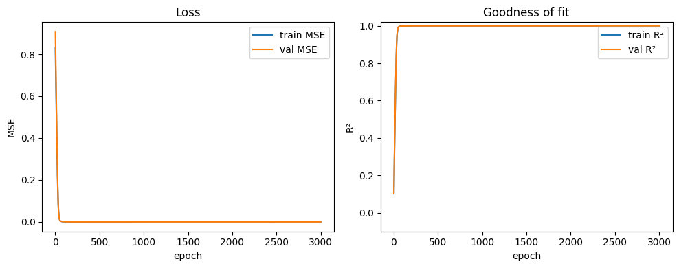

# Vorhersage des Ödometer-Versuchs mit einem neuronalen Netzwerk

**Ziel:**
Entwicklung eines neuronalen Netzes, das auf Basis gegebener Input-Parameter den Elastizitätsmodul $E_s$ im Ödometer-Versuch vorhersagt.

---

## 1. Problemformulierung

Es wird folgende Beziehung zugrunde gelegt:

$$
\dot{\sigma} = C_1\,\sigma_t\,\dot{\varepsilon} + C_2\,\sigma_t\,\left|\dot{\varepsilon}\right|
$$

Diese Gleichung beschreibt die Änderung der Spannung $\dot{\sigma}$ in Abhängigkeit von der aktuellen Spannung $\sigma_t$, der Dehnungsrate $\dot{\varepsilon}$ und den Koeffizienten $C_1, C_2$, die aus dem gewählten Modell abgeleitet sind.

---

## 2. Annahmen / Startwerte

Die Berechnung basiert auf folgenden festen Parametern:

- **Startspannung:** $\sigma_0 = -1{,}00\,\text{kPa}$
- **Porenverhältnis:** $e_0 = 1{,}00$
- **Koeffizienten:**
  - $C_c = 0{,}005$
  - $C_s = 0{,}002$
- **Dehnungsraten:**
  - Stauchungsphase: $\dot{\varepsilon}_c = -0{,}0005$
  - Dehnungsphase: $\dot{\varepsilon}_e = +0{,}0005$

---

## 3. Trainingssetup

- **Input:**
  $\sigma_t$, $\dot{\varepsilon}$
- **Output:**
  Elastizitätsmodul $E_s$

Das neuronale Netz soll aus den aktuellen Zustandsgrößen ($\sigma_t$, $\dot{\varepsilon}$) lernen, in welcher Phase (Kompression vs. Entlastung) sich der Versuch befindet, und darauf basierend $E_s$ schätzen.

---

## 4. Variablendeklaration

| Symbol              | Variable im Code     | Bedeutung |
|---------------------|----------------------|-----------|
| $\sigma_t$          | `sigma_t`            | Aktuelle Spannung zum Zeitpunkt $t$ |
| $\dot{\varepsilon}$ | `delta_epsilon`      | Dehnungsrate; negative Werte: Kompression, positive: Entlastung |
| $\dot\sigma_t$      | `delta_sigma`        | Inkrementelle Änderung der Spannung |
| $E_s$               | `e_s`                | Elastizitätsmodul (Zielgröße) |
| $e_0$               | `e_0`                | Porenverhältniszahl |

---

## 5. Hinweise zur Phase

Die Phase (Stauchung vs. Dehnung) lässt sich über das Vorzeichen von $\dot{\varepsilon}$ ablesen. Alternativ kann explizit ein Zustandsindikator (z. B. one-hot oder diskrete Labels für Belastung/Entlastung) zusätzlich als Feature mitgegeben werden, um dem Modell das Unterscheiden zu erleichtern.


# Data generation


```python
from handler.handleMetaData import *

oedo_model = 1

param_spec = {
    "e0": 1.0,
    "c_c": 0.005,
    "c_s": 0.002,
    "sigma_prime_p": [-.8, -1.5],
    "sigma_max": [-900, -1100],
    "sigma_min": [-90, -110],
    "eps_delta": -0.0005,
    "eps_0": 0,
}

para_data = {
    "n_runs": 30,
    "final_samples": 500,
    "features_keys": ("sigma_0","eps_delta"),
    "target_keys": ("e_s"),
    "seed": 8,
}

tX_raw, tY_raw, info = generate_oedometer_dataset(param_spec,
                                                  n_runs=para_data["n_runs"],
                                                  final_samples=para_data["final_samples"],
                                                  oedo_model=oedo_model,
                                                  seed=para_data["seed"],
                                                  feature_keys=para_data["features_keys"],
                                                  target_key=para_data["target_keys"]
                                                  )

export_dataset_for_html(info, out_dir="oedo-viewer/viewer_data/")

schema = export_oedometer_schema(
    feature_keys=para_data["features_keys"],
    target_key=para_data["target_keys"],
    origin="generate_oedometer_dataset",
    n_runs=para_data["n_runs"],
    final_samples=para_data["final_samples"],
    seed=para_data["seed"],
    path="oedo-viewer/viewer_data/schema.json",
)
```

    [OK] exportiert: oedo-viewer/viewer_data/samples.csv  /  oedo-viewer/viewer_data/runs.csv


```python
tX, tY, meta = compose_dataset_from_files(
    samples_csv="oedo-viewer/viewer_data/samples.csv",
    additional_runs_csv="oedo-viewer/viewer_data/additional_runs.csv",  # oder runs.csv
    schema_json="oedo-viewer/viewer_data/schema.json",
    join_key="global_idx",
    join_how="left",
    # WICHTIG: runs/additional_runs haben keinen Key -> aus Zeilennummer bauen
    additional_index_from_row=True,
    additional_index_start=0,  # stell auf 1, wenn deine Samples 1-basiert zählen
    # samples hat i.d.R. die Spalte; falls nicht:
    samples_index_from_row=False,
    samples_index_start=0,
    # Auswahl (optional)
    include_additional_features=None,  # None => alle F:
    include_additional_targets=None,  # None => alle T:
    # Datenqualität
    dropna=True,
    # Normalisierung
    normalize=True,
    scaler_path="scalers.joblib",
    refit_scaler=True,
    # Export
    additional_samples_out="oedo-viewer/viewer_data/additional_samples.csv",
)
print(tX.shape)
print(tY.shape)
```

    torch.Size([500, 2])
    torch.Size([500, 1])


# Training


```python
from nn_model.model import train_eval_save
model, splits, history_df, test_metrics_df = train_eval_save(
    X=tX, y=tY,
    feature_names=meta["feature_names"],
    additional_samples_csv=meta["additional_samples_path"],
    join_key=meta["join_key"],
    model_name="piecewise_relu",                  # swap to "piecewise_tanh", etc.
    model_kwargs=dict(width=32, depth=2),
    split_ratios=(0.70, 0.15, 0.15),              # set your own ratios
    split_seed=123,
    epochs=3000,
    out_dir="oedo-viewer/viewer_data/"                        # writes 3 CSVs here
)

```

    ep   25 | train MSE 2.3716e-01  RMSE 4.8243e-01  MAE 3.2157e-01  R² 0.7463 | val MSE 2.4669e-01  RMSE 4.9668e-01  MAE 3.2307e-01  R² 0.7568
    ep   50 | train MSE 6.7461e-03  RMSE 8.2031e-02  MAE 6.1121e-02  R² 0.9925 | val MSE 7.3795e-03  RMSE 8.5904e-02  MAE 6.1213e-02  R² 0.9927
    ep   75 | train MSE 4.3265e-04  RMSE 2.0754e-02  MAE 1.3926e-02  R² 0.9995 | val MSE 7.0464e-04  RMSE 2.6545e-02  MAE 1.5063e-02  R² 0.9993
    ep  100 | train MSE 1.5951e-04  RMSE 1.2544e-02  MAE 8.4749e-03  R² 0.9998 | val MSE 3.3034e-04  RMSE 1.8175e-02  MAE 8.7328e-03  R² 0.9997
    ep  125 | train MSE 9.8972e-05  RMSE 9.8899e-03  MAE 7.1543e-03  R² 0.9999 | val MSE 2.2828e-04  RMSE 1.5109e-02  MAE 7.3352e-03  R² 0.9998
    ep  150 | train MSE 7.7648e-05  RMSE 8.7724e-03  MAE 6.5934e-03  R² 0.9999 | val MSE 1.7945e-04  RMSE 1.3396e-02  MAE 6.7918e-03  R² 0.9998
    ep  175 | train MSE 6.6202e-05  RMSE 8.1130e-03  MAE 6.1232e-03  R² 0.9999 | val MSE 1.5451e-04  RMSE 1.2430e-02  MAE 6.4154e-03  R² 0.9998
    ep  200 | train MSE 5.7912e-05  RMSE 7.5913e-03  MAE 5.7610e-03  R² 0.9999 | val MSE 1.3520e-04  RMSE 1.1628e-02  MAE 6.0961e-03  R² 0.9999
    ep  225 | train MSE 5.0951e-05  RMSE 7.1253e-03  MAE 5.4152e-03  R² 0.9999 | val MSE 1.1981e-04  RMSE 1.0946e-02  MAE 5.6452e-03  R² 0.9999
    ep  250 | train MSE 4.3333e-05  RMSE 6.5741e-03  MAE 5.0322e-03  R² 1.0000 | val MSE 1.0644e-04  RMSE 1.0317e-02  MAE 5.3606e-03  R² 0.9999
    ep  275 | train MSE 3.6956e-05  RMSE 6.0724e-03  MAE 4.6730e-03  R² 1.0000 | val MSE 9.5436e-05  RMSE 9.7691e-03  MAE 5.0225e-03  R² 0.9999
    ep  300 | train MSE 3.0866e-05  RMSE 5.5527e-03  MAE 4.2702e-03  R² 1.0000 | val MSE 8.7777e-05  RMSE 9.3689e-03  MAE 4.6991e-03  R² 0.9999
    ep  325 | train MSE 2.6975e-05  RMSE 5.1907e-03  MAE 3.9853e-03  R² 1.0000 | val MSE 8.1220e-05  RMSE 9.0122e-03  MAE 4.5291e-03  R² 0.9999
    ep  350 | train MSE 2.3346e-05  RMSE 4.8315e-03  MAE 3.6854e-03  R² 1.0000 | val MSE 7.5083e-05  RMSE 8.6651e-03  MAE 4.1645e-03  R² 0.9999
    ep  375 | train MSE 2.1114e-05  RMSE 4.5937e-03  MAE 3.4970e-03  R² 1.0000 | val MSE 7.2218e-05  RMSE 8.4981e-03  MAE 4.1678e-03  R² 0.9999
    ep  400 | train MSE 1.8964e-05  RMSE 4.3547e-03  MAE 3.2795e-03  R² 1.0000 | val MSE 6.8939e-05  RMSE 8.3030e-03  MAE 3.9111e-03  R² 0.9999
    ep  425 | train MSE 1.7802e-05  RMSE 4.2192e-03  MAE 3.1275e-03  R² 1.0000 | val MSE 6.8577e-05  RMSE 8.2811e-03  MAE 3.7468e-03  R² 0.9999
    ep  450 | train MSE 1.6936e-05  RMSE 4.1153e-03  MAE 2.9926e-03  R² 1.0000 | val MSE 6.5392e-05  RMSE 8.0866e-03  MAE 3.5755e-03  R² 0.9999
    ep  475 | train MSE 1.5696e-05  RMSE 3.9617e-03  MAE 2.8691e-03  R² 1.0000 | val MSE 6.4981e-05  RMSE 8.0611e-03  MAE 3.5560e-03  R² 0.9999
    ep  500 | train MSE 1.4875e-05  RMSE 3.8554e-03  MAE 2.7799e-03  R² 1.0000 | val MSE 6.6877e-05  RMSE 8.1778e-03  MAE 3.6108e-03  R² 0.9999
    ep  525 | train MSE 1.4138e-05  RMSE 3.7593e-03  MAE 2.6741e-03  R² 1.0000 | val MSE 6.5712e-05  RMSE 8.1063e-03  MAE 3.4198e-03  R² 0.9999
    ep  550 | train MSE 1.4152e-05  RMSE 3.7601e-03  MAE 2.6363e-03  R² 1.0000 | val MSE 6.4829e-05  RMSE 8.0517e-03  MAE 3.3621e-03  R² 0.9999
    ep  575 | train MSE 1.2893e-05  RMSE 3.5905e-03  MAE 2.5174e-03  R² 1.0000 | val MSE 6.2338e-05  RMSE 7.8954e-03  MAE 3.2491e-03  R² 0.9999
    ep  600 | train MSE 1.2379e-05  RMSE 3.5167e-03  MAE 2.4398e-03  R² 1.0000 | val MSE 6.3271e-05  RMSE 7.9543e-03  MAE 3.2854e-03  R² 0.9999
    ep  625 | train MSE 1.2051e-05  RMSE 3.4706e-03  MAE 2.4470e-03  R² 1.0000 | val MSE 6.1523e-05  RMSE 7.8437e-03  MAE 3.2494e-03  R² 0.9999
    ep  650 | train MSE 1.1577e-05  RMSE 3.4001e-03  MAE 2.3125e-03  R² 1.0000 | val MSE 6.3203e-05  RMSE 7.9500e-03  MAE 3.1419e-03  R² 0.9999
    ep  675 | train MSE 1.1196e-05  RMSE 3.3440e-03  MAE 2.2985e-03  R² 1.0000 | val MSE 6.2451e-05  RMSE 7.9026e-03  MAE 3.1408e-03  R² 0.9999
    ep  700 | train MSE 1.0801e-05  RMSE 3.2853e-03  MAE 2.2106e-03  R² 1.0000 | val MSE 6.0741e-05  RMSE 7.7936e-03  MAE 3.0200e-03  R² 0.9999
    ep  725 | train MSE 1.0493e-05  RMSE 3.2376e-03  MAE 2.1408e-03  R² 1.0000 | val MSE 6.0835e-05  RMSE 7.7997e-03  MAE 2.9888e-03  R² 0.9999
    ep  750 | train MSE 1.0691e-05  RMSE 3.2677e-03  MAE 2.2202e-03  R² 1.0000 | val MSE 5.9626e-05  RMSE 7.7218e-03  MAE 2.9392e-03  R² 0.9999
    ep  775 | train MSE 1.0080e-05  RMSE 3.1743e-03  MAE 2.0892e-03  R² 1.0000 | val MSE 5.9332e-05  RMSE 7.7027e-03  MAE 2.8670e-03  R² 0.9999
    ep  800 | train MSE 9.8088e-06  RMSE 3.1308e-03  MAE 2.0515e-03  R² 1.0000 | val MSE 5.8942e-05  RMSE 7.6774e-03  MAE 2.8839e-03  R² 0.9999
    ep  825 | train MSE 9.7184e-06  RMSE 3.1127e-03  MAE 2.0460e-03  R² 1.0000 | val MSE 6.0304e-05  RMSE 7.7656e-03  MAE 3.0071e-03  R² 0.9999
    ep  850 | train MSE 9.4182e-06  RMSE 3.0639e-03  MAE 2.0037e-03  R² 1.0000 | val MSE 5.9900e-05  RMSE 7.7395e-03  MAE 2.9310e-03  R² 0.9999
    ep  875 | train MSE 9.0833e-06  RMSE 3.0104e-03  MAE 1.9243e-03  R² 1.0000 | val MSE 5.8193e-05  RMSE 7.6284e-03  MAE 2.7700e-03  R² 0.9999
    ep  900 | train MSE 9.0145e-06  RMSE 2.9959e-03  MAE 1.9200e-03  R² 1.0000 | val MSE 6.1205e-05  RMSE 7.8233e-03  MAE 2.8092e-03  R² 0.9999
    ep  925 | train MSE 8.9698e-06  RMSE 2.9864e-03  MAE 1.8939e-03  R² 1.0000 | val MSE 6.4209e-05  RMSE 8.0130e-03  MAE 2.7978e-03  R² 0.9999
    ep  950 | train MSE 9.1356e-06  RMSE 3.0178e-03  MAE 1.9846e-03  R² 1.0000 | val MSE 6.4820e-05  RMSE 8.0511e-03  MAE 2.6919e-03  R² 0.9999
    ep  975 | train MSE 8.4232e-06  RMSE 2.8997e-03  MAE 1.8146e-03  R² 1.0000 | val MSE 6.0619e-05  RMSE 7.7858e-03  MAE 2.6056e-03  R² 0.9999
    ep 1000 | train MSE 8.2827e-06  RMSE 2.8727e-03  MAE 1.8333e-03  R² 1.0000 | val MSE 6.1499e-05  RMSE 7.8421e-03  MAE 2.6521e-03  R² 0.9999
    ep 1025 | train MSE 8.1582e-06  RMSE 2.8521e-03  MAE 1.7877e-03  R² 1.0000 | val MSE 6.1275e-05  RMSE 7.8278e-03  MAE 2.6379e-03  R² 0.9999
    ep 1050 | train MSE 7.9868e-06  RMSE 2.8219e-03  MAE 1.7390e-03  R² 1.0000 | val MSE 6.1639e-05  RMSE 7.8511e-03  MAE 2.4875e-03  R² 0.9999
    ep 1075 | train MSE 7.8557e-06  RMSE 2.8006e-03  MAE 1.7490e-03  R² 1.0000 | val MSE 5.9493e-05  RMSE 7.7132e-03  MAE 2.4489e-03  R² 0.9999
    ep 1100 | train MSE 7.6630e-06  RMSE 2.7613e-03  MAE 1.6852e-03  R² 1.0000 | val MSE 6.1809e-05  RMSE 7.8619e-03  MAE 2.4158e-03  R² 0.9999
    ep 1125 | train MSE 7.4642e-06  RMSE 2.7278e-03  MAE 1.6131e-03  R² 1.0000 | val MSE 5.9577e-05  RMSE 7.7186e-03  MAE 2.3128e-03  R² 0.9999
    ep 1150 | train MSE 7.5228e-06  RMSE 2.7413e-03  MAE 1.6180e-03  R² 1.0000 | val MSE 5.5812e-05  RMSE 7.4707e-03  MAE 2.2567e-03  R² 0.9999
    ep 1175 | train MSE 7.2664e-06  RMSE 2.6938e-03  MAE 1.6012e-03  R² 1.0000 | val MSE 5.6891e-05  RMSE 7.5426e-03  MAE 2.2379e-03  R² 0.9999
    ep 1200 | train MSE 7.0629e-06  RMSE 2.6513e-03  MAE 1.5674e-03  R² 1.0000 | val MSE 5.7776e-05  RMSE 7.6011e-03  MAE 2.2475e-03  R² 0.9999
    ep 1225 | train MSE 7.2924e-06  RMSE 2.6938e-03  MAE 1.5975e-03  R² 1.0000 | val MSE 5.7721e-05  RMSE 7.5975e-03  MAE 2.1856e-03  R² 0.9999
    ep 1250 | train MSE 7.5908e-06  RMSE 2.7456e-03  MAE 1.6893e-03  R² 1.0000 | val MSE 6.1978e-05  RMSE 7.8726e-03  MAE 2.3462e-03  R² 0.9999
    ep 1275 | train MSE 7.0623e-06  RMSE 2.6448e-03  MAE 1.5320e-03  R² 1.0000 | val MSE 6.1824e-05  RMSE 7.8628e-03  MAE 2.1604e-03  R² 0.9999
    ep 1300 | train MSE 6.8177e-06  RMSE 2.6032e-03  MAE 1.5216e-03  R² 1.0000 | val MSE 5.7661e-05  RMSE 7.5935e-03  MAE 2.1370e-03  R² 0.9999
    ep 1325 | train MSE 7.0134e-06  RMSE 2.6411e-03  MAE 1.6185e-03  R² 1.0000 | val MSE 5.6931e-05  RMSE 7.5452e-03  MAE 2.1308e-03  R² 0.9999
    ep 1350 | train MSE 7.1325e-06  RMSE 2.6627e-03  MAE 1.6841e-03  R² 1.0000 | val MSE 5.8686e-05  RMSE 7.6607e-03  MAE 2.2272e-03  R² 0.9999
    ep 1375 | train MSE 6.9464e-06  RMSE 2.6295e-03  MAE 1.6324e-03  R² 1.0000 | val MSE 5.8443e-05  RMSE 7.6448e-03  MAE 2.1539e-03  R² 0.9999
    ep 1400 | train MSE 6.4724e-06  RMSE 2.5347e-03  MAE 1.4721e-03  R² 1.0000 | val MSE 5.8324e-05  RMSE 7.6370e-03  MAE 2.0238e-03  R² 0.9999
    ep 1425 | train MSE 6.4061e-06  RMSE 2.5219e-03  MAE 1.4579e-03  R² 1.0000 | val MSE 5.7837e-05  RMSE 7.6051e-03  MAE 2.0236e-03  R² 0.9999
    ep 1450 | train MSE 6.2752e-06  RMSE 2.4974e-03  MAE 1.4344e-03  R² 1.0000 | val MSE 5.5466e-05  RMSE 7.4476e-03  MAE 1.9878e-03  R² 0.9999
    ep 1475 | train MSE 6.1396e-06  RMSE 2.4666e-03  MAE 1.4593e-03  R² 1.0000 | val MSE 5.6365e-05  RMSE 7.5077e-03  MAE 2.0134e-03  R² 0.9999
    ep 1500 | train MSE 5.9931e-06  RMSE 2.4377e-03  MAE 1.4138e-03  R² 1.0000 | val MSE 5.6144e-05  RMSE 7.4929e-03  MAE 1.9465e-03  R² 0.9999
    ep 1525 | train MSE 6.4027e-06  RMSE 2.5206e-03  MAE 1.5954e-03  R² 1.0000 | val MSE 5.6288e-05  RMSE 7.5025e-03  MAE 2.0694e-03  R² 0.9999
    ep 1550 | train MSE 5.8005e-06  RMSE 2.3979e-03  MAE 1.3855e-03  R² 1.0000 | val MSE 5.7002e-05  RMSE 7.5499e-03  MAE 1.9055e-03  R² 0.9999
    ep 1575 | train MSE 5.8480e-06  RMSE 2.4076e-03  MAE 1.4424e-03  R² 1.0000 | val MSE 5.7313e-05  RMSE 7.5705e-03  MAE 1.9147e-03  R² 0.9999
    ep 1600 | train MSE 6.0579e-06  RMSE 2.4546e-03  MAE 1.5264e-03  R² 1.0000 | val MSE 5.4647e-05  RMSE 7.3924e-03  MAE 2.0028e-03  R² 0.9999
    ep 1625 | train MSE 5.5897e-06  RMSE 2.3513e-03  MAE 1.4100e-03  R² 1.0000 | val MSE 5.5340e-05  RMSE 7.4391e-03  MAE 1.9137e-03  R² 0.9999
    ep 1650 | train MSE 5.8238e-06  RMSE 2.4028e-03  MAE 1.4647e-03  R² 1.0000 | val MSE 5.2571e-05  RMSE 7.2506e-03  MAE 1.9832e-03  R² 0.9999
    ep 1675 | train MSE 5.7171e-06  RMSE 2.3836e-03  MAE 1.4865e-03  R² 1.0000 | val MSE 5.4114e-05  RMSE 7.3562e-03  MAE 1.9551e-03  R² 0.9999
    ep 1700 | train MSE 5.9292e-06  RMSE 2.4251e-03  MAE 1.6101e-03  R² 1.0000 | val MSE 5.3550e-05  RMSE 7.3178e-03  MAE 2.0659e-03  R² 0.9999
    ep 1725 | train MSE 5.1395e-06  RMSE 2.2573e-03  MAE 1.2865e-03  R² 1.0000 | val MSE 5.3217e-05  RMSE 7.2950e-03  MAE 1.8534e-03  R² 0.9999
    ep 1750 | train MSE 5.5069e-06  RMSE 2.3359e-03  MAE 1.4894e-03  R² 1.0000 | val MSE 5.4065e-05  RMSE 7.3529e-03  MAE 1.9755e-03  R² 0.9999
    ep 1775 | train MSE 6.6191e-06  RMSE 2.5661e-03  MAE 1.5872e-03  R² 1.0000 | val MSE 5.0939e-05  RMSE 7.1371e-03  MAE 2.0802e-03  R² 0.9999
    ep 1800 | train MSE 5.9502e-06  RMSE 2.4262e-03  MAE 1.5454e-03  R² 1.0000 | val MSE 5.2875e-05  RMSE 7.2715e-03  MAE 2.0641e-03  R² 0.9999
    ep 1825 | train MSE 5.3526e-06  RMSE 2.2935e-03  MAE 1.3100e-03  R² 1.0000 | val MSE 5.4266e-05  RMSE 7.3665e-03  MAE 1.9667e-03  R² 0.9999
    ep 1850 | train MSE 4.6176e-06  RMSE 2.1427e-03  MAE 1.1941e-03  R² 1.0000 | val MSE 4.8313e-05  RMSE 6.9508e-03  MAE 1.7437e-03  R² 1.0000
    ep 1875 | train MSE 4.6313e-06  RMSE 2.1428e-03  MAE 1.2669e-03  R² 1.0000 | val MSE 4.9922e-05  RMSE 7.0656e-03  MAE 1.8311e-03  R² 1.0000
    ep 1900 | train MSE 5.1364e-06  RMSE 2.2656e-03  MAE 1.3793e-03  R² 1.0000 | val MSE 4.7087e-05  RMSE 6.8620e-03  MAE 1.8026e-03  R² 1.0000
    ep 1925 | train MSE 4.8797e-06  RMSE 2.2034e-03  MAE 1.4074e-03  R² 1.0000 | val MSE 4.8022e-05  RMSE 6.9298e-03  MAE 1.9100e-03  R² 1.0000
    ep 1950 | train MSE 4.5871e-06  RMSE 2.1293e-03  MAE 1.2939e-03  R² 1.0000 | val MSE 4.8288e-05  RMSE 6.9489e-03  MAE 1.8393e-03  R² 1.0000
    ep 1975 | train MSE 6.4019e-06  RMSE 2.5270e-03  MAE 1.6065e-03  R² 1.0000 | val MSE 5.0290e-05  RMSE 7.0915e-03  MAE 1.9702e-03  R² 1.0000
    ep 2000 | train MSE 3.9530e-06  RMSE 1.9821e-03  MAE 1.1207e-03  R² 1.0000 | val MSE 4.6517e-05  RMSE 6.8204e-03  MAE 1.6674e-03  R² 1.0000
    ep 2025 | train MSE 4.0516e-06  RMSE 2.0058e-03  MAE 1.2230e-03  R² 1.0000 | val MSE 4.6673e-05  RMSE 6.8318e-03  MAE 1.7307e-03  R² 1.0000
    ep 2050 | train MSE 4.5390e-06  RMSE 2.1245e-03  MAE 1.3550e-03  R² 1.0000 | val MSE 4.3709e-05  RMSE 6.6113e-03  MAE 1.7656e-03  R² 1.0000
    ep 2075 | train MSE 7.0737e-06  RMSE 2.6311e-03  MAE 1.6989e-03  R² 1.0000 | val MSE 5.3216e-05  RMSE 7.2949e-03  MAE 2.2656e-03  R² 0.9999
    ep 2100 | train MSE 3.7876e-06  RMSE 1.9353e-03  MAE 1.1938e-03  R² 1.0000 | val MSE 4.4776e-05  RMSE 6.6915e-03  MAE 1.6822e-03  R² 1.0000
    ep 2125 | train MSE 3.4172e-06  RMSE 1.8416e-03  MAE 1.1010e-03  R² 1.0000 | val MSE 4.4271e-05  RMSE 6.6536e-03  MAE 1.6324e-03  R² 1.0000
    ep 2150 | train MSE 3.3737e-06  RMSE 1.8313e-03  MAE 1.0997e-03  R² 1.0000 | val MSE 4.2361e-05  RMSE 6.5085e-03  MAE 1.6008e-03  R² 1.0000
    ep 2175 | train MSE 3.7110e-06  RMSE 1.9207e-03  MAE 1.2047e-03  R² 1.0000 | val MSE 4.5504e-05  RMSE 6.7456e-03  MAE 1.6596e-03  R² 1.0000
    ep 2200 | train MSE 3.3636e-06  RMSE 1.8310e-03  MAE 1.2206e-03  R² 1.0000 | val MSE 4.1030e-05  RMSE 6.4055e-03  MAE 1.6662e-03  R² 1.0000
    ep 2225 | train MSE 6.6585e-06  RMSE 2.5678e-03  MAE 1.7084e-03  R² 1.0000 | val MSE 4.5119e-05  RMSE 6.7170e-03  MAE 2.0404e-03  R² 1.0000
    ep 2250 | train MSE 3.2653e-06  RMSE 1.8022e-03  MAE 1.0976e-03  R² 1.0000 | val MSE 4.2092e-05  RMSE 6.4878e-03  MAE 1.5476e-03  R² 1.0000
    ep 2275 | train MSE 3.2667e-06  RMSE 1.8019e-03  MAE 1.1333e-03  R² 1.0000 | val MSE 4.1009e-05  RMSE 6.4038e-03  MAE 1.6676e-03  R² 1.0000
    ep 2300 | train MSE 4.0700e-06  RMSE 2.0017e-03  MAE 1.1942e-03  R² 1.0000 | val MSE 4.5598e-05  RMSE 6.7527e-03  MAE 1.7272e-03  R² 1.0000
    ep 2325 | train MSE 3.8230e-06  RMSE 1.9520e-03  MAE 1.1811e-03  R² 1.0000 | val MSE 3.9033e-05  RMSE 6.2477e-03  MAE 1.6561e-03  R² 1.0000
    ep 2350 | train MSE 2.8860e-06  RMSE 1.6952e-03  MAE 9.0961e-04  R² 1.0000 | val MSE 3.9626e-05  RMSE 6.2949e-03  MAE 1.4534e-03  R² 1.0000
    ep 2375 | train MSE 3.0885e-06  RMSE 1.7476e-03  MAE 9.9002e-04  R² 1.0000 | val MSE 4.2584e-05  RMSE 6.5256e-03  MAE 1.5694e-03  R² 1.0000
    ep 2400 | train MSE 3.5955e-06  RMSE 1.8895e-03  MAE 1.1528e-03  R² 1.0000 | val MSE 3.8502e-05  RMSE 6.2050e-03  MAE 1.5279e-03  R² 1.0000
    ep 2425 | train MSE 2.9924e-06  RMSE 1.7225e-03  MAE 1.0602e-03  R² 1.0000 | val MSE 4.0611e-05  RMSE 6.3727e-03  MAE 1.4997e-03  R² 1.0000
    ep 2450 | train MSE 6.2293e-06  RMSE 2.4744e-03  MAE 1.4515e-03  R² 1.0000 | val MSE 4.4381e-05  RMSE 6.6619e-03  MAE 1.9697e-03  R² 1.0000
    ep 2475 | train MSE 5.3321e-06  RMSE 2.2923e-03  MAE 1.3511e-03  R² 1.0000 | val MSE 4.0897e-05  RMSE 6.3951e-03  MAE 1.8215e-03  R² 1.0000
    ep 2500 | train MSE 2.7451e-06  RMSE 1.6521e-03  MAE 8.9521e-04  R² 1.0000 | val MSE 3.8462e-05  RMSE 6.2018e-03  MAE 1.3523e-03  R² 1.0000
    ep 2525 | train MSE 2.9372e-06  RMSE 1.7118e-03  MAE 8.1455e-04  R² 1.0000 | val MSE 3.4836e-05  RMSE 5.9022e-03  MAE 1.3299e-03  R² 1.0000
    ep 2550 | train MSE 2.7161e-06  RMSE 1.6298e-03  MAE 9.1039e-04  R² 1.0000 | val MSE 4.2425e-05  RMSE 6.5135e-03  MAE 1.5306e-03  R² 1.0000
    ep 2575 | train MSE 2.3299e-06  RMSE 1.5188e-03  MAE 7.8923e-04  R² 1.0000 | val MSE 3.7688e-05  RMSE 6.1391e-03  MAE 1.3522e-03  R² 1.0000
    ep 2600 | train MSE 3.1907e-06  RMSE 1.7779e-03  MAE 1.0462e-03  R² 1.0000 | val MSE 3.9027e-05  RMSE 6.2471e-03  MAE 1.5305e-03  R² 1.0000
    ep 2625 | train MSE 3.5278e-06  RMSE 1.8769e-03  MAE 1.0586e-03  R² 1.0000 | val MSE 3.2617e-05  RMSE 5.7112e-03  MAE 1.4430e-03  R² 1.0000
    ep 2650 | train MSE 4.5947e-06  RMSE 2.1381e-03  MAE 1.2601e-03  R² 1.0000 | val MSE 3.8469e-05  RMSE 6.2023e-03  MAE 1.6602e-03  R² 1.0000
    ep 2675 | train MSE 2.0893e-06  RMSE 1.4392e-03  MAE 7.3123e-04  R² 1.0000 | val MSE 3.6491e-05  RMSE 6.0408e-03  MAE 1.2701e-03  R² 1.0000
    ep 2700 | train MSE 4.1989e-06  RMSE 2.0489e-03  MAE 1.2504e-03  R² 1.0000 | val MSE 3.6440e-05  RMSE 6.0366e-03  MAE 1.7067e-03  R² 1.0000
    ep 2725 | train MSE 7.3779e-06  RMSE 2.7089e-03  MAE 1.6768e-03  R² 1.0000 | val MSE 3.6645e-05  RMSE 6.0535e-03  MAE 2.0456e-03  R² 1.0000
    ep 2750 | train MSE 2.5874e-06  RMSE 1.5995e-03  MAE 9.5221e-04  R² 1.0000 | val MSE 3.8272e-05  RMSE 6.1865e-03  MAE 1.4095e-03  R² 1.0000
    ep 2775 | train MSE 3.6489e-06  RMSE 1.8967e-03  MAE 1.1354e-03  R² 1.0000 | val MSE 3.9714e-05  RMSE 6.3019e-03  MAE 1.5247e-03  R² 1.0000
    ep 2800 | train MSE 3.2611e-06  RMSE 1.8037e-03  MAE 1.0402e-03  R² 1.0000 | val MSE 3.3200e-05  RMSE 5.7619e-03  MAE 1.4610e-03  R² 1.0000
    ep 2825 | train MSE 4.1089e-06  RMSE 2.0114e-03  MAE 1.4029e-03  R² 1.0000 | val MSE 4.1632e-05  RMSE 6.4523e-03  MAE 1.7595e-03  R² 1.0000
    ep 2850 | train MSE 4.2550e-06  RMSE 2.0396e-03  MAE 1.1274e-03  R² 1.0000 | val MSE 4.3400e-05  RMSE 6.5879e-03  MAE 1.6308e-03  R² 1.0000
    ep 2875 | train MSE 2.8160e-06  RMSE 1.6703e-03  MAE 1.2525e-03  R² 1.0000 | val MSE 3.7914e-05  RMSE 6.1574e-03  MAE 1.7971e-03  R² 1.0000
    ep 2900 | train MSE 1.3653e-05  RMSE 3.6853e-03  MAE 2.3854e-03  R² 1.0000 | val MSE 3.8044e-05  RMSE 6.1679e-03  MAE 2.6699e-03  R² 1.0000
    ep 2925 | train MSE 2.0087e-06  RMSE 1.4103e-03  MAE 8.7592e-04  R² 1.0000 | val MSE 3.5019e-05  RMSE 5.9177e-03  MAE 1.3410e-03  R² 1.0000
    ep 2950 | train MSE 5.0537e-06  RMSE 2.2192e-03  MAE 1.2525e-03  R² 1.0000 | val MSE 4.3712e-05  RMSE 6.6115e-03  MAE 1.7412e-03  R² 1.0000
    ep 2975 | train MSE 6.3593e-06  RMSE 2.5105e-03  MAE 1.4607e-03  R² 1.0000 | val MSE 3.6383e-05  RMSE 6.0318e-03  MAE 1.8708e-03  R² 1.0000
    ep 3000 | train MSE 4.6903e-06  RMSE 2.1434e-03  MAE 1.5555e-03  R² 1.0000 | val MSE 4.4990e-05  RMSE 6.7075e-03  MAE 1.9961e-03  R² 1.0000


    

    


# Metrics


```python
import json
from pathlib import Path
from typing import Optional, Sequence, Union, Dict, Any, List

import numpy as np
import pandas as pd
import torch


@torch.no_grad()
def predict_additional_runs_to_csv(
        model: torch.nn.Module,
        samples_csv: Union[str, Path],
        additional_runs_csv: Union[str, Path],
        schema_json: Union[str, Path],
        meta: Dict[str, Any],
        *,
        out_csv: Union[str, Path] = "predictions_additional.csv",
        join_key: str = "global_idx",
        additional_index_start: int = 0,  # 0 => nullbasiert; ggf. auf 1 stellen
        include_additional_features: Optional[Sequence[str]] = None,  # None => alle F:
        include_true_T_columns: bool = True,  # echte T:-Spalten mit in die CSV schreiben (falls vorhanden)
        device: Optional[Union[str, torch.device]] = None,
) -> pd.DataFrame:
    # --- Laden ---
    samples_csv = Path(samples_csv)
    additional_runs_csv = Path(additional_runs_csv)
    schema_json = Path(schema_json)
    out_csv = Path(out_csv)

    df_s = pd.read_csv(samples_csv)
    df_a = pd.read_csv(additional_runs_csv)
    with open(schema_json, "r", encoding="utf-8") as f:
        schema = json.load(f)

    # --- join_key in additional erzeugen (autoritative Indexierung für OUT) ---
    if join_key not in df_a.columns:
        df_a = df_a.copy()
        df_a[join_key] = np.arange(additional_index_start,
                                   additional_index_start + len(df_a),
                                   dtype=int)

    # --- Trainings-Featureliste rekonstruieren ---
    X_cols_needed: List[str] = list(meta.get("feature_names", []))
    if not X_cols_needed:
        raise ValueError(
            "meta['feature_names'] fehlt – ohne diese Information können die Features nicht gebaut werden.")

    # --- Verfügbare F:/T: Spalten in additional_runs ---
    f_cols_available = [c for c in df_a.columns if isinstance(c, str) and c.startswith("F:")]
    t_cols_available = [c for c in df_a.columns if isinstance(c, str) and c.startswith("T:")]
    if include_additional_features is not None:
        missing = set(include_additional_features) - set(f_cols_available)
        if missing:
            raise KeyError(f"Gewünschte zusätzliche Feature-Spalten fehlen in additional_runs.csv: {sorted(missing)}")
        f_cols_available = list(include_additional_features)

    # --- Basis: additional_runs ist die Quelle. Nur wenn dort Features fehlen, selektiv aus samples mergen. ---
    df_m = df_a.copy()

    # Welche benötigten Features fehlen noch?
    missing_in_a = [c for c in X_cols_needed if c not in df_m.columns]
    if missing_in_a:
        # nur dann mergen, wenn samples den join_key + diese Spalten wirklich hat
        if join_key not in df_s.columns:
            raise KeyError(
                f"Folgende Modell-Features fehlen in additional_runs und können nicht aus samples gemappt werden, "
                f"weil '{join_key}' in samples.csv fehlt: {missing_in_a}"
            )
        missing_in_s = [c for c in missing_in_a if c not in df_s.columns]
        if missing_in_s:
            raise KeyError(
                f"Diese Modell-Features fehlen sowohl in additional_runs.csv als auch in samples.csv: {missing_in_s}"
            )
        df_m = pd.merge(
            df_m,
            df_s[[join_key] + missing_in_a],
            on=join_key,
            how="left"
        )

    # Final prüfen: Alle X-Spalten müssen jetzt vorhanden sein
    really_missing = [c for c in X_cols_needed if c not in df_m.columns]
    if really_missing:
        raise KeyError(
            f"Folgende für das Modell benötigte Feature-Spalten fehlen nach Zusammenführung: {really_missing}")

    # --- Numerik erzwingen (robuster gegen Strings/Whitespace) ---
    for c in X_cols_needed:
        df_m[c] = pd.to_numeric(df_m[c], errors="coerce")

    # --- Validitätsmaske: nur vollständige Zeilen in die Inferenz geben ---
    X_all = df_m[X_cols_needed].to_numpy(dtype=np.float32)
    valid_mask = ~np.any(np.isnan(X_all), axis=1)
    n, d = X_all.shape

    # Ergebniscontainer (NaN vorbelegen)
    # Zieldimension später nach erstem Forward definiert
    preds = None

    # --- Optional Normalisierung ---
    x_scaler = meta.get("x_scaler", None)
    if x_scaler is not None:
        X_all_scaled = np.empty_like(X_all)
        # nur valide Zeilen transformieren; invalide bleiben NaN
        X_all_scaled[:] = np.nan
        if valid_mask.any():
            X_all_scaled[valid_mask] = x_scaler.transform(X_all[valid_mask]).astype(np.float32)
        X_use = X_all_scaled
    else:
        X_use = X_all

    # --- Inferenz (nur für valide Zeilen) ---
    if valid_mask.any():
        X_valid = X_use[valid_mask]
        tX = torch.tensor(X_valid, dtype=torch.float32)
        model_device = next(model.parameters()).device
        if device is not None:
            tX = tX.to(device)
        else:
            tX = tX.to(model_device)

        model.eval()
        y_pred = model(tX)
        if isinstance(y_pred, torch.Tensor):
            y_pred_np = y_pred.detach().cpu().numpy()
        else:
            y_pred_np = np.asarray(y_pred, dtype=np.float32)

        # 2D-Form erzwingen
        if y_pred_np.ndim == 1:
            y_pred_np = y_pred_np.reshape(-1, 1)

        # --- ggf. Denormalisierung ---
        y_scaler = meta.get("y_scaler", None)
        if y_scaler is not None and y_pred_np.size > 0:
            y_pred_np = y_scaler.inverse_transform(y_pred_np)

        # In Gesamtcontainer eintragen
        T = y_pred_np.shape[1]
        preds = np.full((n, T), np.nan, dtype=np.float32)
        preds[valid_mask, :] = y_pred_np
    else:
        # keine validen Zeilen
        preds = np.full((n, 0), np.float32)

    # --- Zielspaltennamen bestimmen ---
    target_names = meta.get("target_names", None)
    if not target_names:
        # aus schema ableiten oder generisch
        if "target_keys" in schema and isinstance(schema["target_keys"], list) and preds.shape[1] == len(
                schema["target_keys"]):
            target_names = list(schema["target_keys"])
        elif "target_key" in schema and isinstance(schema["target_key"], str) and preds.shape[1] in (0, 1):
            target_names = [schema["target_key"]] if preds.shape[1] == 1 else []
        else:
            target_names = [f"target_{i}" for i in range(preds.shape[1])]

    # --- Output-Frame bauen ---
    out = pd.DataFrame({join_key: df_m[join_key].to_numpy()})

    if include_true_T_columns and t_cols_available:
        for col in t_cols_available:
            if col in df_m.columns:
                out[col] = df_m[col].to_numpy()

    for j, tname in enumerate(target_names):
        colname = f"pred_{tname}"
        if preds.shape[1] == 0:
            out[colname] = np.nan
        else:
            out[colname] = preds[:, j]

    # Stabil sortieren (falls join_key künstlich gesetzt wurde)
    out.sort_values(by=join_key, inplace=True, kind="mergesort")
    out.to_csv(out_csv, index=False)
    return out
```


```python
# Nach dem Training:
pred_df = predict_additional_runs_to_csv(
    model=model,
    samples_csv="oedo-viewer/viewer_data/samples.csv",
    additional_runs_csv="oedo-viewer/viewer_data/additional_runs.csv",  # oder runs.csv
    schema_json="oedo-viewer/viewer_data/schema.json",
    meta=meta,  # von compose_dataset_from_files beim Training
    out_csv="oedo-viewer/viewer_data/predictions_additional.csv",
    join_key="global_idx",
    additional_index_start=0,  # 0-basiert; auf 1 setzen, wenn du 1-basiert zählen willst
    include_additional_features=None,  # optional subset der F:-Spalten
    include_true_T_columns=True,  # echte T:-Spalten zum Vergleichen mitspeichern
    device=None  # None => nimmt automatisch das Model-Device
)

print("Saved:", "oedo-viewer/viewer_data/predictions_additional.csv")
```

    Saved: oedo-viewer/viewer_data/predictions_additional.csv


```python
from handler.handleData import *

# Run mit deinen Dateien
root_dir="oedo-viewer/viewer_data/"
original_pred_path = "predictions_additional.csv"
left_path = "runs.csv"
right_path = "predictions_additional_processed.csv"
process_pred_3stage(
    oedo_model= 1,
    root_dir= "oedo-viewer/viewer_data/",
    preds_path= "predictions_additional.csv",
    runs_path= "runs.csv",
    merged_path= "predictions_additional_processed.csv",
    propagated_path = "predictions_additional_processed_propagated.csv",
    split_path= "split_assignments.csv",   # in same folder
    model = model,   # PyTorch model that predicts Es from [σ0, Δε]
    x_scaler = meta.get("x_scaler", None),           # sklearn-like scaler for X (optional)
    y_scaler = meta.get("y_scaler", None),           # sklearn-like scaler for y (optional, inverse_transform)
    device = None,
    propagated_recursive_path = "predictions_additional_processed_propagated_recursive.csv",
)
merged_df = merge_csv_simple(root_dir + left_path,root_dir + right_path, right_start_col=0)
merged_csv_path = Path(root_dir + "runs_final.csv")

merged_df.to_csv(merged_csv_path, index=False)
```
