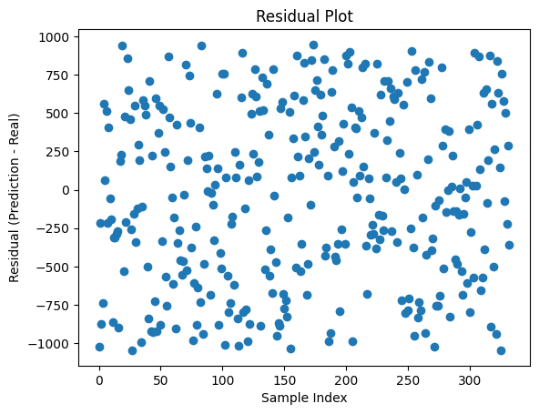
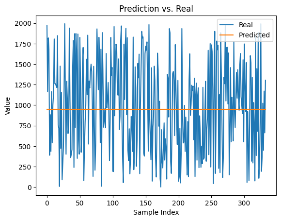

# LSTM Model for Oedometer Data Prediction
This code implements an LSTM model to predict future values based on time-series data for a geotechnical engineering problem. The goal is to predict delta_sigma values from the given inputs sigma_t (stress) and delta_epsilon (strain). Below are the code blocks with explanations.


---


## Importing Necessary Libraries


```python
import torch
import torch.nn as nn
import torch.optim as optim
from torch.utils.data import DataLoader, TensorDataset
from IPython.display import Markdown, display
import pandas as pd
import random as r
from sys import exit
import numpy as np
import matplotlib.pyplot as plt
```

This section imports all the necessary libraries, including PyTorch, pandas, and matplotlib, which are used for neural network operations, data handling, and visualization.


---


## Setting Parameters


```python
# Debugger: Aktiviert
debug_mode = True
normalize = True
```

Here, we define two key parameters:

*   `debug_mode`: Used to toggle debugging functionalities.
*   `normalize`: A flag to enable or disable data normalization.


---


## Preloaded Helper Functions


```python
def dict_to_markdown_table(data: dict, title: str = "Datenübersicht", include_index: bool = True, round_digits: int = 4):
    """
    Wandelt ein Dictionary mit Listenwerten in eine Markdown-Tabelle für Jupyter Notebooks um.

    - Schlüssel werden als Header genutzt
    - Erste Spalte ist ein Index, falls `include_index=True`
    - Einzelwerte werden als separate Tabelle unterhalb dargestellt
    - Zahlenwerte werden auf eine einstellbare Anzahl an Nachkommastellen gerundet

    :param data: Dictionary mit Key-Value-Paaren
    :param title: Überschrift für die Tabelle
    :param include_index: Falls True, wird eine Index-Spalte erstellt
    :param round_digits: Anzahl der Nachkommastellen, auf die Werte gerundet werden sollen
    :return: Markdown-String zur Anzeige in Jupyter
    """

    # Hilfsfunktion zum Runden von Zahlen
    def round_value(val):
        if isinstance(val, (int, float)):
            return round(val, round_digits)
        return val

    # Listen und einzelne Werte trennen
    list_data = {k: v for k, v in data.items() if isinstance(v, list)}
    single_values = {k: v for k, v in data.items() if not isinstance(v, list)}

    # Falls es Listen gibt, erstelle eine Tabelle mit Index
    if list_data:
        max_len = max(len(v) for v in list_data.values())  # Längste Liste bestimmen

        # Tabellenkopf
        md_table = f"### {title}\n\n"
        md_table += "| " + ("Index | " if include_index else "") + " | ".join(list_data.keys()) + " |\n"
        md_table += "|-" + ("-|" if include_index else "") + "-|".join(["-" * len(k) for k in list_data.keys()]) + "-|\n"

        # Datenzeilen
        for i in range(max_len):
            row = [str(i)] if include_index else []  # Index hinzufügen (optional)
            for key in list_data:
                if i < len(list_data[key]):
                    row.append(str(round_value(list_data[key][i])))
                else:
                    row.append("")  # Leere Werte für ungleich lange Listen
            md_table += "| " + " | ".join(row) + " |\n"

    else:
        md_table = ""

    # Einzelwerte als extra Tabelle darstellen
    if single_values:
        md_table += "\n\n#### Einzelwerte\n\n"
        md_table += "| " + " | ".join(single_values.keys()) + " |\n"
        md_table += "|-" + "-|".join(["-" * len(k) for k in single_values.keys()]) + "-|\n"
        md_table += "| " + " | ".join(map(lambda v: str(round_value(v)), single_values.values())) + " |\n"

    return Markdown(md_table)


def display_data_loss_table(data_dict, delta_sigma_pred, max_i):
    """
    Erstellt eine Markdown-Tabelle zur übersichtlichen Darstellung von Datenverlust.

    Unterstützt sowohl Python-Listen als auch NumPy-Arrays.

    :param data_dict: Dictionary mit `sigma_t` und `delta_sigma` (Listen oder np.arrays)
    :param delta_sigma_pred: Vorhergesagte Werte für `delta_sigma` (Liste oder np.array)
    :param max_i: Anzahl der Werte, die in der Tabelle angezeigt werden sollen
    """

    # Sicherstellen, dass `sigma_t` und `delta_sigma` existieren
    if "sigma_t" not in data_dict or "delta_sigma" not in data_dict or delta_sigma_pred is None:
        print("Fehler: `data_dict` oder `delta_sigma_pred` ist nicht korrekt definiert!")
        return

    # Konvertiere alle Werte zu Listen (falls sie NumPy-Arrays sind)
    def to_list(arr):
        return arr.tolist() if isinstance(arr, np.ndarray) else arr

    total_epsilon = to_list(data_dict["total_epsilon"])
    delta_epsilon = to_list(data_dict["delta_epsilon"])
    sigma_t = to_list(data_dict["sigma_t"])
    delta_sigma_true = to_list(data_dict["delta_sigma"])
    delta_sigma_pred = to_list(delta_sigma_pred)  # Falls `delta_sigma_pred` ein 2D-Array ist

    # Überprüfen, ob die Längen konsistent sind
    min_len = min(len(total_epsilon), len(sigma_t), len(delta_epsilon), len(delta_sigma_true), len(delta_sigma_pred), max_i)

    # Erstelle eine Tabelle für die übersichtliche Darstellung
    data_loss_table = {
        "total_epsilon" : list(total_epsilon[:min_len]),
        "delta_epsilon" : list(delta_epsilon[:min_len]),
        "sigma_t" : list(sigma_t[:min_len]),
        "True delta_sigma": list(delta_sigma_true[:min_len]),
        "Predicted delta_sigma": list(delta_sigma_pred[:min_len]),
        "Test-Loss (True - Predicted)": list(np.round(np.array(delta_sigma_true[:min_len]) - np.array(delta_sigma_pred[:min_len]), 5))
    }

    # Markdown-Tabelle für bessere Darstellung in Jupyter
    display(dict_to_markdown_table(data_loss_table, title=f"Data-Loss bis sigma_{min_len-1}", include_index=True))
```

This function converts a dictionary of lists into a Markdown table for easy visualization in Jupyter Notebooks. It helps in presenting data in a clear and structured way during debugging and analysis.


---


## Check for use of CONDA if available


```python
use_cuda = torch.cuda.is_available()
device = torch.device("cuda:0" if use_cuda else "cpu")

if device.type == 'cpu':
    device_num = 0
    print('No GPU available.')
else:
    device_num = torch.cuda.device_count()
    print('Device:', device, '-- Number of devices:', device_num)
```

    No GPU available.
    


---


## Defining the Oedometer Class


```python
import random

class Oedometer:
    def __init__(self, e_0: float = 1.00, C_c: float = 0.005, delta_epsilon: float = 0.0005,
                 sigma_t: float = 1.00, max_n: int = 50, rand_epsilon:bool=False, **kwargs):
        self.max_n = max_n

        # Standardwerte als Listen setzen
        self.e_0 = [e_0]
        self.C_c = [C_c]
        self.sigma_t = [sigma_t]
        self.delta_epsilon = []
        self.total_epsilon = [0]

        # Initiale Listen für Berechnungen
        self.sigma_t = [sigma_t]
        self.delta_sigma = []
        self.e_s = []
        self.delta_epsilon = [delta_epsilon]

        # Dynamische Zuweisung von kwargs, falls vorhanden
        for key, value in kwargs.items():
            if hasattr(self, key):  # Nur vorhandene Attribute setzen
                setattr(self, key, [value])

        # Berechnungen durchführen
        self.__calc_sigma_t_p1()

        # Listenlängen anpassen
        self.__adjust_list_lengths()
        self.__calc_total_epsilon()

    def __adjust_list_lengths(self):
        """ Passt ALLE Listen-Attribute an `max_n` an. """
        attributes = ['e_0', 'C_c', 'delta_epsilon', 'sigma_t', 'sigma_t', 'delta_sigma', 'e_s']
        for attr in attributes:
            value_list = getattr(self, attr, [])
            current_length = len(value_list)

            if current_length > self.max_n:
                setattr(self, attr, value_list[:self.max_n])  # Kürzen
            elif current_length < self.max_n:
                setattr(self, attr, value_list + [value_list[-1] if value_list else 0] * (self.max_n - current_length))  # Auffüllen

    def __calc_total_epsilon(self):
        for i in range(len(self.delta_epsilon)-1):
            self.total_epsilon.append(self.total_epsilon[i] + self.delta_epsilon[i])

    def __calc_e_s(self, sigma_t):
        """ Berechnet `e_s` aus `sigma_t`. """
        e_s = (1 + self.e_0[0]) / self.C_c[0] * sigma_t
        self.e_s.append(e_s)
        return e_s

    def __calc_sigma_t_p1(self):
        """ Berechnet `sigma_t` und `delta_sigma` für die nächsten Schritte. """
        for i in range(self.max_n):  # -1, weil sigma_t bereits gesetzt ist
            e_s = self.__calc_e_s(self.sigma_t[i])
            delta_sigma = e_s * self.delta_epsilon[0]
            sigma = self.sigma_t[i] + delta_sigma
            self.sigma_t.append(sigma)
            self.delta_sigma.append(delta_sigma)

def plot_input():
    # Plot
    plt.figure(figsize=(10, 5))
    plt.plot(data_dict_raw['sigma_t'], data_dict_raw['delta_sigma'], marker='o', linestyle='-', label='Sigma_0 = 1')

    # Formatting
    plt.xlabel('sigma_t')
    plt.ylabel('delta_simga')
    plt.title('Sigma_0 in relation to Sigma_1')
    plt.xticks(rotation=45)
    plt.grid(True)
    plt.legend()
    plt.tight_layout()
    plt.show()
```

The `Oedometer` class simulates the calculation of `delta_sigma` values based on various material parameters such as `sigma_t` (stress), `delta_epsilon` (strain), and others. The class provides methods to adjust list lengths and perform calculations that simulate geotechnical behavior.


---


## Data Generation and Processing


```python
i = 1000

oedo_para = {
    'max_n': 1,
    'e_0': 1.0,
    'C_c': 0.005,
    'total_epsilon': 0,
    'e_s': 400.0
}

# Vorbereitung Tensoren
sigma_t = np.random.choice(range(1, 10000), size=i, replace=False)
delta_sigma = []
delta_epsilon = np.repeat(np.array(np.float64(0.0005)), i)
# delta_epsilon = np.random.uniform(0.0001, 0.001, size=i)

for i in range(i):
    oedo_para['sigma_t'] = sigma_t[i]
    oedo_para['delta_epsilon'] = delta_epsilon[i]
    oedo = Oedometer(**oedo_para)
    delta_sigma.append(round(oedo.delta_sigma[0], 2))


print('Anzahl Elemente delta_epsilon: ' + str(len(delta_epsilon)))
print('Anzahl Elemente sigma_t: ' + str(len(sigma_t)))
print('Anzahl Elemente delta_sigma: ' + str(len(delta_sigma)))
```

    Anzahl Elemente delta_epsilon: 1000
    Anzahl Elemente sigma_t: 1000
    Anzahl Elemente delta_sigma: 1000
    

This part generates synthetic data for `sigma_t` (stress) and `delta_epsilon` (strain) to simulate the inputs. The class Oedometer is used to compute `delta_sigma` values from the generated data.

---


## Visualizing the Data


```python
data = {
    'sigma_t' : sigma_t.tolist(),
    'delta_sigma' : delta_sigma,
    'delta_epsilon' : delta_epsilon.tolist()
}

df = pd.DataFrame(data)
# Markdown Headlin 'RawData'
display(Markdown('### RawData'))
display(Markdown(df.to_markdown()))
```


### RawData


|     |   sigma_t |   delta_sigma |   delta_epsilon |
|----:|----------:|--------------:|----------------:|
|   0 |      3282 |         656.4 |          0.0005 |
|   1 |      8810 |        1762   |          0.0005 |
|   2 |      8740 |        1748   |          0.0005 |
|   3 |      5028 |        1005.6 |          0.0005 |
|   4 |      2579 |         515.8 |          0.0005 |
|   5 |      8737 |        1747.4 |          0.0005 |
|   6 |      2115 |         423   |          0.0005 |
|   7 |      4948 |         989.6 |          0.0005 |
|   8 |      9404 |        1880.8 |          0.0005 |
|   9 |      7575 |        1515   |          0.0005 |
|  10 |      1824 |         364.8 |          0.0005 |
|  11 |      6581 |        1316.2 |          0.0005 |
|  12 |      2811 |         562.2 |          0.0005 |
|  13 |      6559 |        1311.8 |          0.0005 |
|  14 |      5359 |        1071.8 |          0.0005 |
|  15 |      8077 |        1615.4 |          0.0005 |
|  16 |      4161 |         832.2 |          0.0005 |
|  17 |       661 |         132.2 |          0.0005 |
|  18 |      1283 |         256.6 |          0.0005 |
|  19 |      7921 |        1584.2 |          0.0005 |
|  20 |      6729 |        1345.8 |          0.0005 |
|  21 |      7703 |        1540.6 |          0.0005 |
|  22 |      5172 |        1034.4 |          0.0005 |
|  23 |      6017 |        1203.4 |          0.0005 |
|  24 |      5690 |        1138   |          0.0005 |
|  25 |      5369 |        1073.8 |          0.0005 |
|  26 |      6756 |        1351.2 |          0.0005 |
|  27 |        53 |          10.6 |          0.0005 |
|  28 |      3713 |         742.6 |          0.0005 |
|  29 |      9445 |        1889   |          0.0005 |
|  30 |      5335 |        1067   |          0.0005 |
|  31 |      9512 |        1902.4 |          0.0005 |
|  32 |      6421 |        1284.2 |          0.0005 |
|  33 |      7887 |        1577.4 |          0.0005 |
|  34 |      9912 |        1982.4 |          0.0005 |
|  35 |      3348 |         669.6 |          0.0005 |
|  36 |      3806 |         761.2 |          0.0005 |
|  37 |      1512 |         302.4 |          0.0005 |
|  38 |      9071 |        1814.2 |          0.0005 |
|  39 |      3034 |         606.8 |          0.0005 |
|  40 |      6991 |        1398.2 |          0.0005 |
|  41 |      9637 |        1927.4 |          0.0005 |
|  42 |      3062 |         612.4 |          0.0005 |
|  43 |      1633 |         326.6 |          0.0005 |
|  44 |       662 |         132.4 |          0.0005 |
|  45 |       586 |         117.2 |          0.0005 |
|  46 |      6552 |        1310.4 |          0.0005 |
|  47 |      9548 |        1909.6 |          0.0005 |
|  48 |      9153 |        1830.6 |          0.0005 |
|  49 |      6540 |        1308   |          0.0005 |
|  50 |      3128 |         625.6 |          0.0005 |
|  51 |      2641 |         528.2 |          0.0005 |
|  52 |      7967 |        1593.4 |          0.0005 |
|  53 |      3890 |         778   |          0.0005 |
|  54 |      7419 |        1483.8 |          0.0005 |
|  55 |       389 |          77.8 |          0.0005 |
|  56 |      6681 |        1336.2 |          0.0005 |
|  57 |      5157 |        1031.4 |          0.0005 |
|  58 |      5503 |        1100.6 |          0.0005 |
|  59 |      6527 |        1305.4 |          0.0005 |
|  60 |      8821 |        1764.2 |          0.0005 |
|  61 |      6308 |        1261.6 |          0.0005 |
|  62 |      3186 |         637.2 |          0.0005 |
|  63 |       632 |         126.4 |          0.0005 |
|  64 |      7416 |        1483.2 |          0.0005 |
|  65 |      4504 |         900.8 |          0.0005 |
|  66 |      2329 |         465.8 |          0.0005 |
|  67 |      8232 |        1646.4 |          0.0005 |
|  68 |      1254 |         250.8 |          0.0005 |
|  69 |      8545 |        1709   |          0.0005 |
|  70 |      4147 |         829.4 |          0.0005 |
|  71 |      3512 |         702.4 |          0.0005 |
|  72 |      3340 |         668   |          0.0005 |
|  73 |       999 |         199.8 |          0.0005 |
|  74 |      8106 |        1621.2 |          0.0005 |
|  75 |      6693 |        1338.6 |          0.0005 |
|  76 |      4154 |         830.8 |          0.0005 |
|  77 |      7984 |        1596.8 |          0.0005 |
|  78 |      2117 |         423.4 |          0.0005 |
|  79 |       493 |          98.6 |          0.0005 |
|  80 |      7232 |        1446.4 |          0.0005 |
|  81 |      8883 |        1776.6 |          0.0005 |
|  82 |      7517 |        1503.4 |          0.0005 |
|  83 |      1559 |         311.8 |          0.0005 |
|  84 |      4843 |         968.6 |          0.0005 |
|  85 |      5361 |        1072.2 |          0.0005 |
|  86 |      3317 |         663.4 |          0.0005 |
|  87 |      7108 |        1421.6 |          0.0005 |
|  88 |      5367 |        1073.4 |          0.0005 |
|  89 |      5967 |        1193.4 |          0.0005 |
|  90 |      2886 |         577.2 |          0.0005 |
|  91 |       853 |         170.6 |          0.0005 |
|  92 |       671 |         134.2 |          0.0005 |
|  93 |      9750 |        1950   |          0.0005 |
|  94 |      3333 |         666.6 |          0.0005 |
|  95 |      2026 |         405.2 |          0.0005 |
|  96 |      4681 |         936.2 |          0.0005 |
|  97 |      4827 |         965.4 |          0.0005 |
|  98 |      7523 |        1504.6 |          0.0005 |
|  99 |      6744 |        1348.8 |          0.0005 |
| 100 |       983 |         196.6 |          0.0005 |
| 101 |      7383 |        1476.6 |          0.0005 |
| 102 |      1251 |         250.2 |          0.0005 |
| 103 |      2792 |         558.4 |          0.0005 |
| 104 |      8569 |        1713.8 |          0.0005 |
| 105 |      8803 |        1760.6 |          0.0005 |
| 106 |      7979 |        1595.8 |          0.0005 |
| 107 |      2663 |         532.6 |          0.0005 |
| 108 |      9223 |        1844.6 |          0.0005 |
| 109 |      6121 |        1224.2 |          0.0005 |
| 110 |      7492 |        1498.4 |          0.0005 |
| 111 |      2787 |         557.4 |          0.0005 |
| 112 |      4042 |         808.4 |          0.0005 |
| 113 |      7274 |        1454.8 |          0.0005 |
| 114 |      9508 |        1901.6 |          0.0005 |
| 115 |      9809 |        1961.8 |          0.0005 |
| 116 |      8929 |        1785.8 |          0.0005 |
| 117 |      3086 |         617.2 |          0.0005 |
| 118 |      1979 |         395.8 |          0.0005 |
| 119 |      4737 |         947.4 |          0.0005 |
| 120 |      5562 |        1112.4 |          0.0005 |
| 121 |      4157 |         831.4 |          0.0005 |
| 122 |      2984 |         596.8 |          0.0005 |
| 123 |      6356 |        1271.2 |          0.0005 |
| 124 |      3463 |         692.6 |          0.0005 |
| 125 |       310 |          62   |          0.0005 |
| 126 |      6479 |        1295.8 |          0.0005 |
| 127 |      1537 |         307.4 |          0.0005 |
| 128 |       331 |          66.2 |          0.0005 |
| 129 |      2411 |         482.2 |          0.0005 |
| 130 |      2443 |         488.6 |          0.0005 |
| 131 |      2586 |         517.2 |          0.0005 |
| 132 |      9142 |        1828.4 |          0.0005 |
| 133 |      1359 |         271.8 |          0.0005 |
| 134 |      6167 |        1233.4 |          0.0005 |
| 135 |      6100 |        1220   |          0.0005 |
| 136 |      7814 |        1562.8 |          0.0005 |
| 137 |      4367 |         873.4 |          0.0005 |
| 138 |       548 |         109.6 |          0.0005 |
| 139 |      8093 |        1618.6 |          0.0005 |
| 140 |      8152 |        1630.4 |          0.0005 |
| 141 |      4422 |         884.4 |          0.0005 |
| 142 |      1727 |         345.4 |          0.0005 |
| 143 |       364 |          72.8 |          0.0005 |
| 144 |      1621 |         324.2 |          0.0005 |
| 145 |      7892 |        1578.4 |          0.0005 |
| 146 |      8428 |        1685.6 |          0.0005 |
| 147 |      1255 |         251   |          0.0005 |
| 148 |       622 |         124.4 |          0.0005 |
| 149 |      4255 |         851   |          0.0005 |
| 150 |      5977 |        1195.4 |          0.0005 |
| 151 |      4839 |         967.8 |          0.0005 |
| 152 |      7022 |        1404.4 |          0.0005 |
| 153 |      7647 |        1529.4 |          0.0005 |
| 154 |      6227 |        1245.4 |          0.0005 |
| 155 |      8007 |        1601.4 |          0.0005 |
| 156 |      6009 |        1201.8 |          0.0005 |
| 157 |      3894 |         778.8 |          0.0005 |
| 158 |      2462 |         492.4 |          0.0005 |
| 159 |      7696 |        1539.2 |          0.0005 |
| 160 |      9943 |        1988.6 |          0.0005 |
| 161 |      9811 |        1962.2 |          0.0005 |
| 162 |      7912 |        1582.4 |          0.0005 |
| 163 |      9929 |        1985.8 |          0.0005 |
| 164 |      8679 |        1735.8 |          0.0005 |
| 165 |      8117 |        1623.4 |          0.0005 |
| 166 |      9068 |        1813.6 |          0.0005 |
| 167 |       630 |         126   |          0.0005 |
| 168 |       430 |          86   |          0.0005 |
| 169 |      2935 |         587   |          0.0005 |
| 170 |       449 |          89.8 |          0.0005 |
| 171 |      2966 |         593.2 |          0.0005 |
| 172 |      2582 |         516.4 |          0.0005 |
| 173 |       420 |          84   |          0.0005 |
| 174 |      1656 |         331.2 |          0.0005 |
| 175 |      8102 |        1620.4 |          0.0005 |
| 176 |      5479 |        1095.8 |          0.0005 |
| 177 |       549 |         109.8 |          0.0005 |
| 178 |      8788 |        1757.6 |          0.0005 |
| 179 |      9268 |        1853.6 |          0.0005 |
| 180 |      6261 |        1252.2 |          0.0005 |
| 181 |      5462 |        1092.4 |          0.0005 |
| 182 |      4318 |         863.6 |          0.0005 |
| 183 |      6747 |        1349.4 |          0.0005 |
| 184 |      6733 |        1346.6 |          0.0005 |
| 185 |      3994 |         798.8 |          0.0005 |
| 186 |      7808 |        1561.6 |          0.0005 |
| 187 |      6283 |        1256.6 |          0.0005 |
| 188 |      1820 |         364   |          0.0005 |
| 189 |      8766 |        1753.2 |          0.0005 |
| 190 |       902 |         180.4 |          0.0005 |
| 191 |      1752 |         350.4 |          0.0005 |
| 192 |      7507 |        1501.4 |          0.0005 |
| 193 |      9684 |        1936.8 |          0.0005 |
| 194 |      5132 |        1026.4 |          0.0005 |
| 195 |       678 |         135.6 |          0.0005 |
| 196 |      4315 |         863   |          0.0005 |
| 197 |      9148 |        1829.6 |          0.0005 |
| 198 |      6638 |        1327.6 |          0.0005 |
| 199 |      9872 |        1974.4 |          0.0005 |
| 200 |      8588 |        1717.6 |          0.0005 |
| 201 |      4625 |         925   |          0.0005 |
| 202 |      7201 |        1440.2 |          0.0005 |
| 203 |      5882 |        1176.4 |          0.0005 |
| 204 |      3327 |         665.4 |          0.0005 |
| 205 |      4714 |         942.8 |          0.0005 |
| 206 |      8302 |        1660.4 |          0.0005 |
| 207 |      7319 |        1463.8 |          0.0005 |
| 208 |      2279 |         455.8 |          0.0005 |
| 209 |      3769 |         753.8 |          0.0005 |
| 210 |      8047 |        1609.4 |          0.0005 |
| 211 |       215 |          43   |          0.0005 |
| 212 |      1421 |         284.2 |          0.0005 |
| 213 |       532 |         106.4 |          0.0005 |
| 214 |      4645 |         929   |          0.0005 |
| 215 |      7958 |        1591.6 |          0.0005 |
| 216 |      7630 |        1526   |          0.0005 |
| 217 |      3292 |         658.4 |          0.0005 |
| 218 |      3509 |         701.8 |          0.0005 |
| 219 |      8767 |        1753.4 |          0.0005 |
| 220 |      7442 |        1488.4 |          0.0005 |
| 221 |      2757 |         551.4 |          0.0005 |
| 222 |       786 |         157.2 |          0.0005 |
| 223 |      4330 |         866   |          0.0005 |
| 224 |       254 |          50.8 |          0.0005 |
| 225 |      4160 |         832   |          0.0005 |
| 226 |      5695 |        1139   |          0.0005 |
| 227 |      4641 |         928.2 |          0.0005 |
| 228 |      8801 |        1760.2 |          0.0005 |
| 229 |      8182 |        1636.4 |          0.0005 |
| 230 |      5019 |        1003.8 |          0.0005 |
| 231 |      4305 |         861   |          0.0005 |
| 232 |      2181 |         436.2 |          0.0005 |
| 233 |       381 |          76.2 |          0.0005 |
| 234 |      4020 |         804   |          0.0005 |
| 235 |      4170 |         834   |          0.0005 |
| 236 |        12 |           2.4 |          0.0005 |
| 237 |      9413 |        1882.6 |          0.0005 |
| 238 |      3457 |         691.4 |          0.0005 |
| 239 |      7940 |        1588   |          0.0005 |
| 240 |      2002 |         400.4 |          0.0005 |
| 241 |      2123 |         424.6 |          0.0005 |
| 242 |      2086 |         417.2 |          0.0005 |
| 243 |      5003 |        1000.6 |          0.0005 |
| 244 |      4192 |         838.4 |          0.0005 |
| 245 |      2639 |         527.8 |          0.0005 |
| 246 |      8617 |        1723.4 |          0.0005 |
| 247 |      8108 |        1621.6 |          0.0005 |
| 248 |      2393 |         478.6 |          0.0005 |
| 249 |      9257 |        1851.4 |          0.0005 |
| 250 |      2513 |         502.6 |          0.0005 |
| 251 |      8156 |        1631.2 |          0.0005 |
| 252 |      5597 |        1119.4 |          0.0005 |
| 253 |      9822 |        1964.4 |          0.0005 |
| 254 |      9260 |        1852   |          0.0005 |
| 255 |      7728 |        1545.6 |          0.0005 |
| 256 |      3225 |         645   |          0.0005 |
| 257 |      3476 |         695.2 |          0.0005 |
| 258 |      5190 |        1038   |          0.0005 |
| 259 |      9641 |        1928.2 |          0.0005 |
| 260 |      8197 |        1639.4 |          0.0005 |
| 261 |      2445 |         489   |          0.0005 |
| 262 |      9954 |        1990.8 |          0.0005 |
| 263 |      6335 |        1267   |          0.0005 |
| 264 |      5907 |        1181.4 |          0.0005 |
| 265 |      3864 |         772.8 |          0.0005 |
| 266 |      3978 |         795.6 |          0.0005 |
| 267 |      8404 |        1680.8 |          0.0005 |
| 268 |      9299 |        1859.8 |          0.0005 |
| 269 |      4199 |         839.8 |          0.0005 |
| 270 |      8844 |        1768.8 |          0.0005 |
| 271 |      4413 |         882.6 |          0.0005 |
| 272 |       591 |         118.2 |          0.0005 |
| 273 |      5780 |        1156   |          0.0005 |
| 274 |      4108 |         821.6 |          0.0005 |
| 275 |       417 |          83.4 |          0.0005 |
| 276 |      2857 |         571.4 |          0.0005 |
| 277 |      6461 |        1292.2 |          0.0005 |
| 278 |      1761 |         352.2 |          0.0005 |
| 279 |      2014 |         402.8 |          0.0005 |
| 280 |      3341 |         668.2 |          0.0005 |
| 281 |      7037 |        1407.4 |          0.0005 |
| 282 |      5574 |        1114.8 |          0.0005 |
| 283 |      6930 |        1386   |          0.0005 |
| 284 |      5814 |        1162.8 |          0.0005 |
| 285 |      5061 |        1012.2 |          0.0005 |
| 286 |      4225 |         845   |          0.0005 |
| 287 |      7213 |        1442.6 |          0.0005 |
| 288 |       266 |          53.2 |          0.0005 |
| 289 |      2400 |         480   |          0.0005 |
| 290 |       508 |         101.6 |          0.0005 |
| 291 |      4844 |         968.8 |          0.0005 |
| 292 |      6598 |        1319.6 |          0.0005 |
| 293 |      8245 |        1649   |          0.0005 |
| 294 |      9110 |        1822   |          0.0005 |
| 295 |      4723 |         944.6 |          0.0005 |
| 296 |      4458 |         891.6 |          0.0005 |
| 297 |      8852 |        1770.4 |          0.0005 |
| 298 |      3660 |         732   |          0.0005 |
| 299 |      5819 |        1163.8 |          0.0005 |
| 300 |      6359 |        1271.8 |          0.0005 |
| 301 |      4733 |         946.6 |          0.0005 |
| 302 |      6079 |        1215.8 |          0.0005 |
| 303 |      3384 |         676.8 |          0.0005 |
| 304 |      1086 |         217.2 |          0.0005 |
| 305 |      8512 |        1702.4 |          0.0005 |
| 306 |      1245 |         249   |          0.0005 |
| 307 |      1084 |         216.8 |          0.0005 |
| 308 |      7881 |        1576.2 |          0.0005 |
| 309 |      8219 |        1643.8 |          0.0005 |
| 310 |      1587 |         317.4 |          0.0005 |
| 311 |      7597 |        1519.4 |          0.0005 |
| 312 |      5339 |        1067.8 |          0.0005 |
| 313 |      6945 |        1389   |          0.0005 |
| 314 |       993 |         198.6 |          0.0005 |
| 315 |      9497 |        1899.4 |          0.0005 |
| 316 |      8744 |        1748.8 |          0.0005 |
| 317 |      1471 |         294.2 |          0.0005 |
| 318 |      6591 |        1318.2 |          0.0005 |
| 319 |      9540 |        1908   |          0.0005 |
| 320 |      7334 |        1466.8 |          0.0005 |
| 321 |      6761 |        1352.2 |          0.0005 |
| 322 |      2971 |         594.2 |          0.0005 |
| 323 |      9759 |        1951.8 |          0.0005 |
| 324 |       248 |          49.6 |          0.0005 |
| 325 |      4834 |         966.8 |          0.0005 |
| 326 |      9749 |        1949.8 |          0.0005 |
| 327 |      3079 |         615.8 |          0.0005 |
| 328 |      2262 |         452.4 |          0.0005 |
| 329 |      4073 |         814.6 |          0.0005 |
| 330 |      9274 |        1854.8 |          0.0005 |
| 331 |      5227 |        1045.4 |          0.0005 |
| 332 |      3633 |         726.6 |          0.0005 |
| 333 |      9897 |        1979.4 |          0.0005 |
| 334 |      7731 |        1546.2 |          0.0005 |
| 335 |      3553 |         710.6 |          0.0005 |
| 336 |      6764 |        1352.8 |          0.0005 |
| 337 |       554 |         110.8 |          0.0005 |
| 338 |       494 |          98.8 |          0.0005 |
| 339 |      9525 |        1905   |          0.0005 |
| 340 |      9036 |        1807.2 |          0.0005 |
| 341 |      8265 |        1653   |          0.0005 |
| 342 |       896 |         179.2 |          0.0005 |
| 343 |       979 |         195.8 |          0.0005 |
| 344 |      9186 |        1837.2 |          0.0005 |
| 345 |       726 |         145.2 |          0.0005 |
| 346 |      4065 |         813   |          0.0005 |
| 347 |      1888 |         377.6 |          0.0005 |
| 348 |      4151 |         830.2 |          0.0005 |
| 349 |      7403 |        1480.6 |          0.0005 |
| 350 |      9575 |        1915   |          0.0005 |
| 351 |      6494 |        1298.8 |          0.0005 |
| 352 |      8596 |        1719.2 |          0.0005 |
| 353 |      9632 |        1926.4 |          0.0005 |
| 354 |      3182 |         636.4 |          0.0005 |
| 355 |      5356 |        1071.2 |          0.0005 |
| 356 |      1054 |         210.8 |          0.0005 |
| 357 |      3112 |         622.4 |          0.0005 |
| 358 |      6771 |        1354.2 |          0.0005 |
| 359 |      5585 |        1117   |          0.0005 |
| 360 |       157 |          31.4 |          0.0005 |
| 361 |      8642 |        1728.4 |          0.0005 |
| 362 |      1433 |         286.6 |          0.0005 |
| 363 |      6861 |        1372.2 |          0.0005 |
| 364 |      4775 |         955   |          0.0005 |
| 365 |      6832 |        1366.4 |          0.0005 |
| 366 |         7 |           1.4 |          0.0005 |
| 367 |      9292 |        1858.4 |          0.0005 |
| 368 |      3321 |         664.2 |          0.0005 |
| 369 |      4613 |         922.6 |          0.0005 |
| 370 |      7217 |        1443.4 |          0.0005 |
| 371 |      3684 |         736.8 |          0.0005 |
| 372 |      1392 |         278.4 |          0.0005 |
| 373 |      6059 |        1211.8 |          0.0005 |
| 374 |      9276 |        1855.2 |          0.0005 |
| 375 |      2229 |         445.8 |          0.0005 |
| 376 |      7063 |        1412.6 |          0.0005 |
| 377 |      6541 |        1308.2 |          0.0005 |
| 378 |      8281 |        1656.2 |          0.0005 |
| 379 |      9808 |        1961.6 |          0.0005 |
| 380 |      8235 |        1647   |          0.0005 |
| 381 |      7496 |        1499.2 |          0.0005 |
| 382 |      7293 |        1458.6 |          0.0005 |
| 383 |      7926 |        1585.2 |          0.0005 |
| 384 |      5986 |        1197.2 |          0.0005 |
| 385 |      6775 |        1355   |          0.0005 |
| 386 |      6706 |        1341.2 |          0.0005 |
| 387 |        55 |          11   |          0.0005 |
| 388 |      3779 |         755.8 |          0.0005 |
| 389 |      7945 |        1589   |          0.0005 |
| 390 |      4234 |         846.8 |          0.0005 |
| 391 |      6537 |        1307.4 |          0.0005 |
| 392 |      2237 |         447.4 |          0.0005 |
| 393 |      3124 |         624.8 |          0.0005 |
| 394 |      2565 |         513   |          0.0005 |
| 395 |      3197 |         639.4 |          0.0005 |
| 396 |      9399 |        1879.8 |          0.0005 |
| 397 |      5282 |        1056.4 |          0.0005 |
| 398 |       312 |          62.4 |          0.0005 |
| 399 |      5671 |        1134.2 |          0.0005 |
| 400 |      1112 |         222.4 |          0.0005 |
| 401 |      9315 |        1863   |          0.0005 |
| 402 |      5288 |        1057.6 |          0.0005 |
| 403 |       930 |         186   |          0.0005 |
| 404 |      7350 |        1470   |          0.0005 |
| 405 |      1690 |         338   |          0.0005 |
| 406 |      1924 |         384.8 |          0.0005 |
| 407 |      7411 |        1482.2 |          0.0005 |
| 408 |       772 |         154.4 |          0.0005 |
| 409 |      3883 |         776.6 |          0.0005 |
| 410 |      2426 |         485.2 |          0.0005 |
| 411 |      2760 |         552   |          0.0005 |
| 412 |      1566 |         313.2 |          0.0005 |
| 413 |      8651 |        1730.2 |          0.0005 |
| 414 |      1016 |         203.2 |          0.0005 |
| 415 |      1966 |         393.2 |          0.0005 |
| 416 |      4119 |         823.8 |          0.0005 |
| 417 |      9164 |        1832.8 |          0.0005 |
| 418 |      1802 |         360.4 |          0.0005 |
| 419 |      4409 |         881.8 |          0.0005 |
| 420 |      4890 |         978   |          0.0005 |
| 421 |      3672 |         734.4 |          0.0005 |
| 422 |      4863 |         972.6 |          0.0005 |
| 423 |      6685 |        1337   |          0.0005 |
| 424 |      2573 |         514.6 |          0.0005 |
| 425 |      2759 |         551.8 |          0.0005 |
| 426 |      8327 |        1665.4 |          0.0005 |
| 427 |      9634 |        1926.8 |          0.0005 |
| 428 |      6191 |        1238.2 |          0.0005 |
| 429 |      1895 |         379   |          0.0005 |
| 430 |      5097 |        1019.4 |          0.0005 |
| 431 |      9672 |        1934.4 |          0.0005 |
| 432 |      8239 |        1647.8 |          0.0005 |
| 433 |      3369 |         673.8 |          0.0005 |
| 434 |       863 |         172.6 |          0.0005 |
| 435 |      9378 |        1875.6 |          0.0005 |
| 436 |      7658 |        1531.6 |          0.0005 |
| 437 |      6568 |        1313.6 |          0.0005 |
| 438 |      9161 |        1832.2 |          0.0005 |
| 439 |      7784 |        1556.8 |          0.0005 |
| 440 |      6613 |        1322.6 |          0.0005 |
| 441 |      4283 |         856.6 |          0.0005 |
| 442 |      2533 |         506.6 |          0.0005 |
| 443 |      9151 |        1830.2 |          0.0005 |
| 444 |      3792 |         758.4 |          0.0005 |
| 445 |      7941 |        1588.2 |          0.0005 |
| 446 |      1344 |         268.8 |          0.0005 |
| 447 |      7043 |        1408.6 |          0.0005 |
| 448 |      3127 |         625.4 |          0.0005 |
| 449 |      9230 |        1846   |          0.0005 |
| 450 |      7333 |        1466.6 |          0.0005 |
| 451 |         5 |           1   |          0.0005 |
| 452 |      3688 |         737.6 |          0.0005 |
| 453 |      5958 |        1191.6 |          0.0005 |
| 454 |      1842 |         368.4 |          0.0005 |
| 455 |      4685 |         937   |          0.0005 |
| 456 |      3305 |         661   |          0.0005 |
| 457 |      3821 |         764.2 |          0.0005 |
| 458 |      1360 |         272   |          0.0005 |
| 459 |      2008 |         401.6 |          0.0005 |
| 460 |      2834 |         566.8 |          0.0005 |
| 461 |      5247 |        1049.4 |          0.0005 |
| 462 |      1658 |         331.6 |          0.0005 |
| 463 |      6298 |        1259.6 |          0.0005 |
| 464 |      3593 |         718.6 |          0.0005 |
| 465 |      9004 |        1800.8 |          0.0005 |
| 466 |      1209 |         241.8 |          0.0005 |
| 467 |      9958 |        1991.6 |          0.0005 |
| 468 |      3207 |         641.4 |          0.0005 |
| 469 |       709 |         141.8 |          0.0005 |
| 470 |      4868 |         973.6 |          0.0005 |
| 471 |      4053 |         810.6 |          0.0005 |
| 472 |      9239 |        1847.8 |          0.0005 |
| 473 |      5447 |        1089.4 |          0.0005 |
| 474 |      3350 |         670   |          0.0005 |
| 475 |        70 |          14   |          0.0005 |
| 476 |       607 |         121.4 |          0.0005 |
| 477 |      2544 |         508.8 |          0.0005 |
| 478 |      3380 |         676   |          0.0005 |
| 479 |      9177 |        1835.4 |          0.0005 |
| 480 |      2679 |         535.8 |          0.0005 |
| 481 |      5704 |        1140.8 |          0.0005 |
| 482 |      1249 |         249.8 |          0.0005 |
| 483 |      5216 |        1043.2 |          0.0005 |
| 484 |      4502 |         900.4 |          0.0005 |
| 485 |      6682 |        1336.4 |          0.0005 |
| 486 |      7151 |        1430.2 |          0.0005 |
| 487 |      8935 |        1787   |          0.0005 |
| 488 |      5834 |        1166.8 |          0.0005 |
| 489 |      7609 |        1521.8 |          0.0005 |
| 490 |      9034 |        1806.8 |          0.0005 |
| 491 |      8829 |        1765.8 |          0.0005 |
| 492 |       599 |         119.8 |          0.0005 |
| 493 |      7722 |        1544.4 |          0.0005 |
| 494 |       891 |         178.2 |          0.0005 |
| 495 |      6572 |        1314.4 |          0.0005 |
| 496 |      2301 |         460.2 |          0.0005 |
| 497 |      4953 |         990.6 |          0.0005 |
| 498 |      6939 |        1387.8 |          0.0005 |
| 499 |      2345 |         469   |          0.0005 |
| 500 |      2102 |         420.4 |          0.0005 |
| 501 |      2980 |         596   |          0.0005 |
| 502 |      5516 |        1103.2 |          0.0005 |
| 503 |       383 |          76.6 |          0.0005 |
| 504 |       413 |          82.6 |          0.0005 |
| 505 |      6531 |        1306.2 |          0.0005 |
| 506 |      6436 |        1287.2 |          0.0005 |
| 507 |      9280 |        1856   |          0.0005 |
| 508 |      8732 |        1746.4 |          0.0005 |
| 509 |      7535 |        1507   |          0.0005 |
| 510 |      4182 |         836.4 |          0.0005 |
| 511 |      3722 |         744.4 |          0.0005 |
| 512 |      4846 |         969.2 |          0.0005 |
| 513 |      4223 |         844.6 |          0.0005 |
| 514 |      8453 |        1690.6 |          0.0005 |
| 515 |       317 |          63.4 |          0.0005 |
| 516 |      3637 |         727.4 |          0.0005 |
| 517 |      3664 |         732.8 |          0.0005 |
| 518 |      3600 |         720   |          0.0005 |
| 519 |      7342 |        1468.4 |          0.0005 |
| 520 |      8222 |        1644.4 |          0.0005 |
| 521 |      6014 |        1202.8 |          0.0005 |
| 522 |      8392 |        1678.4 |          0.0005 |
| 523 |       243 |          48.6 |          0.0005 |
| 524 |      4197 |         839.4 |          0.0005 |
| 525 |      1172 |         234.4 |          0.0005 |
| 526 |      9273 |        1854.6 |          0.0005 |
| 527 |      2613 |         522.6 |          0.0005 |
| 528 |      4041 |         808.2 |          0.0005 |
| 529 |      4542 |         908.4 |          0.0005 |
| 530 |      6470 |        1294   |          0.0005 |
| 531 |      5555 |        1111   |          0.0005 |
| 532 |      2887 |         577.4 |          0.0005 |
| 533 |      8412 |        1682.4 |          0.0005 |
| 534 |      9736 |        1947.2 |          0.0005 |
| 535 |      8175 |        1635   |          0.0005 |
| 536 |      6301 |        1260.2 |          0.0005 |
| 537 |      4640 |         928   |          0.0005 |
| 538 |      4379 |         875.8 |          0.0005 |
| 539 |      1371 |         274.2 |          0.0005 |
| 540 |      2204 |         440.8 |          0.0005 |
| 541 |      5411 |        1082.2 |          0.0005 |
| 542 |      9478 |        1895.6 |          0.0005 |
| 543 |      5706 |        1141.2 |          0.0005 |
| 544 |      5310 |        1062   |          0.0005 |
| 545 |      6555 |        1311   |          0.0005 |
| 546 |      6013 |        1202.6 |          0.0005 |
| 547 |      1170 |         234   |          0.0005 |
| 548 |      4744 |         948.8 |          0.0005 |
| 549 |      2132 |         426.4 |          0.0005 |
| 550 |      8779 |        1755.8 |          0.0005 |
| 551 |      7454 |        1490.8 |          0.0005 |
| 552 |      7208 |        1441.6 |          0.0005 |
| 553 |      1762 |         352.4 |          0.0005 |
| 554 |      2736 |         547.2 |          0.0005 |
| 555 |      7611 |        1522.2 |          0.0005 |
| 556 |      2178 |         435.6 |          0.0005 |
| 557 |       538 |         107.6 |          0.0005 |
| 558 |      9279 |        1855.8 |          0.0005 |
| 559 |      6891 |        1378.2 |          0.0005 |
| 560 |      9332 |        1866.4 |          0.0005 |
| 561 |      8193 |        1638.6 |          0.0005 |
| 562 |      8672 |        1734.4 |          0.0005 |
| 563 |      6838 |        1367.6 |          0.0005 |
| 564 |      9288 |        1857.6 |          0.0005 |
| 565 |       296 |          59.2 |          0.0005 |
| 566 |      2872 |         574.4 |          0.0005 |
| 567 |      6709 |        1341.8 |          0.0005 |
| 568 |      2902 |         580.4 |          0.0005 |
| 569 |      7310 |        1462   |          0.0005 |
| 570 |      2794 |         558.8 |          0.0005 |
| 571 |      6800 |        1360   |          0.0005 |
| 572 |      6155 |        1231   |          0.0005 |
| 573 |      9787 |        1957.4 |          0.0005 |
| 574 |      3111 |         622.2 |          0.0005 |
| 575 |      4132 |         826.4 |          0.0005 |
| 576 |      2905 |         581   |          0.0005 |
| 577 |      3347 |         669.4 |          0.0005 |
| 578 |      3078 |         615.6 |          0.0005 |
| 579 |      1339 |         267.8 |          0.0005 |
| 580 |      3343 |         668.6 |          0.0005 |
| 581 |       941 |         188.2 |          0.0005 |
| 582 |      1102 |         220.4 |          0.0005 |
| 583 |      7355 |        1471   |          0.0005 |
| 584 |      3974 |         794.8 |          0.0005 |
| 585 |      9137 |        1827.4 |          0.0005 |
| 586 |       116 |          23.2 |          0.0005 |
| 587 |      1002 |         200.4 |          0.0005 |
| 588 |      4983 |         996.6 |          0.0005 |
| 589 |      1390 |         278   |          0.0005 |
| 590 |      4135 |         827   |          0.0005 |
| 591 |      1438 |         287.6 |          0.0005 |
| 592 |      5064 |        1012.8 |          0.0005 |
| 593 |      7635 |        1527   |          0.0005 |
| 594 |      8626 |        1725.2 |          0.0005 |
| 595 |      7688 |        1537.6 |          0.0005 |
| 596 |      5651 |        1130.2 |          0.0005 |
| 597 |      1468 |         293.6 |          0.0005 |
| 598 |      8444 |        1688.8 |          0.0005 |
| 599 |       768 |         153.6 |          0.0005 |
| 600 |      3696 |         739.2 |          0.0005 |
| 601 |      1767 |         353.4 |          0.0005 |
| 602 |      2076 |         415.2 |          0.0005 |
| 603 |      7964 |        1592.8 |          0.0005 |
| 604 |      2381 |         476.2 |          0.0005 |
| 605 |      1124 |         224.8 |          0.0005 |
| 606 |      3349 |         669.8 |          0.0005 |
| 607 |      8016 |        1603.2 |          0.0005 |
| 608 |      9558 |        1911.6 |          0.0005 |
| 609 |      9798 |        1959.6 |          0.0005 |
| 610 |      2235 |         447   |          0.0005 |
| 611 |       237 |          47.4 |          0.0005 |
| 612 |      9105 |        1821   |          0.0005 |
| 613 |      3109 |         621.8 |          0.0005 |
| 614 |      4261 |         852.2 |          0.0005 |
| 615 |      3357 |         671.4 |          0.0005 |
| 616 |      8032 |        1606.4 |          0.0005 |
| 617 |      5514 |        1102.8 |          0.0005 |
| 618 |      6366 |        1273.2 |          0.0005 |
| 619 |      4579 |         915.8 |          0.0005 |
| 620 |      8533 |        1706.6 |          0.0005 |
| 621 |       198 |          39.6 |          0.0005 |
| 622 |      2575 |         515   |          0.0005 |
| 623 |      8598 |        1719.6 |          0.0005 |
| 624 |      5410 |        1082   |          0.0005 |
| 625 |      9307 |        1861.4 |          0.0005 |
| 626 |      7615 |        1523   |          0.0005 |
| 627 |      4773 |         954.6 |          0.0005 |
| 628 |      8704 |        1740.8 |          0.0005 |
| 629 |      6563 |        1312.6 |          0.0005 |
| 630 |      2840 |         568   |          0.0005 |
| 631 |      3657 |         731.4 |          0.0005 |
| 632 |      1745 |         349   |          0.0005 |
| 633 |      2761 |         552.2 |          0.0005 |
| 634 |       604 |         120.8 |          0.0005 |
| 635 |      8710 |        1742   |          0.0005 |
| 636 |      4854 |         970.8 |          0.0005 |
| 637 |      6644 |        1328.8 |          0.0005 |
| 638 |      1938 |         387.6 |          0.0005 |
| 639 |      5069 |        1013.8 |          0.0005 |
| 640 |      2127 |         425.4 |          0.0005 |
| 641 |       190 |          38   |          0.0005 |
| 642 |      8954 |        1790.8 |          0.0005 |
| 643 |      2670 |         534   |          0.0005 |
| 644 |      2097 |         419.4 |          0.0005 |
| 645 |       526 |         105.2 |          0.0005 |
| 646 |      2402 |         480.4 |          0.0005 |
| 647 |      9327 |        1865.4 |          0.0005 |
| 648 |      7408 |        1481.6 |          0.0005 |
| 649 |      9944 |        1988.8 |          0.0005 |
| 650 |      3447 |         689.4 |          0.0005 |
| 651 |      6851 |        1370.2 |          0.0005 |
| 652 |      3602 |         720.4 |          0.0005 |
| 653 |      6172 |        1234.4 |          0.0005 |
| 654 |      9768 |        1953.6 |          0.0005 |
| 655 |      9440 |        1888   |          0.0005 |
| 656 |      6639 |        1327.8 |          0.0005 |
| 657 |      7280 |        1456   |          0.0005 |
| 658 |      8136 |        1627.2 |          0.0005 |
| 659 |      2483 |         496.6 |          0.0005 |
| 660 |      8665 |        1733   |          0.0005 |
| 661 |      6617 |        1323.4 |          0.0005 |
| 662 |      2535 |         507   |          0.0005 |
| 663 |       801 |         160.2 |          0.0005 |
| 664 |       669 |         133.8 |          0.0005 |
| 665 |      2095 |         419   |          0.0005 |
| 666 |      4564 |         912.8 |          0.0005 |
| 667 |      9845 |        1969   |          0.0005 |
| 668 |      5827 |        1165.4 |          0.0005 |
| 669 |      9104 |        1820.8 |          0.0005 |
| 670 |      8420 |        1684   |          0.0005 |
| 671 |      1944 |         388.8 |          0.0005 |
| 672 |      4417 |         883.4 |          0.0005 |
| 673 |      2177 |         435.4 |          0.0005 |
| 674 |      5820 |        1164   |          0.0005 |
| 675 |      2699 |         539.8 |          0.0005 |
| 676 |      5006 |        1001.2 |          0.0005 |
| 677 |      5688 |        1137.6 |          0.0005 |
| 678 |      9040 |        1808   |          0.0005 |
| 679 |      6306 |        1261.2 |          0.0005 |
| 680 |      6302 |        1260.4 |          0.0005 |
| 681 |      6175 |        1235   |          0.0005 |
| 682 |      6072 |        1214.4 |          0.0005 |
| 683 |      9238 |        1847.6 |          0.0005 |
| 684 |      3808 |         761.6 |          0.0005 |
| 685 |      3586 |         717.2 |          0.0005 |
| 686 |        41 |           8.2 |          0.0005 |
| 687 |      7378 |        1475.6 |          0.0005 |
| 688 |      2361 |         472.2 |          0.0005 |
| 689 |      5776 |        1155.2 |          0.0005 |
| 690 |       446 |          89.2 |          0.0005 |
| 691 |      1490 |         298   |          0.0005 |
| 692 |      2454 |         490.8 |          0.0005 |
| 693 |      6036 |        1207.2 |          0.0005 |
| 694 |      9965 |        1993   |          0.0005 |
| 695 |      5524 |        1104.8 |          0.0005 |
| 696 |      2005 |         401   |          0.0005 |
| 697 |      6453 |        1290.6 |          0.0005 |
| 698 |      5345 |        1069   |          0.0005 |
| 699 |      3270 |         654   |          0.0005 |
| 700 |      3786 |         757.2 |          0.0005 |
| 701 |      9701 |        1940.2 |          0.0005 |
| 702 |      5279 |        1055.8 |          0.0005 |
| 703 |      1804 |         360.8 |          0.0005 |
| 704 |      2003 |         400.6 |          0.0005 |
| 705 |      2296 |         459.2 |          0.0005 |
| 706 |      7239 |        1447.8 |          0.0005 |
| 707 |      8937 |        1787.4 |          0.0005 |
| 708 |      1200 |         240   |          0.0005 |
| 709 |      9357 |        1871.4 |          0.0005 |
| 710 |      3640 |         728   |          0.0005 |
| 711 |      9366 |        1873.2 |          0.0005 |
| 712 |      8373 |        1674.6 |          0.0005 |
| 713 |      1756 |         351.2 |          0.0005 |
| 714 |      9337 |        1867.4 |          0.0005 |
| 715 |      2871 |         574.2 |          0.0005 |
| 716 |      2009 |         401.8 |          0.0005 |
| 717 |      9129 |        1825.8 |          0.0005 |
| 718 |      6405 |        1281   |          0.0005 |
| 719 |      2124 |         424.8 |          0.0005 |
| 720 |      3519 |         703.8 |          0.0005 |
| 721 |      7558 |        1511.6 |          0.0005 |
| 722 |      8519 |        1703.8 |          0.0005 |
| 723 |       393 |          78.6 |          0.0005 |
| 724 |      2372 |         474.4 |          0.0005 |
| 725 |      3984 |         796.8 |          0.0005 |
| 726 |      4991 |         998.2 |          0.0005 |
| 727 |      7806 |        1561.2 |          0.0005 |
| 728 |      5638 |        1127.6 |          0.0005 |
| 729 |      9269 |        1853.8 |          0.0005 |
| 730 |      2629 |         525.8 |          0.0005 |
| 731 |      6472 |        1294.4 |          0.0005 |
| 732 |      6050 |        1210   |          0.0005 |
| 733 |      7029 |        1405.8 |          0.0005 |
| 734 |      7500 |        1500   |          0.0005 |
| 735 |      7051 |        1410.2 |          0.0005 |
| 736 |      4901 |         980.2 |          0.0005 |
| 737 |       656 |         131.2 |          0.0005 |
| 738 |      7367 |        1473.4 |          0.0005 |
| 739 |      3765 |         753   |          0.0005 |
| 740 |      1031 |         206.2 |          0.0005 |
| 741 |      2554 |         510.8 |          0.0005 |
| 742 |      6626 |        1325.2 |          0.0005 |
| 743 |      9652 |        1930.4 |          0.0005 |
| 744 |      7768 |        1553.6 |          0.0005 |
| 745 |      5937 |        1187.4 |          0.0005 |
| 746 |      9138 |        1827.6 |          0.0005 |
| 747 |      7910 |        1582   |          0.0005 |
| 748 |      2707 |         541.4 |          0.0005 |
| 749 |      8408 |        1681.6 |          0.0005 |
| 750 |        52 |          10.4 |          0.0005 |
| 751 |      9427 |        1885.4 |          0.0005 |
| 752 |      7160 |        1432   |          0.0005 |
| 753 |      3654 |         730.8 |          0.0005 |
| 754 |      4039 |         807.8 |          0.0005 |
| 755 |      4778 |         955.6 |          0.0005 |
| 756 |      3618 |         723.6 |          0.0005 |
| 757 |      8150 |        1630   |          0.0005 |
| 758 |      4842 |         968.4 |          0.0005 |
| 759 |      5223 |        1044.6 |          0.0005 |
| 760 |      6379 |        1275.8 |          0.0005 |
| 761 |      4583 |         916.6 |          0.0005 |
| 762 |      1614 |         322.8 |          0.0005 |
| 763 |      4048 |         809.6 |          0.0005 |
| 764 |      9128 |        1825.6 |          0.0005 |
| 765 |      6798 |        1359.6 |          0.0005 |
| 766 |      7296 |        1459.2 |          0.0005 |
| 767 |       967 |         193.4 |          0.0005 |
| 768 |       948 |         189.6 |          0.0005 |
| 769 |      9793 |        1958.6 |          0.0005 |
| 770 |      4351 |         870.2 |          0.0005 |
| 771 |      7533 |        1506.6 |          0.0005 |
| 772 |      8718 |        1743.6 |          0.0005 |
| 773 |      8415 |        1683   |          0.0005 |
| 774 |      5861 |        1172.2 |          0.0005 |
| 775 |      5603 |        1120.6 |          0.0005 |
| 776 |      7822 |        1564.4 |          0.0005 |
| 777 |      3507 |         701.4 |          0.0005 |
| 778 |      4326 |         865.2 |          0.0005 |
| 779 |      8936 |        1787.2 |          0.0005 |
| 780 |      9830 |        1966   |          0.0005 |
| 781 |      3926 |         785.2 |          0.0005 |
| 782 |      1737 |         347.4 |          0.0005 |
| 783 |       276 |          55.2 |          0.0005 |
| 784 |      8720 |        1744   |          0.0005 |
| 785 |      5342 |        1068.4 |          0.0005 |
| 786 |      8638 |        1727.6 |          0.0005 |
| 787 |      9679 |        1935.8 |          0.0005 |
| 788 |      4418 |         883.6 |          0.0005 |
| 789 |      9114 |        1822.8 |          0.0005 |
| 790 |      2253 |         450.6 |          0.0005 |
| 791 |      1617 |         323.4 |          0.0005 |
| 792 |      3558 |         711.6 |          0.0005 |
| 793 |       809 |         161.8 |          0.0005 |
| 794 |      1699 |         339.8 |          0.0005 |
| 795 |      4308 |         861.6 |          0.0005 |
| 796 |      3838 |         767.6 |          0.0005 |
| 797 |      2174 |         434.8 |          0.0005 |
| 798 |      9154 |        1830.8 |          0.0005 |
| 799 |      1064 |         212.8 |          0.0005 |
| 800 |      2148 |         429.6 |          0.0005 |
| 801 |      7336 |        1467.2 |          0.0005 |
| 802 |      6049 |        1209.8 |          0.0005 |
| 803 |      1273 |         254.6 |          0.0005 |
| 804 |      2944 |         588.8 |          0.0005 |
| 805 |      7544 |        1508.8 |          0.0005 |
| 806 |      6666 |        1333.2 |          0.0005 |
| 807 |      8110 |        1622   |          0.0005 |
| 808 |       821 |         164.2 |          0.0005 |
| 809 |      4917 |         983.4 |          0.0005 |
| 810 |      7088 |        1417.6 |          0.0005 |
| 811 |      9496 |        1899.2 |          0.0005 |
| 812 |      9092 |        1818.4 |          0.0005 |
| 813 |      9163 |        1832.6 |          0.0005 |
| 814 |      2073 |         414.6 |          0.0005 |
| 815 |      1891 |         378.2 |          0.0005 |
| 816 |      8138 |        1627.6 |          0.0005 |
| 817 |      8592 |        1718.4 |          0.0005 |
| 818 |      8350 |        1670   |          0.0005 |
| 819 |      8861 |        1772.2 |          0.0005 |
| 820 |      5642 |        1128.4 |          0.0005 |
| 821 |      2191 |         438.2 |          0.0005 |
| 822 |      9913 |        1982.6 |          0.0005 |
| 823 |      4340 |         868   |          0.0005 |
| 824 |      3056 |         611.2 |          0.0005 |
| 825 |      1669 |         333.8 |          0.0005 |
| 826 |      7281 |        1456.2 |          0.0005 |
| 827 |       365 |          73   |          0.0005 |
| 828 |      3661 |         732.2 |          0.0005 |
| 829 |      4292 |         858.4 |          0.0005 |
| 830 |      7375 |        1475   |          0.0005 |
| 831 |      6504 |        1300.8 |          0.0005 |
| 832 |      1826 |         365.2 |          0.0005 |
| 833 |       616 |         123.2 |          0.0005 |
| 834 |      2994 |         598.8 |          0.0005 |
| 835 |      8172 |        1634.4 |          0.0005 |
| 836 |      7140 |        1428   |          0.0005 |
| 837 |      3716 |         743.2 |          0.0005 |
| 838 |      5236 |        1047.2 |          0.0005 |
| 839 |       510 |         102   |          0.0005 |
| 840 |         8 |           1.6 |          0.0005 |
| 841 |      3499 |         699.8 |          0.0005 |
| 842 |      1494 |         298.8 |          0.0005 |
| 843 |      1169 |         233.8 |          0.0005 |
| 844 |      2683 |         536.6 |          0.0005 |
| 845 |      3920 |         784   |          0.0005 |
| 846 |      1646 |         329.2 |          0.0005 |
| 847 |      2947 |         589.4 |          0.0005 |
| 848 |      2323 |         464.6 |          0.0005 |
| 849 |       489 |          97.8 |          0.0005 |
| 850 |      6877 |        1375.4 |          0.0005 |
| 851 |      6630 |        1326   |          0.0005 |
| 852 |      4275 |         855   |          0.0005 |
| 853 |      9667 |        1933.4 |          0.0005 |
| 854 |      9409 |        1881.8 |          0.0005 |
| 855 |      1554 |         310.8 |          0.0005 |
| 856 |       836 |         167.2 |          0.0005 |
| 857 |      3318 |         663.6 |          0.0005 |
| 858 |      6915 |        1383   |          0.0005 |
| 859 |      7048 |        1409.6 |          0.0005 |
| 860 |      6507 |        1301.4 |          0.0005 |
| 861 |      3142 |         628.4 |          0.0005 |
| 862 |      8695 |        1739   |          0.0005 |
| 863 |      6029 |        1205.8 |          0.0005 |
| 864 |      4130 |         826   |          0.0005 |
| 865 |      2603 |         520.6 |          0.0005 |
| 866 |      6510 |        1302   |          0.0005 |
| 867 |       357 |          71.4 |          0.0005 |
| 868 |       628 |         125.6 |          0.0005 |
| 869 |      3580 |         716   |          0.0005 |
| 870 |       257 |          51.4 |          0.0005 |
| 871 |      2061 |         412.2 |          0.0005 |
| 872 |      9671 |        1934.2 |          0.0005 |
| 873 |      4477 |         895.4 |          0.0005 |
| 874 |      2693 |         538.6 |          0.0005 |
| 875 |      2737 |         547.4 |          0.0005 |
| 876 |      4985 |         997   |          0.0005 |
| 877 |      2175 |         435   |          0.0005 |
| 878 |      4265 |         853   |          0.0005 |
| 879 |      2377 |         475.4 |          0.0005 |
| 880 |       739 |         147.8 |          0.0005 |
| 881 |      3996 |         799.2 |          0.0005 |
| 882 |       631 |         126.2 |          0.0005 |
| 883 |      6557 |        1311.4 |          0.0005 |
| 884 |      8132 |        1626.4 |          0.0005 |
| 885 |      4375 |         875   |          0.0005 |
| 886 |      5031 |        1006.2 |          0.0005 |
| 887 |      6213 |        1242.6 |          0.0005 |
| 888 |      5891 |        1178.2 |          0.0005 |
| 889 |      6161 |        1232.2 |          0.0005 |
| 890 |      2892 |         578.4 |          0.0005 |
| 891 |      6646 |        1329.2 |          0.0005 |
| 892 |       644 |         128.8 |          0.0005 |
| 893 |      5556 |        1111.2 |          0.0005 |
| 894 |      6344 |        1268.8 |          0.0005 |
| 895 |      1644 |         328.8 |          0.0005 |
| 896 |      5589 |        1117.8 |          0.0005 |
| 897 |      6057 |        1211.4 |          0.0005 |
| 898 |      1186 |         237.2 |          0.0005 |
| 899 |      4349 |         869.8 |          0.0005 |
| 900 |      3132 |         626.4 |          0.0005 |
| 901 |      1208 |         241.6 |          0.0005 |
| 902 |      2499 |         499.8 |          0.0005 |
| 903 |      1431 |         286.2 |          0.0005 |
| 904 |      6087 |        1217.4 |          0.0005 |
| 905 |      1702 |         340.4 |          0.0005 |
| 906 |      1796 |         359.2 |          0.0005 |
| 907 |      4472 |         894.4 |          0.0005 |
| 908 |      6454 |        1290.8 |          0.0005 |
| 909 |      1574 |         314.8 |          0.0005 |
| 910 |      3528 |         705.6 |          0.0005 |
| 911 |      4360 |         872   |          0.0005 |
| 912 |      8347 |        1669.4 |          0.0005 |
| 913 |      1978 |         395.6 |          0.0005 |
| 914 |      4717 |         943.4 |          0.0005 |
| 915 |      8756 |        1751.2 |          0.0005 |
| 916 |      1223 |         244.6 |          0.0005 |
| 917 |      8675 |        1735   |          0.0005 |
| 918 |      8270 |        1654   |          0.0005 |
| 919 |      5991 |        1198.2 |          0.0005 |
| 920 |       214 |          42.8 |          0.0005 |
| 921 |      6625 |        1325   |          0.0005 |
| 922 |      9500 |        1900   |          0.0005 |
| 923 |       835 |         167   |          0.0005 |
| 924 |      4245 |         849   |          0.0005 |
| 925 |      8911 |        1782.2 |          0.0005 |
| 926 |      8382 |        1676.4 |          0.0005 |
| 927 |      8652 |        1730.4 |          0.0005 |
| 928 |      1146 |         229.2 |          0.0005 |
| 929 |      5647 |        1129.4 |          0.0005 |
| 930 |       886 |         177.2 |          0.0005 |
| 931 |      9414 |        1882.8 |          0.0005 |
| 932 |      6866 |        1373.2 |          0.0005 |
| 933 |      3735 |         747   |          0.0005 |
| 934 |       584 |         116.8 |          0.0005 |
| 935 |      1759 |         351.8 |          0.0005 |
| 936 |      6705 |        1341   |          0.0005 |
| 937 |      6310 |        1262   |          0.0005 |
| 938 |      9848 |        1969.6 |          0.0005 |
| 939 |      5255 |        1051   |          0.0005 |
| 940 |      8511 |        1702.2 |          0.0005 |
| 941 |      8528 |        1705.6 |          0.0005 |
| 942 |      5074 |        1014.8 |          0.0005 |
| 943 |      8184 |        1636.8 |          0.0005 |
| 944 |       748 |         149.6 |          0.0005 |
| 945 |      3299 |         659.8 |          0.0005 |
| 946 |      7291 |        1458.2 |          0.0005 |
| 947 |      2769 |         553.8 |          0.0005 |
| 948 |      5476 |        1095.2 |          0.0005 |
| 949 |      4748 |         949.6 |          0.0005 |
| 950 |      2818 |         563.6 |          0.0005 |
| 951 |      8884 |        1776.8 |          0.0005 |
| 952 |      4635 |         927   |          0.0005 |
| 953 |      3638 |         727.6 |          0.0005 |
| 954 |      5430 |        1086   |          0.0005 |
| 955 |      6998 |        1399.6 |          0.0005 |
| 956 |      5425 |        1085   |          0.0005 |
| 957 |      7162 |        1432.4 |          0.0005 |
| 958 |      5558 |        1111.6 |          0.0005 |
| 959 |      4687 |         937.4 |          0.0005 |
| 960 |      7397 |        1479.4 |          0.0005 |
| 961 |      8147 |        1629.4 |          0.0005 |
| 962 |      5522 |        1104.4 |          0.0005 |
| 963 |      4989 |         997.8 |          0.0005 |
| 964 |      4482 |         896.4 |          0.0005 |
| 965 |      7770 |        1554   |          0.0005 |
| 966 |      2763 |         552.6 |          0.0005 |
| 967 |      8731 |        1746.2 |          0.0005 |
| 968 |      6106 |        1221.2 |          0.0005 |
| 969 |      4606 |         921.2 |          0.0005 |
| 970 |      7599 |        1519.8 |          0.0005 |
| 971 |       284 |          56.8 |          0.0005 |
| 972 |      4609 |         921.8 |          0.0005 |
| 973 |      2620 |         524   |          0.0005 |
| 974 |       398 |          79.6 |          0.0005 |
| 975 |      4067 |         813.4 |          0.0005 |
| 976 |      8017 |        1603.4 |          0.0005 |
| 977 |      7585 |        1517   |          0.0005 |
| 978 |      1582 |         316.4 |          0.0005 |
| 979 |      6688 |        1337.6 |          0.0005 |
| 980 |      1473 |         294.6 |          0.0005 |
| 981 |      5156 |        1031.2 |          0.0005 |
| 982 |      3768 |         753.6 |          0.0005 |
| 983 |       377 |          75.4 |          0.0005 |
| 984 |      9208 |        1841.6 |          0.0005 |
| 985 |      1923 |         384.6 |          0.0005 |
| 986 |      7228 |        1445.6 |          0.0005 |
| 987 |      3406 |         681.2 |          0.0005 |
| 988 |      9430 |        1886   |          0.0005 |
| 989 |       536 |         107.2 |          0.0005 |
| 990 |      1570 |         314   |          0.0005 |
| 991 |      4025 |         805   |          0.0005 |
| 992 |      9961 |        1992.2 |          0.0005 |
| 993 |       962 |         192.4 |          0.0005 |
| 994 |      1856 |         371.2 |          0.0005 |
| 995 |      5116 |        1023.2 |          0.0005 |
| 996 |      2245 |         449   |          0.0005 |
| 997 |      5856 |        1171.2 |          0.0005 |
| 998 |      3311 |         662.2 |          0.0005 |
| 999 |      6524 |        1304.8 |          0.0005 |


Here, the raw data is converted into a pandas DataFrame and displayed as a Markdown table. This allows for easy inspection of the data before feeding it into the LSTM model.


---


## Data Normalization


```python
min_val = None
max_val = None

def min_max_normalize(tensor):
    """
      Normalisiert einen Tensor anhand der globalen min_val und max_val.
      """
    global min_val, max_val
    if min_val is None or max_val is None:
        min_val = torch.min(tensor)
        max_val = torch.max(tensor)
    else:
        pass
    display(Markdown(f'### Skalierungseinheiten: Min. = {min_val}, Max. = {max_val}'))
    return (tensor - min_val) / (max_val - min_val)

def min_max_denormalize(tensor):
  """
  Denormalisiert einen Tensor anhand der globalen min_val und max_val.
  """
  if min_val is None or max_val is None:
    print("Fehler: min_val und/oder max_val sind nicht gesetzt. Normalisierung muss zuerst durchgeführt werden.")
    return tensor # Gibt den ursprünglichen Tensor zurück, wenn nicht normalisiert werden kann
  return tensor * (max_val - min_val) + min_val

```

This function normalizes input tensors using the Min-Max scaling method. Normalization helps in improving the training stability by ensuring that all features are within the same scale.


---

## Creating the Dataset for LSTM


```python
def create_dataset(df, lookback=1, input_columns=None, output_columns=None, normalize=True):
    """
    Erzeugt die Eingabe- und Ziel-Datensätze für ein LSTM.

    Parameters:
    df (DataFrame): Der Eingabedatenrahmen.
    lookback (int): Die Anzahl der vergangenen Zeitschritte, die als Eingabe dienen.
    input_columns (list): Liste der Spaltennamen, die als Eingabewerte dienen.
    output_columns (list): Liste der Spaltennamen, die als Zielwerte dienen.
    normalize (bool): Ob die Eingabedaten normalisiert werden sollen.

    Returns:
    X (Tensor): Eingabedaten im Format (batch_size, seq_length, input_size).
    y (Tensor): Zielwerte im Format (batch_size, output_size).
    """
    X, y = [], []

    # Falls keine input_columns übergeben wurden, nehmen wir alle Spalten außer der letzten
    if input_columns is None:
        input_columns = df.columns[:-1].tolist()

    # Falls keine output_columns übergeben wurden, nehmen wir die letzte(n) Spalte(n)
    if output_columns is None:
        output_columns = df.columns[-1:].tolist()  # Eine Liste mit der letzten Spalte

    for i in range(len(df) - lookback):
        # Wir nehmen 'lookback' Zeilen als eine Sequenz für die Eingabe
        seq = df.iloc[i:i+lookback][input_columns].values
        X.append(seq)

        # Zielwert(e) ist (sind) der Wert(e) der output_columns nach dieser Sequenz
        y_values = df.iloc[i+lookback][output_columns].values
        y.append(y_values)

    # Umwandlung in Tensoren
    X_tensor = torch.tensor(np.array(X), dtype=torch.float32)
    y_tensor = torch.tensor(np.array(y), dtype=torch.float32)

    # Falls Normalisierung gewünscht ist, wenden wir min-max Normalisierung an
    if normalize:
        X_tensor = min_max_normalize(X_tensor)

    return X_tensor, y_tensor

X, y = create_dataset(df, lookback=1, normalize=normalize, input_columns=['sigma_t', 'delta_epsilon'], output_columns=['delta_sigma'])
```


### Skalierungseinheiten: Min. = 0.0005000000237487257, Max. = 9965.0


This function creates the input-output pairs for the LSTM model. The `lookback` parameter determines how many previous time steps are used to predict the next value. The function normalizes the input data if the `normalize` flag is set to `True`.


```python
# --- Aufteilen in Training (2/3) und Test (1/3) ---
train_size = int(X.shape[0] * 2/3)
X_train = X[:train_size]
y_train = y[:train_size].view(-1, 1)  # als (batch_size, 1)
X_test  = X[train_size:]
y_test  = y[train_size:].view(-1, 1)

print("Shapes:")
print("  X_train:", X_train.shape, "y_train:", y_train.shape)
print("  X_test: ", X_test.shape,  "y_test: ", y_test.shape)
```

    Shapes:
      X_train: torch.Size([666, 1, 2]) y_train: torch.Size([666, 1])
      X_test:  torch.Size([333, 1, 2]) y_test:  torch.Size([333, 1])
    


```python
num_rows = 10  # Anzahl der Zeilen, die in den Tabellen angezeigt werden sollen
lookback = 1 # Stelle sicher, dass dies deinem tatsächlichen lookback-Wert entspricht

# Trainingsdaten anzeigen (Normalisiert) - Hier passen Input und Output zusammen, wie vom create_dataset erstellt
display(dict_to_markdown_table({
    'Input (sigma_t, delta_epsilon)': [X_train[i].squeeze().tolist() for i in range(min(num_rows, X_train.shape[0]))],
    'Output (delta_sigma)': y_train[:min(num_rows, y_train.shape[0])].squeeze().tolist()
}, title="Trainingsdaten (Normalisierte Input Parameter)", include_index=True))

# Trainingsdaten denormalisiert anzeigen
X_train_denormalized = min_max_denormalize(X_train)
y_train_denormalized = y_train

# Rohdaten für den Vergleich extrahieren (entspricht den Trainingsdaten)
# Die Trainingsdaten sind die ersten 'train_size' Samples der Input-Output-Paare.
# Wir müssen die entsprechenden originalen Werte aus dem 'data' Dictionary holen.

# Die Inputs X_train[i] stammen aus den Originaldaten bei Index i.
original_sigma_t_input = data['sigma_t'][:train_size]
original_delta_epsilon_input = data['delta_epsilon'][:train_size]

# Die Outputs y_train[i] stammen aus den Originaldaten bei Index i + lookback.
original_delta_sigma_output = data['delta_sigma'][lookback : train_size + lookback]


# Listen für die detaillierte denormalisierte Tabelle
denormalized_inputs_list = []
denormalized_outputs_list = []
input_original_indices = [] # Um die Rohdaten-Indizes für Inputs zu speichern
output_original_indices = [] # Um die Rohdaten-Indizes für Outputs zu speichern
input_verification_diff = []
output_verification_diff = []

for i in range(min(num_rows, X_train_denormalized.shape[0])):
    # Denormalisierte Werte
    denorm_sigma_t = X_train_denormalized[i].squeeze()[0].item()
    denorm_delta_epsilon = X_train_denormalized[i].squeeze()[1].item()
    denorm_delta_sigma_output = y_train_denormalized[i].squeeze().item()

    denormalized_inputs_list.append([denorm_sigma_t, denorm_delta_epsilon])
    denormalized_outputs_list.append(denorm_delta_sigma_output)

    # Rohdaten-Index für den Input: i
    input_index = i
    input_original_indices.append(input_index)
    original_sigma_t = data['sigma_t'][input_index]
    original_delta_epsilon = data['delta_epsilon'][input_index]
    diff_sigma_t = denorm_sigma_t - original_sigma_t
    diff_delta_epsilon = denorm_delta_epsilon - original_delta_epsilon
    input_verification_diff.append(f"sigma_t Diff: {diff_sigma_t:.4f}, delta_epsilon Diff: {diff_delta_epsilon:.6f}")


    # Rohdaten-Index für den Output: i + lookback
    output_index = i + lookback
    output_original_indices.append(output_index)
    original_delta_sigma = data['delta_sigma'][output_index]
    diff_delta_sigma = denorm_delta_sigma_output - original_delta_sigma
    output_verification_diff.append(f"delta_sigma Diff: {diff_delta_sigma:.4f}")


display(Markdown('## Hier wird geprüft, ob das normalisieren bzw. denormalisieren funktioniert hat.'))

# Anzeige der denormalisierten Trainingsdaten mit Input-Verifizierung
# Wir fügen die Rohdaten-Indizes für Input und Output zur besseren Übersicht hinzu.
display(dict_to_markdown_table({
    'Input Rohdaten Index': input_original_indices,
    'Input (sigma_t, delta_epsilon)': denormalized_inputs_list,
    'Denormalisierung Input Check (Diff zu Original)': input_verification_diff,
    'Output Rohdaten Index': output_original_indices,
    }, title="Trainingsdaten (Denormalisiert) mit Checks", include_index=True))
```


### Trainingsdaten (Normalisierte Input Parameter)

| Index | Input (sigma_t, delta_epsilon) | Output (delta_sigma) |
|--|-------------------------------|---------------------|
| 0 | [0.3293527066707611, 0.0] | 1762.0 |
| 1 | [0.8840942978858948, 0.0] | 1748.0 |
| 2 | [0.8770697116851807, 0.0] | 1005.6 |
| 3 | [0.504565954208374, 0.0] | 515.8 |
| 4 | [0.2588058114051819, 0.0] | 1747.4 |
| 5 | [0.8767686486244202, 0.0] | 423.0 |
| 6 | [0.21224282681941986, 0.0] | 989.6 |
| 7 | [0.4965378940105438, 0.0] | 1880.8 |
| 8 | [0.9437029361724854, 0.0] | 1515.0 |
| 9 | [0.7601605653762817, 0.0] | 364.8 |


## Hier wird geprüft, ob das normalisieren bzw. denormalisieren funktioniert hat.


### Trainingsdaten (Denormalisiert) mit Checks

| Index | Input Rohdaten Index | Input (sigma_t, delta_epsilon) | Denormalisierung Input Check (Diff zu Original) | Output Rohdaten Index | Output (delta_sigma) | Denormalisierung Output Check (Diff zu Original) |
|--|---------------------|-------------------------------|------------------------------------------------|----------------------|---------------------|-------------------------------------------------|
| 0 | 0 | [3282.0, 0.0005000000237487257] | sigma_t Diff: 0.0000, delta_epsilon Diff: 0.000000 | 1 | 1762.0 | delta_sigma Diff: 0.0000 |
| 1 | 1 | [8810.0, 0.0005000000237487257] | sigma_t Diff: 0.0000, delta_epsilon Diff: 0.000000 | 2 | 1748.0 | delta_sigma Diff: 0.0000 |
| 2 | 2 | [8740.0, 0.0005000000237487257] | sigma_t Diff: 0.0000, delta_epsilon Diff: 0.000000 | 3 | 1005.6 | delta_sigma Diff: -0.0000 |
| 3 | 3 | [5027.99951171875, 0.0005000000237487257] | sigma_t Diff: -0.0005, delta_epsilon Diff: 0.000000 | 4 | 515.8 | delta_sigma Diff: -0.0000 |
| 4 | 4 | [2579.000244140625, 0.0005000000237487257] | sigma_t Diff: 0.0002, delta_epsilon Diff: 0.000000 | 5 | 1747.4 | delta_sigma Diff: 0.0000 |
| 5 | 5 | [8737.0, 0.0005000000237487257] | sigma_t Diff: 0.0000, delta_epsilon Diff: 0.000000 | 6 | 423.0 | delta_sigma Diff: 0.0000 |
| 6 | 6 | [2115.0, 0.0005000000237487257] | sigma_t Diff: 0.0000, delta_epsilon Diff: 0.000000 | 7 | 989.6 | delta_sigma Diff: -0.0000 |
| 7 | 7 | [4948.0, 0.0005000000237487257] | sigma_t Diff: 0.0000, delta_epsilon Diff: 0.000000 | 8 | 1880.8 | delta_sigma Diff: 0.0000 |
| 8 | 8 | [9404.0, 0.0005000000237487257] | sigma_t Diff: 0.0000, delta_epsilon Diff: 0.000000 | 9 | 1515.0 | delta_sigma Diff: 0.0000 |
| 9 | 9 | [7575.0, 0.0005000000237487257] | sigma_t Diff: 0.0000, delta_epsilon Diff: 0.000000 | 10 | 364.8 | delta_sigma Diff: -0.0000 |


---


## LSTM Model Definition


```python
import torch.nn as nn

class LSTMModel(nn.Module):
    def __init__(self, input_size, hidden_size, num_layers, output_size):
        super(LSTMModel, self).__init__()
        self.lstm = nn.LSTM(input_size, hidden_size, num_layers, batch_first=True)
        self.fc = nn.Linear(hidden_size, output_size)
        self.relu = nn.ReLU()
    def forward(self, x):
        _, (hn, _) = self.lstm(x)
        out = self.fc(hn[-1])
        return out
```

This is the definition of the LSTM model. It uses one LSTM layer followed by a fully connected layer. The model learns from the input sequence and makes a prediction about the output value.


```python
# Hyperparameter
input_size = X_train.shape[2]  # Anzahl der Input-Features
hidden_size = 32  # Die Anzahl der Neuronen im LSTM
num_layers = 3  # Anzahl der LSTM-Schichten
output_size = 1  # Output ist eine einzelne Zahl (z. B. Vorhersage)

# Modell, Loss und Optimizer
model = LSTMModel(input_size, hidden_size, num_layers, output_size)
criterion = torch.nn.MSELoss()  # Mean Squared Error Loss
optimizer = optim.Adam(model.parameters(), lr=0.0001)
```


---


## Model Training with Early Stopping


```python
import torch
import torch.optim as optim
from torch.utils.data import DataLoader, TensorDataset

# Frühzeitige Beendigung: Überwache den Verlust auf den Validierungsdaten
best_val_loss = float('inf')  # Initialer hoher Verlust
patience = 20  # Anzahl der Epochen ohne Verbesserung, bevor das Training gestoppt wird
patience_counter = 0  # Zähler für die Anzahl der Epochen ohne Verbesserung

# Liste zum Speichern der Loss-Werte
losses = []

# Batches erstellen
batch_size = 16

# Erstelle TensorDataset und DataLoader
train_dataset = TensorDataset(X_train, y_train)
train_dataloader = DataLoader(train_dataset, batch_size=batch_size, shuffle=True)

val_dataset = TensorDataset(X_test, y_test)
val_dataloader = DataLoader(val_dataset, batch_size=batch_size, shuffle=False)

# Improvement Block Aktivierung (True/False)
improvement_block = True

# Training
epochs = 10000
for epoch in range(epochs):
    model.train()  # Setze das Modell in den Trainingsmodus
    running_loss = 0.0

    # Schleife über Batches
    for i, (x_batch, y_batch) in enumerate(train_dataloader):
        optimizer.zero_grad()

        # Modellvorhersage
        outputs = model(x_batch)
        loss = criterion(outputs, y_batch)  # Verlust auf den Trainingsdaten
        loss.backward()
        optimizer.step()

        # Verlust sammeln
        running_loss += loss.item()

    # Durchschnittlichen Trainingsverlust berechnen
    avg_train_loss = running_loss / len(train_dataloader)
    losses.append(avg_train_loss)

    # Frühzeitige Beendigung (improvement block) aktivieren
    if improvement_block:
        # Validierungsverlust berechnen
        model.eval()  # Modell in den Evaluierungsmodus setzen
        val_loss = 0.0
        with torch.no_grad():
            for x_batch_val, y_batch_val in val_dataloader:
                val_outputs = model(x_batch_val)
                loss = criterion(val_outputs, y_batch_val)
                val_loss += loss.item()

        avg_val_loss = val_loss / len(val_dataloader)

        # Frühzeitige Beendigung überwachen
        if avg_val_loss < best_val_loss:
            best_val_loss = avg_val_loss
            patience_counter = 0  # Reset der Geduld
        else:
            patience_counter += 1

        # Wenn keine Verbesserung erfolgt, abbrechen
        if patience_counter >= patience:
            print(f"Frühzeitige Beendigung nach {epoch + 1} Epochen wegen fehlender Verbesserung.")
            break

        # Ausgabe der Verlustinformationen
        if (epoch + 1) % 10 == 0:
            print(f'Epoch {epoch+1}/{epochs}, Train Loss: {avg_train_loss:.6f}, Validation Loss: {avg_val_loss:.6f}')
    else:
        # Ausgabe der Verlustinformationen ohne Validierung
        if (epoch + 1) % 10 == 0:
            print(f'Epoch {epoch+1}/{epochs}, Train Loss: {avg_train_loss:.6f}')
```

    Epoch 10/10000, Train Loss: 1372644.791667, Validation Loss: 1296128.252976
    Epoch 20/10000, Train Loss: 1359929.800595, Validation Loss: 1289488.961310
    Epoch 30/10000, Train Loss: 1360063.563988, Validation Loss: 1284853.544643
    Epoch 40/10000, Train Loss: 1352674.980655, Validation Loss: 1281865.550595
    Epoch 50/10000, Train Loss: 1347339.613095, Validation Loss: 1279350.089286
    Epoch 60/10000, Train Loss: 1350865.535714, Validation Loss: 1277038.139881
    Epoch 70/10000, Train Loss: 1347294.459821, Validation Loss: 1274824.125000
    Epoch 80/10000, Train Loss: 1342256.172619, Validation Loss: 1272668.000000
    Epoch 90/10000, Train Loss: 1343043.183036, Validation Loss: 1270553.205357
    Epoch 100/10000, Train Loss: 1334032.413690, Validation Loss: 1268458.547619
    Epoch 110/10000, Train Loss: 1340454.959821, Validation Loss: 1266386.369048
    Epoch 120/10000, Train Loss: 1331974.700893, Validation Loss: 1264322.690476
    Epoch 130/10000, Train Loss: 1332973.145833, Validation Loss: 1262266.467262
    Epoch 140/10000, Train Loss: 1331885.626488, Validation Loss: 1260218.145833
    Epoch 150/10000, Train Loss: 1331183.544643, Validation Loss: 1258178.398810
    Epoch 160/10000, Train Loss: 1328074.647321, Validation Loss: 1256137.119048
    Epoch 170/10000, Train Loss: 1321367.950893, Validation Loss: 1254104.065476
    Epoch 180/10000, Train Loss: 1320239.665179, Validation Loss: 1252070.547619
    Epoch 190/10000, Train Loss: 1314205.165179, Validation Loss: 1250044.300595
    Epoch 200/10000, Train Loss: 1315372.000000, Validation Loss: 1248020.770833
    Epoch 210/10000, Train Loss: 1323931.028274, Validation Loss: 1245997.208333
    Epoch 220/10000, Train Loss: 1315406.278274, Validation Loss: 1243976.053571
    Epoch 230/10000, Train Loss: 1312783.101190, Validation Loss: 1241953.550595
    Epoch 240/10000, Train Loss: 1316146.931548, Validation Loss: 1239940.047619
    Epoch 250/10000, Train Loss: 1310982.575893, Validation Loss: 1237924.952381
    Epoch 260/10000, Train Loss: 1300478.758929, Validation Loss: 1235914.196429
    Epoch 270/10000, Train Loss: 1302429.787202, Validation Loss: 1233907.038690
    Epoch 280/10000, Train Loss: 1302110.842262, Validation Loss: 1231897.764881
    Epoch 290/10000, Train Loss: 1295629.090774, Validation Loss: 1229892.130952
    Epoch 300/10000, Train Loss: 1301156.535714, Validation Loss: 1227889.547619
    Epoch 310/10000, Train Loss: 1297075.815476, Validation Loss: 1225891.229167
    Epoch 320/10000, Train Loss: 1291770.333333, Validation Loss: 1223894.089286
    Epoch 330/10000, Train Loss: 1285503.903274, Validation Loss: 1221901.098214
    Epoch 340/10000, Train Loss: 1287648.866071, Validation Loss: 1219909.416667
    Epoch 350/10000, Train Loss: 1288950.900298, Validation Loss: 1217921.142857
    Epoch 360/10000, Train Loss: 1280142.343750, Validation Loss: 1215931.663690
    Epoch 370/10000, Train Loss: 1281751.687500, Validation Loss: 1213947.116071
    Epoch 380/10000, Train Loss: 1283029.889881, Validation Loss: 1211962.250000
    Epoch 390/10000, Train Loss: 1283406.825893, Validation Loss: 1209981.443452
    Epoch 400/10000, Train Loss: 1277720.233631, Validation Loss: 1208003.285714
    Epoch 410/10000, Train Loss: 1277838.592262, Validation Loss: 1206023.910714
    Epoch 420/10000, Train Loss: 1284667.083333, Validation Loss: 1204054.752976
    Epoch 430/10000, Train Loss: 1267359.816220, Validation Loss: 1202077.934524
    Epoch 440/10000, Train Loss: 1272444.715774, Validation Loss: 1200109.357143
    Epoch 450/10000, Train Loss: 1267380.380952, Validation Loss: 1198140.931548
    Epoch 460/10000, Train Loss: 1262934.147321, Validation Loss: 1196175.285714
    Epoch 470/10000, Train Loss: 1259092.427083, Validation Loss: 1194214.880952
    Epoch 480/10000, Train Loss: 1258147.257440, Validation Loss: 1192250.547619
    Epoch 490/10000, Train Loss: 1258491.982143, Validation Loss: 1190291.389881
    Epoch 500/10000, Train Loss: 1259889.970238, Validation Loss: 1188337.160714
    Epoch 510/10000, Train Loss: 1255154.093750, Validation Loss: 1186381.529762
    Epoch 520/10000, Train Loss: 1256313.470982, Validation Loss: 1184432.642857
    Epoch 530/10000, Train Loss: 1244042.413690, Validation Loss: 1182483.416667
    Epoch 540/10000, Train Loss: 1253178.010417, Validation Loss: 1180537.291667
    Epoch 550/10000, Train Loss: 1246582.349702, Validation Loss: 1178590.044643
    Epoch 560/10000, Train Loss: 1244892.117560, Validation Loss: 1176646.205357
    Epoch 570/10000, Train Loss: 1238633.519345, Validation Loss: 1174704.580357
    Epoch 580/10000, Train Loss: 1238803.819940, Validation Loss: 1172767.395833
    Epoch 590/10000, Train Loss: 1231372.748512, Validation Loss: 1170829.654762
    Epoch 600/10000, Train Loss: 1237686.092262, Validation Loss: 1168899.273810
    Epoch 610/10000, Train Loss: 1235504.394345, Validation Loss: 1166969.294643
    Epoch 620/10000, Train Loss: 1237488.552083, Validation Loss: 1165043.220238
    Epoch 630/10000, Train Loss: 1233474.059524, Validation Loss: 1163114.425595
    Epoch 640/10000, Train Loss: 1235341.538690, Validation Loss: 1161191.312500
    Epoch 650/10000, Train Loss: 1225782.845238, Validation Loss: 1159266.348214
    Epoch 660/10000, Train Loss: 1224097.083333, Validation Loss: 1157346.931548
    Epoch 670/10000, Train Loss: 1223750.702381, Validation Loss: 1155428.443452
    Epoch 680/10000, Train Loss: 1223264.844494, Validation Loss: 1153513.717262
    Epoch 690/10000, Train Loss: 1216005.803571, Validation Loss: 1151602.056548
    Epoch 700/10000, Train Loss: 1221273.756696, Validation Loss: 1149692.348214
    Epoch 710/10000, Train Loss: 1209352.261905, Validation Loss: 1147780.973214
    Epoch 720/10000, Train Loss: 1215348.037202, Validation Loss: 1145873.892857
    Epoch 730/10000, Train Loss: 1217150.638393, Validation Loss: 1143971.752976
    Epoch 740/10000, Train Loss: 1208954.773810, Validation Loss: 1142069.339286
    Epoch 750/10000, Train Loss: 1210594.630952, Validation Loss: 1140167.803571
    Epoch 760/10000, Train Loss: 1205409.017857, Validation Loss: 1138268.747024
    Epoch 770/10000, Train Loss: 1199720.491071, Validation Loss: 1136373.020833
    Epoch 780/10000, Train Loss: 1199736.504464, Validation Loss: 1134480.979167
    Epoch 790/10000, Train Loss: 1193778.656250, Validation Loss: 1132588.964286
    Epoch 800/10000, Train Loss: 1197128.525298, Validation Loss: 1130704.857143
    Epoch 810/10000, Train Loss: 1196750.178571, Validation Loss: 1128820.333333
    Epoch 820/10000, Train Loss: 1191860.116071, Validation Loss: 1126938.303571
    Epoch 830/10000, Train Loss: 1187243.833333, Validation Loss: 1125056.949405
    Epoch 840/10000, Train Loss: 1189725.694940, Validation Loss: 1123177.943452
    Epoch 850/10000, Train Loss: 1188162.793899, Validation Loss: 1121299.627976
    Epoch 860/10000, Train Loss: 1180317.022321, Validation Loss: 1119426.931548
    Epoch 870/10000, Train Loss: 1185661.821429, Validation Loss: 1117559.267857
    Epoch 880/10000, Train Loss: 1179771.796131, Validation Loss: 1115685.610119
    Epoch 890/10000, Train Loss: 1179966.394345, Validation Loss: 1113820.223214
    Epoch 900/10000, Train Loss: 1176933.546131, Validation Loss: 1111954.639881
    Epoch 910/10000, Train Loss: 1175009.842262, Validation Loss: 1110093.261905
    Epoch 920/10000, Train Loss: 1174091.232887, Validation Loss: 1108230.770833
    Epoch 930/10000, Train Loss: 1169376.724702, Validation Loss: 1106370.014881
    Epoch 940/10000, Train Loss: 1165254.873512, Validation Loss: 1104511.089286
    Epoch 950/10000, Train Loss: 1166502.780506, Validation Loss: 1102657.565476
    Epoch 960/10000, Train Loss: 1166075.897321, Validation Loss: 1100806.514881
    Epoch 970/10000, Train Loss: 1164068.184524, Validation Loss: 1098958.979167
    Epoch 980/10000, Train Loss: 1154154.069940, Validation Loss: 1097106.473214
    Epoch 990/10000, Train Loss: 1157489.413690, Validation Loss: 1095260.514881
    Epoch 1000/10000, Train Loss: 1160431.633929, Validation Loss: 1093420.383929
    Epoch 1010/10000, Train Loss: 1159380.882440, Validation Loss: 1091579.648810
    Epoch 1020/10000, Train Loss: 1150955.174107, Validation Loss: 1089737.348214
    Epoch 1030/10000, Train Loss: 1155478.358631, Validation Loss: 1087904.050595
    Epoch 1040/10000, Train Loss: 1146361.255952, Validation Loss: 1086066.910714
    Epoch 1050/10000, Train Loss: 1152903.226562, Validation Loss: 1084237.690476
    Epoch 1060/10000, Train Loss: 1150648.956845, Validation Loss: 1082406.002976
    Epoch 1070/10000, Train Loss: 1145664.038690, Validation Loss: 1080577.041667
    Epoch 1080/10000, Train Loss: 1140742.758929, Validation Loss: 1078750.788690
    Epoch 1090/10000, Train Loss: 1139283.694940, Validation Loss: 1076930.129464
    Epoch 1100/10000, Train Loss: 1137941.973958, Validation Loss: 1075109.892857
    Epoch 1110/10000, Train Loss: 1137161.220238, Validation Loss: 1073290.979167
    Epoch 1120/10000, Train Loss: 1129812.841518, Validation Loss: 1071473.056548
    Epoch 1130/10000, Train Loss: 1136262.675595, Validation Loss: 1069662.156250
    Epoch 1140/10000, Train Loss: 1135178.900298, Validation Loss: 1067848.163690
    Epoch 1150/10000, Train Loss: 1131390.290179, Validation Loss: 1066039.147321
    Epoch 1160/10000, Train Loss: 1130424.373512, Validation Loss: 1064230.424107
    Epoch 1170/10000, Train Loss: 1130702.488095, Validation Loss: 1062427.857143
    Epoch 1180/10000, Train Loss: 1129553.998512, Validation Loss: 1060622.760417
    Epoch 1190/10000, Train Loss: 1120679.904762, Validation Loss: 1058824.224702
    Epoch 1200/10000, Train Loss: 1129744.613095, Validation Loss: 1057025.919643
    Epoch 1210/10000, Train Loss: 1119908.633929, Validation Loss: 1055228.464286
    Epoch 1220/10000, Train Loss: 1116455.586310, Validation Loss: 1053435.211310
    Epoch 1230/10000, Train Loss: 1115122.370536, Validation Loss: 1051644.034226
    Epoch 1240/10000, Train Loss: 1117199.558036, Validation Loss: 1049854.581845
    Epoch 1250/10000, Train Loss: 1117589.416667, Validation Loss: 1048069.586310
    Epoch 1260/10000, Train Loss: 1105791.970238, Validation Loss: 1046283.355655
    Epoch 1270/10000, Train Loss: 1104679.706845, Validation Loss: 1044501.745536
    Epoch 1280/10000, Train Loss: 1105841.101190, Validation Loss: 1042721.845238
    Epoch 1290/10000, Train Loss: 1099335.458333, Validation Loss: 1040945.214286
    Epoch 1300/10000, Train Loss: 1106900.760417, Validation Loss: 1039169.727679
    Epoch 1310/10000, Train Loss: 1097787.647321, Validation Loss: 1037397.285714
    Epoch 1320/10000, Train Loss: 1102292.288690, Validation Loss: 1035626.375000
    Epoch 1330/10000, Train Loss: 1098907.499256, Validation Loss: 1033857.537202
    Epoch 1340/10000, Train Loss: 1096229.635417, Validation Loss: 1032091.127976
    Epoch 1350/10000, Train Loss: 1090962.763393, Validation Loss: 1030326.093750
    Epoch 1360/10000, Train Loss: 1097049.254464, Validation Loss: 1028564.272321
    Epoch 1370/10000, Train Loss: 1088638.032738, Validation Loss: 1026803.446429
    Epoch 1380/10000, Train Loss: 1085361.102679, Validation Loss: 1025044.824405
    Epoch 1390/10000, Train Loss: 1084029.510417, Validation Loss: 1023292.845238
    Epoch 1400/10000, Train Loss: 1084432.556548, Validation Loss: 1021540.811012
    Epoch 1410/10000, Train Loss: 1078705.131696, Validation Loss: 1019789.098214
    Epoch 1420/10000, Train Loss: 1080626.924107, Validation Loss: 1018040.595238
    Epoch 1430/10000, Train Loss: 1079735.058036, Validation Loss: 1016295.973214
    Epoch 1440/10000, Train Loss: 1074444.639881, Validation Loss: 1014552.523810
    Epoch 1450/10000, Train Loss: 1074301.025298, Validation Loss: 1012811.193452
    Epoch 1460/10000, Train Loss: 1074609.011905, Validation Loss: 1011072.302083
    Epoch 1470/10000, Train Loss: 1069655.495536, Validation Loss: 1009334.650298
    Epoch 1480/10000, Train Loss: 1064600.707589, Validation Loss: 1007600.011905
    Epoch 1490/10000, Train Loss: 1066284.654018, Validation Loss: 1005868.982143
    Epoch 1500/10000, Train Loss: 1064252.974702, Validation Loss: 1004136.938988
    Epoch 1510/10000, Train Loss: 1061849.043155, Validation Loss: 1002409.876488
    Epoch 1520/10000, Train Loss: 1063036.633185, Validation Loss: 1000683.630952
    Epoch 1530/10000, Train Loss: 1060016.840774, Validation Loss: 998959.272321
    Epoch 1540/10000, Train Loss: 1060769.469494, Validation Loss: 997237.718750
    Epoch 1550/10000, Train Loss: 1055781.334821, Validation Loss: 995518.937500
    Epoch 1560/10000, Train Loss: 1047993.633185, Validation Loss: 993803.766369
    Epoch 1570/10000, Train Loss: 1052760.140625, Validation Loss: 992087.949405
    Epoch 1580/10000, Train Loss: 1051704.459821, Validation Loss: 990379.791667
    Epoch 1590/10000, Train Loss: 1049070.708333, Validation Loss: 988670.279762
    Epoch 1600/10000, Train Loss: 1048570.574777, Validation Loss: 986963.351190
    Epoch 1610/10000, Train Loss: 1048420.304315, Validation Loss: 985257.639881
    Epoch 1620/10000, Train Loss: 1046775.348214, Validation Loss: 983557.223214
    Epoch 1630/10000, Train Loss: 1046462.925595, Validation Loss: 981856.552083
    Epoch 1640/10000, Train Loss: 1046534.458333, Validation Loss: 980158.620536
    Epoch 1650/10000, Train Loss: 1040558.008929, Validation Loss: 978462.263393
    Epoch 1660/10000, Train Loss: 1041358.514881, Validation Loss: 976766.050595
    Epoch 1670/10000, Train Loss: 1035800.831845, Validation Loss: 975076.587798
    Epoch 1680/10000, Train Loss: 1035486.982887, Validation Loss: 973387.776786
    Epoch 1690/10000, Train Loss: 1030486.209077, Validation Loss: 971699.434524
    Epoch 1700/10000, Train Loss: 1032998.744048, Validation Loss: 970016.095238
    Epoch 1710/10000, Train Loss: 1029090.941964, Validation Loss: 968333.799107
    Epoch 1720/10000, Train Loss: 1026493.183780, Validation Loss: 966653.400298
    Epoch 1730/10000, Train Loss: 1029560.337798, Validation Loss: 964977.331845
    Epoch 1740/10000, Train Loss: 1023658.636161, Validation Loss: 963299.919643
    Epoch 1750/10000, Train Loss: 1025103.263393, Validation Loss: 961626.270833
    Epoch 1760/10000, Train Loss: 1027589.662202, Validation Loss: 959953.431548
    Epoch 1770/10000, Train Loss: 1018615.640625, Validation Loss: 958287.461310
    Epoch 1780/10000, Train Loss: 1013181.810268, Validation Loss: 956616.735119
    Epoch 1790/10000, Train Loss: 1019835.453125, Validation Loss: 954956.688988
    Epoch 1800/10000, Train Loss: 1018315.455357, Validation Loss: 953291.264881
    Epoch 1810/10000, Train Loss: 1012307.147321, Validation Loss: 951630.410714
    Epoch 1820/10000, Train Loss: 1011035.034226, Validation Loss: 949970.930060
    Epoch 1830/10000, Train Loss: 1010150.985119, Validation Loss: 948315.988095
    Epoch 1840/10000, Train Loss: 1013506.808036, Validation Loss: 946661.653274
    Epoch 1850/10000, Train Loss: 1005462.665179, Validation Loss: 945009.544643
    Epoch 1860/10000, Train Loss: 1008042.606399, Validation Loss: 943361.729167
    Epoch 1870/10000, Train Loss: 1007361.682292, Validation Loss: 941716.296131
    Epoch 1880/10000, Train Loss: 1000471.898810, Validation Loss: 940071.419643
    Epoch 1890/10000, Train Loss: 998420.895833, Validation Loss: 938427.736607
    Epoch 1900/10000, Train Loss: 993055.023810, Validation Loss: 936790.985119
    Epoch 1910/10000, Train Loss: 996553.746280, Validation Loss: 935153.520833
    Epoch 1920/10000, Train Loss: 992535.267113, Validation Loss: 933517.135417
    Epoch 1930/10000, Train Loss: 988073.944940, Validation Loss: 931884.376488
    Epoch 1940/10000, Train Loss: 990587.383929, Validation Loss: 930252.203869
    Epoch 1950/10000, Train Loss: 990192.106399, Validation Loss: 928622.193452
    Epoch 1960/10000, Train Loss: 989518.924107, Validation Loss: 926997.284226
    Epoch 1970/10000, Train Loss: 987605.925595, Validation Loss: 925370.037202
    Epoch 1980/10000, Train Loss: 984142.840774, Validation Loss: 923748.290179
    Epoch 1990/10000, Train Loss: 980476.005952, Validation Loss: 922130.831845
    Epoch 2000/10000, Train Loss: 977982.338542, Validation Loss: 920513.413690
    Epoch 2010/10000, Train Loss: 977605.965030, Validation Loss: 918895.998512
    Epoch 2020/10000, Train Loss: 972631.188244, Validation Loss: 917286.516369
    Epoch 2030/10000, Train Loss: 972265.997024, Validation Loss: 915675.331845
    Epoch 2040/10000, Train Loss: 970551.769345, Validation Loss: 914064.977679
    Epoch 2050/10000, Train Loss: 976103.906994, Validation Loss: 912458.522321
    Epoch 2060/10000, Train Loss: 975983.372768, Validation Loss: 910852.608631
    Epoch 2070/10000, Train Loss: 969471.500000, Validation Loss: 909251.459821
    Epoch 2080/10000, Train Loss: 971481.288690, Validation Loss: 907653.968750
    Epoch 2090/10000, Train Loss: 964938.107143, Validation Loss: 906057.788690
    Epoch 2100/10000, Train Loss: 965870.139881, Validation Loss: 904465.424107
    Epoch 2110/10000, Train Loss: 959152.162202, Validation Loss: 902873.220238
    Epoch 2120/10000, Train Loss: 959476.889881, Validation Loss: 901283.215774
    Epoch 2130/10000, Train Loss: 958988.281250, Validation Loss: 899696.291667
    Epoch 2140/10000, Train Loss: 960517.444196, Validation Loss: 898112.799107
    Epoch 2150/10000, Train Loss: 955964.833333, Validation Loss: 896531.187500
    Epoch 2160/10000, Train Loss: 951062.004464, Validation Loss: 894950.211310
    Epoch 2170/10000, Train Loss: 945029.420759, Validation Loss: 893372.385417
    Epoch 2180/10000, Train Loss: 949883.569196, Validation Loss: 891799.316964
    Epoch 2190/10000, Train Loss: 942832.863839, Validation Loss: 890225.830357
    Epoch 2200/10000, Train Loss: 944971.674107, Validation Loss: 888654.711310
    Epoch 2210/10000, Train Loss: 939104.930432, Validation Loss: 887084.851190
    Epoch 2220/10000, Train Loss: 942031.476190, Validation Loss: 885521.053571
    Epoch 2230/10000, Train Loss: 945158.761161, Validation Loss: 883956.501488
    Epoch 2240/10000, Train Loss: 941215.647321, Validation Loss: 882393.717262
    Epoch 2250/10000, Train Loss: 938292.103423, Validation Loss: 880837.242560
    Epoch 2260/10000, Train Loss: 939634.119048, Validation Loss: 879280.741071
    Epoch 2270/10000, Train Loss: 934065.290923, Validation Loss: 877726.316964
    Epoch 2280/10000, Train Loss: 934715.459821, Validation Loss: 876176.424107
    Epoch 2290/10000, Train Loss: 931890.471726, Validation Loss: 874625.114583
    Epoch 2300/10000, Train Loss: 929090.477679, Validation Loss: 873073.860119
    Epoch 2310/10000, Train Loss: 928734.153274, Validation Loss: 871532.049107
    Epoch 2320/10000, Train Loss: 933211.953869, Validation Loss: 869984.793155
    Epoch 2330/10000, Train Loss: 925199.909226, Validation Loss: 868445.877976
    Epoch 2340/10000, Train Loss: 927468.796875, Validation Loss: 866904.177083
    Epoch 2350/10000, Train Loss: 926121.933036, Validation Loss: 865366.480655
    Epoch 2360/10000, Train Loss: 919996.540179, Validation Loss: 863830.180060
    Epoch 2370/10000, Train Loss: 919019.516369, Validation Loss: 862298.427083
    Epoch 2380/10000, Train Loss: 914456.626488, Validation Loss: 860768.852679
    Epoch 2390/10000, Train Loss: 915102.883929, Validation Loss: 859241.971726
    Epoch 2400/10000, Train Loss: 914903.165179, Validation Loss: 857714.797619
    Epoch 2410/10000, Train Loss: 914818.495536, Validation Loss: 856189.727679
    Epoch 2420/10000, Train Loss: 912293.008929, Validation Loss: 854667.434524
    Epoch 2430/10000, Train Loss: 912941.409226, Validation Loss: 853151.852679
    Epoch 2440/10000, Train Loss: 909098.476190, Validation Loss: 851633.980655
    Epoch 2450/10000, Train Loss: 907687.473958, Validation Loss: 850116.775298
    Epoch 2460/10000, Train Loss: 906093.146577, Validation Loss: 848606.447917
    Epoch 2470/10000, Train Loss: 907741.200893, Validation Loss: 847097.386905
    Epoch 2480/10000, Train Loss: 902273.209077, Validation Loss: 845589.550595
    Epoch 2490/10000, Train Loss: 902529.029018, Validation Loss: 844085.108631
    Epoch 2500/10000, Train Loss: 898917.958333, Validation Loss: 842578.861607
    Epoch 2510/10000, Train Loss: 898161.979167, Validation Loss: 841076.199405
    Epoch 2520/10000, Train Loss: 893000.891369, Validation Loss: 839576.833333
    Epoch 2530/10000, Train Loss: 893516.697173, Validation Loss: 838079.752976
    Epoch 2540/10000, Train Loss: 887480.343006, Validation Loss: 836587.644345
    Epoch 2550/10000, Train Loss: 893430.897321, Validation Loss: 835098.691964
    Epoch 2560/10000, Train Loss: 890872.039435, Validation Loss: 833609.797619
    Epoch 2570/10000, Train Loss: 887248.348214, Validation Loss: 832121.750000
    Epoch 2580/10000, Train Loss: 888002.331845, Validation Loss: 830637.363095
    Epoch 2590/10000, Train Loss: 882930.166667, Validation Loss: 829152.190476
    Epoch 2600/10000, Train Loss: 882020.208333, Validation Loss: 827670.065476
    Epoch 2610/10000, Train Loss: 881522.288690, Validation Loss: 826189.855655
    Epoch 2620/10000, Train Loss: 879429.887649, Validation Loss: 824710.260417
    Epoch 2630/10000, Train Loss: 878728.104911, Validation Loss: 823239.674107
    Epoch 2640/10000, Train Loss: 877709.759673, Validation Loss: 821766.065476
    Epoch 2650/10000, Train Loss: 873454.080357, Validation Loss: 820294.127976
    Epoch 2660/10000, Train Loss: 872580.696429, Validation Loss: 818826.257440
    Epoch 2670/10000, Train Loss: 871168.884673, Validation Loss: 817360.526786
    Epoch 2680/10000, Train Loss: 871223.795387, Validation Loss: 815896.724702
    Epoch 2690/10000, Train Loss: 870207.322917, Validation Loss: 814437.166667
    Epoch 2700/10000, Train Loss: 868186.695685, Validation Loss: 812975.895833
    Epoch 2710/10000, Train Loss: 870751.707589, Validation Loss: 811519.035714
    Epoch 2720/10000, Train Loss: 863680.963542, Validation Loss: 810063.238095
    Epoch 2730/10000, Train Loss: 865698.988095, Validation Loss: 808609.985119
    Epoch 2740/10000, Train Loss: 860363.397321, Validation Loss: 807159.889881
    Epoch 2750/10000, Train Loss: 862471.167411, Validation Loss: 805713.663690
    Epoch 2760/10000, Train Loss: 856983.642857, Validation Loss: 804269.523810
    Epoch 2770/10000, Train Loss: 859313.351935, Validation Loss: 802826.665179
    Epoch 2780/10000, Train Loss: 857484.081101, Validation Loss: 801387.444940
    Epoch 2790/10000, Train Loss: 851921.731399, Validation Loss: 799951.910714
    Epoch 2800/10000, Train Loss: 856614.705357, Validation Loss: 798517.592262
    Epoch 2810/10000, Train Loss: 852930.898065, Validation Loss: 797082.930060
    Epoch 2820/10000, Train Loss: 848878.433780, Validation Loss: 795646.312500
    Epoch 2830/10000, Train Loss: 848100.475446, Validation Loss: 794217.327381
    Epoch 2840/10000, Train Loss: 847118.349702, Validation Loss: 792789.236607
    Epoch 2850/10000, Train Loss: 845436.167411, Validation Loss: 791363.729167
    Epoch 2860/10000, Train Loss: 844670.271577, Validation Loss: 789940.438988
    Epoch 2870/10000, Train Loss: 843509.033482, Validation Loss: 788517.936012
    Epoch 2880/10000, Train Loss: 842241.351935, Validation Loss: 787102.433036
    Epoch 2890/10000, Train Loss: 835877.825893, Validation Loss: 785684.008929
    Epoch 2900/10000, Train Loss: 840115.169643, Validation Loss: 784271.941964
    Epoch 2910/10000, Train Loss: 835229.623512, Validation Loss: 782862.258929
    Epoch 2920/10000, Train Loss: 836835.281250, Validation Loss: 781453.714286
    Epoch 2930/10000, Train Loss: 834377.752232, Validation Loss: 780044.238095
    Epoch 2940/10000, Train Loss: 830781.621280, Validation Loss: 778636.933036
    Epoch 2950/10000, Train Loss: 826833.418155, Validation Loss: 777232.840774
    Epoch 2960/10000, Train Loss: 828390.816220, Validation Loss: 775833.889881
    Epoch 2970/10000, Train Loss: 830919.122768, Validation Loss: 774435.532738
    Epoch 2980/10000, Train Loss: 827269.095982, Validation Loss: 773036.559524
    Epoch 2990/10000, Train Loss: 823069.434524, Validation Loss: 771642.206845
    Epoch 3000/10000, Train Loss: 821863.122768, Validation Loss: 770252.296131
    Epoch 3010/10000, Train Loss: 823722.419643, Validation Loss: 768863.608631
    Epoch 3020/10000, Train Loss: 821831.284226, Validation Loss: 767476.373512
    Epoch 3030/10000, Train Loss: 814990.260417, Validation Loss: 766087.897321
    Epoch 3040/10000, Train Loss: 816762.411458, Validation Loss: 764706.169643
    Epoch 3050/10000, Train Loss: 816039.679315, Validation Loss: 763326.733631
    Epoch 3060/10000, Train Loss: 814429.902530, Validation Loss: 761947.852679
    Epoch 3070/10000, Train Loss: 812109.645833, Validation Loss: 760571.681548
    Epoch 3080/10000, Train Loss: 814421.767857, Validation Loss: 759200.288690
    Epoch 3090/10000, Train Loss: 811494.405506, Validation Loss: 757831.577381
    Epoch 3100/10000, Train Loss: 811550.915179, Validation Loss: 756462.718750
    Epoch 3110/10000, Train Loss: 807963.412946, Validation Loss: 755095.355655
    Epoch 3120/10000, Train Loss: 807601.261161, Validation Loss: 753730.546131
    Epoch 3130/10000, Train Loss: 808073.174851, Validation Loss: 752369.017857
    Epoch 3140/10000, Train Loss: 809102.641369, Validation Loss: 751009.828869
    Epoch 3150/10000, Train Loss: 804426.236607, Validation Loss: 749649.599702
    Epoch 3160/10000, Train Loss: 800743.054315, Validation Loss: 748294.866071
    Epoch 3170/10000, Train Loss: 798815.753720, Validation Loss: 746944.998512
    Epoch 3180/10000, Train Loss: 796712.900298, Validation Loss: 745593.781250
    Epoch 3190/10000, Train Loss: 800477.650298, Validation Loss: 744246.636905
    Epoch 3200/10000, Train Loss: 799862.086310, Validation Loss: 742901.468750
    Epoch 3210/10000, Train Loss: 791379.055060, Validation Loss: 741558.610119
    Epoch 3220/10000, Train Loss: 791660.338542, Validation Loss: 740218.867560
    Epoch 3230/10000, Train Loss: 792501.822917, Validation Loss: 738880.150298
    Epoch 3240/10000, Train Loss: 789108.529762, Validation Loss: 737539.511905
    Epoch 3250/10000, Train Loss: 784833.967262, Validation Loss: 736203.925595
    Epoch 3260/10000, Train Loss: 785375.194940, Validation Loss: 734873.666667
    Epoch 3270/10000, Train Loss: 786221.328869, Validation Loss: 733545.031250
    Epoch 3280/10000, Train Loss: 782681.534970, Validation Loss: 732215.525298
    Epoch 3290/10000, Train Loss: 784145.875000, Validation Loss: 730890.291667
    Epoch 3300/10000, Train Loss: 782022.875000, Validation Loss: 729564.645833
    Epoch 3310/10000, Train Loss: 783656.192708, Validation Loss: 728245.319940
    Epoch 3320/10000, Train Loss: 783342.393601, Validation Loss: 726925.608631
    Epoch 3330/10000, Train Loss: 775776.104167, Validation Loss: 725603.547619
    Epoch 3340/10000, Train Loss: 776768.674107, Validation Loss: 724288.703869
    Epoch 3350/10000, Train Loss: 782386.941964, Validation Loss: 722978.754464
    Epoch 3360/10000, Train Loss: 772805.532738, Validation Loss: 721667.799107
    Epoch 3370/10000, Train Loss: 772121.030506, Validation Loss: 720359.750000
    Epoch 3380/10000, Train Loss: 770413.496280, Validation Loss: 719053.505952
    Epoch 3390/10000, Train Loss: 770121.396577, Validation Loss: 717749.863095
    Epoch 3400/10000, Train Loss: 766862.575149, Validation Loss: 716447.049107
    Epoch 3410/10000, Train Loss: 767062.475446, Validation Loss: 715149.322917
    Epoch 3420/10000, Train Loss: 763660.299851, Validation Loss: 713850.572917
    Epoch 3430/10000, Train Loss: 764062.951637, Validation Loss: 712555.061012
    Epoch 3440/10000, Train Loss: 762367.460193, Validation Loss: 711263.394345
    Epoch 3450/10000, Train Loss: 759029.746280, Validation Loss: 709969.312500
    Epoch 3460/10000, Train Loss: 761799.604167, Validation Loss: 708682.069940
    Epoch 3470/10000, Train Loss: 759726.972470, Validation Loss: 707397.821429
    Epoch 3480/10000, Train Loss: 757601.965030, Validation Loss: 706112.703869
    Epoch 3490/10000, Train Loss: 759693.514137, Validation Loss: 704830.622024
    Epoch 3500/10000, Train Loss: 753405.268601, Validation Loss: 703549.955357
    Epoch 3510/10000, Train Loss: 750499.552827, Validation Loss: 702273.511905
    Epoch 3520/10000, Train Loss: 750242.153274, Validation Loss: 700999.083333
    Epoch 3530/10000, Train Loss: 750709.833333, Validation Loss: 699725.459821
    Epoch 3540/10000, Train Loss: 747544.595238, Validation Loss: 698455.418155
    Epoch 3550/10000, Train Loss: 747488.540923, Validation Loss: 697192.973214
    Epoch 3560/10000, Train Loss: 743972.151042, Validation Loss: 695926.215774
    Epoch 3570/10000, Train Loss: 747983.694196, Validation Loss: 694663.705357
    Epoch 3580/10000, Train Loss: 745557.186756, Validation Loss: 693399.924107
    Epoch 3590/10000, Train Loss: 744419.054315, Validation Loss: 692142.453869
    Epoch 3600/10000, Train Loss: 742126.495536, Validation Loss: 690884.069940
    Epoch 3610/10000, Train Loss: 735746.889881, Validation Loss: 689628.813988
    Epoch 3620/10000, Train Loss: 740409.194940, Validation Loss: 688378.197917
    Epoch 3630/10000, Train Loss: 737400.200149, Validation Loss: 687127.068452
    Epoch 3640/10000, Train Loss: 734673.087798, Validation Loss: 685879.279762
    Epoch 3650/10000, Train Loss: 734513.844494, Validation Loss: 684633.983631
    Epoch 3660/10000, Train Loss: 733957.040179, Validation Loss: 683391.431548
    Epoch 3670/10000, Train Loss: 732317.549107, Validation Loss: 682148.081845
    Epoch 3680/10000, Train Loss: 730564.081845, Validation Loss: 680911.616071
    Epoch 3690/10000, Train Loss: 727702.069196, Validation Loss: 679672.638393
    Epoch 3700/10000, Train Loss: 733862.416667, Validation Loss: 678441.622024
    Epoch 3710/10000, Train Loss: 725570.008185, Validation Loss: 677208.147321
    Epoch 3720/10000, Train Loss: 728958.380208, Validation Loss: 675980.904762
    Epoch 3730/10000, Train Loss: 724503.142113, Validation Loss: 674752.523810
    Epoch 3740/10000, Train Loss: 720503.190476, Validation Loss: 673528.333333
    Epoch 3750/10000, Train Loss: 721178.172619, Validation Loss: 672305.595238
    Epoch 3760/10000, Train Loss: 716200.496280, Validation Loss: 671083.922619
    Epoch 3770/10000, Train Loss: 718128.236607, Validation Loss: 669868.994048
    Epoch 3780/10000, Train Loss: 716479.389137, Validation Loss: 668652.020833
    Epoch 3790/10000, Train Loss: 714629.543899, Validation Loss: 667439.261905
    Epoch 3800/10000, Train Loss: 715540.956845, Validation Loss: 666228.941964
    Epoch 3810/10000, Train Loss: 715644.260045, Validation Loss: 665020.175595
    Epoch 3820/10000, Train Loss: 715940.108631, Validation Loss: 663813.025298
    Epoch 3830/10000, Train Loss: 713928.851935, Validation Loss: 662607.595238
    Epoch 3840/10000, Train Loss: 708638.375000, Validation Loss: 661408.498512
    Epoch 3850/10000, Train Loss: 707304.533482, Validation Loss: 660207.694940
    Epoch 3860/10000, Train Loss: 710178.539435, Validation Loss: 659011.988095
    Epoch 3870/10000, Train Loss: 709341.010417, Validation Loss: 657821.093750
    Epoch 3880/10000, Train Loss: 702756.928571, Validation Loss: 656624.502976
    Epoch 3890/10000, Train Loss: 703369.895833, Validation Loss: 655438.488095
    Epoch 3900/10000, Train Loss: 702842.145089, Validation Loss: 654248.764881
    Epoch 3910/10000, Train Loss: 700782.503720, Validation Loss: 653061.095238
    Epoch 3920/10000, Train Loss: 698517.441220, Validation Loss: 651876.761905
    Epoch 3930/10000, Train Loss: 698994.941220, Validation Loss: 650697.125000
    Epoch 3940/10000, Train Loss: 692793.119420, Validation Loss: 649516.482143
    Epoch 3950/10000, Train Loss: 698972.204613, Validation Loss: 648340.337798
    Epoch 3960/10000, Train Loss: 696071.750744, Validation Loss: 647163.930060
    Epoch 3970/10000, Train Loss: 692838.228423, Validation Loss: 645991.081845
    Epoch 3980/10000, Train Loss: 692761.343006, Validation Loss: 644819.502976
    Epoch 3990/10000, Train Loss: 694646.019345, Validation Loss: 643648.872024
    Epoch 4000/10000, Train Loss: 686608.779018, Validation Loss: 642481.383929
    Epoch 4010/10000, Train Loss: 688247.613095, Validation Loss: 641317.569196
    Epoch 4020/10000, Train Loss: 687801.307664, Validation Loss: 640154.039435
    Epoch 4030/10000, Train Loss: 687582.133929, Validation Loss: 638992.514881
    Epoch 4040/10000, Train Loss: 684775.627976, Validation Loss: 637833.450149
    Epoch 4050/10000, Train Loss: 684262.382440, Validation Loss: 636677.735863
    Epoch 4060/10000, Train Loss: 685965.857143, Validation Loss: 635525.669643
    Epoch 4070/10000, Train Loss: 678562.411458, Validation Loss: 634370.541667
    Epoch 4080/10000, Train Loss: 679305.928571, Validation Loss: 633219.328869
    Epoch 4090/10000, Train Loss: 677563.634673, Validation Loss: 632073.619048
    Epoch 4100/10000, Train Loss: 682129.849702, Validation Loss: 630927.203125
    Epoch 4110/10000, Train Loss: 678549.355655, Validation Loss: 629784.924107
    Epoch 4120/10000, Train Loss: 673947.913690, Validation Loss: 628641.990327
    Epoch 4130/10000, Train Loss: 673780.967262, Validation Loss: 627507.078869
    Epoch 4140/10000, Train Loss: 674242.150298, Validation Loss: 626375.077381
    Epoch 4150/10000, Train Loss: 670773.104911, Validation Loss: 625241.978423
    Epoch 4160/10000, Train Loss: 672603.668155, Validation Loss: 624115.002232
    Epoch 4170/10000, Train Loss: 671341.454985, Validation Loss: 622986.276042
    Epoch 4180/10000, Train Loss: 669849.535714, Validation Loss: 621861.803571
    Epoch 4190/10000, Train Loss: 666428.429315, Validation Loss: 620736.529018
    Epoch 4200/10000, Train Loss: 667160.532738, Validation Loss: 619617.200893
    Epoch 4210/10000, Train Loss: 668757.744048, Validation Loss: 618498.924851
    Epoch 4220/10000, Train Loss: 670038.256696, Validation Loss: 617381.590774
    Epoch 4230/10000, Train Loss: 665325.697917, Validation Loss: 616267.278274
    Epoch 4240/10000, Train Loss: 662369.853423, Validation Loss: 615155.176339
    Epoch 4250/10000, Train Loss: 659965.645833, Validation Loss: 614044.957589
    Epoch 4260/10000, Train Loss: 659272.436384, Validation Loss: 612936.548363
    Epoch 4270/10000, Train Loss: 658438.480655, Validation Loss: 611831.555060
    Epoch 4280/10000, Train Loss: 656347.145833, Validation Loss: 610729.461310
    Epoch 4290/10000, Train Loss: 656144.198661, Validation Loss: 609630.067708
    Epoch 4300/10000, Train Loss: 654751.374256, Validation Loss: 608531.346726
    Epoch 4310/10000, Train Loss: 652125.705357, Validation Loss: 607435.245536
    Epoch 4320/10000, Train Loss: 650444.721726, Validation Loss: 606341.842262
    Epoch 4330/10000, Train Loss: 650489.403274, Validation Loss: 605246.774554
    Epoch 4340/10000, Train Loss: 650388.967262, Validation Loss: 604156.430804
    Epoch 4350/10000, Train Loss: 650733.459821, Validation Loss: 603068.933036
    Epoch 4360/10000, Train Loss: 646441.693452, Validation Loss: 601982.087054
    Epoch 4370/10000, Train Loss: 646210.331101, Validation Loss: 600899.366815
    Epoch 4380/10000, Train Loss: 647891.568452, Validation Loss: 599816.049107
    Epoch 4390/10000, Train Loss: 646889.142857, Validation Loss: 598738.058780
    Epoch 4400/10000, Train Loss: 644731.212798, Validation Loss: 597661.724702
    Epoch 4410/10000, Train Loss: 645007.341518, Validation Loss: 596587.430804
    Epoch 4420/10000, Train Loss: 638045.696429, Validation Loss: 595514.109375
    Epoch 4430/10000, Train Loss: 639281.409970, Validation Loss: 594445.937500
    Epoch 4440/10000, Train Loss: 640805.386161, Validation Loss: 593380.764881
    Epoch 4450/10000, Train Loss: 636019.049851, Validation Loss: 592313.154018
    Epoch 4460/10000, Train Loss: 636852.177827, Validation Loss: 591254.400298
    Epoch 4470/10000, Train Loss: 636429.279018, Validation Loss: 590190.667411
    Epoch 4480/10000, Train Loss: 633558.616071, Validation Loss: 589133.690476
    Epoch 4490/10000, Train Loss: 632530.881696, Validation Loss: 588075.047619
    Epoch 4500/10000, Train Loss: 632664.129464, Validation Loss: 587018.882440
    Epoch 4510/10000, Train Loss: 631115.109375, Validation Loss: 585967.454613
    Epoch 4520/10000, Train Loss: 631584.339286, Validation Loss: 584918.376488
    Epoch 4530/10000, Train Loss: 627979.749256, Validation Loss: 583870.411458
    Epoch 4540/10000, Train Loss: 625611.151042, Validation Loss: 582825.160714
    Epoch 4550/10000, Train Loss: 631483.642113, Validation Loss: 581783.269345
    Epoch 4560/10000, Train Loss: 625144.892113, Validation Loss: 580739.741815
    Epoch 4570/10000, Train Loss: 622763.076637, Validation Loss: 579698.138393
    Epoch 4580/10000, Train Loss: 621241.145833, Validation Loss: 578661.965030
    Epoch 4590/10000, Train Loss: 622831.901042, Validation Loss: 577627.303571
    Epoch 4600/10000, Train Loss: 620843.130952, Validation Loss: 576593.857887
    Epoch 4610/10000, Train Loss: 619060.538690, Validation Loss: 575562.570685
    Epoch 4620/10000, Train Loss: 619331.056548, Validation Loss: 574537.564732
    Epoch 4630/10000, Train Loss: 619794.941220, Validation Loss: 573512.679315
    Epoch 4640/10000, Train Loss: 619519.330729, Validation Loss: 572490.318452
    Epoch 4650/10000, Train Loss: 615200.151042, Validation Loss: 571468.351190
    Epoch 4660/10000, Train Loss: 615942.329241, Validation Loss: 570450.290179
    Epoch 4670/10000, Train Loss: 614221.100446, Validation Loss: 569434.892857
    Epoch 4680/10000, Train Loss: 612741.528274, Validation Loss: 568422.357887
    Epoch 4690/10000, Train Loss: 611512.726190, Validation Loss: 567412.206845
    Epoch 4700/10000, Train Loss: 612941.274182, Validation Loss: 566401.607887
    Epoch 4710/10000, Train Loss: 609314.034226, Validation Loss: 565396.164435
    Epoch 4720/10000, Train Loss: 609765.711682, Validation Loss: 564387.787946
    Epoch 4730/10000, Train Loss: 606024.316592, Validation Loss: 563386.109375
    Epoch 4740/10000, Train Loss: 605855.698661, Validation Loss: 562389.497768
    Epoch 4750/10000, Train Loss: 604699.779018, Validation Loss: 561390.911458
    Epoch 4760/10000, Train Loss: 605836.029390, Validation Loss: 560398.219494
    Epoch 4770/10000, Train Loss: 606286.040179, Validation Loss: 559404.521577
    Epoch 4780/10000, Train Loss: 603954.539062, Validation Loss: 558412.415923
    Epoch 4790/10000, Train Loss: 600879.920387, Validation Loss: 557423.238095
    Epoch 4800/10000, Train Loss: 601418.309896, Validation Loss: 556438.026786
    Epoch 4810/10000, Train Loss: 599264.218378, Validation Loss: 555452.433036
    Epoch 4820/10000, Train Loss: 597977.558780, Validation Loss: 554469.739583
    Epoch 4830/10000, Train Loss: 594823.793155, Validation Loss: 553490.632440
    Epoch 4840/10000, Train Loss: 596092.110863, Validation Loss: 552513.872024
    Epoch 4850/10000, Train Loss: 592282.375000, Validation Loss: 551537.004464
    Epoch 4860/10000, Train Loss: 591576.680804, Validation Loss: 550563.526786
    Epoch 4870/10000, Train Loss: 591170.462054, Validation Loss: 549593.324405
    Epoch 4880/10000, Train Loss: 591717.669643, Validation Loss: 548623.753720
    Epoch 4890/10000, Train Loss: 590838.993304, Validation Loss: 547659.040923
    Epoch 4900/10000, Train Loss: 591567.386905, Validation Loss: 546694.498512
    Epoch 4910/10000, Train Loss: 590453.038690, Validation Loss: 545726.959077
    Epoch 4920/10000, Train Loss: 585882.865327, Validation Loss: 544765.943452
    Epoch 4930/10000, Train Loss: 585166.085938, Validation Loss: 543810.438988
    Epoch 4940/10000, Train Loss: 583475.004464, Validation Loss: 542855.703125
    Epoch 4950/10000, Train Loss: 586092.059896, Validation Loss: 541901.705357
    Epoch 4960/10000, Train Loss: 585634.866815, Validation Loss: 540951.848958
    Epoch 4970/10000, Train Loss: 584386.581101, Validation Loss: 540002.184524
    Epoch 4980/10000, Train Loss: 582423.992560, Validation Loss: 539056.456101
    Epoch 4990/10000, Train Loss: 582693.880208, Validation Loss: 538113.692708
    Epoch 5000/10000, Train Loss: 581556.307292, Validation Loss: 537170.313988
    Epoch 5010/10000, Train Loss: 578950.028274, Validation Loss: 536232.023065
    Epoch 5020/10000, Train Loss: 575448.815476, Validation Loss: 535299.239583
    Epoch 5030/10000, Train Loss: 575077.641369, Validation Loss: 534364.848958
    Epoch 5040/10000, Train Loss: 576735.818452, Validation Loss: 533433.822917
    Epoch 5050/10000, Train Loss: 577248.523065, Validation Loss: 532503.988095
    Epoch 5060/10000, Train Loss: 574309.308036, Validation Loss: 531572.392113
    Epoch 5070/10000, Train Loss: 572334.119792, Validation Loss: 530645.970238
    Epoch 5080/10000, Train Loss: 568623.363839, Validation Loss: 529720.244048
    Epoch 5090/10000, Train Loss: 570402.753720, Validation Loss: 528795.901786
    Epoch 5100/10000, Train Loss: 571480.262649, Validation Loss: 527875.590030
    Epoch 5110/10000, Train Loss: 572693.937128, Validation Loss: 526958.488095
    Epoch 5120/10000, Train Loss: 566858.936756, Validation Loss: 526042.017857
    Epoch 5130/10000, Train Loss: 565679.088914, Validation Loss: 525132.223958
    Epoch 5140/10000, Train Loss: 565108.043527, Validation Loss: 524219.095238
    Epoch 5150/10000, Train Loss: 567206.045387, Validation Loss: 523311.391369
    Epoch 5160/10000, Train Loss: 563881.187500, Validation Loss: 522401.131696
    Epoch 5170/10000, Train Loss: 560360.973586, Validation Loss: 521497.547619
    Epoch 5180/10000, Train Loss: 562134.134301, Validation Loss: 520595.613839
    Epoch 5190/10000, Train Loss: 559219.781994, Validation Loss: 519693.166667
    Epoch 5200/10000, Train Loss: 562945.923363, Validation Loss: 518792.376488
    Epoch 5210/10000, Train Loss: 560027.700521, Validation Loss: 517900.297619
    Epoch 5220/10000, Train Loss: 557405.284226, Validation Loss: 517009.401042
    Epoch 5230/10000, Train Loss: 558890.911086, Validation Loss: 516119.633929
    Epoch 5240/10000, Train Loss: 558257.662574, Validation Loss: 515233.034226
    Epoch 5250/10000, Train Loss: 556745.485119, Validation Loss: 514347.022321
    Epoch 5260/10000, Train Loss: 552265.453869, Validation Loss: 513461.693452
    Epoch 5270/10000, Train Loss: 551823.541667, Validation Loss: 512581.605655
    Epoch 5280/10000, Train Loss: 552468.100446, Validation Loss: 511701.207589
    Epoch 5290/10000, Train Loss: 551935.460565, Validation Loss: 510825.427083
    Epoch 5300/10000, Train Loss: 551957.565848, Validation Loss: 509954.566964
    Epoch 5310/10000, Train Loss: 551116.800223, Validation Loss: 509083.168155
    Epoch 5320/10000, Train Loss: 548764.946057, Validation Loss: 508214.259673
    Epoch 5330/10000, Train Loss: 546522.100446, Validation Loss: 507349.709077
    Epoch 5340/10000, Train Loss: 545766.680060, Validation Loss: 506483.154018
    Epoch 5350/10000, Train Loss: 545077.179315, Validation Loss: 505623.078125
    Epoch 5360/10000, Train Loss: 544636.402902, Validation Loss: 504758.146577
    Epoch 5370/10000, Train Loss: 544761.365327, Validation Loss: 503900.530506
    Epoch 5380/10000, Train Loss: 543921.170387, Validation Loss: 503045.382440
    Epoch 5390/10000, Train Loss: 543416.825521, Validation Loss: 502188.521577
    Epoch 5400/10000, Train Loss: 538726.353423, Validation Loss: 501334.569196
    Epoch 5410/10000, Train Loss: 540939.337054, Validation Loss: 500482.560268
    Epoch 5420/10000, Train Loss: 539534.517485, Validation Loss: 499634.742560
    Epoch 5430/10000, Train Loss: 538758.992560, Validation Loss: 498786.968750
    Epoch 5440/10000, Train Loss: 541864.215774, Validation Loss: 497941.492560
    Epoch 5450/10000, Train Loss: 536991.703497, Validation Loss: 497098.099702
    Epoch 5460/10000, Train Loss: 534745.386161, Validation Loss: 496256.799851
    Epoch 5470/10000, Train Loss: 539154.247396, Validation Loss: 495421.233631
    Epoch 5480/10000, Train Loss: 531536.279018, Validation Loss: 494584.055060
    Epoch 5490/10000, Train Loss: 530358.343750, Validation Loss: 493755.915923
    Epoch 5500/10000, Train Loss: 532359.181548, Validation Loss: 492924.580357
    Epoch 5510/10000, Train Loss: 529227.705357, Validation Loss: 492099.107143
    Epoch 5520/10000, Train Loss: 531784.514137, Validation Loss: 491272.959821
    Epoch 5530/10000, Train Loss: 529438.000744, Validation Loss: 490445.879464
    Epoch 5540/10000, Train Loss: 527684.552083, Validation Loss: 489626.232143
    Epoch 5550/10000, Train Loss: 527766.517485, Validation Loss: 488804.921131
    Epoch 5560/10000, Train Loss: 528674.236235, Validation Loss: 487988.015625
    Epoch 5570/10000, Train Loss: 525989.484375, Validation Loss: 487171.204613
    Epoch 5580/10000, Train Loss: 525345.622768, Validation Loss: 486359.014881
    Epoch 5590/10000, Train Loss: 525504.603423, Validation Loss: 485547.630208
    Epoch 5600/10000, Train Loss: 522408.369048, Validation Loss: 484738.459077
    Epoch 5610/10000, Train Loss: 524276.499256, Validation Loss: 483932.761905
    Epoch 5620/10000, Train Loss: 521806.961310, Validation Loss: 483127.727679
    Epoch 5630/10000, Train Loss: 521437.084077, Validation Loss: 482322.319196
    Epoch 5640/10000, Train Loss: 521167.568452, Validation Loss: 481520.723214
    Epoch 5650/10000, Train Loss: 517685.926711, Validation Loss: 480723.466518
    Epoch 5660/10000, Train Loss: 516758.343006, Validation Loss: 479928.978423
    Epoch 5670/10000, Train Loss: 515836.180432, Validation Loss: 479134.352679
    Epoch 5680/10000, Train Loss: 517323.498698, Validation Loss: 478347.415923
    Epoch 5690/10000, Train Loss: 517857.738095, Validation Loss: 477558.771577
    Epoch 5700/10000, Train Loss: 513251.522321, Validation Loss: 476772.133185
    Epoch 5710/10000, Train Loss: 513027.527902, Validation Loss: 475992.229167
    Epoch 5720/10000, Train Loss: 515103.272321, Validation Loss: 475212.405506
    Epoch 5730/10000, Train Loss: 511679.949033, Validation Loss: 474431.765625
    Epoch 5740/10000, Train Loss: 512442.817336, Validation Loss: 473654.773810
    Epoch 5750/10000, Train Loss: 512206.465774, Validation Loss: 472882.608631
    Epoch 5760/10000, Train Loss: 510585.841518, Validation Loss: 472111.517113
    Epoch 5770/10000, Train Loss: 508085.484375, Validation Loss: 471343.177083
    Epoch 5780/10000, Train Loss: 507422.068452, Validation Loss: 470578.089286
    Epoch 5790/10000, Train Loss: 510566.515625, Validation Loss: 469812.098958
    Epoch 5800/10000, Train Loss: 506447.190104, Validation Loss: 469049.993304
    Epoch 5810/10000, Train Loss: 506596.736235, Validation Loss: 468290.291667
    Epoch 5820/10000, Train Loss: 503974.552083, Validation Loss: 467527.668155
    Epoch 5830/10000, Train Loss: 506576.539435, Validation Loss: 466772.253720
    Epoch 5840/10000, Train Loss: 504741.597470, Validation Loss: 466020.092262
    Epoch 5850/10000, Train Loss: 502913.378348, Validation Loss: 465268.704613
    Epoch 5860/10000, Train Loss: 504114.632440, Validation Loss: 464521.277530
    Epoch 5870/10000, Train Loss: 503561.302827, Validation Loss: 463772.805804
    Epoch 5880/10000, Train Loss: 500529.723958, Validation Loss: 463024.182292
    Epoch 5890/10000, Train Loss: 498687.373884, Validation Loss: 462280.874256
    Epoch 5900/10000, Train Loss: 496458.453125, Validation Loss: 461539.218750
    Epoch 5910/10000, Train Loss: 498741.278646, Validation Loss: 460798.200893
    Epoch 5920/10000, Train Loss: 499933.622024, Validation Loss: 460058.170387
    Epoch 5930/10000, Train Loss: 496599.649554, Validation Loss: 459319.833333
    Epoch 5940/10000, Train Loss: 496083.249628, Validation Loss: 458587.477679
    Epoch 5950/10000, Train Loss: 495137.419271, Validation Loss: 457857.909226
    Epoch 5960/10000, Train Loss: 493434.623884, Validation Loss: 457128.326637
    Epoch 5970/10000, Train Loss: 492413.746280, Validation Loss: 456399.509673
    Epoch 5980/10000, Train Loss: 493081.928571, Validation Loss: 455674.800595
    Epoch 5990/10000, Train Loss: 491401.134301, Validation Loss: 454951.753720
    Epoch 6000/10000, Train Loss: 491025.803943, Validation Loss: 454229.098214
    Epoch 6010/10000, Train Loss: 490055.115327, Validation Loss: 453509.880952
    Epoch 6020/10000, Train Loss: 488145.147321, Validation Loss: 452793.699405
    Epoch 6030/10000, Train Loss: 488607.616815, Validation Loss: 452082.709077
    Epoch 6040/10000, Train Loss: 489424.266369, Validation Loss: 451370.027530
    Epoch 6050/10000, Train Loss: 489596.938988, Validation Loss: 450660.680804
    Epoch 6060/10000, Train Loss: 484445.517671, Validation Loss: 449952.811012
    Epoch 6070/10000, Train Loss: 485235.450149, Validation Loss: 449251.032738
    Epoch 6080/10000, Train Loss: 484459.860863, Validation Loss: 448550.394345
    Epoch 6090/10000, Train Loss: 485156.988095, Validation Loss: 447851.350446
    Epoch 6100/10000, Train Loss: 483232.136161, Validation Loss: 447152.986607
    Epoch 6110/10000, Train Loss: 485121.377232, Validation Loss: 446454.950893
    Epoch 6120/10000, Train Loss: 482324.651042, Validation Loss: 445761.739583
    Epoch 6130/10000, Train Loss: 480666.809524, Validation Loss: 445071.895833
    Epoch 6140/10000, Train Loss: 481658.781250, Validation Loss: 444383.328125
    Epoch 6150/10000, Train Loss: 480360.465030, Validation Loss: 443694.648810
    Epoch 6160/10000, Train Loss: 478493.994978, Validation Loss: 443008.803571
    Epoch 6170/10000, Train Loss: 477200.593750, Validation Loss: 442325.888393
    Epoch 6180/10000, Train Loss: 477405.549107, Validation Loss: 441641.301339
    Epoch 6190/10000, Train Loss: 475551.708705, Validation Loss: 440961.933780
    Epoch 6200/10000, Train Loss: 475015.498512, Validation Loss: 440287.979911
    Epoch 6210/10000, Train Loss: 477654.396949, Validation Loss: 439616.598958
    Epoch 6220/10000, Train Loss: 471737.430060, Validation Loss: 438944.273065
    Epoch 6230/10000, Train Loss: 473357.813988, Validation Loss: 438276.061756
    Epoch 6240/10000, Train Loss: 473472.338914, Validation Loss: 437609.389137
    Epoch 6250/10000, Train Loss: 470222.505208, Validation Loss: 436945.831101
    Epoch 6260/10000, Train Loss: 471151.179315, Validation Loss: 436283.142857
    Epoch 6270/10000, Train Loss: 472677.988839, Validation Loss: 435624.235119
    Epoch 6280/10000, Train Loss: 472856.780506, Validation Loss: 434966.069940
    Epoch 6290/10000, Train Loss: 468345.007440, Validation Loss: 434309.996280
    Epoch 6300/10000, Train Loss: 467618.990327, Validation Loss: 433655.730655
    Epoch 6310/10000, Train Loss: 467462.181920, Validation Loss: 433003.889881
    Epoch 6320/10000, Train Loss: 467944.313244, Validation Loss: 432357.883185
    Epoch 6330/10000, Train Loss: 467728.063244, Validation Loss: 431709.604167
    Epoch 6340/10000, Train Loss: 464406.760045, Validation Loss: 431064.007440
    Epoch 6350/10000, Train Loss: 466973.914435, Validation Loss: 430421.511905
    Epoch 6360/10000, Train Loss: 465074.704241, Validation Loss: 429778.099702
    Epoch 6370/10000, Train Loss: 464854.413690, Validation Loss: 429138.959077
    Epoch 6380/10000, Train Loss: 464199.617560, Validation Loss: 428502.703125
    Epoch 6390/10000, Train Loss: 461147.416295, Validation Loss: 427866.220982
    Epoch 6400/10000, Train Loss: 461550.048363, Validation Loss: 427231.922619
    Epoch 6410/10000, Train Loss: 463263.244792, Validation Loss: 426599.537202
    Epoch 6420/10000, Train Loss: 461147.190476, Validation Loss: 425971.674107
    Epoch 6430/10000, Train Loss: 460177.131324, Validation Loss: 425345.127232
    Epoch 6440/10000, Train Loss: 461086.889881, Validation Loss: 424723.281994
    Epoch 6450/10000, Train Loss: 459291.289807, Validation Loss: 424106.958333
    Epoch 6460/10000, Train Loss: 459078.082217, Validation Loss: 423488.034970
    Epoch 6470/10000, Train Loss: 454593.111235, Validation Loss: 422869.511905
    Epoch 6480/10000, Train Loss: 458320.984003, Validation Loss: 422256.838542
    Epoch 6490/10000, Train Loss: 454752.287574, Validation Loss: 421640.369048
    Epoch 6500/10000, Train Loss: 454618.840030, Validation Loss: 421030.922619
    Epoch 6510/10000, Train Loss: 455109.904762, Validation Loss: 420423.502976
    Epoch 6520/10000, Train Loss: 452809.485119, Validation Loss: 419816.327381
    Epoch 6530/10000, Train Loss: 455285.704241, Validation Loss: 419218.959821
    Epoch 6540/10000, Train Loss: 454053.856399, Validation Loss: 418615.307292
    Epoch 6550/10000, Train Loss: 453184.739583, Validation Loss: 418014.564732
    Epoch 6560/10000, Train Loss: 451941.722470, Validation Loss: 417418.873512
    Epoch 6570/10000, Train Loss: 451544.091518, Validation Loss: 416824.757440
    Epoch 6580/10000, Train Loss: 450480.585193, Validation Loss: 416230.517857
    Epoch 6590/10000, Train Loss: 449418.368304, Validation Loss: 415640.463542
    Epoch 6600/10000, Train Loss: 449358.906250, Validation Loss: 415052.206101
    Epoch 6610/10000, Train Loss: 449226.767485, Validation Loss: 414464.953125
    Epoch 6620/10000, Train Loss: 445711.497024, Validation Loss: 413879.918155
    Epoch 6630/10000, Train Loss: 447370.619048, Validation Loss: 413300.593006
    Epoch 6640/10000, Train Loss: 448456.065476, Validation Loss: 412722.841518
    Epoch 6650/10000, Train Loss: 445106.440848, Validation Loss: 412144.289435
    Epoch 6660/10000, Train Loss: 444219.052083, Validation Loss: 411570.336310
    Epoch 6670/10000, Train Loss: 443160.822917, Validation Loss: 410996.833333
    Epoch 6680/10000, Train Loss: 445830.515625, Validation Loss: 410424.078125
    Epoch 6690/10000, Train Loss: 441624.387649, Validation Loss: 409853.021577
    Epoch 6700/10000, Train Loss: 441762.118304, Validation Loss: 409282.823661
    Epoch 6710/10000, Train Loss: 444016.181920, Validation Loss: 408716.529018
    Epoch 6720/10000, Train Loss: 441040.300595, Validation Loss: 408150.374256
    Epoch 6730/10000, Train Loss: 440206.340774, Validation Loss: 407588.299107
    Epoch 6740/10000, Train Loss: 441311.575521, Validation Loss: 407026.055804
    Epoch 6750/10000, Train Loss: 438063.436012, Validation Loss: 406467.687500
    Epoch 6760/10000, Train Loss: 439138.856771, Validation Loss: 405910.202381
    Epoch 6770/10000, Train Loss: 440967.859003, Validation Loss: 405355.096726
    Epoch 6780/10000, Train Loss: 436260.460565, Validation Loss: 404802.959077
    Epoch 6790/10000, Train Loss: 435764.668155, Validation Loss: 404253.131696
    Epoch 6800/10000, Train Loss: 435725.030878, Validation Loss: 403704.514137
    Epoch 6810/10000, Train Loss: 435487.112351, Validation Loss: 403158.761905
    Epoch 6820/10000, Train Loss: 434676.959449, Validation Loss: 402616.058036
    Epoch 6830/10000, Train Loss: 435257.550223, Validation Loss: 402073.054315
    Epoch 6840/10000, Train Loss: 432905.656994, Validation Loss: 401532.825893
    Epoch 6850/10000, Train Loss: 434020.231399, Validation Loss: 400995.072917
    Epoch 6860/10000, Train Loss: 432839.307292, Validation Loss: 400455.428571
    Epoch 6870/10000, Train Loss: 433338.744048, Validation Loss: 399924.682292
    Epoch 6880/10000, Train Loss: 430833.674107, Validation Loss: 399391.720238
    Epoch 6890/10000, Train Loss: 431564.220610, Validation Loss: 398865.802083
    Epoch 6900/10000, Train Loss: 431713.395833, Validation Loss: 398344.191964
    Epoch 6910/10000, Train Loss: 428358.232515, Validation Loss: 397819.913690
    Epoch 6920/10000, Train Loss: 431306.385045, Validation Loss: 397302.790923
    Epoch 6930/10000, Train Loss: 428414.964286, Validation Loss: 396784.123512
    Epoch 6940/10000, Train Loss: 427836.452381, Validation Loss: 396269.813244
    Epoch 6950/10000, Train Loss: 427790.307292, Validation Loss: 395759.875744
    Epoch 6960/10000, Train Loss: 428535.787946, Validation Loss: 395249.260417
    Epoch 6970/10000, Train Loss: 425312.885417, Validation Loss: 394739.901786
    Epoch 6980/10000, Train Loss: 423902.145833, Validation Loss: 394229.935268
    Epoch 6990/10000, Train Loss: 425904.045015, Validation Loss: 393727.235119
    Epoch 7000/10000, Train Loss: 424168.538318, Validation Loss: 393225.758185
    Epoch 7010/10000, Train Loss: 422459.679315, Validation Loss: 392722.934524
    Epoch 7020/10000, Train Loss: 426297.185640, Validation Loss: 392225.542411
    Epoch 7030/10000, Train Loss: 423164.547247, Validation Loss: 391727.614583
    Epoch 7040/10000, Train Loss: 422151.229911, Validation Loss: 391231.386905
    Epoch 7050/10000, Train Loss: 421395.289807, Validation Loss: 390742.225446
    Epoch 7060/10000, Train Loss: 422770.622396, Validation Loss: 390250.979911
    Epoch 7070/10000, Train Loss: 419447.199405, Validation Loss: 389759.223214
    Epoch 7080/10000, Train Loss: 421089.026042, Validation Loss: 389274.424851
    Epoch 7090/10000, Train Loss: 419374.273065, Validation Loss: 388788.708333
    Epoch 7100/10000, Train Loss: 419829.815104, Validation Loss: 388306.531250
    Epoch 7110/10000, Train Loss: 418826.085565, Validation Loss: 387825.753720
    Epoch 7120/10000, Train Loss: 416849.391369, Validation Loss: 387346.089286
    Epoch 7130/10000, Train Loss: 418917.411086, Validation Loss: 386873.320685
    Epoch 7140/10000, Train Loss: 417096.049479, Validation Loss: 386397.557292
    Epoch 7150/10000, Train Loss: 414932.700893, Validation Loss: 385925.619048
    Epoch 7160/10000, Train Loss: 416415.369792, Validation Loss: 385459.610119
    Epoch 7170/10000, Train Loss: 415448.831473, Validation Loss: 384990.750744
    Epoch 7180/10000, Train Loss: 415865.378720, Validation Loss: 384521.487351
    Epoch 7190/10000, Train Loss: 414400.394717, Validation Loss: 384055.277530
    Epoch 7200/10000, Train Loss: 415678.126860, Validation Loss: 383595.413690
    Epoch 7210/10000, Train Loss: 412818.209449, Validation Loss: 383136.941220
    Epoch 7220/10000, Train Loss: 412796.151042, Validation Loss: 382678.855655
    Epoch 7230/10000, Train Loss: 413198.102307, Validation Loss: 382224.223214
    Epoch 7240/10000, Train Loss: 412275.519717, Validation Loss: 381769.566220
    Epoch 7250/10000, Train Loss: 411397.880952, Validation Loss: 381320.559524
    Epoch 7260/10000, Train Loss: 410544.335193, Validation Loss: 380872.679315
    Epoch 7270/10000, Train Loss: 409865.723214, Validation Loss: 380429.127232
    Epoch 7280/10000, Train Loss: 409898.313244, Validation Loss: 379983.086310
    Epoch 7290/10000, Train Loss: 410178.164435, Validation Loss: 379541.860119
    Epoch 7300/10000, Train Loss: 411019.693080, Validation Loss: 379103.574405
    Epoch 7310/10000, Train Loss: 408682.103795, Validation Loss: 378661.989583
    Epoch 7320/10000, Train Loss: 406727.311012, Validation Loss: 378227.340030
    Epoch 7330/10000, Train Loss: 407717.014509, Validation Loss: 377794.285714
    Epoch 7340/10000, Train Loss: 405733.984375, Validation Loss: 377363.232887
    Epoch 7350/10000, Train Loss: 406003.509673, Validation Loss: 376938.501488
    Epoch 7360/10000, Train Loss: 405603.732515, Validation Loss: 376512.666667
    Epoch 7370/10000, Train Loss: 404962.479167, Validation Loss: 376090.159226
    Epoch 7380/10000, Train Loss: 403836.123512, Validation Loss: 375672.325893
    Epoch 7390/10000, Train Loss: 403430.632812, Validation Loss: 375253.012649
    Epoch 7400/10000, Train Loss: 405124.517857, Validation Loss: 374836.394345
    Epoch 7410/10000, Train Loss: 403526.050223, Validation Loss: 374418.584077
    Epoch 7420/10000, Train Loss: 404842.154390, Validation Loss: 374002.878720
    Epoch 7430/10000, Train Loss: 405311.208705, Validation Loss: 373591.937500
    Epoch 7440/10000, Train Loss: 400858.113467, Validation Loss: 373180.179315
    Epoch 7450/10000, Train Loss: 401176.423363, Validation Loss: 372770.870536
    Epoch 7460/10000, Train Loss: 402155.981027, Validation Loss: 372364.228423
    Epoch 7470/10000, Train Loss: 399868.869792, Validation Loss: 371957.860119
    Epoch 7480/10000, Train Loss: 402882.158110, Validation Loss: 371557.549851
    Epoch 7490/10000, Train Loss: 399855.148065, Validation Loss: 371157.734375
    Epoch 7500/10000, Train Loss: 398231.686012, Validation Loss: 370753.959821
    Epoch 7510/10000, Train Loss: 399847.617560, Validation Loss: 370357.441220
    Epoch 7520/10000, Train Loss: 399651.685268, Validation Loss: 369962.816220
    Epoch 7530/10000, Train Loss: 397321.333705, Validation Loss: 369569.981399
    Epoch 7540/10000, Train Loss: 397465.770089, Validation Loss: 369177.252976
    Epoch 7550/10000, Train Loss: 397748.694568, Validation Loss: 368787.273065
    Epoch 7560/10000, Train Loss: 397756.833705, Validation Loss: 368399.671875
    Epoch 7570/10000, Train Loss: 396023.335565, Validation Loss: 368011.512649
    Epoch 7580/10000, Train Loss: 395976.869792, Validation Loss: 367626.748512
    Epoch 7590/10000, Train Loss: 394010.330357, Validation Loss: 367244.007440
    Epoch 7600/10000, Train Loss: 394827.484375, Validation Loss: 366866.122024
    Epoch 7610/10000, Train Loss: 394665.386161, Validation Loss: 366492.102679
    Epoch 7620/10000, Train Loss: 393167.152530, Validation Loss: 366118.184524
    Epoch 7630/10000, Train Loss: 394985.486607, Validation Loss: 365746.808036
    Epoch 7640/10000, Train Loss: 392689.692708, Validation Loss: 365377.084821
    Epoch 7650/10000, Train Loss: 394857.054315, Validation Loss: 365008.913690
    Epoch 7660/10000, Train Loss: 394796.825149, Validation Loss: 364643.849702
    Epoch 7670/10000, Train Loss: 395019.959449, Validation Loss: 364279.917411
    Epoch 7680/10000, Train Loss: 394327.273810, Validation Loss: 363918.738095
    Epoch 7690/10000, Train Loss: 391862.782366, Validation Loss: 363559.005952
    Epoch 7700/10000, Train Loss: 391358.381696, Validation Loss: 363199.120536
    Epoch 7710/10000, Train Loss: 391396.110491, Validation Loss: 362841.773065
    Epoch 7720/10000, Train Loss: 390578.118118, Validation Loss: 362485.194196
    Epoch 7730/10000, Train Loss: 388746.586682, Validation Loss: 362132.166667
    Epoch 7740/10000, Train Loss: 387925.440104, Validation Loss: 361781.463542
    Epoch 7750/10000, Train Loss: 389316.661458, Validation Loss: 361437.530506
    Epoch 7760/10000, Train Loss: 389262.770089, Validation Loss: 361091.027530
    Epoch 7770/10000, Train Loss: 387790.713914, Validation Loss: 360748.881696
    Epoch 7780/10000, Train Loss: 389608.696429, Validation Loss: 360406.453869
    Epoch 7790/10000, Train Loss: 386934.556920, Validation Loss: 360065.412202
    Epoch 7800/10000, Train Loss: 386649.635789, Validation Loss: 359730.765625
    Epoch 7810/10000, Train Loss: 388426.774740, Validation Loss: 359393.002232
    Epoch 7820/10000, Train Loss: 387012.131324, Validation Loss: 359058.654018
    Epoch 7830/10000, Train Loss: 384193.655506, Validation Loss: 358729.768601
    Epoch 7840/10000, Train Loss: 386142.916295, Validation Loss: 358398.041667
    Epoch 7850/10000, Train Loss: 386306.031622, Validation Loss: 358070.504464
    Epoch 7860/10000, Train Loss: 386037.253720, Validation Loss: 357743.778274
    Epoch 7870/10000, Train Loss: 386467.502232, Validation Loss: 357417.870536
    Epoch 7880/10000, Train Loss: 386416.198289, Validation Loss: 357093.816964
    Epoch 7890/10000, Train Loss: 383881.308408, Validation Loss: 356773.721726
    Epoch 7900/10000, Train Loss: 383108.969866, Validation Loss: 356457.176339
    Epoch 7910/10000, Train Loss: 383730.525298, Validation Loss: 356140.375000
    Epoch 7920/10000, Train Loss: 383698.535714, Validation Loss: 355826.543155
    Epoch 7930/10000, Train Loss: 382833.902902, Validation Loss: 355515.845982
    Epoch 7940/10000, Train Loss: 381427.319568, Validation Loss: 355205.218750
    Epoch 7950/10000, Train Loss: 381296.561384, Validation Loss: 354900.185268
    Epoch 7960/10000, Train Loss: 380320.148065, Validation Loss: 354594.490327
    Epoch 7970/10000, Train Loss: 383328.992932, Validation Loss: 354295.660714
    Epoch 7980/10000, Train Loss: 382211.994420, Validation Loss: 353994.490327
    Epoch 7990/10000, Train Loss: 380908.227679, Validation Loss: 353694.194196
    Epoch 8000/10000, Train Loss: 379815.405878, Validation Loss: 353394.566220
    Epoch 8010/10000, Train Loss: 377253.992188, Validation Loss: 353097.315476
    Epoch 8020/10000, Train Loss: 380976.529018, Validation Loss: 352800.997024
    Epoch 8030/10000, Train Loss: 378502.353423, Validation Loss: 352505.106399
    Epoch 8040/10000, Train Loss: 380662.315104, Validation Loss: 352214.194940
    Epoch 8050/10000, Train Loss: 378769.019345, Validation Loss: 351922.318452
    Epoch 8060/10000, Train Loss: 378013.509673, Validation Loss: 351635.777530
    Epoch 8070/10000, Train Loss: 376587.775298, Validation Loss: 351350.082589
    Epoch 8080/10000, Train Loss: 376865.100446, Validation Loss: 351065.649554
    Epoch 8090/10000, Train Loss: 378040.494048, Validation Loss: 350779.584821
    Epoch 8100/10000, Train Loss: 377855.337426, Validation Loss: 350502.709077
    Epoch 8110/10000, Train Loss: 376322.843750, Validation Loss: 350224.074405
    Epoch 8120/10000, Train Loss: 374807.145833, Validation Loss: 349949.866815
    Epoch 8130/10000, Train Loss: 375918.877232, Validation Loss: 349676.449405
    Epoch 8140/10000, Train Loss: 375845.916667, Validation Loss: 349405.405506
    Epoch 8150/10000, Train Loss: 373950.959077, Validation Loss: 349134.351935
    Epoch 8160/10000, Train Loss: 373864.100074, Validation Loss: 348866.873512
    Epoch 8170/10000, Train Loss: 372672.863095, Validation Loss: 348601.430804
    Epoch 8180/10000, Train Loss: 373171.289062, Validation Loss: 348339.051339
    Epoch 8190/10000, Train Loss: 372761.260417, Validation Loss: 348074.811012
    Epoch 8200/10000, Train Loss: 374029.851935, Validation Loss: 347813.816220
    Epoch 8210/10000, Train Loss: 372242.334077, Validation Loss: 347556.380952
    Epoch 8220/10000, Train Loss: 373189.581845, Validation Loss: 347297.860863
    Epoch 8230/10000, Train Loss: 373687.178199, Validation Loss: 347040.721726
    Epoch 8240/10000, Train Loss: 371737.298549, Validation Loss: 346783.704613
    Epoch 8250/10000, Train Loss: 374080.269345, Validation Loss: 346529.719494
    Epoch 8260/10000, Train Loss: 372295.159598, Validation Loss: 346276.761161
    Epoch 8270/10000, Train Loss: 371396.717634, Validation Loss: 346026.788690
    Epoch 8280/10000, Train Loss: 372305.857143, Validation Loss: 345780.191964
    Epoch 8290/10000, Train Loss: 370799.559524, Validation Loss: 345533.022321
    Epoch 8300/10000, Train Loss: 369796.330729, Validation Loss: 345287.400298
    Epoch 8310/10000, Train Loss: 369899.515625, Validation Loss: 345043.965774
    Epoch 8320/10000, Train Loss: 370744.656994, Validation Loss: 344802.427083
    Epoch 8330/10000, Train Loss: 369345.736235, Validation Loss: 344561.526786
    Epoch 8340/10000, Train Loss: 369040.688058, Validation Loss: 344325.336310
    Epoch 8350/10000, Train Loss: 369634.600446, Validation Loss: 344089.385417
    Epoch 8360/10000, Train Loss: 368384.770461, Validation Loss: 343855.959821
    Epoch 8370/10000, Train Loss: 369504.311384, Validation Loss: 343625.947917
    Epoch 8380/10000, Train Loss: 368245.590774, Validation Loss: 343399.635417
    Epoch 8390/10000, Train Loss: 369001.733631, Validation Loss: 343173.384673
    Epoch 8400/10000, Train Loss: 366980.067708, Validation Loss: 342944.336310
    Epoch 8410/10000, Train Loss: 366118.327381, Validation Loss: 342721.485863
    Epoch 8420/10000, Train Loss: 366863.541295, Validation Loss: 342500.488095
    Epoch 8430/10000, Train Loss: 367476.238095, Validation Loss: 342279.829613
    Epoch 8440/10000, Train Loss: 364729.574405, Validation Loss: 342058.712054
    Epoch 8450/10000, Train Loss: 365100.606771, Validation Loss: 341838.449405
    Epoch 8460/10000, Train Loss: 363775.155134, Validation Loss: 341622.714286
    Epoch 8470/10000, Train Loss: 366254.089286, Validation Loss: 341406.779018
    Epoch 8480/10000, Train Loss: 364536.764881, Validation Loss: 341193.988839
    Epoch 8490/10000, Train Loss: 364712.660714, Validation Loss: 340983.447173
    Epoch 8500/10000, Train Loss: 366268.081473, Validation Loss: 340775.693452
    Epoch 8510/10000, Train Loss: 365042.961682, Validation Loss: 340566.110863
    Epoch 8520/10000, Train Loss: 366129.987723, Validation Loss: 340361.130208
    Epoch 8530/10000, Train Loss: 364039.444940, Validation Loss: 340155.546131
    Epoch 8540/10000, Train Loss: 364043.846726, Validation Loss: 339954.290179
    Epoch 8550/10000, Train Loss: 362517.978051, Validation Loss: 339756.299851
    Epoch 8560/10000, Train Loss: 362242.557292, Validation Loss: 339558.780506
    Epoch 8570/10000, Train Loss: 363570.939732, Validation Loss: 339363.375000
    Epoch 8580/10000, Train Loss: 363492.220238, Validation Loss: 339168.965030
    Epoch 8590/10000, Train Loss: 362429.079985, Validation Loss: 338974.610119
    Epoch 8600/10000, Train Loss: 362588.956845, Validation Loss: 338781.534226
    Epoch 8610/10000, Train Loss: 362495.976190, Validation Loss: 338591.002232
    Epoch 8620/10000, Train Loss: 362185.598958, Validation Loss: 338398.273810
    Epoch 8630/10000, Train Loss: 362123.138765, Validation Loss: 338209.925595
    Epoch 8640/10000, Train Loss: 361863.853051, Validation Loss: 338021.227679
    Epoch 8650/10000, Train Loss: 362980.387649, Validation Loss: 337834.529018
    Epoch 8660/10000, Train Loss: 362628.020089, Validation Loss: 337651.827381
    Epoch 8670/10000, Train Loss: 361066.784598, Validation Loss: 337470.694940
    Epoch 8680/10000, Train Loss: 360963.049107, Validation Loss: 337289.674851
    Epoch 8690/10000, Train Loss: 362031.352307, Validation Loss: 337110.887649
    Epoch 8700/10000, Train Loss: 362159.011905, Validation Loss: 336932.093006
    Epoch 8710/10000, Train Loss: 361862.700893, Validation Loss: 336754.383929
    Epoch 8720/10000, Train Loss: 360729.764509, Validation Loss: 336576.599702
    Epoch 8730/10000, Train Loss: 358527.351562, Validation Loss: 336404.756696
    Epoch 8740/10000, Train Loss: 358940.045015, Validation Loss: 336234.026786
    Epoch 8750/10000, Train Loss: 359928.712426, Validation Loss: 336066.537946
    Epoch 8760/10000, Train Loss: 359077.591146, Validation Loss: 335900.285714
    Epoch 8770/10000, Train Loss: 359128.392485, Validation Loss: 335734.363095
    Epoch 8780/10000, Train Loss: 358664.181920, Validation Loss: 335570.607143
    Epoch 8790/10000, Train Loss: 357889.062500, Validation Loss: 335410.575149
    Epoch 8800/10000, Train Loss: 360022.850446, Validation Loss: 335251.834077
    Epoch 8810/10000, Train Loss: 357722.560640, Validation Loss: 335097.441964
    Epoch 8820/10000, Train Loss: 359644.388393, Validation Loss: 334943.883185
    Epoch 8830/10000, Train Loss: 357148.579241, Validation Loss: 334788.827381
    Epoch 8840/10000, Train Loss: 357421.819568, Validation Loss: 334633.977679
    Epoch 8850/10000, Train Loss: 357121.657738, Validation Loss: 334479.506696
    Epoch 8860/10000, Train Loss: 356621.065104, Validation Loss: 334327.433036
    Epoch 8870/10000, Train Loss: 358187.638021, Validation Loss: 334173.482887
    Epoch 8880/10000, Train Loss: 355834.049107, Validation Loss: 334024.364583
    Epoch 8890/10000, Train Loss: 356263.381696, Validation Loss: 333876.441964
    Epoch 8900/10000, Train Loss: 356021.154390, Validation Loss: 333730.973214
    Epoch 8910/10000, Train Loss: 355968.042411, Validation Loss: 333584.974702
    Epoch 8920/10000, Train Loss: 355538.868676, Validation Loss: 333443.942708
    Epoch 8930/10000, Train Loss: 356520.011533, Validation Loss: 333301.588542
    Epoch 8940/10000, Train Loss: 355009.985491, Validation Loss: 333162.089286
    Epoch 8950/10000, Train Loss: 356229.940848, Validation Loss: 333022.179315
    Epoch 8960/10000, Train Loss: 355731.686384, Validation Loss: 332882.507440
    Epoch 8970/10000, Train Loss: 355706.260417, Validation Loss: 332747.823661
    Epoch 8980/10000, Train Loss: 357174.531250, Validation Loss: 332611.802083
    Epoch 8990/10000, Train Loss: 356547.347098, Validation Loss: 332478.261161
    Epoch 9000/10000, Train Loss: 355029.142485, Validation Loss: 332347.367560
    Epoch 9010/10000, Train Loss: 353793.736607, Validation Loss: 332216.046875
    Epoch 9020/10000, Train Loss: 354186.694940, Validation Loss: 332087.649554
    Epoch 9030/10000, Train Loss: 356430.308036, Validation Loss: 331959.835565
    Epoch 9040/10000, Train Loss: 354731.689360, Validation Loss: 331834.300595
    Epoch 9050/10000, Train Loss: 354147.338542, Validation Loss: 331710.050595
    Epoch 9060/10000, Train Loss: 352071.651414, Validation Loss: 331585.064732
    Epoch 9070/10000, Train Loss: 353262.872396, Validation Loss: 331460.508929
    Epoch 9080/10000, Train Loss: 354223.976562, Validation Loss: 331337.962054
    Epoch 9090/10000, Train Loss: 352447.232887, Validation Loss: 331217.040923
    Epoch 9100/10000, Train Loss: 353295.703869, Validation Loss: 331096.796875
    Epoch 9110/10000, Train Loss: 353526.768601, Validation Loss: 330979.143601
    Epoch 9120/10000, Train Loss: 353700.963542, Validation Loss: 330861.014881
    Epoch 9130/10000, Train Loss: 350830.883185, Validation Loss: 330745.659226
    Epoch 9140/10000, Train Loss: 351910.128348, Validation Loss: 330632.314732
    Epoch 9150/10000, Train Loss: 353940.336310, Validation Loss: 330517.355655
    Epoch 9160/10000, Train Loss: 351551.264881, Validation Loss: 330404.930060
    Epoch 9170/10000, Train Loss: 353290.256696, Validation Loss: 330296.427083
    Epoch 9180/10000, Train Loss: 354018.584449, Validation Loss: 330187.110863
    Epoch 9190/10000, Train Loss: 351578.630952, Validation Loss: 330079.602679
    Epoch 9200/10000, Train Loss: 350947.806176, Validation Loss: 329974.947173
    Epoch 9210/10000, Train Loss: 350871.407738, Validation Loss: 329871.706101
    Epoch 9220/10000, Train Loss: 349297.156250, Validation Loss: 329767.073661
    Epoch 9230/10000, Train Loss: 350294.303199, Validation Loss: 329664.801339
    Epoch 9240/10000, Train Loss: 350309.011905, Validation Loss: 329563.381696
    Epoch 9250/10000, Train Loss: 351123.100074, Validation Loss: 329463.871280
    Epoch 9260/10000, Train Loss: 350125.395089, Validation Loss: 329366.937500
    Epoch 9270/10000, Train Loss: 352989.646205, Validation Loss: 329268.811012
    Epoch 9280/10000, Train Loss: 351623.427827, Validation Loss: 329172.869048
    Epoch 9290/10000, Train Loss: 350865.454241, Validation Loss: 329077.668899
    Epoch 9300/10000, Train Loss: 350328.752976, Validation Loss: 328983.484375
    Epoch 9310/10000, Train Loss: 349603.777158, Validation Loss: 328890.034970
    Epoch 9320/10000, Train Loss: 349617.791667, Validation Loss: 328796.011161
    Epoch 9330/10000, Train Loss: 349785.941964, Validation Loss: 328704.115327
    Epoch 9340/10000, Train Loss: 349057.100818, Validation Loss: 328614.325149
    Epoch 9350/10000, Train Loss: 349521.119792, Validation Loss: 328524.401042
    Epoch 9360/10000, Train Loss: 349717.655506, Validation Loss: 328437.778274
    Epoch 9370/10000, Train Loss: 351605.937500, Validation Loss: 328352.015625
    Epoch 9380/10000, Train Loss: 348214.011533, Validation Loss: 328267.963542
    Epoch 9390/10000, Train Loss: 347881.340030, Validation Loss: 328183.659226
    Epoch 9400/10000, Train Loss: 349371.322173, Validation Loss: 328100.316220
    Epoch 9410/10000, Train Loss: 347872.081845, Validation Loss: 328017.813988
    Epoch 9420/10000, Train Loss: 349117.142485, Validation Loss: 327938.417411
    Epoch 9430/10000, Train Loss: 348212.135417, Validation Loss: 327859.721726
    Epoch 9440/10000, Train Loss: 347951.721354, Validation Loss: 327779.202381
    Epoch 9450/10000, Train Loss: 349311.196429, Validation Loss: 327702.106399
    Epoch 9460/10000, Train Loss: 347480.549851, Validation Loss: 327624.314732
    Epoch 9470/10000, Train Loss: 348790.088914, Validation Loss: 327548.340030
    Epoch 9480/10000, Train Loss: 348743.356027, Validation Loss: 327473.549107
    Epoch 9490/10000, Train Loss: 347986.309524, Validation Loss: 327398.546131
    Epoch 9500/10000, Train Loss: 347195.432292, Validation Loss: 327324.941220
    Epoch 9510/10000, Train Loss: 345891.302827, Validation Loss: 327252.125000
    Epoch 9520/10000, Train Loss: 348436.367188, Validation Loss: 327179.974702
    Epoch 9530/10000, Train Loss: 346593.337426, Validation Loss: 327110.197173
    Epoch 9540/10000, Train Loss: 347631.574033, Validation Loss: 327039.851935
    Epoch 9550/10000, Train Loss: 347599.555804, Validation Loss: 326971.678571
    Epoch 9560/10000, Train Loss: 345281.951079, Validation Loss: 326904.443452
    Epoch 9570/10000, Train Loss: 347363.715402, Validation Loss: 326839.780506
    Epoch 9580/10000, Train Loss: 345787.608259, Validation Loss: 326774.964286
    Epoch 9590/10000, Train Loss: 347582.355655, Validation Loss: 326710.397321
    Epoch 9600/10000, Train Loss: 346061.310268, Validation Loss: 326648.018601
    Epoch 9610/10000, Train Loss: 347014.953125, Validation Loss: 326585.001488
    Epoch 9620/10000, Train Loss: 346225.937872, Validation Loss: 326523.242560
    Epoch 9630/10000, Train Loss: 345919.380952, Validation Loss: 326464.149554
    Epoch 9640/10000, Train Loss: 345672.673363, Validation Loss: 326404.843006
    Epoch 9650/10000, Train Loss: 346210.347842, Validation Loss: 326345.267857
    Epoch 9660/10000, Train Loss: 346974.053571, Validation Loss: 326286.256696
    Epoch 9670/10000, Train Loss: 347722.569940, Validation Loss: 326228.368304
    Epoch 9680/10000, Train Loss: 345474.812872, Validation Loss: 326171.362351
    Epoch 9690/10000, Train Loss: 346222.355655, Validation Loss: 326113.944940
    Epoch 9700/10000, Train Loss: 346467.071057, Validation Loss: 326058.171875
    Epoch 9710/10000, Train Loss: 346077.467262, Validation Loss: 326003.601190
    Epoch 9720/10000, Train Loss: 344840.956845, Validation Loss: 325949.998512
    Epoch 9730/10000, Train Loss: 345317.115699, Validation Loss: 325896.613095
    Epoch 9740/10000, Train Loss: 346407.883185, Validation Loss: 325845.426339
    Epoch 9750/10000, Train Loss: 344436.313988, Validation Loss: 325794.174107
    Epoch 9760/10000, Train Loss: 344564.781250, Validation Loss: 325743.278274
    Epoch 9770/10000, Train Loss: 345947.620908, Validation Loss: 325692.729167
    Epoch 9780/10000, Train Loss: 345302.082217, Validation Loss: 325644.052827
    Epoch 9790/10000, Train Loss: 345109.448661, Validation Loss: 325595.429315
    Epoch 9800/10000, Train Loss: 345049.735863, Validation Loss: 325547.122024
    Epoch 9810/10000, Train Loss: 345999.750744, Validation Loss: 325499.685268
    Epoch 9820/10000, Train Loss: 345958.450521, Validation Loss: 325451.859375
    Epoch 9830/10000, Train Loss: 344710.328125, Validation Loss: 325405.696429
    Epoch 9840/10000, Train Loss: 346295.384301, Validation Loss: 325360.018601
    Epoch 9850/10000, Train Loss: 345017.692708, Validation Loss: 325316.366815
    Epoch 9860/10000, Train Loss: 345326.827381, Validation Loss: 325272.264137
    Epoch 9870/10000, Train Loss: 343740.648810, Validation Loss: 325229.758185
    Epoch 9880/10000, Train Loss: 343655.627976, Validation Loss: 325187.111607
    Epoch 9890/10000, Train Loss: 344503.528274, Validation Loss: 325146.866071
    Epoch 9900/10000, Train Loss: 345093.628348, Validation Loss: 325106.359375
    Epoch 9910/10000, Train Loss: 345696.242932, Validation Loss: 325066.068452
    Epoch 9920/10000, Train Loss: 344629.960565, Validation Loss: 325025.783482
    Epoch 9930/10000, Train Loss: 343572.297247, Validation Loss: 324986.973214
    Epoch 9940/10000, Train Loss: 344665.028274, Validation Loss: 324948.049107
    Epoch 9950/10000, Train Loss: 344165.797619, Validation Loss: 324909.999256
    Epoch 9960/10000, Train Loss: 347090.486235, Validation Loss: 324873.372024
    Epoch 9970/10000, Train Loss: 343487.088170, Validation Loss: 324836.837798
    Epoch 9980/10000, Train Loss: 343660.679688, Validation Loss: 324800.586310
    Epoch 9990/10000, Train Loss: 345005.807292, Validation Loss: 324764.901042
    Epoch 10000/10000, Train Loss: 343456.753720, Validation Loss: 324729.950149
    

This section implements the training loop with early stopping. Early stopping monitors the validation loss and stops the training process if the loss does not improve after a set number of epochs (`patience`).


---

## Loss Plotting


```python
import matplotlib.pyplot as plt
# Plot der Losskurve
plt.plot(range(len(losses)), losses, label='Loss')
plt.xlabel('Epochs')
plt.ylabel('Loss')
plt.title('Training Loss')
plt.legend()
plt.show()
```


    

    


This code generates a plot of the training loss over epochs. Visualizing the loss curve is important for diagnosing model convergence and training performance.


---

## Residual and Prediction Plots


```python
import numpy as np
import matplotlib.pyplot as plt

def plot_residuals(y_true, y_pred, max_points=None):
    """
    Plots the residuals (y_pred - y_true) for each sample.
    If max_points is set, only the first max_points residuals are shown.
    Converts lists to numpy arrays for subtraction.
    """
    # Ensure numpy arrays
    y_true_arr = np.array(y_true, dtype=float)
    y_pred_arr = np.array(y_pred, dtype=float)
    residuals = y_pred_arr - y_true_arr

    if max_points is not None:
        residuals = residuals[:max_points]
    plt.figure()
    plt.scatter(range(len(residuals)), residuals)
    plt.xlabel('Sample Index')
    plt.ylabel('Residual (Prediction - Real)')
    plt.title('Residual Plot')
    plt.show()

def plot_pred_vs_real(y_true, y_pred, max_points=None):
    """
    Plots predicted vs. real values.
    If max_points is set, only the first max_points points are plotted.
    Converts lists to numpy arrays for plotting.
    """
    # Ensure numpy arrays
    y_true_arr = np.array(y_true, dtype=float)
    y_pred_arr = np.array(y_pred, dtype=float)

    if max_points is not None:
        y_true_arr = y_true_arr[:max_points]
        y_pred_arr = y_pred_arr[:max_points]
    plt.figure()
    plt.plot(y_true_arr, label='Real')
    plt.plot(y_pred_arr, label='Predicted')
    plt.xlabel('Sample Index')
    plt.ylabel('Value')
    plt.title('Prediction vs. Real')
    plt.legend()
    plt.show()

y_true = []
y_pred = []

model.eval()
with torch.no_grad():
    y_pred_unsorted = model(X_test).cpu().numpy().ravel()
    y_true_unsorted     = y_test.cpu().numpy().ravel()

    sorted_indices = np.argsort(y_true_unsorted)

    y_pred = y_pred_unsorted[sorted_indices]
    y_true = y_true_unsorted[sorted_indices]

print(min_max_denormalize(X_test)[0:10].tolist())
print(y_pred[0:10])
print(y_true_[0:10])
```

    [[[4564.0, 0.0005000000237487257]], [[9845.0, 0.0005000000237487257]], [[5827.0, 0.0005000000237487257]], [[9104.0, 0.0005000000237487257]], [[8420.0, 0.0005000000237487257]], [[1944.0, 0.0005000000237487257]], [[4417.0, 0.0005000000237487257]], [[2177.0, 0.0005000000237487257]], [[5820.0, 0.0005000000237487257]], [[2699.0, 0.0005000000237487257]]]
    [1969.  1165.4 1820.8 1684.   388.8  883.4  435.4 1164.   539.8 1001.2]
    [947.7575 947.7575 947.7575 947.7575 947.7575 947.7575 947.7575 947.7575
     947.7575 947.7575]
    

This function plots the residuals (i.e., the difference between predicted and true values) to check how well the model is fitting the data. A similar function `plot_pred_vs_real` is used to visualize the predicted vs real values.


```python
plot_residuals(y_true, y_pred)
```


    

    


```python
plot_pred_vs_real(y_true, y_pred)
```


    

    


```python
data_print = {
    'sigma_t': data['sigma_t'][1+len(y_train):],
    'delta_epsilon': data['delta_epsilon'][1+len(y_train):],
    'delta_sigma': data['delta_sigma'][1+len(y_train):],
    'delta_sigma_pred': y_pred.tolist(),
    'true - pred': [data['sigma_t'][len(y_train):][i] - y_pred.tolist()[i] for i in range(len(y_test.tolist()))]
}


# Print a markdown table
display(pd.DataFrame(data_print).head(20))
```


<div>
<style scoped>
    .dataframe tbody tr th:only-of-type {
        vertical-align: middle;
    }

    .dataframe tbody tr th {
        vertical-align: top;
    }

    .dataframe thead th {
        text-align: right;
    }
</style>
<table border="1" class="dataframe">
  <thead>
    <tr style="text-align: right;">
      <th></th>
      <th>sigma_t</th>
      <th>delta_epsilon</th>
      <th>delta_sigma</th>
      <th>delta_sigma_pred</th>
      <th>true - pred</th>
    </tr>
  </thead>
  <tbody>
    <tr>
      <th>0</th>
      <td>9845</td>
      <td>0.0005</td>
      <td>1969.0</td>
      <td>947.757507</td>
      <td>3616.242493</td>
    </tr>
    <tr>
      <th>1</th>
      <td>5827</td>
      <td>0.0005</td>
      <td>1165.4</td>
      <td>947.757507</td>
      <td>8897.242493</td>
    </tr>
    <tr>
      <th>2</th>
      <td>9104</td>
      <td>0.0005</td>
      <td>1820.8</td>
      <td>947.757507</td>
      <td>4879.242493</td>
    </tr>
    <tr>
      <th>3</th>
      <td>8420</td>
      <td>0.0005</td>
      <td>1684.0</td>
      <td>947.757507</td>
      <td>8156.242493</td>
    </tr>
    <tr>
      <th>4</th>
      <td>1944</td>
      <td>0.0005</td>
      <td>388.8</td>
      <td>947.757507</td>
      <td>7472.242493</td>
    </tr>
    <tr>
      <th>5</th>
      <td>4417</td>
      <td>0.0005</td>
      <td>883.4</td>
      <td>947.757507</td>
      <td>996.242493</td>
    </tr>
    <tr>
      <th>6</th>
      <td>2177</td>
      <td>0.0005</td>
      <td>435.4</td>
      <td>947.757507</td>
      <td>3469.242493</td>
    </tr>
    <tr>
      <th>7</th>
      <td>5820</td>
      <td>0.0005</td>
      <td>1164.0</td>
      <td>947.757507</td>
      <td>1229.242493</td>
    </tr>
    <tr>
      <th>8</th>
      <td>2699</td>
      <td>0.0005</td>
      <td>539.8</td>
      <td>947.757507</td>
      <td>4872.242493</td>
    </tr>
    <tr>
      <th>9</th>
      <td>5006</td>
      <td>0.0005</td>
      <td>1001.2</td>
      <td>947.757507</td>
      <td>1751.242493</td>
    </tr>
    <tr>
      <th>10</th>
      <td>5688</td>
      <td>0.0005</td>
      <td>1137.6</td>
      <td>947.757507</td>
      <td>4058.242493</td>
    </tr>
    <tr>
      <th>11</th>
      <td>9040</td>
      <td>0.0005</td>
      <td>1808.0</td>
      <td>947.757507</td>
      <td>4740.242493</td>
    </tr>
    <tr>
      <th>12</th>
      <td>6306</td>
      <td>0.0005</td>
      <td>1261.2</td>
      <td>947.757507</td>
      <td>8092.242493</td>
    </tr>
    <tr>
      <th>13</th>
      <td>6302</td>
      <td>0.0005</td>
      <td>1260.4</td>
      <td>947.757507</td>
      <td>5358.242493</td>
    </tr>
    <tr>
      <th>14</th>
      <td>6175</td>
      <td>0.0005</td>
      <td>1235.0</td>
      <td>947.757507</td>
      <td>5354.242493</td>
    </tr>
    <tr>
      <th>15</th>
      <td>6072</td>
      <td>0.0005</td>
      <td>1214.4</td>
      <td>947.757507</td>
      <td>5227.242493</td>
    </tr>
    <tr>
      <th>16</th>
      <td>9238</td>
      <td>0.0005</td>
      <td>1847.6</td>
      <td>947.757507</td>
      <td>5124.242493</td>
    </tr>
    <tr>
      <th>17</th>
      <td>3808</td>
      <td>0.0005</td>
      <td>761.6</td>
      <td>947.757507</td>
      <td>8290.242493</td>
    </tr>
    <tr>
      <th>18</th>
      <td>3586</td>
      <td>0.0005</td>
      <td>717.2</td>
      <td>947.757507</td>
      <td>2860.242493</td>
    </tr>
    <tr>
      <th>19</th>
      <td>41</td>
      <td>0.0005</td>
      <td>8.2</td>
      <td>947.757507</td>
      <td>2638.242493</td>
    </tr>
  </tbody>
</table>
</div>


---


## Final Model Evaluation and Prediction


```python
def predict_oedometer(model, sigma_t_input, delta_epsilon_input, min_val, max_val, normalize=True):
    """
    Macht eine Prognose für delta_sigma basierend auf sigma_t und delta_epsilon
    unter Berücksichtigung von Normalisierung und der benötigten Tensor-Shape.

    Args:
        model (torch.nn.Module): Das trainierte LSTM-Modell.
        sigma_t_input (float): Der Eingabewert für sigma_t.
        delta_epsilon_input (float): Der Eingabewert für delta_epsilon.
        min_val (torch.Tensor): Das globale Minimum, das während des Trainings verwendet wurde.
        max_val (torch.Tensor): Das globale Maximum, das während des Trainings verwendet wurde.
        normalize (bool): Gibt an, ob der Input normalisiert werden soll.

    Returns:
        tuple: Ein Tuple mit (denormalisierte_prognose, wahrer_delta_sigma_wert),
               wobei der wahre Wert aus der Oedometer-Klasse ermittelt wird.
    """

    input_tensor = torch.tensor([[sigma_t_input, delta_epsilon_input]], dtype=torch.float32) # Shape (1, 1, 2)

    # Optional Normalisierung anwenden
    if normalize:
        temp_tensor = torch.tensor([[sigma_t_input, delta_epsilon_input]], dtype=torch.float32).unsqueeze(0) # Shape (1, 1, 2)
        normalized_input = min_max_normalize(temp_tensor)
        input_tensor = normalized_input.squeeze(0) # Shape wieder (1, 1, 2)
    else:
         # Auch wenn nicht normalisiert wird, stellen wir sicher, dass die Dimensionen korrekt sind
        input_tensor = input_tensor.unsqueeze(0) # Shape (1, 1, 2)


    # Setze das Modell in den Evaluierungsmodus
    model.eval()

    # Mache die Prognose ohne Gradientenberechnung
    with torch.no_grad():
        prediction = model(input_tensor)

    predicted_delta_sigma = prediction.item() # Konvertiere den Tensor zu einem Python-Float

    # Ermittle den wahren Wert aus der Oedometer-Klasse
    oedo_para_prediction = {
        'max_n': 1, # Wir brauchen nur den ersten Schritt
        'e_0': 1.0,
        'C_c': 0.005,
        'sigma_t': sigma_t_input, # Der gegebene Input sigma_t
        'delta_epsilon': delta_epsilon_input, # Der gegebene Input delta_epsilon
        'total_epsilon': 0, # Wird für die delta_sigma Berechnung im ersten Schritt nicht benötigt
        'e_s': 400.0 # Wird für die delta_sigma Berechnung im ersten Schritt nicht benötigt
    }
    oedo_prediction = Oedometer(**oedo_para_prediction)
    # Der wahre delta_sigma Wert ist der erste Wert in der delta_sigma Liste der Oedometer-Instanz
    true_delta_sigma = oedo_prediction.delta_sigma[0]


    return predicted_delta_sigma, true_delta_sigma


example_sigma_t_input = 1
example_delta_epsilon_input = 0.0005

# Mache die Prognose
predicted_delta_sigma, true_delta_sigma = predict_oedometer(
    model,
    example_sigma_t_input,
    example_delta_epsilon_input,
    min_val, # Die globalen min/max für die Normalisierung des Inputs
    max_val, # Die globalen min/max für die Normalisierung des Inputs
    normalize=normalize # Stelle sicher, dass dies mit der Einstellung beim Training übereinstimmt
)

# Berechne die Differenz
difference = predicted_delta_sigma - true_delta_sigma

# Anzeige der Ergebnisse im Markdown-Format
display(Markdown("### Prognoseergebnis"))

display(Markdown(f"""
| Parameter             | Wert (Rohdaten) |
|-----------------------|-----------------|
| Eingabe sigma_t       | {example_sigma_t_input:.4f}   |
| Eingabe delta_epsilon | {example_delta_epsilon_input:.6f}   |
| Prognostizierte delta_sigma | {predicted_delta_sigma:.4f}   |
| Wahrer delta_sigma (Oedometer) | {true_delta_sigma:.4f}   |
| Differenz (Prognose - Wahr) | {difference:.4f}   |
"""))
```


### Skalierungseinheiten: Min. = 0.0005000000237487257, Max. = 9965.0


### Prognoseergebnis


| Parameter             | Wert (Rohdaten) |
|-----------------------|-----------------|
| Eingabe sigma_t       | 1.0000   |
| Eingabe delta_epsilon | 0.000500   |
| Prognostizierte delta_sigma | 947.7575   |
| Wahrer delta_sigma (Oedometer) | 0.2000   |
| Differenz (Prognose - Wahr) | 947.5575   |


This final section makes a prediction using the trained LSTM model and compares the predicted value with the true value calculated using the `Oedometer` class. The results are displayed in a Markdown table for easy inspection.
