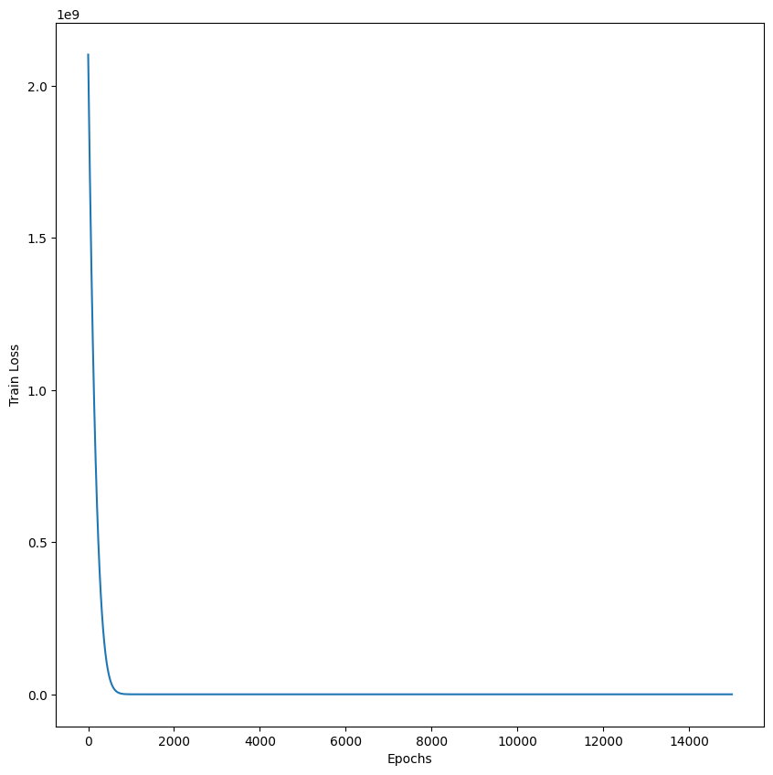

# MODUL PyTorch (Python 3.12)

# Vorhersage des Ödometerversuches implementiert
Ziel war die Implementierung eines neuronalen Netzwerks zur Modellierung des Ödometerversuchs. Dabei wurden gegebene Input-Parameter verarbeitet, um Output-Parameter vorherzusagen.

#### Das Problem ist wie folgt definiert:
$$
\begin{array}{rcl}
    \sigma_{t+1} & = & \sigma_{t}+\Delta\sigma \\ \\
    \Delta\sigma & = & E_s\cdot \Delta\epsilon \\ 
    E_s & = & \frac{1+e_0}{C_c} \cdot \sigma_t
\end{array}
\hspace{2cm}
\begin{array}{l}
    \textbf{Annahmen:} \\ \\
    \text{Startwert d. Iteration: } \sigma_t = 1,00 \\ 
    e_0 = 1,00 \\ 
    C_c = 0,005 \\
    \Delta\epsilon = 0,0005
\end{array}
$$

<br> 

Um das Model zu testen werden wir folgende vorberechnete Werte verwenden: `Input` { $\sigma_t$ }, `Output` { $E_s$ }.
<br>
### Variablendeklaration
- $\sigma_t$ = `sigma_t`
- $\Delta\epsilon$ = `delta_epsilon`
- $\sigma_{t+1}$ = `delta_sigma
- $E_s$ = `e_s`

# Generate random trainingsdata


```python
from random import randint

# Define input and output parameters
input_str = "sigma_t"
output_str = "e_s"

# 0 : simple, 1 : improved
oedo_model = 0

# Defining problem parameters
delta_epsilon = -0.0005
C_c = 0.005
e_0 = 1.0
amount_trainings_data = 100

# Data preparation for
oedo_para = {
    "max_n": 1,
    "e_0": e_0,
    "C_c": C_c,
    "delta_epsilon": delta_epsilon,
}
```

# Load problem and generate trainings data from 00_problem_settings_functions.ipynb

Available classes: `Oedometer` <br>
Returns `list_input` and `list_output` as type `list` <br>
Returns `tensor_input` and `tensor_output` as type `tensor`


```python
from handler.handleData import generate_data
from random import sample

if oedo_model == 0:
    from classes.classOedometerSimple import Oedometer
else:
    from classes.classOedometerSimple import Oedometer
sigma_t_train =  sample(range(-amount_trainings_data * 2,0), amount_trainings_data)

list_input, list_output, tensor_input, tensor_output = generate_data(oedo=oedo_para, oedo_class=Oedometer, sigma_t=sigma_t_train, amount_trainings_data=amount_trainings_data)
```

# Show trainingsdata (List) as DataFrame
Type `list`: `list_input` and `list_output`


```python
import pandas as pd
from pandas import DataFrame

pd.DataFrame([[input_str] + list_input, [output_str] + list_output])
```


<div>
<style scoped>
    .dataframe tbody tr th:only-of-type {
        vertical-align: middle;
    }

    .dataframe tbody tr th {
        vertical-align: top;
    }

    .dataframe thead th {
        text-align: right;
    }
</style>
<table border="1" class="dataframe">
  <thead>
    <tr style="text-align: right;">
      <th></th>
      <th>0</th>
      <th>1</th>
      <th>2</th>
      <th>3</th>
      <th>4</th>
      <th>5</th>
      <th>6</th>
      <th>7</th>
      <th>8</th>
      <th>9</th>
      <th>...</th>
      <th>91</th>
      <th>92</th>
      <th>93</th>
      <th>94</th>
      <th>95</th>
      <th>96</th>
      <th>97</th>
      <th>98</th>
      <th>99</th>
      <th>100</th>
    </tr>
  </thead>
  <tbody>
    <tr>
      <th>0</th>
      <td>sigma_t</td>
      <td>-125.0</td>
      <td>-31.0</td>
      <td>-108.0</td>
      <td>-74.0</td>
      <td>-116.0</td>
      <td>-12.0</td>
      <td>-137.0</td>
      <td>-123.0</td>
      <td>-192.0</td>
      <td>...</td>
      <td>-70.0</td>
      <td>-7.0</td>
      <td>-130.0</td>
      <td>-75.0</td>
      <td>-35.0</td>
      <td>-191.0</td>
      <td>-20.0</td>
      <td>-155.0</td>
      <td>-98.0</td>
      <td>-143.0</td>
    </tr>
    <tr>
      <th>1</th>
      <td>e_s</td>
      <td>50000.0</td>
      <td>12400.0</td>
      <td>43200.0</td>
      <td>29600.0</td>
      <td>46400.0</td>
      <td>4800.0</td>
      <td>54800.0</td>
      <td>49200.0</td>
      <td>76800.0</td>
      <td>...</td>
      <td>28000.0</td>
      <td>2800.0</td>
      <td>52000.0</td>
      <td>30000.0</td>
      <td>14000.0</td>
      <td>76400.0</td>
      <td>8000.0</td>
      <td>62000.0</td>
      <td>39200.0</td>
      <td>57200.0</td>
    </tr>
  </tbody>
</table>
<p>2 rows × 101 columns</p>
</div>


# Show trainingsdata (Tensor) as DataFrame
Type `tensor`: `tensor_input` and `tensor_output`


```python
import torch

tensor_input_df = pd.DataFrame(
    torch.cat((tensor_input, tensor_output), dim=1), columns=[input_str, output_str]
)
tensor_input_df
```


<div>
<style scoped>
    .dataframe tbody tr th:only-of-type {
        vertical-align: middle;
    }

    .dataframe tbody tr th {
        vertical-align: top;
    }

    .dataframe thead th {
        text-align: right;
    }
</style>
<table border="1" class="dataframe">
  <thead>
    <tr style="text-align: right;">
      <th></th>
      <th>sigma_t</th>
      <th>e_s</th>
    </tr>
  </thead>
  <tbody>
    <tr>
      <th>0</th>
      <td>-125.0</td>
      <td>50000.0</td>
    </tr>
    <tr>
      <th>1</th>
      <td>-31.0</td>
      <td>12400.0</td>
    </tr>
    <tr>
      <th>2</th>
      <td>-108.0</td>
      <td>43200.0</td>
    </tr>
    <tr>
      <th>3</th>
      <td>-74.0</td>
      <td>29600.0</td>
    </tr>
    <tr>
      <th>4</th>
      <td>-116.0</td>
      <td>46400.0</td>
    </tr>
    <tr>
      <th>...</th>
      <td>...</td>
      <td>...</td>
    </tr>
    <tr>
      <th>95</th>
      <td>-191.0</td>
      <td>76400.0</td>
    </tr>
    <tr>
      <th>96</th>
      <td>-20.0</td>
      <td>8000.0</td>
    </tr>
    <tr>
      <th>97</th>
      <td>-155.0</td>
      <td>62000.0</td>
    </tr>
    <tr>
      <th>98</th>
      <td>-98.0</td>
      <td>39200.0</td>
    </tr>
    <tr>
      <th>99</th>
      <td>-143.0</td>
      <td>57200.0</td>
    </tr>
  </tbody>
</table>
<p>100 rows × 2 columns</p>
</div>


# Define SimpleRegressor Model


```python
import torch.nn as nn


class SimpleRegressor(nn.Module):
    def __init__(self):
        super(SimpleRegressor, self).__init__()
        self.linear = nn.Linear(1, 1)

    def forward(self, x):
        return self.linear(x)


model = SimpleRegressor()
```


```python
# import torch.nn as nn
# import torch.optim as optim


# class SimpleRegressor(nn.Module):
#     def __init__(self):
#         super(SimpleRegressor, self).__init__()
#         self.model = nn.Sequential(
#             nn.Linear(1, 16),
#             nn.ReLU(),
#             nn.Linear(16, 16),
#             nn.ReLU(),
#             nn.Linear(16, 1)
#         )

#     def forward(self, x):
#         return self.model(x)

# model = SimpleRegressor()
```

# Training


```python
loss_fn = nn.MSELoss()
optimizer = optim.Adam(model.parameters(), lr=0.01)

epochs = 100000
loss_history = []
for epoch in range(epochs):
    model.train()
    optimizer.zero_grad()
    pred = model(tensor_input)
    loss = loss_fn(pred, tensor_output)
    loss.backward()
    loss_history.append(loss.item())
    optimizer.step()

    if epoch % 100 == 0:
        print(f"Epoch {epoch}: Loss = {loss.item():.6f}")
```

    Epoch 0: Loss = 2131822208.000000
    Epoch 100: Loss = 2121088896.000000
    Epoch 200: Loss = 2110395392.000000
    Epoch 300: Loss = 2099741312.000000
    Epoch 400: Loss = 2089126656.000000
    Epoch 500: Loss = 2078550400.000000
    Epoch 600: Loss = 2068012288.000000
    Epoch 700: Loss = 2057511424.000000
    Epoch 800: Loss = 2047048192.000000
    Epoch 900: Loss = 2036621440.000000
    Epoch 1000: Loss = 2026230912.000000
    Epoch 1100: Loss = 2015875840.000000
    Epoch 1200: Loss = 2005556224.000000
    Epoch 1300: Loss = 1995271680.000000
    Epoch 1400: Loss = 1985021184.000000
    Epoch 1500: Loss = 1974805120.000000
    Epoch 1600: Loss = 1964622464.000000
    Epoch 1700: Loss = 1954473088.000000
    Epoch 1800: Loss = 1944356736.000000
    Epoch 1900: Loss = 1934272768.000000
    Epoch 2000: Loss = 1924221312.000000
    Epoch 2100: Loss = 1914201600.000000
    Epoch 2200: Loss = 1904213376.000000
    Epoch 2300: Loss = 1894256768.000000
    Epoch 2400: Loss = 1884330880.000000
    Epoch 2500: Loss = 1874435968.000000
    Epoch 2600: Loss = 1864571264.000000
    Epoch 2700: Loss = 1854736896.000000
    Epoch 2800: Loss = 1844932608.000000
    Epoch 2900: Loss = 1835158016.000000
    Epoch 3000: Loss = 1825413248.000000
    Epoch 3100: Loss = 1815697664.000000
    Epoch 3200: Loss = 1806011264.000000
    Epoch 3300: Loss = 1796353536.000000
    Epoch 3400: Loss = 1786724992.000000
    Epoch 3500: Loss = 1777125248.000000
    Epoch 3600: Loss = 1767553792.000000
    Epoch 3700: Loss = 1758009856.000000
    Epoch 3800: Loss = 1748495872.000000
    Epoch 3900: Loss = 1739008896.000000
    Epoch 4000: Loss = 1729549952.000000
    Epoch 4100: Loss = 1720119168.000000
    Epoch 4200: Loss = 1710715648.000000
    Epoch 4300: Loss = 1701340416.000000
    Epoch 4400: Loss = 1691992064.000000
    Epoch 4500: Loss = 1682671872.000000
    Epoch 4600: Loss = 1673378816.000000
    Epoch 4700: Loss = 1664112896.000000
    Epoch 4800: Loss = 1654874752.000000
    Epoch 4900: Loss = 1645662208.000000
    Epoch 5000: Loss = 1636478976.000000
    Epoch 5100: Loss = 1627321600.000000
    Epoch 5200: Loss = 1618190976.000000
    Epoch 5300: Loss = 1609088512.000000
    Epoch 5400: Loss = 1600011648.000000
    Epoch 5500: Loss = 1590961920.000000
    Epoch 5600: Loss = 1581939712.000000
    Epoch 5700: Loss = 1572943488.000000
    Epoch 5800: Loss = 1563973760.000000
    Epoch 5900: Loss = 1555032192.000000
    Epoch 6000: Loss = 1546116352.000000
    Epoch 6100: Loss = 1537226240.000000
    Epoch 6200: Loss = 1528364416.000000
    Epoch 6300: Loss = 1519528832.000000
    Epoch 6400: Loss = 1510718848.000000
    Epoch 6500: Loss = 1501934720.000000
    Epoch 6600: Loss = 1493176192.000000
    Epoch 6700: Loss = 1484445312.000000
    Epoch 6800: Loss = 1475744512.000000
    Epoch 6900: Loss = 1467069440.000000
    Epoch 7000: Loss = 1458419968.000000
    Epoch 7100: Loss = 1449796096.000000
    Epoch 7200: Loss = 1441197568.000000
    Epoch 7300: Loss = 1432624768.000000
    Epoch 7400: Loss = 1424077824.000000
    Epoch 7500: Loss = 1415558784.000000
    Epoch 7600: Loss = 1407069568.000000
    Epoch 7700: Loss = 1398605568.000000
    Epoch 7800: Loss = 1390167168.000000
    Epoch 7900: Loss = 1381754368.000000
    Epoch 8000: Loss = 1373367168.000000
    Epoch 8100: Loss = 1365005568.000000
    Epoch 8200: Loss = 1356669056.000000
    Epoch 8300: Loss = 1348360192.000000
    Epoch 8400: Loss = 1340081664.000000
    Epoch 8500: Loss = 1331828352.000000
    Epoch 8600: Loss = 1323600768.000000
    Epoch 8700: Loss = 1315398400.000000
    Epoch 8800: Loss = 1307221888.000000
    Epoch 8900: Loss = 1299070592.000000
    Epoch 9000: Loss = 1290945152.000000
    Epoch 9100: Loss = 1282845952.000000
    Epoch 9200: Loss = 1274777472.000000
    Epoch 9300: Loss = 1266734720.000000
    Epoch 9400: Loss = 1258717184.000000
    Epoch 9500: Loss = 1250725248.000000
    Epoch 9600: Loss = 1242758656.000000
    Epoch 9700: Loss = 1234817536.000000
    Epoch 9800: Loss = 1226902016.000000
    Epoch 9900: Loss = 1219013376.000000
    Epoch 10000: Loss = 1211154816.000000
    Epoch 10100: Loss = 1203321600.000000
    Epoch 10200: Loss = 1195513984.000000
    Epoch 10300: Loss = 1187731584.000000
    Epoch 10400: Loss = 1179974656.000000
    Epoch 10500: Loss = 1172243200.000000
    Epoch 10600: Loss = 1164537216.000000
    Epoch 10700: Loss = 1156860288.000000
    Epoch 10800: Loss = 1149211008.000000
    Epoch 10900: Loss = 1141587200.000000
    Epoch 11000: Loss = 1133988736.000000
    Epoch 11100: Loss = 1126415616.000000
    Epoch 11200: Loss = 1118867968.000000
    Epoch 11300: Loss = 1111345536.000000
    Epoch 11400: Loss = 1103850368.000000
    Epoch 11500: Loss = 1096384512.000000
    Epoch 11600: Loss = 1088944256.000000
    Epoch 11700: Loss = 1081529088.000000
    Epoch 11800: Loss = 1074139264.000000
    Epoch 11900: Loss = 1066774848.000000
    Epoch 12000: Loss = 1059435904.000000
    Epoch 12100: Loss = 1052123776.000000
    Epoch 12200: Loss = 1044841088.000000
    Epoch 12300: Loss = 1037583808.000000
    Epoch 12400: Loss = 1030351744.000000
    Epoch 12500: Loss = 1023144896.000000
    Epoch 12600: Loss = 1015963456.000000
    Epoch 12700: Loss = 1008807296.000000
    Epoch 12800: Loss = 1001679744.000000
    Epoch 12900: Loss = 994579712.000000
    Epoch 13000: Loss = 987504896.000000
    Epoch 13100: Loss = 980456000.000000
    Epoch 13200: Loss = 973437248.000000
    Epoch 13300: Loss = 966443776.000000
    Epoch 13400: Loss = 959475392.000000
    Epoch 13500: Loss = 952532352.000000
    Epoch 13600: Loss = 945614528.000000
    Epoch 13700: Loss = 938721856.000000
    Epoch 13800: Loss = 931854400.000000
    Epoch 13900: Loss = 925012160.000000
    Epoch 14000: Loss = 918195072.000000
    Epoch 14100: Loss = 911403392.000000
    Epoch 14200: Loss = 904636736.000000
    Epoch 14300: Loss = 897895872.000000
    Epoch 14400: Loss = 891190336.000000
    Epoch 14500: Loss = 884509824.000000
    Epoch 14600: Loss = 877854528.000000
    Epoch 14700: Loss = 871224448.000000
    Epoch 14800: Loss = 864619392.000000
    Epoch 14900: Loss = 858039488.000000
    Epoch 15000: Loss = 851484864.000000
    Epoch 15100: Loss = 844955136.000000
    Epoch 15200: Loss = 838450688.000000
    Epoch 15300: Loss = 831971328.000000
    Epoch 15400: Loss = 825517184.000000
    Epoch 15500: Loss = 819095040.000000
    Epoch 15600: Loss = 812701312.000000
    Epoch 15700: Loss = 806332416.000000
    Epoch 15800: Loss = 799988672.000000
    Epoch 15900: Loss = 793670144.000000
    Epoch 16000: Loss = 787376512.000000
    Epoch 16100: Loss = 781107968.000000
    Epoch 16200: Loss = 774864320.000000
    Epoch 16300: Loss = 768645888.000000
    Epoch 16400: Loss = 762452544.000000
    Epoch 16500: Loss = 756286080.000000
    Epoch 16600: Loss = 750152512.000000
    Epoch 16700: Loss = 744043904.000000
    Epoch 16800: Loss = 737960256.000000
    Epoch 16900: Loss = 731901632.000000
    Epoch 17000: Loss = 725867968.000000
    Epoch 17100: Loss = 719859200.000000
    Epoch 17200: Loss = 713875456.000000
    Epoch 17300: Loss = 707916736.000000
    Epoch 17400: Loss = 701983040.000000
    Epoch 17500: Loss = 696078656.000000
    Epoch 17600: Loss = 690204096.000000
    Epoch 17700: Loss = 684354496.000000
    Epoch 17800: Loss = 678529856.000000
    Epoch 17900: Loss = 672729920.000000
    Epoch 18000: Loss = 666955008.000000
    Epoch 18100: Loss = 661204928.000000
    Epoch 18200: Loss = 655479936.000000
    Epoch 18300: Loss = 649779648.000000
    Epoch 18400: Loss = 644108096.000000
    Epoch 18500: Loss = 638466752.000000
    Epoch 18600: Loss = 632850048.000000
    Epoch 18700: Loss = 627258176.000000
    Epoch 18800: Loss = 621691072.000000
    Epoch 18900: Loss = 616148800.000000
    Epoch 19000: Loss = 610631488.000000
    Epoch 19100: Loss = 605138880.000000
    Epoch 19200: Loss = 599671168.000000
    Epoch 19300: Loss = 594236800.000000
    Epoch 19400: Loss = 588827264.000000
    Epoch 19500: Loss = 583442432.000000
    Epoch 19600: Loss = 578082432.000000
    Epoch 19700: Loss = 572746944.000000
    Epoch 19800: Loss = 567436352.000000
    Epoch 19900: Loss = 562150464.000000
    Epoch 20000: Loss = 556890432.000000
    Epoch 20100: Loss = 551662336.000000
    Epoch 20200: Loss = 546458880.000000
    Epoch 20300: Loss = 541280192.000000
    Epoch 20400: Loss = 536126080.000000
    Epoch 20500: Loss = 530996672.000000
    Epoch 20600: Loss = 525891840.000000
    Epoch 20700: Loss = 520811808.000000
    Epoch 20800: Loss = 515762336.000000
    Epoch 20900: Loss = 510739584.000000
    Epoch 21000: Loss = 505741312.000000
    Epoch 21100: Loss = 500767648.000000
    Epoch 21200: Loss = 495818624.000000
    Epoch 21300: Loss = 490894144.000000
    Epoch 21400: Loss = 485994240.000000
    Epoch 21500: Loss = 481125280.000000
    Epoch 21600: Loss = 476282272.000000
    Epoch 21700: Loss = 471463744.000000
    Epoch 21800: Loss = 466669728.000000
    Epoch 21900: Loss = 461900224.000000
    Epoch 22000: Loss = 457155168.000000
    Epoch 22100: Loss = 452437024.000000
    Epoch 22200: Loss = 447748576.000000
    Epoch 22300: Loss = 443084512.000000
    Epoch 22400: Loss = 438444800.000000
    Epoch 22500: Loss = 433829504.000000
    Epoch 22600: Loss = 429238816.000000
    Epoch 22700: Loss = 424673568.000000
    Epoch 22800: Loss = 420138880.000000
    Epoch 22900: Loss = 415628576.000000
    Epoch 23000: Loss = 411142464.000000
    Epoch 23100: Loss = 406680864.000000
    Epoch 23200: Loss = 402243456.000000
    Epoch 23300: Loss = 397833248.000000
    Epoch 23400: Loss = 393451648.000000
    Epoch 23500: Loss = 389094272.000000
    Epoch 23600: Loss = 384761216.000000
    Epoch 23700: Loss = 380452384.000000
    Epoch 23800: Loss = 376167872.000000
    Epoch 23900: Loss = 371913728.000000
    Epoch 24000: Loss = 367684448.000000
    Epoch 24100: Loss = 363479424.000000
    Epoch 24200: Loss = 359298624.000000
    Epoch 24300: Loss = 355141920.000000
    Epoch 24400: Loss = 351014144.000000
    Epoch 24500: Loss = 346912384.000000
    Epoch 24600: Loss = 342834816.000000
    Epoch 24700: Loss = 338781248.000000
    Epoch 24800: Loss = 334751936.000000
    Epoch 24900: Loss = 330751744.000000
    Epoch 25000: Loss = 326776960.000000
    Epoch 25100: Loss = 322826240.000000
    Epoch 25200: Loss = 318899456.000000
    Epoch 25300: Loss = 314997568.000000
    Epoch 25400: Loss = 311125088.000000
    Epoch 25500: Loss = 307276704.000000
    Epoch 25600: Loss = 303452224.000000
    Epoch 25700: Loss = 299651648.000000
    Epoch 25800: Loss = 295879200.000000
    Epoch 25900: Loss = 292132608.000000
    Epoch 26000: Loss = 288409920.000000
    Epoch 26100: Loss = 284711104.000000
    Epoch 26200: Loss = 281038720.000000
    Epoch 26300: Loss = 277393504.000000
    Epoch 26400: Loss = 273772128.000000
    Epoch 26500: Loss = 270174560.000000
    Epoch 26600: Loss = 266600832.000000
    Epoch 26700: Loss = 263050944.000000
    Epoch 26800: Loss = 259530176.000000
    Epoch 26900: Loss = 256039104.000000
    Epoch 27000: Loss = 252571664.000000
    Epoch 27100: Loss = 249127872.000000
    Epoch 27200: Loss = 245707728.000000
    Epoch 27300: Loss = 242311248.000000
    Epoch 27400: Loss = 238938400.000000
    Epoch 27500: Loss = 235590224.000000
    Epoch 27600: Loss = 232275472.000000
    Epoch 27700: Loss = 228984240.000000
    Epoch 27800: Loss = 225716464.000000
    Epoch 27900: Loss = 222472144.000000
    Epoch 28000: Loss = 219251392.000000
    Epoch 28100: Loss = 216054080.000000
    Epoch 28200: Loss = 212883680.000000
    Epoch 28300: Loss = 209743600.000000
    Epoch 28400: Loss = 206626896.000000
    Epoch 28500: Loss = 203533472.000000
    Epoch 28600: Loss = 200463440.000000
    Epoch 28700: Loss = 197416720.000000
    Epoch 28800: Loss = 194394400.000000
    Epoch 28900: Loss = 191404176.000000
    Epoch 29000: Loss = 188437120.000000
    Epoch 29100: Loss = 185493216.000000
    Epoch 29200: Loss = 182572608.000000
    Epoch 29300: Loss = 179675088.000000
    Epoch 29400: Loss = 176804192.000000
    Epoch 29500: Loss = 173962464.000000
    Epoch 29600: Loss = 171143696.000000
    Epoch 29700: Loss = 168347952.000000
    Epoch 29800: Loss = 165575248.000000
    Epoch 29900: Loss = 162825920.000000
    Epoch 30000: Loss = 160108256.000000
    Epoch 30100: Loss = 157413424.000000
    Epoch 30200: Loss = 154741520.000000
    Epoch 30300: Loss = 152092512.000000
    Epoch 30400: Loss = 149467216.000000
    Epoch 30500: Loss = 146872560.000000
    Epoch 30600: Loss = 144300560.000000
    Epoch 30700: Loss = 141751360.000000
    Epoch 30800: Loss = 139224896.000000
    Epoch 30900: Loss = 136725120.000000
    Epoch 31000: Loss = 134252288.000000
    Epoch 31100: Loss = 131801992.000000
    Epoch 31200: Loss = 129374320.000000
    Epoch 31300: Loss = 126970584.000000
    Epoch 31400: Loss = 124595928.000000
    Epoch 31500: Loss = 122243696.000000
    Epoch 31600: Loss = 119913952.000000
    Epoch 31700: Loss = 117607704.000000
    Epoch 31800: Loss = 115330376.000000
    Epoch 31900: Loss = 113075312.000000
    Epoch 32000: Loss = 110842528.000000
    Epoch 32100: Loss = 108634736.000000
    Epoch 32200: Loss = 106453808.000000
    Epoch 32300: Loss = 104294952.000000
    Epoch 32400: Loss = 102158344.000000
    Epoch 32500: Loss = 100049440.000000
    Epoch 32600: Loss = 97963968.000000
    Epoch 32700: Loss = 95900496.000000
    Epoch 32800: Loss = 93862024.000000
    Epoch 32900: Loss = 91849280.000000
    Epoch 33000: Loss = 89858312.000000
    Epoch 33100: Loss = 87891016.000000
    Epoch 33200: Loss = 85950304.000000
    Epoch 33300: Loss = 84031256.000000
    Epoch 33400: Loss = 82135656.000000
    Epoch 33500: Loss = 80266288.000000
    Epoch 33600: Loss = 78418464.000000
    Epoch 33700: Loss = 76594896.000000
    Epoch 33800: Loss = 74796192.000000
    Epoch 33900: Loss = 73018976.000000
    Epoch 34000: Loss = 71267504.000000
    Epoch 34100: Loss = 69538880.000000
    Epoch 34200: Loss = 67832488.000000
    Epoch 34300: Loss = 66152076.000000
    Epoch 34400: Loss = 64492788.000000
    Epoch 34500: Loss = 62858676.000000
    Epoch 34600: Loss = 61247080.000000
    Epoch 34700: Loss = 59658656.000000
    Epoch 34800: Loss = 58094296.000000
    Epoch 34900: Loss = 56551760.000000
    Epoch 35000: Loss = 55034256.000000
    Epoch 35100: Loss = 53537808.000000
    Epoch 35200: Loss = 52066704.000000
    Epoch 35300: Loss = 50616352.000000
    Epoch 35400: Loss = 49191292.000000
    Epoch 35500: Loss = 47787084.000000
    Epoch 35600: Loss = 46407568.000000
    Epoch 35700: Loss = 45049424.000000
    Epoch 35800: Loss = 43715036.000000
    Epoch 35900: Loss = 42402820.000000
    Epoch 36000: Loss = 41113112.000000
    Epoch 36100: Loss = 39846600.000000
    Epoch 36200: Loss = 38601484.000000
    Epoch 36300: Loss = 37380164.000000
    Epoch 36400: Loss = 36180564.000000
    Epoch 36500: Loss = 35002724.000000
    Epoch 36600: Loss = 33848336.000000
    Epoch 36700: Loss = 32715496.000000
    Epoch 36800: Loss = 31604262.000000
    Epoch 36900: Loss = 30515914.000000
    Epoch 37000: Loss = 29449304.000000
    Epoch 37100: Loss = 28404244.000000
    Epoch 37200: Loss = 27380764.000000
    Epoch 37300: Loss = 26379444.000000
    Epoch 37400: Loss = 25399802.000000
    Epoch 37500: Loss = 24441548.000000
    Epoch 37600: Loss = 23504620.000000
    Epoch 37700: Loss = 22588986.000000
    Epoch 37800: Loss = 21694556.000000
    Epoch 37900: Loss = 20821252.000000
    Epoch 38000: Loss = 19969026.000000
    Epoch 38100: Loss = 19137736.000000
    Epoch 38200: Loss = 18327256.000000
    Epoch 38300: Loss = 17537500.000000
    Epoch 38400: Loss = 16768330.000000
    Epoch 38500: Loss = 16019553.000000
    Epoch 38600: Loss = 15291068.000000
    Epoch 38700: Loss = 14582705.000000
    Epoch 38800: Loss = 13894417.000000
    Epoch 38900: Loss = 13226291.000000
    Epoch 39000: Loss = 12577770.000000
    Epoch 39100: Loss = 11948719.000000
    Epoch 39200: Loss = 11339515.000000
    Epoch 39300: Loss = 10749320.000000
    Epoch 39400: Loss = 10178463.000000
    Epoch 39500: Loss = 9626417.000000
    Epoch 39600: Loss = 9093415.000000
    Epoch 39700: Loss = 8578868.000000
    Epoch 39800: Loss = 8082779.500000
    Epoch 39900: Loss = 7605054.000000
    Epoch 40000: Loss = 7145325.500000
    Epoch 40100: Loss = 6703417.000000
    Epoch 40200: Loss = 6279117.500000
    Epoch 40300: Loss = 5872256.500000
    Epoch 40400: Loss = 5482533.000000
    Epoch 40500: Loss = 5109713.000000
    Epoch 40600: Loss = 4753538.000000
    Epoch 40700: Loss = 4413911.500000
    Epoch 40800: Loss = 4090352.000000
    Epoch 40900: Loss = 3782694.750000
    Epoch 41000: Loss = 3490561.000000
    Epoch 41100: Loss = 3213795.250000
    Epoch 41200: Loss = 2951959.750000
    Epoch 41300: Loss = 2704779.250000
    Epoch 41400: Loss = 2471926.750000
    Epoch 41500: Loss = 2253005.000000
    Epoch 41600: Loss = 2047731.000000
    Epoch 41700: Loss = 1855701.875000
    Epoch 41800: Loss = 1676528.750000
    Epoch 41900: Loss = 1509794.875000
    Epoch 42000: Loss = 1355155.500000
    Epoch 42100: Loss = 1212140.750000
    Epoch 42200: Loss = 1080339.375000
    Epoch 42300: Loss = 959308.250000
    Epoch 42400: Loss = 848567.687500
    Epoch 42500: Loss = 747693.250000
    Epoch 42600: Loss = 656172.187500
    Epoch 42700: Loss = 573526.937500
    Epoch 42800: Loss = 499275.281250
    Epoch 42900: Loss = 432902.718750
    Epoch 43000: Loss = 373923.406250
    Epoch 43100: Loss = 321814.093750
    Epoch 43200: Loss = 276086.875000
    Epoch 43300: Loss = 236222.734375
    Epoch 43400: Loss = 201731.546875
    Epoch 43500: Loss = 172125.562500
    Epoch 43600: Loss = 146919.046875
    Epoch 43700: Loss = 125653.726562
    Epoch 43800: Loss = 107889.453125
    Epoch 43900: Loss = 93194.000000
    Epoch 44000: Loss = 81171.953125
    Epoch 44100: Loss = 71446.296875
    Epoch 44200: Loss = 63676.574219
    Epoch 44300: Loss = 57546.871094
    Epoch 44400: Loss = 52777.406250
    Epoch 44500: Loss = 49121.156250
    Epoch 44600: Loss = 46355.105469
    Epoch 44700: Loss = 44295.210938
    Epoch 44800: Loss = 42783.750000
    Epoch 44900: Loss = 41691.093750
    Epoch 45000: Loss = 40911.042969
    Epoch 45100: Loss = 40360.355469
    Epoch 45200: Loss = 39973.265625
    Epoch 45300: Loss = 39700.378906
    Epoch 45400: Loss = 39504.136719
    Epoch 45500: Loss = 39359.179688
    Epoch 45600: Loss = 39245.886719
    Epoch 45700: Loss = 39152.386719
    Epoch 45800: Loss = 39068.550781
    Epoch 45900: Loss = 38990.570312
    Epoch 46000: Loss = 38913.625000
    Epoch 46100: Loss = 38836.375000
    Epoch 46200: Loss = 38757.691406
    Epoch 46300: Loss = 38676.617188
    Epoch 46400: Loss = 38591.699219
    Epoch 46500: Loss = 38504.300781
    Epoch 46600: Loss = 38414.109375
    Epoch 46700: Loss = 38319.867188
    Epoch 46800: Loss = 38222.484375
    Epoch 46900: Loss = 38121.351562
    Epoch 47000: Loss = 38017.019531
    Epoch 47100: Loss = 37909.175781
    Epoch 47200: Loss = 37797.531250
    Epoch 47300: Loss = 37682.632812
    Epoch 47400: Loss = 37564.257812
    Epoch 47500: Loss = 37442.640625
    Epoch 47600: Loss = 37317.078125
    Epoch 47700: Loss = 37188.488281
    Epoch 47800: Loss = 37057.160156
    Epoch 47900: Loss = 36922.183594
    Epoch 48000: Loss = 36784.558594
    Epoch 48100: Loss = 36643.984375
    Epoch 48200: Loss = 36500.300781
    Epoch 48300: Loss = 36354.351562
    Epoch 48400: Loss = 36205.867188
    Epoch 48500: Loss = 36054.808594
    Epoch 48600: Loss = 35901.480469
    Epoch 48700: Loss = 35746.425781
    Epoch 48800: Loss = 35589.140625
    Epoch 48900: Loss = 35430.335938
    Epoch 49000: Loss = 35269.679688
    Epoch 49100: Loss = 35107.523438
    Epoch 49200: Loss = 34943.933594
    Epoch 49300: Loss = 34779.394531
    Epoch 49400: Loss = 34613.289062
    Epoch 49500: Loss = 34446.390625
    Epoch 49600: Loss = 34278.281250
    Epoch 49700: Loss = 34109.820312
    Epoch 49800: Loss = 33940.121094
    Epoch 49900: Loss = 33770.039062
    Epoch 50000: Loss = 33599.113281
    Epoch 50100: Loss = 33427.921875
    Epoch 50200: Loss = 33256.441406
    Epoch 50300: Loss = 33084.425781
    Epoch 50400: Loss = 32912.433594
    Epoch 50500: Loss = 32740.089844
    Epoch 50600: Loss = 32567.820312
    Epoch 50700: Loss = 32395.507812
    Epoch 50800: Loss = 32222.927734
    Epoch 50900: Loss = 32050.449219
    Epoch 51000: Loss = 31878.001953
    Epoch 51100: Loss = 31705.710938
    Epoch 51200: Loss = 31533.943359
    Epoch 51300: Loss = 31361.828125
    Epoch 51400: Loss = 31190.279297
    Epoch 51500: Loss = 31018.949219
    Epoch 51600: Loss = 30847.640625
    Epoch 51700: Loss = 30676.828125
    Epoch 51800: Loss = 30506.054688
    Epoch 51900: Loss = 30335.505859
    Epoch 52000: Loss = 30165.912109
    Epoch 52100: Loss = 29996.359375
    Epoch 52200: Loss = 29827.130859
    Epoch 52300: Loss = 29658.265625
    Epoch 52400: Loss = 29489.886719
    Epoch 52500: Loss = 29321.474609
    Epoch 52600: Loss = 29154.052734
    Epoch 52700: Loss = 28987.052734
    Epoch 52800: Loss = 28820.464844
    Epoch 52900: Loss = 28654.455078
    Epoch 53000: Loss = 28488.570312
    Epoch 53100: Loss = 28322.750000
    Epoch 53200: Loss = 28157.574219
    Epoch 53300: Loss = 27992.730469
    Epoch 53400: Loss = 27828.859375
    Epoch 53500: Loss = 27664.990234
    Epoch 53600: Loss = 27501.750000
    Epoch 53700: Loss = 27338.847656
    Epoch 53800: Loss = 27176.476562
    Epoch 53900: Loss = 27014.867188
    Epoch 54000: Loss = 26853.519531
    Epoch 54100: Loss = 26692.613281
    Epoch 54200: Loss = 26532.273438
    Epoch 54300: Loss = 26372.607422
    Epoch 54400: Loss = 26213.199219
    Epoch 54500: Loss = 26054.181641
    Epoch 54600: Loss = 25895.675781
    Epoch 54700: Loss = 25737.626953
    Epoch 54800: Loss = 25580.425781
    Epoch 54900: Loss = 25423.376953
    Epoch 55000: Loss = 25266.921875
    Epoch 55100: Loss = 25110.759766
    Epoch 55200: Loss = 24955.539062
    Epoch 55300: Loss = 24800.384766
    Epoch 55400: Loss = 24645.767578
    Epoch 55500: Loss = 24491.634766
    Epoch 55600: Loss = 24337.984375
    Epoch 55700: Loss = 24185.068359
    Epoch 55800: Loss = 24032.412109
    Epoch 55900: Loss = 23880.248047
    Epoch 56000: Loss = 23728.662109
    Epoch 56100: Loss = 23577.994141
    Epoch 56200: Loss = 23427.830078
    Epoch 56300: Loss = 23278.144531
    Epoch 56400: Loss = 23128.595703
    Epoch 56500: Loss = 22979.964844
    Epoch 56600: Loss = 22831.630859
    Epoch 56700: Loss = 22683.863281
    Epoch 56800: Loss = 22536.642578
    Epoch 56900: Loss = 22389.835938
    Epoch 57000: Loss = 22243.140625
    Epoch 57100: Loss = 22097.335938
    Epoch 57200: Loss = 21951.984375
    Epoch 57300: Loss = 21807.029297
    Epoch 57400: Loss = 21662.636719
    Epoch 57500: Loss = 21518.783203
    Epoch 57600: Loss = 21374.988281
    Epoch 57700: Loss = 21232.033203
    Epoch 57800: Loss = 21089.562500
    Epoch 57900: Loss = 20947.460938
    Epoch 58000: Loss = 20806.019531
    Epoch 58100: Loss = 20665.025391
    Epoch 58200: Loss = 20524.042969
    Epoch 58300: Loss = 20384.021484
    Epoch 58400: Loss = 20244.408203
    Epoch 58500: Loss = 20105.251953
    Epoch 58600: Loss = 19966.582031
    Epoch 58700: Loss = 19828.429688
    Epoch 58800: Loss = 19690.505859
    Epoch 58900: Loss = 19553.263672
    Epoch 59000: Loss = 19416.730469
    Epoch 59100: Loss = 19280.710938
    Epoch 59200: Loss = 19145.488281
    Epoch 59300: Loss = 19010.404297
    Epoch 59400: Loss = 18876.148438
    Epoch 59500: Loss = 18742.109375
    Epoch 59600: Loss = 18608.650391
    Epoch 59700: Loss = 18475.582031
    Epoch 59800: Loss = 18342.939453
    Epoch 59900: Loss = 18211.091797
    Epoch 60000: Loss = 18079.355469
    Epoch 60100: Loss = 17948.445312
    Epoch 60200: Loss = 17817.724609
    Epoch 60300: Loss = 17687.716797
    Epoch 60400: Loss = 17557.914062
    Epoch 60500: Loss = 17428.542969
    Epoch 60600: Loss = 17300.025391
    Epoch 60700: Loss = 17171.664062
    Epoch 60800: Loss = 17044.044922
    Epoch 60900: Loss = 16916.634766
    Epoch 61000: Loss = 16790.107422
    Epoch 61100: Loss = 16663.876953
    Epoch 61200: Loss = 16538.154297
    Epoch 61300: Loss = 16412.914062
    Epoch 61400: Loss = 16288.428711
    Epoch 61500: Loss = 16164.101562
    Epoch 61600: Loss = 16040.330078
    Epoch 61700: Loss = 15916.962891
    Epoch 61800: Loss = 15794.378906
    Epoch 61900: Loss = 15671.945312
    Epoch 62000: Loss = 15550.097656
    Epoch 62100: Loss = 15428.937500
    Epoch 62200: Loss = 15308.178711
    Epoch 62300: Loss = 15187.962891
    Epoch 62400: Loss = 15068.165039
    Epoch 62500: Loss = 14948.879883
    Epoch 62600: Loss = 14830.048828
    Epoch 62700: Loss = 14711.738281
    Epoch 62800: Loss = 14593.804688
    Epoch 62900: Loss = 14476.394531
    Epoch 63000: Loss = 14359.477539
    Epoch 63100: Loss = 14243.204102
    Epoch 63200: Loss = 14127.432617
    Epoch 63300: Loss = 14012.201172
    Epoch 63400: Loss = 13897.355469
    Epoch 63500: Loss = 13782.997070
    Epoch 63600: Loss = 13669.212891
    Epoch 63700: Loss = 13555.550781
    Epoch 63800: Loss = 13442.667969
    Epoch 63900: Loss = 13330.182617
    Epoch 64000: Loss = 13218.259766
    Epoch 64100: Loss = 13106.964844
    Epoch 64200: Loss = 12995.907227
    Epoch 64300: Loss = 12885.584961
    Epoch 64400: Loss = 12775.702148
    Epoch 64500: Loss = 12666.128906
    Epoch 64600: Loss = 12557.144531
    Epoch 64700: Loss = 12448.787109
    Epoch 64800: Loss = 12340.528320
    Epoch 64900: Loss = 12232.992188
    Epoch 65000: Loss = 12125.934570
    Epoch 65100: Loss = 12019.584961
    Epoch 65200: Loss = 11913.530273
    Epoch 65300: Loss = 11808.071289
    Epoch 65400: Loss = 11702.922852
    Epoch 65500: Loss = 11598.412109
    Epoch 65600: Loss = 11494.201172
    Epoch 65700: Loss = 11390.714844
    Epoch 65800: Loss = 11287.451172
    Epoch 65900: Loss = 11184.882812
    Epoch 66000: Loss = 11082.712891
    Epoch 66100: Loss = 10981.233398
    Epoch 66200: Loss = 10880.071289
    Epoch 66300: Loss = 10779.337891
    Epoch 66400: Loss = 10679.269531
    Epoch 66500: Loss = 10579.405273
    Epoch 66600: Loss = 10480.224609
    Epoch 66700: Loss = 10381.621094
    Epoch 66800: Loss = 10283.424805
    Epoch 66900: Loss = 10185.632812
    Epoch 67000: Loss = 10088.371094
    Epoch 67100: Loss = 9991.603516
    Epoch 67200: Loss = 9895.246094
    Epoch 67300: Loss = 9799.366211
    Epoch 67400: Loss = 9704.206055
    Epoch 67500: Loss = 9609.446289
    Epoch 67600: Loss = 9515.194336
    Epoch 67700: Loss = 9421.292969
    Epoch 67800: Loss = 9327.991211
    Epoch 67900: Loss = 9235.092773
    Epoch 68000: Loss = 9142.532227
    Epoch 68100: Loss = 9050.846680
    Epoch 68200: Loss = 8959.496094
    Epoch 68300: Loss = 8868.436523
    Epoch 68400: Loss = 8778.072266
    Epoch 68500: Loss = 8688.151367
    Epoch 68600: Loss = 8598.677734
    Epoch 68700: Loss = 8509.673828
    Epoch 68800: Loss = 8421.273438
    Epoch 68900: Loss = 8333.236328
    Epoch 69000: Loss = 8245.589844
    Epoch 69100: Loss = 8158.630859
    Epoch 69200: Loss = 8071.922363
    Epoch 69300: Loss = 7986.014160
    Epoch 69400: Loss = 7900.439941
    Epoch 69500: Loss = 7815.347656
    Epoch 69600: Loss = 7730.794434
    Epoch 69700: Loss = 7646.586426
    Epoch 69800: Loss = 7562.890625
    Epoch 69900: Loss = 7479.759766
    Epoch 70000: Loss = 7397.083984
    Epoch 70100: Loss = 7315.055664
    Epoch 70200: Loss = 7233.363770
    Epoch 70300: Loss = 7152.000000
    Epoch 70400: Loss = 7071.281738
    Epoch 70500: Loss = 6991.091309
    Epoch 70600: Loss = 6911.319824
    Epoch 70700: Loss = 6831.853516
    Epoch 70800: Loss = 6753.087402
    Epoch 70900: Loss = 6674.695801
    Epoch 71000: Loss = 6596.978516
    Epoch 71100: Loss = 6519.685547
    Epoch 71200: Loss = 6442.653809
    Epoch 71300: Loss = 6366.229980
    Epoch 71400: Loss = 6290.387695
    Epoch 71500: Loss = 6214.919434
    Epoch 71600: Loss = 6140.029785
    Epoch 71700: Loss = 6065.476074
    Epoch 71800: Loss = 5991.481934
    Epoch 71900: Loss = 5917.919922
    Epoch 72000: Loss = 5844.857910
    Epoch 72100: Loss = 5772.366699
    Epoch 72200: Loss = 5700.208984
    Epoch 72300: Loss = 5628.549805
    Epoch 72400: Loss = 5557.472656
    Epoch 72500: Loss = 5486.807617
    Epoch 72600: Loss = 5416.776367
    Epoch 72700: Loss = 5347.042480
    Epoch 72800: Loss = 5277.901367
    Epoch 72900: Loss = 5209.168945
    Epoch 73000: Loss = 5140.739258
    Epoch 73100: Loss = 5072.973633
    Epoch 73200: Loss = 5005.772949
    Epoch 73300: Loss = 4938.987793
    Epoch 73400: Loss = 4872.663574
    Epoch 73500: Loss = 4806.656250
    Epoch 73600: Loss = 4741.382324
    Epoch 73700: Loss = 4676.389160
    Epoch 73800: Loss = 4611.988281
    Epoch 73900: Loss = 4547.939453
    Epoch 74000: Loss = 4484.568848
    Epoch 74100: Loss = 4421.535156
    Epoch 74200: Loss = 4358.905762
    Epoch 74300: Loss = 4296.846191
    Epoch 74400: Loss = 4235.407715
    Epoch 74500: Loss = 4174.281738
    Epoch 74600: Loss = 4113.618652
    Epoch 74700: Loss = 4053.457275
    Epoch 74800: Loss = 3993.759277
    Epoch 74900: Loss = 3934.585938
    Epoch 75000: Loss = 3875.737549
    Epoch 75100: Loss = 3817.489258
    Epoch 75200: Loss = 3759.738770
    Epoch 75300: Loss = 3702.318115
    Epoch 75400: Loss = 3645.499756
    Epoch 75500: Loss = 3589.038086
    Epoch 75600: Loss = 3533.214111
    Epoch 75700: Loss = 3477.723145
    Epoch 75800: Loss = 3422.719482
    Epoch 75900: Loss = 3368.342773
    Epoch 76000: Loss = 3314.260742
    Epoch 76100: Loss = 3260.682617
    Epoch 76200: Loss = 3207.618652
    Epoch 76300: Loss = 3154.981445
    Epoch 76400: Loss = 3102.830322
    Epoch 76500: Loss = 3051.053223
    Epoch 76600: Loss = 2999.861816
    Epoch 76700: Loss = 2949.134277
    Epoch 76800: Loss = 2898.792480
    Epoch 76900: Loss = 2849.049072
    Epoch 77000: Loss = 2799.634277
    Epoch 77100: Loss = 2750.710693
    Epoch 77200: Loss = 2702.251221
    Epoch 77300: Loss = 2654.399414
    Epoch 77400: Loss = 2606.884521
    Epoch 77500: Loss = 2559.866943
    Epoch 77600: Loss = 2513.193359
    Epoch 77700: Loss = 2467.111816
    Epoch 77800: Loss = 2421.477539
    Epoch 77900: Loss = 2376.242920
    Epoch 78000: Loss = 2331.568115
    Epoch 78100: Loss = 2287.290527
    Epoch 78200: Loss = 2243.582764
    Epoch 78300: Loss = 2200.214600
    Epoch 78400: Loss = 2157.293945
    Epoch 78500: Loss = 2114.874268
    Epoch 78600: Loss = 2072.947266
    Epoch 78700: Loss = 2031.493164
    Epoch 78800: Loss = 1990.368774
    Epoch 78900: Loss = 1949.812622
    Epoch 79000: Loss = 1909.651245
    Epoch 79100: Loss = 1870.029175
    Epoch 79200: Loss = 1830.792603
    Epoch 79300: Loss = 1792.028809
    Epoch 79400: Loss = 1753.716919
    Epoch 79500: Loss = 1715.859863
    Epoch 79600: Loss = 1678.397949
    Epoch 79700: Loss = 1641.491455
    Epoch 79800: Loss = 1605.044434
    Epoch 79900: Loss = 1568.965332
    Epoch 80000: Loss = 1533.368896
    Epoch 80100: Loss = 1498.207031
    Epoch 80200: Loss = 1463.521729
    Epoch 80300: Loss = 1429.261719
    Epoch 80400: Loss = 1395.511230
    Epoch 80500: Loss = 1362.135010
    Epoch 80600: Loss = 1329.177979
    Epoch 80700: Loss = 1296.792969
    Epoch 80800: Loss = 1264.771606
    Epoch 80900: Loss = 1233.212769
    Epoch 81000: Loss = 1202.033936
    Epoch 81100: Loss = 1171.372070
    Epoch 81200: Loss = 1141.114624
    Epoch 81300: Loss = 1111.295166
    Epoch 81400: Loss = 1081.924316
    Epoch 81500: Loss = 1053.019531
    Epoch 81600: Loss = 1024.561035
    Epoch 81700: Loss = 996.545654
    Epoch 81800: Loss = 968.914551
    Epoch 81900: Loss = 941.716614
    Epoch 82000: Loss = 915.000732
    Epoch 82100: Loss = 888.720154
    Epoch 82200: Loss = 862.808289
    Epoch 82300: Loss = 837.337830
    Epoch 82400: Loss = 812.311768
    Epoch 82500: Loss = 787.739380
    Epoch 82600: Loss = 763.615173
    Epoch 82700: Loss = 739.868286
    Epoch 82800: Loss = 716.536377
    Epoch 82900: Loss = 693.678528
    Epoch 83000: Loss = 671.224121
    Epoch 83100: Loss = 649.171387
    Epoch 83200: Loss = 627.543945
    Epoch 83300: Loss = 606.358093
    Epoch 83400: Loss = 585.590027
    Epoch 83500: Loss = 565.219971
    Epoch 83600: Loss = 545.266785
    Epoch 83700: Loss = 525.734558
    Epoch 83800: Loss = 506.588043
    Epoch 83900: Loss = 487.879639
    Epoch 84000: Loss = 469.565552
    Epoch 84100: Loss = 451.700195
    Epoch 84200: Loss = 434.182587
    Epoch 84300: Loss = 417.073212
    Epoch 84400: Loss = 400.398529
    Epoch 84500: Loss = 384.098785
    Epoch 84600: Loss = 368.176208
    Epoch 84700: Loss = 352.689270
    Epoch 84800: Loss = 337.541565
    Epoch 84900: Loss = 322.843262
    Epoch 85000: Loss = 308.511932
    Epoch 85100: Loss = 294.538330
    Epoch 85200: Loss = 280.965027
    Epoch 85300: Loss = 267.795532
    Epoch 85400: Loss = 254.983276
    Epoch 85500: Loss = 242.558945
    Epoch 85600: Loss = 230.486252
    Epoch 85700: Loss = 218.779800
    Epoch 85800: Loss = 207.487305
    Epoch 85900: Loss = 196.510529
    Epoch 86000: Loss = 185.910004
    Epoch 86100: Loss = 175.667847
    Epoch 86200: Loss = 165.784180
    Epoch 86300: Loss = 156.248505
    Epoch 86400: Loss = 147.042114
    Epoch 86500: Loss = 138.206375
    Epoch 86600: Loss = 129.703720
    Epoch 86700: Loss = 121.523438
    Epoch 86800: Loss = 113.678085
    Epoch 86900: Loss = 106.167488
    Epoch 87000: Loss = 98.980637
    Epoch 87100: Loss = 92.105179
    Epoch 87200: Loss = 85.544495
    Epoch 87300: Loss = 79.282303
    Epoch 87400: Loss = 73.329140
    Epoch 87500: Loss = 67.670555
    Epoch 87600: Loss = 62.304630
    Epoch 87700: Loss = 57.231014
    Epoch 87800: Loss = 52.434433
    Epoch 87900: Loss = 47.915733
    Epoch 88000: Loss = 43.649345
    Epoch 88100: Loss = 39.651352
    Epoch 88200: Loss = 35.911911
    Epoch 88300: Loss = 32.416428
    Epoch 88400: Loss = 29.161810
    Epoch 88500: Loss = 26.140064
    Epoch 88600: Loss = 23.340073
    Epoch 88700: Loss = 20.757061
    Epoch 88800: Loss = 18.376425
    Epoch 88900: Loss = 16.193525
    Epoch 89000: Loss = 14.199385
    Epoch 89100: Loss = 12.394690
    Epoch 89200: Loss = 10.759116
    Epoch 89300: Loss = 9.288427
    Epoch 89400: Loss = 7.970531
    Epoch 89500: Loss = 6.790525
    Epoch 89600: Loss = 5.750272
    Epoch 89700: Loss = 4.833694
    Epoch 89800: Loss = 4.033693
    Epoch 89900: Loss = 3.334598
    Epoch 90000: Loss = 2.736620
    Epoch 90100: Loss = 2.223892
    Epoch 90200: Loss = 1.790603
    Epoch 90300: Loss = 1.426896
    Epoch 90400: Loss = 1.124023
    Epoch 90500: Loss = 0.877004
    Epoch 90600: Loss = 0.673413
    Epoch 90700: Loss = 0.511796
    Epoch 90800: Loss = 0.383875
    Epoch 90900: Loss = 0.283685
    Epoch 91000: Loss = 0.206084
    Epoch 91100: Loss = 0.152262
    Epoch 91200: Loss = 0.104021
    Epoch 91300: Loss = 0.074130
    Epoch 91400: Loss = 0.048490
    Epoch 91500: Loss = 0.032489
    Epoch 91600: Loss = 0.022327
    Epoch 91700: Loss = 0.013415
    Epoch 91800: Loss = 0.008772
    Epoch 91900: Loss = 0.005099
    Epoch 92000: Loss = 0.002913
    Epoch 92100: Loss = 0.005255
    Epoch 92200: Loss = 0.001033
    Epoch 92300: Loss = 0.001292
    Epoch 92400: Loss = 0.000788
    Epoch 92500: Loss = 0.001837
    Epoch 92600: Loss = 0.000187
    Epoch 92700: Loss = 0.000117
    Epoch 92800: Loss = 0.000131
    Epoch 92900: Loss = 0.000176
    Epoch 93000: Loss = 0.000011
    Epoch 93100: Loss = 0.000435
    Epoch 93200: Loss = 0.000051
    Epoch 93300: Loss = 0.000018
    Epoch 93400: Loss = 0.000018
    Epoch 93500: Loss = 0.000313
    Epoch 93600: Loss = 0.000313
    Epoch 93700: Loss = 0.000018
    Epoch 93800: Loss = 0.000018
    Epoch 93900: Loss = 0.000018
    Epoch 94000: Loss = 0.000018
    Epoch 94100: Loss = 0.000018
    Epoch 94200: Loss = 0.112269
    Epoch 94300: Loss = 0.000000
    Epoch 94400: Loss = 0.000000
    Epoch 94500: Loss = 0.000000
    Epoch 94600: Loss = 0.000000
    Epoch 94700: Loss = 0.000000
    Epoch 94800: Loss = 0.000000
    Epoch 94900: Loss = 0.000000
    Epoch 95000: Loss = 0.000000
    Epoch 95100: Loss = 0.000000
    Epoch 95200: Loss = 0.000000
    Epoch 95300: Loss = 0.000000
    Epoch 95400: Loss = 0.000000
    Epoch 95500: Loss = 0.000000
    Epoch 95600: Loss = 0.000000
    Epoch 95700: Loss = 0.000000
    Epoch 95800: Loss = 0.000000
    Epoch 95900: Loss = 0.000000
    Epoch 96000: Loss = 0.000000
    Epoch 96100: Loss = 0.000000
    Epoch 96200: Loss = 0.000000
    Epoch 96300: Loss = 0.000000
    Epoch 96400: Loss = 0.000000
    Epoch 96500: Loss = 0.000000
    Epoch 96600: Loss = 0.000000
    Epoch 96700: Loss = 0.000000
    Epoch 96800: Loss = 0.000000
    Epoch 96900: Loss = 0.000000
    Epoch 97000: Loss = 0.000000
    Epoch 97100: Loss = 0.000000
    Epoch 97200: Loss = 0.000000
    Epoch 97300: Loss = 0.000000
    Epoch 97400: Loss = 0.000000
    Epoch 97500: Loss = 0.000000
    Epoch 97600: Loss = 0.000000
    Epoch 97700: Loss = 0.000000
    Epoch 97800: Loss = 0.000000
    Epoch 97900: Loss = 0.000000
    Epoch 98000: Loss = 0.000000
    Epoch 98100: Loss = 0.000000
    Epoch 98200: Loss = 0.000000
    Epoch 98300: Loss = 0.000000
    Epoch 98400: Loss = 0.000000
    Epoch 98500: Loss = 0.000000
    Epoch 98600: Loss = 0.000000
    Epoch 98700: Loss = 0.000000
    Epoch 98800: Loss = 0.000000
    Epoch 98900: Loss = 0.000000
    Epoch 99000: Loss = 0.000000
    Epoch 99100: Loss = 0.000000
    Epoch 99200: Loss = 0.000000
    Epoch 99300: Loss = 0.000000
    Epoch 99400: Loss = 0.000000
    Epoch 99500: Loss = 0.000000
    Epoch 99600: Loss = 0.000000
    Epoch 99700: Loss = 0.000000
    Epoch 99800: Loss = 0.000000
    Epoch 99900: Loss = 0.000000


# Loss function


```python
import matplotlib.pyplot as plt

plt.plot(loss_history, label="Loss")
plt.xlabel("Epochs")
plt.ylabel("Train Loss")
plt.show()
```


    

    


# Plot of stress–strain curve


```python
from handler.handleVisuals import plot_result_graph

oedo_para = {
        "max_n": 48,
        "e_0": e_0,
        "C_c": C_c,
        "delta_epsilon": delta_epsilon,
        "sigma_t": -1,
    }

oedo = Oedometer(**oedo_para)

e_s_list, delta_sigma_list = plot_result_graph(model=model, oedo=oedo,iterations=oedo_para["max_n"])
```


    

    


```python
from handler.handleVisuals import plot_result_dataframe
from IPython.display import Markdown, display

plot_result_dataframe(pd, e_s_list, delta_sigma_list)
```

    1.3703320760928561e-06


<div>
<style scoped>
    .dataframe tbody tr th:only-of-type {
        vertical-align: middle;
    }

    .dataframe tbody tr th {
        vertical-align: top;
    }

    .dataframe thead th {
        text-align: right;
    }
</style>
<table border="1" class="dataframe">
  <thead>
    <tr style="text-align: right;">
      <th></th>
      <th>$E_{s,i,true}$</th>
      <th>$E_{s,i,pred}$</th>
      <th>$\Delta E_s$</th>
      <th>|</th>
      <th>$\Delta\sigma_{true}$</th>
      <th>$\Delta\sigma_{pred}$</th>
      <th>$\Delta \sigma$</th>
    </tr>
  </thead>
  <tbody>
    <tr>
      <th>0</th>
      <td>4.000000e+02</td>
      <td>4.000000e+02</td>
      <td>0.0</td>
      <td>|</td>
      <td>-0.200000</td>
      <td>-0.200000</td>
      <td>7.748604e-08</td>
    </tr>
    <tr>
      <th>1</th>
      <td>4.800000e+02</td>
      <td>4.800000e+02</td>
      <td>0.0</td>
      <td>|</td>
      <td>-0.240000</td>
      <td>-0.240000</td>
      <td>9.894371e-08</td>
    </tr>
    <tr>
      <th>2</th>
      <td>5.760000e+02</td>
      <td>5.760000e+02</td>
      <td>0.0</td>
      <td>|</td>
      <td>-0.288000</td>
      <td>-0.288000</td>
      <td>7.700920e-08</td>
    </tr>
    <tr>
      <th>3</th>
      <td>6.912000e+02</td>
      <td>6.912000e+02</td>
      <td>0.0</td>
      <td>|</td>
      <td>-0.345600</td>
      <td>-0.345600</td>
      <td>9.837151e-08</td>
    </tr>
    <tr>
      <th>4</th>
      <td>8.294400e+02</td>
      <td>8.294400e+02</td>
      <td>0.0</td>
      <td>|</td>
      <td>-0.414720</td>
      <td>-0.414720</td>
      <td>5.844116e-08</td>
    </tr>
    <tr>
      <th>5</th>
      <td>9.953280e+02</td>
      <td>9.953280e+02</td>
      <td>0.0</td>
      <td>|</td>
      <td>-0.497664</td>
      <td>-0.497664</td>
      <td>1.237736e-07</td>
    </tr>
    <tr>
      <th>6</th>
      <td>1.194394e+03</td>
      <td>1.194394e+03</td>
      <td>0.0</td>
      <td>|</td>
      <td>-0.597197</td>
      <td>-0.597197</td>
      <td>7.700272e-08</td>
    </tr>
    <tr>
      <th>7</th>
      <td>1.433272e+03</td>
      <td>1.433272e+03</td>
      <td>0.0</td>
      <td>|</td>
      <td>-0.716636</td>
      <td>-0.716636</td>
      <td>2.087769e-08</td>
    </tr>
    <tr>
      <th>8</th>
      <td>1.719927e+03</td>
      <td>1.719927e+03</td>
      <td>0.0</td>
      <td>|</td>
      <td>-0.859963</td>
      <td>-0.859963</td>
      <td>8.465787e-08</td>
    </tr>
    <tr>
      <th>9</th>
      <td>2.063912e+03</td>
      <td>2.063912e+03</td>
      <td>0.0</td>
      <td>|</td>
      <td>-1.031956</td>
      <td>-1.031956</td>
      <td>6.222009e-09</td>
    </tr>
    <tr>
      <th>10</th>
      <td>2.476695e+03</td>
      <td>2.476695e+03</td>
      <td>0.0</td>
      <td>|</td>
      <td>-1.238347</td>
      <td>-1.238347</td>
      <td>7.466411e-09</td>
    </tr>
    <tr>
      <th>11</th>
      <td>2.972033e+03</td>
      <td>2.972033e+03</td>
      <td>0.0</td>
      <td>|</td>
      <td>-1.486017</td>
      <td>-1.486017</td>
      <td>8.959693e-09</td>
    </tr>
    <tr>
      <th>12</th>
      <td>3.566440e+03</td>
      <td>3.566440e+03</td>
      <td>0.0</td>
      <td>|</td>
      <td>-1.783220</td>
      <td>-1.783220</td>
      <td>8.227721e-08</td>
    </tr>
    <tr>
      <th>13</th>
      <td>4.279728e+03</td>
      <td>4.279728e+03</td>
      <td>0.0</td>
      <td>|</td>
      <td>-2.139864</td>
      <td>-2.139864</td>
      <td>3.371512e-07</td>
    </tr>
    <tr>
      <th>14</th>
      <td>5.135674e+03</td>
      <td>5.135674e+03</td>
      <td>0.0</td>
      <td>|</td>
      <td>-2.567837</td>
      <td>-2.567837</td>
      <td>7.079546e-08</td>
    </tr>
    <tr>
      <th>15</th>
      <td>6.162809e+03</td>
      <td>6.162809e+03</td>
      <td>0.0</td>
      <td>|</td>
      <td>-3.081404</td>
      <td>-3.081404</td>
      <td>1.326383e-07</td>
    </tr>
    <tr>
      <th>16</th>
      <td>7.395370e+03</td>
      <td>7.395370e+03</td>
      <td>0.0</td>
      <td>|</td>
      <td>-3.697685</td>
      <td>-3.697685</td>
      <td>3.022171e-07</td>
    </tr>
    <tr>
      <th>17</th>
      <td>8.874444e+03</td>
      <td>8.874444e+03</td>
      <td>0.0</td>
      <td>|</td>
      <td>-4.437222</td>
      <td>-4.437222</td>
      <td>2.672931e-07</td>
    </tr>
    <tr>
      <th>18</th>
      <td>1.064933e+04</td>
      <td>1.064933e+04</td>
      <td>0.0</td>
      <td>|</td>
      <td>-5.324667</td>
      <td>-5.324667</td>
      <td>3.207517e-07</td>
    </tr>
    <tr>
      <th>19</th>
      <td>1.277920e+04</td>
      <td>1.277920e+04</td>
      <td>0.0</td>
      <td>|</td>
      <td>-6.389600</td>
      <td>-6.389600</td>
      <td>2.895346e-07</td>
    </tr>
    <tr>
      <th>20</th>
      <td>1.533504e+04</td>
      <td>1.533504e+04</td>
      <td>0.0</td>
      <td>|</td>
      <td>-7.667520</td>
      <td>-7.667521</td>
      <td>5.381763e-07</td>
    </tr>
    <tr>
      <th>21</th>
      <td>1.840205e+04</td>
      <td>1.840205e+04</td>
      <td>0.0</td>
      <td>|</td>
      <td>-9.201024</td>
      <td>-9.201024</td>
      <td>7.360702e-08</td>
    </tr>
    <tr>
      <th>22</th>
      <td>2.208246e+04</td>
      <td>2.208246e+04</td>
      <td>0.0</td>
      <td>|</td>
      <td>-11.041229</td>
      <td>-11.041229</td>
      <td>4.697981e-07</td>
    </tr>
    <tr>
      <th>23</th>
      <td>2.649895e+04</td>
      <td>2.649895e+04</td>
      <td>0.0</td>
      <td>|</td>
      <td>-13.249475</td>
      <td>-13.249475</td>
      <td>9.452275e-07</td>
    </tr>
    <tr>
      <th>24</th>
      <td>3.179874e+04</td>
      <td>3.179874e+04</td>
      <td>0.0</td>
      <td>|</td>
      <td>-15.899369</td>
      <td>-15.899371</td>
      <td>1.706478e-06</td>
    </tr>
    <tr>
      <th>25</th>
      <td>3.815849e+04</td>
      <td>3.815849e+04</td>
      <td>0.0</td>
      <td>|</td>
      <td>-19.079243</td>
      <td>-19.079245</td>
      <td>1.284834e-06</td>
    </tr>
    <tr>
      <th>26</th>
      <td>4.579018e+04</td>
      <td>4.579018e+04</td>
      <td>0.0</td>
      <td>|</td>
      <td>-22.895092</td>
      <td>-22.895092</td>
      <td>1.592148e-08</td>
    </tr>
    <tr>
      <th>27</th>
      <td>5.494822e+04</td>
      <td>5.494822e+04</td>
      <td>0.0</td>
      <td>|</td>
      <td>-27.474110</td>
      <td>-27.474112</td>
      <td>1.163515e-06</td>
    </tr>
    <tr>
      <th>28</th>
      <td>6.593786e+04</td>
      <td>6.593786e+04</td>
      <td>0.0</td>
      <td>|</td>
      <td>-32.968932</td>
      <td>-32.968937</td>
      <td>4.447976e-06</td>
    </tr>
    <tr>
      <th>29</th>
      <td>7.912544e+04</td>
      <td>7.912544e+04</td>
      <td>0.0</td>
      <td>|</td>
      <td>-39.562719</td>
      <td>-39.562721</td>
      <td>2.285813e-06</td>
    </tr>
    <tr>
      <th>30</th>
      <td>9.495053e+04</td>
      <td>9.495053e+04</td>
      <td>0.0</td>
      <td>|</td>
      <td>-47.475263</td>
      <td>-47.475266</td>
      <td>2.742976e-06</td>
    </tr>
    <tr>
      <th>31</th>
      <td>1.139406e+05</td>
      <td>1.139406e+05</td>
      <td>0.0</td>
      <td>|</td>
      <td>-56.970315</td>
      <td>-56.970314</td>
      <td>-1.286066e-06</td>
    </tr>
    <tr>
      <th>32</th>
      <td>1.367288e+05</td>
      <td>1.367288e+05</td>
      <td>0.0</td>
      <td>|</td>
      <td>-68.364378</td>
      <td>-68.364388</td>
      <td>9.137873e-06</td>
    </tr>
    <tr>
      <th>33</th>
      <td>1.640745e+05</td>
      <td>1.640745e+05</td>
      <td>0.0</td>
      <td>|</td>
      <td>-82.037254</td>
      <td>-82.037262</td>
      <td>7.913690e-06</td>
    </tr>
    <tr>
      <th>34</th>
      <td>1.968894e+05</td>
      <td>1.968894e+05</td>
      <td>0.0</td>
      <td>|</td>
      <td>-98.444705</td>
      <td>-98.444710</td>
      <td>4.918791e-06</td>
    </tr>
    <tr>
      <th>35</th>
      <td>2.362673e+05</td>
      <td>2.362673e+05</td>
      <td>0.0</td>
      <td>|</td>
      <td>-118.133646</td>
      <td>-118.133644</td>
      <td>-1.726845e-06</td>
    </tr>
    <tr>
      <th>36</th>
      <td>2.835207e+05</td>
      <td>2.835207e+05</td>
      <td>0.0</td>
      <td>|</td>
      <td>-141.760375</td>
      <td>-141.760376</td>
      <td>9.795441e-07</td>
    </tr>
    <tr>
      <th>37</th>
      <td>3.402249e+05</td>
      <td>3.402249e+05</td>
      <td>0.0</td>
      <td>|</td>
      <td>-170.112450</td>
      <td>-170.112457</td>
      <td>7.278969e-06</td>
    </tr>
    <tr>
      <th>38</th>
      <td>4.082699e+05</td>
      <td>4.082699e+05</td>
      <td>0.0</td>
      <td>|</td>
      <td>-204.134940</td>
      <td>-204.134949</td>
      <td>8.734762e-06</td>
    </tr>
    <tr>
      <th>39</th>
      <td>4.899239e+05</td>
      <td>4.899239e+05</td>
      <td>0.0</td>
      <td>|</td>
      <td>-244.961928</td>
      <td>-244.961945</td>
      <td>1.658523e-05</td>
    </tr>
    <tr>
      <th>40</th>
      <td>5.879086e+05</td>
      <td>5.879086e+05</td>
      <td>0.0</td>
      <td>|</td>
      <td>-293.954314</td>
      <td>-293.954315</td>
      <td>1.591730e-06</td>
    </tr>
    <tr>
      <th>41</th>
      <td>7.054904e+05</td>
      <td>7.054904e+05</td>
      <td>0.0</td>
      <td>|</td>
      <td>-352.745176</td>
      <td>-352.745178</td>
      <td>1.910075e-06</td>
    </tr>
    <tr>
      <th>42</th>
      <td>8.465884e+05</td>
      <td>8.465884e+05</td>
      <td>0.0</td>
      <td>|</td>
      <td>-423.294212</td>
      <td>-423.294220</td>
      <td>8.395606e-06</td>
    </tr>
    <tr>
      <th>43</th>
      <td>1.015906e+06</td>
      <td>1.015906e+06</td>
      <td>0.0</td>
      <td>|</td>
      <td>-507.953054</td>
      <td>-507.953094</td>
      <td>4.059231e-05</td>
    </tr>
    <tr>
      <th>44</th>
      <td>1.219087e+06</td>
      <td>1.219087e+06</td>
      <td>0.0</td>
      <td>|</td>
      <td>-609.543665</td>
      <td>-609.543640</td>
      <td>-2.453142e-05</td>
    </tr>
    <tr>
      <th>45</th>
      <td>1.462905e+06</td>
      <td>1.462905e+06</td>
      <td>0.0</td>
      <td>|</td>
      <td>-731.452398</td>
      <td>-731.452393</td>
      <td>-5.023643e-06</td>
    </tr>
    <tr>
      <th>46</th>
      <td>1.755486e+06</td>
      <td>1.755486e+06</td>
      <td>0.0</td>
      <td>|</td>
      <td>-877.742877</td>
      <td>-877.742920</td>
      <td>4.279975e-05</td>
    </tr>
    <tr>
      <th>47</th>
      <td>2.106583e+06</td>
      <td>2.106583e+06</td>
      <td>0.0</td>
      <td>|</td>
      <td>-1053.291453</td>
      <td>-1053.291382</td>
      <td>-7.071061e-05</td>
    </tr>
  </tbody>
</table>
</div>


```python

```
