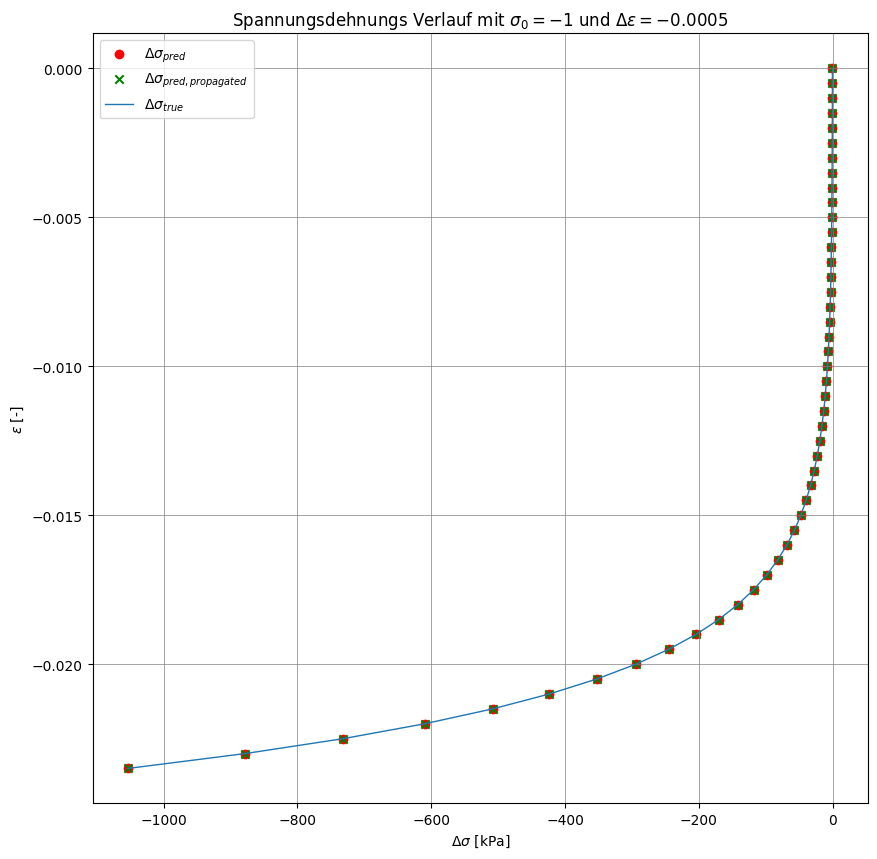

# MODUL PyTorch (Python 3.12)

# Vorhersage des Ödometerversuches implementiert
Ziel war die Implementierung eines neuronalen Netzwerks zur Modellierung des Ödometerversuchs. Dabei wurden gegebene Input-Parameter verarbeitet, um Output-Parameter vorherzusagen.

#### Das Problem ist wie folgt definiert:
$$
\begin{array}{rcl}
    \sigma_{t+1} & = & \sigma_{t}+\Delta\sigma \\ \\
    \Delta\sigma & = & E_s\cdot \Delta\epsilon \\ 
    E_s & = & \frac{1+e_0}{C_c} \cdot \sigma_t
\end{array}
\hspace{2cm}
\begin{array}{l}
    \textbf{Annahmen:} \\ \\
    \text{Startwert d. Iteration: } \sigma_t = 1,00 \\ 
    e_0 = 1,00 \\ 
    C_c = 0,005 \\
    \Delta\epsilon = 0,0005
\end{array}
$$

<br> 

Um das Model zu testen werden wir folgende vorberechnete Werte verwenden: `Input` { $\sigma_t$ }, `Output` { $E_s$ }.
<br>
### Variablendeklaration
- $\sigma_t$ = `sigma_t`
- $\Delta\epsilon$ = `delta_epsilon`
- $\sigma_{t+1}$ = `delta_sigma
- $E_s$ = `e_s`

# Generate random trainingsdata


```python
from random import randint

# Define input and output parameters
input_str = "sigma_t"
output_str = "e_s"

# 0 : simple, 1 : improved
oedo_model = 0

# Defining problem parameters
delta_epsilon = -0.0005
C_c = 0.005
e_0 = 1.0
amount_trainings_data = 100

# Data preparation for
oedo_para = {
    "max_n": 1,
    "e_0": e_0,
    "C_c": C_c,
    "delta_epsilon": delta_epsilon,
}
```

# Load problem and generate trainings data from 00_problem_settings_functions.ipynb

Available classes: `Oedometer` <br>
Returns `list_input` and `list_output` as type `list` <br>
Returns `tensor_input` and `tensor_output` as type `tensor`


```python
from handler.handleData import generate_data
from random import sample

if oedo_model == 0:
    from classes.classOedometerSimple import Oedometer
else:
    from classes.classOedometerSimple import Oedometer
sigma_t_train =  sample(range(-amount_trainings_data * 2,0), amount_trainings_data)

list_input, list_output, tensor_input, tensor_output = generate_data(oedo=oedo_para, oedo_class=Oedometer, sigma_t=sigma_t_train, amount_trainings_data=amount_trainings_data)
```

# Show trainingsdata (List) as DataFrame
Type `list`: `list_input` and `list_output`


```python
import pandas as pd
from pandas import DataFrame

pd.DataFrame([[input_str] + list_input, [output_str] + list_output])
```


<div>
<style scoped>
    .dataframe tbody tr th:only-of-type {
        vertical-align: middle;
    }

    .dataframe tbody tr th {
        vertical-align: top;
    }

    .dataframe thead th {
        text-align: right;
    }
</style>
<table border="1" class="dataframe">
  <thead>
    <tr style="text-align: right;">
      <th></th>
      <th>0</th>
      <th>1</th>
      <th>2</th>
      <th>3</th>
      <th>4</th>
      <th>5</th>
      <th>6</th>
      <th>7</th>
      <th>8</th>
      <th>9</th>
      <th>...</th>
      <th>91</th>
      <th>92</th>
      <th>93</th>
      <th>94</th>
      <th>95</th>
      <th>96</th>
      <th>97</th>
      <th>98</th>
      <th>99</th>
      <th>100</th>
    </tr>
  </thead>
  <tbody>
    <tr>
      <th>0</th>
      <td>sigma_t</td>
      <td>-152.0</td>
      <td>-4.0</td>
      <td>-138.0</td>
      <td>-131.0</td>
      <td>-104.0</td>
      <td>-18.0</td>
      <td>-64.0</td>
      <td>-116.0</td>
      <td>-62.0</td>
      <td>...</td>
      <td>-122.0</td>
      <td>-67.0</td>
      <td>-21.0</td>
      <td>-154.0</td>
      <td>-51.0</td>
      <td>-68.0</td>
      <td>-103.0</td>
      <td>-143.0</td>
      <td>-183.0</td>
      <td>-133.0</td>
    </tr>
    <tr>
      <th>1</th>
      <td>e_s</td>
      <td>60800.0</td>
      <td>1600.0</td>
      <td>55200.0</td>
      <td>52400.0</td>
      <td>41600.0</td>
      <td>7200.0</td>
      <td>25600.0</td>
      <td>46400.0</td>
      <td>24800.0</td>
      <td>...</td>
      <td>48800.0</td>
      <td>26800.0</td>
      <td>8400.0</td>
      <td>61600.0</td>
      <td>20400.0</td>
      <td>27200.0</td>
      <td>41200.0</td>
      <td>57200.0</td>
      <td>73200.0</td>
      <td>53200.0</td>
    </tr>
  </tbody>
</table>
<p>2 rows × 101 columns</p>
</div>


# Show trainingsdata (Tensor) as DataFrame
Type `tensor`: `tensor_input` and `tensor_output`


```python
import torch

tensor_input_df = pd.DataFrame(
    torch.cat((tensor_input, tensor_output), dim=1), columns=[input_str, output_str]
)
tensor_input_df
```


<div>
<style scoped>
    .dataframe tbody tr th:only-of-type {
        vertical-align: middle;
    }

    .dataframe tbody tr th {
        vertical-align: top;
    }

    .dataframe thead th {
        text-align: right;
    }
</style>
<table border="1" class="dataframe">
  <thead>
    <tr style="text-align: right;">
      <th></th>
      <th>sigma_t</th>
      <th>e_s</th>
    </tr>
  </thead>
  <tbody>
    <tr>
      <th>0</th>
      <td>-152.0</td>
      <td>60800.0</td>
    </tr>
    <tr>
      <th>1</th>
      <td>-4.0</td>
      <td>1600.0</td>
    </tr>
    <tr>
      <th>2</th>
      <td>-138.0</td>
      <td>55200.0</td>
    </tr>
    <tr>
      <th>3</th>
      <td>-131.0</td>
      <td>52400.0</td>
    </tr>
    <tr>
      <th>4</th>
      <td>-104.0</td>
      <td>41600.0</td>
    </tr>
    <tr>
      <th>...</th>
      <td>...</td>
      <td>...</td>
    </tr>
    <tr>
      <th>95</th>
      <td>-68.0</td>
      <td>27200.0</td>
    </tr>
    <tr>
      <th>96</th>
      <td>-103.0</td>
      <td>41200.0</td>
    </tr>
    <tr>
      <th>97</th>
      <td>-143.0</td>
      <td>57200.0</td>
    </tr>
    <tr>
      <th>98</th>
      <td>-183.0</td>
      <td>73200.0</td>
    </tr>
    <tr>
      <th>99</th>
      <td>-133.0</td>
      <td>53200.0</td>
    </tr>
  </tbody>
</table>
<p>100 rows × 2 columns</p>
</div>


# Define SimpleRegressor Model


```python
import torch.nn as nn


class SimpleRegressor(nn.Module):
    def __init__(self):
        super(SimpleRegressor, self).__init__()
        self.linear = nn.Linear(1, 1)

    def forward(self, x):
        return self.linear(x)


model = SimpleRegressor()
```


```python
# import torch.nn as nn
# import torch.optim as optim


# class SimpleRegressor(nn.Module):
#     def __init__(self):
#         super(SimpleRegressor, self).__init__()
#         self.model = nn.Sequential(
#             nn.Linear(1, 16),
#             nn.ReLU(),
#             nn.Linear(16, 16),
#             nn.ReLU(),
#             nn.Linear(16, 1)
#         )

#     def forward(self, x):
#         return self.model(x)

# model = SimpleRegressor()
```

# Training


```python
loss_fn = nn.MSELoss()
optimizer = optim.Adam(model.parameters(), lr=1)

epochs = 15000
loss_history = []
for epoch in range(epochs):
    model.train()
    optimizer.zero_grad()
    pred = model(tensor_input)
    loss = loss_fn(pred, tensor_output)
    loss.backward()
    loss_history.append(loss.item())
    optimizer.step()

    if epoch % 100 == 0:
        print(f"Epoch {epoch}: Loss = {loss.item():.6f}")
```

    Epoch 0: Loss = 2102447744.000000
    Epoch 100: Loss = 1214202112.000000
    Epoch 200: Loss = 646068224.000000
    Epoch 300: Loss = 313433408.000000
    Epoch 400: Loss = 137044720.000000
    Epoch 500: Loss = 53486348.000000
    Epoch 600: Loss = 18505246.000000
    Epoch 700: Loss = 5658029.000000
    Epoch 800: Loss = 1537200.125000
    Epoch 900: Loss = 386086.687500
    Epoch 1000: Loss = 106728.296875
    Epoch 1100: Loss = 47967.468750
    Epoch 1200: Loss = 37214.464844
    Epoch 1300: Loss = 35420.816406
    Epoch 1400: Loss = 35047.820312
    Epoch 1500: Loss = 34858.109375
    Epoch 1600: Loss = 34680.734375
    Epoch 1700: Loss = 34495.058594
    Epoch 1800: Loss = 34299.003906
    Epoch 1900: Loss = 34091.867188
    Epoch 2000: Loss = 33873.992188
    Epoch 2100: Loss = 33644.015625
    Epoch 2200: Loss = 33402.621094
    Epoch 2300: Loss = 33148.851562
    Epoch 2400: Loss = 32882.441406
    Epoch 2500: Loss = 32603.572266
    Epoch 2600: Loss = 32311.863281
    Epoch 2700: Loss = 32006.660156
    Epoch 2800: Loss = 31687.800781
    Epoch 2900: Loss = 31354.703125
    Epoch 3000: Loss = 31007.294922
    Epoch 3100: Loss = 30645.845703
    Epoch 3200: Loss = 30268.962891
    Epoch 3300: Loss = 29876.751953
    Epoch 3400: Loss = 29469.654297
    Epoch 3500: Loss = 29046.962891
    Epoch 3600: Loss = 28608.187500
    Epoch 3700: Loss = 28153.484375
    Epoch 3800: Loss = 27682.750000
    Epoch 3900: Loss = 27195.445312
    Epoch 4000: Loss = 26692.035156
    Epoch 4100: Loss = 26172.730469
    Epoch 4200: Loss = 25636.767578
    Epoch 4300: Loss = 25085.119141
    Epoch 4400: Loss = 24517.312500
    Epoch 4500: Loss = 23933.929688
    Epoch 4600: Loss = 23335.462891
    Epoch 4700: Loss = 22721.890625
    Epoch 4800: Loss = 22094.242188
    Epoch 4900: Loss = 21452.744141
    Epoch 5000: Loss = 20798.011719
    Epoch 5100: Loss = 20131.287109
    Epoch 5200: Loss = 19453.222656
    Epoch 5300: Loss = 18764.625000
    Epoch 5400: Loss = 18066.830078
    Epoch 5500: Loss = 17361.458984
    Epoch 5600: Loss = 16649.173828
    Epoch 5700: Loss = 15931.693359
    Epoch 5800: Loss = 15210.907227
    Epoch 5900: Loss = 14488.012695
    Epoch 6000: Loss = 13765.077148
    Epoch 6100: Loss = 13044.018555
    Epoch 6200: Loss = 12326.415039
    Epoch 6300: Loss = 11614.731445
    Epoch 6400: Loss = 10910.835938
    Epoch 6500: Loss = 10216.655273
    Epoch 6600: Loss = 9534.344727
    Epoch 6700: Loss = 8866.425781
    Epoch 6800: Loss = 8214.407227
    Epoch 6900: Loss = 7580.696777
    Epoch 7000: Loss = 6967.015137
    Epoch 7100: Loss = 6375.457520
    Epoch 7200: Loss = 5807.798340
    Epoch 7300: Loss = 5265.377930
    Epoch 7400: Loss = 4749.686035
    Epoch 7500: Loss = 4261.911133
    Epoch 7600: Loss = 3802.946533
    Epoch 7700: Loss = 3373.725586
    Epoch 7800: Loss = 2974.528809
    Epoch 7900: Loss = 2605.645264
    Epoch 8000: Loss = 2267.066650
    Epoch 8100: Loss = 1958.445435
    Epoch 8200: Loss = 1679.131836
    Epoch 8300: Loss = 1428.259277
    Epoch 8400: Loss = 1204.760986
    Epoch 8500: Loss = 1007.423523
    Epoch 8600: Loss = 834.634705
    Epoch 8700: Loss = 684.842957
    Epoch 8800: Loss = 556.197388
    Epoch 8900: Loss = 446.916870
    Epoch 9000: Loss = 355.012299
    Epoch 9100: Loss = 278.697235
    Epoch 9200: Loss = 216.041229
    Epoch 9300: Loss = 165.274048
    Epoch 9400: Loss = 124.718643
    Epoch 9500: Loss = 92.725769
    Epoch 9600: Loss = 67.884392
    Epoch 9700: Loss = 48.896961
    Epoch 9800: Loss = 34.635254
    Epoch 9900: Loss = 24.085737
    Epoch 10000: Loss = 16.439137
    Epoch 10100: Loss = 10.998610
    Epoch 10200: Loss = 7.200392
    Epoch 10300: Loss = 4.611472
    Epoch 10400: Loss = 2.886053
    Epoch 10500: Loss = 1.763548
    Epoch 10600: Loss = 1.048178
    Epoch 10700: Loss = 0.607275
    Epoch 10800: Loss = 0.341127
    Epoch 10900: Loss = 0.185938
    Epoch 11000: Loss = 0.098187
    Epoch 11100: Loss = 0.050135
    Epoch 11200: Loss = 0.024838
    Epoch 11300: Loss = 0.011748
    Epoch 11400: Loss = 0.005379
    Epoch 11500: Loss = 0.002356
    Epoch 11600: Loss = 0.001025
    Epoch 11700: Loss = 0.000411
    Epoch 11800: Loss = 0.000164
    Epoch 11900: Loss = 0.000068
    Epoch 12000: Loss = 0.000034
    Epoch 12100: Loss = 0.000007
    Epoch 12200: Loss = 0.000009
    Epoch 12300: Loss = 0.000000
    Epoch 12400: Loss = 0.000000
    Epoch 12500: Loss = 0.000000
    Epoch 12600: Loss = 0.000000
    Epoch 12700: Loss = 0.000000
    Epoch 12800: Loss = 0.000000
    Epoch 12900: Loss = 0.000000
    Epoch 13000: Loss = 0.000000
    Epoch 13100: Loss = 0.000000
    Epoch 13200: Loss = 0.000000
    Epoch 13300: Loss = 0.000000
    Epoch 13400: Loss = 0.000000
    Epoch 13500: Loss = 0.000000
    Epoch 13600: Loss = 0.000000
    Epoch 13700: Loss = 0.000000
    Epoch 13800: Loss = 0.000000
    Epoch 13900: Loss = 0.000000
    Epoch 14000: Loss = 0.000000
    Epoch 14100: Loss = 0.000000
    Epoch 14200: Loss = 0.000000
    Epoch 14300: Loss = 0.000000
    Epoch 14400: Loss = 0.000000
    Epoch 14500: Loss = 0.000000
    Epoch 14600: Loss = 0.000000
    Epoch 14700: Loss = 0.000000
    Epoch 14800: Loss = 0.000000
    Epoch 14900: Loss = 0.000000


# Loss function


```python
import matplotlib.pyplot as plt

plt.plot(loss_history, label="Loss")
plt.xlabel("Epochs")
plt.ylabel("Train Loss")
plt.show()
```


    

    


# Plot of stress–strain curve


```python
from handler.handleVisuals import plot_result_graph

oedo_para = {
        "max_n": 48,
        "e_0": e_0,
        "C_c": C_c,
        "delta_epsilon": delta_epsilon,
        "sigma_t": -1,
    }

oedo = Oedometer(**oedo_para)

e_s_list, delta_sigma_list = plot_result_graph(model=model, oedo=oedo,iterations=oedo_para["max_n"])
```


    

    


```python
from handler.handleVisuals import plot_result_dataframe
from IPython.display import Markdown, display

plot_result_dataframe(pd, e_s_list, delta_sigma_list)
```

    1.3703320760928561e-06


<div>
<style scoped>
    .dataframe tbody tr th:only-of-type {
        vertical-align: middle;
    }

    .dataframe tbody tr th {
        vertical-align: top;
    }

    .dataframe thead th {
        text-align: right;
    }
</style>
<table border="1" class="dataframe">
  <thead>
    <tr style="text-align: right;">
      <th></th>
      <th>$E_{s,i,true}$</th>
      <th>$E_{s,i,pred}$</th>
      <th>$\Delta E_s$</th>
      <th>|</th>
      <th>$\Delta\sigma_{true}$</th>
      <th>$\Delta\sigma_{pred}$</th>
      <th>$\Delta \sigma$</th>
    </tr>
  </thead>
  <tbody>
    <tr>
      <th>0</th>
      <td>4.000000e+02</td>
      <td>4.000000e+02</td>
      <td>0.0</td>
      <td>|</td>
      <td>-0.200000</td>
      <td>-0.200000</td>
      <td>7.748604e-08</td>
    </tr>
    <tr>
      <th>1</th>
      <td>4.800000e+02</td>
      <td>4.800000e+02</td>
      <td>0.0</td>
      <td>|</td>
      <td>-0.240000</td>
      <td>-0.240000</td>
      <td>9.894371e-08</td>
    </tr>
    <tr>
      <th>2</th>
      <td>5.760000e+02</td>
      <td>5.760000e+02</td>
      <td>0.0</td>
      <td>|</td>
      <td>-0.288000</td>
      <td>-0.288000</td>
      <td>7.700920e-08</td>
    </tr>
    <tr>
      <th>3</th>
      <td>6.912000e+02</td>
      <td>6.912000e+02</td>
      <td>0.0</td>
      <td>|</td>
      <td>-0.345600</td>
      <td>-0.345600</td>
      <td>9.837151e-08</td>
    </tr>
    <tr>
      <th>4</th>
      <td>8.294400e+02</td>
      <td>8.294400e+02</td>
      <td>0.0</td>
      <td>|</td>
      <td>-0.414720</td>
      <td>-0.414720</td>
      <td>5.844116e-08</td>
    </tr>
    <tr>
      <th>5</th>
      <td>9.953280e+02</td>
      <td>9.953280e+02</td>
      <td>0.0</td>
      <td>|</td>
      <td>-0.497664</td>
      <td>-0.497664</td>
      <td>1.237736e-07</td>
    </tr>
    <tr>
      <th>6</th>
      <td>1.194394e+03</td>
      <td>1.194394e+03</td>
      <td>0.0</td>
      <td>|</td>
      <td>-0.597197</td>
      <td>-0.597197</td>
      <td>7.700272e-08</td>
    </tr>
    <tr>
      <th>7</th>
      <td>1.433272e+03</td>
      <td>1.433272e+03</td>
      <td>0.0</td>
      <td>|</td>
      <td>-0.716636</td>
      <td>-0.716636</td>
      <td>2.087769e-08</td>
    </tr>
    <tr>
      <th>8</th>
      <td>1.719927e+03</td>
      <td>1.719927e+03</td>
      <td>0.0</td>
      <td>|</td>
      <td>-0.859963</td>
      <td>-0.859963</td>
      <td>8.465787e-08</td>
    </tr>
    <tr>
      <th>9</th>
      <td>2.063912e+03</td>
      <td>2.063912e+03</td>
      <td>0.0</td>
      <td>|</td>
      <td>-1.031956</td>
      <td>-1.031956</td>
      <td>6.222009e-09</td>
    </tr>
    <tr>
      <th>10</th>
      <td>2.476695e+03</td>
      <td>2.476695e+03</td>
      <td>0.0</td>
      <td>|</td>
      <td>-1.238347</td>
      <td>-1.238347</td>
      <td>7.466411e-09</td>
    </tr>
    <tr>
      <th>11</th>
      <td>2.972033e+03</td>
      <td>2.972033e+03</td>
      <td>0.0</td>
      <td>|</td>
      <td>-1.486017</td>
      <td>-1.486017</td>
      <td>8.959693e-09</td>
    </tr>
    <tr>
      <th>12</th>
      <td>3.566440e+03</td>
      <td>3.566440e+03</td>
      <td>0.0</td>
      <td>|</td>
      <td>-1.783220</td>
      <td>-1.783220</td>
      <td>8.227721e-08</td>
    </tr>
    <tr>
      <th>13</th>
      <td>4.279728e+03</td>
      <td>4.279728e+03</td>
      <td>0.0</td>
      <td>|</td>
      <td>-2.139864</td>
      <td>-2.139864</td>
      <td>3.371512e-07</td>
    </tr>
    <tr>
      <th>14</th>
      <td>5.135674e+03</td>
      <td>5.135674e+03</td>
      <td>0.0</td>
      <td>|</td>
      <td>-2.567837</td>
      <td>-2.567837</td>
      <td>7.079546e-08</td>
    </tr>
    <tr>
      <th>15</th>
      <td>6.162809e+03</td>
      <td>6.162809e+03</td>
      <td>0.0</td>
      <td>|</td>
      <td>-3.081404</td>
      <td>-3.081404</td>
      <td>1.326383e-07</td>
    </tr>
    <tr>
      <th>16</th>
      <td>7.395370e+03</td>
      <td>7.395370e+03</td>
      <td>0.0</td>
      <td>|</td>
      <td>-3.697685</td>
      <td>-3.697685</td>
      <td>3.022171e-07</td>
    </tr>
    <tr>
      <th>17</th>
      <td>8.874444e+03</td>
      <td>8.874444e+03</td>
      <td>0.0</td>
      <td>|</td>
      <td>-4.437222</td>
      <td>-4.437222</td>
      <td>2.672931e-07</td>
    </tr>
    <tr>
      <th>18</th>
      <td>1.064933e+04</td>
      <td>1.064933e+04</td>
      <td>0.0</td>
      <td>|</td>
      <td>-5.324667</td>
      <td>-5.324667</td>
      <td>3.207517e-07</td>
    </tr>
    <tr>
      <th>19</th>
      <td>1.277920e+04</td>
      <td>1.277920e+04</td>
      <td>0.0</td>
      <td>|</td>
      <td>-6.389600</td>
      <td>-6.389600</td>
      <td>2.895346e-07</td>
    </tr>
    <tr>
      <th>20</th>
      <td>1.533504e+04</td>
      <td>1.533504e+04</td>
      <td>0.0</td>
      <td>|</td>
      <td>-7.667520</td>
      <td>-7.667521</td>
      <td>5.381763e-07</td>
    </tr>
    <tr>
      <th>21</th>
      <td>1.840205e+04</td>
      <td>1.840205e+04</td>
      <td>0.0</td>
      <td>|</td>
      <td>-9.201024</td>
      <td>-9.201024</td>
      <td>7.360702e-08</td>
    </tr>
    <tr>
      <th>22</th>
      <td>2.208246e+04</td>
      <td>2.208246e+04</td>
      <td>0.0</td>
      <td>|</td>
      <td>-11.041229</td>
      <td>-11.041229</td>
      <td>4.697981e-07</td>
    </tr>
    <tr>
      <th>23</th>
      <td>2.649895e+04</td>
      <td>2.649895e+04</td>
      <td>0.0</td>
      <td>|</td>
      <td>-13.249475</td>
      <td>-13.249475</td>
      <td>9.452275e-07</td>
    </tr>
    <tr>
      <th>24</th>
      <td>3.179874e+04</td>
      <td>3.179874e+04</td>
      <td>0.0</td>
      <td>|</td>
      <td>-15.899369</td>
      <td>-15.899371</td>
      <td>1.706478e-06</td>
    </tr>
    <tr>
      <th>25</th>
      <td>3.815849e+04</td>
      <td>3.815849e+04</td>
      <td>0.0</td>
      <td>|</td>
      <td>-19.079243</td>
      <td>-19.079245</td>
      <td>1.284834e-06</td>
    </tr>
    <tr>
      <th>26</th>
      <td>4.579018e+04</td>
      <td>4.579018e+04</td>
      <td>0.0</td>
      <td>|</td>
      <td>-22.895092</td>
      <td>-22.895092</td>
      <td>1.592148e-08</td>
    </tr>
    <tr>
      <th>27</th>
      <td>5.494822e+04</td>
      <td>5.494822e+04</td>
      <td>0.0</td>
      <td>|</td>
      <td>-27.474110</td>
      <td>-27.474112</td>
      <td>1.163515e-06</td>
    </tr>
    <tr>
      <th>28</th>
      <td>6.593786e+04</td>
      <td>6.593786e+04</td>
      <td>0.0</td>
      <td>|</td>
      <td>-32.968932</td>
      <td>-32.968937</td>
      <td>4.447976e-06</td>
    </tr>
    <tr>
      <th>29</th>
      <td>7.912544e+04</td>
      <td>7.912544e+04</td>
      <td>0.0</td>
      <td>|</td>
      <td>-39.562719</td>
      <td>-39.562721</td>
      <td>2.285813e-06</td>
    </tr>
    <tr>
      <th>30</th>
      <td>9.495053e+04</td>
      <td>9.495053e+04</td>
      <td>0.0</td>
      <td>|</td>
      <td>-47.475263</td>
      <td>-47.475266</td>
      <td>2.742976e-06</td>
    </tr>
    <tr>
      <th>31</th>
      <td>1.139406e+05</td>
      <td>1.139406e+05</td>
      <td>0.0</td>
      <td>|</td>
      <td>-56.970315</td>
      <td>-56.970314</td>
      <td>-1.286066e-06</td>
    </tr>
    <tr>
      <th>32</th>
      <td>1.367288e+05</td>
      <td>1.367288e+05</td>
      <td>0.0</td>
      <td>|</td>
      <td>-68.364378</td>
      <td>-68.364388</td>
      <td>9.137873e-06</td>
    </tr>
    <tr>
      <th>33</th>
      <td>1.640745e+05</td>
      <td>1.640745e+05</td>
      <td>0.0</td>
      <td>|</td>
      <td>-82.037254</td>
      <td>-82.037262</td>
      <td>7.913690e-06</td>
    </tr>
    <tr>
      <th>34</th>
      <td>1.968894e+05</td>
      <td>1.968894e+05</td>
      <td>0.0</td>
      <td>|</td>
      <td>-98.444705</td>
      <td>-98.444710</td>
      <td>4.918791e-06</td>
    </tr>
    <tr>
      <th>35</th>
      <td>2.362673e+05</td>
      <td>2.362673e+05</td>
      <td>0.0</td>
      <td>|</td>
      <td>-118.133646</td>
      <td>-118.133644</td>
      <td>-1.726845e-06</td>
    </tr>
    <tr>
      <th>36</th>
      <td>2.835207e+05</td>
      <td>2.835207e+05</td>
      <td>0.0</td>
      <td>|</td>
      <td>-141.760375</td>
      <td>-141.760376</td>
      <td>9.795441e-07</td>
    </tr>
    <tr>
      <th>37</th>
      <td>3.402249e+05</td>
      <td>3.402249e+05</td>
      <td>0.0</td>
      <td>|</td>
      <td>-170.112450</td>
      <td>-170.112457</td>
      <td>7.278969e-06</td>
    </tr>
    <tr>
      <th>38</th>
      <td>4.082699e+05</td>
      <td>4.082699e+05</td>
      <td>0.0</td>
      <td>|</td>
      <td>-204.134940</td>
      <td>-204.134949</td>
      <td>8.734762e-06</td>
    </tr>
    <tr>
      <th>39</th>
      <td>4.899239e+05</td>
      <td>4.899239e+05</td>
      <td>0.0</td>
      <td>|</td>
      <td>-244.961928</td>
      <td>-244.961945</td>
      <td>1.658523e-05</td>
    </tr>
    <tr>
      <th>40</th>
      <td>5.879086e+05</td>
      <td>5.879086e+05</td>
      <td>0.0</td>
      <td>|</td>
      <td>-293.954314</td>
      <td>-293.954315</td>
      <td>1.591730e-06</td>
    </tr>
    <tr>
      <th>41</th>
      <td>7.054904e+05</td>
      <td>7.054904e+05</td>
      <td>0.0</td>
      <td>|</td>
      <td>-352.745176</td>
      <td>-352.745178</td>
      <td>1.910075e-06</td>
    </tr>
    <tr>
      <th>42</th>
      <td>8.465884e+05</td>
      <td>8.465884e+05</td>
      <td>0.0</td>
      <td>|</td>
      <td>-423.294212</td>
      <td>-423.294220</td>
      <td>8.395606e-06</td>
    </tr>
    <tr>
      <th>43</th>
      <td>1.015906e+06</td>
      <td>1.015906e+06</td>
      <td>0.0</td>
      <td>|</td>
      <td>-507.953054</td>
      <td>-507.953094</td>
      <td>4.059231e-05</td>
    </tr>
    <tr>
      <th>44</th>
      <td>1.219087e+06</td>
      <td>1.219087e+06</td>
      <td>0.0</td>
      <td>|</td>
      <td>-609.543665</td>
      <td>-609.543640</td>
      <td>-2.453142e-05</td>
    </tr>
    <tr>
      <th>45</th>
      <td>1.462905e+06</td>
      <td>1.462905e+06</td>
      <td>0.0</td>
      <td>|</td>
      <td>-731.452398</td>
      <td>-731.452393</td>
      <td>-5.023643e-06</td>
    </tr>
    <tr>
      <th>46</th>
      <td>1.755486e+06</td>
      <td>1.755486e+06</td>
      <td>0.0</td>
      <td>|</td>
      <td>-877.742877</td>
      <td>-877.742920</td>
      <td>4.279975e-05</td>
    </tr>
    <tr>
      <th>47</th>
      <td>2.106583e+06</td>
      <td>2.106583e+06</td>
      <td>0.0</td>
      <td>|</td>
      <td>-1053.291453</td>
      <td>-1053.291382</td>
      <td>-7.071061e-05</td>
    </tr>
  </tbody>
</table>
</div>


```python

```
