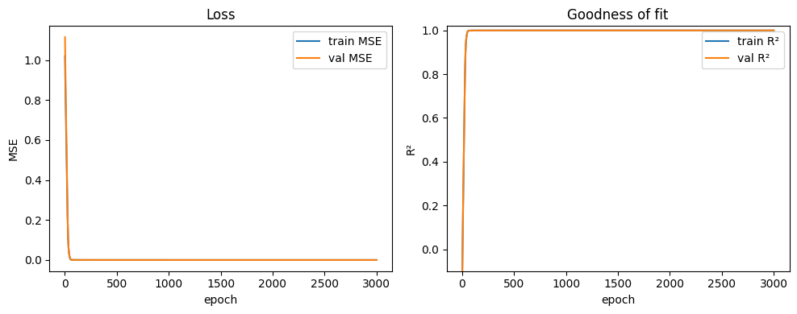

# Vorhersage des Ödometer-Versuchs mit einem neuronalen Netzwerk

**Ziel:**
Entwicklung eines neuronalen Netzes, das auf Basis gegebener Input-Parameter den Elastizitätsmodul $E_s$ im Ödometer-Versuch vorhersagt.

---

## 1. Problemformulierung

Es wird folgende Beziehung zugrunde gelegt:

$$
\dot{\sigma} = C_1\,\sigma_t\,\dot{\varepsilon} + C_2\,\sigma_t\,\left|\dot{\varepsilon}\right|
$$

Diese Gleichung beschreibt die Änderung der Spannung $\dot{\sigma}$ in Abhängigkeit von der aktuellen Spannung $\sigma_t$, der Dehnungsrate $\dot{\varepsilon}$ und den Koeffizienten $C_1, C_2$, die aus dem gewählten Modell abgeleitet sind.

---

## 2. Annahmen / Startwerte

Die Berechnung basiert auf folgenden festen Parametern:

- **Startspannung:** $\sigma_0 = -1{,}00\,\text{kPa}$
- **Porenverhältnis:** $e_0 = 1{,}00$
- **Koeffizienten:**
  - $C_c = 0{,}005$
  - $C_s = 0{,}002$
- **Dehnungsraten:**
  - Stauchungsphase: $\dot{\varepsilon}_c = -0{,}0005$
  - Dehnungsphase: $\dot{\varepsilon}_e = +0{,}0005$

---

## 3. Trainingssetup

- **Input:**
  $\sigma_t$, $\dot{\varepsilon}$
- **Output:**
  Elastizitätsmodul $E_s$

Das neuronale Netz soll aus den aktuellen Zustandsgrößen ($\sigma_t$, $\dot{\varepsilon}$) lernen, in welcher Phase (Kompression vs. Entlastung) sich der Versuch befindet, und darauf basierend $E_s$ schätzen.

---

## 4. Variablendeklaration

| Symbol              | Variable im Code     | Bedeutung |
|---------------------|----------------------|-----------|
| $\sigma_t$          | `sigma_t`            | Aktuelle Spannung zum Zeitpunkt $t$ |
| $\dot{\varepsilon}$ | `delta_epsilon`      | Dehnungsrate; negative Werte: Kompression, positive: Entlastung |
| $\dot\sigma_t$      | `delta_sigma`        | Inkrementelle Änderung der Spannung |
| $E_s$               | `e_s`                | Elastizitätsmodul (Zielgröße) |
| $e_0$               | `e_0`                | Porenverhältniszahl |

---

## 5. Hinweise zur Phase

Die Phase (Stauchung vs. Dehnung) lässt sich über das Vorzeichen von $\dot{\varepsilon}$ ablesen. Alternativ kann explizit ein Zustandsindikator (z. B. one-hot oder diskrete Labels für Belastung/Entlastung) zusätzlich als Feature mitgegeben werden, um dem Modell das Unterscheiden zu erleichtern.


# Data generation


```python
from handler.handleMetaData import *

oedo_model = 1

param_spec = {
    "e0": 1.0,
    "c_c": 0.005,
    "c_s": 0.002,
    "sigma_prime_p": [-.8, -1.5],
    "sigma_max": [-900, -1100],
    "sigma_min": [-90, -110],
    "eps_delta": -0.0005,
    "eps_0": 0,
}

para_data = {
    "n_runs": 30,
    "final_samples": 500,
    "features_keys": ("sigma_0","eps_delta"),
    "target_keys": ("e_s"),
    "seed": 8,
}

tX_raw, tY_raw, info = generate_oedometer_dataset(param_spec,
                                                  n_runs=para_data["n_runs"],
                                                  final_samples=para_data["final_samples"],
                                                  oedo_model=oedo_model,
                                                  seed=para_data["seed"],
                                                  feature_keys=para_data["features_keys"],
                                                  target_key=para_data["target_keys"]
                                                  )

export_dataset_for_html(info, out_dir="oedo-viewer/viewer_data/")

schema = export_oedometer_schema(
    feature_keys=para_data["features_keys"],
    target_key=para_data["target_keys"],
    origin="generate_oedometer_dataset",
    n_runs=para_data["n_runs"],
    final_samples=para_data["final_samples"],
    seed=para_data["seed"],
    path="oedo-viewer/viewer_data/schema.json",
)
```

    [OK] exportiert: oedo-viewer/viewer_data/samples.csv  /  oedo-viewer/viewer_data/runs.csv


```python
tX, tY, meta = compose_dataset_from_files(
    samples_csv="oedo-viewer/viewer_data/samples.csv",
    additional_runs_csv="oedo-viewer/viewer_data/additional_runs.csv",  # oder runs.csv
    schema_json="oedo-viewer/viewer_data/schema.json",
    join_key="global_idx",
    join_how="left",
    # WICHTIG: runs/additional_runs haben keinen Key -> aus Zeilennummer bauen
    additional_index_from_row=True,
    additional_index_start=0,  # stell auf 1, wenn deine Samples 1-basiert zählen
    # samples hat i.d.R. die Spalte; falls nicht:
    samples_index_from_row=False,
    samples_index_start=0,
    # Auswahl (optional)
    include_additional_features=None,  # None => alle F:
    include_additional_targets=None,  # None => alle T:
    # Datenqualität
    dropna=True,
    # Normalisierung
    normalize=True,
    scaler_path="scalers.joblib",
    refit_scaler=True,
    # Export
    additional_samples_out="oedo-viewer/viewer_data/additional_samples.csv",
)
print(tX.shape)
print(tY.shape)
```

    torch.Size([500, 2])
    torch.Size([500, 1])


# Training


```python
from nn_model.model import train_eval_save
model, splits, history_df, test_metrics_df = train_eval_save(
    X=tX, y=tY,
    feature_names=meta["feature_names"],
    additional_samples_csv=meta["additional_samples_path"],
    join_key=meta["join_key"],
    model_name="piecewise_relu",                  # swap to "piecewise_tanh", etc.
    model_kwargs=dict(width=32, depth=2),
    split_ratios=(0.70, 0.15, 0.15),              # set your own ratios
    split_seed=123,
    epochs=3000,
    out_dir="oedo-viewer/viewer_data/"                        # writes 3 CSVs here
)

```

    ep   25 | train MSE 1.5601e-01  RMSE 3.8953e-01  MAE 1.7371e-01  R² 0.8355 | val MSE 1.5475e-01  RMSE 3.9338e-01  MAE 1.5532e-01  R² 0.8474
    ep   50 | train MSE 1.0917e-02  RMSE 1.0414e-01  MAE 5.8362e-02  R² 0.9880 | val MSE 1.1930e-02  RMSE 1.0922e-01  MAE 5.4946e-02  R² 0.9882
    ep   75 | train MSE 8.6011e-04  RMSE 2.9191e-02  MAE 1.4447e-02  R² 0.9991 | val MSE 1.2555e-03  RMSE 3.5433e-02  MAE 1.4890e-02  R² 0.9988
    ep  100 | train MSE 3.2498e-04  RMSE 1.7858e-02  MAE 8.1905e-03  R² 0.9997 | val MSE 5.8755e-04  RMSE 2.4239e-02  MAE 8.7179e-03  R² 0.9994
    ep  125 | train MSE 1.9165e-04  RMSE 1.3632e-02  MAE 5.6353e-03  R² 0.9998 | val MSE 4.1122e-04  RMSE 2.0279e-02  MAE 6.3476e-03  R² 0.9996
    ep  150 | train MSE 1.2824e-04  RMSE 1.1112e-02  MAE 4.4475e-03  R² 0.9999 | val MSE 3.1604e-04  RMSE 1.7778e-02  MAE 5.1265e-03  R² 0.9997
    ep  175 | train MSE 8.8890e-05  RMSE 9.2587e-03  MAE 3.8483e-03  R² 0.9999 | val MSE 2.4826e-04  RMSE 1.5756e-02  MAE 4.4844e-03  R² 0.9998
    ep  200 | train MSE 6.2645e-05  RMSE 7.7687e-03  MAE 3.1465e-03  R² 0.9999 | val MSE 1.9946e-04  RMSE 1.4123e-02  MAE 3.8069e-03  R² 0.9998
    ep  225 | train MSE 4.6220e-05  RMSE 6.6782e-03  MAE 2.6133e-03  R² 1.0000 | val MSE 1.6406e-04  RMSE 1.2809e-02  MAE 3.2737e-03  R² 0.9998
    ep  250 | train MSE 3.5613e-05  RMSE 5.8596e-03  MAE 2.4891e-03  R² 1.0000 | val MSE 1.4211e-04  RMSE 1.1921e-02  MAE 3.1024e-03  R² 0.9999
    ep  275 | train MSE 2.8311e-05  RMSE 5.2438e-03  MAE 2.2020e-03  R² 1.0000 | val MSE 1.2147e-04  RMSE 1.1021e-02  MAE 2.7464e-03  R² 0.9999
    ep  300 | train MSE 2.3846e-05  RMSE 4.8279e-03  MAE 2.0561e-03  R² 1.0000 | val MSE 1.0486e-04  RMSE 1.0240e-02  MAE 2.5072e-03  R² 0.9999
    ep  325 | train MSE 2.0524e-05  RMSE 4.4831e-03  MAE 1.8657e-03  R² 1.0000 | val MSE 9.4893e-05  RMSE 9.7413e-03  MAE 2.3630e-03  R² 0.9999
    ep  350 | train MSE 1.7970e-05  RMSE 4.1949e-03  MAE 1.7231e-03  R² 1.0000 | val MSE 8.7341e-05  RMSE 9.3456e-03  MAE 2.2274e-03  R² 0.9999
    ep  375 | train MSE 1.6533e-05  RMSE 4.0260e-03  MAE 1.7576e-03  R² 1.0000 | val MSE 8.4644e-05  RMSE 9.2002e-03  MAE 2.2282e-03  R² 0.9999
    ep  400 | train MSE 1.5157e-05  RMSE 3.8564e-03  MAE 1.6395e-03  R² 1.0000 | val MSE 7.9775e-05  RMSE 8.9317e-03  MAE 2.1307e-03  R² 0.9999
    ep  425 | train MSE 1.4354e-05  RMSE 3.7478e-03  MAE 1.8066e-03  R² 1.0000 | val MSE 7.8804e-05  RMSE 8.8772e-03  MAE 2.3821e-03  R² 0.9999
    ep  450 | train MSE 1.2792e-05  RMSE 3.5464e-03  MAE 1.4253e-03  R² 1.0000 | val MSE 7.2455e-05  RMSE 8.5121e-03  MAE 1.9157e-03  R² 0.9999
    ep  475 | train MSE 1.2041e-05  RMSE 3.4347e-03  MAE 1.5735e-03  R² 1.0000 | val MSE 7.1577e-05  RMSE 8.4603e-03  MAE 2.1284e-03  R² 0.9999
    ep  500 | train MSE 1.1061e-05  RMSE 3.2940e-03  MAE 1.4032e-03  R² 1.0000 | val MSE 6.9161e-05  RMSE 8.3163e-03  MAE 1.8889e-03  R² 0.9999
    ep  525 | train MSE 1.0433e-05  RMSE 3.2025e-03  MAE 1.4062e-03  R² 1.0000 | val MSE 6.6395e-05  RMSE 8.1483e-03  MAE 1.8786e-03  R² 0.9999
    ep  550 | train MSE 9.8624e-06  RMSE 3.1166e-03  MAE 1.4010e-03  R² 1.0000 | val MSE 6.3561e-05  RMSE 7.9725e-03  MAE 1.9537e-03  R² 0.9999
    ep  575 | train MSE 9.5516e-06  RMSE 3.0642e-03  MAE 1.4872e-03  R² 1.0000 | val MSE 6.3389e-05  RMSE 7.9617e-03  MAE 2.0583e-03  R² 0.9999
    ep  600 | train MSE 8.7141e-06  RMSE 2.9252e-03  MAE 1.2650e-03  R² 1.0000 | val MSE 6.1724e-05  RMSE 7.8564e-03  MAE 1.7598e-03  R² 0.9999
    ep  625 | train MSE 8.0842e-06  RMSE 2.8187e-03  MAE 1.1752e-03  R² 1.0000 | val MSE 5.9295e-05  RMSE 7.7003e-03  MAE 1.6905e-03  R² 0.9999
    ep  650 | train MSE 7.7906e-06  RMSE 2.7621e-03  MAE 1.1382e-03  R² 1.0000 | val MSE 5.7582e-05  RMSE 7.5883e-03  MAE 1.6800e-03  R² 0.9999
    ep  675 | train MSE 7.4246e-06  RMSE 2.6964e-03  MAE 1.1047e-03  R² 1.0000 | val MSE 5.6914e-05  RMSE 7.5442e-03  MAE 1.6695e-03  R² 0.9999
    ep  700 | train MSE 6.8957e-06  RMSE 2.5969e-03  MAE 1.0471e-03  R² 1.0000 | val MSE 5.6242e-05  RMSE 7.4994e-03  MAE 1.5806e-03  R² 0.9999
    ep  725 | train MSE 6.3613e-06  RMSE 2.4889e-03  MAE 1.0135e-03  R² 1.0000 | val MSE 5.5923e-05  RMSE 7.4781e-03  MAE 1.5758e-03  R² 0.9999
    ep  750 | train MSE 6.2046e-06  RMSE 2.4593e-03  MAE 1.1202e-03  R² 1.0000 | val MSE 5.4907e-05  RMSE 7.4099e-03  MAE 1.6799e-03  R² 0.9999
    ep  775 | train MSE 6.0587e-06  RMSE 2.4241e-03  MAE 1.0136e-03  R² 1.0000 | val MSE 5.6103e-05  RMSE 7.4902e-03  MAE 1.5613e-03  R² 0.9999
    ep  800 | train MSE 5.8273e-06  RMSE 2.3784e-03  MAE 9.7708e-04  R² 1.0000 | val MSE 5.5006e-05  RMSE 7.4166e-03  MAE 1.5189e-03  R² 0.9999
    ep  825 | train MSE 5.7744e-06  RMSE 2.3598e-03  MAE 9.6599e-04  R² 1.0000 | val MSE 5.6983e-05  RMSE 7.5487e-03  MAE 1.4658e-03  R² 0.9999
    ep  850 | train MSE 5.7607e-06  RMSE 2.3634e-03  MAE 9.2080e-04  R² 1.0000 | val MSE 5.4382e-05  RMSE 7.3744e-03  MAE 1.4468e-03  R² 0.9999
    ep  875 | train MSE 5.5995e-06  RMSE 2.3194e-03  MAE 9.8136e-04  R² 1.0000 | val MSE 5.7259e-05  RMSE 7.5669e-03  MAE 1.5288e-03  R² 0.9999
    ep  900 | train MSE 5.1515e-06  RMSE 2.2261e-03  MAE 9.4025e-04  R² 1.0000 | val MSE 5.5243e-05  RMSE 7.4326e-03  MAE 1.4767e-03  R² 0.9999
    ep  925 | train MSE 4.9828e-06  RMSE 2.1970e-03  MAE 1.0497e-03  R² 1.0000 | val MSE 5.5279e-05  RMSE 7.4350e-03  MAE 1.6149e-03  R² 0.9999
    ep  950 | train MSE 5.0347e-06  RMSE 2.2076e-03  MAE 9.7250e-04  R² 1.0000 | val MSE 5.7632e-05  RMSE 7.5916e-03  MAE 1.4885e-03  R² 0.9999
    ep  975 | train MSE 4.7611e-06  RMSE 2.1397e-03  MAE 8.8115e-04  R² 1.0000 | val MSE 5.8566e-05  RMSE 7.6528e-03  MAE 1.5122e-03  R² 0.9999
    ep 1000 | train MSE 4.7988e-06  RMSE 2.1468e-03  MAE 9.0869e-04  R² 1.0000 | val MSE 6.0078e-05  RMSE 7.7510e-03  MAE 1.4906e-03  R² 0.9999
    ep 1025 | train MSE 4.4054e-06  RMSE 2.0585e-03  MAE 8.8086e-04  R² 1.0000 | val MSE 5.7553e-05  RMSE 7.5864e-03  MAE 1.5092e-03  R² 0.9999
    ep 1050 | train MSE 4.2244e-06  RMSE 2.0125e-03  MAE 8.8700e-04  R² 1.0000 | val MSE 5.8151e-05  RMSE 7.6257e-03  MAE 1.5283e-03  R² 0.9999
    ep 1075 | train MSE 4.0720e-06  RMSE 1.9760e-03  MAE 8.6062e-04  R² 1.0000 | val MSE 5.7817e-05  RMSE 7.6037e-03  MAE 1.5062e-03  R² 0.9999
    ep 1100 | train MSE 4.5400e-06  RMSE 2.0928e-03  MAE 9.8750e-04  R² 1.0000 | val MSE 5.6186e-05  RMSE 7.4957e-03  MAE 1.5428e-03  R² 0.9999
    ep 1125 | train MSE 3.9261e-06  RMSE 1.9416e-03  MAE 9.1401e-04  R² 1.0000 | val MSE 5.9451e-05  RMSE 7.7105e-03  MAE 1.6220e-03  R² 0.9999
    ep 1150 | train MSE 3.7400e-06  RMSE 1.8935e-03  MAE 8.8843e-04  R² 1.0000 | val MSE 5.9838e-05  RMSE 7.7355e-03  MAE 1.5783e-03  R² 0.9999
    ep 1175 | train MSE 3.5683e-06  RMSE 1.8547e-03  MAE 8.6277e-04  R² 1.0000 | val MSE 5.8687e-05  RMSE 7.6608e-03  MAE 1.5222e-03  R² 0.9999
    ep 1200 | train MSE 3.5695e-06  RMSE 1.8552e-03  MAE 8.5812e-04  R² 1.0000 | val MSE 5.7170e-05  RMSE 7.5611e-03  MAE 1.5731e-03  R² 0.9999
    ep 1225 | train MSE 3.6082e-06  RMSE 1.8719e-03  MAE 9.0739e-04  R² 1.0000 | val MSE 5.6399e-05  RMSE 7.5099e-03  MAE 1.6138e-03  R² 0.9999
    ep 1250 | train MSE 3.9435e-06  RMSE 1.9576e-03  MAE 1.0143e-03  R² 1.0000 | val MSE 5.7756e-05  RMSE 7.5997e-03  MAE 1.6637e-03  R² 0.9999
    ep 1275 | train MSE 3.3857e-06  RMSE 1.8110e-03  MAE 9.1517e-04  R² 1.0000 | val MSE 6.0038e-05  RMSE 7.7484e-03  MAE 1.6011e-03  R² 0.9999
    ep 1300 | train MSE 3.2907e-06  RMSE 1.7888e-03  MAE 8.6473e-04  R² 1.0000 | val MSE 5.4875e-05  RMSE 7.4078e-03  MAE 1.5315e-03  R² 0.9999
    ep 1325 | train MSE 3.8045e-06  RMSE 1.9304e-03  MAE 1.0389e-03  R² 1.0000 | val MSE 5.3482e-05  RMSE 7.3132e-03  MAE 1.5652e-03  R² 0.9999
    ep 1350 | train MSE 3.5277e-06  RMSE 1.8605e-03  MAE 9.9967e-04  R² 1.0000 | val MSE 5.3755e-05  RMSE 7.3318e-03  MAE 1.6407e-03  R² 0.9999
    ep 1375 | train MSE 3.4717e-06  RMSE 1.8385e-03  MAE 9.4299e-04  R² 1.0000 | val MSE 5.5621e-05  RMSE 7.4579e-03  MAE 1.5914e-03  R² 0.9999
    ep 1400 | train MSE 3.5267e-06  RMSE 1.8483e-03  MAE 9.1783e-04  R² 1.0000 | val MSE 6.0438e-05  RMSE 7.7742e-03  MAE 1.6601e-03  R² 0.9999
    ep 1425 | train MSE 3.4479e-06  RMSE 1.8334e-03  MAE 9.8511e-04  R² 1.0000 | val MSE 5.9690e-05  RMSE 7.7259e-03  MAE 1.7410e-03  R² 0.9999
    ep 1450 | train MSE 3.5941e-06  RMSE 1.8715e-03  MAE 9.2522e-04  R² 1.0000 | val MSE 5.7916e-05  RMSE 7.6102e-03  MAE 1.6276e-03  R² 0.9999
    ep 1475 | train MSE 3.3869e-06  RMSE 1.8151e-03  MAE 9.2002e-04  R² 1.0000 | val MSE 6.1314e-05  RMSE 7.8303e-03  MAE 1.6206e-03  R² 0.9999
    ep 1500 | train MSE 3.4602e-06  RMSE 1.8445e-03  MAE 9.6370e-04  R² 1.0000 | val MSE 5.3850e-05  RMSE 7.3383e-03  MAE 1.6301e-03  R² 0.9999
    ep 1525 | train MSE 3.3950e-06  RMSE 1.8276e-03  MAE 1.1351e-03  R² 1.0000 | val MSE 5.2370e-05  RMSE 7.2367e-03  MAE 1.7377e-03  R² 0.9999
    ep 1550 | train MSE 2.7536e-06  RMSE 1.6415e-03  MAE 8.7896e-04  R² 1.0000 | val MSE 5.5667e-05  RMSE 7.4610e-03  MAE 1.5472e-03  R² 0.9999
    ep 1575 | train MSE 2.8712e-06  RMSE 1.6695e-03  MAE 8.9541e-04  R² 1.0000 | val MSE 5.8519e-05  RMSE 7.6498e-03  MAE 1.5440e-03  R² 0.9999
    ep 1600 | train MSE 3.2471e-06  RMSE 1.7859e-03  MAE 1.1628e-03  R² 1.0000 | val MSE 5.7475e-05  RMSE 7.5813e-03  MAE 1.8377e-03  R² 0.9999
    ep 1625 | train MSE 3.0860e-06  RMSE 1.7367e-03  MAE 1.0008e-03  R² 1.0000 | val MSE 5.2736e-05  RMSE 7.2619e-03  MAE 1.5785e-03  R² 0.9999
    ep 1650 | train MSE 2.7114e-06  RMSE 1.6216e-03  MAE 9.2633e-04  R² 1.0000 | val MSE 5.8505e-05  RMSE 7.6488e-03  MAE 1.5822e-03  R² 0.9999
    ep 1675 | train MSE 4.7572e-06  RMSE 2.1558e-03  MAE 1.5594e-03  R² 1.0000 | val MSE 6.4328e-05  RMSE 8.0205e-03  MAE 2.2149e-03  R² 0.9999
    ep 1700 | train MSE 3.1511e-06  RMSE 1.7622e-03  MAE 1.2231e-03  R² 1.0000 | val MSE 5.2390e-05  RMSE 7.2381e-03  MAE 1.8316e-03  R² 0.9999
    ep 1725 | train MSE 2.6236e-06  RMSE 1.5848e-03  MAE 8.3861e-04  R² 1.0000 | val MSE 5.6392e-05  RMSE 7.5095e-03  MAE 1.4878e-03  R² 0.9999
    ep 1750 | train MSE 2.6774e-06  RMSE 1.6155e-03  MAE 9.0508e-04  R² 1.0000 | val MSE 5.7438e-05  RMSE 7.5788e-03  MAE 1.5788e-03  R² 0.9999
    ep 1775 | train MSE 2.2689e-06  RMSE 1.4908e-03  MAE 8.3088e-04  R² 1.0000 | val MSE 5.4757e-05  RMSE 7.3998e-03  MAE 1.4854e-03  R² 0.9999
    ep 1800 | train MSE 3.4030e-06  RMSE 1.8133e-03  MAE 1.1294e-03  R² 1.0000 | val MSE 6.3263e-05  RMSE 7.9538e-03  MAE 1.8641e-03  R² 0.9999
    ep 1825 | train MSE 2.9493e-06  RMSE 1.6852e-03  MAE 1.0261e-03  R² 1.0000 | val MSE 6.1796e-05  RMSE 7.8610e-03  MAE 1.7669e-03  R² 0.9999
    ep 1850 | train MSE 2.9522e-06  RMSE 1.6984e-03  MAE 1.1865e-03  R² 1.0000 | val MSE 5.6029e-05  RMSE 7.4853e-03  MAE 1.8612e-03  R² 0.9999
    ep 1875 | train MSE 2.4292e-06  RMSE 1.5465e-03  MAE 9.4963e-04  R² 1.0000 | val MSE 5.0907e-05  RMSE 7.1349e-03  MAE 1.6284e-03  R² 0.9999
    ep 1900 | train MSE 2.8659e-06  RMSE 1.6815e-03  MAE 1.1732e-03  R² 1.0000 | val MSE 5.3870e-05  RMSE 7.3396e-03  MAE 1.8744e-03  R² 0.9999
    ep 1925 | train MSE 3.1876e-06  RMSE 1.7620e-03  MAE 1.2436e-03  R² 1.0000 | val MSE 6.0691e-05  RMSE 7.7904e-03  MAE 2.0571e-03  R² 0.9999
    ep 1950 | train MSE 2.5334e-06  RMSE 1.5689e-03  MAE 9.4395e-04  R² 1.0000 | val MSE 5.1855e-05  RMSE 7.2010e-03  MAE 1.6487e-03  R² 0.9999
    ep 1975 | train MSE 5.4233e-06  RMSE 2.3229e-03  MAE 1.8429e-03  R² 1.0000 | val MSE 5.2214e-05  RMSE 7.2260e-03  MAE 2.6161e-03  R² 0.9999
    ep 2000 | train MSE 3.8404e-06  RMSE 1.9345e-03  MAE 1.2609e-03  R² 1.0000 | val MSE 5.3129e-05  RMSE 7.2889e-03  MAE 1.8557e-03  R² 0.9999
    ep 2025 | train MSE 3.0352e-06  RMSE 1.7327e-03  MAE 1.2174e-03  R² 1.0000 | val MSE 5.0102e-05  RMSE 7.0783e-03  MAE 1.9411e-03  R² 1.0000
    ep 2050 | train MSE 2.4729e-06  RMSE 1.5400e-03  MAE 8.7156e-04  R² 1.0000 | val MSE 5.5723e-05  RMSE 7.4648e-03  MAE 1.5624e-03  R² 0.9999
    ep 2075 | train MSE 2.5844e-06  RMSE 1.5902e-03  MAE 9.5717e-04  R² 1.0000 | val MSE 4.7356e-05  RMSE 6.8816e-03  MAE 1.5671e-03  R² 1.0000
    ep 2100 | train MSE 3.4721e-06  RMSE 1.8335e-03  MAE 1.2976e-03  R² 1.0000 | val MSE 6.1649e-05  RMSE 7.8517e-03  MAE 1.8653e-03  R² 0.9999
    ep 2125 | train MSE 4.6618e-06  RMSE 2.1521e-03  MAE 1.6101e-03  R² 1.0000 | val MSE 5.7911e-05  RMSE 7.6099e-03  MAE 2.3699e-03  R² 0.9999
    ep 2150 | train MSE 2.7596e-06  RMSE 1.6232e-03  MAE 9.3554e-04  R² 1.0000 | val MSE 5.5510e-05  RMSE 7.4505e-03  MAE 1.5616e-03  R² 0.9999
    ep 2175 | train MSE 9.0017e-06  RMSE 2.9938e-03  MAE 2.4577e-03  R² 1.0000 | val MSE 5.5417e-05  RMSE 7.4442e-03  MAE 3.1089e-03  R² 0.9999
    ep 2200 | train MSE 2.5666e-06  RMSE 1.5659e-03  MAE 8.7113e-04  R² 1.0000 | val MSE 5.7388e-05  RMSE 7.5755e-03  MAE 1.4711e-03  R² 0.9999
    ep 2225 | train MSE 2.5936e-06  RMSE 1.5656e-03  MAE 9.4453e-04  R² 1.0000 | val MSE 6.1495e-05  RMSE 7.8419e-03  MAE 1.6187e-03  R² 0.9999
    ep 2250 | train MSE 2.7834e-06  RMSE 1.6404e-03  MAE 1.0673e-03  R² 1.0000 | val MSE 5.7358e-05  RMSE 7.5735e-03  MAE 1.7789e-03  R² 0.9999
    ep 2275 | train MSE 3.3576e-06  RMSE 1.8205e-03  MAE 1.3548e-03  R² 1.0000 | val MSE 4.8298e-05  RMSE 6.9497e-03  MAE 1.8713e-03  R² 1.0000
    ep 2300 | train MSE 4.7069e-06  RMSE 2.1595e-03  MAE 1.6224e-03  R² 1.0000 | val MSE 5.5072e-05  RMSE 7.4211e-03  MAE 2.2729e-03  R² 0.9999
    ep 2325 | train MSE 3.0750e-06  RMSE 1.7193e-03  MAE 1.1240e-03  R² 1.0000 | val MSE 6.2565e-05  RMSE 7.9098e-03  MAE 1.8727e-03  R² 0.9999
    ep 2350 | train MSE 3.1755e-06  RMSE 1.7706e-03  MAE 1.3213e-03  R² 1.0000 | val MSE 5.4676e-05  RMSE 7.3943e-03  MAE 1.9859e-03  R² 0.9999
    ep 2375 | train MSE 2.3467e-06  RMSE 1.4892e-03  MAE 8.6793e-04  R² 1.0000 | val MSE 6.2546e-05  RMSE 7.9086e-03  MAE 1.5321e-03  R² 0.9999
    ep 2400 | train MSE 2.6430e-06  RMSE 1.6074e-03  MAE 9.5141e-04  R² 1.0000 | val MSE 5.6142e-05  RMSE 7.4928e-03  MAE 1.5952e-03  R² 0.9999
    ep 2425 | train MSE 2.1329e-06  RMSE 1.4263e-03  MAE 8.3662e-04  R² 1.0000 | val MSE 5.1725e-05  RMSE 7.1920e-03  MAE 1.3906e-03  R² 0.9999
    ep 2450 | train MSE 1.9680e-06  RMSE 1.3877e-03  MAE 7.6944e-04  R² 1.0000 | val MSE 4.8798e-05  RMSE 6.9855e-03  MAE 1.3381e-03  R² 1.0000
    ep 2475 | train MSE 2.2508e-06  RMSE 1.4633e-03  MAE 7.9331e-04  R² 1.0000 | val MSE 5.9974e-05  RMSE 7.7443e-03  MAE 1.4730e-03  R² 0.9999
    ep 2500 | train MSE 2.1304e-06  RMSE 1.4342e-03  MAE 8.6131e-04  R² 1.0000 | val MSE 5.4008e-05  RMSE 7.3490e-03  MAE 1.4865e-03  R² 0.9999
    ep 2525 | train MSE 4.4399e-06  RMSE 2.0805e-03  MAE 1.4774e-03  R² 1.0000 | val MSE 6.1352e-05  RMSE 7.8328e-03  MAE 1.9924e-03  R² 0.9999
    ep 2550 | train MSE 7.4391e-06  RMSE 2.7224e-03  MAE 1.7964e-03  R² 1.0000 | val MSE 4.6925e-05  RMSE 6.8502e-03  MAE 2.4006e-03  R² 1.0000
    ep 2575 | train MSE 2.3784e-06  RMSE 1.5351e-03  MAE 9.3203e-04  R² 1.0000 | val MSE 5.2148e-05  RMSE 7.2213e-03  MAE 1.3821e-03  R² 0.9999
    ep 2600 | train MSE 2.5444e-06  RMSE 1.5752e-03  MAE 9.9735e-04  R² 1.0000 | val MSE 5.0500e-05  RMSE 7.1064e-03  MAE 1.5370e-03  R² 1.0000
    ep 2625 | train MSE 1.9660e-06  RMSE 1.3969e-03  MAE 8.6291e-04  R² 1.0000 | val MSE 4.7267e-05  RMSE 6.8751e-03  MAE 1.5015e-03  R² 1.0000
    ep 2650 | train MSE 2.4942e-06  RMSE 1.5657e-03  MAE 1.0164e-03  R² 1.0000 | val MSE 5.4293e-05  RMSE 7.3684e-03  MAE 1.6316e-03  R² 0.9999
    ep 2675 | train MSE 2.3212e-06  RMSE 1.5129e-03  MAE 1.0087e-03  R² 1.0000 | val MSE 5.1373e-05  RMSE 7.1675e-03  MAE 1.6819e-03  R² 0.9999
    ep 2700 | train MSE 2.9808e-06  RMSE 1.7088e-03  MAE 1.1431e-03  R² 1.0000 | val MSE 5.1567e-05  RMSE 7.1810e-03  MAE 1.6196e-03  R² 0.9999
    ep 2725 | train MSE 2.8818e-06  RMSE 1.6847e-03  MAE 1.1054e-03  R² 1.0000 | val MSE 5.2937e-05  RMSE 7.2758e-03  MAE 1.8532e-03  R² 0.9999
    ep 2750 | train MSE 2.6401e-06  RMSE 1.6011e-03  MAE 1.1235e-03  R² 1.0000 | val MSE 5.4656e-05  RMSE 7.3930e-03  MAE 1.7238e-03  R² 0.9999
    ep 2775 | train MSE 6.8711e-06  RMSE 2.6171e-03  MAE 1.7534e-03  R² 1.0000 | val MSE 4.2670e-05  RMSE 6.5322e-03  MAE 2.2869e-03  R² 1.0000
    ep 2800 | train MSE 5.2043e-06  RMSE 2.2557e-03  MAE 1.5554e-03  R² 1.0000 | val MSE 5.5556e-05  RMSE 7.4536e-03  MAE 2.2408e-03  R² 0.9999
    ep 2825 | train MSE 3.5402e-06  RMSE 1.8544e-03  MAE 1.3699e-03  R² 1.0000 | val MSE 6.0862e-05  RMSE 7.8014e-03  MAE 2.0937e-03  R² 0.9999
    ep 2850 | train MSE 2.8785e-06  RMSE 1.6756e-03  MAE 1.0512e-03  R² 1.0000 | val MSE 4.7641e-05  RMSE 6.9022e-03  MAE 1.5745e-03  R² 1.0000
    ep 2875 | train MSE 1.7598e-06  RMSE 1.3073e-03  MAE 8.2136e-04  R² 1.0000 | val MSE 4.4964e-05  RMSE 6.7055e-03  MAE 1.3681e-03  R² 1.0000
    ep 2900 | train MSE 2.4289e-06  RMSE 1.5492e-03  MAE 8.2623e-04  R² 1.0000 | val MSE 4.8303e-05  RMSE 6.9500e-03  MAE 1.3488e-03  R² 1.0000
    ep 2925 | train MSE 1.8786e-05  RMSE 4.3104e-03  MAE 2.8036e-03  R² 1.0000 | val MSE 6.9497e-05  RMSE 8.3365e-03  MAE 3.0858e-03  R² 0.9999
    ep 2950 | train MSE 2.9474e-06  RMSE 1.7009e-03  MAE 1.1714e-03  R² 1.0000 | val MSE 4.7821e-05  RMSE 6.9153e-03  MAE 1.6367e-03  R² 1.0000
    ep 2975 | train MSE 5.9886e-06  RMSE 2.4314e-03  MAE 1.9873e-03  R² 1.0000 | val MSE 4.5727e-05  RMSE 6.7621e-03  MAE 2.7028e-03  R² 1.0000
    ep 3000 | train MSE 1.8165e-06  RMSE 1.3042e-03  MAE 6.7694e-04  R² 1.0000 | val MSE 4.9091e-05  RMSE 7.0065e-03  MAE 1.2638e-03  R² 1.0000


    

    


# Metrics


```python
import json
from pathlib import Path
from typing import Optional, Sequence, Union, Dict, Any, List

import numpy as np
import pandas as pd
import torch


@torch.no_grad()
def predict_additional_runs_to_csv(
        model: torch.nn.Module,
        samples_csv: Union[str, Path],
        additional_runs_csv: Union[str, Path],
        schema_json: Union[str, Path],
        meta: Dict[str, Any],
        *,
        out_csv: Union[str, Path] = "predictions_additional.csv",
        join_key: str = "global_idx",
        additional_index_start: int = 0,  # 0 => nullbasiert; ggf. auf 1 stellen
        include_additional_features: Optional[Sequence[str]] = None,  # None => alle F:
        include_true_T_columns: bool = True,  # echte T:-Spalten mit in die CSV schreiben (falls vorhanden)
        device: Optional[Union[str, torch.device]] = None,
) -> pd.DataFrame:
    # --- Laden ---
    samples_csv = Path(samples_csv)
    additional_runs_csv = Path(additional_runs_csv)
    schema_json = Path(schema_json)
    out_csv = Path(out_csv)

    df_s = pd.read_csv(samples_csv)
    df_a = pd.read_csv(additional_runs_csv)
    with open(schema_json, "r", encoding="utf-8") as f:
        schema = json.load(f)

    # --- join_key in additional erzeugen (autoritative Indexierung für OUT) ---
    if join_key not in df_a.columns:
        df_a = df_a.copy()
        df_a[join_key] = np.arange(additional_index_start,
                                   additional_index_start + len(df_a),
                                   dtype=int)

    # --- Trainings-Featureliste rekonstruieren ---
    X_cols_needed: List[str] = list(meta.get("feature_names", []))
    if not X_cols_needed:
        raise ValueError(
            "meta['feature_names'] fehlt – ohne diese Information können die Features nicht gebaut werden.")

    # --- Verfügbare F:/T: Spalten in additional_runs ---
    f_cols_available = [c for c in df_a.columns if isinstance(c, str) and c.startswith("F:")]
    t_cols_available = [c for c in df_a.columns if isinstance(c, str) and c.startswith("T:")]
    if include_additional_features is not None:
        missing = set(include_additional_features) - set(f_cols_available)
        if missing:
            raise KeyError(f"Gewünschte zusätzliche Feature-Spalten fehlen in additional_runs.csv: {sorted(missing)}")
        f_cols_available = list(include_additional_features)

    # --- Basis: additional_runs ist die Quelle. Nur wenn dort Features fehlen, selektiv aus samples mergen. ---
    df_m = df_a.copy()

    # Welche benötigten Features fehlen noch?
    missing_in_a = [c for c in X_cols_needed if c not in df_m.columns]
    if missing_in_a:
        # nur dann mergen, wenn samples den join_key + diese Spalten wirklich hat
        if join_key not in df_s.columns:
            raise KeyError(
                f"Folgende Modell-Features fehlen in additional_runs und können nicht aus samples gemappt werden, "
                f"weil '{join_key}' in samples.csv fehlt: {missing_in_a}"
            )
        missing_in_s = [c for c in missing_in_a if c not in df_s.columns]
        if missing_in_s:
            raise KeyError(
                f"Diese Modell-Features fehlen sowohl in additional_runs.csv als auch in samples.csv: {missing_in_s}"
            )
        df_m = pd.merge(
            df_m,
            df_s[[join_key] + missing_in_a],
            on=join_key,
            how="left"
        )

    # Final prüfen: Alle X-Spalten müssen jetzt vorhanden sein
    really_missing = [c for c in X_cols_needed if c not in df_m.columns]
    if really_missing:
        raise KeyError(
            f"Folgende für das Modell benötigte Feature-Spalten fehlen nach Zusammenführung: {really_missing}")

    # --- Numerik erzwingen (robuster gegen Strings/Whitespace) ---
    for c in X_cols_needed:
        df_m[c] = pd.to_numeric(df_m[c], errors="coerce")

    # --- Validitätsmaske: nur vollständige Zeilen in die Inferenz geben ---
    X_all = df_m[X_cols_needed].to_numpy(dtype=np.float32)
    valid_mask = ~np.any(np.isnan(X_all), axis=1)
    n, d = X_all.shape

    # Ergebniscontainer (NaN vorbelegen)
    # Zieldimension später nach erstem Forward definiert
    preds = None

    # --- Optional Normalisierung ---
    x_scaler = meta.get("x_scaler", None)
    if x_scaler is not None:
        X_all_scaled = np.empty_like(X_all)
        # nur valide Zeilen transformieren; invalide bleiben NaN
        X_all_scaled[:] = np.nan
        if valid_mask.any():
            X_all_scaled[valid_mask] = x_scaler.transform(X_all[valid_mask]).astype(np.float32)
        X_use = X_all_scaled
    else:
        X_use = X_all

    # --- Inferenz (nur für valide Zeilen) ---
    if valid_mask.any():
        X_valid = X_use[valid_mask]
        tX = torch.tensor(X_valid, dtype=torch.float32)
        model_device = next(model.parameters()).device
        if device is not None:
            tX = tX.to(device)
        else:
            tX = tX.to(model_device)

        model.eval()
        y_pred = model(tX)
        if isinstance(y_pred, torch.Tensor):
            y_pred_np = y_pred.detach().cpu().numpy()
        else:
            y_pred_np = np.asarray(y_pred, dtype=np.float32)

        # 2D-Form erzwingen
        if y_pred_np.ndim == 1:
            y_pred_np = y_pred_np.reshape(-1, 1)

        # --- ggf. Denormalisierung ---
        y_scaler = meta.get("y_scaler", None)
        if y_scaler is not None and y_pred_np.size > 0:
            y_pred_np = y_scaler.inverse_transform(y_pred_np)

        # In Gesamtcontainer eintragen
        T = y_pred_np.shape[1]
        preds = np.full((n, T), np.nan, dtype=np.float32)
        preds[valid_mask, :] = y_pred_np
    else:
        # keine validen Zeilen
        preds = np.full((n, 0), np.float32)

    # --- Zielspaltennamen bestimmen ---
    target_names = meta.get("target_names", None)
    if not target_names:
        # aus schema ableiten oder generisch
        if "target_keys" in schema and isinstance(schema["target_keys"], list) and preds.shape[1] == len(
                schema["target_keys"]):
            target_names = list(schema["target_keys"])
        elif "target_key" in schema and isinstance(schema["target_key"], str) and preds.shape[1] in (0, 1):
            target_names = [schema["target_key"]] if preds.shape[1] == 1 else []
        else:
            target_names = [f"target_{i}" for i in range(preds.shape[1])]

    # --- Output-Frame bauen ---
    out = pd.DataFrame({join_key: df_m[join_key].to_numpy()})

    if include_true_T_columns and t_cols_available:
        for col in t_cols_available:
            if col in df_m.columns:
                out[col] = df_m[col].to_numpy()

    for j, tname in enumerate(target_names):
        colname = f"pred_{tname}"
        if preds.shape[1] == 0:
            out[colname] = np.nan
        else:
            out[colname] = preds[:, j]

    # Stabil sortieren (falls join_key künstlich gesetzt wurde)
    out.sort_values(by=join_key, inplace=True, kind="mergesort")
    out.to_csv(out_csv, index=False)
    return out
```


```python
# Nach dem Training:
pred_df = predict_additional_runs_to_csv(
    model=model,
    samples_csv="oedo-viewer/viewer_data/samples.csv",
    additional_runs_csv="oedo-viewer/viewer_data/additional_runs.csv",  # oder runs.csv
    schema_json="oedo-viewer/viewer_data/schema.json",
    meta=meta,  # von compose_dataset_from_files beim Training
    out_csv="oedo-viewer/viewer_data/predictions_additional.csv",
    join_key="global_idx",
    additional_index_start=0,  # 0-basiert; auf 1 setzen, wenn du 1-basiert zählen willst
    include_additional_features=None,  # optional subset der F:-Spalten
    include_true_T_columns=True,  # echte T:-Spalten zum Vergleichen mitspeichern
    device=None  # None => nimmt automatisch das Model-Device
)

print("Saved:", "oedo-viewer/viewer_data/predictions_additional.csv")

```

    Saved: oedo-viewer/viewer_data/predictions_additional.csv


```python
from handler.handleData import *

# Run mit deinen Dateien
root_dir="oedo-viewer/viewer_data/"
original_pred_path = "predictions_additional.csv"
left_path = "runs.csv"
right_path = "predictions_additional_processed.csv"
process_pred_3stage(
    oedo_model= 1,
    root_dir= "oedo-viewer/viewer_data/",
    preds_path= "predictions_additional.csv",
    runs_path= "runs.csv",
    merged_path= "predictions_additional_processed.csv",
    propagated_path = "predictions_additional_processed_propagated.csv",
    split_path= "split_assignments.csv",   # in same folder
    model = model,   # PyTorch model that predicts Es from [σ0, Δε]
    x_scaler = meta.get("x_scaler", None),           # sklearn-like scaler for X (optional)
    y_scaler = meta.get("y_scaler", None),           # sklearn-like scaler for y (optional, inverse_transform)
    device = None,
    propagated_recursive_path = "predictions_additional_processed_propagated_recursive.csv",
)
merged_df = merge_csv_simple(root_dir + left_path,root_dir + right_path, right_start_col=0)
merged_csv_path = Path(root_dir + "runs_final.csv")

merged_df.to_csv(merged_csv_path, index=False)
```


```python

```
